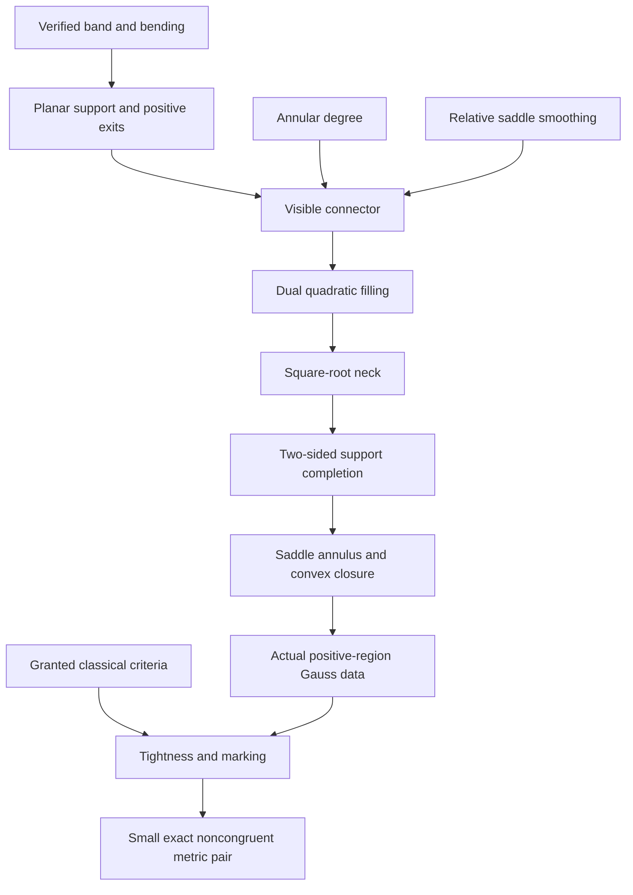

# ver500: route to a nonrigid tight-torus pair

The first objective is two noncongruent smooth embedded tight tori with exactly the same induced metric, agreement on a nonempty open set, and no open planar patch. The full Cantor-family assertion is deferred.

The existing `TightVer401` namespace and engine directory are retained for the checked core. The exact prior ver401 certificate and source snapshot are preserved in `archive/ver401-before-ver500-20261008`.

## Construction order

Protected identity band and bending → actual planar support and positive exits → visible connector with relative saddle smoothing and annular degree → Legendre coordinates and quadratic filling → square-root neck and global two-sided support → saddle annulus and convex closure → marked tight torus → one exact metric pair with noncongruent images.



## Objects and exact interfaces

## Authorized classical and external results

The user authorized granting classical and published external results on 2026-10-09. The first-pair target retains `background : ClassicalExternalResults` and the additional explicit `embeddedImageReparametrization : ClassicalEmbeddedImageReparametrizationClaim` and `ellipseAxesRecognition : MarkerEllipseAxesRecognition`. The exact registry is [classical-external-results.json](../classical-external-results.json); checked interfaces are [ClassicalExternal.lean](../TightVer401/ClassicalExternal.lean). External premises are explicitly assumed, while applications and novel constructions are kernel checked. There is no asserted inhabitant of the background bundle, custom axiom, or grant of the desired torus.

- `E.positive-gauss-tightness`: `TightVer401.ClassicalPositiveGaussTightnessClaim`. Consumers: R.positive-gauss, R.classical-tightness, R.stability. Finite omitted sphere points have zero spherical area, so the positive curvature integral is 4π. The published equality characterization gives tightness directly; Gauss–Bonnet is not required for this conclusion.
  Source: [Banchoff and Kühnel, Tight Submanifolds, Smooth and Polyhedral (1997), §1.1 pp.56–57](https://library.slmath.org/books/Book32/files/banchoff.pdf).
- `E.coincident-embedding-fixed-open`: `TightVer401.ClassicalCoincidentEmbeddingFixedOpenClaim`. Consumers: R.image-separation. Construct f=Y inverse composed with X through smooth embedded-submanifold inverses, differentiate Y composed with f=X, identify f as an isometry for the common actual induced metric, and use fixed-open rigidity. This is not an assumption of markedness or noncongruence.
  Source: [Ralph Cohen, Bundles, Homotopy, and Manifolds, §3.2.3, Theorem3.3/Proposition3.4](https://math.stanford.edu/~ralph/math215b/book.pdf).
  Source: [John M. Lee, Introduction to Riemannian Manifolds, connected local-isometry uniqueness](https://link.springer.com/book/10.1007/978-3-319-91755-9).
- `E.embedded-image-reparametrization`: `TightVer401.ClassicalEmbeddedImageReparametrizationClaim`. Consumers: R.image-separation. Separate explicit theorem parameter; existing two-field ClassicalExternalResults bundle is unchanged. Grants no common metric, curvature, positive image, marking or noncongruence.
  Source: [Ralph Cohen, Bundles, Homotopy, and Manifolds, §3.2.3, Theorem3.3/Proposition3.4](https://math.stanford.edu/~ralph/math215b/book.pdf).
- `E.noncircular-ellipse-axes-recognition`: `TightVer401.MarkerEllipseAxesRecognition`. Consumers: R.marking, torusAffineMarkerEllipse_pair_stabilizer, torusAffineMarker_open_annulus_rigid, torusAffineMarker_actual_meridian_rigid. Elementary COROLLARY, not a verbatim named theorem. Isometry preserves unique long diameter endpoint pair and its center midpoint; distinct long/short extreme endpoint pairs identify both axis lines; orthogonality preserves their 1D normal complement. See overnight-ellipse-background-review.md. Exact ordinary type validated in worker audit a30f703 and reviewed in root; the root combined audit PASS1325/16912 checks its imported consumers; no inhabitant or original marker stabilizer is asserted.
  Source: [OpenStax College Algebra, section8.1 The Ellipse](https://openstax.org/books/college-algebra/pages/8-1-the-ellipse).
  Source: [TU Delft Linear algebra, section8.2 Proposition8.2.5](https://interactivetextbooks.tudelft.nl/linear-algebra/Chapter8/QuadraticForms.html).

## Work removed from the blocking route

General height/component topology, native intrinsic-distance instance packaging, and a general surface-area/Gauss–Bonnet development are parked alternatives. Completed helpers are retained. Neither the external premises nor retained conditional helpers discharge the actual exits, full filling/completion, saddle annulus, exact torus positive locus, affine marking or final image noncongruence.

## Construction milestones

- `R.exits`: pending.
- `R.connector`: pending.
- `R.quadratic-filling`: audited.
- `R.completion`: pending.
- `R.saddle-annulus`: pending.
- `R.torus`: pending.
- `R.positive-gauss`: audited.
- `R.classical-tightness`: audited.
- `R.marking`: pending.
- `R.stability`: pending.
- `R.image-separation`: pending.
- `R.pair-goal`: pending.
### O.plane: Actual plane and ambient space (audited)

Use the actual coordinate plane, Euclidean three-space, Frechet derivatives, induced metric and intrinsic Gaussian curvature from the pinned OpenAI foundation.

Route scope: `primary`. External dependencies: none.

Dependencies: none.

Lean target: `TightVer401.planarHessian`; source: `TightVer401/PlanarSupportForms.lean`.

Interface origin: `kernel_audit`.

```lean
(OAI.SmoothLocal.Geometry.Coord → ℝ) → OAI.SmoothLocal.Geometry.Coord → Matrix (Fin 2) (Fin 2) ℝ
```

### O.frame: Actual periodic physical frame (audited)

A smooth periodic closed curve and orthonormal frame satisfy the actual Frenet-type derivative equations with nowhere-zero torsion. The frame input includes no immersion, holonomy or bending conclusions.

Route scope: `primary`. External dependencies: none.

Dependencies: none.

Lean target: `TightVer401.PeriodicRuledFrame`; source: `TightVer401/PeriodicRuledFrame.lean`.

Interface origin: `kernel_audit`.

```lean
ℝ → Type
```

### O.band: Native ruled band (audited)

The actual map on the native circle times an open positive height interval is gamma(s)+u E(s). All derivatives, normal and Gaussian curvature refer to this actual map.

Route scope: `primary`. External dependencies: none.

Dependencies: `O.frame`.

Lean target: `TightVer401.PeriodicRuledFrame.bandMap`; source: `TightVer401/PeriodicRuledFrame.lean`.

Interface origin: `kernel_audit`.

```lean
{L b : ℝ} → TightVer401.PeriodicRuledFrame L → AddCircle L × ↑(Set.Ioo 0 b) → OAI.SmoothLocal.Geometry.Ambient
```

### O.bending: Actual localized bending (audited)

A native smooth ambient vector field satisfies the zero symmetric mixed derivative pairing. Full topological support, rather than only nonzero values, specifies its protected region.

Route scope: `primary`. External dependencies: none.

Dependencies: `O.band`.

Lean target: `TightVer401.IsBandBending`; source: `TightVer401/PeriodicRuledBending.lean`.

Interface origin: `kernel_audit`.

```lean
{L b : ℝ} →
  [Fact (0 < L)] →
    (AddCircle L × ↑(Set.Ioo 0 b) → OAI.SmoothLocal.Geometry.Ambient) →
      (AddCircle L × ↑(Set.Ioo 0 b) → OAI.SmoothLocal.Geometry.Ambient) → Prop
```

### O.manifold-bending: Actual plane-model manifold bending (audited)

For an actual charted surface in the OpenAI plane model, the smooth ambient field has zero actual symmetric strain pairing on every tangent vector pair. Transporting the protected band field to this global object is a separate application proof.

Route scope: `primary`. External dependencies: none.

Dependencies: none.

Lean target: `TightVer401.Manifold.IsBending`; source: `TightVer401/ManifoldBranching.lean`.

Interface origin: `kernel_audit`.

```lean
{M : Type u_1} →
  [inst : TopologicalSpace M] →
    [ChartedSpace OAI.ClosedSurfaceR4.Plane M] →
      (M → TightVer401.Manifold.ThreeSpace) → (M → TightVer401.Manifold.ThreeSpace) → Prop
```

### O.support: Actual planar support potential (audited)

G is an actual smooth scalar potential; X_G=(partial_0 G,partial_1 G,G-p dot grad G), and the Hessian is formed from its actual second derivatives.

Route scope: `primary`. External dependencies: none.

Dependencies: `O.plane`.

Lean target: `TightVer401.planarSupportMap`; source: `TightVer401/PlanarSupport.lean`.

Interface origin: `kernel_audit`.

```lean
(OAI.SmoothLocal.Geometry.Coord → ℝ) → OAI.SmoothLocal.Geometry.Coord → OAI.SmoothLocal.Geometry.Ambient
```

### O.dual: Differential Legendre transform (audited)

For an actual gradient diffeomorphism, G*(y)=p dot y-G(p), y=grad G(p). The actual inverse gradient defines the transform; convexity is not assumed.

Route scope: `primary`. External dependencies: none.

Dependencies: `O.support`.

Lean target: `TightVer401.planarLegendre`; source: `TightVer401/PlanarLegendre.lean`.

Interface origin: `kernel_audit`.

```lean
(OAI.SmoothLocal.Geometry.Coord → ℝ) →
  OpenPartialHomeomorph OAI.SmoothLocal.Geometry.Coord OAI.SmoothLocal.Geometry.Coord →
    OAI.SmoothLocal.Geometry.Coord → ℝ
```

### O.polar: Actual polar coordinate map (audited)

Phi(r,theta)=(r cos theta,r sin theta), on r>0. Its actual Jacobian determinant is r; polar Hessian expressions include chart second-derivative corrections.

Route scope: `primary`. External dependencies: none.

Dependencies: `O.plane`.

Lean target: `TightVer401.saddlePolarChart`; source: `TightVer401/PolarSaddleSignCalculus.lean`.

Interface origin: `kernel_audit`.

```lean
OAI.SmoothLocal.Geometry.Coord → OAI.SmoothLocal.Geometry.Coord
```

### O.quadratic: Quadratic radial end germ (audited)

f(r)=M R r-M r^2/2+d, with R,M>0. The support map and its boundary-circle resolution are actual derivatives of this germ.

Route scope: `primary`. External dependencies: none.

Dependencies: `O.support`.

Lean target: `TightVer401.dualRadialQuadraticProfile`; source: `TightVer401/DualRadialQuadraticGerm.lean`.

Interface origin: `kernel_audit`.

```lean
ℝ → ℝ → ℝ → ℝ → ℝ
```

### O.neck: Square-root dual neck (audited)

f_neck(r)=C+2 sqrt(B(r-a)), B>0,r>a. Its inverse gradient radius is a+B/p^2 and its inverse Legendre potential is a p-B/p-C.

Route scope: `primary`. External dependencies: none.

Dependencies: `O.dual`.

Lean target: `TightVer401.dualRadialNeck`; source: `TightVer401/DualRadialNeckCalculus.lean`.

Interface origin: `kernel_audit`.

```lean
ℝ → ℝ → ℝ → ℝ → ℝ
```

### O.torus: Actual torus source (audited)

The actual carrier is the native product of two quotient circles. Smooth structure, compactness, connectedness and annulus assembly have separate proof obligations.

Route scope: `primary`. External dependencies: none.

Dependencies: none.

Lean target: `TightVer401.NonrigidTorusSource`; source: `TightVer401/TorusGoalObjects.lean`.

Interface origin: `kernel_audit`.

```lean
Type
```

### O.tightness: Geometric tightness (audited)

Tightness means every nonempty intersection of the image with an open affine half-space is connected. The curvature equality characterization is a separate theorem, not the definition.

Route scope: `primary`. External dependencies: none.

Dependencies: none.

Lean target: `TightVer401.IsTightImage`; source: `TightVer401/TorusGoalObjects.lean`.

Interface origin: `kernel_audit`.

```lean
{M : Type u_1} → (M → OAI.SmoothLocal.Geometry.Ambient) → Prop
```

### O.no-planar-patch: Absence of open planar patches (audited)

No nonempty open part of the actual source maps into an affine plane: every nonzero ambient continuous linear functional fails to be constant on that part.

Route scope: `primary`. External dependencies: none.

Dependencies: none.

Lean target: `TightVer401.HasNoOpenPlanarPatch`; source: `TightVer401/TorusGoalObjects.lean`.

Interface origin: `kernel_audit`.

```lean
{M : Type u_1} → [TopologicalSpace M] → (M → OAI.SmoothLocal.Geometry.Ambient) → Prop
```

### O.noncongruence: Noncongruence of images (audited)

For every ambient Euclidean affine isometry A, A(range Xplus) differs from range Xminus. Distinct parametrized maps alone are insufficient.

Route scope: `primary`. External dependencies: none.

Dependencies: none.

Lean target: `TightVer401.ImageNoncongruent`; source: `TightVer401/TorusGoalObjects.lean`.

Interface origin: `kernel_audit`.

```lean
{M : Type u_1} → (M → OAI.SmoothLocal.Geometry.Ambient) → (M → OAI.SmoothLocal.Geometry.Ambient) → Prop
```

### O.actual-graph-cylinder-data: Ordinary same-scalar completed cylinder data (audited)

Retain actual G/e/beta, scalar end constants and actual gradient/Hessian/smoothness/germ data, with literal equality to the SAME saddle cylinder. This object contains no asserted normal, curvature sign, positive region, Gauss inverse or tightness result.

Route scope: `primary`. External dependencies: none.

Dependencies: `O.support`, `O.dual`.

Lean target: `TightVer401.ProtectedTorusActualGraphCylinderData`; source: `TightVer401/ProtectedTorusPositiveGaussCurvatureActualGraphCylinder.lean`.

Interface origin: `kernel_audit`.

```lean
{RN mu h : ℝ} → TightVer401.ProtectedSaddleCylinderInput RN mu h → Type
```

Additional required audited interface: `TightVer401.protectedTorusActualGraphCylinderData_of_ordinary`.

```lean
{RN mu h : ℝ} →
  (S : TightVer401.ProtectedSaddleCylinderInput RN mu h) →
    (G : OAI.SmoothLocal.Geometry.Coord → ℝ) →
      (e : OpenPartialHomeomorph OAI.SmoothLocal.Geometry.Coord OAI.SmoothLocal.Geometry.Coord) →
        (beta : ℝ → ℝ) →
          (A B L d0 dInfinity : ℝ) →
            0 < A →
              A < RN →
                0 < B →
                  0 < L →
                    e.source = {p | 0 < TightVer401.planarRadius p} →
                      e.target = TightVer401.quadraticRadialFillingOpenAnnulus A RN →
                        ContDiffOn ℝ (↑⊤) G e.source →
                          ContDiffOn ℝ (↑⊤) (↑e.symm) e.target →
                            (∀ p ∈ e.source, ↑e p = TightVer401.planarGradient G p) →
                              (∀ p ∈ e.source, (TightVer401.planarHessian G p).det < 0) →
                                (∀ (p : OAI.SmoothLocal.Geometry.Coord),
                                    L < TightVer401.planarRadius p →
                                      G p =
                                        A * TightVer401.planarRadius p - B / TightVer401.planarRadius p + dInfinity) →
                                  ContDiff ℝ (↑⊤) beta →
                                    StrictMonoOn beta (Set.Icc (Real.pi / 2) Real.pi) →
                                      beta (Real.pi / 2) = A →
                                        beta Real.pi = RN →
                                          (∀ u ∈ Set.Ioo (Real.pi / 2) Real.pi, 0 < deriv beta u) →
                                            (beta =ᶠ[nhds (Real.pi / 2)] fun u => A + B * (u - Real.pi / 2) ^ 2) →
                                              S.saddle =
                                                  TightVer401.completedSaddleAnnulusCylinderMap G e A RN d0 dInfinity
                                                    beta →
                                                TightVer401.ProtectedTorusActualGraphCylinderData S
```

### E.embedded-image-reparametrization: Granted smooth embedded-image reparameterization (external_assumed)

Two actual infinity-smooth embedded immersions of the native torus with equal entire images have an actual source homeomorphism smooth in both directions intertwining their maps. This additional explicit classical parameter supplies only embedded-submanifold inversion; all curvature covariance and marking applications remain proved obligations.

Route scope: `primary`. External dependencies: E.embedded-image-reparametrization.

Dependencies: `O.torus`.

Lean target: `TightVer401.ClassicalEmbeddedImageReparametrizationClaim`; source: `TightVer401/ClassicalEmbeddedReparam.lean`.

Interface origin: `kernel_audit`.

```lean
Prop
```

Additional required audited interface: `TightVer401.classicalEmbeddedImages_reparametrize`.

```lean
TightVer401.ClassicalEmbeddedImageReparametrizationClaim →
  ∀ (X Y : TightVer401.NonrigidTorusSource → OAI.SmoothLocal.Geometry.Ambient),
    TightVer401.NativeTorusSmoothEmbedding X →
      TightVer401.NativeTorusSmoothEmbedding Y →
        Set.range X = Set.range Y →
          ∃ e,
            ContMDiff TightVer401.nativeProductModel TightVer401.nativeProductModel ↑⊤ ⇑e ∧
              ContMDiff TightVer401.nativeProductModel TightVer401.nativeProductModel ↑⊤ ⇑e.symm ∧
                ∀ (p : TightVer401.NonrigidTorusSource), Y (e p) = X p
```

### E.positive-gauss-tightness: Granted positive-Gauss tightness criterion (external_assumed)

For an actual smooth embedded native torus and its actual smooth unit normal, a smooth inverse Gauss chart covering exactly the entire K>0 locus and the sphere minus finitely many points implies the existing open-half-space tightness predicate. This is a named classical corollary of Gauss area and Banchoff–Kühnel §1.1. All actual geometry inputs remain producer obligations.

Route scope: `primary`. External dependencies: E.positive-gauss-tightness.

Dependencies: `O.tightness`, `R.model-transport`.

Lean target: `TightVer401.ClassicalPositiveGaussTightnessClaim`; source: `TightVer401/ClassicalExternal.lean`.

Interface origin: `kernel_audit`.

```lean
Prop
```

Additional required audited interface: `TightVer401.ClassicalExternalResults`.

```lean
Prop
```

Additional required audited interface: `TightVer401.classicalPositiveGauss_tightness`.

```lean
TightVer401.ClassicalExternalResults →
  ∀ (X : TightVer401.NonrigidTorusSource → OAI.SmoothLocal.Geometry.Ambient),
    TightVer401.NativeTorusSmoothEmbedding X →
      ∀ (N : TightVer401.NonrigidTorusSource → ↑TightVer401.RoundSphere),
        ContMDiff TightVer401.nativeProductModel (modelWithCornersSelf ℝ (EuclideanSpace ℝ (Fin 2))) (↑⊤) N →
          (∀ (p : TightVer401.NonrigidTorusSource) (v : ℝ × ℝ), inner ℝ (↑(N p)) ((mfderiv% X p) v) = 0) →
            ∀ (E : Set ↑TightVer401.RoundSphere),
              E.Finite →
                ∀ (e : OpenPartialHomeomorph TightVer401.NonrigidTorusSource ↑TightVer401.RoundSphere),
                  e.source = TightVer401.nativeTorusPositiveRegion X →
                    e.target = Set.univ \ E →
                      Set.EqOn (↑e) N e.source →
                        ContMDiffOn TightVer401.nativeProductModel (modelWithCornersSelf ℝ (EuclideanSpace ℝ (Fin 2)))
                            (↑⊤) (↑e) e.source →
                          ContMDiffOn (modelWithCornersSelf ℝ (EuclideanSpace ℝ (Fin 2))) TightVer401.nativeProductModel
                              (↑⊤) (↑e.symm) e.target →
                            TightVer401.IsTightImage X
```

### E.coincident-embedding-fixed-open: Granted equal-image fixed-open rigidity corollary (external_assumed)

Actual smooth embedded immersions on the same connected native torus with equal pointwise induced forms, equal entire images and agreement on a nonempty open set are equal maps. This packages the classical smooth embedded-submanifold inverse and connected Riemannian isometry uniqueness; it grants neither affine markedness nor image noncongruence.

Route scope: `primary`. External dependencies: E.coincident-embedding-fixed-open.

Dependencies: `O.torus`, `R.model-transport`.

Lean target: `TightVer401.ClassicalCoincidentEmbeddingFixedOpenClaim`; source: `TightVer401/ClassicalExternal.lean`.

Interface origin: `kernel_audit`.

```lean
Prop
```

Additional required audited interface: `TightVer401.classicalCoincidentEmbeddings_eq`.

```lean
TightVer401.ClassicalExternalResults →
  ∀ (X Y : TightVer401.NonrigidTorusSource → OAI.SmoothLocal.Geometry.Ambient),
    TightVer401.NativeTorusSmoothEmbedding X →
      TightVer401.NativeTorusSmoothEmbedding Y →
        (∀ (p : TightVer401.NonrigidTorusSource) (v w : ℝ × ℝ),
            TightVer401.nativeProductInducedForm X p v w = TightVer401.nativeProductInducedForm Y p v w) →
          Set.range X = Set.range Y →
            ∀ (U : Set TightVer401.NonrigidTorusSource), IsOpen U → U.Nonempty → Set.EqOn X Y U → X = Y
```

### E.noncircular-ellipse-axes-recognition: Granted generic single noncircular ellipse recognition (external_assumed)

An actual ambient affine isometry between equally oriented translates of one noncircular ellipse transports its center and has signed diagonal linear action. This elementary corollary grants no two-ellipse boundary, same-meridian asymmetry or original marker stabilizer. Exact ordinary single-ellipse type is locally checked in worker a30f703; current root audit determines imported application certification.

Route scope: `primary`. External dependencies: E.noncircular-ellipse-axes-recognition.

Dependencies: `O.torus`.

Lean target: `TightVer401.MarkerEllipseAxesRecognition`; source: `TightVer401/TorusAffineMarkerEllipseBasic.lean`.

Interface origin: `kernel_audit`.

```lean
Prop
```

### R.torus-source: Derive the native compact connected smooth torus source (audited)

Construct the native ModelProd real-product charts and derive compactness, connectedness and the infinity smooth manifold structure; no embedding is supplied.

Route scope: `primary`. External dependencies: none.

Dependencies: `O.torus`.

Lean target: `TightVer401.nonrigidTorusSource_isManifold`; source: `TightVer401/TorusSourceGeometry.lean`.

Interface origin: `kernel_audit`.

```lean
IsManifold ((modelWithCornersSelf ℝ ℝ).prod (modelWithCornersSelf ℝ ℝ)) (↑⊤) TightVer401.NonrigidTorusSource
```

Additional required audited interface: `TightVer401.nonrigidTorusSource_compact`.

```lean
CompactSpace TightVer401.NonrigidTorusSource
```

Additional required audited interface: `TightVer401.nonrigidTorusSource_connected`.

```lean
ConnectedSpace TightVer401.NonrigidTorusSource
```

Additional required audited interface: `TightVer401.nonrigidTorusSource_chartedSpace`.

```lean
ChartedSpace (ModelProd ℝ ℝ) TightVer401.NonrigidTorusSource
```

Additional required audited interface: `TightVer401.nonrigidTorusSource_realProductChartedSpace`.

```lean
ChartedSpace (ℝ × ℝ) TightVer401.NonrigidTorusSource
```

### R.model-transport: Transport native product charts to the OpenAI plane model (audited)

Construct the actual continuous linear smooth equivalence between the native two-real-coordinate model and the OpenAI Euclidean plane model. Derive chart, manifold differential, induced form and local curvature compatibility for the actual band and torus. This application bridge is not supplied by a theorem stated only in the plane model.

Route scope: `primary`. External dependencies: none.

Dependencies: `O.plane`.

Proof route: Use the finite-dimensional continuous linear equivalence and its inverse to transport the actual atlas; apply the chain rule and the checked coordinate-invariance formulas.

Lean target: `TightVer401.native_product_plane_geometry_transport`; source: `TightVer401/NativeProductPlaneTransport.lean`.

Interface origin: `kernel_audit`.

```lean
∀ (M : Type u_1) [inst : TopologicalSpace M] [inst_1 : ChartedSpace (ModelProd ℝ ℝ) M]
  [IsManifold TightVer401.nativeProductModel (↑⊤) M],
  IsManifold OAI.ClosedSurfaceR4.planeModel (↑⊤) M ∧
    ∀ (F : M → OAI.SmoothLocal.Geometry.Ambient),
      ContMDiff TightVer401.nativeProductModel (modelWithCornersSelf ℝ OAI.SmoothLocal.Geometry.Ambient) (↑⊤) F →
        ContMDiff OAI.ClosedSurfaceR4.planeModel (modelWithCornersSelf ℝ OAI.SmoothLocal.Geometry.Ambient) (↑⊤) F ∧
          (∀ (p : M) (v w : ℝ × ℝ),
              (OAI.ClosedSurfaceR4.surfaceDifferential F p) (TightVer401.nativeProductPlaneEquiv v) = (mfderiv% F p) v ∧
                OAI.ClosedSurfaceR4.inducedForm F p (TightVer401.nativeProductPlaneEquiv v)
                    (TightVer401.nativeProductPlaneEquiv w) =
                  TightVer401.nativeProductInducedForm F p v w) ∧
            ∀ (p : M) (q : OAI.SmoothLocal.Geometry.Coord),
              OAI.SmoothLocal.Geometry.gaussianCurvature
                  (OAI.SmoothLocal.Geometry.inducedMetric (TightVer401.nativeProductPlaneCoordinateMap F p)) q =
                OAI.SmoothLocal.Geometry.gaussianCurvature
                  (OAI.SmoothLocal.Geometry.inducedMetric (TightVer401.nativeProductCoordinateMap F p)) q
```

Additional required audited interface: `TightVer401.nativeProductPlane_band_geometry`.

```lean
∀ {L b : ℝ} [inst : Fact (0 < L)] (d : TightVer401.PeriodicRuledFrame L),
  IsManifold OAI.ClosedSurfaceR4.planeModel (↑⊤) (AddCircle L × ↑(Set.Ioo 0 b)) ∧
    ContMDiff OAI.ClosedSurfaceR4.planeModel (modelWithCornersSelf ℝ OAI.SmoothLocal.Geometry.Ambient) (↑⊤) d.bandMap ∧
      ∀ (p : AddCircle L × ↑(Set.Ioo 0 b)),
        Function.Injective ⇑(OAI.ClosedSurfaceR4.surfaceDifferential d.bandMap p) ∧
          OAI.SmoothLocal.Geometry.gaussianCurvature
              (OAI.SmoothLocal.Geometry.inducedMetric (TightVer401.nativeProductPlaneCoordinateMap d.bandMap p))
              ![0, ↑p.2] <
            0
```

Additional required audited interface: `TightVer401.nativeProductPlane_band_gauss_support`.

```lean
∀ {L b : ℝ} [Fact (0 < L)] (d : TightVer401.PeriodicRuledFrame L) {U : Set (AddCircle L × ↑(Set.Ioo 0 b))},
  IsOpen U →
    Set.InjOn d.bandSphereGauss U →
      ∃ H,
        IsOpen (d.bandSphereGauss '' U) ∧
          ContMDiffOn (modelWithCornersSelf ℝ (EuclideanSpace ℝ (Fin 2))) (modelWithCornersSelf ℝ ℝ) (↑⊤) H
              (d.bandSphereGauss '' U) ∧
            ∀ p ∈ U, d.bandMap p = TightVer401.globalSphereSupport H (d.bandSphereGauss p)
```

### R.band: Retain the verified protected identity band and bending (audited)

From N>=10000 and eta>0 construct the same corrected speed, physical frame, embedded identity band and protected closed-leaf annulus. The entire compact support of a nonzero bending lies inside that annulus. Proved compact-support stability gives distinct opposite embedded band maps with equal actual induced forms and negative curvature for all sufficiently small amplitudes.

Route scope: `primary`. External dependencies: none.

Dependencies: `O.band`, `O.bending`.

Lean target: `TightVer401.corrugatedSeed_exists_protected_identity_band_bending`; source: `TightVer401/CorrugatedIdentityBendingBand.lean`.

Interface origin: `kernel_audit`.

```lean
∀ {N : ℕ},
  10000 ≤ N →
    ∀ {η : ℝ},
      0 < η →
        have ell := TightVer401.corrugatedSeedArcCell ↑N;
        have L := ↑N * ell;
        ∃ e,
          ⇑e = TightVer401.corrugatedSeedArcMap ↑N ∧
            ContDiff ℝ ↑⊤ ⇑e.symm ∧
              ∃ a,
                ContDiff ℝ (↑⊤) a ∧
                  Function.Periodic a ell ∧
                    (∀ (r : ℝ), 0 < a r) ∧
                      ∫ (r : ℝ) in 0..ell, ‖a r - TightVer401.corrugatedSeedInitialSpeed (↑N) (⇑e.symm) r‖ < η ∧
                        ∫ (r : ℝ) in 0..L,
                              a r • TightVer401.normalLoopTangent (TightVer401.corrugatedSeedSphere ↑N ∘ ⇑e.symm) r =
                            0 ∧
                          ∫ (r : ℝ) in 0..L,
                                deriv (TightVer401.normalLoopCurvature (TightVer401.corrugatedSeedSphere ↑N ∘ ⇑e.symm))
                                    r /
                                  √(a r) =
                              0 ∧
                            TightVer401.ComplexVisiblePair (1 / 4) (TightVer401.corrugatedSeedBeta ↑N ∘ ⇑e.symm)
                                (TightVer401.corrugatedSeedBalancedPartner (↑N) (⇑e.symm) ell a) ∧
                              TightVer401.ComplexVisiblePair (4 / 5)
                                  (TightVer401.corrugatedReverseReflect
                                    (TightVer401.corrugatedSeedBalancedPartner (↑N) (⇑e.symm) ell a))
                                  (TightVer401.corrugatedReverseReflect (TightVer401.corrugatedSeedBeta ↑N ∘ ⇑e.symm)) ∧
                                ∃ S,
                                  ⇑S = OAI.ClosedSurfaceR4.PeriodicPrimitive.rawPrimitive a ∧
                                    ContDiff ℝ ↑⊤ ⇑S.symm ∧
                                      ∃ d,
                                        d.γ = TightVer401.corrugatedSeedBalancedSpatial (↑N) (⇑e.symm) ell a ∘ ⇑S.symm ∧
                                          d.T =
                                              TightVer401.normalLoopTangent
                                                  (TightVer401.corrugatedSeedSphere ↑N ∘ ⇑e.symm) ∘
                                                ⇑S.symm ∧
                                            d.E = deriv (TightVer401.corrugatedSeedSphere ↑N ∘ ⇑e.symm) ∘ ⇑S.symm ∧
                                              d.n = (TightVer401.corrugatedSeedSphere ↑N ∘ ⇑e.symm) ∘ ⇑S.symm ∧
                                                d.k =
                                                    TightVer401.normalLoopPhysicalK a
                                                      (TightVer401.normalLoopCurvature
                                                        (TightVer401.corrugatedSeedSphere ↑N ∘ ⇑e.symm))
                                                      ⇑S.symm ∧
                                                  d.τ = TightVer401.normalLoopPhysicalTau a ⇑S.symm ∧
                                                    TightVer401.PrincipalNormalIdentityBand d ∧
                                                      ∃ (hT :
                                                        0 < OAI.ClosedSurfaceR4.PeriodicPrimitive.rawPrimitive a L),
                                                        ∃ w > 0,
                                                          ContMDiff
                                                              ((modelWithCornersSelf ℝ ℝ).prod
                                                                (modelWithCornersSelf ℝ ℝ))
                                                              (modelWithCornersSelf ℝ OAI.SmoothLocal.Geometry.Ambient)
                                                              (↑⊤) d.bandMap ∧
                                                            (∀
                                                                (p :
                                                                  AddCircle
                                                                      (OAI.ClosedSurfaceR4.PeriodicPrimitive.rawPrimitive
                                                                        a L) ×
                                                                    ↑(Set.Ioo 0 w)),
                                                                Function.Injective
                                                                  ⇑(TightVer401.bandDifferential d.bandMap p)) ∧
                                                              Topology.IsEmbedding d.bandMap ∧
                                                                Topology.IsEmbedding
                                                                    (⇑TightVer401.corrugatedAmbientHorizontalCLM ∘
                                                                      d.bandMap) ∧
                                                                  ContMDiff
                                                                      ((modelWithCornersSelf ℝ ℝ).prod
                                                                        (modelWithCornersSelf ℝ ℝ))
                                                                      (modelWithCornersSelf ℝ ℂ) (↑⊤)
                                                                      (⇑TightVer401.corrugatedAmbientHorizontalCLM ∘
                                                                        d.bandMap) ∧
                                                                    (∀
                                                                        (p :
                                                                          AddCircle
                                                                              (OAI.ClosedSurfaceR4.PeriodicPrimitive.rawPrimitive
                                                                                a L) ×
                                                                            ↑(Set.Ioo 0 w)),
                                                                        Function.Injective
                                                                          ⇑(mfderiv%
                                                                                (⇑TightVer401.corrugatedAmbientHorizontalCLM ∘
                                                                                  d.bandMap)
                                                                              p)) ∧
                                                                      (Function.Injective fun p =>
                                                                          d.fullGaussMap (p.1, ↑p.2)) ∧
                                                                        (∀
                                                                            (p :
                                                                              AddCircle
                                                                                  (OAI.ClosedSurfaceR4.PeriodicPrimitive.rawPrimitive
                                                                                    a L) ×
                                                                                ↑(Set.Ioo 0 w)),
                                                                            0 < (d.fullGaussMap (p.1, ↑p.2)).ofLp 2) ∧
                                                                          ContMDiff
                                                                              ((modelWithCornersSelf ℝ ℝ).prod
                                                                                (modelWithCornersSelf ℝ ℝ))
                                                                              (modelWithCornersSelf ℝ
                                                                                (EuclideanSpace ℝ (Fin 2)))
                                                                              (↑⊤) d.bandSphereGauss ∧
                                                                            Function.Injective d.bandSphereGauss ∧
                                                                              (∀
                                                                                  (p :
                                                                                    AddCircle
                                                                                        (OAI.ClosedSurfaceR4.PeriodicPrimitive.rawPrimitive
                                                                                          a L) ×
                                                                                      ↑(Set.Ioo 0 w)),
                                                                                  Function.Injective
                                                                                    ⇑(mfderiv% d.bandSphereGauss p)) ∧
                                                                                (∀
                                                                                    (p :
                                                                                      AddCircle
                                                                                          (OAI.ClosedSurfaceR4.PeriodicPrimitive.rawPrimitive
                                                                                            a L) ×
                                                                                        ↑(Set.Ioo 0 w))
                                                                                    (v : ℝ × ℝ),
                                                                                    inner ℝ
                                                                                        ((TightVer401.bandDifferential
                                                                                            d.bandMap p)
                                                                                          v)
                                                                                        (d.bandGaussMap p) =
                                                                                      0) ∧
                                                                                  TightVer401.IdentityReturnInsideBand d
                                                                                      w ∧
                                                                                    TightVer401.CompleteIdentityBand d
                                                                                        w ∧
                                                                                      TightVer401.SaturatedIdentitySubband
                                                                                          d w ∧
                                                                                        TightVer401.ProtectedIdentityBendingSubband
                                                                                          d w
```

Additional required audited interface: `TightVer401.periodicRuledFrame_exists_identity_bending_curvature_pair`.

```lean
∀ {L b : ℝ} [inst : Fact (0 < L)] (d : TightVer401.PeriodicRuledFrame L),
  TightVer401.PrincipalNormalIdentityBand d →
    0 < b →
      Topology.IsEmbedding d.bandMap →
        ∃ Y,
          TightVer401.IsBandBending d.bandMap Y ∧
            HasCompactSupport Y ∧
              (∃ p, Y p ≠ 0) ∧
                ∃ δ > 0,
                  (∀ (a : ℝ),
                      |a| < δ →
                        TightVer401.bandInducedForm (d.bandMap + a • Y) =
                            TightVer401.bandInducedForm (d.bandMap - a • Y) ∧
                          ∀ (p : OAI.SmoothLocal.Geometry.Coord),
                            OAI.SmoothLocal.Geometry.gaussianCurvature
                                  (OAI.SmoothLocal.Geometry.inducedMetric fun q =>
                                    TightVer401.ruledMap d.γ d.E q + a • TightVer401.bandCoordinateLift Y q)
                                  p <
                                0 ∧
                              OAI.SmoothLocal.Geometry.gaussianCurvature
                                  (OAI.SmoothLocal.Geometry.inducedMetric fun q =>
                                    TightVer401.ruledMap d.γ d.E q - a • TightVer401.bandCoordinateLift Y q)
                                  p <
                                0) ∧
                    ∀ (a : ℝ), a ≠ 0 → d.bandMap + a • Y ≠ d.bandMap - a • Y
```

Additional required audited interface: `TightVer401.periodicRuledFrame_exists_identity_embedded_curvature_pair`.

```lean
∀ {L b : ℝ} [inst : Fact (0 < L)] (d : TightVer401.PeriodicRuledFrame L),
  TightVer401.PrincipalNormalIdentityBand d →
    0 < b →
      Topology.IsEmbedding d.bandMap →
        ∃ Y,
          TightVer401.IsBandBending d.bandMap Y ∧
            HasCompactSupport Y ∧
              (∃ p, Y p ≠ 0) ∧
                ∃ δ > 0,
                  (∀ (a : ℝ),
                      |a| < δ →
                        Topology.IsEmbedding (d.bandMap + a • Y) ∧
                          Topology.IsEmbedding (d.bandMap - a • Y) ∧
                            TightVer401.bandInducedForm (d.bandMap + a • Y) =
                                TightVer401.bandInducedForm (d.bandMap - a • Y) ∧
                              ∀ (p : AddCircle L × ↑(Set.Ioo 0 b)),
                                OAI.SmoothLocal.Geometry.gaussianCurvature
                                      (OAI.SmoothLocal.Geometry.inducedMetric
                                        (TightVer401.nativeProductPlaneCoordinateMap (d.bandMap + a • Y) p))
                                      ![0, ↑p.2] <
                                    0 ∧
                                  OAI.SmoothLocal.Geometry.gaussianCurvature
                                      (OAI.SmoothLocal.Geometry.inducedMetric
                                        (TightVer401.nativeProductPlaneCoordinateMap (d.bandMap - a • Y) p))
                                      ![0, ↑p.2] <
                                    0) ∧
                    ∀ (a : ℝ), a ≠ 0 → d.bandMap + a • Y ≠ d.bandMap - a • Y
```

### R.support-calculus: Retain actual support reconstruction and dual calculus (audited)

For an already supplied smooth spherical support potential on an open northern sphere domain, reconstruct its actual support in planar gnomonic coordinates. This theorem supplies neither the particular band potential nor a global gradient inverse.

Route scope: `primary`. External dependencies: none.

Dependencies: `O.support`, `O.dual`.

Lean target: `TightVer401.gnomonicSupport_reconstruction`; source: `TightVer401/GnomonicSupport.lean`.

Interface origin: `kernel_audit`.

```lean
∀ {H : ↑TightVer401.RoundSphere → ℝ} {Ω : Set ↑TightVer401.RoundSphere},
  ContMDiffOn (modelWithCornersSelf ℝ (EuclideanSpace ℝ (Fin 2))) (modelWithCornersSelf ℝ ℝ) (↑⊤) H Ω →
    IsOpen Ω →
      (∀ q ∈ Ω, 0 < (↑q).ofLp 2) →
        ∀ {p : OAI.SmoothLocal.Geometry.Coord},
          TightVer401.gnomonicPoint p ∈ Ω →
            TightVer401.planarSupportMap (TightVer401.gnomonicPotential H) p =
              TightVer401.globalSphereSupport H (TightVer401.gnomonicPoint p)
```

### R.core-support: Represent this particular protected band by a global planar potential (audited)

Derive the actual open Gauss-image inverse and one support potential on the band image. Its source and gradient maps are diffeomorphisms onto annuli; identify the retained bending region.

Route scope: `primary`. External dependencies: none.

Dependencies: `R.band`, `R.support-calculus`, `R.model-transport`.

Proof route: Join the checked local Gauss inverses using injectivity, then identify the actual gradient with horizontal projection and retain the precise support image.

Lean target: `TightVer401.identityBand_exists_planar_support_annulus`; source: `TightVer401/IdentityBandPlanarSupport.lean`.

Interface origin: `kernel_audit`.

```lean
∀ {N : ℕ},
  10000 ≤ N →
    ∀ {η : ℝ},
      0 < η →
        have ell := TightVer401.corrugatedSeedArcCell ↑N;
        have L := ↑N * ell;
        ∃ e,
          ⇑e = TightVer401.corrugatedSeedArcMap ↑N ∧
            ContDiff ℝ ↑⊤ ⇑e.symm ∧
              ∃ a,
                ContDiff ℝ (↑⊤) a ∧
                  Function.Periodic a ell ∧
                    (∀ (r : ℝ), 0 < a r) ∧
                      ∫ (r : ℝ) in 0..ell, ‖a r - TightVer401.corrugatedSeedInitialSpeed (↑N) (⇑e.symm) r‖ < η ∧
                        ∃ S,
                          ⇑S = OAI.ClosedSurfaceR4.PeriodicPrimitive.rawPrimitive a ∧
                            ContDiff ℝ ↑⊤ ⇑S.symm ∧
                              ∃ d,
                                d.γ = TightVer401.corrugatedSeedBalancedSpatial (↑N) (⇑e.symm) ell a ∘ ⇑S.symm ∧
                                  d.T =
                                      TightVer401.normalLoopTangent (TightVer401.corrugatedSeedSphere ↑N ∘ ⇑e.symm) ∘
                                        ⇑S.symm ∧
                                    d.E = deriv (TightVer401.corrugatedSeedSphere ↑N ∘ ⇑e.symm) ∘ ⇑S.symm ∧
                                      d.n = (TightVer401.corrugatedSeedSphere ↑N ∘ ⇑e.symm) ∘ ⇑S.symm ∧
                                        d.k =
                                            TightVer401.normalLoopPhysicalK a
                                              (TightVer401.normalLoopCurvature
                                                (TightVer401.corrugatedSeedSphere ↑N ∘ ⇑e.symm))
                                              ⇑S.symm ∧
                                          d.τ = TightVer401.normalLoopPhysicalTau a ⇑S.symm ∧
                                            TightVer401.PrincipalNormalIdentityBand d ∧
                                              ∃ (hT : 0 < OAI.ClosedSurfaceR4.PeriodicPrimitive.rawPrimitive a L),
                                                ∃ w > 0,
                                                  Topology.IsEmbedding d.bandMap ∧
                                                    TightVer401.ProtectedIdentityBendingSubband d w ∧
                                                      TightVer401.IdentityBandPlanarSupportAnnulus d w
```

### R.central-tensor: Compute the central support tensor (audited)

Compute the actual central mixed entry and signed tangential entry from the same balanced speed and spherical curvature. Identify noncharacteristic positive seam directions.

Route scope: `primary`. External dependencies: none.

Dependencies: `R.core-support`.

Lean target: `TightVer401.identityBand_central_support_tensor`; source: `TightVer401/IdentityBandCentralSupport.lean`.

Interface origin: `kernel_audit`.

```lean
∀ {N : ℕ},
  10000 ≤ N →
    ∀ {η : ℝ},
      0 < η →
        have ell := TightVer401.corrugatedSeedArcCell ↑N;
        have L := ↑N * ell;
        ∃ e,
          ⇑e = TightVer401.corrugatedSeedArcMap ↑N ∧
            ContDiff ℝ ↑⊤ ⇑e.symm ∧
              ∃ a,
                ContDiff ℝ (↑⊤) a ∧
                  Function.Periodic a ell ∧
                    (∀ (r : ℝ), 0 < a r) ∧
                      ∫ (r : ℝ) in 0..ell, ‖a r - TightVer401.corrugatedSeedInitialSpeed (↑N) (⇑e.symm) r‖ < η ∧
                        ∫ (r : ℝ) in 0..L,
                              a r • TightVer401.normalLoopTangent (TightVer401.corrugatedSeedSphere ↑N ∘ ⇑e.symm) r =
                            0 ∧
                          ∫ (r : ℝ) in 0..L,
                                deriv (TightVer401.normalLoopCurvature (TightVer401.corrugatedSeedSphere ↑N ∘ ⇑e.symm))
                                    r /
                                  √(a r) =
                              0 ∧
                            TightVer401.ComplexVisiblePair (1 / 4) (TightVer401.corrugatedSeedBeta ↑N ∘ ⇑e.symm)
                                (TightVer401.corrugatedSeedBalancedPartner (↑N) (⇑e.symm) ell a) ∧
                              TightVer401.ComplexVisiblePair (4 / 5)
                                  (TightVer401.corrugatedReverseReflect
                                    (TightVer401.corrugatedSeedBalancedPartner (↑N) (⇑e.symm) ell a))
                                  (TightVer401.corrugatedReverseReflect (TightVer401.corrugatedSeedBeta ↑N ∘ ⇑e.symm)) ∧
                                ∃ S,
                                  ⇑S = OAI.ClosedSurfaceR4.PeriodicPrimitive.rawPrimitive a ∧
                                    ContDiff ℝ ↑⊤ ⇑S.symm ∧
                                      ∃ d,
                                        d.γ = TightVer401.corrugatedSeedBalancedSpatial (↑N) (⇑e.symm) ell a ∘ ⇑S.symm ∧
                                          d.T =
                                              TightVer401.normalLoopTangent
                                                  (TightVer401.corrugatedSeedSphere ↑N ∘ ⇑e.symm) ∘
                                                ⇑S.symm ∧
                                            d.E = deriv (TightVer401.corrugatedSeedSphere ↑N ∘ ⇑e.symm) ∘ ⇑S.symm ∧
                                              d.n = (TightVer401.corrugatedSeedSphere ↑N ∘ ⇑e.symm) ∘ ⇑S.symm ∧
                                                d.k =
                                                    TightVer401.normalLoopPhysicalK a
                                                      (TightVer401.normalLoopCurvature
                                                        (TightVer401.corrugatedSeedSphere ↑N ∘ ⇑e.symm))
                                                      ⇑S.symm ∧
                                                  d.τ = TightVer401.normalLoopPhysicalTau a ⇑S.symm ∧
                                                    TightVer401.PrincipalNormalIdentityBand d ∧
                                                      ∃ (hT :
                                                        0 < OAI.ClosedSurfaceR4.PeriodicPrimitive.rawPrimitive a L),
                                                        ∃ w > 0,
                                                          TightVer401.IdentityBandTwoSidedCollar d w ∧
                                                            TightVer401.ProtectedIdentityBendingSubband d w ∧
                                                              ∃ G U,
                                                                TightVer401.IdentityBandCentralSupportWithPotential d w
                                                                  a
                                                                  (TightVer401.normalLoopCurvature
                                                                    (TightVer401.corrugatedSeedSphere ↑N ∘ ⇑e.symm))
                                                                  S G U
```

### R.exits: Construct positive exits while fixing the protected region (pending)

Change support only outside a prescribed protected neighborhood; construct both positive exit pairs as positively oriented Jordan source and gradient curves enclosing zero, prove positive tangent pairing and opposite source/gradient nesting, retain zero action and both visibility conditions, and prove the changed return behavior used to locate those exits.

Route scope: `broader_manuscript_exit_interface`. External dependencies: none.

Dependencies: `R.central-tensor`.

Lean target: `TightVer401.exists_positive_exits_fixed_core`; source: `TightVer401/PositiveExitConstruction.lean`.

The mathematical interface is specified here; a complete Lean signature still needs elaboration. This node is not counted as ready merely because its dependencies are mathematical prerequisites.

### R.degree: Annular global inverse theorem (audited)

An actual smooth map on a compact annulus with constant nonzero interior Jacobian sign and nested Jordan boundary homeomorphisms of opposite induced winding is a diffeomorphism of interiors and a homeomorphism of closures. Boundary rank may vanish.

Route scope: `primary`. External dependencies: none.

Dependencies: `O.plane`.

Proof route: Define degree by actual boundary winding; constant local sign counts every interior preimage. Use local openness to exclude interior preimages of the boundary images.

Lean target: `TightVer401.annular_degree_global_diffeomorphism`; source: `TightVer401/AnnularDegree.lean`.

Interface origin: `kernel_audit`.

```lean
TightVer401.AnnularDegreeOrdinaryBoundaryClaim
```

### R.smoothing: Relative two-dimensional saddle smoothing (audited)

For matching first jets along an actual embedded seam, negative Hessian determinant and positive common tangential Hessian, construct a smooth saddle interpolation supported in any prescribed seam collar and retaining both outer germs.

Route scope: `primary`. External dependencies: none.

Dependencies: `O.support`.

Proof route: Differentiate actual first-jet agreement; reuse the retained normal-profile/Taylor construction and compact saddle control with actual curved-coordinate corrections. Construct the piecewise exterior or canonical collar sides and retain both outer germs with arbitrary actual C1 error. Global injectivity remains separate.

Lean target: `TightVer401.exists_relative_saddle_smoothing`; source: `TightVer401/RelativeSaddleSmoothing.lean`.

Interface origin: `kernel_audit`.

```lean
∀ {L : ℝ} [Fact (0 < L)] {γ : ℝ → ℂ},
  ContDiff ℝ (↑⊤) γ →
    ∀ (hL : Function.Periodic γ L),
      (∀ (s : ℝ), deriv γ s ≠ 0) →
        Function.Injective hL.lift →
          ∀ {V N P : Set OAI.SmoothLocal.Geometry.Coord},
            IsOpen V →
              IsOpen N →
                TightVer401.seamNormalSeam γ hL ⊆ V →
                  TightVer401.seamNormalSeam γ hL ⊆ N →
                    V ∩ frontier P ⊆ TightVer401.seamNormalSeam γ hL →
                      ∀ {r₀ : ℝ},
                        0 < r₀ →
                          (∀ (s t : ℝ),
                              |t| < r₀ →
                                t ≠ 0 →
                                  TightVer401.seamNormalCoordinates γ ![s, t] ∈ V →
                                    (TightVer401.seamNormalCoordinates γ ![s, t] ∈ P ↔ 0 < t)) →
                            ∀ {f g : OAI.SmoothLocal.Geometry.Coord → ℝ},
                              ContDiffOn ℝ (↑⊤) f V →
                                ContDiffOn ℝ (↑⊤) g V →
                                  (∀ (s : ℝ),
                                      f (TightVer401.seamComplexCoord (γ s)) = g (TightVer401.seamComplexCoord (γ s))) →
                                    (∀ (s : ℝ),
                                        TightVer401.planarGradient f (TightVer401.seamComplexCoord (γ s)) =
                                          TightVer401.planarGradient g (TightVer401.seamComplexCoord (γ s))) →
                                      (∀ x ∈ V, (TightVer401.planarHessian f x).det < 0) →
                                        (∀ x ∈ V, (TightVer401.planarHessian g x).det < 0) →
                                          (∀ (s : ℝ),
                                              0 <
                                                TightVer401.seamFramedHessian f (TightVer401.seamComplexCoord (γ s))
                                                  (TightVer401.seamComplexCoord (deriv γ s))
                                                  (TightVer401.seamComplexCoord (Complex.I * deriv γ s)) 0 0) →
                                            ∀ {η : ℝ},
                                              0 < η →
                                                ∃ H,
                                                  ContDiffOn ℝ (↑⊤) H V ∧
                                                    (∀ x ∈ V, (TightVer401.planarHessian H x).det < 0) ∧
                                                      (∀ x ∈ V \ N,
                                                          H =ᶠ[nhds x] TightVer401.relativeSaddlePiecewise P f g) ∧
                                                        ∀ x ∈ V,
                                                          |H x - TightVer401.relativeSaddlePiecewise P f g x| < η ∧
                                                            ‖TightVer401.planarGradient H x -
                                                                  TightVer401.planarGradient
                                                                    (TightVer401.relativeSaddlePiecewise P f g) x‖ <
                                                              η
```

Additional required audited interface: `TightVer401.exists_relative_saddle_smoothing_on_sides`.

```lean
∀ {L : ℝ} [Fact (0 < L)] {γ : ℝ → ℂ},
  ContDiff ℝ (↑⊤) γ →
    ∀ (hL : Function.Periodic γ L),
      (∀ (s : ℝ), deriv γ s ≠ 0) →
        Function.Injective hL.lift →
          ∀ {V N P Uf Ug : Set OAI.SmoothLocal.Geometry.Coord},
            IsOpen V →
              IsOpen N →
                IsOpen Uf →
                  IsOpen Ug →
                    TightVer401.seamNormalSeam γ hL ⊆ V →
                      TightVer401.seamNormalSeam γ hL ⊆ N →
                        TightVer401.seamNormalSeam γ hL ⊆ Uf →
                          TightVer401.seamNormalSeam γ hL ⊆ Ug →
                            V ∩ frontier P ⊆ TightVer401.seamNormalSeam γ hL →
                              V ∩ interior P ⊆ Uf →
                                V ∩ interior Pᶜ ⊆ Ug →
                                  ∀ {r₀ : ℝ},
                                    0 < r₀ →
                                      (∀ (s t : ℝ),
                                          |t| < r₀ →
                                            t ≠ 0 →
                                              TightVer401.seamNormalCoordinates γ ![s, t] ∈ V →
                                                (TightVer401.seamNormalCoordinates γ ![s, t] ∈ P ↔ 0 < t)) →
                                        ∀ {f g : OAI.SmoothLocal.Geometry.Coord → ℝ},
                                          ContDiffOn ℝ (↑⊤) f Uf →
                                            ContDiffOn ℝ (↑⊤) g Ug →
                                              (∀ (s : ℝ),
                                                  f (TightVer401.seamComplexCoord (γ s)) =
                                                    g (TightVer401.seamComplexCoord (γ s))) →
                                                (∀ (s : ℝ),
                                                    TightVer401.planarGradient f (TightVer401.seamComplexCoord (γ s)) =
                                                      TightVer401.planarGradient g
                                                        (TightVer401.seamComplexCoord (γ s))) →
                                                  (∀ x ∈ Uf, (TightVer401.planarHessian f x).det < 0) →
                                                    (∀ x ∈ Ug, (TightVer401.planarHessian g x).det < 0) →
                                                      ∀ {η : ℝ},
                                                        0 < η →
                                                          ∃ H,
                                                            ContDiffOn ℝ (↑⊤) H V ∧
                                                              (∀ x ∈ V, (TightVer401.planarHessian H x).det < 0) ∧
                                                                (∀ x ∈ V \ N,
                                                                    H =ᶠ[nhds x]
                                                                      TightVer401.relativeSaddlePiecewise P f g) ∧
                                                                  (∀ x ∈ V \ N ∩ interior P, H =ᶠ[nhds x] f) ∧
                                                                    (∀ x ∈ V \ N ∩ interior Pᶜ, H =ᶠ[nhds x] g) ∧
                                                                      ∀ x ∈ V,
                                                                        |H x -
                                                                                TightVer401.relativeSaddlePiecewise P f
                                                                                  g x| <
                                                                            η ∧
                                                                          ‖TightVer401.planarGradient H x -
                                                                                TightVer401.planarGradient
                                                                                  (TightVer401.relativeSaddlePiecewise P
                                                                                    f g)
                                                                                  x‖ <
                                                                            η
```

Additional required audited interface: `TightVer401.exists_relative_saddle_smoothing_in_collar`.

```lean
∀ {L : ℝ} [Fact (0 < L)] {γ : ℝ → ℂ},
  ContDiff ℝ (↑⊤) γ →
    ∀ (hL : Function.Periodic γ L),
      (∀ (s : ℝ), deriv γ s ≠ 0) →
        Function.Injective hL.lift →
          ∀ {U N : Set OAI.SmoothLocal.Geometry.Coord},
            IsOpen U →
              IsOpen N →
                TightVer401.seamNormalSeam γ hL ⊆ U →
                  TightVer401.seamNormalSeam γ hL ⊆ N →
                    ∀ {f g : OAI.SmoothLocal.Geometry.Coord → ℝ},
                      ContDiffOn ℝ (↑⊤) f U →
                        ContDiffOn ℝ (↑⊤) g U →
                          (∀ (s : ℝ), f (TightVer401.seamComplexCoord (γ s)) = g (TightVer401.seamComplexCoord (γ s))) →
                            (∀ (s : ℝ),
                                TightVer401.planarGradient f (TightVer401.seamComplexCoord (γ s)) =
                                  TightVer401.planarGradient g (TightVer401.seamComplexCoord (γ s))) →
                              (∀ x ∈ TightVer401.seamNormalSeam γ hL, (TightVer401.planarHessian f x).det < 0) →
                                (∀ x ∈ TightVer401.seamNormalSeam γ hL, (TightVer401.planarHessian g x).det < 0) →
                                  ∀ {η : ℝ},
                                    0 < η →
                                      ∃ r > 0,
                                        IsOpen (TightVer401.seamNormalOpenTube γ hL r) ∧
                                          TightVer401.seamNormalOpenTube γ hL r ⊆ U ∧
                                            ∃ H,
                                              ContDiffOn ℝ (↑⊤) H (TightVer401.seamNormalOpenTube γ hL r) ∧
                                                (∀ x ∈ TightVer401.seamNormalOpenTube γ hL r,
                                                    (TightVer401.planarHessian H x).det < 0) ∧
                                                  (∀ x ∈ TightVer401.seamNormalOpenTube γ hL r \ N,
                                                      H =ᶠ[nhds x]
                                                        TightVer401.relativeSaddlePiecewise
                                                          (TightVer401.relativeSaddleTubeSide γ hL r) f g) ∧
                                                    ∀ x ∈ TightVer401.seamNormalOpenTube γ hL r,
                                                      |H x -
                                                              TightVer401.relativeSaddlePiecewise
                                                                (TightVer401.relativeSaddleTubeSide γ hL r) f g x| <
                                                          η ∧
                                                        ‖TightVer401.planarGradient H x -
                                                              TightVer401.planarGradient
                                                                (TightVer401.relativeSaddlePiecewise
                                                                  (TightVer401.relativeSaddleTubeSide γ hL r) f g)
                                                                x‖ <
                                                          η
```

Additional required audited interface: `TightVer401.relativeSaddleSeam_shared_entries`.

```lean
∀ {γ : ℝ → ℂ},
  ContDiff ℝ (↑⊤) γ →
    ∀ {f g : OAI.SmoothLocal.Geometry.Coord → ℝ} {U : Set OAI.SmoothLocal.Geometry.Coord},
      ContDiffOn ℝ (↑⊤) f U →
        ContDiffOn ℝ (↑⊤) g U →
          IsOpen U →
            (∀ (s : ℝ), TightVer401.seamComplexCoord (γ s) ∈ U) →
              (∀ (s : ℝ),
                  TightVer401.planarGradient f (TightVer401.seamComplexCoord (γ s)) =
                    TightVer401.planarGradient g (TightVer401.seamComplexCoord (γ s))) →
                ∀ (s : ℝ) (i : Fin 2),
                  TightVer401.seamFramedHessian f (TightVer401.seamComplexCoord (γ s))
                      (TightVer401.seamComplexCoord (deriv γ s)) (TightVer401.seamComplexCoord (Complex.I * deriv γ s))
                      i 0 =
                    TightVer401.seamFramedHessian g (TightVer401.seamComplexCoord (γ s))
                      (TightVer401.seamComplexCoord (deriv γ s)) (TightVer401.seamComplexCoord (Complex.I * deriv γ s))
                      i 0
```

Additional required audited interface: `TightVer401.relativeSaddleProfile_error_bounds`.

```lean
∃ B₁ > 0,
  ∃ B₂ > 0,
    ∀ (δ : ℝ) (hδ : 0 < δ),
      δ ≤ 1 →
        ∀ (t : ℝ),
          |TightVer401.smoothingPatchedProfile δ hδ (√δ) t - max t 0 ^ 2| ≤ 7 * δ ^ 2 ∧
            |deriv (TightVer401.smoothingPatchedProfile δ hδ √δ) t - 2 * max t 0| ≤ 4 * δ + 3 * B₁ * δ * √δ ∧
              (|t| ≤ 2 * √δ →
                |TightVer401.smoothingPatchedProfile δ hδ (√δ) t| ≤ 11 * δ ∧
                  |deriv (TightVer401.smoothingPatchedProfile δ hδ √δ) t| ≤ (8 + 3 * B₁ * δ) * √δ ∧
                    |deriv (deriv (TightVer401.smoothingPatchedProfile δ hδ √δ)) t / 2 -
                          TightVer401.smoothingNormalCDF δ hδ t| ≤
                      3 * B₂ / 2 * δ)
```

Additional required audited interface: `TightVer401.relativeSaddle_correctedHessian_error`.

```lean
∀ {Φ : OAI.SmoothLocal.Geometry.Coord → OAI.SmoothLocal.Geometry.Coord} {F G : OAI.SmoothLocal.Geometry.Coord → ℝ}
  {p : OAI.SmoothLocal.Geometry.Coord} {C ε ν : ℝ},
  0 ≤ C →
    (∀ (k i j : Fin 2), |TightVer401.seamChartConnection Φ k i j p| ≤ C) →
      (∀ (k : Fin 2), |OAI.SmoothLocal.Geometry.coordPartial k F p - OAI.SmoothLocal.Geometry.coordPartial k G p| ≤ ε) →
        (∀ (i j : Fin 2), |TightVer401.planarHessian F p i j - TightVer401.planarHessian G p i j| ≤ ν) →
          ∀ (i j : Fin 2),
            |TightVer401.seamCorrectedHessian Φ F p i j - TightVer401.seamCorrectedHessian Φ G p i j| ≤ ν + 2 * C * ε
```

### R.connector: Visible connector with radial-positive terminal trace (pending)

Construct source and gradient annular diffeomorphisms, an actual potential with the incoming first jet and circular outgoing gradient, and P_out dot e_theta>0 at the terminal circle. Retain an incoming germ by relative smoothing.

Route scope: `primary`. External dependencies: none.

Dependencies: `R.degree`, `R.smoothing`, `R.actual-cartesian-connector-source-application`, `R.native-connector-chart-application`, `R.final-gradient-collar-application`, `R.actual-terminal-geometry-application`, `R.canonical-ordinary-connector-assembly-application`, `R.actual-incoming-collar-application`, `R.actual-terminal-filling-enclosure-application`, `R.negative-gradient-order-application`.

Proof route: Use the explicit segment and gradient formulas. The small-parameter radial limit proves terminal positivity and nesting; apply degree separately to source and gradient.

Lean target: `TightVer401.exists_visible_connector_radial_positive`; source: `TightVer401/VisibleConnector.lean`.

The mathematical interface is specified here; a complete Lean signature still needs elaboration. This node is not counted as ready merely because its dependencies are mathematical prerequisites.

### R.polar-sign: Actual polar saddle criterion (audited)

For a smooth Cartesian F on an open domain and f=F composed with Phi, f_rr<0 and f_thetatheta+r f_r>0 imply det D^2F<0 at Phi(r,theta), r>0. Derive actual intrinsic negative curvature.

Route scope: `primary`. External dependencies: none.

Dependencies: `O.polar`, `O.support`.

Proof route: Compute the actual Jacobian and corrected polar Hessian. Its two diagonal signs force negative determinant independently of the mixed entry.

Lean target: `TightVer401.saddlePolarChart_hessian_det_neg_on`; source: `TightVer401/PolarSaddleSignOn.lean`.

Interface origin: `kernel_audit`.

```lean
∀ {F : OAI.SmoothLocal.Geometry.Coord → ℝ} {U : Set OAI.SmoothLocal.Geometry.Coord},
  ContDiffOn ℝ (↑⊤) F U →
    IsOpen U →
      ∀ {p : OAI.SmoothLocal.Geometry.Coord},
        TightVer401.saddlePolarChart p ∈ U →
          0 < p 0 →
            TightVer401.planarHessian (fun q => F (TightVer401.saddlePolarChart q)) p 0 0 < 0 →
              0 <
                  TightVer401.planarHessian (fun q => F (TightVer401.saddlePolarChart q)) p 1 1 +
                    p 0 * OAI.SmoothLocal.Geometry.coordPartial 0 (fun q => F (TightVer401.saddlePolarChart q)) p →
                (TightVer401.planarHessian F (TightVer401.saddlePolarChart p)).det < 0
```

Additional required audited interface: `TightVer401.saddlePolarChart_gaussianCurvature_neg_on`.

```lean
∀ {F : OAI.SmoothLocal.Geometry.Coord → ℝ} {U : Set OAI.SmoothLocal.Geometry.Coord},
  ContDiffOn ℝ (↑⊤) F U →
    IsOpen U →
      ∀ {p : OAI.SmoothLocal.Geometry.Coord},
        TightVer401.saddlePolarChart p ∈ U →
          0 < p 0 →
            TightVer401.planarHessian (fun q => F (TightVer401.saddlePolarChart q)) p 0 0 < 0 →
              0 <
                  TightVer401.planarHessian (fun q => F (TightVer401.saddlePolarChart q)) p 1 1 +
                    p 0 * OAI.SmoothLocal.Geometry.coordPartial 0 (fun q => F (TightVer401.saddlePolarChart q)) p →
                OAI.SmoothLocal.Geometry.gaussianCurvature
                    (OAI.SmoothLocal.Geometry.inducedMetric (TightVer401.planarSupportMap F))
                    (TightVer401.saddlePolarChart p) <
                  0
```

### R.angular-domination: Construct the large coefficient in the angular filler (audited)

Given R>0 and actual smooth 2pi-periodic traces h,b with b>0 and h_second+R b>0, choose a cutoff zero below R/2 and one above 3R/4. For every lower bound on M construct M above it so f_M=-M(r-R)^2/2+chi(r)(h+(r-R)b) has negative radial second derivative and positive angular-plus-radial expression on 0<r<=R.

Route scope: `primary`. External dependencies: none.

Dependencies: `R.polar-sign`.

Proof route: Bound actual angular remainder derivatives on the compact circle and middle radial annulus. Use the uniform positive boundary trace on a fixed collar; away from it dominate the bounded error by M r(R-r); below R/2 the error vanishes exactly.

Lean target: `TightVer401.exists_quadratic_filler_coefficient`; source: `TightVer401/QuadraticFillingDomination.lean`.

Interface origin: `kernel_audit`.

```lean
∀ {R : ℝ},
  0 < R →
    ∀ {chi h b : ℝ → ℝ},
      ContDiff ℝ (↑⊤) chi →
        ContDiff ℝ (↑⊤) h →
          ContDiff ℝ (↑⊤) b →
            Function.Periodic h (2 * Real.pi) →
              Function.Periodic b (2 * Real.pi) →
                (∀ r ≤ R / 2, chi r = 0) →
                  (∀ (r : ℝ), 3 * R / 4 ≤ r → chi r = 1) →
                    (∀ (t : ℝ), 0 < b t) →
                      (∀ (t : ℝ), 0 < deriv (deriv h) t + R * b t) →
                        ∀ (M0 : ℝ),
                          ∃ M,
                            M0 < M ∧
                              0 < M ∧
                                ∀ (p : OAI.SmoothLocal.Geometry.Coord),
                                  0 < p 0 →
                                    p 0 ≤ R →
                                      OAI.SmoothLocal.Geometry.coordPartial 0
                                            (OAI.SmoothLocal.Geometry.coordPartial 0
                                              (TightVer401.dualQuadraticFiller R M chi h b))
                                            p <
                                          0 ∧
                                        0 <
                                          OAI.SmoothLocal.Geometry.coordPartial 1
                                              (OAI.SmoothLocal.Geometry.coordPartial 1
                                                (TightVer401.dualQuadraticFiller R M chi h b))
                                              p +
                                            p 0 *
                                              OAI.SmoothLocal.Geometry.coordPartial 0
                                                (TightVer401.dualQuadraticFiller R M chi h b) p
```

Additional required audited interface: `TightVer401.exists_quadratic_filler_coefficient_with_cutoff`.

```lean
∀ {R : ℝ},
  0 < R →
    ∀ {h b : ℝ → ℝ},
      ContDiff ℝ (↑⊤) h →
        ContDiff ℝ (↑⊤) b →
          Function.Periodic h (2 * Real.pi) →
            Function.Periodic b (2 * Real.pi) →
              (∀ (t : ℝ), 0 < b t) →
                (∀ (t : ℝ), 0 < deriv (deriv h) t + R * b t) →
                  ∀ (M0 : ℝ),
                    ∃ M,
                      M0 < M ∧
                        0 < M ∧
                          ContDiff ℝ (↑⊤)
                              (TightVer401.dualQuadraticFiller R M (TightVer401.quadraticDominationCutoff R) h b) ∧
                            (∀ (t : ℝ),
                                TightVer401.dualQuadraticFiller R M (TightVer401.quadraticDominationCutoff R) h b
                                      ![R, t] =
                                    h t ∧
                                  OAI.SmoothLocal.Geometry.coordPartial 0
                                        (TightVer401.dualQuadraticFiller R M (TightVer401.quadraticDominationCutoff R) h
                                          b)
                                        ![R, t] =
                                      b t ∧
                                    OAI.SmoothLocal.Geometry.coordPartial 1
                                        (TightVer401.dualQuadraticFiller R M (TightVer401.quadraticDominationCutoff R) h
                                          b)
                                        ![R, t] =
                                      deriv h t) ∧
                              (∀ (p : OAI.SmoothLocal.Geometry.Coord),
                                  p 0 ≤ R / 2 →
                                    TightVer401.dualQuadraticFiller R M (TightVer401.quadraticDominationCutoff R) h b
                                        p =
                                      TightVer401.dualRadialQuadraticProfile R M (-M * R ^ 2 / 2) (p 0)) ∧
                                ∀ (p : OAI.SmoothLocal.Geometry.Coord),
                                  0 < p 0 →
                                    p 0 ≤ R →
                                      OAI.SmoothLocal.Geometry.coordPartial 0
                                            (OAI.SmoothLocal.Geometry.coordPartial 0
                                              (TightVer401.dualQuadraticFiller R M
                                                (TightVer401.quadraticDominationCutoff R) h b))
                                            p <
                                          0 ∧
                                        0 <
                                          OAI.SmoothLocal.Geometry.coordPartial 1
                                              (OAI.SmoothLocal.Geometry.coordPartial 1
                                                (TightVer401.dualQuadraticFiller R M
                                                  (TightVer401.quadraticDominationCutoff R) h b))
                                              p +
                                            p 0 *
                                              OAI.SmoothLocal.Geometry.coordPartial 0
                                                (TightVer401.dualQuadraticFiller R M
                                                  (TightVer401.quadraticDominationCutoff R) h b)
                                                p
```

Additional required audited interface: `TightVer401.dualQuadraticFiller_boundary_first_jet`.

```lean
∀ {R : ℝ},
  0 < R →
    ∀ (M : ℝ) {chi h b : ℝ → ℝ},
      ContDiff ℝ (↑⊤) chi →
        ContDiff ℝ (↑⊤) h →
          ContDiff ℝ (↑⊤) b →
            (∀ (r : ℝ), 3 * R / 4 ≤ r → chi r = 1) →
              ∀ (t : ℝ),
                TightVer401.dualQuadraticFiller R M chi h b ![R, t] = h t ∧
                  OAI.SmoothLocal.Geometry.coordPartial 0 (TightVer401.dualQuadraticFiller R M chi h b) ![R, t] = b t ∧
                    OAI.SmoothLocal.Geometry.coordPartial 1 (TightVer401.dualQuadraticFiller R M chi h b) ![R, t] =
                      deriv h t
```

Additional required audited interface: `TightVer401.dualQuadraticFiller_inner_germ`.

```lean
∀ (R M : ℝ) {chi h b : ℝ → ℝ},
  (∀ r ≤ R / 2, chi r = 0) →
    ∀ {p : OAI.SmoothLocal.Geometry.Coord},
      p 0 ≤ R / 2 →
        TightVer401.dualQuadraticFiller R M chi h b p =
          TightVer401.dualRadialQuadraticProfile R M (-M * R ^ 2 / 2) (p 0)
```

Additional required audited interface: `TightVer401.dualQuadraticFiller_angular_shift`.

```lean
∀ (R M L : ℝ) {chi h b : ℝ → ℝ},
  Function.Periodic h L →
    Function.Periodic b L →
      ∀ (p : OAI.SmoothLocal.Geometry.Coord),
        TightVer401.dualQuadraticFiller R M chi h b ![p 0, p 1 + L] = TightVer401.dualQuadraticFiller R M chi h b p
```

### R.angular-descent: Descend the angular filler to an actual Cartesian potential (audited)

From the actual smooth 2pi-periodic cylinder expression construct one smooth Cartesian potential on 0<|p|<=R (with an open boundary collar), prove F composed with Phi equals the expression, and derive its actual polar first and second derivatives. A periodic scalar cylinder formula alone is not an actual Cartesian Hessian input.

Route scope: `primary`. External dependencies: none.

Dependencies: `O.polar`.

Proof route: Descend periodic angular data through the real-circle quotient, compose with the smooth radial-direction map on the punctured plane, and verify the chart equality on every local angle chart.

Lean target: `TightVer401.quadratic_filler_exists_cartesian_descent`; source: `TightVer401/QuadraticFillerDescent.lean`.

Interface origin: `kernel_audit`.

```lean
∀ {W : OAI.SmoothLocal.Geometry.Coord → ℝ},
  ContDiff ℝ (↑⊤) W →
    (∀ (r theta : ℝ), W ![r, theta + 2 * Real.pi] = W ![r, theta]) →
      ∃ F,
        ContDiffOn ℝ (↑⊤) F {p | 0 < TightVer401.planarRadius p} ∧
          ∀ (q : OAI.SmoothLocal.Geometry.Coord), 0 < q 0 → F (TightVer401.saddlePolarChart q) = W q
```

Additional required audited interface: `TightVer401.angularDescentPotential_hessian_det`.

```lean
∀ {W : OAI.SmoothLocal.Geometry.Coord → ℝ},
  ContDiff ℝ (↑⊤) W →
    (∀ (r theta : ℝ), W ![r, theta + 2 * Real.pi] = W ![r, theta]) →
      ∀ {q : OAI.SmoothLocal.Geometry.Coord},
        0 < q 0 →
          (TightVer401.planarHessian (TightVer401.angularDescentPotential W) (TightVer401.saddlePolarChart q)).det =
            (TightVer401.planarHessian W q 0 0 *
                  (TightVer401.planarHessian W q 1 1 + q 0 * OAI.SmoothLocal.Geometry.coordPartial 0 W q) -
                (TightVer401.planarHessian W q 0 1 - OAI.SmoothLocal.Geometry.coordPartial 1 W q / q 0) ^ 2) /
              q 0 ^ 2
```

Additional required audited interface: `TightVer401.angularDescentPotential_gaussianCurvature_neg`.

```lean
∀ {W : OAI.SmoothLocal.Geometry.Coord → ℝ},
  ContDiff ℝ (↑⊤) W →
    (∀ (r theta : ℝ), W ![r, theta + 2 * Real.pi] = W ![r, theta]) →
      ∀ {q : OAI.SmoothLocal.Geometry.Coord},
        0 < q 0 →
          TightVer401.planarHessian W q 0 0 < 0 →
            0 < TightVer401.planarHessian W q 1 1 + q 0 * OAI.SmoothLocal.Geometry.coordPartial 0 W q →
              OAI.SmoothLocal.Geometry.gaussianCurvature
                  (OAI.SmoothLocal.Geometry.inducedMetric
                    (TightVer401.planarSupportMap (TightVer401.angularDescentPotential W)))
                  (TightVer401.saddlePolarChart q) <
                0
```

Additional required audited interface: `TightVer401.angularDescentPotential_exists_branch_neighborhood`.

```lean
∀ {W : OAI.SmoothLocal.Geometry.Coord → ℝ},
  ContDiff ℝ (↑⊤) W →
    (∀ (r theta : ℝ), W ![r, theta + 2 * Real.pi] = W ![r, theta]) →
      ∀ {p : OAI.SmoothLocal.Geometry.Coord},
        0 < TightVer401.planarRadius p →
          ∃ U G,
            IsOpen U ∧
              p ∈ U ∧
                U ⊆ {q | 0 < TightVer401.planarRadius q} ∧
                  ContDiffOn ℝ (↑⊤) G U ∧
                    Set.EqOn (TightVer401.angularDescentPotential W) G U ∧
                      ((G = fun q => W ![TightVer401.planarRadius q, (TightVer401.angularDescentComplex q).arg]) ∨
                        G = fun q =>
                          W ![TightVer401.planarRadius q, (-TightVer401.angularDescentComplex q).arg - Real.pi])
```

### R.quadratic-germ: Actual radial germ geometry (audited)

Prove the actual derivatives, Hessian, intrinsic negative curvature and explicit support immersion of M R r-M r^2/2+d on 0<r<R.

Route scope: `primary`. External dependencies: none.

Dependencies: `O.quadratic`, `O.support`.

Lean target: `TightVer401.dualRadialQuadraticPotential_gaussianCurvature_neg`; source: `TightVer401/DualRadialQuadraticGerm.lean`.

Interface origin: `kernel_audit`.

```lean
∀ {R M d : ℝ},
  0 < M →
    ∀ {p : OAI.SmoothLocal.Geometry.Coord},
      p ∈ TightVer401.radialPlanarDomain (Set.Ioo 0 R) →
        OAI.SmoothLocal.Geometry.gaussianCurvature
            (OAI.SmoothLocal.Geometry.inducedMetric
              (TightVer401.planarSupportMap (TightVer401.dualRadialQuadraticPotential R M d)))
            p <
          0
```

Additional required audited interface: `TightVer401.dualRadialQuadraticProfile_contDiff`.

```lean
∀ (R M d : ℝ), ContDiff ℝ (↑⊤) (TightVer401.dualRadialQuadraticProfile R M d)
```

Additional required audited interface: `TightVer401.dualRadialQuadraticProfile_deriv`.

```lean
∀ (R M d : ℝ), deriv (TightVer401.dualRadialQuadraticProfile R M d) = fun r => M * R - M * r
```

Additional required audited interface: `TightVer401.dualRadialQuadraticProfile_second_deriv`.

```lean
∀ (R M d : ℝ), deriv (deriv (TightVer401.dualRadialQuadraticProfile R M d)) = fun x => -M
```

Additional required audited interface: `TightVer401.dualRadialQuadraticPotential_hessian`.

```lean
∀ {R M d : ℝ} {p : OAI.SmoothLocal.Geometry.Coord},
  p ∈ TightVer401.radialPlanarDomain (Set.Ioo 0 R) →
    ∀ (i j : Fin 2),
      TightVer401.planarHessian (TightVer401.dualRadialQuadraticPotential R M d) p i j =
        ((M * R - M * TightVer401.planarRadius p) / TightVer401.planarRadius p * if i = j then 1 else 0) +
          (-M / TightVer401.planarRadius p ^ 2 -
                (M * R - M * TightVer401.planarRadius p) / TightVer401.planarRadius p ^ 3) *
              p i *
            p j
```

Additional required audited interface: `TightVer401.dualRadialQuadraticPotential_differential_injective`.

```lean
∀ {R M d : ℝ},
  0 < M →
    ∀ {p : OAI.SmoothLocal.Geometry.Coord},
      p ∈ TightVer401.radialPlanarDomain (Set.Ioo 0 R) →
        Function.Injective ⇑(fderiv ℝ (TightVer401.planarSupportMap (TightVer401.dualRadialQuadraticPotential R M d)) p)
```

Additional required audited interface: `TightVer401.dualRadialQuadraticPotential_supportMap`.

```lean
∀ {R M d : ℝ} {p : OAI.SmoothLocal.Geometry.Coord},
  0 < p 0 ^ 2 + p 1 ^ 2 →
    TightVer401.planarSupportMap (TightVer401.dualRadialQuadraticPotential R M d) p =
      !₂[(M * R - M * TightVer401.planarRadius p) * p 0 / TightVer401.planarRadius p,
        (M * R - M * TightVer401.planarRadius p) * p 1 / TightVer401.planarRadius p,
        d + M / 2 * TightVer401.planarRadius p ^ 2]
```

### R.polar-circle: Regular boundary-circle resolution (audited)

The actual support germ is ((M R-M r)e_theta,d+M r^2/2). At r=0 its angular and transverse derivatives are independent. After negation and parameter change obtain the exact parabolic northern collar.

Route scope: `primary`. External dependencies: none.

Dependencies: `R.quadratic-germ`.

Lean target: `TightVer401.dualRadialQuadraticCompactification_boundary_regular`; source: `TightVer401/DualRadialQuadraticCompactification.lean`.

Interface origin: `kernel_audit`.

```lean
∀ {R M d : ℝ},
  0 < R →
    0 < M → ∀ (θ : ℝ), Function.Injective ⇑(fderiv ℝ (TightVer401.dualRadialQuadraticCompactification R M d) ![θ, 0])
```

Additional required audited interface: `TightVer401.dualRadialQuadraticCompactification_eq_support`.

```lean
∀ (R M d : ℝ) {θ r : ℝ},
  0 < r →
    TightVer401.dualRadialQuadraticCompactification R M d ![θ, r] =
      TightVer401.planarSupportMap (TightVer401.dualRadialQuadraticPotential R M d)
        (TightVer401.dualRadialQuadraticSource θ r)
```

Additional required audited interface: `TightVer401.dualRadialQuadraticNorthernCollar_eq_compactification`.

```lean
∀ (R M h : ℝ) (p : OAI.SmoothLocal.Geometry.Coord),
  TightVer401.dualRadialQuadraticNorthernCollar R M h p =
    -TightVer401.dualRadialQuadraticCompactification R M (-h) ![p 0 + Real.pi, -p 1]
```

### R.quadratic-filling: Full quadratic filling at a circular seam (audited)

For an actual incoming exterior saddle germ at radius R with positive radial trace and positive tangential Hessian, construct an interior saddle extension agreeing on an unchanged exterior collar and equal near zero to the quadratic germ, with arbitrarily large M. If the incoming gradient trace is a positive Jordan curve enclosing zero, prove the attached gradient is globally injective.

Route scope: `primary`. External dependencies: none.

Dependencies: `R.angular-domination`, `R.angular-descent`, `R.quadratic-germ`, `R.smoothing`, `R.degree`.

Proof route: The filler matches the actual first jet. Apply relative saddle smoothing for determinant negativity across the seam. Auxiliary radial inequalities are required only on the explicit filler and retained radial germ. Use a large inner gradient circle and degree for global injectivity.

Lean target: `TightVer401.exists_quadratic_radial_filling_global_gradient`; source: `TightVer401/QuadraticRadialFillingGlobalInverse.lean`.

Interface origin: `kernel_audit`.

```lean
TightVer401.QuadraticRadialFillingGlobalGradientClaim
```

Additional required audited interface: `TightVer401.exists_quadratic_radial_filling_global_gradient_with_overlap`.

```lean
TightVer401.QuadraticRadialFillingGlobalGradientOverlapClaim
```

Additional required audited interface: `TightVer401.exists_quadratic_radial_filling_global_gradient_with_retained_trace`.

```lean
TightVer401.QuadraticRadialFillingGlobalGradientTrimmedClaim
```

Additional required audited interface: `TightVer401.exists_quadratic_cartesian_filler`.

```lean
∀ {R : ℝ},
  0 < R →
    ∀ {h b : ℝ → ℝ},
      ContDiff ℝ (↑⊤) h →
        ContDiff ℝ (↑⊤) b →
          Function.Periodic h (2 * Real.pi) →
            Function.Periodic b (2 * Real.pi) →
              (∀ (t : ℝ), 0 < b t) →
                (∀ (t : ℝ), 0 < deriv (deriv h) t + R * b t) →
                  ∀ (M0 : ℝ),
                    ∃ M F U,
                      M0 < M ∧
                        0 < M ∧
                          F = TightVer401.quadraticFillerCartesianPotential R M h b ∧
                            ContDiffOn ℝ (↑⊤) F {p | 0 < TightVer401.planarRadius p} ∧
                              (∀ (q : OAI.SmoothLocal.Geometry.Coord),
                                  0 < q 0 →
                                    F (TightVer401.saddlePolarChart q) =
                                      TightVer401.dualQuadraticFiller R M (TightVer401.quadraticDominationCutoff R) h b
                                        q) ∧
                                (∀ (p : OAI.SmoothLocal.Geometry.Coord),
                                    0 < TightVer401.planarRadius p →
                                      TightVer401.planarRadius p ≤ R →
                                        (TightVer401.planarHessian F p).det < 0 ∧
                                          OAI.SmoothLocal.Geometry.gaussianCurvature
                                              (OAI.SmoothLocal.Geometry.inducedMetric (TightVer401.planarSupportMap F))
                                              p <
                                            0) ∧
                                  (∀ (theta : ℝ),
                                      F (TightVer401.saddlePolarChart ![R, theta]) = h theta ∧
                                        OAI.SmoothLocal.Geometry.coordPartial 0 F
                                              (TightVer401.saddlePolarChart ![R, theta]) =
                                            b theta * Real.cos theta - deriv h theta / R * Real.sin theta ∧
                                          OAI.SmoothLocal.Geometry.coordPartial 1 F
                                              (TightVer401.saddlePolarChart ![R, theta]) =
                                            b theta * Real.sin theta + deriv h theta / R * Real.cos theta) ∧
                                    (∀ (p : OAI.SmoothLocal.Geometry.Coord),
                                        0 < TightVer401.planarRadius p →
                                          TightVer401.planarRadius p ≤ R / 2 →
                                            F p = TightVer401.dualRadialQuadraticPotential R M (-M * R ^ 2 / 2) p) ∧
                                      IsOpen U ∧
                                        U ⊆ {p | 0 < TightVer401.planarRadius p} ∧
                                          ContDiffOn ℝ (↑⊤) F U ∧
                                            (∀ (p : OAI.SmoothLocal.Geometry.Coord),
                                                0 < TightVer401.planarRadius p →
                                                  TightVer401.planarRadius p ≤ R → p ∈ U) ∧
                                              ∀ p ∈ U,
                                                (TightVer401.planarHessian F p).det < 0 ∧
                                                  OAI.SmoothLocal.Geometry.gaussianCurvature
                                                      (OAI.SmoothLocal.Geometry.inducedMetric
                                                        (TightVer401.planarSupportMap F))
                                                      p <
                                                    0
```

Additional required audited interface: `TightVer401.exists_quadratic_radial_filling`.

```lean
∀ {R : ℝ},
  0 < R →
    ∀ {F : OAI.SmoothLocal.Geometry.Coord → ℝ} {U N : Set OAI.SmoothLocal.Geometry.Coord},
      IsOpen U →
        IsOpen N →
          (∀ (θ : ℝ), TightVer401.saddlePolarChart ![R, θ] ∈ U) →
            (∀ (θ : ℝ), TightVer401.saddlePolarChart ![R, θ] ∈ N) →
              ContDiffOn ℝ (↑⊤) F U →
                (∀ x ∈ U, (TightVer401.planarHessian F x).det < 0) →
                  (∀ (θ : ℝ),
                      0 <
                        TightVer401.planarGradient F (TightVer401.saddlePolarChart ![R, θ]) ⬝ᵥ
                          TightVer401.quadraticRadialFillingRadialUnit θ) →
                    (∀ (θ : ℝ),
                        0 <
                          TightVer401.quadraticRadialFillingTangentialUnit θ ⬝ᵥ
                            (TightVer401.planarHessian F (TightVer401.saddlePolarChart ![R, θ])).mulVec
                              (TightVer401.quadraticRadialFillingTangentialUnit θ)) →
                      ∀ (M₀ : ℝ) {η : ℝ},
                        0 < η →
                          ∃ M H,
                            M₀ < M ∧
                              0 < M ∧
                                ContDiffOn ℝ (↑⊤) H (TightVer401.quadraticRadialFillingDomain R U) ∧
                                  (∀ x ∈ TightVer401.quadraticRadialFillingDomain R U,
                                      (TightVer401.planarHessian H x).det < 0) ∧
                                    (∀ x ∈ U, R < TightVer401.planarRadius x → x ∉ N → H =ᶠ[nhds x] F) ∧
                                      (∀ (x : OAI.SmoothLocal.Geometry.Coord),
                                          0 < TightVer401.planarRadius x →
                                            TightVer401.planarRadius x < R / 2 →
                                              H =ᶠ[nhds x]
                                                TightVer401.dualRadialQuadraticPotential R M (-M * R ^ 2 / 2)) ∧
                                        ∀ x ∈ TightVer401.quadraticRadialFillingDomain R U,
                                          |H x -
                                                  TightVer401.relativeSaddlePiecewise
                                                    {y | TightVer401.planarRadius y < R}
                                                    (TightVer401.quadraticFillerCartesianPotential R M
                                                      (TightVer401.quadraticRadialFillingValueTrace F R)
                                                      (TightVer401.quadraticRadialFillingRadialTrace F R))
                                                    F x| <
                                              η ∧
                                            ‖TightVer401.planarGradient H x -
                                                  TightVer401.planarGradient
                                                    (TightVer401.relativeSaddlePiecewise
                                                      {y | TightVer401.planarRadius y < R}
                                                      (TightVer401.quadraticFillerCartesianPotential R M
                                                        (TightVer401.quadraticRadialFillingValueTrace F R)
                                                        (TightVer401.quadraticRadialFillingRadialTrace F R))
                                                      F)
                                                    x‖ <
                                              η
```

Additional required audited interface: `TightVer401.exists_quadratic_radial_filling_boundary_data`.

```lean
∀ {R : ℝ},
  0 < R →
    ∀ {F : OAI.SmoothLocal.Geometry.Coord → ℝ} {U N : Set OAI.SmoothLocal.Geometry.Coord},
      IsOpen U →
        IsOpen N →
          (∀ (θ : ℝ), TightVer401.saddlePolarChart ![R, θ] ∈ U) →
            (∀ (θ : ℝ), TightVer401.saddlePolarChart ![R, θ] ∈ N) →
              ContDiffOn ℝ (↑⊤) F U →
                (∀ x ∈ U, (TightVer401.planarHessian F x).det < 0) →
                  (∀ (θ : ℝ),
                      0 <
                        TightVer401.planarGradient F (TightVer401.saddlePolarChart ![R, θ]) ⬝ᵥ
                          TightVer401.quadraticRadialFillingRadialUnit θ) →
                    (∀ (θ : ℝ),
                        0 <
                          TightVer401.quadraticRadialFillingTangentialUnit θ ⬝ᵥ
                            (TightVer401.planarHessian F (TightVer401.saddlePolarChart ![R, θ])).mulVec
                              (TightVer401.quadraticRadialFillingTangentialUnit θ)) →
                      Set.InjOn (TightVer401.planarGradient F) (TightVer401.quadraticRadialFillingRadiusLevel R) →
                        ∀ (M₀ : ℝ) {η : ℝ},
                          0 < η →
                            ∃ S B M H Γ,
                              R < S ∧
                                0 < B ∧
                                  M₀ < M ∧
                                    0 < M ∧
                                      ContDiffOn ℝ (↑⊤) H (TightVer401.quadraticRadialFillingDomain R U) ∧
                                        (∀ x ∈ TightVer401.quadraticRadialFillingDomain R U,
                                            (TightVer401.planarHessian H x).det < 0) ∧
                                          TightVer401.quadraticRadialFillingClosedAnnulus (R / 4) S ⊆
                                              TightVer401.quadraticRadialFillingDomain R U ∧
                                            (∀ x ∈ U, R < TightVer401.planarRadius x → x ∉ N → H =ᶠ[nhds x] F) ∧
                                              (∀ (x : OAI.SmoothLocal.Geometry.Coord),
                                                  0 < TightVer401.planarRadius x →
                                                    TightVer401.planarRadius x < R / 2 →
                                                      H =ᶠ[nhds x]
                                                        TightVer401.dualRadialQuadraticPotential R M (-M * R ^ 2 / 2)) ∧
                                                (∀ (θ : ℝ), H =ᶠ[nhds (TightVer401.saddlePolarChart ![S, θ])] F) ∧
                                                  Set.range
                                                        (TightVer401.quadraticRadialFillingGradientComplexTrace H S) =
                                                      ⇑Γ '' Metric.sphere 0 1 ∧
                                                    Set.InjOn (TightVer401.planarGradient H)
                                                        (TightVer401.quadraticRadialFillingRadiusLevel S) ∧
                                                      0 ∈ ⇑Γ '' Metric.ball 0 1 ∧
                                                        ⇑Γ '' Metric.closedBall 0 1 ⊆ Metric.ball 0 (M * (R - R / 4)) ∧
                                                          (∀ (θ : ℝ),
                                                              0 <
                                                                TightVer401.planarGradient H
                                                                    (TightVer401.saddlePolarChart ![S, θ]) ⬝ᵥ
                                                                  TightVer401.saddlePolarChart ![S, θ]) ∧
                                                            (∀ (θ : ℝ),
                                                                TightVer401.planarRadius
                                                                    (TightVer401.planarGradient H
                                                                      (TightVer401.saddlePolarChart ![S, θ])) <
                                                                  B) ∧
                                                              ∀ (x : OAI.SmoothLocal.Geometry.Coord),
                                                                0 < TightVer401.planarRadius x →
                                                                  TightVer401.planarRadius x < R / 2 →
                                                                    B <
                                                                      TightVer401.planarRadius
                                                                        (TightVer401.planarGradient H x)
```

Additional required audited interface: `TightVer401.exists_quadratic_radial_filling_boundary_data_of_jordan_image`.

```lean
∀ {R : ℝ},
  0 < R →
    ∀ {F : OAI.SmoothLocal.Geometry.Coord → ℝ} {U N : Set OAI.SmoothLocal.Geometry.Coord},
      IsOpen U →
        IsOpen N →
          (∀ (θ : ℝ), TightVer401.saddlePolarChart ![R, θ] ∈ U) →
            (∀ (θ : ℝ), TightVer401.saddlePolarChart ![R, θ] ∈ N) →
              ContDiffOn ℝ (↑⊤) F U →
                (∀ x ∈ U, (TightVer401.planarHessian F x).det < 0) →
                  (∀ (θ : ℝ),
                      0 <
                        TightVer401.planarGradient F (TightVer401.saddlePolarChart ![R, θ]) ⬝ᵥ
                          TightVer401.quadraticRadialFillingRadialUnit θ) →
                    (∀ (θ : ℝ),
                        0 <
                          TightVer401.quadraticRadialFillingTangentialUnit θ ⬝ᵥ
                            (TightVer401.planarHessian F (TightVer401.saddlePolarChart ![R, θ])).mulVec
                              (TightVer401.quadraticRadialFillingTangentialUnit θ)) →
                      Schoenflies.IsJordanCurve
                          (Set.range
                            (⇑TightVer401.jordanComplexCoordinates.symm ∘
                              TightVer401.quadraticRadialFillingGradientComplexTrace F R)) →
                        ∀ (M₀ : ℝ) {η : ℝ},
                          0 < η →
                            ∃ S B M H Γ,
                              R < S ∧
                                0 < B ∧
                                  M₀ < M ∧
                                    0 < M ∧
                                      ContDiffOn ℝ (↑⊤) H (TightVer401.quadraticRadialFillingDomain R U) ∧
                                        (∀ x ∈ TightVer401.quadraticRadialFillingDomain R U,
                                            (TightVer401.planarHessian H x).det < 0) ∧
                                          TightVer401.quadraticRadialFillingClosedAnnulus (R / 4) S ⊆
                                              TightVer401.quadraticRadialFillingDomain R U ∧
                                            (∀ x ∈ U, R < TightVer401.planarRadius x → x ∉ N → H =ᶠ[nhds x] F) ∧
                                              (∀ (x : OAI.SmoothLocal.Geometry.Coord),
                                                  0 < TightVer401.planarRadius x →
                                                    TightVer401.planarRadius x < R / 2 →
                                                      H =ᶠ[nhds x]
                                                        TightVer401.dualRadialQuadraticPotential R M (-M * R ^ 2 / 2)) ∧
                                                (∀ (θ : ℝ), H =ᶠ[nhds (TightVer401.saddlePolarChart ![S, θ])] F) ∧
                                                  Set.range
                                                        (TightVer401.quadraticRadialFillingGradientComplexTrace H S) =
                                                      ⇑Γ '' Metric.sphere 0 1 ∧
                                                    Set.InjOn (TightVer401.planarGradient H)
                                                        (TightVer401.quadraticRadialFillingRadiusLevel S) ∧
                                                      0 ∈ ⇑Γ '' Metric.ball 0 1 ∧
                                                        ⇑Γ '' Metric.closedBall 0 1 ⊆ Metric.ball 0 (M * (R - R / 4)) ∧
                                                          (∀ (θ : ℝ),
                                                              0 <
                                                                TightVer401.planarGradient H
                                                                    (TightVer401.saddlePolarChart ![S, θ]) ⬝ᵥ
                                                                  TightVer401.saddlePolarChart ![S, θ]) ∧
                                                            (∀ (θ : ℝ),
                                                                TightVer401.planarRadius
                                                                    (TightVer401.planarGradient H
                                                                      (TightVer401.saddlePolarChart ![S, θ])) <
                                                                  B) ∧
                                                              ∀ (x : OAI.SmoothLocal.Geometry.Coord),
                                                                0 < TightVer401.planarRadius x →
                                                                  TightVer401.planarRadius x < R / 2 →
                                                                    B <
                                                                      TightVer401.planarRadius
                                                                        (TightVer401.planarGradient H x)
```

Additional required audited interface: `TightVer401.quadraticRadialFilling_puncturedDisk_image_and_injOn_of_degreeBand`.

```lean
∀ {R M ρ S : ℝ},
  0 < R →
    0 < M →
      0 < ρ →
        ρ ≤ R / 2 →
          ρ < S →
            ∀ {H : OAI.SmoothLocal.Geometry.Coord → ℝ},
              (∀ (x : OAI.SmoothLocal.Geometry.Coord),
                  0 < TightVer401.planarRadius x →
                    TightVer401.planarRadius x < R / 2 →
                      H =ᶠ[nhds x] TightVer401.dualRadialQuadraticPotential R M (-M * R ^ 2 / 2)) →
                ∀ {Jopen Jboundary Jclosed : Set OAI.SmoothLocal.Geometry.Coord},
                  Jclosed = Jopen ∪ Jboundary →
                    Jclosed ⊆ {y | TightVer401.planarRadius y < M * (R - ρ)} →
                      Set.InjOn (TightVer401.planarGradient H) (TightVer401.quadraticRadialFillingClosedAnnulus ρ S) →
                        TightVer401.planarGradient H '' TightVer401.quadraticRadialFillingClosedAnnulus ρ S =
                            {y | TightVer401.planarRadius y ≤ M * (R - ρ)} \ Jopen →
                          TightVer401.planarGradient H '' TightVer401.quadraticRadialFillingRadiusLevel S = Jboundary →
                            TightVer401.planarGradient H ''
                                  {x | 0 < TightVer401.planarRadius x ∧ TightVer401.planarRadius x < S} =
                                {y | TightVer401.planarRadius y < M * R} \ Jclosed ∧
                              Set.InjOn (TightVer401.planarGradient H)
                                {x | 0 < TightVer401.planarRadius x ∧ TightVer401.planarRadius x < S}
```

### R.neck-jet: Actual square-root neck first jet (audited)

From actual incoming value f(j) and positive actual deriv f(j), choose B=deriv f(j)^2(j-a), C=f(j)-2 deriv f(j)(j-a); prove matching values and derivatives, actual smoothness and strict derivative signs.

Route scope: `primary`. External dependencies: none.

Dependencies: `O.neck`.

Lean target: `TightVer401.dualRadialNeck_actual_first_jet`; source: `TightVer401/DualRadialNeckConstants.lean`.

Interface origin: `kernel_audit`.

```lean
∀ {f : ℝ → ℝ} {j a : ℝ},
  a < j →
    0 < deriv f j →
      have B := TightVer401.dualRadialNeckCoefficient (deriv f j) j a;
      have C := TightVer401.dualRadialNeckConstant (f j) (deriv f j) j a;
      0 < B ∧
        ContDiffOn ℝ (↑⊤) (TightVer401.dualRadialNeck C B a) (Set.Ioi a) ∧
          TightVer401.dualRadialNeck C B a j = f j ∧
            deriv (TightVer401.dualRadialNeck C B a) j = deriv f j ∧
              ∀ r ∈ Set.Ioi a,
                0 < deriv (TightVer401.dualRadialNeck C B a) r ∧ deriv (deriv (TightVer401.dualRadialNeck C B a)) r < 0
```

Additional required audited interface: `TightVer401.dualRadialNeck_contDiffOn`.

```lean
∀ (C a : ℝ) {B : ℝ}, 0 < B → ContDiffOn ℝ (↑⊤) (TightVer401.dualRadialNeck C B a) (Set.Ioi a)
```

Additional required audited interface: `TightVer401.dualRadialNeck_strict_derivative_signs`.

```lean
∀ (C a : ℝ) {B r : ℝ},
  0 < B →
    a < r → 0 < deriv (TightVer401.dualRadialNeck C B a) r ∧ deriv (deriv (TightVer401.dualRadialNeck C B a)) r < 0
```

### R.neck-inverse: Exact inverse Legendre neck calculation (audited)

For p>0 prove r=a+B/p^2, actual derivative f_neck(r)=p, and p r-f_neck(r)=a p-B/p-C.

Route scope: `primary`. External dependencies: none.

Dependencies: `R.neck-jet`, `O.dual`.

Lean target: `TightVer401.dualRadialNeck_inverse_legendre`; source: `TightVer401/DualRadialNeckInverse.lean`.

Interface origin: `kernel_audit`.

```lean
∀ (C a : ℝ) {B p : ℝ},
  0 < B →
    0 < p →
      p * TightVer401.dualRadialNeckInverseRadius a B p -
          TightVer401.dualRadialNeck C B a (TightVer401.dualRadialNeckInverseRadius a B p) =
        a * p - B / p - C
```

Additional required audited interface: `TightVer401.dualRadialNeck_inverse_deriv`.

```lean
∀ (C a : ℝ) {B p : ℝ},
  0 < B → 0 < p → deriv (TightVer401.dualRadialNeck C B a) (TightVer401.dualRadialNeckInverseRadius a B p) = p
```

Additional required audited interface: `TightVer401.dualRadialNeck_radius_of_derivative`.

```lean
∀ (C a : ℝ) {B r p : ℝ},
  0 < B →
    a < r → 0 < p → deriv (TightVer401.dualRadialNeck C B a) r = p → r = TightVer401.dualRadialNeckInverseRadius a B p
```

### R.neck-end: Actual endpoint slope escape (audited)

Prove deriv f_neck(r) tends to positive infinity as r decreases to a, and the inverse radius tends to a as p tends to infinity.

Route scope: `primary`. External dependencies: none.

Dependencies: `R.neck-jet`.

Lean target: `TightVer401.dualRadialNeck_deriv_tendsto_atTop`; source: `TightVer401/DualRadialNeckLimits.lean`.

Interface origin: `kernel_audit`.

```lean
∀ (C a : ℝ) {B : ℝ},
  0 < B → Filter.Tendsto (deriv (TightVer401.dualRadialNeck C B a)) (nhdsWithin a (Set.Ioi a)) Filter.atTop
```

Additional required audited interface: `TightVer401.dualRadialNeck_inverse_radius_tendsto`.

```lean
∀ (a B : ℝ), Filter.Tendsto (TightVer401.dualRadialNeckInverseRadius a B) Filter.atTop (nhds a)
```

### R.neck-geometry: Actual saddle geometry of the neck germs (audited)

Derive negative intrinsic Gaussian curvature and injective actual differentials for the square-root radial germ and its inverse Legendre germ.

Route scope: `primary`. External dependencies: none.

Dependencies: `R.neck-inverse`, `R.neck-end`, `O.support`.

Lean target: `TightVer401.dualRadialNeckLegendreGerm_radial_support_geometry`; source: `TightVer401/DualRadialNeckGeometry.lean`.

Interface origin: `kernel_audit`.

```lean
∀ (C : ℝ) {a B : ℝ},
  0 < a →
    0 < B →
      ∀ {p : OAI.SmoothLocal.Geometry.Coord},
        p ∈ TightVer401.radialPlanarDomain (Set.Ioi 0) →
          Function.Injective
              ⇑(fderiv ℝ
                  (TightVer401.planarSupportMap
                    (TightVer401.radialPlanarPotential (TightVer401.dualRadialNeckLegendreGerm a B C)))
                  p) ∧
            OAI.SmoothLocal.Geometry.gaussianCurvature
                (OAI.SmoothLocal.Geometry.inducedMetric
                  (TightVer401.planarSupportMap
                    (TightVer401.radialPlanarPotential (TightVer401.dualRadialNeckLegendreGerm a B C))))
                p <
              0
```

Additional required audited interface: `TightVer401.dualRadialNeck_radial_support_geometry`.

```lean
∀ (C a : ℝ) {B : ℝ},
  0 < B →
    ∀ {p : OAI.SmoothLocal.Geometry.Coord},
      p ∈ TightVer401.radialPlanarDomain (Set.Ioi a) →
        Function.Injective
            ⇑(fderiv ℝ
                (TightVer401.planarSupportMap (TightVer401.radialPlanarPotential (TightVer401.dualRadialNeck C B a)))
                p) ∧
          OAI.SmoothLocal.Geometry.gaussianCurvature
              (OAI.SmoothLocal.Geometry.inducedMetric
                (TightVer401.planarSupportMap (TightVer401.radialPlanarPotential (TightVer401.dualRadialNeck C B a))))
              p <
            0
```

### R.concave-join: Retain the actual relative concave first-jet join (audited)

For actual smooth one-dimensional profiles with matching value and derivative and negative second derivatives, construct a smooth relative join retaining both outer germs and strict concavity. Positive first derivative on a neck continuation requires a separate argument.

Route scope: `primary`. External dependencies: none.

Dependencies: none.

Proof route: Use the audited negative-second-derivative reconstruction with moment-corrected local smoothing. Restrict it to an overlap, glue the outer profiles, and derive positive slope from concavity and a retained positive right collar.

Lean target: `TightVer401.exists_concave_first_jet_join`; source: `TightVer401/ConcaveJetJoinRelative.lean`.

Interface origin: `kernel_audit`.

```lean
∀ {U V : Set ℝ},
  IsOpen U →
    IsOpen V →
      ∀ {c : ℝ},
        c ∈ U →
          c ∈ V →
            ∀ {qL qR : ℝ → ℝ},
              ContDiffOn ℝ (↑⊤) qL U →
                ContDiffOn ℝ (↑⊤) qR U →
                  qL c = qR c →
                    deriv qL c = deriv qR c →
                      (∀ x ∈ U, deriv (deriv qL) x < 0) →
                        (∀ x ∈ U, deriv (deriv qR) x < 0) →
                          ∃ q,
                            ContDiffOn ℝ (↑⊤) q U ∧
                              Set.EqOn q qL ((U ∩ Set.Iic c) \ V) ∧
                                Set.EqOn q qR ((U ∩ Set.Ici c) \ V) ∧ ∀ x ∈ U, deriv (deriv q) x < 0
```

### R.neck-adapter: Full germ-preserving radial neck join (audited)

Join an actual radial incoming germ with positive first and negative second derivative to the matched square-root neck; construct a smooth continuation preserving the incoming germ and the terminal neck germ.

Route scope: `primary`. External dependencies: none.

Dependencies: `R.neck-jet`, `R.neck-end`, `R.concave-join`.

Lean target: `TightVer401.exists_dualRadialNeck_gradient_adapter`; source: `TightVer401/DualRadialNeckGradientEscape.lean`.

Interface origin: `kernel_audit`.

```lean
∀ {U : Set ℝ},
  IsOpen U →
    ∀ {f : ℝ → ℝ},
      ContDiffOn ℝ (↑⊤) f U →
        ∀ {j a : ℝ},
          0 < a →
            a < j →
              j ∈ U →
                0 < deriv f j →
                  (∀ x ∈ U, deriv (deriv f) x < 0) →
                    have B := TightVer401.dualRadialNeckCoefficient (deriv f j) j a;
                    have C := TightVer401.dualRadialNeckConstant (f j) (deriv f j) j a;
                    ∃ b c d F,
                      j < b ∧
                        b ∈ U ∧
                          c ∈ Set.Ioo a j ∧
                            d ∈ Set.Ioo j b ∧
                              Set.Ioo d b ⊆ U ∧
                                ContDiffOn ℝ (↑⊤) F (Set.Ioo a b) ∧
                                  (∀ r ∈ Set.Ioo a b, 0 < deriv F r ∧ deriv (deriv F) r < 0) ∧
                                    Set.EqOn F (TightVer401.dualRadialNeck C B a) (Set.Ioo a c) ∧
                                      Set.EqOn F f (Set.Ioo d b) ∧
                                        Filter.Tendsto (deriv F) (nhdsWithin a (Set.Ioi a)) Filter.atTop ∧
                                          Filter.Tendsto F (nhdsWithin a (Set.Ioi a)) (nhds C) ∧
                                            (∀ p ∈ TightVer401.radialPlanarDomain (Set.Ioo a b),
                                                (TightVer401.planarHessian (TightVer401.radialPlanarPotential F)
                                                        p).det <
                                                    0 ∧
                                                  Function.Injective
                                                      ⇑(fderiv ℝ
                                                          (TightVer401.planarSupportMap
                                                            (TightVer401.radialPlanarPotential F))
                                                          p) ∧
                                                    OAI.SmoothLocal.Geometry.gaussianCurvature
                                                        (OAI.SmoothLocal.Geometry.inducedMetric
                                                          (TightVer401.planarSupportMap
                                                            (TightVer401.radialPlanarPotential F)))
                                                        p <
                                                      0) ∧
                                              ∀ (θ : ℝ),
                                                Filter.Tendsto
                                                  (fun r =>
                                                    ‖WithLp.toLp 2
                                                        (TightVer401.planarGradient
                                                          (TightVer401.radialPlanarPotential F)
                                                          (TightVer401.dualRadialPlanarRay θ r))‖)
                                                  (nhdsWithin a (Set.Ioi a)) Filter.atTop
```

Additional required audited interface: `TightVer401.exists_dualRadialNeck_adapter`.

```lean
∀ {U : Set ℝ},
  IsOpen U →
    ∀ {f : ℝ → ℝ},
      ContDiffOn ℝ (↑⊤) f U →
        ∀ {j a : ℝ},
          0 < a →
            a < j →
              j ∈ U →
                0 < deriv f j →
                  (∀ x ∈ U, deriv (deriv f) x < 0) →
                    have B := TightVer401.dualRadialNeckCoefficient (deriv f j) j a;
                    have C := TightVer401.dualRadialNeckConstant (f j) (deriv f j) j a;
                    ∃ b c d F,
                      j < b ∧
                        b ∈ U ∧
                          c ∈ Set.Ioo a j ∧
                            d ∈ Set.Ioo j b ∧
                              Set.Ioo d b ⊆ U ∧
                                ContDiffOn ℝ (↑⊤) F (Set.Ioo a b) ∧
                                  (∀ r ∈ Set.Ioo a b, 0 < deriv F r ∧ deriv (deriv F) r < 0) ∧
                                    Set.EqOn F (TightVer401.dualRadialNeck C B a) (Set.Ioo a c) ∧
                                      Set.EqOn F f (Set.Ioo d b) ∧
                                        Filter.Tendsto (deriv F) (nhdsWithin a (Set.Ioi a)) Filter.atTop
```

Additional required audited interface: `TightVer401.exists_dualRadialNeck_saddle_adapter`.

```lean
∀ {U : Set ℝ},
  IsOpen U →
    ∀ {f : ℝ → ℝ},
      ContDiffOn ℝ (↑⊤) f U →
        ∀ {j a : ℝ},
          0 < a →
            a < j →
              j ∈ U →
                0 < deriv f j →
                  (∀ x ∈ U, deriv (deriv f) x < 0) →
                    have B := TightVer401.dualRadialNeckCoefficient (deriv f j) j a;
                    have C := TightVer401.dualRadialNeckConstant (f j) (deriv f j) j a;
                    ∃ b c d F,
                      j < b ∧
                        b ∈ U ∧
                          c ∈ Set.Ioo a j ∧
                            d ∈ Set.Ioo j b ∧
                              Set.Ioo d b ⊆ U ∧
                                ContDiffOn ℝ (↑⊤) F (Set.Ioo a b) ∧
                                  (∀ r ∈ Set.Ioo a b, 0 < deriv F r ∧ deriv (deriv F) r < 0) ∧
                                    Set.EqOn F (TightVer401.dualRadialNeck C B a) (Set.Ioo a c) ∧
                                      Set.EqOn F f (Set.Ioo d b) ∧
                                        Filter.Tendsto (deriv F) (nhdsWithin a (Set.Ioi a)) Filter.atTop ∧
                                          Filter.Tendsto F (nhdsWithin a (Set.Ioi a)) (nhds C) ∧
                                            ∀ p ∈ TightVer401.radialPlanarDomain (Set.Ioo a b),
                                              (TightVer401.planarHessian (TightVer401.radialPlanarPotential F) p).det <
                                                  0 ∧
                                                Function.Injective
                                                    ⇑(fderiv ℝ
                                                        (TightVer401.planarSupportMap
                                                          (TightVer401.radialPlanarPotential F))
                                                        p) ∧
                                                  OAI.SmoothLocal.Geometry.gaussianCurvature
                                                      (OAI.SmoothLocal.Geometry.inducedMetric
                                                        (TightVer401.planarSupportMap
                                                          (TightVer401.radialPlanarPotential F)))
                                                      p <
                                                    0
```

Additional required audited interface: `TightVer401.dualRadialNeck_actual_first_jet`.

```lean
∀ {f : ℝ → ℝ} {j a : ℝ},
  a < j →
    0 < deriv f j →
      have B := TightVer401.dualRadialNeckCoefficient (deriv f j) j a;
      have C := TightVer401.dualRadialNeckConstant (f j) (deriv f j) j a;
      0 < B ∧
        ContDiffOn ℝ (↑⊤) (TightVer401.dualRadialNeck C B a) (Set.Ioi a) ∧
          TightVer401.dualRadialNeck C B a j = f j ∧
            deriv (TightVer401.dualRadialNeck C B a) j = deriv f j ∧
              ∀ r ∈ Set.Ioi a,
                0 < deriv (TightVer401.dualRadialNeck C B a) r ∧ deriv (deriv (TightVer401.dualRadialNeck C B a)) r < 0
```

### R.completion: Two-sided support completion with exact gradient annulus (pending)

From the actual protected support annulus and both visible positive exits, construct one saddle Gtilde on the punctured plane, unchanged near the protected region, with quadratic puncture germ and a r-B/r+d infinity germ. Its gradient is a diffeomorphism onto A<|y|<R_N, R_N>A>0.

Route scope: `primary`. External dependencies: none.

Dependencies: `R.connector`, `R.quadratic-filling`, `R.neck-adapter`, `R.neck-inverse`, `R.degree`.

Proof route: Dualize the circular gradient seam. Use quadratic filling on both ends, with a neck adapter on the exterior branch. Recover exact old potentials on open overlaps, then use degree on compact annuli and exhaustion to prove the full gradient image.

Lean target: `TightVer401.exists_dual_radial_support_completion`; source: `TightVer401/DualRadialCompletion.lean`.

The mathematical interface is specified here; a complete Lean signature still needs elaboration. This node is not counted as ready merely because its dependencies are mathematical prerequisites.

### R.saddle-annulus: Embedded reflected saddle annulus (pending)

Resolve the two actual support ends into circles, prove regular boundary charts and horizontal injectivity, establish height separation, and reflect smoothly at the parabolic neck. Extend the protected bending by zero.

Route scope: `primary`. External dependencies: none.

Dependencies: `R.completion`, `R.polar-circle`, `R.neck-geometry`.

Lean target: `TightVer401.exists_completed_saddle_annulus`; source: `TightVer401/CompletedSaddleAnnulus.lean`.

The mathematical interface is specified here; a complete Lean signature still needs elaboration. This node is not counted as ready merely because its dependencies are mathematical prerequisites.

Additional required audited interface: `TightVer401.completedSaddleAnnulusGraphHeight_fderiv_ne_zero`.

```lean
∀ {G : OAI.SmoothLocal.Geometry.Coord → ℝ}
  (e : OpenPartialHomeomorph OAI.SmoothLocal.Geometry.Coord OAI.SmoothLocal.Geometry.Coord),
  ContDiffOn ℝ (↑⊤) G e.source →
    ContDiffOn ℝ (↑⊤) (↑e.symm) e.target →
      (∀ p ∈ e.source, ↑e p = TightVer401.planarGradient G p) →
        (∀ p ∈ e.source, 0 < TightVer401.planarRadius p) →
          ∀ {y : OAI.SmoothLocal.Geometry.Coord},
            y ∈ e.target → fderiv ℝ (TightVer401.completedSaddleAnnulusGraphHeight G e) y ≠ 0
```

Additional required audited interface: `TightVer401.completedSaddleAnnulusHeightResolved_separation`.

```lean
∀ {A RN d0 dInfinity B μ ε : ℝ} {Z : OAI.SmoothLocal.Geometry.Coord → ℝ},
  0 < A →
    A < RN →
      0 < B →
        0 < μ →
          0 < ε →
            ε < RN - A →
              ContinuousOn Z (TightVer401.quadraticRadialFillingOpenAnnulus A RN) →
                (∀ x ∈ TightVer401.quadraticRadialFillingOpenAnnulus A RN, fderiv ℝ Z x ≠ 0) →
                  (∀ (x : OAI.SmoothLocal.Geometry.Coord),
                      A < TightVer401.planarRadius x →
                        TightVer401.planarRadius x < A + ε →
                          Z x = dInfinity - 2 * √(B * (TightVer401.planarRadius x - A))) →
                    (∀ (x : OAI.SmoothLocal.Geometry.Coord),
                        RN - ε < TightVer401.planarRadius x →
                          TightVer401.planarRadius x < RN →
                            Z x = d0 + (RN - TightVer401.planarRadius x) ^ 2 / (2 * μ)) →
                      d0 < dInfinity
```

Additional required audited interface: `TightVer401.completedSaddleAnnulusProtectedBand_of_support_coordinates`.

```lean
{T w : ℝ} →
  [inst : Fact (0 < T)] →
    (d : TightVer401.PeriodicRuledFrame T) →
      (S : AddCircle (2 * Real.pi) × ℝ → OAI.SmoothLocal.Geometry.Ambient) →
        (K : Set (AddCircle T × ↑(Set.Ioo 0 w))) →
          (a : ℝ) →
            (G0 Gtilde : OAI.SmoothLocal.Geometry.Coord → ℝ) →
              (c0 : OpenPartialHomeomorph (AddCircle T × ↑(Set.Ioo 0 w)) OAI.SmoothLocal.Geometry.Coord) →
                (c1 : OpenPartialHomeomorph OAI.SmoothLocal.Geometry.Coord (AddCircle (2 * Real.pi) × ℝ)) →
                  K ⊆ (c0.trans c1).source →
                    c1.target ⊆ Set.univ ×ˢ Set.Ioo 0 Real.pi →
                      ContMDiffOn TightVer401.nativeProductModel (modelWithCornersSelf ℝ OAI.SmoothLocal.Geometry.Coord)
                          (↑⊤) (↑c0) c0.source →
                        ContMDiffOn (modelWithCornersSelf ℝ OAI.SmoothLocal.Geometry.Coord)
                            TightVer401.nativeProductModel (↑⊤) (↑c0.symm) c0.target →
                          ContMDiffOn (modelWithCornersSelf ℝ OAI.SmoothLocal.Geometry.Coord)
                              TightVer401.nativeProductModel (↑⊤) (↑c1) c1.source →
                            ContMDiffOn TightVer401.nativeProductModel
                                (modelWithCornersSelf ℝ OAI.SmoothLocal.Geometry.Coord) (↑⊤) (↑c1.symm) c1.target →
                              (∀ p ∈ c0.source, TightVer401.planarSupportMap G0 (↑c0 p) = d.bandMap p) →
                                (∀ p ∈ (c0.trans c1).source, Gtilde =ᶠ[nhds (↑c0 p)] G0) →
                                  (∀ p ∈ c1.source,
                                      S (↑c1 p) =
                                        -TightVer401.planarSupportMap Gtilde p + a • TightVer401.revolutionAxis) →
                                    TightVer401.CompletedSaddleAnnulusProtectedBand d S K a
```

### R.convex-meridian: Construct the matching meridian from positive parameters (audited)

For arbitrary positive RN, mu and h, construct one asymmetric strictly concave meridian with the literal square-root endpoint germs and actual root meridian input. Instantiate this same witness with saddle parameters later; no completed saddle is required for this generic construction.

Route scope: `primary`. External dependencies: none.

Dependencies: `O.plane`.

Lean target: `TightVer401.exists_protectedParabolicMeridianInput`; source: `TightVer401/ParabolicConvexClosureTorusInput.lean`.

Interface origin: `kernel_audit`.

```lean
∀ (RN mu h : ℝ), 0 < RN → 0 < mu → 0 < h → Nonempty (TightVer401.ProtectedParabolicMeridianInput RN mu h)
```

Additional required audited interface: `TightVer401.exists_protectedParabolicMeridianInput_geometry`.

```lean
∀ (RN mu h : ℝ),
  0 < RN →
    0 < mu →
      0 < h →
        ∃ d,
          (∀ z ∈ Set.Ioo (-h) h, deriv (deriv d.meridian) z < 0) ∧
            StrictConcaveOn ℝ (Set.Icc (-h) h) d.meridian ∧
              d.meridian (-h) = RN ∧ d.meridian h = RN ∧ ∃ z ∈ Set.Ioo 0 h, d.meridian (-z) ≠ d.meridian z
```

### R.convex: Convex closure with exact matching parabolic germs (audited)

Construct a strictly concave positive meridian radius with prescribed square-root endpoint germs and a non-even interior perturbation. Prove convexity, positive curvature, regular Gauss image, exterior-cylinder separation and full germ agreement.

Route scope: `primary`. External dependencies: none.

Dependencies: `R.convex-meridian`.

Lean target: `TightVer401.exists_parabolic_convex_closure`; source: `TightVer401/ParabolicConvexClosureComplete.lean`.

Interface origin: `kernel_audit`.

```lean
∀ (RN mu h : ℝ), 0 < RN → 0 < mu → 0 < h → Nonempty (TightVer401.ParabolicConvexClosureData RN mu h)
```

### R.torus: Actual smooth embedded torus carrying the protected bending (pending)

Assemble the saddle and convex annuli on the actual torus source, prove smoothness across both seams, actual differential injectivity, global embedding, extension by zero of the bending, and absence of open planar patches.

Route scope: `primary`. External dependencies: none.

Dependencies: `R.saddle-annulus`, `R.convex`, `R.torus-source`, `R.model-transport`, `O.no-planar-patch`.

Lean target: `TightVer401.exists_protected_torus_embedding`; source: `TightVer401/ProtectedTorus.lean`.

The mathematical interface is specified here; a complete Lean signature still needs elaboration. This node is not counted as ready merely because its dependencies are mathematical prerequisites.

Additional required audited interface: `TightVer401.protectedTorusMap_contMDiff_and_immersion`.

```lean
∀ {RN μ h : ℝ} (d : TightVer401.ProtectedTorusAssemblyInput RN μ h),
  ContMDiff TightVer401.nativeProductModel (modelWithCornersSelf ℝ OAI.SmoothLocal.Geometry.Ambient) (↑⊤)
      (TightVer401.protectedTorusMap d.saddle d.meridian h) ∧
    ∀ (p : TightVer401.NonrigidTorusSource),
      Function.Injective ⇑(mfderiv% (TightVer401.protectedTorusMap d.saddle d.meridian h) p)
```

Additional required audited interface: `TightVer401.protectedTorusMap_injective`.

```lean
∀ {RN μ h : ℝ} (d : TightVer401.ProtectedTorusAssemblyInput RN μ h),
  Function.Injective (TightVer401.protectedTorusMap d.saddle d.meridian h)
```

Additional required audited interface: `TightVer401.protectedTorusMap_range`.

```lean
∀ {RN μ h : ℝ} (d : TightVer401.ProtectedTorusAssemblyInput RN μ h),
  Set.range (TightVer401.protectedTorusMap d.saddle d.meridian h) =
    d.saddle '' Set.univ ×ˢ Set.Icc 0 Real.pi ∪
      TightVer401.protectedTorusConvexCylinder d.meridian h '' Set.univ ×ˢ Set.Icc Real.pi (2 * Real.pi)
```

Additional required audited interface: `TightVer401.protectedTorusMap_embedding_of_annulus_and_meridian`.

```lean
∀ {RN μ h : ℝ} (d : TightVer401.ProtectedTorusAssemblyInput RN μ h),
  Topology.IsEmbedding (TightVer401.protectedTorusMap d.saddle d.meridian h)
```

Additional required audited interface: `TightVer401.protectedTorus_compact_nonzero_bending`.

```lean
∀ {T w : ℝ} [inst : Fact (0 < T)] {X Y : AddCircle T × ↑(Set.Ioo 0 w) → OAI.SmoothLocal.Geometry.Ambient},
  ContMDiff TightVer401.nativeProductModel (modelWithCornersSelf ℝ OAI.SmoothLocal.Geometry.Ambient) (↑⊤) X →
    TightVer401.IsBandBending X Y →
      HasCompactSupport Y →
        (∃ p, Y p ≠ 0) →
          ∀ (e : OpenPartialHomeomorph (AddCircle T × ↑(Set.Ioo 0 w)) TightVer401.NonrigidTorusSource),
            tsupport Y ⊆ e.source →
              ContMDiffOn TightVer401.nativeProductModel TightVer401.nativeProductModel (↑⊤) (↑e.symm) e.target →
                ∀ (A : OAI.SmoothLocal.Geometry.Ambient ≃ᵃⁱ[ℝ] OAI.SmoothLocal.Geometry.Ambient)
                  (F : TightVer401.NonrigidTorusSource → OAI.SmoothLocal.Geometry.Ambient),
                  (∀ p ∈ e.source, F (↑e p) = A (X p)) →
                    have Z := TightVer401.protectedTorusBendingField e A Y;
                    ContMDiff TightVer401.nativeProductModel (modelWithCornersSelf ℝ OAI.SmoothLocal.Geometry.Ambient)
                        (↑⊤) Z ∧
                      (∀ (p : TightVer401.NonrigidTorusSource) (v z : ℝ × ℝ),
                          TightVer401.nativeProductLinearMetricForm F Z p v z = 0) ∧
                        HasCompactSupport Z ∧ (∃ p, Z p ≠ 0) ∧ tsupport Z ⊆ ↑e '' tsupport Y
```

### R.induced-metric: Construct the actual induced Riemannian metric and intrinsic distance (pending)

For the actual smooth compact torus immersion, construct the positive smooth induced metric bundle, its chart compatibility and compatible intrinsic length distance. Prove curve-length and distance compatibility; the ambient chordal distance is not the intrinsic distance.

Route scope: `parked_nonblocking`. External dependencies: none.

Dependencies: `R.torus`, `R.torus-source`, `R.model-transport`.

Proof route: Use actual injective manifold differentials and the induced-form positivity theorem, construct the smooth metric bundle in compatible charts, and establish the intrinsic length metric and Riemannian-manifold hypotheses.

Lean target: `TightVer401.torus_induced_metric_intrinsic_distance`; source: `TightVer401/TorusIntrinsicMetric.lean`.

The mathematical interface is specified here; a complete Lean signature still needs elaboration. This node is not counted as ready merely because its dependencies are mathematical prerequisites.

### R.direct-tightness: Direct half-space tightness of the actual torus (pending)

Prove every nonempty open linear-height superlevel image is preconnected. Each component has a local height maximum; negative curvature excludes saddle-interior maxima. Strict meridian concavity gives at most one maximum for nonvertical heights, while the literal zero-curvature seams give one connected maximum circle for vertical heights.

Route scope: `parked_nonblocking`. External dependencies: none.

Dependencies: `R.torus`, `R.saddle-annulus`, `R.convex`, `O.tightness`.

Proof route: Use compactness and local connectedness for component maxima, the pinned OpenAI Gauss equation and positive-semidefinite determinant for the negative-curvature exclusion, and actual meridian/seam formulas for maximum classification. Basic torus assembly inputs alone lack the required saddle curvature and convex strict concavity. This route proves half-space tightness, not numerical curvature integrals.

Lean target: `TightVer401.protectedTorus_isTight`; source: `TightVer401/TorusTightness.lean`.

The mathematical interface is specified here; a complete Lean signature still needs elaboration. This node is not counted as ready merely because its dependencies are mathematical prerequisites.

### R.curvature-budget: Separate numerical Gauss area and curvature budget (pending)

Define actual surface area and curvature integrals. Prove positive curvature integral 4pi, Euler characteristic zero and total absolute curvature 8pi. These numerical manuscript assertions remain separate pending obligations; direct half-space tightness does not discharge them.

Route scope: `parked_nonblocking`. External dependencies: none.

Dependencies: `R.torus`, `R.induced-metric`, `R.convex`.

Proof route: Use the actual positive Gauss map for area and an actual intrinsic Gauss-Bonnet theorem. Do not assume these integral identities from geometric tightness.

Lean target: `TightVer401.protectedTorus_curvature_integrals`; source: `TightVer401/TorusCurvatureIntegrals.lean`.

The mathematical interface is specified here; a complete Lean signature still needs elaboration. This node is not counted as ready merely because its dependencies are mathematical prerequisites.

### R.marking: Remove ambient symmetries of the fixed positive region (pending)

Prove the actual small affine marking of the SAME constructed positive-curvature image: exact boundary ellipses, recognized centers/axes, trivial ambient Euclidean stabilizer, inverse-transpose bending transport, unchanged support, curvature signs and half-space tightness under the actual invertible affine map. Published tightness background supplies tightness only after its actual geometry premises are discharged.

Route scope: `primary`. External dependencies: E.noncircular-ellipse-axes-recognition, E.positive-gauss-tightness.

Dependencies: `R.classical-tightness`, `R.positive-gauss`, `E.noncircular-ellipse-axes-recognition`.

Lean target: `TightVer401.exists_affine_marked_protected_torus`; source: `TightVer401/AffineMarkedTorus.lean`.

The mathematical interface is specified here; a complete Lean signature still needs elaboration. This node is not counted as ready merely because its dependencies are mathematical prerequisites.

### R.metric-pair: Retain exact opposite-branch common metric (audited)

For a genuine smooth bending on a surface already equipped with the OpenAI plane chart model, the two actual perturbations have equal induced forms, with common value g_X+epsilon^2 g_Y. Applying this theorem to the native torus requires the separate application bridge.

Route scope: `primary`. External dependencies: none.

Dependencies: `O.manifold-bending`.

Lean target: `TightVer401.Manifold.exact_sign_pair`; source: `TightVer401/ManifoldBranching.lean`.

Interface origin: `kernel_audit`.

```lean
∀ {M : Type u_1} [inst : TopologicalSpace M] [inst_1 : ChartedSpace OAI.ClosedSurfaceR4.Plane M]
  {X y : M → TightVer401.Manifold.ThreeSpace},
  ContMDiff OAI.ClosedSurfaceR4.planeModel (modelWithCornersSelf ℝ TightVer401.Manifold.ThreeSpace) (↑⊤) X →
    TightVer401.Manifold.IsBending X y →
      ∀ (p : M) (v w : TangentSpace OAI.ClosedSurfaceR4.planeModel p),
        OAI.ClosedSurfaceR4.inducedForm (X + y) p v w = OAI.ClosedSurfaceR4.inducedForm (X - y) p v w
```

Additional required audited interface: `TightVer401.Manifold.metric_quadratic`.

```lean
∀ {M : Type u_1} [inst : TopologicalSpace M] [inst_1 : ChartedSpace OAI.ClosedSurfaceR4.Plane M]
  {X y : M → TightVer401.Manifold.ThreeSpace} {p : M},
  MDiffAt X p →
    MDiffAt y p →
      ∀ (v w : TangentSpace OAI.ClosedSurfaceR4.planeModel p),
        OAI.ClosedSurfaceR4.inducedForm (X + y) p v w =
          OAI.ClosedSurfaceR4.inducedForm X p v w + OAI.ClosedSurfaceR4.linearMetricForm X y p v w +
            OAI.ClosedSurfaceR4.inducedForm y p v w
```

Additional required audited interface: `TightVer401.Manifold.strain_const_smul`.

```lean
∀ {M : Type u_1} [inst : TopologicalSpace M] [inst_1 : ChartedSpace OAI.ClosedSurfaceR4.Plane M]
  {X y : M → TightVer401.Manifold.ThreeSpace} {p : M},
  MDiffAt y p →
    ∀ (c : ℝ) (v w : TangentSpace OAI.ClosedSurfaceR4.planeModel p),
      OAI.ClosedSurfaceR4.linearMetricForm X (c • y) p v w = c * OAI.ClosedSurfaceR4.linearMetricForm X y p v w
```

Additional required audited interface: `TightVer401.Manifold.metric_const_smul`.

```lean
∀ {M : Type u_1} [inst : TopologicalSpace M] [inst_1 : ChartedSpace OAI.ClosedSurfaceR4.Plane M]
  {y : M → TightVer401.Manifold.ThreeSpace} {p : M},
  MDiffAt y p →
    ∀ (c : ℝ) (v w : TangentSpace OAI.ClosedSurfaceR4.planeModel p),
      OAI.ClosedSurfaceR4.inducedForm (c • y) p v w = c ^ 2 * OAI.ClosedSurfaceR4.inducedForm y p v w
```

### R.metric-application: Apply exact branching to the actual torus bending (audited)

Given the actual smooth immersed torus F and the SAME protected nonzero bending transported through its actual open chart and affine-isometry placement, derive actual zero strain, common positive smooth opposite-branch metric, open agreement and distinct maps. Under actual negative curvature of both branches on the protected support, derive equality of their entire positive regions and images. These checked conditional applications do not construct F, its embedding, affine marker or curvature threshold.

Route scope: `primary`. External dependencies: none.

Dependencies: `R.torus`, `R.metric-pair`, `R.model-transport`.

Proof route: Use protectedTorus_isNativeBending and the audited actual native induced forms. Off support the actual germs agree; support negativity excludes modified points from the entire positive locus.

Lean target: `TightVer401.protectedTorus_metric_branching`; source: `TightVer401/TorusMetricBranching.lean`.

Interface origin: `kernel_audit`.

```lean
∀ {T w : ℝ} [inst : Fact (0 < T)] {X Y : AddCircle T × ↑(Set.Ioo 0 w) → OAI.SmoothLocal.Geometry.Ambient},
  ContMDiff TightVer401.nativeProductModel (modelWithCornersSelf ℝ OAI.SmoothLocal.Geometry.Ambient) (↑⊤) X →
    TightVer401.IsBandBending X Y →
      HasCompactSupport Y →
        (∃ p, Y p ≠ 0) →
          ∀ (e : OpenPartialHomeomorph (AddCircle T × ↑(Set.Ioo 0 w)) TightVer401.NonrigidTorusSource),
            tsupport Y ⊆ e.source →
              ContMDiffOn TightVer401.nativeProductModel TightVer401.nativeProductModel (↑⊤) (↑e.symm) e.target →
                ∀ (A : OAI.SmoothLocal.Geometry.Ambient ≃ᵃⁱ[ℝ] OAI.SmoothLocal.Geometry.Ambient)
                  (F : TightVer401.NonrigidTorusSource → OAI.SmoothLocal.Geometry.Ambient),
                  (∀ p ∈ e.source, F (↑e p) = A (X p)) →
                    ContMDiff TightVer401.nativeProductModel (modelWithCornersSelf ℝ OAI.SmoothLocal.Geometry.Ambient)
                        (↑⊤) F →
                      (∀ (p : TightVer401.NonrigidTorusSource), Function.Injective ⇑(mfderiv% F p)) →
                        (∃ q, q ∉ ↑e '' tsupport Y) →
                          ∀ {ε : ℝ},
                            ε ≠ 0 →
                              have Z := TightVer401.protectedTorusBendingField e A Y;
                              have U := (↑e '' tsupport Y)ᶜ;
                              ∃ g,
                                ContMDiff TightVer401.nativeProductModel
                                    (modelWithCornersSelf ℝ OAI.SmoothLocal.Geometry.Ambient) (↑⊤) (F + ε • Z) ∧
                                  ContMDiff TightVer401.nativeProductModel
                                      (modelWithCornersSelf ℝ OAI.SmoothLocal.Geometry.Ambient) (↑⊤) (F - ε • Z) ∧
                                    ContMDiff OAI.ClosedSurfaceR4.planeModel
                                        (modelWithCornersSelf ℝ OAI.SmoothLocal.Geometry.Ambient) (↑⊤) (F + ε • Z) ∧
                                      ContMDiff OAI.ClosedSurfaceR4.planeModel
                                          (modelWithCornersSelf ℝ OAI.SmoothLocal.Geometry.Ambient) (↑⊤) (F - ε • Z) ∧
                                        (∀ (p : TightVer401.NonrigidTorusSource)
                                            (v z : TangentSpace OAI.ClosedSurfaceR4.planeModel p),
                                            ((g.inner p) v) z = OAI.ClosedSurfaceR4.inducedForm (F + ε • Z) p v z ∧
                                              ((g.inner p) v) z = OAI.ClosedSurfaceR4.inducedForm (F - ε • Z) p v z) ∧
                                          (∀ (p : TightVer401.NonrigidTorusSource) (v z : ℝ × ℝ),
                                              TightVer401.nativeProductInducedForm (F + ε • Z) p v z =
                                                  TightVer401.nativeProductInducedForm (F - ε • Z) p v z ∧
                                                TightVer401.nativeProductInducedForm (F + ε • Z) p v z =
                                                  TightVer401.nativeProductInducedForm F p v z +
                                                    ε ^ 2 * TightVer401.nativeProductInducedForm Z p v z) ∧
                                            (∀ (p : TightVer401.NonrigidTorusSource) (v : ℝ × ℝ),
                                                v ≠ 0 → 0 < TightVer401.nativeProductInducedForm (F + ε • Z) p v v) ∧
                                              (∀ (p : TightVer401.NonrigidTorusSource),
                                                  Function.Injective ⇑(mfderiv% (F + ε • Z) p) ∧
                                                    Function.Injective ⇑(mfderiv% (F - ε • Z) p)) ∧
                                                (IsOpen U ∧
                                                    U.Nonempty ∧ Set.EqOn (F + ε • Z) F U ∧ Set.EqOn (F - ε • Z) F U) ∧
                                                  F + ε • Z ≠ F - ε • Z
```

Additional required audited interface: `TightVer401.protectedTorus_exact_sign_pair`.

```lean
∀ {T w : ℝ} [inst : Fact (0 < T)] {X Y : AddCircle T × ↑(Set.Ioo 0 w) → OAI.SmoothLocal.Geometry.Ambient},
  ContMDiff TightVer401.nativeProductModel (modelWithCornersSelf ℝ OAI.SmoothLocal.Geometry.Ambient) (↑⊤) X →
    TightVer401.IsBandBending X Y →
      HasCompactSupport Y →
        (∃ p, Y p ≠ 0) →
          ∀ (e : OpenPartialHomeomorph (AddCircle T × ↑(Set.Ioo 0 w)) TightVer401.NonrigidTorusSource),
            tsupport Y ⊆ e.source →
              ContMDiffOn TightVer401.nativeProductModel TightVer401.nativeProductModel (↑⊤) (↑e.symm) e.target →
                ∀ (A : OAI.SmoothLocal.Geometry.Ambient ≃ᵃⁱ[ℝ] OAI.SmoothLocal.Geometry.Ambient)
                  (F : TightVer401.NonrigidTorusSource → OAI.SmoothLocal.Geometry.Ambient),
                  (∀ p ∈ e.source, F (↑e p) = A (X p)) →
                    ContMDiff TightVer401.nativeProductModel (modelWithCornersSelf ℝ OAI.SmoothLocal.Geometry.Ambient)
                        (↑⊤) F →
                      ∀ (ε : ℝ) (p : TightVer401.NonrigidTorusSource) (v z : ℝ × ℝ),
                        TightVer401.nativeProductInducedForm (F + ε • TightVer401.protectedTorusBendingField e A Y) p v
                            z =
                          TightVer401.nativeProductInducedForm (F - ε • TightVer401.protectedTorusBendingField e A Y) p
                            v z
```

Additional required audited interface: `TightVer401.protectedTorus_bending_common_smooth_metric`.

```lean
∀ {T w : ℝ} [inst : Fact (0 < T)] {X Y : AddCircle T × ↑(Set.Ioo 0 w) → OAI.SmoothLocal.Geometry.Ambient},
  ContMDiff TightVer401.nativeProductModel (modelWithCornersSelf ℝ OAI.SmoothLocal.Geometry.Ambient) (↑⊤) X →
    TightVer401.IsBandBending X Y →
      HasCompactSupport Y →
        (∃ p, Y p ≠ 0) →
          ∀ (e : OpenPartialHomeomorph (AddCircle T × ↑(Set.Ioo 0 w)) TightVer401.NonrigidTorusSource),
            tsupport Y ⊆ e.source →
              ContMDiffOn TightVer401.nativeProductModel TightVer401.nativeProductModel (↑⊤) (↑e.symm) e.target →
                ∀ (A : OAI.SmoothLocal.Geometry.Ambient ≃ᵃⁱ[ℝ] OAI.SmoothLocal.Geometry.Ambient)
                  (F : TightVer401.NonrigidTorusSource → OAI.SmoothLocal.Geometry.Ambient),
                  (∀ p ∈ e.source, F (↑e p) = A (X p)) →
                    ContMDiff TightVer401.nativeProductModel (modelWithCornersSelf ℝ OAI.SmoothLocal.Geometry.Ambient)
                        (↑⊤) F →
                      (∀ (p : TightVer401.NonrigidTorusSource), Function.Injective ⇑(mfderiv% F p)) →
                        ∀ (ε : ℝ),
                          have Z := TightVer401.protectedTorusBendingField e A Y;
                          ∃ g,
                            ContMDiff OAI.ClosedSurfaceR4.planeModel
                                (modelWithCornersSelf ℝ OAI.SmoothLocal.Geometry.Ambient) (↑⊤) (F + ε • Z) ∧
                              ContMDiff OAI.ClosedSurfaceR4.planeModel
                                  (modelWithCornersSelf ℝ OAI.SmoothLocal.Geometry.Ambient) (↑⊤) (F - ε • Z) ∧
                                (∀ (p : TightVer401.NonrigidTorusSource)
                                    (v z : TangentSpace OAI.ClosedSurfaceR4.planeModel p),
                                    ((g.inner p) v) z = OAI.ClosedSurfaceR4.inducedForm (F + ε • Z) p v z ∧
                                      ((g.inner p) v) z = OAI.ClosedSurfaceR4.inducedForm (F - ε • Z) p v z) ∧
                                  ∀ (p : TightVer401.NonrigidTorusSource),
                                    Function.Injective ⇑(OAI.ClosedSurfaceR4.surfaceDifferential (F + ε • Z) p) ∧
                                      Function.Injective ⇑(OAI.ClosedSurfaceR4.surfaceDifferential (F - ε • Z) p)
```

Additional required audited interface: `TightVer401.protectedTorus_bending_positive_regions`.

```lean
∀ {T w : ℝ} [Fact (0 < T)] {Y : AddCircle T × ↑(Set.Ioo 0 w) → OAI.SmoothLocal.Geometry.Ambient}
  (e : OpenPartialHomeomorph (AddCircle T × ↑(Set.Ioo 0 w)) TightVer401.NonrigidTorusSource)
  (A : OAI.SmoothLocal.Geometry.Ambient ≃ᵃⁱ[ℝ] OAI.SmoothLocal.Geometry.Ambient),
  HasCompactSupport Y →
    tsupport Y ⊆ e.source →
      ∀ (F : TightVer401.NonrigidTorusSource → OAI.SmoothLocal.Geometry.Ambient) (ε : ℝ),
        (∀ p ∈ ↑e '' tsupport Y, TightVer401.nativeTorusChartCurvature F p < 0) →
          (∀ p ∈ ↑e '' tsupport Y,
              TightVer401.nativeTorusChartCurvature (F + ε • TightVer401.protectedTorusBendingField e A Y) p < 0) →
            (∀ p ∈ ↑e '' tsupport Y,
                TightVer401.nativeTorusChartCurvature (F - ε • TightVer401.protectedTorusBendingField e A Y) p < 0) →
              have Z := TightVer401.protectedTorusBendingField e A Y;
              TightVer401.nativeTorusPositiveRegion (F + ε • Z) = TightVer401.nativeTorusPositiveRegion F ∧
                TightVer401.nativeTorusPositiveRegion (F - ε • Z) = TightVer401.nativeTorusPositiveRegion F ∧
                  Set.EqOn (F + ε • Z) F (TightVer401.nativeTorusPositiveRegion F) ∧
                    Set.EqOn (F - ε • Z) F (TightVer401.nativeTorusPositiveRegion F) ∧
                      (F + ε • Z) '' TightVer401.nativeTorusPositiveRegion (F + ε • Z) =
                          F '' TightVer401.nativeTorusPositiveRegion F ∧
                        (F - ε • Z) '' TightVer401.nativeTorusPositiveRegion (F - ε • Z) =
                            F '' TightVer401.nativeTorusPositiveRegion F ∧
                          (F + ε • Z) '' TightVer401.nativeTorusPositiveRegion (F + ε • Z) =
                            (F - ε • Z) '' TightVer401.nativeTorusPositiveRegion (F - ε • Z)
```

### R.stability: Small perturbations remain tight embeddings (pending)

Choose an actual positive amplitude threshold for the same compact torus and supported nonzero bending. Reuse audited compact embedding and compact negative-curvature stability. Prove the entire positive region and its actual Gauss restriction are unchanged because all modified points remain K<0; reapply the named classical positive-Gauss criterion to both branches. No general curvature-integral or component-maxima library is required.

Route scope: `primary`. External dependencies: E.noncircular-ellipse-axes-recognition, E.positive-gauss-tightness.

Dependencies: `R.marking`, `R.classical-tightness`, `R.metric-application`.

Lean target: `TightVer401.exists_tight_bending_amplitude_threshold`; source: `TightVer401/TorusBendingStability.lean`.

The mathematical interface is specified here; a complete Lean signature still needs elaboration. This node is not counted as ready merely because its dependencies are mathematical prerequisites.

Additional required audited interface: `TightVer401.bandBending_actual_curvature_family_contDiffOn`.

```lean
∀ {X Y : OAI.SmoothLocal.Geometry.Coord → OAI.SmoothLocal.Geometry.Ambient} {U : Set OAI.SmoothLocal.Geometry.Coord},
  ContDiffOn ℝ (↑⊤) X U →
    TightVer401.IsInfinitesimalBendingOn X Y U →
      IsOpen U →
        (∀ p ∈ U, Function.Injective ⇑(fderiv ℝ X p)) →
          ContDiffOn ℝ (↑⊤)
            (fun z =>
              OAI.SmoothLocal.Geometry.gaussianCurvature
                (OAI.SmoothLocal.Geometry.inducedMetric fun q => X q + z.1 • Y q) z.2)
            (Set.univ ×ˢ U)
```

Additional required audited interface: `TightVer401.bandBending_compact_actual_curvature_threshold`.

```lean
∀ {X Y : OAI.SmoothLocal.Geometry.Coord → OAI.SmoothLocal.Geometry.Ambient} {U K : Set OAI.SmoothLocal.Geometry.Coord},
  ContDiffOn ℝ (↑⊤) X U →
    TightVer401.IsInfinitesimalBendingOn X Y U →
      IsOpen U →
        (∀ p ∈ U, Function.Injective ⇑(fderiv ℝ X p)) →
          IsCompact K →
            K ⊆ U →
              (∀ p ∈ K, OAI.SmoothLocal.Geometry.gaussianCurvature (OAI.SmoothLocal.Geometry.inducedMetric X) p < 0) →
                ∃ δ > 0,
                  ∀ (a : ℝ),
                    |a| < δ →
                      ∀ p ∈ K,
                        OAI.SmoothLocal.Geometry.gaussianCurvature
                            (OAI.SmoothLocal.Geometry.inducedMetric fun q => X q + a • Y q) p <
                          0
```

Additional required audited interface: `TightVer401.periodicRuledFrame_compact_bending_curvature_threshold`.

```lean
∀ {L b : ℝ} [inst : Fact (0 < L)] (d : TightVer401.PeriodicRuledFrame L),
  0 < b →
    ∀ {Y : AddCircle L × ↑(Set.Ioo 0 b) → OAI.SmoothLocal.Geometry.Ambient},
      TightVer401.IsBandBending d.bandMap Y →
        HasCompactSupport Y →
          ∃ δ > 0,
            ∀ (a : ℝ),
              |a| < δ →
                ∀ (p : OAI.SmoothLocal.Geometry.Coord),
                  OAI.SmoothLocal.Geometry.gaussianCurvature
                      (OAI.SmoothLocal.Geometry.inducedMetric fun q =>
                        TightVer401.ruledMap d.γ d.E q + a • TightVer401.bandCoordinateLift Y q)
                      p <
                    0
```

Additional required audited interface: `TightVer401.periodicRuledFrame_native_compact_bending_curvature_threshold`.

```lean
∀ {L b : ℝ} [inst : Fact (0 < L)] (d : TightVer401.PeriodicRuledFrame L),
  0 < b →
    ∀ {Y : AddCircle L × ↑(Set.Ioo 0 b) → OAI.SmoothLocal.Geometry.Ambient},
      TightVer401.IsBandBending d.bandMap Y →
        HasCompactSupport Y →
          ∃ δ > 0,
            ∀ (a : ℝ),
              |a| < δ →
                ∀ (p : AddCircle L × ↑(Set.Ioo 0 b)),
                  OAI.SmoothLocal.Geometry.gaussianCurvature
                      (OAI.SmoothLocal.Geometry.inducedMetric
                        (TightVer401.nativeProductPlaneCoordinateMap (d.bandMap + a • Y) p))
                      ![0, ↑p.2] <
                    0
```

Additional required audited interface: `TightVer401.nativeCompactEmbedding_exists_amplitude_threshold`.

```lean
∀ {M : Type u_1} [inst : MetricSpace M] [inst_1 : ChartedSpace (ModelProd ℝ ℝ) M] [CompactSpace M]
  {X Y : M → OAI.SmoothLocal.Geometry.Ambient},
  ContMDiff TightVer401.nativeProductModel (modelWithCornersSelf ℝ OAI.SmoothLocal.Geometry.Ambient) (↑⊤) X →
    ContMDiff TightVer401.nativeProductModel (modelWithCornersSelf ℝ OAI.SmoothLocal.Geometry.Ambient) (↑⊤) Y →
      Topology.IsEmbedding X →
        (∀ (p : M), Function.Injective ⇑(mfderiv% X p)) →
          ∃ δ > 0, ∀ (a : ℝ), |a| < δ → Topology.IsEmbedding fun p => X p + a • Y p
```

Additional required audited interface: `TightVer401.nativeSupportedEmbedding_exists_amplitude_threshold`.

```lean
∀ {M : Type u_1} [inst : MetricSpace M] [WeaklyLocallyCompactSpace M] [inst_2 : ChartedSpace (ModelProd ℝ ℝ) M]
  {X Y : M → OAI.SmoothLocal.Geometry.Ambient},
  ContMDiff TightVer401.nativeProductModel (modelWithCornersSelf ℝ OAI.SmoothLocal.Geometry.Ambient) (↑⊤) X →
    ContMDiff TightVer401.nativeProductModel (modelWithCornersSelf ℝ OAI.SmoothLocal.Geometry.Ambient) (↑⊤) Y →
      Topology.IsEmbedding X →
        (∀ (p : M), Function.Injective ⇑(mfderiv% X p)) →
          IsCompact (tsupport Y) → ∃ δ > 0, ∀ (a : ℝ), |a| < δ → Topology.IsEmbedding fun p => X p + a • Y p
```

### R.fixed-open: Use the checked compact fixed-open isometry theorem (audited)

A smooth intrinsic isometry of the actual compact connected boundaryless Riemannian surface fixing a nonempty open set is the identity. The broader noncompact and boundary statement is deferred.

Route scope: `primary`. External dependencies: none.

Dependencies: none.

Lean target: `TightVer401.isometry_eq_id_of_fixed_open_compact`; source: `TightVer401/FixedOpenCompact.lean`.

Interface origin: `kernel_audit`.

```lean
∀ {n : ℕ} {M : Type u_1} [inst : MetricSpace M] [inst_1 : ChartedSpace (OAI.WeakMTWGlobalSupport.WeakMTW.Model n) M]
  [inst_2 : IsManifold (OAI.WeakMTWGlobalSupport.WeakMTW.model n) (↑⊤) M]
  [inst_3 : Bundle.RiemannianBundle fun x => TangentSpace (OAI.WeakMTWGlobalSupport.WeakMTW.model n) x]
  [IsContMDiffRiemannianBundle (OAI.WeakMTWGlobalSupport.WeakMTW.model n) (↑⊤)
      (OAI.WeakMTWGlobalSupport.WeakMTW.Model n) fun x => TangentSpace (OAI.WeakMTWGlobalSupport.WeakMTW.model n) x]
  [IsRiemannianManifold (OAI.WeakMTWGlobalSupport.WeakMTW.model n) M] [CompactSpace M] [ConnectedSpace M] {f : M → M},
  Isometry f →
    ContMDiff (OAI.WeakMTWGlobalSupport.WeakMTW.model n) (OAI.WeakMTWGlobalSupport.WeakMTW.model n) (↑⊤) f →
      ∀ {U : Set M}, IsOpen U → U.Nonempty → (∀ p ∈ U, f p = p) → f = id
```

### R.distance-isometry: Derive intrinsic isometry from coincident images and equal induced forms (pending)

If the two actual smooth torus embeddings have equal induced metrics and coincident images, construct the smooth reparametrization and prove it preserves lengths of actual curves and therefore the compatible intrinsic distance. It then meets the Isometry hypothesis of the checked fixed-open theorem.

Route scope: `parked_nonblocking`. External dependencies: E.noncircular-ellipse-axes-recognition, E.positive-gauss-tightness.

Dependencies: `R.stability`, `R.metric-application`, `R.induced-metric`.

Proof route: Use the embedding inverse and immersion charts for smoothness, differentiate the composition to identify pullback induced forms, then compare lengths and infima in both directions.

Lean target: `TightVer401.coincident_torus_images_intrinsic_isometry`; source: `TightVer401/TorusIntrinsicIsometry.lean`.

The mathematical interface is specified here; a complete Lean signature still needs elaboration. This node is not counted as ready merely because its dependencies are mathematical prerequisites.

### R.image-separation: Prove actual image noncongruence for one bending (pending)

Assume an actual ambient congruence between opposite branch images. Prove it preserves the SAME unchanged entire K>0 image; actual affine marking forces it to be identity. Equal images, actual equal induced forms and open agreement then meet the granted coincident-embedding fixed-open corollary. Nonzero bending at the chosen nonzero amplitude contradicts equality. Image noncongruence itself is proved, never granted.

Route scope: `primary`. External dependencies: E.coincident-embedding-fixed-open, E.embedded-image-reparametrization, E.noncircular-ellipse-axes-recognition, E.positive-gauss-tightness.

Dependencies: `R.stability`, `R.metric-application`, `R.marking`, `E.coincident-embedding-fixed-open`, `E.embedded-image-reparametrization`, `O.noncongruence`.

Proof route: Port only the derivative/range argument from ver28 after adapting its abstract witnesses to actual native maps; use the exact classical parameter to bypass nonessential distance-instance packaging.

Lean target: `TightVer401.opposite_torus_bending_images_noncongruent_of_classical`; source: `TightVer401/TorusImageSeparation.lean`.

The mathematical interface is specified here; a complete Lean signature still needs elaboration. This node is not counted as ready merely because its dependencies are mathematical prerequisites.

### R.pair-goal: Two noncongruent isometric tight tori (pending)

With explicit background : ClassicalExternalResults, reparamBackground : ClassicalEmbeddedImageReparametrizationClaim and ellipseAxesRecognition : MarkerEllipseAxesRecognition, construct two ACTUAL smooth tight embedded native tori with the same positive smooth induced metric, noncongruent entire images, agreement on a nonempty open set, and no open planar patch. This conditional first-pair theorem is the user-authorized objective. Every novel construction input and final conclusion must be proved; original selected geometry and full connector remain pending. Its exact named classical premises remain externally assumed. The unconditional theorem and Cantor-family clause receive no transferred completion credit.

Route scope: `primary`. External dependencies: E.coincident-embedding-fixed-open, E.embedded-image-reparametrization, E.noncircular-ellipse-axes-recognition, E.positive-gauss-tightness.

Dependencies: `R.band`, `R.same-corrected-seed-full-turn-application`, `R.firstpair-selected-geometry`, `R.connector`, `R.negative-gradient-order-marked-pair-application`.

Proof route: Choose one actual nonzero protected bending and a positive amplitude below the proved threshold. Apply the exact metric pair, marked image separation and unchanged-curvature arguments. This proves the first assertion only; the Cantor-family clause is deferred.

Lean target: `TightVer401.exists_noncongruent_isometric_tight_tori_pair_of_classical`; source: `TightVer401/NonrigidTorusPair.lean`.

The mathematical interface is specified here; a complete Lean signature still needs elaboration. This node is not counted as ready merely because its dependencies are mathematical prerequisites.

### R.positive-gauss: Construct the actual positive-region Gauss data (audited)

For the actual same saddle/convex assembled torus, construct NativeTorusPositiveGaussData X: infinity smooth embedded immersion; one global smooth unit normal orthogonal to the actual differential; exact entire K>0 locus identified with the SAME convex interior; actual Gauss inverse transported to that locus with precisely the two sphere poles omitted. Prove K<0 on saddle interior and K=0 on both literal seams in actual preferred charts. No tightness premise is accepted.

Route scope: `primary`. External dependencies: none.

Dependencies: `R.torus`, `R.saddle-annulus`, `R.convex`, `R.model-transport`, `O.actual-graph-cylinder-data`.

Proof route: Use same-object native curvature locality and the existing closed-meridian/Gauss diffeomorphism. Root owns quotient-phase transport; transport owns actual normal/positive-region application, smoothing supplies saddle signs.

Lean target: `TightVer401.protectedTorusActualCylinderPositiveGaussData`; source: `TightVer401/ProtectedTorusPositiveGaussData.lean`.

Interface origin: `kernel_audit`.

```lean
{RN mu h : ℝ} →
  (S : TightVer401.ProtectedSaddleCylinderInput RN mu h) →
    (D : TightVer401.ParabolicConvexClosureData RN mu h) →
      TightVer401.ProtectedTorusActualGraphCylinderData S →
        TightVer401.NativeTorusPositiveGaussData (TightVer401.protectedTorusMap S.saddle D.meridian h)
```

Additional required audited interface: `TightVer401.protectedTorusActualGraphCylinderData_of_ordinary`.

```lean
{RN mu h : ℝ} →
  (S : TightVer401.ProtectedSaddleCylinderInput RN mu h) →
    (G : OAI.SmoothLocal.Geometry.Coord → ℝ) →
      (e : OpenPartialHomeomorph OAI.SmoothLocal.Geometry.Coord OAI.SmoothLocal.Geometry.Coord) →
        (beta : ℝ → ℝ) →
          (A B L d0 dInfinity : ℝ) →
            0 < A →
              A < RN →
                0 < B →
                  0 < L →
                    e.source = {p | 0 < TightVer401.planarRadius p} →
                      e.target = TightVer401.quadraticRadialFillingOpenAnnulus A RN →
                        ContDiffOn ℝ (↑⊤) G e.source →
                          ContDiffOn ℝ (↑⊤) (↑e.symm) e.target →
                            (∀ p ∈ e.source, ↑e p = TightVer401.planarGradient G p) →
                              (∀ p ∈ e.source, (TightVer401.planarHessian G p).det < 0) →
                                (∀ (p : OAI.SmoothLocal.Geometry.Coord),
                                    L < TightVer401.planarRadius p →
                                      G p =
                                        A * TightVer401.planarRadius p - B / TightVer401.planarRadius p + dInfinity) →
                                  ContDiff ℝ (↑⊤) beta →
                                    StrictMonoOn beta (Set.Icc (Real.pi / 2) Real.pi) →
                                      beta (Real.pi / 2) = A →
                                        beta Real.pi = RN →
                                          (∀ u ∈ Set.Ioo (Real.pi / 2) Real.pi, 0 < deriv beta u) →
                                            (beta =ᶠ[nhds (Real.pi / 2)] fun u => A + B * (u - Real.pi / 2) ^ 2) →
                                              S.saddle =
                                                  TightVer401.completedSaddleAnnulusCylinderMap G e A RN d0 dInfinity
                                                    beta →
                                                TightVer401.ProtectedTorusActualGraphCylinderData S
```

Additional required audited interface: `TightVer401.protectedTorusPositiveGauss_actualCylinder_region_eq_phase`.

```lean
∀ {RN μ h : ℝ} (S : TightVer401.ProtectedSaddleCylinderInput RN μ h) (D : TightVer401.ParabolicConvexClosureData RN μ h)
  (C : TightVer401.ProtectedTorusActualGraphCylinderData S),
  TightVer401.nativeTorusPositiveRegion (TightVer401.protectedTorusMap S.saddle D.meridian h) =
    ↑TightVer401.protectedTorusPositiveGaussRegion
```

Additional required audited interface: `TightVer401.protectedTorusPositiveGauss_actualCylinder_positive_image`.

```lean
∀ {RN μ h : ℝ} (S : TightVer401.ProtectedSaddleCylinderInput RN μ h) (D : TightVer401.ParabolicConvexClosureData RN μ h)
  (C : TightVer401.ProtectedTorusActualGraphCylinderData S),
  TightVer401.protectedTorusMap S.saddle D.meridian h ''
      TightVer401.nativeTorusPositiveRegion (TightVer401.protectedTorusMap S.saddle D.meridian h) =
    TightVer401.parabolicConvexClosureLateralCarrier D.meridian h
```

### R.classical-tightness: Apply granted tightness to the constructed torus (audited)

Apply nativeTorusPositiveGaussData_tight_of_classical to the actual producer data and the explicit external background parameter. Granting the general criterion does not produce its input torus or its positive-region Gauss data.

Route scope: `primary`. External dependencies: E.positive-gauss-tightness.

Dependencies: `R.positive-gauss`, `E.positive-gauss-tightness`.

Proof route: A small application of the typed classical criterion once the SAME actual positive-Gauss producer is discharged.

Lean target: `TightVer401.protectedTorusActualCylinderPositiveGauss_tight_of_classical`; source: `TightVer401/ProtectedTorusPositiveGaussData.lean`.

Interface origin: `kernel_audit`.

```lean
TightVer401.ClassicalExternalResults →
  ∀ {RN mu h : ℝ} (S : TightVer401.ProtectedSaddleCylinderInput RN mu h)
    (D : TightVer401.ParabolicConvexClosureData RN mu h) (C : TightVer401.ProtectedTorusActualGraphCylinderData S),
    TightVer401.IsTightImage (TightVer401.protectedTorusMap S.saddle D.meridian h)
```

Additional required audited interface: `TightVer401.nativeTorusPositiveGaussData_tight_of_classical`.

```lean
TightVer401.ClassicalExternalResults →
  ∀ {X : TightVer401.NonrigidTorusSource → OAI.SmoothLocal.Geometry.Ambient}
    (data : TightVer401.NativeTorusPositiveGaussData X), TightVer401.IsTightImage X
```

### R.saddle-from-completion-application: Construct actual saddle geometry from ordinary completed support data (audited)

For the SAME actual completed smooth G, actual gradient inverse e, strict negative Hessian, exact near/far radial scalar germs and actual unchanged protected open W, construct beta and the literal reflected regular embedded saddle with exact RN/mu/h collars, protected coordinates, height separation and actual negative intrinsic curvature. The original existence of such G/e/W remains R.completion.

Route scope: `primary`. External dependencies: none.

Dependencies: `R.completion`, `R.neck-geometry`.

Lean target: `TightVer401.exists_completedSaddleAnnulusGeometryOutput`; source: `TightVer401/CompletedSaddleAnnulusProtectedAssembly.lean`.

Interface origin: `kernel_audit`.

```lean
∀ {T w : ℝ} [inst : Fact (0 < T)] (d : TightVer401.PeriodicRuledFrame T) (K : Set (AddCircle T × ↑(Set.Ioo 0 w)))
  {G G0 : OAI.SmoothLocal.Geometry.Coord → ℝ}
  (e : OpenPartialHomeomorph OAI.SmoothLocal.Geometry.Coord OAI.SmoothLocal.Geometry.Coord)
  {A RN μ B ε L d0 dInfinity : ℝ},
  0 < A →
    A < RN →
      0 < μ →
        0 < B →
          0 < ε →
            0 < L →
              e.source = {p | 0 < TightVer401.planarRadius p} →
                e.target = TightVer401.quadraticRadialFillingOpenAnnulus A RN →
                  ContDiffOn ℝ (↑⊤) G e.source →
                    ContDiffOn ℝ (↑⊤) (↑e.symm) e.target →
                      (∀ p ∈ e.source, ↑e p = TightVer401.planarGradient G p) →
                        (∀ p ∈ e.source, (TightVer401.planarHessian G p).det < 0) →
                          (∀ (p : OAI.SmoothLocal.Geometry.Coord),
                              0 < TightVer401.planarRadius p →
                                TightVer401.planarRadius p < ε →
                                  G p = RN * TightVer401.planarRadius p - μ * TightVer401.planarRadius p ^ 2 / 2 + d0) →
                            (∀ (p : OAI.SmoothLocal.Geometry.Coord),
                                L < TightVer401.planarRadius p →
                                  G p = A * TightVer401.planarRadius p - B / TightVer401.planarRadius p + dInfinity) →
                              ∀
                                (c0 :
                                  OpenPartialHomeomorph (AddCircle T × ↑(Set.Ioo 0 w)) OAI.SmoothLocal.Geometry.Coord),
                                ContMDiffOn TightVer401.nativeProductModel
                                    (modelWithCornersSelf ℝ OAI.SmoothLocal.Geometry.Coord) (↑⊤) (↑c0) c0.source →
                                  ContMDiffOn (modelWithCornersSelf ℝ OAI.SmoothLocal.Geometry.Coord)
                                      TightVer401.nativeProductModel (↑⊤) (↑c0.symm) c0.target →
                                    (∀ p ∈ c0.source, TightVer401.planarSupportMap G0 (↑c0 p) = d.bandMap p) →
                                      K ⊆ c0.source →
                                        ∀ {W : Set OAI.SmoothLocal.Geometry.Coord},
                                          IsOpen W →
                                            W ⊆ e.source →
                                              ↑c0 '' K ⊆ W →
                                                Set.EqOn G G0 W →
                                                  d0 < dInfinity ∧
                                                    ∃ β,
                                                      ContDiff ℝ (↑⊤) β ∧
                                                        StrictMonoOn β (Set.Icc (Real.pi / 2) Real.pi) ∧
                                                          β (Real.pi / 2) = A ∧
                                                            β Real.pi = RN ∧
                                                              (∀ u ∈ Set.Ioo (Real.pi / 2) Real.pi, 0 < deriv β u) ∧
                                                                (β =ᶠ[nhds (Real.pi / 2)] fun u =>
                                                                    A + B * (u - Real.pi / 2) ^ 2) ∧
                                                                  (β =ᶠ[nhds Real.pi] fun u =>
                                                                      RN -
                                                                        2 * √(μ * (dInfinity - d0)) *
                                                                          Real.cos (u / 2)) ∧
                                                                    ∃ Q,
                                                                      Q.cylinder.saddle =
                                                                          TightVer401.completedSaddleAnnulusCylinderMap
                                                                            G e A RN d0 dInfinity β ∧
                                                                        Q.verticalOffset = dInfinity
```

Additional required audited interface: `TightVer401.exists_completedSaddleAnnulusCylinderInput`.

```lean
∀ {G : OAI.SmoothLocal.Geometry.Coord → ℝ}
  (e : OpenPartialHomeomorph OAI.SmoothLocal.Geometry.Coord OAI.SmoothLocal.Geometry.Coord)
  {A RN μ B ε L d0 dInfinity : ℝ},
  0 < A →
    A < RN →
      0 < μ →
        0 < B →
          0 < ε →
            0 < L →
              e.source = {p | 0 < TightVer401.planarRadius p} →
                e.target = TightVer401.quadraticRadialFillingOpenAnnulus A RN →
                  ContDiffOn ℝ (↑⊤) G e.source →
                    ContDiffOn ℝ (↑⊤) (↑e.symm) e.target →
                      (∀ p ∈ e.source, ↑e p = TightVer401.planarGradient G p) →
                        (∀ (p : OAI.SmoothLocal.Geometry.Coord),
                            0 < TightVer401.planarRadius p →
                              TightVer401.planarRadius p < ε →
                                G p = RN * TightVer401.planarRadius p - μ * TightVer401.planarRadius p ^ 2 / 2 + d0) →
                          (∀ (p : OAI.SmoothLocal.Geometry.Coord),
                              L < TightVer401.planarRadius p →
                                G p = A * TightVer401.planarRadius p - B / TightVer401.planarRadius p + dInfinity) →
                            (∀ p ∈ e.source, (TightVer401.planarHessian G p).det < 0) →
                              d0 < dInfinity ∧
                                ∃ β,
                                  ContDiff ℝ (↑⊤) β ∧
                                    StrictMonoOn β (Set.Icc (Real.pi / 2) Real.pi) ∧
                                      β (Real.pi / 2) = A ∧
                                        β Real.pi = RN ∧
                                          (∀ u ∈ Set.Ioo (Real.pi / 2) Real.pi, 0 < deriv β u) ∧
                                            (β =ᶠ[nhds (Real.pi / 2)] fun u => A + B * (u - Real.pi / 2) ^ 2) ∧
                                              (β =ᶠ[nhds Real.pi] fun u =>
                                                  RN - 2 * √(μ * (dInfinity - d0)) * Real.cos (u / 2)) ∧
                                                ∃ D,
                                                  D.saddle =
                                                      TightVer401.completedSaddleAnnulusCylinderMap G e A RN d0
                                                        dInfinity β ∧
                                                    (∀ p ∈ Set.univ ×ˢ Set.Icc 0 Real.pi,
                                                        (p.2 < Real.pi / 2 → (D.saddle p).ofLp 2 < 0) ∧
                                                          (Real.pi / 2 < p.2 → 0 < (D.saddle p).ofLp 2)) ∧
                                                      (∀ p ∈ Set.univ ×ˢ Set.Icc 0 Real.pi,
                                                          (D.saddle p).ofLp 2 = 0 ↔ p.2 = Real.pi / 2) ∧
                                                        ∀ p ∈ Set.univ ×ˢ Set.Ioo 0 Real.pi,
                                                          OAI.SmoothLocal.Geometry.gaussianCurvature
                                                              (OAI.SmoothLocal.Geometry.inducedMetric
                                                                (TightVer401.nativeProductPlaneCoordinateMap D.saddle
                                                                  p))
                                                              ((ContinuousLinearEquiv.finTwoArrow ℝ ℝ).symm
                                                                (↑(chartAt (ModelProd ℝ ℝ) p) p)) <
                                                            0
```

### R.torus-from-saddle-application: Choose one convex meridian and assemble the same actual embedded torus (audited)

Given actual ordinary saddle data, choose one strictly concave asymmetric convex meridian with both endpoints RN and construct the actual smooth embedded native torus. The same selected meridian and saddle are exposed to all positive-Gauss and marker consumers. This is not a grant of saddle existence or tightness.

Route scope: `primary`. External dependencies: none.

Dependencies: `R.saddle-from-completion-application`, `R.convex`.

Lean target: `TightVer401.exists_protectedTorusAssembly_from_saddle`; source: `TightVer401/CompletedSaddleTorusConnection.lean`.

Interface origin: `kernel_audit`.

```lean
∀ {RN μ h : ℝ} (S : TightVer401.ProtectedSaddleCylinderInput RN μ h),
  ∃ D,
    D.toProtectedSaddleCylinderInput = S ∧
      TightVer401.NativeTorusSmoothEmbedding (TightVer401.protectedTorusMap D.saddle D.meridian h) ∧
        (∀ z ∈ Set.Ioo (-h) h, deriv (deriv D.meridian) z < 0) ∧
          StrictConcaveOn ℝ (Set.Icc (-h) h) D.meridian ∧
            D.meridian (-h) = RN ∧ D.meridian h = RN ∧ ∃ z ∈ Set.Ioo 0 h, D.meridian (-z) ≠ D.meridian z
```

### R.rigid-curvature-connection: Exact intrinsic curvature and entire positive image under rigid ambient motion (audited)

Prove full actual induced-metric equality under ambient affine isometries from actual derivatives, hence exact preferred-chart curvature equality and the precise entire positive-image transport. No curvature premise or generic source covariance is granted.

Route scope: `primary`. External dependencies: none.

Dependencies: `O.torus`.

Lean target: `TightVer401.nativeTorusChartCurvature_affineIsometry`; source: `TightVer401/TorusRigidCurvatureConnection.lean`.

Interface origin: `kernel_audit`.

```lean
∀ (A : OAI.SmoothLocal.Geometry.Ambient ≃ᵃⁱ[ℝ] OAI.SmoothLocal.Geometry.Ambient)
  (F : TightVer401.NonrigidTorusSource → OAI.SmoothLocal.Geometry.Ambient) (p : TightVer401.NonrigidTorusSource),
  TightVer401.nativeTorusChartCurvature (⇑A ∘ F) p = TightVer401.nativeTorusChartCurvature F p
```

Additional required audited interface: `TightVer401.nativeTorusPositiveRegion_affineIsometry`.

```lean
∀ (A : OAI.SmoothLocal.Geometry.Ambient ≃ᵃⁱ[ℝ] OAI.SmoothLocal.Geometry.Ambient)
  (F : TightVer401.NonrigidTorusSource → OAI.SmoothLocal.Geometry.Ambient),
  TightVer401.nativeTorusPositiveRegion (⇑A ∘ F) = TightVer401.nativeTorusPositiveRegion F
```

Additional required audited interface: `TightVer401.nativeTorusPositiveImage_affineIsometry`.

```lean
∀ (A : OAI.SmoothLocal.Geometry.Ambient ≃ᵃⁱ[ℝ] OAI.SmoothLocal.Geometry.Ambient)
  (F : TightVer401.NonrigidTorusSource → OAI.SmoothLocal.Geometry.Ambient),
  ⇑A ∘ F '' TightVer401.nativeTorusPositiveRegion (⇑A ∘ F) = ⇑A '' F '' TightVer401.nativeTorusPositiveRegion F
```

### R.protected-image-inequality-connection: Prove unequal entire protected branch images (audited)

For the SAME actual protected bending, smooth baseline immersion, derived common metric and open agreement, actual embedding of both branches and nonzero amplitude, apply the explicit coincident-embedding fixed-open theorem and contradict derived map separation. This proves image inequality; ambient noncongruence additionally needs the original affine marker and source curvature transport.

Route scope: `primary`. External dependencies: E.coincident-embedding-fixed-open.

Dependencies: `R.metric-application`, `E.coincident-embedding-fixed-open`.

Lean target: `TightVer401.protectedTorus_bending_ranges_ne_of_classical`; source: `TightVer401/TorusImageSeparationConnection.lean`.

Interface origin: `kernel_audit`.

```lean
TightVer401.ClassicalExternalResults →
  ∀ {T w : ℝ} [inst : Fact (0 < T)] {X Y : AddCircle T × ↑(Set.Ioo 0 w) → OAI.SmoothLocal.Geometry.Ambient},
    ContMDiff TightVer401.nativeProductModel (modelWithCornersSelf ℝ OAI.SmoothLocal.Geometry.Ambient) (↑⊤) X →
      TightVer401.IsBandBending X Y →
        HasCompactSupport Y →
          (∃ p, Y p ≠ 0) →
            ∀ (e : OpenPartialHomeomorph (AddCircle T × ↑(Set.Ioo 0 w)) TightVer401.NonrigidTorusSource),
              tsupport Y ⊆ e.source →
                ContMDiffOn TightVer401.nativeProductModel TightVer401.nativeProductModel (↑⊤) (↑e.symm) e.target →
                  ∀ (A : OAI.SmoothLocal.Geometry.Ambient ≃ᵃⁱ[ℝ] OAI.SmoothLocal.Geometry.Ambient)
                    (F : TightVer401.NonrigidTorusSource → OAI.SmoothLocal.Geometry.Ambient),
                    (∀ p ∈ e.source, F (↑e p) = A (X p)) →
                      ContMDiff TightVer401.nativeProductModel (modelWithCornersSelf ℝ OAI.SmoothLocal.Geometry.Ambient)
                          (↑⊤) F →
                        (∀ (p : TightVer401.NonrigidTorusSource), Function.Injective ⇑(mfderiv% F p)) →
                          (∃ q, q ∉ ↑e '' tsupport Y) →
                            ∀ {ε : ℝ},
                              ε ≠ 0 →
                                Topology.IsEmbedding (F + ε • TightVer401.protectedTorusBendingField e A Y) →
                                  Topology.IsEmbedding (F - ε • TightVer401.protectedTorusBendingField e A Y) →
                                    Set.range (F + ε • TightVer401.protectedTorusBendingField e A Y) ≠
                                      Set.range (F - ε • TightVer401.protectedTorusBendingField e A Y)
```

### R.completed-band-chart-connection: Actual protected band chart and torus placement (audited)

Compose the same completed saddle protected coordinates and quotient phase chart; derive both smooth directions, literal affine placement and an outside seam point. Original saddle existence remains pending.

Route scope: `primary`. External dependencies: none.

Dependencies: `R.saddle-from-completion-application`, `R.torus-from-saddle-application`.

Lean target: `TightVer401.completedSaddleTorusBandChart_placement`; source: `TightVer401/CompletedSaddleTorusBandChartConnection.lean`.

Interface origin: `kernel_audit`.

```lean
∀ {T w RN μ h : ℝ} [inst : Fact (0 < T)] {d : TightVer401.PeriodicRuledFrame T} {K : Set (AddCircle T × ↑(Set.Ioo 0 w))}
  (Q : TightVer401.CompletedSaddleAnnulusGeometryOutput d K RN μ h) (r : ℝ → ℝ) (height : ℝ)
  {p : AddCircle T × ↑(Set.Ioo 0 w)},
  p ∈ (TightVer401.completedSaddleTorusBandChart Q).source →
    TightVer401.protectedTorusMap Q.cylinder.saddle r height (↑(TightVer401.completedSaddleTorusBandChart Q) p) =
      -d.bandMap p + Q.verticalOffset • TightVer401.revolutionAxis
```

Additional required audited interface: `TightVer401.completedSaddleTorusBandChart_forward_smooth`.

```lean
∀ {T w RN μ h : ℝ} [inst : Fact (0 < T)] {d : TightVer401.PeriodicRuledFrame T} {K : Set (AddCircle T × ↑(Set.Ioo 0 w))}
  (Q : TightVer401.CompletedSaddleAnnulusGeometryOutput d K RN μ h),
  ContMDiffOn TightVer401.nativeProductModel TightVer401.nativeProductModel (↑⊤)
    (↑(TightVer401.completedSaddleTorusBandChart Q)) (TightVer401.completedSaddleTorusBandChart Q).source
```

Additional required audited interface: `TightVer401.completedSaddleTorusBandChart_inverse_smooth`.

```lean
∀ {T w RN μ h : ℝ} [inst : Fact (0 < T)] {d : TightVer401.PeriodicRuledFrame T} {K : Set (AddCircle T × ↑(Set.Ioo 0 w))}
  (Q : TightVer401.CompletedSaddleAnnulusGeometryOutput d K RN μ h),
  ContMDiffOn TightVer401.nativeProductModel TightVer401.nativeProductModel (↑⊤)
    (↑(TightVer401.completedSaddleTorusBandChart Q).symm) (TightVer401.completedSaddleTorusBandChart Q).target
```

### R.completed-torus-bending-connection: Same saddle torus supported bending and metric branches (audited)

Construct the actual extension of the same compact nonzero band bending onto one selected meridian torus, with actual zero strain, common smooth metric and open agreement. The final positive Gauss caller must retain the SAME full convex witness.

Route scope: `primary`. External dependencies: none.

Dependencies: `R.completed-band-chart-connection`, `R.metric-application`.

Lean target: `TightVer401.exists_completedSaddleTorus_metric_branching`; source: `TightVer401/CompletedSaddleTorusBendingConnection.lean`.

Interface origin: `kernel_audit`.

```lean
∀ {T w RN μ h : ℝ} [inst : Fact (0 < T)] {d : TightVer401.PeriodicRuledFrame T} {K : Set (AddCircle T × ↑(Set.Ioo 0 w))}
  (Q : TightVer401.CompletedSaddleAnnulusGeometryOutput d K RN μ h)
  {Y : AddCircle T × ↑(Set.Ioo 0 w) → OAI.SmoothLocal.Geometry.Ambient},
  ContMDiff TightVer401.nativeProductModel (modelWithCornersSelf ℝ OAI.SmoothLocal.Geometry.Ambient) (↑⊤) d.bandMap →
    TightVer401.IsBandBending d.bandMap Y →
      HasCompactSupport Y →
        (∃ p, Y p ≠ 0) →
          tsupport Y ⊆ K →
            ∀ {ε : ℝ},
              ε ≠ 0 →
                ∃ D,
                  D.toProtectedSaddleCylinderInput = Q.cylinder ∧
                    TightVer401.NativeTorusSmoothEmbedding (TightVer401.protectedTorusMap D.saddle D.meridian h) ∧
                      have F := TightVer401.protectedTorusMap D.saddle D.meridian h;
                      have e := TightVer401.completedSaddleTorusBandChart Q;
                      have Z :=
                        TightVer401.protectedTorusBendingField e (TightVer401.completedSaddleTorusBandAffine Q) Y;
                      have U := (↑e '' tsupport Y)ᶜ;
                      (ContMDiff TightVer401.nativeProductModel
                            (modelWithCornersSelf ℝ OAI.SmoothLocal.Geometry.Ambient) (↑⊤) Z ∧
                          (∀ (p : TightVer401.NonrigidTorusSource) (v z : ℝ × ℝ),
                              TightVer401.nativeProductLinearMetricForm F Z p v z = 0) ∧
                            HasCompactSupport Z ∧ (∃ p, Z p ≠ 0) ∧ tsupport Z ⊆ ↑e '' tsupport Y) ∧
                        ∃ g,
                          ContMDiff TightVer401.nativeProductModel
                              (modelWithCornersSelf ℝ OAI.SmoothLocal.Geometry.Ambient) (↑⊤) (F + ε • Z) ∧
                            ContMDiff TightVer401.nativeProductModel
                                (modelWithCornersSelf ℝ OAI.SmoothLocal.Geometry.Ambient) (↑⊤) (F - ε • Z) ∧
                              ContMDiff OAI.ClosedSurfaceR4.planeModel
                                  (modelWithCornersSelf ℝ OAI.SmoothLocal.Geometry.Ambient) (↑⊤) (F + ε • Z) ∧
                                ContMDiff OAI.ClosedSurfaceR4.planeModel
                                    (modelWithCornersSelf ℝ OAI.SmoothLocal.Geometry.Ambient) (↑⊤) (F - ε • Z) ∧
                                  (∀ (p : TightVer401.NonrigidTorusSource)
                                      (v z : TangentSpace OAI.ClosedSurfaceR4.planeModel p),
                                      ((g.inner p) v) z = OAI.ClosedSurfaceR4.inducedForm (F + ε • Z) p v z ∧
                                        ((g.inner p) v) z = OAI.ClosedSurfaceR4.inducedForm (F - ε • Z) p v z) ∧
                                    (∀ (p : TightVer401.NonrigidTorusSource) (v z : ℝ × ℝ),
                                        TightVer401.nativeProductInducedForm (F + ε • Z) p v z =
                                            TightVer401.nativeProductInducedForm (F - ε • Z) p v z ∧
                                          TightVer401.nativeProductInducedForm (F + ε • Z) p v z =
                                            TightVer401.nativeProductInducedForm F p v z +
                                              ε ^ 2 * TightVer401.nativeProductInducedForm Z p v z) ∧
                                      (∀ (p : TightVer401.NonrigidTorusSource) (v : ℝ × ℝ),
                                          v ≠ 0 → 0 < TightVer401.nativeProductInducedForm (F + ε • Z) p v v) ∧
                                        (∀ (p : TightVer401.NonrigidTorusSource),
                                            Function.Injective ⇑(mfderiv% (F + ε • Z) p) ∧
                                              Function.Injective ⇑(mfderiv% (F - ε • Z) p)) ∧
                                          (IsOpen U ∧
                                              U.Nonempty ∧ Set.EqOn (F + ε • Z) F U ∧ Set.EqOn (F - ε • Z) F U) ∧
                                            F + ε • Z ≠ F - ε • Z
```

Additional required audited interface: `TightVer401.exists_completedSaddleTorus_compact_nonzero_bending`.

```lean
∀ {T w RN μ h : ℝ} [inst : Fact (0 < T)] {d : TightVer401.PeriodicRuledFrame T} {K : Set (AddCircle T × ↑(Set.Ioo 0 w))}
  (Q : TightVer401.CompletedSaddleAnnulusGeometryOutput d K RN μ h)
  {Y : AddCircle T × ↑(Set.Ioo 0 w) → OAI.SmoothLocal.Geometry.Ambient},
  ContMDiff TightVer401.nativeProductModel (modelWithCornersSelf ℝ OAI.SmoothLocal.Geometry.Ambient) (↑⊤) d.bandMap →
    TightVer401.IsBandBending d.bandMap Y →
      HasCompactSupport Y →
        (∃ p, Y p ≠ 0) →
          tsupport Y ⊆ K →
            ∃ D,
              D.toProtectedSaddleCylinderInput = Q.cylinder ∧
                TightVer401.NativeTorusSmoothEmbedding (TightVer401.protectedTorusMap D.saddle D.meridian h) ∧
                  (∀ p ∈ (TightVer401.completedSaddleTorusBandChart Q).source,
                      TightVer401.protectedTorusMap D.saddle D.meridian h
                          (↑(TightVer401.completedSaddleTorusBandChart Q) p) =
                        (TightVer401.completedSaddleTorusBandAffine Q) (d.bandMap p)) ∧
                    have F := TightVer401.protectedTorusMap D.saddle D.meridian h;
                    have Z :=
                      TightVer401.protectedTorusBendingField (TightVer401.completedSaddleTorusBandChart Q)
                        (TightVer401.completedSaddleTorusBandAffine Q) Y;
                    ContMDiff TightVer401.nativeProductModel (modelWithCornersSelf ℝ OAI.SmoothLocal.Geometry.Ambient)
                        (↑⊤) Z ∧
                      (∀ (p : TightVer401.NonrigidTorusSource) (v z : ℝ × ℝ),
                          TightVer401.nativeProductLinearMetricForm F Z p v z = 0) ∧
                        HasCompactSupport Z ∧
                          (∃ p, Z p ≠ 0) ∧ tsupport Z ⊆ ↑(TightVer401.completedSaddleTorusBandChart Q) '' tsupport Y
```

### R.native-source-curvature-connection: Actual native torus curvature reparameterization (audited)

Derive true preferred-chart curvature covariance from existing OpenAI coordinate geometry, actual inverse ranks and unit normal. No curvature covariance is granted.

Route scope: `primary`. External dependencies: none.

Dependencies: `R.model-transport`.

Lean target: `TightVer401.nativeTorusChartCurvature_comp_homeomorph`; source: `TightVer401/TorusNativeCurvatureReparamConnection.lean`.

Interface origin: `kernel_audit`.

```lean
∀ {F : TightVer401.NonrigidTorusSource → OAI.SmoothLocal.Geometry.Ambient},
  ContMDiff TightVer401.nativeProductModel (modelWithCornersSelf ℝ OAI.SmoothLocal.Geometry.Ambient) (↑⊤) F →
    (∀ (q : TightVer401.NonrigidTorusSource), Function.Injective ⇑(mfderiv% F q)) →
      ∀ (e : TightVer401.NonrigidTorusSource ≃ₜ TightVer401.NonrigidTorusSource),
        ContMDiff TightVer401.nativeProductModel TightVer401.nativeProductModel ↑⊤ ⇑e →
          ContMDiff TightVer401.nativeProductModel TightVer401.nativeProductModel ↑⊤ ⇑e.symm →
            ∀ (p : TightVer401.NonrigidTorusSource),
              TightVer401.nativeTorusChartCurvature (F ∘ ⇑e) p = TightVer401.nativeTorusChartCurvature F (e p)
```

### R.band-torus-curvature-connection: Actual local band curvature and torus branch threshold (audited)

Through the same smooth partial homeomorphism and affine-isometry placement, transfer the retained band threshold to both literal unmarked torus branches on the same support. Contragredient marked branches require their own bound.

Route scope: `primary`. External dependencies: none.

Dependencies: `R.completed-band-chart-connection`, `R.native-source-curvature-connection`, `R.rigid-curvature-connection`.

Lean target: `TightVer401.protectedTorus_ruled_bending_curvature_threshold`; source: `TightVer401/TorusBandCurvatureConnection.lean`.

Interface origin: `kernel_audit`.

```lean
∀ {T w : ℝ} [inst : Fact (0 < T)] (d : TightVer401.PeriodicRuledFrame T),
  0 < w →
    ∀ {Y : AddCircle T × ↑(Set.Ioo 0 w) → OAI.SmoothLocal.Geometry.Ambient},
      TightVer401.IsBandBending d.bandMap Y →
        HasCompactSupport Y →
          (∃ p, Y p ≠ 0) →
            ∀ (F : TightVer401.NonrigidTorusSource → OAI.SmoothLocal.Geometry.Ambient),
              ContMDiff TightVer401.nativeProductModel (modelWithCornersSelf ℝ OAI.SmoothLocal.Geometry.Ambient) (↑⊤)
                  F →
                (∀ (q : TightVer401.NonrigidTorusSource), Function.Injective ⇑(mfderiv% F q)) →
                  ∀ (e : OpenPartialHomeomorph (AddCircle T × ↑(Set.Ioo 0 w)) TightVer401.NonrigidTorusSource),
                    tsupport Y ⊆ e.source →
                      ContMDiffOn TightVer401.nativeProductModel TightVer401.nativeProductModel (↑⊤) (↑e) e.source →
                        ContMDiffOn TightVer401.nativeProductModel TightVer401.nativeProductModel (↑⊤) (↑e.symm)
                            e.target →
                          ∀ (A : OAI.SmoothLocal.Geometry.Ambient ≃ᵃⁱ[ℝ] OAI.SmoothLocal.Geometry.Ambient),
                            (∀ p ∈ e.source, F (↑e p) = A (d.bandMap p)) →
                              ∃ δ > 0,
                                ∀ (a : ℝ),
                                  |a| < δ →
                                    ∀ q ∈ ↑e '' tsupport Y,
                                      TightVer401.nativeTorusChartCurvature F q < 0 ∧
                                        TightVer401.nativeTorusChartCurvature
                                              (F + a • TightVer401.protectedTorusBendingField e A Y) q <
                                            0 ∧
                                          TightVer401.nativeTorusChartCurvature
                                              (F - a • TightVer401.protectedTorusBendingField e A Y) q <
                                            0
```

Additional required audited interface: `TightVer401.nativeTorusChartCurvature_of_band_placement`.

```lean
∀ {T w : ℝ} [inst : Fact (0 < T)] (X : AddCircle T × ↑(Set.Ioo 0 w) → OAI.SmoothLocal.Geometry.Ambient)
  (G : TightVer401.NonrigidTorusSource → OAI.SmoothLocal.Geometry.Ambient),
  ContMDiff TightVer401.nativeProductModel (modelWithCornersSelf ℝ OAI.SmoothLocal.Geometry.Ambient) (↑⊤) G →
    (∀ (q : TightVer401.NonrigidTorusSource), Function.Injective ⇑(mfderiv% G q)) →
      ∀ (e : OpenPartialHomeomorph (AddCircle T × ↑(Set.Ioo 0 w)) TightVer401.NonrigidTorusSource),
        ContMDiffOn TightVer401.nativeProductModel TightVer401.nativeProductModel (↑⊤) (↑e) e.source →
          ContMDiffOn TightVer401.nativeProductModel TightVer401.nativeProductModel (↑⊤) (↑e.symm) e.target →
            ∀ (A : OAI.SmoothLocal.Geometry.Ambient ≃ᵃⁱ[ℝ] OAI.SmoothLocal.Geometry.Ambient),
              (∀ p ∈ e.source, G (↑e p) = A (X p)) →
                ∀ {p : AddCircle T × ↑(Set.Ioo 0 w)},
                  p ∈ e.source →
                    TightVer401.nativeTorusChartCurvature G (↑e p) =
                      OAI.SmoothLocal.Geometry.gaussianCurvature
                        (OAI.SmoothLocal.Geometry.inducedMetric (TightVer401.nativeProductPlaneCoordinateMap X p))
                        ((ContinuousLinearEquiv.finTwoArrow ℝ ℝ).symm (↑(chartAt (ModelProd ℝ ℝ) p) p))
```

### R.marked-image-noncongruence-connection: Conditional actual marked-image noncongruence (audited)

Actual branch embeddings, equal forms, open agreement, unequal maps and the same entire positive image with its ORIGINAL trivial stabilizer imply image noncongruence. Generic reparameterization and fixed-open rigidity remain explicit classical parameters. This does not prove the marker or original pair existence.

Route scope: `primary`. External dependencies: E.coincident-embedding-fixed-open, E.embedded-image-reparametrization, E.noncircular-ellipse-axes-recognition, E.positive-gauss-tightness.

Dependencies: `R.native-source-curvature-connection`, `R.rigid-curvature-connection`, `R.protected-image-inequality-connection`, `R.marking`, `E.embedded-image-reparametrization`.

Lean target: `TightVer401.torusImageNoncongruent_of_positive_marker_and_open_agreement`; source: `TightVer401/TorusMarkedImageNoncongruenceConnection.lean`.

Interface origin: `kernel_audit`.

```lean
TightVer401.ClassicalEmbeddedImageReparametrizationClaim →
  TightVer401.ClassicalExternalResults →
    ∀ (X Y : TightVer401.NonrigidTorusSource → OAI.SmoothLocal.Geometry.Ambient),
      TightVer401.NativeTorusSmoothEmbedding X →
        TightVer401.NativeTorusSmoothEmbedding Y →
          (∀ (p : TightVer401.NonrigidTorusSource) (v w : ℝ × ℝ),
              TightVer401.nativeProductInducedForm X p v w = TightVer401.nativeProductInducedForm Y p v w) →
            ∀ (U : Set TightVer401.NonrigidTorusSource),
              IsOpen U →
                U.Nonempty →
                  Set.EqOn X Y U →
                    X ≠ Y →
                      ∀ (P : Set OAI.SmoothLocal.Geometry.Ambient),
                        X '' TightVer401.nativeTorusPositiveRegion X = P →
                          Y '' TightVer401.nativeTorusPositiveRegion Y = P →
                            (∀ (A : OAI.SmoothLocal.Geometry.Ambient ≃ᵃⁱ[ℝ] OAI.SmoothLocal.Geometry.Ambient),
                                ⇑A '' P = P → ∀ (x : OAI.SmoothLocal.Geometry.Ambient), A x = x) →
                              TightVer401.ImageNoncongruent X Y
```

Additional required audited interface: `TightVer401.nativeTorusPositiveImages_eq_of_ambient_congruence`.

```lean
TightVer401.ClassicalEmbeddedImageReparametrizationClaim →
  ∀ (X Y : TightVer401.NonrigidTorusSource → OAI.SmoothLocal.Geometry.Ambient),
    TightVer401.NativeTorusSmoothEmbedding X →
      TightVer401.NativeTorusSmoothEmbedding Y →
        ∀ (A : OAI.SmoothLocal.Geometry.Ambient ≃ᵃⁱ[ℝ] OAI.SmoothLocal.Geometry.Ambient),
          ⇑A '' Set.range X = Set.range Y →
            ⇑A '' X '' TightVer401.nativeTorusPositiveRegion X = Y '' TightVer401.nativeTorusPositiveRegion Y
```

### R.same-meridian-witness-connection: Retain one full convex witness for every torus consumer (audited)

Choose the full actual convex closure once and expose the literal matching torus assembly and baseline embedding. Its same meridian remains available for Gauss and affine marker consumers; no independent second choice is made.

Route scope: `primary`. External dependencies: none.

Dependencies: `R.saddle-from-completion-application`, `R.convex`.

Lean target: `TightVer401.exists_completedSaddleTorusAssembly_with_full_meridian`; source: `TightVer401/CompletedSaddleTorusMeridianWitnessConnection.lean`.

Interface origin: `kernel_audit`.

```lean
∀ {RN μ h : ℝ} (S : TightVer401.ProtectedSaddleCylinderInput RN μ h),
  ∃ C D,
    D = TightVer401.completedSaddleTorusAssemblyFromMeridian S C ∧
      D.toProtectedSaddleCylinderInput = S ∧
        D.toProtectedParabolicMeridianInput = C.toProtectedParabolicMeridianInput ∧
          D.meridian = C.meridian ∧
            TightVer401.NativeTorusSmoothEmbedding (TightVer401.protectedTorusMap D.saddle D.meridian h)
```

Additional required audited interface: `TightVer401.completedSaddleTorusAssemblyFromMeridian_embedding`.

```lean
∀ {RN μ h : ℝ} (S : TightVer401.ProtectedSaddleCylinderInput RN μ h)
  (C : TightVer401.ParabolicConvexClosureData RN μ h),
  TightVer401.NativeTorusSmoothEmbedding (TightVer401.protectedTorusMap S.saddle C.meridian h)
```

### R.same-torus-branch-stability-connection: Actual small embedded branches with unchanged entire positive images (audited)

For a fixed SAME actual assembly and completed saddle, combine the retained compact embedding and actual band curvature thresholds. Derive both smooth embedded branches and unchanged entire positive regions and images. The marked B/C family requires its own curvature bound; no tightness or marker is an input or output.

Route scope: `primary`. External dependencies: none.

Dependencies: `R.completed-torus-bending-connection`, `R.band-torus-curvature-connection`.

Lean target: `TightVer401.completedSaddleTorusBending_branch_stability`; source: `TightVer401/CompletedSaddleTorusBranchStabilityConnection.lean`.

Interface origin: `kernel_audit`.

```lean
∀ {T w RN μ h : ℝ} [inst : Fact (0 < T)] {d : TightVer401.PeriodicRuledFrame T} {K : Set (AddCircle T × ↑(Set.Ioo 0 w))}
  (Q : TightVer401.CompletedSaddleAnnulusGeometryOutput d K RN μ h),
  0 < w →
    ∀ {Y : AddCircle T × ↑(Set.Ioo 0 w) → OAI.SmoothLocal.Geometry.Ambient},
      TightVer401.IsBandBending d.bandMap Y →
        HasCompactSupport Y →
          (∃ p, Y p ≠ 0) →
            tsupport Y ⊆ K →
              ∀ (D : TightVer401.ProtectedTorusAssemblyInput RN μ h),
                D.toProtectedSaddleCylinderInput = Q.cylinder →
                  TightVer401.NativeTorusSmoothEmbedding (TightVer401.protectedTorusMap D.saddle D.meridian h) →
                    have F := TightVer401.protectedTorusMap D.saddle D.meridian h;
                    have e := TightVer401.completedSaddleTorusBandChart Q;
                    have Z := TightVer401.protectedTorusBendingField e (TightVer401.completedSaddleTorusBandAffine Q) Y;
                    ∃ δ > 0,
                      ∀ (a : ℝ),
                        |a| < δ →
                          TightVer401.NativeTorusSmoothEmbedding (F + a • Z) ∧
                            TightVer401.NativeTorusSmoothEmbedding (F - a • Z) ∧
                              TightVer401.nativeTorusPositiveRegion (F + a • Z) =
                                  TightVer401.nativeTorusPositiveRegion F ∧
                                TightVer401.nativeTorusPositiveRegion (F - a • Z) =
                                    TightVer401.nativeTorusPositiveRegion F ∧
                                  Set.EqOn (F + a • Z) F (TightVer401.nativeTorusPositiveRegion F) ∧
                                    Set.EqOn (F - a • Z) F (TightVer401.nativeTorusPositiveRegion F) ∧
                                      (F + a • Z) '' TightVer401.nativeTorusPositiveRegion (F + a • Z) =
                                          F '' TightVer401.nativeTorusPositiveRegion F ∧
                                        (F - a • Z) '' TightVer401.nativeTorusPositiveRegion (F - a • Z) =
                                            F '' TightVer401.nativeTorusPositiveRegion F ∧
                                          (F + a • Z) '' TightVer401.nativeTorusPositiveRegion (F + a • Z) =
                                            (F - a • Z) '' TightVer401.nativeTorusPositiveRegion (F - a • Z)
```

Additional required audited interface: `TightVer401.exists_completedSaddleTorus_embedded_stable_branches`.

```lean
∀ {T w RN μ h : ℝ} [inst : Fact (0 < T)] {d : TightVer401.PeriodicRuledFrame T} {K : Set (AddCircle T × ↑(Set.Ioo 0 w))}
  (Q : TightVer401.CompletedSaddleAnnulusGeometryOutput d K RN μ h),
  0 < w →
    ∀ {Y : AddCircle T × ↑(Set.Ioo 0 w) → OAI.SmoothLocal.Geometry.Ambient},
      TightVer401.IsBandBending d.bandMap Y →
        HasCompactSupport Y →
          (∃ p, Y p ≠ 0) →
            tsupport Y ⊆ K →
              ∃ D,
                D.toProtectedSaddleCylinderInput = Q.cylinder ∧
                  TightVer401.NativeTorusSmoothEmbedding (TightVer401.protectedTorusMap D.saddle D.meridian h) ∧
                    have F := TightVer401.protectedTorusMap D.saddle D.meridian h;
                    have e := TightVer401.completedSaddleTorusBandChart Q;
                    have Z := TightVer401.protectedTorusBendingField e (TightVer401.completedSaddleTorusBandAffine Q) Y;
                    (ContMDiff TightVer401.nativeProductModel (modelWithCornersSelf ℝ OAI.SmoothLocal.Geometry.Ambient)
                          (↑⊤) Z ∧
                        (∀ (p : TightVer401.NonrigidTorusSource) (v z : ℝ × ℝ),
                            TightVer401.nativeProductLinearMetricForm F Z p v z = 0) ∧
                          HasCompactSupport Z ∧ (∃ p, Z p ≠ 0) ∧ tsupport Z ⊆ ↑e '' tsupport Y) ∧
                      ∃ δ > 0,
                        ∀ (a : ℝ),
                          |a| < δ →
                            TightVer401.NativeTorusSmoothEmbedding (F + a • Z) ∧
                              TightVer401.NativeTorusSmoothEmbedding (F - a • Z) ∧
                                TightVer401.nativeTorusPositiveRegion (F + a • Z) =
                                    TightVer401.nativeTorusPositiveRegion F ∧
                                  TightVer401.nativeTorusPositiveRegion (F - a • Z) =
                                      TightVer401.nativeTorusPositiveRegion F ∧
                                    Set.EqOn (F + a • Z) F (TightVer401.nativeTorusPositiveRegion F) ∧
                                      Set.EqOn (F - a • Z) F (TightVer401.nativeTorusPositiveRegion F) ∧
                                        (F + a • Z) '' TightVer401.nativeTorusPositiveRegion (F + a • Z) =
                                            F '' TightVer401.nativeTorusPositiveRegion F ∧
                                          (F - a • Z) '' TightVer401.nativeTorusPositiveRegion (F - a • Z) =
                                              F '' TightVer401.nativeTorusPositiveRegion F ∧
                                            (F + a • Z) '' TightVer401.nativeTorusPositiveRegion (F + a • Z) =
                                              (F - a • Z) '' TightVer401.nativeTorusPositiveRegion (F - a • Z)
```

### R.full-filling-retained-trace-application: Full filling with same-potential open retained inverse collar (audited)

The actual global filling constructs one H/M/S/e, retaining the original excluded GammaS hole and a distinct Gamma0 at R<S0<S. Scalar agreement and actual gradient inverse agreement hold on a true open retained collar; completion must use these same witnesses.

Route scope: `primary`. External dependencies: none.

Dependencies: `R.quadratic-filling`, `R.degree`.

Lean target: `TightVer401.exists_quadratic_radial_filling_global_gradient_with_retained_trace`; source: `TightVer401/QuadraticRadialFillingGlobalTrimmed.lean`.

Interface origin: `kernel_audit`.

```lean
TightVer401.QuadraticRadialFillingGlobalGradientTrimmedClaim
```

### R.native-no-planar-consumer: Actual curvature density excludes open planar patches (audited)

For an actual infinity-smooth native torus immersion, dense nonzero intrinsic curvature excludes any nonempty open affine-planar patch. The actual Gauss equation derives zero K on such a patch. Original baseline curvature coverage is a separate producer.

Route scope: `primary`. External dependencies: none.

Dependencies: `O.no-planar-patch`, `R.native-source-curvature-connection`.

Lean target: `TightVer401.nativeTorus_hasNoOpenPlanarPatch_of_dense_nonzero_curvature`; source: `TightVer401/TorusNoPlanarPatchConnection.lean`.

Interface origin: `kernel_audit`.

```lean
∀ {X : TightVer401.NonrigidTorusSource → OAI.SmoothLocal.Geometry.Ambient},
  ContMDiff TightVer401.nativeProductModel (modelWithCornersSelf ℝ OAI.SmoothLocal.Geometry.Ambient) (↑⊤) X →
    (∀ (q : TightVer401.NonrigidTorusSource), Function.Injective ⇑(mfderiv% X q)) →
      Dense {p | TightVer401.nativeTorusChartCurvature X p ≠ 0} → TightVer401.HasNoOpenPlanarPatch X
```

Additional required audited interface: `TightVer401.nativeTorus_nonzero_curvature_dense_of_support_negative`.

```lean
∀ {F G : TightVer401.NonrigidTorusSource → OAI.SmoothLocal.Geometry.Ambient} (K : Set TightVer401.NonrigidTorusSource),
  Dense {p | TightVer401.nativeTorusChartCurvature F p ≠ 0} →
    (∀ p ∈ K, TightVer401.nativeTorusChartCurvature G p < 0) →
      (∀ p ∉ K, TightVer401.nativeTorusChartCurvature G p = TightVer401.nativeTorusChartCurvature F p) →
        Dense {p | TightVer401.nativeTorusChartCurvature G p ≠ 0}
```

### R.actual-phase-seam-density-consumer: Density off the two literal torus phase seams (audited)

The complement of phase zero and pi is dense on the actual quotient-circle product. Actual same-map K nonzero off those two seams gives dense nonzero curvature; zero seam curvature is allowed.

Route scope: `primary`. External dependencies: none.

Dependencies: `O.torus`.

Lean target: `TightVer401.nativeTorus_nonzero_curvature_dense_of_off_seams`; source: `TightVer401/TorusNonzeroCurvatureDensityConnection.lean`.

Interface origin: `kernel_audit`.

```lean
∀ (F : TightVer401.NonrigidTorusSource → OAI.SmoothLocal.Geometry.Ambient),
  (∀ (q : TightVer401.NonrigidTorusSource),
      q.2 ≠ 0 →
        q.2 ≠ (TightVer401.periodProjection (2 * Real.pi)) Real.pi → TightVer401.nativeTorusChartCurvature F q ≠ 0) →
    Dense {q | TightVer401.nativeTorusChartCurvature F q ≠ 0}
```

Additional required audited interface: `TightVer401.protectedTorusOffPhaseSeams_dense`.

```lean
Dense TightVer401.protectedTorusOffPhaseSeams
```

### R.marked-family-curvature-connection: Fresh marked contragredient curvature threshold (audited)

For the literal marked baseline B(F) and field C(Z), construct a new compact-support amplitude threshold. Actual rank, strain and K premises refer only to the positive-height band, and native curvature uses the SAME protected chart/placement. C is the inverse transpose in the original marking producer; an unmarked amplitude or affine image of an unmarked branch is never substituted.

Route scope: `primary`. External dependencies: none.

Dependencies: `R.band-torus-curvature-connection`, `R.metric-application`.

Lean target: `TightVer401.protectedTorus_marked_bending_curvature_threshold`; source: `TightVer401/TorusMarkedBandCurvatureConnection.lean`.

Interface origin: `kernel_audit`.

```lean
∀ {T w : ℝ} [inst : Fact (0 < T)] (d : TightVer401.PeriodicRuledFrame T),
  0 < w →
    ∀ (Y : AddCircle T × ↑(Set.Ioo 0 w) → OAI.SmoothLocal.Geometry.Ambient),
      HasCompactSupport Y →
        ∀ (F : TightVer401.NonrigidTorusSource → OAI.SmoothLocal.Geometry.Ambient)
          (e : OpenPartialHomeomorph (AddCircle T × ↑(Set.Ioo 0 w)) TightVer401.NonrigidTorusSource),
          tsupport Y ⊆ e.source →
            ContMDiffOn TightVer401.nativeProductModel TightVer401.nativeProductModel (↑⊤) (↑e) e.source →
              ContMDiffOn TightVer401.nativeProductModel TightVer401.nativeProductModel (↑⊤) (↑e.symm) e.target →
                ∀ (A : OAI.SmoothLocal.Geometry.Ambient ≃ᵃⁱ[ℝ] OAI.SmoothLocal.Geometry.Ambient)
                  (B C : OAI.SmoothLocal.Geometry.Ambient →L[ℝ] OAI.SmoothLocal.Geometry.Ambient),
                  (∀ p ∈ e.source, F (↑e p) = A (d.bandMap p)) →
                    ContDiff ℝ (↑⊤) (TightVer401.markedRuledBandCoordinateBase d A B) →
                      TightVer401.IsInfinitesimalBendingOn (TightVer401.markedRuledBandCoordinateBase d A B)
                          (TightVer401.markedRuledBandCoordinateField Y A C)
                          (TightVer401.markedRuledBandCoordinateDomain w) →
                        (∀ q ∈ TightVer401.markedRuledBandCoordinateDomain w,
                            Function.Injective ⇑(fderiv ℝ (TightVer401.markedRuledBandCoordinateBase d A B) q)) →
                          (∀ q ∈ TightVer401.markedRuledBandCoordinateDomain w,
                              OAI.SmoothLocal.Geometry.gaussianCurvature
                                  (OAI.SmoothLocal.Geometry.inducedMetric
                                    (TightVer401.markedRuledBandCoordinateBase d A B))
                                  q <
                                0) →
                            (ContMDiff TightVer401.nativeProductModel
                                (modelWithCornersSelf ℝ OAI.SmoothLocal.Geometry.Ambient) ↑⊤ fun q => B (F q)) →
                              (∀ (q : TightVer401.NonrigidTorusSource),
                                  Function.Injective ⇑((mfderiv% fun r => B (F r)) q)) →
                                (TightVer401.nativeProductIsBending (fun q => B (F q)) fun q =>
                                    C (TightVer401.protectedTorusBendingField e A Y q)) →
                                  ∃ δ > 0,
                                    ∀ (a : ℝ),
                                      |a| < δ →
                                        ∀ q ∈ ↑e '' tsupport Y,
                                          TightVer401.nativeTorusChartCurvature (fun r => B (F r)) q < 0 ∧
                                            TightVer401.nativeTorusChartCurvature
                                                  (fun r =>
                                                    B (F r) + a • C (TightVer401.protectedTorusBendingField e A Y r))
                                                  q <
                                                0 ∧
                                              TightVer401.nativeTorusChartCurvature
                                                  (fun r =>
                                                    B (F r) - a • C (TightVer401.protectedTorusBendingField e A Y r))
                                                  q <
                                                0
```

Additional required audited interface: `TightVer401.markedRuledBand_native_compact_curvature_threshold`.

```lean
∀ {T w : ℝ} [inst : Fact (0 < T)] (d : TightVer401.PeriodicRuledFrame T),
  0 < w →
    ∀ (Y : AddCircle T × ↑(Set.Ioo 0 w) → OAI.SmoothLocal.Geometry.Ambient)
      (A : OAI.SmoothLocal.Geometry.Ambient ≃ᵃⁱ[ℝ] OAI.SmoothLocal.Geometry.Ambient)
      (B C : OAI.SmoothLocal.Geometry.Ambient →L[ℝ] OAI.SmoothLocal.Geometry.Ambient),
      HasCompactSupport Y →
        ContDiff ℝ (↑⊤) (TightVer401.markedRuledBandCoordinateBase d A B) →
          TightVer401.IsInfinitesimalBendingOn (TightVer401.markedRuledBandCoordinateBase d A B)
              (TightVer401.markedRuledBandCoordinateField Y A C) (TightVer401.markedRuledBandCoordinateDomain w) →
            (∀ q ∈ TightVer401.markedRuledBandCoordinateDomain w,
                Function.Injective ⇑(fderiv ℝ (TightVer401.markedRuledBandCoordinateBase d A B) q)) →
              (∀ q ∈ TightVer401.markedRuledBandCoordinateDomain w,
                  OAI.SmoothLocal.Geometry.gaussianCurvature
                      (OAI.SmoothLocal.Geometry.inducedMetric (TightVer401.markedRuledBandCoordinateBase d A B)) q <
                    0) →
                ∃ δ > 0,
                  ∀ (a : ℝ),
                    |a| < δ →
                      ∀ p ∈ tsupport Y,
                        OAI.SmoothLocal.Geometry.gaussianCurvature
                            (OAI.SmoothLocal.Geometry.inducedMetric
                              (TightVer401.nativeProductPlaneCoordinateMap
                                (TightVer401.markedRuledBandNativeBranch d Y A B C a) p))
                            ![0, ↑p.2] <
                          0
```

### R.same-cylinder-no-planar-connection: Same completed cylinder has no open planar patches (audited)

Actual saddle-negative and same-meridian convex-positive curvature cover all points off the two literal seams; derived density and the actual Gauss equation exclude every nonempty open planar patch. Protected branch smooth embeddings and support negativity give the same conclusion for both branches. No curvature-coverage conclusion is assumed.

Route scope: `primary`. External dependencies: none.

Dependencies: `R.positive-gauss`, `R.actual-phase-seam-density-consumer`, `R.native-no-planar-consumer`.

Lean target: `TightVer401.protectedTorusActualCylinder_hasNoOpenPlanarPatch`; source: `TightVer401/ProtectedTorusActualCylinderNoPlanarConnection.lean`.

Interface origin: `kernel_audit`.

```lean
∀ {RN μ h : ℝ} (S : TightVer401.ProtectedSaddleCylinderInput RN μ h) (D : TightVer401.ParabolicConvexClosureData RN μ h)
  (C : TightVer401.ProtectedTorusActualGraphCylinderData S),
  TightVer401.HasNoOpenPlanarPatch (TightVer401.protectedTorusMap S.saddle D.meridian h)
```

Additional required audited interface: `TightVer401.protectedTorusActualCylinder_curvature_ne_zero_off_seams`.

```lean
∀ {RN μ h : ℝ} (S : TightVer401.ProtectedSaddleCylinderInput RN μ h) (D : TightVer401.ParabolicConvexClosureData RN μ h)
  (C : TightVer401.ProtectedTorusActualGraphCylinderData S) (p : TightVer401.NonrigidTorusSource),
  p.2 ≠ 0 →
    p.2 ≠ (TightVer401.periodProjection (2 * Real.pi)) Real.pi →
      TightVer401.nativeTorusChartCurvature (TightVer401.protectedTorusMap S.saddle D.meridian h) p ≠ 0
```

Additional required audited interface: `TightVer401.protectedTorusActualCylinder_nonzero_curvature_dense`.

```lean
∀ {RN μ h : ℝ} (S : TightVer401.ProtectedSaddleCylinderInput RN μ h) (D : TightVer401.ParabolicConvexClosureData RN μ h)
  (C : TightVer401.ProtectedTorusActualGraphCylinderData S),
  Dense {p | TightVer401.nativeTorusChartCurvature (TightVer401.protectedTorusMap S.saddle D.meridian h) p ≠ 0}
```

Additional required audited interface: `TightVer401.protectedTorusActualCylinder_bending_hasNoOpenPlanarPatch`.

```lean
∀ {RN μ h T w : ℝ} [Fact (0 < T)] (S : TightVer401.ProtectedSaddleCylinderInput RN μ h)
  (D : TightVer401.ParabolicConvexClosureData RN μ h) (C : TightVer401.ProtectedTorusActualGraphCylinderData S)
  {Y : AddCircle T × ↑(Set.Ioo 0 w) → OAI.SmoothLocal.Geometry.Ambient}
  (e : OpenPartialHomeomorph (AddCircle T × ↑(Set.Ioo 0 w)) TightVer401.NonrigidTorusSource)
  (A : OAI.SmoothLocal.Geometry.Ambient ≃ᵃⁱ[ℝ] OAI.SmoothLocal.Geometry.Ambient),
  HasCompactSupport Y →
    tsupport Y ⊆ e.source →
      ∀ (a : ℝ),
        TightVer401.NativeTorusSmoothEmbedding
            (TightVer401.protectedTorusMap S.saddle D.meridian h + a • TightVer401.protectedTorusBendingField e A Y) →
          TightVer401.NativeTorusSmoothEmbedding
              (TightVer401.protectedTorusMap S.saddle D.meridian h - a • TightVer401.protectedTorusBendingField e A Y) →
            (∀ p ∈ ↑e '' tsupport Y,
                TightVer401.nativeTorusChartCurvature
                    (TightVer401.protectedTorusMap S.saddle D.meridian h +
                      a • TightVer401.protectedTorusBendingField e A Y)
                    p <
                  0) →
              (∀ p ∈ ↑e '' tsupport Y,
                  TightVer401.nativeTorusChartCurvature
                      (TightVer401.protectedTorusMap S.saddle D.meridian h -
                        a • TightVer401.protectedTorusBendingField e A Y)
                      p <
                    0) →
                TightVer401.HasNoOpenPlanarPatch
                    (TightVer401.protectedTorusMap S.saddle D.meridian h +
                      a • TightVer401.protectedTorusBendingField e A Y) ∧
                  TightVer401.HasNoOpenPlanarPatch
                    (TightVer401.protectedTorusMap S.saddle D.meridian h -
                      a • TightVer401.protectedTorusBendingField e A Y)
```

### R.same-cylinder-branch-gauss-connection: Both supported branches have actual Gauss data and conditional tightness (audited)

Construct actual global branch normals from their native derivatives. On the unchanged whole positive phase, map germs identify these with the baseline normal, so the SAME Gauss map and inverse supply both branch data. Apply the exact explicit classical criterion to both. Actual embedding/region equality/support negativity remain real branch-stability inputs.

Route scope: `primary`. External dependencies: E.positive-gauss-tightness.

Dependencies: `R.positive-gauss`, `R.same-torus-branch-stability-connection`, `R.classical-tightness`.

Lean target: `TightVer401.protectedTorusActualCylinder_supported_branches_tight`; source: `TightVer401/ProtectedTorusBranchGaussConnection.lean`.

Interface origin: `kernel_audit`.

```lean
TightVer401.ClassicalExternalResults →
  ∀ {RN μ h T w : ℝ} [Fact (0 < T)] (S : TightVer401.ProtectedSaddleCylinderInput RN μ h)
    (D : TightVer401.ParabolicConvexClosureData RN μ h) (C : TightVer401.ProtectedTorusActualGraphCylinderData S)
    {Y : AddCircle T × ↑(Set.Ioo 0 w) → OAI.SmoothLocal.Geometry.Ambient}
    (e : OpenPartialHomeomorph (AddCircle T × ↑(Set.Ioo 0 w)) TightVer401.NonrigidTorusSource)
    (A : OAI.SmoothLocal.Geometry.Ambient ≃ᵃⁱ[ℝ] OAI.SmoothLocal.Geometry.Ambient),
    HasCompactSupport Y →
      tsupport Y ⊆ e.source →
        ∀ (a : ℝ),
          (∀ p ∈ ↑e '' tsupport Y,
              TightVer401.nativeTorusChartCurvature (TightVer401.protectedTorusMap S.saddle D.meridian h) p < 0) →
            TightVer401.NativeTorusSmoothEmbedding
                (TightVer401.protectedTorusMap S.saddle D.meridian h +
                  a • TightVer401.protectedTorusBendingField e A Y) →
              TightVer401.NativeTorusSmoothEmbedding
                  (TightVer401.protectedTorusMap S.saddle D.meridian h -
                    a • TightVer401.protectedTorusBendingField e A Y) →
                TightVer401.nativeTorusPositiveRegion
                      (TightVer401.protectedTorusMap S.saddle D.meridian h +
                        a • TightVer401.protectedTorusBendingField e A Y) =
                    TightVer401.nativeTorusPositiveRegion (TightVer401.protectedTorusMap S.saddle D.meridian h) →
                  TightVer401.nativeTorusPositiveRegion
                        (TightVer401.protectedTorusMap S.saddle D.meridian h -
                          a • TightVer401.protectedTorusBendingField e A Y) =
                      TightVer401.nativeTorusPositiveRegion (TightVer401.protectedTorusMap S.saddle D.meridian h) →
                    TightVer401.IsTightImage
                        (TightVer401.protectedTorusMap S.saddle D.meridian h +
                          a • TightVer401.protectedTorusBendingField e A Y) ∧
                      TightVer401.IsTightImage
                        (TightVer401.protectedTorusMap S.saddle D.meridian h -
                          a • TightVer401.protectedTorusBendingField e A Y)
```

Additional required audited interface: `TightVer401.nativeTorusImmersionNormal_eq_of_eventuallyEq`.

```lean
∀ {F G : TightVer401.NonrigidTorusSource → OAI.SmoothLocal.Geometry.Ambient}
  (hF : ∀ (q : TightVer401.NonrigidTorusSource), Function.Injective ⇑(mfderiv% F q))
  (hG : ∀ (q : TightVer401.NonrigidTorusSource), Function.Injective ⇑(mfderiv% G q))
  {p : TightVer401.NonrigidTorusSource},
  F =ᶠ[nhds p] G → TightVer401.nativeTorusImmersionNormal F hF p = TightVer401.nativeTorusImmersionNormal G hG p
```

Additional required audited interface: `TightVer401.protectedTorusActualCylinderBranchPositiveGaussData`.

```lean
{RN μ h : ℝ} →
  (S : TightVer401.ProtectedSaddleCylinderInput RN μ h) →
    (D : TightVer401.ParabolicConvexClosureData RN μ h) →
      TightVer401.ProtectedTorusActualGraphCylinderData S →
        (G : TightVer401.NonrigidTorusSource → OAI.SmoothLocal.Geometry.Ambient) →
          TightVer401.NativeTorusSmoothEmbedding G →
            TightVer401.nativeTorusPositiveRegion G =
                TightVer401.nativeTorusPositiveRegion (TightVer401.protectedTorusMap S.saddle D.meridian h) →
              (∀ p ∈ TightVer401.nativeTorusPositiveRegion (TightVer401.protectedTorusMap S.saddle D.meridian h),
                  G =ᶠ[nhds p] TightVer401.protectedTorusMap S.saddle D.meridian h) →
                TightVer401.NativeTorusPositiveGaussData G
```

Additional required audited interface: `TightVer401.protectedTorusActualCylinderBranch_tight_of_classical`.

```lean
TightVer401.ClassicalExternalResults →
  ∀ {RN μ h : ℝ} (S : TightVer401.ProtectedSaddleCylinderInput RN μ h)
    (D : TightVer401.ParabolicConvexClosureData RN μ h) (C : TightVer401.ProtectedTorusActualGraphCylinderData S)
    (G : TightVer401.NonrigidTorusSource → OAI.SmoothLocal.Geometry.Ambient),
    TightVer401.NativeTorusSmoothEmbedding G →
      TightVer401.nativeTorusPositiveRegion G =
          TightVer401.nativeTorusPositiveRegion (TightVer401.protectedTorusMap S.saddle D.meridian h) →
        (∀ p ∈ TightVer401.nativeTorusPositiveRegion (TightVer401.protectedTorusMap S.saddle D.meridian h),
            G =ᶠ[nhds p] TightVer401.protectedTorusMap S.saddle D.meridian h) →
          TightVer401.IsTightImage G
```

### R.same-completed-scalar-graph-witness-connection: Retain the actual full saddle scalar tuple and one meridian (audited)

Call the existing ordinary completed-saddle geometry producer once. Retain its constructed beta and literal Q, package SAME G/e/beta into actualGraph C, and choose one FULL convex D with the literal matching assembly. All subsequent chart, Gauss, bending and marker consumers refer to these same objects; no new producer or assumed Q inhabitant is introduced.

Route scope: `primary`. External dependencies: none.

Dependencies: `R.saddle-from-completion-application`, `R.same-meridian-witness-connection`, `O.actual-graph-cylinder-data`.

Lean target: `TightVer401.exists_completedSaddleTorusActualGraph_with_full_meridian`; source: `TightVer401/CompletedSaddleTorusActualGraphConnection.lean`.

Interface origin: `kernel_audit`.

```lean
∀ {T w : ℝ} [inst : Fact (0 < T)] (d : TightVer401.PeriodicRuledFrame T) (K : Set (AddCircle T × ↑(Set.Ioo 0 w)))
  {G G0 : OAI.SmoothLocal.Geometry.Coord → ℝ}
  (e : OpenPartialHomeomorph OAI.SmoothLocal.Geometry.Coord OAI.SmoothLocal.Geometry.Coord)
  {A RN μ B ε L d0 dInfinity : ℝ},
  0 < A →
    A < RN →
      0 < μ →
        0 < B →
          0 < ε →
            0 < L →
              e.source = {p | 0 < TightVer401.planarRadius p} →
                e.target = TightVer401.quadraticRadialFillingOpenAnnulus A RN →
                  ContDiffOn ℝ (↑⊤) G e.source →
                    ContDiffOn ℝ (↑⊤) (↑e.symm) e.target →
                      (∀ p ∈ e.source, ↑e p = TightVer401.planarGradient G p) →
                        (∀ p ∈ e.source, (TightVer401.planarHessian G p).det < 0) →
                          (∀ (p : OAI.SmoothLocal.Geometry.Coord),
                              0 < TightVer401.planarRadius p →
                                TightVer401.planarRadius p < ε →
                                  G p = RN * TightVer401.planarRadius p - μ * TightVer401.planarRadius p ^ 2 / 2 + d0) →
                            (∀ (p : OAI.SmoothLocal.Geometry.Coord),
                                L < TightVer401.planarRadius p →
                                  G p = A * TightVer401.planarRadius p - B / TightVer401.planarRadius p + dInfinity) →
                              ∀
                                (c0 :
                                  OpenPartialHomeomorph (AddCircle T × ↑(Set.Ioo 0 w)) OAI.SmoothLocal.Geometry.Coord),
                                ContMDiffOn TightVer401.nativeProductModel
                                    (modelWithCornersSelf ℝ OAI.SmoothLocal.Geometry.Coord) (↑⊤) (↑c0) c0.source →
                                  ContMDiffOn (modelWithCornersSelf ℝ OAI.SmoothLocal.Geometry.Coord)
                                      TightVer401.nativeProductModel (↑⊤) (↑c0.symm) c0.target →
                                    (∀ p ∈ c0.source, TightVer401.planarSupportMap G0 (↑c0 p) = d.bandMap p) →
                                      K ⊆ c0.source →
                                        ∀ {W : Set OAI.SmoothLocal.Geometry.Coord},
                                          IsOpen W →
                                            W ⊆ e.source →
                                              ↑c0 '' K ⊆ W →
                                                Set.EqOn G G0 W →
                                                  d0 < dInfinity ∧
                                                    ∃ β,
                                                      ContDiff ℝ (↑⊤) β ∧
                                                        StrictMonoOn β (Set.Icc (Real.pi / 2) Real.pi) ∧
                                                          β (Real.pi / 2) = A ∧
                                                            β Real.pi = RN ∧
                                                              (∀ u ∈ Set.Ioo (Real.pi / 2) Real.pi, 0 < deriv β u) ∧
                                                                (β =ᶠ[nhds (Real.pi / 2)] fun u =>
                                                                    A + B * (u - Real.pi / 2) ^ 2) ∧
                                                                  (β =ᶠ[nhds Real.pi] fun u =>
                                                                      RN -
                                                                        2 * √(μ * (dInfinity - d0)) *
                                                                          Real.cos (u / 2)) ∧
                                                                    ∃ Q,
                                                                      Q.cylinder.saddle =
                                                                          TightVer401.completedSaddleAnnulusCylinderMap
                                                                            G e A RN d0 dInfinity β ∧
                                                                        Q.verticalOffset = dInfinity ∧
                                                                          ∃ C,
                                                                            C.G = G ∧
                                                                              C.e = e ∧
                                                                                C.beta = β ∧
                                                                                  C.A = A ∧ C.B = B ∧ ⋯ = L ∧ ⋯ ∧ ⋯
```

Additional required audited interface: `TightVer401.completedSaddleTorusActualGraphData_of_literal`.

```lean
{T w RN μ h : ℝ} →
  [inst : Fact (0 < T)] →
    (d : TightVer401.PeriodicRuledFrame T) →
      (K : Set (AddCircle T × ↑(Set.Ioo 0 w))) →
        (Q : TightVer401.CompletedSaddleAnnulusGeometryOutput d K RN μ h) →
          (G : OAI.SmoothLocal.Geometry.Coord → ℝ) →
            (e : OpenPartialHomeomorph OAI.SmoothLocal.Geometry.Coord OAI.SmoothLocal.Geometry.Coord) →
              (β : ℝ → ℝ) →
                (A B L d0 dInfinity : ℝ) →
                  0 < A →
                    A < RN →
                      0 < B →
                        0 < L →
                          e.source = {p | 0 < TightVer401.planarRadius p} →
                            e.target = TightVer401.quadraticRadialFillingOpenAnnulus A RN →
                              ContDiffOn ℝ (↑⊤) G e.source →
                                ContDiffOn ℝ (↑⊤) (↑e.symm) e.target →
                                  (∀ p ∈ e.source, ↑e p = TightVer401.planarGradient G p) →
                                    (∀ p ∈ e.source, (TightVer401.planarHessian G p).det < 0) →
                                      (∀ (p : OAI.SmoothLocal.Geometry.Coord),
                                          L < TightVer401.planarRadius p →
                                            G p =
                                              A * TightVer401.planarRadius p - B / TightVer401.planarRadius p +
                                                dInfinity) →
                                        ContDiff ℝ (↑⊤) β →
                                          StrictMonoOn β (Set.Icc (Real.pi / 2) Real.pi) →
                                            β (Real.pi / 2) = A →
                                              β Real.pi = RN →
                                                (∀ u ∈ Set.Ioo (Real.pi / 2) Real.pi, 0 < deriv β u) →
                                                  (β =ᶠ[nhds (Real.pi / 2)] fun u => A + B * (u - Real.pi / 2) ^ 2) →
                                                    Q.cylinder.saddle =
                                                        TightVer401.completedSaddleAnnulusCylinderMap G e A RN d0
                                                          dInfinity β →
                                                      TightVer401.ProtectedTorusActualGraphCylinderData Q.cylinder
```

### R.completion-visible-connector-application: Complete the support using actual filling and degree (audited)

Apply the ordinary two-ended completion caller to original G/e/Jordan/protected-core data. Actual retained filling and gradient degree are supplied by proved exports; ONLY the original visible connector construction remains an explicit producer obligation. This implication does not discharge original completion existence.

Route scope: `primary`. External dependencies: none.

Dependencies: `R.connector`, `R.full-filling-retained-trace-application`, `R.degree`.

Lean target: `TightVer401.exists_dual_radial_support_completion_of_visible_connector`; source: `TightVer401/DualRadialCompletion.lean`.

Interface origin: `kernel_audit`.

```lean
(∀ (Gin : OAI.SmoothLocal.Geometry.Coord → ℝ) (Uin : Set OAI.SmoothLocal.Geometry.Coord) (R : ℝ)
    (D : TightVer401.VisibleConnectorIncomingData Gin Uin 1 R), TightVer401.VisibleConnectorConstructionStatement D) →
  TightVer401.DualRadialCompletionClaim
```

Additional required audited interface: `TightVer401.dualRadialCompletionClaim_of_producers`.

```lean
(∀ (Gin : OAI.SmoothLocal.Geometry.Coord → ℝ) (Uin : Set OAI.SmoothLocal.Geometry.Coord) (R : ℝ)
    (D : TightVer401.VisibleConnectorIncomingData Gin Uin 1 R), TightVer401.VisibleConnectorConstructionStatement D) →
  TightVer401.QuadraticRadialFillingGlobalGradientTrimmedClaim →
    TightVer401.DualRadialCompletionCircularDegreeClaim → TightVer401.DualRadialCompletionClaim
```

### R.exit-all-interior-winding-application: Actual full-period exit winding and positive Jordan traces (audited)

Construct an actual smooth full-period argument, propagate unit turn to EVERY point inside the SAME filled Jordan trace, and build actual source/gradient positive traces. Original selected exits and nesting remain separate obligations.

Route scope: `primary`. External dependencies: none.

Dependencies: `R.exits`, `R.degree`.

Lean target: `TightVer401.positiveExitTrace_exists_completion_positive_traces`; source: `TightVer401/PositiveExitConstructionWindingBridge.lean`.

Interface origin: `kernel_audit`.

```lean
∀ {G : OAI.SmoothLocal.Geometry.Coord → ℝ} {U : Set OAI.SmoothLocal.Geometry.Coord}
  (h : TightVer401.PositiveExitTrace G U 1),
  ∃ Hp Hg,
    TightVer401.DualRadialCompletionPositiveTrace Hp (TightVer401.positiveExitComplexTrace h.p) ∧
      TightVer401.DualRadialCompletionPositiveTrace Hg (TightVer401.positiveExitComplexTrace h.gamma) ∧
        0 ∈ ⇑Hp '' Metric.ball 0 1 ∧ 0 ∈ ⇑Hg '' Metric.ball 0 1
```

Additional required audited interface: `TightVer401.positiveExit_actual_positive_argument_lift`.

```lean
∀ {γ : ℝ → ℂ} {L : ℝ},
  ContDiff ℝ (↑⊤) γ →
    Function.Periodic γ L →
      (∀ (t : ℝ), γ t ≠ 0) →
        TightVer401.HasPositiveArgumentTurn γ L →
          ∃ φ,
            ContDiff ℝ (↑⊤) φ ∧
              (∀ (t : ℝ), TightVer401.complexCircleDirection (γ t) = Circle.exp (φ t)) ∧
                ∀ (t : ℝ), φ (t + L) = φ t + 2 * Real.pi
```

Additional required audited interface: `TightVer401.positiveExit_positive_turn_all_interior_lifts`.

```lean
∀ {γ : ℝ → ℂ},
  Continuous γ →
    γ 1 = γ 0 →
      TightVer401.HasPositiveArgumentTurn γ 1 →
        ∀ (H : ℂ ≃ₜ ℂ),
          Set.range γ ⊆ frontier (OAI.CircleDomainRigidity.jordanInterior H) →
            0 ∈ OAI.CircleDomainRigidity.jordanInterior H →
              ∀ z ∈ OAI.CircleDomainRigidity.jordanInterior H,
                ∃ u,
                  (∀ (t : ↑unitInterval),
                      ↑(u t) = OAI.CircleDomainRigidity.FiniteTransfer.normalizedArgument (γ ↑t - z)) ∧
                    u 1 = u 0 + 1
```

### R.actual-marked-same-cylinder-application: Actual marked normal metric Gauss and positive-image rigidity (audited)

The deterministic B map and inverse-transpose C construct the NEW common metric and normalized actual normal. Actual K scales by the proved positive factor, the entire Gauss image is transported, and actual SAME-RN boundary ellipses and SAME-fullD asymmetry prove the original marked-image stabilizer under the single-ellipse background. Original input saddle existence is not granted.

Route scope: `primary`. External dependencies: E.noncircular-ellipse-axes-recognition.

Dependencies: `R.positive-gauss`, `E.noncircular-ellipse-axes-recognition`.

Lean target: `TightVer401.affineMarkedTorusGauss_actualCylinder_positive_image_rigid`; source: `TightVer401/AffineMarkedTorusGaussApplications.lean`.

Interface origin: `kernel_audit`.

```lean
TightVer401.MarkerEllipseAxesRecognition →
  ∀ {RN mu h : ℝ} (S : TightVer401.ProtectedSaddleCylinderInput RN mu h)
    (D : TightVer401.ParabolicConvexClosureData RN mu h) (C : TightVer401.ProtectedTorusActualGraphCylinderData S)
    (L : OAI.SmoothLocal.Geometry.Ambient ≃ₗᵢ[ℝ] OAI.SmoothLocal.Geometry.Ambient)
    (b : OAI.SmoothLocal.Geometry.Ambient),
    TightVer401.torusAffineMarkerIsometry L b ''
          TightVer401.affineMarkedTorusLinearBase (TightVer401.protectedTorusMap S.saddle D.meridian h) ''
            TightVer401.nativeTorusPositiveRegion
              (TightVer401.affineMarkedTorusLinearBase (TightVer401.protectedTorusMap S.saddle D.meridian h)) =
        TightVer401.affineMarkedTorusLinearBase (TightVer401.protectedTorusMap S.saddle D.meridian h) ''
          TightVer401.nativeTorusPositiveRegion
            (TightVer401.affineMarkedTorusLinearBase (TightVer401.protectedTorusMap S.saddle D.meridian h)) →
      ∀ (p : OAI.SmoothLocal.Geometry.Ambient), TightVer401.torusAffineMarkerIsometry L b p = p
```

Additional required audited interface: `TightVer401.affineMarkedTorusLinear_common_smooth_metric`.

```lean
∀ {M : Type u_1} [inst : TopologicalSpace M] [inst_1 : ChartedSpace (ModelProd ℝ ℝ) M]
  [inst_2 : IsManifold TightVer401.nativeProductModel (↑⊤) M] {X Y : M → OAI.SmoothLocal.Geometry.Ambient},
  ContMDiff TightVer401.nativeProductModel (modelWithCornersSelf ℝ OAI.SmoothLocal.Geometry.Ambient) (↑⊤) X →
    TightVer401.nativeProductIsBending X Y →
      ∀ (t : ℝ),
        (∀ (p : M), Function.Injective ⇑(mfderiv% X p)) →
          ∃ g,
            ContMDiff OAI.ClosedSurfaceR4.planeModel (modelWithCornersSelf ℝ OAI.SmoothLocal.Geometry.Ambient) (↑⊤)
                (TightVer401.affineMarkedTorusLinearBase X + t • TightVer401.affineMarkedTorusLinearBending Y) ∧
              ContMDiff OAI.ClosedSurfaceR4.planeModel (modelWithCornersSelf ℝ OAI.SmoothLocal.Geometry.Ambient) (↑⊤)
                  (TightVer401.affineMarkedTorusLinearBase X - t • TightVer401.affineMarkedTorusLinearBending Y) ∧
                (∀ (p : M) (v w : TangentSpace OAI.ClosedSurfaceR4.planeModel p),
                    ((g.inner p) v) w =
                        OAI.ClosedSurfaceR4.inducedForm
                          (TightVer401.affineMarkedTorusLinearBase X + t • TightVer401.affineMarkedTorusLinearBending Y)
                          p v w ∧
                      ((g.inner p) v) w =
                        OAI.ClosedSurfaceR4.inducedForm
                          (TightVer401.affineMarkedTorusLinearBase X - t • TightVer401.affineMarkedTorusLinearBending Y)
                          p v w) ∧
                  (∀ (p : M),
                      Function.Injective
                          ⇑(OAI.ClosedSurfaceR4.surfaceDifferential
                              (TightVer401.affineMarkedTorusLinearBase X +
                                t • TightVer401.affineMarkedTorusLinearBending Y)
                              p) ∧
                        Function.Injective
                          ⇑(OAI.ClosedSurfaceR4.surfaceDifferential
                              (TightVer401.affineMarkedTorusLinearBase X -
                                t • TightVer401.affineMarkedTorusLinearBending Y)
                              p)) ∧
                    ∀ (p : M) (v w : ℝ × ℝ),
                      ((g.inner p) (TightVer401.nativeProductPlaneEquiv v)) (TightVer401.nativeProductPlaneEquiv w) =
                        TightVer401.affineMarkedTorusLinearQuadraticForm X Y t p v w
```

Additional required audited interface: `TightVer401.affineMarkedTorusGauss_native_curvature`.

```lean
∀ {X : TightVer401.NonrigidTorusSource → OAI.SmoothLocal.Geometry.Ambient}
  (data : TightVer401.NativeTorusPositiveGaussData X) (p : TightVer401.NonrigidTorusSource),
  TightVer401.nativeTorusChartCurvature (TightVer401.affineMarkedTorusLinearBase X) p =
    TightVer401.nativeTorusChartCurvature X p / (4 * ‖TightVer401.torusAffineMarkerContra ↑(data.normal p)‖ ^ 4)
```

Additional required audited interface: `TightVer401.affineMarkedTorusPositiveGaussData`.

```lean
{X : TightVer401.NonrigidTorusSource → OAI.SmoothLocal.Geometry.Ambient} →
  TightVer401.NativeTorusPositiveGaussData X →
    TightVer401.NativeTorusPositiveGaussData (TightVer401.affineMarkedTorusLinearBase X)
```

### R.actual-marked-same-cylinder-stability-application: Fresh same-object marked branch stability and tightness (audited)

Derive the physical marked-coordinate inputs from the actual frame and original bending. Intersect actual compact embedding and FRESH marked curvature bounds; retain SAME field zero strain and all three support-negative K facts. Construct both actual branch embeddings and whole-positive-region Gauss inverses and apply the explicit classical tightness criterion.

Route scope: `primary`. External dependencies: E.noncircular-ellipse-axes-recognition, E.positive-gauss-tightness.

Dependencies: `R.actual-marked-same-cylinder-application`, `R.marked-family-curvature-connection`, `R.completed-band-chart-connection`, `E.positive-gauss-tightness`.

Lean target: `TightVer401.completedSaddleTorus_marked_branch_stability`; source: `TightVer401/TorusMarkedPairStabilityConnection.lean`.

Interface origin: `kernel_audit`.

```lean
∀ {T w RN μ h : ℝ} [inst : Fact (0 < T)] {d : TightVer401.PeriodicRuledFrame T}
  {K : Set (AddCircle T × ↑(Set.Ioo 0 w))},
  TightVer401.ClassicalExternalResults →
    ∀ (Q : TightVer401.CompletedSaddleAnnulusGeometryOutput d K RN μ h)
      (Cdata : TightVer401.ProtectedTorusActualGraphCylinderData Q.cylinder)
      (D : TightVer401.ParabolicConvexClosureData RN μ h),
      0 < w →
        ∀ {Y : AddCircle T × ↑(Set.Ioo 0 w) → OAI.SmoothLocal.Geometry.Ambient},
          TightVer401.IsBandBending d.bandMap Y →
            HasCompactSupport Y →
              (∃ p, Y p ≠ 0) →
                tsupport Y ⊆ K →
                  ContDiff ℝ (↑⊤)
                      (TightVer401.markedRuledBandCoordinateBase d (TightVer401.completedSaddleTorusBandAffine Q)
                        ↑TightVer401.torusAffineMarkerLinearEquiv) →
                    TightVer401.IsInfinitesimalBendingOn
                        (TightVer401.markedRuledBandCoordinateBase d (TightVer401.completedSaddleTorusBandAffine Q)
                          ↑TightVer401.torusAffineMarkerLinearEquiv)
                        (TightVer401.markedRuledBandCoordinateField Y (TightVer401.completedSaddleTorusBandAffine Q)
                          ↑TightVer401.torusAffineMarkerContraLinearEquiv)
                        (TightVer401.markedRuledBandCoordinateDomain w) →
                      (∀ q ∈ TightVer401.markedRuledBandCoordinateDomain w,
                          Function.Injective
                            ⇑(fderiv ℝ
                                (TightVer401.markedRuledBandCoordinateBase d
                                  (TightVer401.completedSaddleTorusBandAffine Q)
                                  ↑TightVer401.torusAffineMarkerLinearEquiv)
                                q)) →
                        (∀ q ∈ TightVer401.markedRuledBandCoordinateDomain w,
                            OAI.SmoothLocal.Geometry.gaussianCurvature
                                (OAI.SmoothLocal.Geometry.inducedMetric
                                  (TightVer401.markedRuledBandCoordinateBase d
                                    (TightVer401.completedSaddleTorusBandAffine Q)
                                    ↑TightVer401.torusAffineMarkerLinearEquiv))
                                q <
                              0) →
                          have F := TightVer401.protectedTorusMap Q.cylinder.saddle D.meridian h;
                          have Z :=
                            TightVer401.protectedTorusBendingField (TightVer401.completedSaddleTorusBandChart Q)
                              (TightVer401.completedSaddleTorusBandAffine Q) Y;
                          have G := TightVer401.affineMarkedTorusLinearBase F;
                          have W := TightVer401.affineMarkedTorusLinearBending Z;
                          TightVer401.nativeProductIsBending F Z ∧
                            ∃ δ > 0,
                              ∀ (a : ℝ),
                                |a| < δ →
                                  TightVer401.NativeTorusSmoothEmbedding (G + a • W) ∧
                                    TightVer401.NativeTorusSmoothEmbedding (G - a • W) ∧
                                      (∀ p ∈ ↑(TightVer401.completedSaddleTorusBandChart Q) '' tsupport Y,
                                          TightVer401.nativeTorusChartCurvature G p < 0 ∧
                                            TightVer401.nativeTorusChartCurvature (G + a • W) p < 0 ∧
                                              TightVer401.nativeTorusChartCurvature (G - a • W) p < 0) ∧
                                        TightVer401.nativeTorusPositiveRegion (G + a • W) =
                                            TightVer401.nativeTorusPositiveRegion G ∧
                                          TightVer401.nativeTorusPositiveRegion (G - a • W) =
                                              TightVer401.nativeTorusPositiveRegion G ∧
                                            Set.EqOn (G + a • W) G (TightVer401.nativeTorusPositiveRegion G) ∧
                                              Set.EqOn (G - a • W) G (TightVer401.nativeTorusPositiveRegion G) ∧
                                                (G + a • W) '' TightVer401.nativeTorusPositiveRegion (G + a • W) =
                                                    G '' TightVer401.nativeTorusPositiveRegion G ∧
                                                  (G - a • W) '' TightVer401.nativeTorusPositiveRegion (G - a • W) =
                                                      G '' TightVer401.nativeTorusPositiveRegion G ∧
                                                    (G + a • W) '' TightVer401.nativeTorusPositiveRegion (G + a • W) =
                                                        (G - a • W) ''
                                                          TightVer401.nativeTorusPositiveRegion (G - a • W) ∧
                                                      (∀ p ∈ TightVer401.nativeTorusPositiveRegion G,
                                                          G + a • W =ᶠ[nhds p] G) ∧
                                                        (∀ p ∈ TightVer401.nativeTorusPositiveRegion G,
                                                            G - a • W =ᶠ[nhds p] G) ∧
                                                          Nonempty
                                                              (TightVer401.NativeTorusPositiveGaussData (G + a • W)) ∧
                                                            Nonempty
                                                                (TightVer401.NativeTorusPositiveGaussData (G - a • W)) ∧
                                                              TightVer401.IsTightImage (G + a • W) ∧
                                                                TightVer401.IsTightImage (G - a • W)
```

Additional required audited interface: `TightVer401.periodicRuledFrame_marked_coordinate_inputs`.

```lean
∀ {T w : ℝ} [inst : Fact (0 < T)] (d : TightVer401.PeriodicRuledFrame T)
  (A : OAI.SmoothLocal.Geometry.Ambient ≃ᵃⁱ[ℝ] OAI.SmoothLocal.Geometry.Ambient)
  {Y : AddCircle T × ↑(Set.Ioo 0 w) → OAI.SmoothLocal.Geometry.Ambient},
  TightVer401.IsBandBending d.bandMap Y →
    ContDiff ℝ (↑⊤) (TightVer401.markedRuledBandCoordinateBase d A ↑TightVer401.torusAffineMarkerLinearEquiv) ∧
      TightVer401.IsInfinitesimalBendingOn
          (TightVer401.markedRuledBandCoordinateBase d A ↑TightVer401.torusAffineMarkerLinearEquiv)
          (TightVer401.markedRuledBandCoordinateField Y A ↑TightVer401.torusAffineMarkerContraLinearEquiv)
          (TightVer401.markedRuledBandCoordinateDomain w) ∧
        (∀ q ∈ TightVer401.markedRuledBandCoordinateDomain w,
            Function.Injective
              ⇑(fderiv ℝ (TightVer401.markedRuledBandCoordinateBase d A ↑TightVer401.torusAffineMarkerLinearEquiv) q)) ∧
          ∀ q ∈ TightVer401.markedRuledBandCoordinateDomain w,
            OAI.SmoothLocal.Geometry.gaussianCurvature
                (OAI.SmoothLocal.Geometry.inducedMetric
                  (TightVer401.markedRuledBandCoordinateBase d A ↑TightVer401.torusAffineMarkerLinearEquiv))
                q <
              0
```

Additional required audited interface: `TightVer401.nativeTorusPositiveGaussData_of_branch_germs`.

```lean
{F : TightVer401.NonrigidTorusSource → OAI.SmoothLocal.Geometry.Ambient} →
  (base : TightVer401.NativeTorusPositiveGaussData F) →
    base.normal = TightVer401.nativeTorusImmersionNormal F ⋯ →
      (G : TightVer401.NonrigidTorusSource → OAI.SmoothLocal.Geometry.Ambient) →
        TightVer401.NativeTorusSmoothEmbedding G →
          TightVer401.nativeTorusPositiveRegion G = TightVer401.nativeTorusPositiveRegion F →
            (∀ p ∈ TightVer401.nativeTorusPositiveRegion F, G =ᶠ[nhds p] F) → TightVer401.NativeTorusPositiveGaussData G
```

Additional required audited interface: `TightVer401.protectedTorus_marked_positive_regions`.

```lean
∀ {T w : ℝ} [Fact (0 < T)] {Y : AddCircle T × ↑(Set.Ioo 0 w) → OAI.SmoothLocal.Geometry.Ambient}
  (e : OpenPartialHomeomorph (AddCircle T × ↑(Set.Ioo 0 w)) TightVer401.NonrigidTorusSource)
  (A : OAI.SmoothLocal.Geometry.Ambient ≃ᵃⁱ[ℝ] OAI.SmoothLocal.Geometry.Ambient),
  HasCompactSupport Y →
    tsupport Y ⊆ e.source →
      ∀ (F : TightVer401.NonrigidTorusSource → OAI.SmoothLocal.Geometry.Ambient)
        (B C : OAI.SmoothLocal.Geometry.Ambient →L[ℝ] OAI.SmoothLocal.Geometry.Ambient) (a : ℝ),
        (∀ p ∈ ↑e '' tsupport Y, TightVer401.nativeTorusChartCurvature (fun q => B (F q)) p < 0) →
          (∀ p ∈ ↑e '' tsupport Y,
              TightVer401.nativeTorusChartCurvature
                  (fun q => B (F q) + a • C (TightVer401.protectedTorusBendingField e A Y q)) p <
                0) →
            (∀ p ∈ ↑e '' tsupport Y,
                TightVer401.nativeTorusChartCurvature
                    (fun q => B (F q) - a • C (TightVer401.protectedTorusBendingField e A Y q)) p <
                  0) →
              have G := fun q => B (F q);
              have Z := fun q => C (TightVer401.protectedTorusBendingField e A Y q);
              TightVer401.nativeTorusPositiveRegion (G + a • Z) = TightVer401.nativeTorusPositiveRegion G ∧
                TightVer401.nativeTorusPositiveRegion (G - a • Z) = TightVer401.nativeTorusPositiveRegion G ∧
                  Set.EqOn (G + a • Z) G (TightVer401.nativeTorusPositiveRegion G) ∧
                    Set.EqOn (G - a • Z) G (TightVer401.nativeTorusPositiveRegion G) ∧
                      (G + a • Z) '' TightVer401.nativeTorusPositiveRegion (G + a • Z) =
                          G '' TightVer401.nativeTorusPositiveRegion G ∧
                        (G - a • Z) '' TightVer401.nativeTorusPositiveRegion (G - a • Z) =
                            G '' TightVer401.nativeTorusPositiveRegion G ∧
                          (G + a • Z) '' TightVer401.nativeTorusPositiveRegion (G + a • Z) =
                            (G - a • Z) '' TightVer401.nativeTorusPositiveRegion (G - a • Z)
```

### R.completed-saddle-marked-pair-application: First actual marked pair from completed protected geometry (audited)

Given SAME actual Q/Cdata and once-chosen FULLD plus original compact nonzero protected bending, derive all coordinate inputs, choose one nonzero amplitude, build the NEW common positive smooth metric, both tight smooth embeddings, actual image noncongruence, nonempty open agreement and no open planar patches. All three named classical parameters remain explicit. The original completed Q exists only after original exits/full connector/completion; this theorem is NOT the ultimate original-existence target.

Route scope: `primary`. External dependencies: E.coincident-embedding-fixed-open, E.embedded-image-reparametrization, E.noncircular-ellipse-axes-recognition, E.positive-gauss-tightness.

Dependencies: `R.same-completed-scalar-graph-witness-connection`, `R.actual-marked-same-cylinder-stability-application`, `R.actual-marked-same-cylinder-application`, `R.marked-image-noncongruence-connection`, `R.same-cylinder-no-planar-connection`, `E.coincident-embedding-fixed-open`, `E.embedded-image-reparametrization`.

Lean target: `TightVer401.exists_completedSaddleTorus_marked_pair`; source: `TightVer401/TorusMarkedCompletedPairConnection.lean`.

Interface origin: `kernel_audit`.

```lean
∀ {T w RN μ h : ℝ} [inst : Fact (0 < T)] {d : TightVer401.PeriodicRuledFrame T}
  {K : Set (AddCircle T × ↑(Set.Ioo 0 w))},
  TightVer401.ClassicalExternalResults →
    TightVer401.ClassicalEmbeddedImageReparametrizationClaim →
      TightVer401.MarkerEllipseAxesRecognition →
        ∀ (Q : TightVer401.CompletedSaddleAnnulusGeometryOutput d K RN μ h)
          (Cdata : TightVer401.ProtectedTorusActualGraphCylinderData Q.cylinder)
          (D : TightVer401.ParabolicConvexClosureData RN μ h),
          0 < w →
            ∀ {Y : AddCircle T × ↑(Set.Ioo 0 w) → OAI.SmoothLocal.Geometry.Ambient},
              ContMDiff TightVer401.nativeProductModel (modelWithCornersSelf ℝ OAI.SmoothLocal.Geometry.Ambient) (↑⊤)
                  d.bandMap →
                TightVer401.IsBandBending d.bandMap Y →
                  HasCompactSupport Y →
                    (∃ p, Y p ≠ 0) →
                      tsupport Y ⊆ K →
                        have F := TightVer401.protectedTorusMap Q.cylinder.saddle D.meridian h;
                        have e := TightVer401.completedSaddleTorusBandChart Q;
                        have Z :=
                          TightVer401.protectedTorusBendingField e (TightVer401.completedSaddleTorusBandAffine Q) Y;
                        have G := TightVer401.affineMarkedTorusLinearBase F;
                        have W := TightVer401.affineMarkedTorusLinearBending Z;
                        have U := (↑e '' tsupport Y)ᶜ;
                        ∃ a,
                          0 < a ∧
                            ∃ g,
                              TightVer401.NativeTorusSmoothEmbedding (G + a • W) ∧
                                TightVer401.NativeTorusSmoothEmbedding (G - a • W) ∧
                                  TightVer401.IsTightImage (G + a • W) ∧
                                    TightVer401.IsTightImage (G - a • W) ∧
                                      ContMDiff OAI.ClosedSurfaceR4.planeModel
                                          (modelWithCornersSelf ℝ OAI.SmoothLocal.Geometry.Ambient) (↑⊤) (G + a • W) ∧
                                        ContMDiff OAI.ClosedSurfaceR4.planeModel
                                            (modelWithCornersSelf ℝ OAI.SmoothLocal.Geometry.Ambient) (↑⊤) (G - a • W) ∧
                                          (∀ (p : TightVer401.NonrigidTorusSource)
                                              (v z : TangentSpace OAI.ClosedSurfaceR4.planeModel p),
                                              ((g.inner p) v) z = OAI.ClosedSurfaceR4.inducedForm (G + a • W) p v z ∧
                                                ((g.inner p) v) z = OAI.ClosedSurfaceR4.inducedForm (G - a • W) p v z) ∧
                                            (∀ (p : TightVer401.NonrigidTorusSource) (v z : ℝ × ℝ),
                                                TightVer401.nativeProductInducedForm (G + a • W) p v z =
                                                  TightVer401.nativeProductInducedForm (G - a • W) p v z) ∧
                                              TightVer401.ImageNoncongruent (G + a • W) (G - a • W) ∧
                                                IsOpen U ∧
                                                  U.Nonempty ∧
                                                    Set.EqOn (G + a • W) (G - a • W) U ∧
                                                      TightVer401.HasNoOpenPlanarPatch (G + a • W) ∧
                                                        TightVer401.HasNoOpenPlanarPatch (G - a • W)
```

Additional required audited interface: `TightVer401.affineMarkedTorus_actual_positive_image_affine_rigid`.

```lean
TightVer401.MarkerEllipseAxesRecognition →
  ∀ {RN mu h : ℝ} (S : TightVer401.ProtectedSaddleCylinderInput RN mu h)
    (D : TightVer401.ParabolicConvexClosureData RN mu h) (C : TightVer401.ProtectedTorusActualGraphCylinderData S)
    (A : OAI.SmoothLocal.Geometry.Ambient ≃ᵃⁱ[ℝ] OAI.SmoothLocal.Geometry.Ambient),
    ⇑A ''
          TightVer401.affineMarkedTorusLinearBase (TightVer401.protectedTorusMap S.saddle D.meridian h) ''
            TightVer401.nativeTorusPositiveRegion
              (TightVer401.affineMarkedTorusLinearBase (TightVer401.protectedTorusMap S.saddle D.meridian h)) =
        TightVer401.affineMarkedTorusLinearBase (TightVer401.protectedTorusMap S.saddle D.meridian h) ''
          TightVer401.nativeTorusPositiveRegion
            (TightVer401.affineMarkedTorusLinearBase (TightVer401.protectedTorusMap S.saddle D.meridian h)) →
      ∀ (p : OAI.SmoothLocal.Geometry.Ambient), A p = p
```

Additional required audited interface: `TightVer401.affineMarkedTorus_actualCylinder_bending_imageNoncongruent`.

```lean
TightVer401.ClassicalExternalResults →
  TightVer401.ClassicalEmbeddedImageReparametrizationClaim →
    TightVer401.MarkerEllipseAxesRecognition →
      ∀ {RN mu h T w : ℝ} [Fact (0 < T)] (S : TightVer401.ProtectedSaddleCylinderInput RN mu h)
        (D : TightVer401.ParabolicConvexClosureData RN mu h)
        (Cdata : TightVer401.ProtectedTorusActualGraphCylinderData S)
        {Y : AddCircle T × ↑(Set.Ioo 0 w) → OAI.SmoothLocal.Geometry.Ambient}
        (e : OpenPartialHomeomorph (AddCircle T × ↑(Set.Ioo 0 w)) TightVer401.NonrigidTorusSource)
        (A : OAI.SmoothLocal.Geometry.Ambient ≃ᵃⁱ[ℝ] OAI.SmoothLocal.Geometry.Ambient),
        HasCompactSupport Y →
          tsupport Y ⊆ e.source →
            (∃ p, Y p ≠ 0) →
              TightVer401.nativeProductIsBending (TightVer401.protectedTorusMap S.saddle D.meridian h)
                  (TightVer401.protectedTorusBendingField e A Y) →
                (∃ q, q ∉ ↑e '' tsupport Y) →
                  ∀ {a : ℝ},
                    a ≠ 0 →
                      TightVer401.NativeTorusSmoothEmbedding
                          (TightVer401.affineMarkedTorusLinearBase
                              (TightVer401.protectedTorusMap S.saddle D.meridian h) +
                            a •
                              TightVer401.affineMarkedTorusLinearBending
                                (TightVer401.protectedTorusBendingField e A Y)) →
                        TightVer401.NativeTorusSmoothEmbedding
                            (TightVer401.affineMarkedTorusLinearBase
                                (TightVer401.protectedTorusMap S.saddle D.meridian h) -
                              a •
                                TightVer401.affineMarkedTorusLinearBending
                                  (TightVer401.protectedTorusBendingField e A Y)) →
                          (∀ p ∈ ↑e '' tsupport Y,
                              TightVer401.nativeTorusChartCurvature
                                  (TightVer401.affineMarkedTorusLinearBase
                                    (TightVer401.protectedTorusMap S.saddle D.meridian h))
                                  p <
                                0) →
                            (∀ p ∈ ↑e '' tsupport Y,
                                TightVer401.nativeTorusChartCurvature
                                    (TightVer401.affineMarkedTorusLinearBase
                                        (TightVer401.protectedTorusMap S.saddle D.meridian h) +
                                      a •
                                        TightVer401.affineMarkedTorusLinearBending
                                          (TightVer401.protectedTorusBendingField e A Y))
                                    p <
                                  0) →
                              (∀ p ∈ ↑e '' tsupport Y,
                                  TightVer401.nativeTorusChartCurvature
                                      (TightVer401.affineMarkedTorusLinearBase
                                          (TightVer401.protectedTorusMap S.saddle D.meridian h) -
                                        a •
                                          TightVer401.affineMarkedTorusLinearBending
                                            (TightVer401.protectedTorusBendingField e A Y))
                                      p <
                                    0) →
                                TightVer401.ImageNoncongruent
                                  (TightVer401.affineMarkedTorusLinearBase
                                      (TightVer401.protectedTorusMap S.saddle D.meridian h) +
                                    a •
                                      TightVer401.affineMarkedTorusLinearBending
                                        (TightVer401.protectedTorusBendingField e A Y))
                                  (TightVer401.affineMarkedTorusLinearBase
                                      (TightVer401.protectedTorusMap S.saddle D.meridian h) -
                                    a •
                                      TightVer401.affineMarkedTorusLinearBending
                                        (TightVer401.protectedTorusBendingField e A Y))
```

Additional required audited interface: `TightVer401.affineMarkedTorus_actualCylinder_bending_hasNoOpenPlanarPatch`.

```lean
∀ {RN mu h T w : ℝ} [Fact (0 < T)] (S : TightVer401.ProtectedSaddleCylinderInput RN mu h)
  (D : TightVer401.ParabolicConvexClosureData RN mu h) (C : TightVer401.ProtectedTorusActualGraphCylinderData S)
  {Y : AddCircle T × ↑(Set.Ioo 0 w) → OAI.SmoothLocal.Geometry.Ambient}
  (e : OpenPartialHomeomorph (AddCircle T × ↑(Set.Ioo 0 w)) TightVer401.NonrigidTorusSource)
  (A : OAI.SmoothLocal.Geometry.Ambient ≃ᵃⁱ[ℝ] OAI.SmoothLocal.Geometry.Ambient),
  HasCompactSupport Y →
    tsupport Y ⊆ e.source →
      ∀ (a : ℝ),
        TightVer401.NativeTorusSmoothEmbedding
            (TightVer401.affineMarkedTorusLinearBase (TightVer401.protectedTorusMap S.saddle D.meridian h) +
              a • TightVer401.affineMarkedTorusLinearBending (TightVer401.protectedTorusBendingField e A Y)) →
          TightVer401.NativeTorusSmoothEmbedding
              (TightVer401.affineMarkedTorusLinearBase (TightVer401.protectedTorusMap S.saddle D.meridian h) -
                a • TightVer401.affineMarkedTorusLinearBending (TightVer401.protectedTorusBendingField e A Y)) →
            (∀ p ∈ ↑e '' tsupport Y,
                TightVer401.nativeTorusChartCurvature
                    (TightVer401.affineMarkedTorusLinearBase (TightVer401.protectedTorusMap S.saddle D.meridian h) +
                      a • TightVer401.affineMarkedTorusLinearBending (TightVer401.protectedTorusBendingField e A Y))
                    p <
                  0) →
              (∀ p ∈ ↑e '' tsupport Y,
                  TightVer401.nativeTorusChartCurvature
                      (TightVer401.affineMarkedTorusLinearBase (TightVer401.protectedTorusMap S.saddle D.meridian h) -
                        a • TightVer401.affineMarkedTorusLinearBending (TightVer401.protectedTorusBendingField e A Y))
                      p <
                    0) →
                TightVer401.HasNoOpenPlanarPatch
                    (TightVer401.affineMarkedTorusLinearBase (TightVer401.protectedTorusMap S.saddle D.meridian h) +
                      a • TightVer401.affineMarkedTorusLinearBending (TightVer401.protectedTorusBendingField e A Y)) ∧
                  TightVer401.HasNoOpenPlanarPatch
                    (TightVer401.affineMarkedTorusLinearBase (TightVer401.protectedTorusMap S.saddle D.meridian h) -
                      a • TightVer401.affineMarkedTorusLinearBending (TightVer401.protectedTorusBendingField e A Y))
```

### R.ordinary-completed-support-marked-pair-application: Actual marked pair from the ordinary completed scalar tuple (audited)

From the actual ordinary completed G/e/end formulas and original protected c0/open scalar germ, construct SAME beta/Q/Cdata and choose FULLD ONCE, then derive all literal marked-pair conclusions with the original compact nonzero bending. No completed geometry or torus witness is a caller premise. Production of ordinary G/e from actual exits/connector remains an original obligation.

Route scope: `primary`. External dependencies: E.coincident-embedding-fixed-open, E.embedded-image-reparametrization, E.noncircular-ellipse-axes-recognition, E.positive-gauss-tightness.

Dependencies: `R.completed-saddle-marked-pair-application`, `R.same-completed-scalar-graph-witness-connection`.

Lean target: `TightVer401.exists_markedTorus_pair_of_ordinary_completed_support`; source: `TightVer401/TorusMarkedOrdinaryCompletionConnection.lean`.

Interface origin: `kernel_audit`.

```lean
∀ {T w : ℝ} [inst : Fact (0 < T)],
  TightVer401.ClassicalExternalResults →
    TightVer401.ClassicalEmbeddedImageReparametrizationClaim →
      TightVer401.MarkerEllipseAxesRecognition →
        ∀ (d : TightVer401.PeriodicRuledFrame T) (K : Set (AddCircle T × ↑(Set.Ioo 0 w)))
          {G G0 : OAI.SmoothLocal.Geometry.Coord → ℝ}
          (e : OpenPartialHomeomorph OAI.SmoothLocal.Geometry.Coord OAI.SmoothLocal.Geometry.Coord)
          {A RN μ B ε L d0 dInfinity : ℝ},
          0 < A →
            A < RN →
              0 < μ →
                0 < B →
                  0 < ε →
                    0 < L →
                      e.source = {p | 0 < TightVer401.planarRadius p} →
                        e.target = TightVer401.quadraticRadialFillingOpenAnnulus A RN →
                          ContDiffOn ℝ (↑⊤) G e.source →
                            ContDiffOn ℝ (↑⊤) (↑e.symm) e.target →
                              (∀ p ∈ e.source, ↑e p = TightVer401.planarGradient G p) →
                                (∀ p ∈ e.source, (TightVer401.planarHessian G p).det < 0) →
                                  (∀ (p : OAI.SmoothLocal.Geometry.Coord),
                                      0 < TightVer401.planarRadius p →
                                        TightVer401.planarRadius p < ε →
                                          G p =
                                            RN * TightVer401.planarRadius p - μ * TightVer401.planarRadius p ^ 2 / 2 +
                                              d0) →
                                    (∀ (p : OAI.SmoothLocal.Geometry.Coord),
                                        L < TightVer401.planarRadius p →
                                          G p =
                                            A * TightVer401.planarRadius p - B / TightVer401.planarRadius p +
                                              dInfinity) →
                                      ∀
                                        (c0 :
                                          OpenPartialHomeomorph (AddCircle T × ↑(Set.Ioo 0 w))
                                            OAI.SmoothLocal.Geometry.Coord),
                                        ContMDiffOn TightVer401.nativeProductModel
                                            (modelWithCornersSelf ℝ OAI.SmoothLocal.Geometry.Coord) (↑⊤) (↑c0)
                                            c0.source →
                                          ContMDiffOn (modelWithCornersSelf ℝ OAI.SmoothLocal.Geometry.Coord)
                                              TightVer401.nativeProductModel (↑⊤) (↑c0.symm) c0.target →
                                            (∀ p ∈ c0.source, TightVer401.planarSupportMap G0 (↑c0 p) = d.bandMap p) →
                                              K ⊆ c0.source →
                                                ∀ {W : Set OAI.SmoothLocal.Geometry.Coord},
                                                  IsOpen W →
                                                    W ⊆ e.source →
                                                      ↑c0 '' K ⊆ W →
                                                        Set.EqOn G G0 W →
                                                          0 < w →
                                                            ∀
                                                              {Y :
                                                                AddCircle T × ↑(Set.Ioo 0 w) →
                                                                  OAI.SmoothLocal.Geometry.Ambient},
                                                              TightVer401.IsBandBending d.bandMap Y →
                                                                HasCompactSupport Y →
                                                                  (∃ p, Y p ≠ 0) →
                                                                    tsupport Y ⊆ K →
                                                                      d0 < dInfinity ∧
                                                                        ∃ Xplus Xminus g V,
                                                                          TightVer401.NativeTorusSmoothEmbedding Xplus ∧
                                                                            TightVer401.NativeTorusSmoothEmbedding
                                                                                Xminus ∧
                                                                              TightVer401.IsTightImage Xplus ∧
                                                                                TightVer401.IsTightImage Xminus ∧
                                                                                  ContMDiff
                                                                                      OAI.ClosedSurfaceR4.planeModel ⋯
                                                                                      (↑⊤) Xplus ∧
                                                                                    ⋯ ∧ ⋯
```

### R.same-seed-visible-field-application: Select the protected field after the actual visibility margin (audited)

For SAME corrected d/G0/clocks/central traces, choose complete-flow visibility margin FIRST then construct the actual compact nonzero band bending within it. Both full outer/reflected-inner visibility radii remain literal. Never retain an earlier field after shrinking its margin.

Route scope: `primary`. External dependencies: none.

Dependencies: `R.central-tensor`, `R.band`.

Lean target: `TightVer401.positiveExit_same_seed_visible_protected_field`; source: `TightVer401/PositiveExitConstructionVisibleSeed.lean`.

Interface origin: `kernel_audit`.

```lean
∀ {T w N ell : ℝ} [inst : Fact (0 < T)] (d : TightVer401.PeriodicRuledFrame T) {ψ a κ : ℝ → ℝ}
  {G : OAI.SmoothLocal.Geometry.Coord → ℝ} {U : Set OAI.SmoothLocal.Geometry.Coord},
  0 < w →
    ∀ (hidentity : TightVer401.PrincipalNormalIdentityBand d),
      ContDiff ℝ (↑⊤) ψ →
        ContDiff ℝ (↑⊤) a →
          (∀ (r : ℝ), 0 < a r) →
            ∀ (S : ℝ ≃ₜ ℝ),
              ⇑S = OAI.ClosedSurfaceR4.PeriodicPrimitive.rawPrimitive a →
                ContDiff ℝ ↑⊤ ⇑S.symm →
                  d.γ = TightVer401.corrugatedSeedBalancedSpatial N ψ ell a ∘ ⇑S.symm →
                    d.n = (TightVer401.corrugatedSeedSphere N ∘ ψ) ∘ ⇑S.symm →
                      TightVer401.IdentityBandCentralSupportWithPotential d w a κ S G U →
                        TightVer401.ComplexVisiblePair (1 / 4) (TightVer401.corrugatedSeedBeta N ∘ ψ)
                            (TightVer401.corrugatedSeedBalancedPartner N ψ ell a) →
                          TightVer401.ComplexVisiblePair (4 / 5)
                              (TightVer401.corrugatedReverseReflect
                                (TightVer401.corrugatedSeedBalancedPartner N ψ ell a))
                              (TightVer401.corrugatedReverseReflect (TightVer401.corrugatedSeedBeta N ∘ ψ)) →
                            have hb := ⋯;
                            ∃ δ > 0,
                              δ < w ∧
                                ∃ (hinside :
                                  ∀ v ∈ Set.Ioo 0 δ,
                                    ∀ (s : ℝ),
                                      TightVer401.principalTrajectory (TightVer401.ruledRho d.τ)
                                          (TightVer401.ruledOmega d.k d.τ) 0 v s ∈
                                        Set.Ioo 0 w),
                                  ∃ Y,
                                    TightVer401.IsBandBending d.bandMap Y ∧
                                      HasCompactSupport Y ∧
                                        (∃ p, Y p ≠ 0) ∧
                                          tsupport Y ⊆
                                              Set.range (TightVer401.identityFlowBandInclusion d hb 0 hinside) ∧
                                            ∀ v ∈ Set.Ioo 0 δ,
                                              have u :=
                                                TightVer401.principalTrajectory (TightVer401.ruledRho d.τ)
                                                  (TightVer401.ruledOmega d.k d.τ) 0 v;
                                              (TightVer401.ComplexVisiblePair (1 / 4)
                                                  (TightVer401.positiveExitComplexTrace fun s =>
                                                    TightVer401.identityBandCentralCoordinates d ![s, u s])
                                                  fun s =>
                                                  Complex.I *
                                                    TightVer401.positiveExitComplexPoint
                                                      (TightVer401.planarGradient G
                                                        (TightVer401.identityBandCentralCoordinates d ![s, u s]))) ∧
                                                TightVer401.ComplexVisiblePair (4 / 5)
                                                  (TightVer401.corrugatedReverseReflect
                                                    (TightVer401.positiveExitComplexTrace fun s =>
                                                      TightVer401.planarGradient G
                                                        (TightVer401.identityBandCentralCoordinates d ![s, u s])))
                                                  fun s =>
                                                  Complex.I *
                                                    TightVer401.corrugatedReverseReflect
                                                      (TightVer401.positiveExitComplexTrace fun s =>
                                                        TightVer401.identityBandCentralCoordinates d ![s, u s])
                                                      s
```

Additional required audited interface: `TightVer401.positiveExit_seed_central_visible`.

```lean
∀ {T w N ell : ℝ} (d : TightVer401.PeriodicRuledFrame T) {ψ a : ℝ → ℝ} {G : OAI.SmoothLocal.Geometry.Coord → ℝ},
  0 < w →
    ContDiff ℝ (↑⊤) ψ →
      ContDiff ℝ (↑⊤) a →
        (∀ (r : ℝ), 0 < a r) →
          ∀ (S : ℝ ≃ₜ ℝ),
            ⇑S = OAI.ClosedSurfaceR4.PeriodicPrimitive.rawPrimitive a →
              ContDiff ℝ ↑⊤ ⇑S.symm →
                d.γ = TightVer401.corrugatedSeedBalancedSpatial N ψ ell a ∘ ⇑S.symm →
                  d.n = (TightVer401.corrugatedSeedSphere N ∘ ψ) ∘ ⇑S.symm →
                    Set.EqOn (TightVer401.planarSupportMap G ∘ TightVer401.identityBandCentralCoordinates d)
                        (TightVer401.ruledMap d.γ d.E) (TightVer401.identityBandCentralRawDomain w) →
                      TightVer401.ComplexVisiblePair (1 / 4) (TightVer401.corrugatedSeedBeta N ∘ ψ)
                          (TightVer401.corrugatedSeedBalancedPartner N ψ ell a) →
                        TightVer401.ComplexVisiblePair (4 / 5)
                            (TightVer401.corrugatedReverseReflect (TightVer401.corrugatedSeedBalancedPartner N ψ ell a))
                            (TightVer401.corrugatedReverseReflect (TightVer401.corrugatedSeedBeta N ∘ ψ)) →
                          (TightVer401.ComplexVisiblePair (1 / 4)
                              (TightVer401.positiveExitComplexTrace fun s =>
                                TightVer401.identityBandCentralCoordinates d ![s, 0])
                              fun s =>
                              Complex.I *
                                TightVer401.positiveExitComplexPoint
                                  (TightVer401.planarGradient G
                                    (TightVer401.identityBandCentralCoordinates d ![s, 0]))) ∧
                            TightVer401.ComplexVisiblePair (4 / 5)
                              (TightVer401.corrugatedReverseReflect
                                (TightVer401.positiveExitComplexTrace fun s =>
                                  TightVer401.planarGradient G (TightVer401.identityBandCentralCoordinates d ![s, 0])))
                              fun s =>
                              Complex.I *
                                TightVer401.corrugatedReverseReflect
                                  (TightVer401.positiveExitComplexTrace fun s =>
                                    TightVer401.identityBandCentralCoordinates d ![s, 0])
                                  s
```

### R.actual-flow-protected-neighborhood-application: Actual open flow image and protected compact neighborhood (audited)

The literal rational inverse identifies the actual open characteristic image. SAME positive trajectory bounds force nonzero denominators; the original c0 transports openness. Apply existing compact-neighborhood topology to c0 image support of the later selected Y. No flow openness/neighborhood grant or extra shrink.

Route scope: `primary`. External dependencies: none.

Dependencies: `R.same-seed-visible-field-application`, `R.core-support`.

Lean target: `TightVer401.identityFlowBandInclusion_exists_protected_neighborhood`; source: `TightVer401/IdentityBandFlowOpenConnection.lean`.

Interface origin: `kernel_audit`.

```lean
∀ {T δ w : ℝ} [Fact (0 < T)] (d : TightVer401.PeriodicRuledFrame T)
  (hbalance : ∫ (r : ℝ) in 0..T, TightVer401.ruledPeriodCoefficient d.k d.τ r = 0) (s : ℝ)
  (hinside :
    ∀ v ∈ Set.Ioo 0 δ,
      ∀ (t : ℝ),
        TightVer401.principalTrajectory (TightVer401.ruledRho d.τ) (TightVer401.ruledOmega d.k d.τ) s v t ∈ Set.Ioo 0 w)
  (c0 : OpenPartialHomeomorph (AddCircle T × ↑(Set.Ioo 0 w)) OAI.SmoothLocal.Geometry.Coord),
  c0.source = Set.univ →
    ∀ {Y : AddCircle T × ↑(Set.Ioo 0 w) → OAI.SmoothLocal.Geometry.Ambient},
      HasCompactSupport Y →
        tsupport Y ⊆ Set.range (TightVer401.identityFlowBandInclusion d hbalance s hinside) →
          ∃ O,
            IsOpen O ∧
              ↑c0 '' tsupport Y ⊆ O ∧
                IsCompact (closure O) ∧
                  closure O ⊆ Set.range (↑c0 ∘ TightVer401.identityFlowBandInclusion d hbalance s hinside)
```

Additional required audited interface: `TightVer401.identityFlowCoordinates_isOpen_range`.

```lean
∀ {T δ : ℝ} [Fact (0 < T)] (d : TightVer401.PeriodicRuledFrame T)
  (hbalance : ∫ (r : ℝ) in 0..T, TightVer401.ruledPeriodCoefficient d.k d.τ r = 0) (s : ℝ),
  (∀ v ∈ Set.Ioo 0 δ,
      ∀ (t : ℝ),
        1 + TightVer401.ruledRho d.τ s * v * (TightVer401.ruledOmega d.k d.τ t - TightVer401.ruledOmega d.k d.τ s) ≠
          0) →
    IsOpen (Set.range (TightVer401.identityFlowCoordinates d hbalance s))
```

Additional required audited interface: `TightVer401.identityFlowBandInclusion_isOpen_range`.

```lean
∀ {T δ w : ℝ} [Fact (0 < T)] (d : TightVer401.PeriodicRuledFrame T)
  (hbalance : ∫ (r : ℝ) in 0..T, TightVer401.ruledPeriodCoefficient d.k d.τ r = 0) (s : ℝ)
  (hinside :
    ∀ v ∈ Set.Ioo 0 δ,
      ∀ (t : ℝ),
        TightVer401.principalTrajectory (TightVer401.ruledRho d.τ) (TightVer401.ruledOmega d.k d.τ) s v t ∈
          Set.Ioo 0 w),
  IsOpen (Set.range (TightVer401.identityFlowBandInclusion d hbalance s hinside))
```

Additional required audited interface: `TightVer401.identityFlowBandInclusion_planar_isOpen_range`.

```lean
∀ {T δ w : ℝ} [Fact (0 < T)] (d : TightVer401.PeriodicRuledFrame T)
  (hbalance : ∫ (r : ℝ) in 0..T, TightVer401.ruledPeriodCoefficient d.k d.τ r = 0) (s : ℝ)
  (hinside :
    ∀ v ∈ Set.Ioo 0 δ,
      ∀ (t : ℝ),
        TightVer401.principalTrajectory (TightVer401.ruledRho d.τ) (TightVer401.ruledOmega d.k d.τ) s v t ∈ Set.Ioo 0 w)
  (c0 : OpenPartialHomeomorph (AddCircle T × ↑(Set.Ioo 0 w)) OAI.SmoothLocal.Geometry.Coord),
  c0.source = Set.univ → IsOpen (Set.range (↑c0 ∘ TightVer401.identityFlowBandInclusion d hbalance s hinside))
```

### R.actual-cartesian-connector-source-application: Actual raw connector closed source inverse and same scalar (audited)

From literal periodic ruling/height and ordinary whole-strip signs and nested Jordan boundaries, derive positive actual Cartesian Jacobian, construct full closed annulus image/inverse/open collar, and SAME scalar with actual ruled gradient/Hessian and open saddle carrier covering the ENTIRE closed target band. Full original incoming Gin open germ, actual supplied boundary/nesting/sign data and final native charts remain original applications. No Jacobian/inverse/potential or connector conclusion is granted.

Route scope: `primary`. External dependencies: none.

Dependencies: `R.degree`, `R.angular-descent`.

Lean target: `TightVer401.visibleConnectorCartesianPotentialApplication_global`; source: `TightVer401/VisibleConnectorCartesianPotentialApplication.lean`.

Interface origin: `kernel_audit`.

```lean
∀ {L : ℝ},
  0 < L →
    ∀ {p gamma w : ℝ → OAI.SmoothLocal.Geometry.Coord} {g h : ℝ → ℝ},
      ContDiff ℝ (↑⊤) p →
        ContDiff ℝ (↑⊤) gamma →
          ContDiff ℝ (↑⊤) w →
            ContDiff ℝ (↑⊤) g →
              ContDiff ℝ (↑⊤) h →
                Function.Periodic p L →
                  Function.Periodic gamma L →
                    Function.Periodic w L →
                      Function.Periodic g L →
                        Function.Periodic h L →
                          (∀ (s : ℝ), 0 < h s) →
                            (∀ (s : ℝ), deriv g s = gamma s ⬝ᵥ deriv p s) →
                              (∀ (s : ℝ), 0 < TightVer401.visibleConnectorA p w s) →
                                (∀ (s : ℝ), 0 < TightVer401.visibleConnectorB gamma w s) →
                                  (∀ (q : OAI.SmoothLocal.Geometry.Coord),
                                      0 ≤ q 1 → q 1 ≤ h (q 0) → 0 < TightVer401.visibleConnectorDelta p gamma w q) →
                                    ∀ {Ho Hi : ℂ ≃ₜ ℂ},
                                      (OAI.CircleDomainRigidity.PositiveJordanParametrization Ho fun t =>
                                          TightVer401.seamComplexCoord.symm (p (L * t) + h (L * t) • w (L * t))) →
                                        (OAI.CircleDomainRigidity.PositiveJordanParametrization Hi fun t =>
                                            TightVer401.seamComplexCoord.symm (p (L * t))) →
                                          closure (OAI.CircleDomainRigidity.jordanInterior Hi) ⊆
                                              OAI.CircleDomainRigidity.jordanInterior Ho →
                                            ∃ e0 E H G U,
                                              e0.source =
                                                  {z |
                                                    1 < TightVer401.planarRadius z ∧ TightVer401.planarRadius z < 2} ∧
                                                e0.target = TightVer401.annularCoordJordanInterior Ho Hi ∧
                                                  ↑e0 = TightVer401.visibleConnectorCartesianSource L p w h ∧
                                                    ContDiffOn ℝ (↑⊤) (↑e0.symm) e0.target ∧
                                                      (∀
                                                          (z :
                                                            ↑{z |
                                                                1 ≤ TightVer401.planarRadius z ∧
                                                                  TightVer401.planarRadius z ≤ 2}),
                                                          ↑(H z) =
                                                            TightVer401.visibleConnectorCartesianSource L p w h ↑z) ∧
                                                        TightVer401.visibleConnectorCartesianSource L p w h ''
                                                              {z |
                                                                1 ≤ TightVer401.planarRadius z ∧
                                                                  TightVer401.planarRadius z ≤ 2} =
                                                            TightVer401.annularCoordJordanClosure Ho Hi ∧
                                                          {z |
                                                                1 ≤ TightVer401.planarRadius z ∧
                                                                  TightVer401.planarRadius z ≤ 2} ⊆
                                                              E.source ∧
                                                            E.source ⊆ {z | 0 < TightVer401.planarRadius z} ∧
                                                              ContDiffOn ℝ (↑⊤)
                                                                  (TightVer401.visibleConnectorCartesianSource L p w h)
                                                                  E.source ∧
                                                                (∀ z ∈ E.source,
                                                                    0 <
                                                                      TightVer401.annularJacobian
                                                                        (TightVer401.visibleConnectorCartesianSource L p
                                                                          w h)
                                                                        z) ∧
                                                                  ↑E =
                                                                      TightVer401.visibleConnectorCartesianSource L p w
                                                                        h ∧
                                                                    ContDiffOn ℝ (↑⊤) (↑E.symm) E.target ∧
                                                                      TightVer401.annularCoordJordanClosure Ho Hi ⊆
                                                                          E.target ∧
                                                                        Set.EqOn (↑E.symm) (↑e0.symm)
                                                                            (TightVer401.annularCoordJordanInterior Ho
                                                                              Hi) ∧
                                                                          G =
                                                                              TightVer401.visibleConnectorCartesianPotential
                                                                                L g gamma w h E ∧
                                                                            IsOpen U ∧
                                                                              TightVer401.annularCoordJordanClosure Ho
                                                                                    Hi ⊆
                                                                                  U ∧
                                                                                U ⊆ E.target ∧
                                                                                  ContDiffOn ℝ (↑⊤) G U ∧
                                                                                    (∀ y ∈ U,
                                                                                        (TightVer401.planarHessian G
                                                                                              y).det <
                                                                                          0) ∧
                                                                                      Set.MapsTo
                                                                                          (TightVer401.visibleConnectorSource
                                                                                            p w)
                                                                                          (TightVer401.visibleConnectorCartesianPotentialRuledDomain
                                                                                            L p gamma w h E)
                                                                                          U ∧
                                                                                        Set.EqOn
                                                                                            (G ∘
                                                                                              TightVer401.visibleConnectorSource
                                                                                                p w)
                                                                                            (TightVer401.visibleConnectorHeight
                                                                                              g gamma w)
                                                                                            (TightVer401.visibleConnectorCartesianPotentialRuledDomain
                                                                                              L p gamma w h E) ∧
                                                                                          Set.EqOn
                                                                                              (TightVer401.planarGradient
                                                                                                  G ∘
                                                                                                TightVer401.visibleConnectorSource
                                                                                                  p w)
                                                                                              (TightVer401.visibleConnectorGradient
                                                                                                p gamma w)
                                                                                              (TightVer401.visibleConnectorCartesianPotentialRuledDomain
                                                                                                L p gamma w h E) ∧
                                                                                            ⋯
```

Additional required audited interface: `TightVer401.visibleConnector_cartesian_descent`.

```lean
∀ {L : ℝ},
  0 < L →
    ∀ {p gamma w : ℝ → OAI.SmoothLocal.Geometry.Coord} {g h : ℝ → ℝ},
      ContDiff ℝ (↑⊤) p →
        ContDiff ℝ (↑⊤) gamma →
          ContDiff ℝ (↑⊤) w →
            ContDiff ℝ (↑⊤) g →
              ContDiff ℝ (↑⊤) h →
                Function.Periodic p L →
                  Function.Periodic gamma L →
                    Function.Periodic w L →
                      Function.Periodic g L →
                        Function.Periodic h L →
                          ContDiffOn ℝ (↑⊤) (TightVer401.visibleConnectorCartesianSource L p w h)
                              {z | 0 < TightVer401.planarRadius z} ∧
                            ContDiffOn ℝ (↑⊤) (TightVer401.visibleConnectorCartesianHeight L g gamma w h)
                                {z | 0 < TightVer401.planarRadius z} ∧
                              Set.EqOn
                                  (TightVer401.visibleConnectorCartesianSource L p w h ∘ TightVer401.saddlePolarChart)
                                  (TightVer401.visibleConnectorPolarSource L p w h) {q | 0 < q 0} ∧
                                Set.EqOn
                                  (TightVer401.visibleConnectorCartesianHeight L g gamma w h ∘
                                    TightVer401.saddlePolarChart)
                                  (TightVer401.visibleConnectorPolarHeight L g gamma w h) {q | 0 < q 0}
```

Additional required audited interface: `TightVer401.visibleConnectorSourceInverse_cartesian_positive_closed`.

```lean
∀ {L : ℝ},
  0 < L →
    ∀ {p w : ℝ → OAI.SmoothLocal.Geometry.Coord} {h : ℝ → ℝ},
      ContDiff ℝ (↑⊤) p →
        ContDiff ℝ (↑⊤) w →
          ContDiff ℝ (↑⊤) h →
            Function.Periodic p L →
              Function.Periodic w L →
                Function.Periodic h L →
                  (∀ (s : ℝ), 0 < h s) →
                    ∀ (gamma : ℝ → OAI.SmoothLocal.Geometry.Coord),
                      (∀ (q : OAI.SmoothLocal.Geometry.Coord),
                          0 ≤ q 1 → q 1 ≤ h (q 0) → 0 < TightVer401.visibleConnectorDelta p gamma w q) →
                        ∀ (z : OAI.SmoothLocal.Geometry.Coord),
                          1 ≤ TightVer401.planarRadius z →
                            TightVer401.planarRadius z ≤ 2 →
                              0 < TightVer401.annularJacobian (TightVer401.visibleConnectorCartesianSource L p w h) z
```

Additional required audited interface: `TightVer401.visibleConnectorSourceInverseApplication_global`.

```lean
∀ {L : ℝ} {p w : ℝ → OAI.SmoothLocal.Geometry.Coord} {h : ℝ → ℝ} {Ho Hi : ℂ ≃ₜ ℂ},
  0 < L →
    ContDiff ℝ (↑⊤) p →
      ContDiff ℝ (↑⊤) w →
        ContDiff ℝ (↑⊤) h →
          Function.Periodic p L →
            Function.Periodic w L →
              Function.Periodic h L →
                (∀ (s : ℝ), 0 < h s) →
                  ∀ (gamma : ℝ → OAI.SmoothLocal.Geometry.Coord),
                    (∀ (q : OAI.SmoothLocal.Geometry.Coord),
                        0 ≤ q 1 → q 1 ≤ h (q 0) → 0 < TightVer401.visibleConnectorDelta p gamma w q) →
                      (OAI.CircleDomainRigidity.PositiveJordanParametrization Ho fun t =>
                          TightVer401.seamComplexCoord.symm (p (L * t) + h (L * t) • w (L * t))) →
                        (OAI.CircleDomainRigidity.PositiveJordanParametrization Hi fun t =>
                            TightVer401.seamComplexCoord.symm (p (L * t))) →
                          closure (OAI.CircleDomainRigidity.jordanInterior Hi) ⊆
                              OAI.CircleDomainRigidity.jordanInterior Ho →
                            ∃ e0 E H,
                              e0.source = {z | 1 < TightVer401.planarRadius z ∧ TightVer401.planarRadius z < 2} ∧
                                e0.target = TightVer401.annularCoordJordanInterior Ho Hi ∧
                                  ↑e0 = TightVer401.visibleConnectorCartesianSource L p w h ∧
                                    ContDiffOn ℝ (↑⊤) (↑e0.symm) e0.target ∧
                                      (∀ (z : ↑{z | 1 ≤ TightVer401.planarRadius z ∧ TightVer401.planarRadius z ≤ 2}),
                                          ↑(H z) = TightVer401.visibleConnectorCartesianSource L p w h ↑z) ∧
                                        TightVer401.visibleConnectorCartesianSource L p w h ''
                                              {z | 1 ≤ TightVer401.planarRadius z ∧ TightVer401.planarRadius z ≤ 2} =
                                            TightVer401.annularCoordJordanClosure Ho Hi ∧
                                          {z | 1 ≤ TightVer401.planarRadius z ∧ TightVer401.planarRadius z ≤ 2} ⊆
                                              E.source ∧
                                            E.source ⊆ {z | 0 < TightVer401.planarRadius z} ∧
                                              ContDiffOn ℝ (↑⊤) (TightVer401.visibleConnectorCartesianSource L p w h)
                                                  E.source ∧
                                                (∀ z ∈ E.source,
                                                    0 <
                                                      TightVer401.annularJacobian
                                                        (TightVer401.visibleConnectorCartesianSource L p w h) z) ∧
                                                  ↑E = TightVer401.visibleConnectorCartesianSource L p w h ∧
                                                    ContDiffOn ℝ (↑⊤) (↑E.symm) E.target ∧
                                                      TightVer401.annularCoordJordanClosure Ho Hi ⊆ E.target ∧
                                                        Set.EqOn (↑E.symm) (↑e0.symm)
                                                          (TightVer401.annularCoordJordanInterior Ho Hi)
```

Additional required audited interface: `TightVer401.visibleConnectorCartesianPotential_closed_strip_calculus`.

```lean
∀ {L : ℝ},
  0 < L →
    ∀ {p gamma w : ℝ → OAI.SmoothLocal.Geometry.Coord} {g h : ℝ → ℝ},
      ContDiff ℝ (↑⊤) p →
        ContDiff ℝ (↑⊤) gamma →
          ContDiff ℝ (↑⊤) w →
            ContDiff ℝ (↑⊤) g →
              ContDiff ℝ (↑⊤) h →
                Function.Periodic p L →
                  Function.Periodic gamma L →
                    Function.Periodic w L →
                      Function.Periodic g L →
                        Function.Periodic h L →
                          (∀ (s : ℝ), 0 < h s) →
                            (∀ (s : ℝ), deriv g s = gamma s ⬝ᵥ deriv p s) →
                              (∀ (s : ℝ), 0 < TightVer401.visibleConnectorA p w s) →
                                (∀ (s : ℝ), 0 < TightVer401.visibleConnectorB gamma w s) →
                                  (∀ (q : OAI.SmoothLocal.Geometry.Coord),
                                      0 ≤ q 1 → q 1 ≤ h (q 0) → 0 < TightVer401.visibleConnectorDelta p gamma w q) →
                                    ∀
                                      (E :
                                        OpenPartialHomeomorph OAI.SmoothLocal.Geometry.Coord
                                          OAI.SmoothLocal.Geometry.Coord),
                                      ↑E = TightVer401.visibleConnectorCartesianSource L p w h →
                                        E.source ⊆ {z | 0 < TightVer401.planarRadius z} →
                                          ContDiffOn ℝ (↑⊤) (↑E.symm) E.target →
                                            {z | 1 ≤ TightVer401.planarRadius z ∧ TightVer401.planarRadius z ≤ 2} ⊆
                                                E.source →
                                              ContDiffOn ℝ (↑⊤)
                                                  (TightVer401.visibleConnectorCartesianPotential L g gamma w h E)
                                                  E.target ∧
                                                IsOpen
                                                    (TightVer401.visibleConnectorCartesianPotentialRuledDomain L p gamma
                                                      w h E) ∧
                                                  {q | 0 ≤ q 1 ∧ q 1 ≤ h (q 0)} ⊆
                                                      TightVer401.visibleConnectorCartesianPotentialRuledDomain L p
                                                        gamma w h E ∧
                                                    Set.EqOn
                                                        (TightVer401.visibleConnectorCartesianPotential L g gamma w h
                                                            E ∘
                                                          TightVer401.visibleConnectorSource p w)
                                                        (TightVer401.visibleConnectorHeight g gamma w)
                                                        (TightVer401.visibleConnectorCartesianPotentialRuledDomain L p
                                                          gamma w h E) ∧
                                                      Set.EqOn
                                                          (TightVer401.planarGradient
                                                              (TightVer401.visibleConnectorCartesianPotential L g gamma
                                                                w h E) ∘
                                                            TightVer401.visibleConnectorSource p w)
                                                          (TightVer401.visibleConnectorGradient p gamma w)
                                                          (TightVer401.visibleConnectorCartesianPotentialRuledDomain L p
                                                            gamma w h E) ∧
                                                        (∀
                                                            q ∈
                                                              TightVer401.visibleConnectorCartesianPotentialRuledDomain
                                                                L p gamma w h E,
                                                            (TightVer401.planarHessian
                                                                    (TightVer401.visibleConnectorCartesianPotential L g
                                                                      gamma w h E)
                                                                    (TightVer401.visibleConnectorSource p w q)).mulVec
                                                                (w (q 0)) =
                                                              (TightVer401.visibleConnectorA p w (q 0) *
                                                                    TightVer401.visibleConnectorB gamma w (q 0) /
                                                                  TightVer401.visibleConnectorDelta p gamma w q ^ 2) •
                                                                TightVer401.visibleConnectorJ (w (q 0))) ∧
                                                          (∀
                                                              q ∈
                                                                TightVer401.visibleConnectorCartesianPotentialRuledDomain
                                                                  L p gamma w h E,
                                                              (TightVer401.planarHessian
                                                                    (TightVer401.visibleConnectorCartesianPotential L g
                                                                      gamma w h E)
                                                                    (TightVer401.visibleConnectorSource p w q)).det =
                                                                -TightVer401.visibleConnectorA p w (q 0) ^ 2 *
                                                                    TightVer401.visibleConnectorB gamma w (q 0) ^ 2 /
                                                                  TightVer401.visibleConnectorDelta p gamma w q ^ 4) ∧
                                                            ∀
                                                              q ∈
                                                                TightVer401.visibleConnectorCartesianPotentialRuledDomain
                                                                  L p gamma w h E,
                                                              ∃ N,
                                                                IsOpen N ∧
                                                                  TightVer401.visibleConnectorSource p w q ∈ N ∧
                                                                    N ⊆ E.target ∧
                                                                      ∀ y ∈ N,
                                                                        (TightVer401.planarHessian
                                                                              (TightVer401.visibleConnectorCartesianPotential
                                                                                L g gamma w h E)
                                                                              y).det <
                                                                          0
```

### R.actual-exit-completion-application: Actual exits produce the same-original-potential completion (audited)

Normalize each actual return period independently, construct actual positive Jordan source/gradient traces and enlarged whole closed-exit gradient collar, retain actual source/reversed-gradient nesting, and apply proved filling/degree completion with the original visible-connector producer explicit. Return SAME original G0 open germ on W intersect O for SAME c0/Y. Actual exits and connector remain original obligations.

Route scope: `primary`. External dependencies: none.

Dependencies: `R.exits`, `R.completion-visible-connector-application`, `R.exit-all-interior-winding-application`.

Lean target: `TightVer401.exists_dualRadialCompletionExitApplication_of_visible_connector`; source: `TightVer401/DualRadialCompletionExitApplication.lean`.

Interface origin: `kernel_audit`.

```lean
∀ {T w delta : ℝ} [inst : Fact (0 < T)] {d : TightVer401.PeriodicRuledFrame T} {G : OAI.SmoothLocal.Geometry.Coord → ℝ}
  {U : Set OAI.SmoothLocal.Geometry.Coord}
  {e : OpenPartialHomeomorph (AddCircle T × ↑(Set.Ioo 0 w)) OAI.SmoothLocal.Geometry.Coord} {he : e.source = Set.univ}
  {Y : AddCircle T × ↑(Set.Ioo 0 w) → OAI.SmoothLocal.Geometry.Ambient}
  {hbalance : ∫ (s : ℝ) in 0..T, TightVer401.ruledPeriodCoefficient d.k d.τ s = 0}
  {hinside :
    ∀ v ∈ Set.Ioo 0 delta,
      ∀ (t : ℝ),
        TightVer401.principalTrajectory (TightVer401.ruledRho d.τ) (TightVer401.ruledOmega d.k d.τ) 0 v t ∈ Set.Ioo 0 w}
  {O : Set OAI.SmoothLocal.Geometry.Coord} {xi : ℝ},
  (∀ (Gin : OAI.SmoothLocal.Geometry.Coord → ℝ) (Uin : Set OAI.SmoothLocal.Geometry.Coord) (R : ℝ)
      (D : TightVer401.VisibleConnectorIncomingData Gin Uin 1 R), TightVer401.VisibleConnectorConstructionStatement D) →
    ∀ (X : TightVer401.PositiveExitConstructionData d G U e he Y hbalance hinside O xi),
      ∃ A RN mu B d0 dInfinity epsilon L Gtilde W E,
        0 < A ∧
          A < RN ∧
            0 < mu ∧
              0 < B ∧
                0 < epsilon ∧
                  epsilon < L ∧
                    ContDiffOn ℝ (↑⊤) Gtilde {p | 0 < TightVer401.planarRadius p} ∧
                      (∀ (p : OAI.SmoothLocal.Geometry.Coord),
                          0 < TightVer401.planarRadius p → (TightVer401.planarHessian Gtilde p).det < 0) ∧
                        IsOpen W ∧
                          ↑e '' tsupport Y ⊆ W ∧
                            W ⊆ e.target ∧
                              W ⊆ X.source_annulus ∧
                                W ⊆ X.Uexit ∧
                                  W ⊆ {p | 0 < TightVer401.planarRadius p} ∧
                                    Set.EqOn Gtilde X.Gexit W ∧
                                      Set.EqOn Gtilde G W ∧
                                        (∀ p ∈ W, Gtilde =ᶠ[nhds p] G) ∧
                                          (∀ (p : OAI.SmoothLocal.Geometry.Coord),
                                              0 < TightVer401.planarRadius p →
                                                TightVer401.planarRadius p < epsilon →
                                                  Gtilde p =
                                                    RN * TightVer401.planarRadius p -
                                                        mu * TightVer401.planarRadius p ^ 2 / 2 +
                                                      d0) ∧
                                            (∀ (p : OAI.SmoothLocal.Geometry.Coord),
                                                L < TightVer401.planarRadius p →
                                                  Gtilde p =
                                                    A * TightVer401.planarRadius p - B / TightVer401.planarRadius p +
                                                      dInfinity) ∧
                                              E.source = {p | 0 < TightVer401.planarRadius p} ∧
                                                E.target =
                                                    {y |
                                                      A < TightVer401.planarRadius y ∧
                                                        TightVer401.planarRadius y < RN} ∧
                                                  (∀ p ∈ E.source, ↑E p = TightVer401.planarGradient Gtilde p) ∧
                                                    ContDiffOn ℝ (↑⊤) (↑E.symm) E.target
```

Additional required audited interface: `TightVer401.exists_dualRadialCompletionExitApplication_inputs`.

```lean
∀ {T w delta : ℝ} [inst : Fact (0 < T)] {d : TightVer401.PeriodicRuledFrame T} {G : OAI.SmoothLocal.Geometry.Coord → ℝ}
  {U : Set OAI.SmoothLocal.Geometry.Coord}
  {e : OpenPartialHomeomorph (AddCircle T × ↑(Set.Ioo 0 w)) OAI.SmoothLocal.Geometry.Coord} {he : e.source = Set.univ}
  {Y : AddCircle T × ↑(Set.Ioo 0 w) → OAI.SmoothLocal.Geometry.Ambient}
  {hbalance : ∫ (s : ℝ) in 0..T, TightVer401.ruledPeriodCoefficient d.k d.τ s = 0}
  {hinside :
    ∀ v ∈ Set.Ioo 0 delta,
      ∀ (t : ℝ),
        TightVer401.principalTrajectory (TightVer401.ruledRho d.τ) (TightVer401.ruledOmega d.k d.τ) 0 v t ∈ Set.Ioo 0 w}
  {O : Set OAI.SmoothLocal.Geometry.Coord} {xi : ℝ}
  (X : TightVer401.PositiveExitConstructionData d G U e he Y hbalance hinside O xi),
  Nonempty (TightVer401.DualRadialCompletionExitApplicationInputs X)
```

Additional required audited interface: `TightVer401.exists_dualRadialCompletion_exit_application_collar`.

```lean
∀ {T w delta : ℝ} [inst : Fact (0 < T)] {d : TightVer401.PeriodicRuledFrame T} {G : OAI.SmoothLocal.Geometry.Coord → ℝ}
  {U : Set OAI.SmoothLocal.Geometry.Coord}
  {e : OpenPartialHomeomorph (AddCircle T × ↑(Set.Ioo 0 w)) OAI.SmoothLocal.Geometry.Coord} {he : e.source = Set.univ}
  {Y : AddCircle T × ↑(Set.Ioo 0 w) → OAI.SmoothLocal.Geometry.Ambient}
  {hbalance : ∫ (s : ℝ) in 0..T, TightVer401.ruledPeriodCoefficient d.k d.τ s = 0}
  {hinside :
    ∀ v ∈ Set.Ioo 0 delta,
      ∀ (t : ℝ),
        TightVer401.principalTrajectory (TightVer401.ruledRho d.τ) (TightVer401.ruledOmega d.k d.τ) 0 v t ∈ Set.Ioo 0 w}
  {O : Set OAI.SmoothLocal.Geometry.Coord} {xi : ℝ}
  (X : TightVer401.PositiveExitConstructionData d G U e he Y hbalance hinside O xi),
  ∃ E,
    closure X.source_annulus ⊆ E.source ∧
      E.source ⊆ X.Uexit ∧
        ContDiffOn ℝ (↑⊤) X.Gexit E.source ∧
          (∀ p ∈ E.source, (TightVer401.planarHessian X.Gexit p).det < 0) ∧
            ↑E = TightVer401.planarGradient X.Gexit ∧
              ContDiffOn ℝ (↑⊤) (↑E.symm) E.target ∧
                X.gradient_annulus ⊆ E.target ∧
                  Set.EqOn (↑E) (↑X.gradient_chart) X.source_annulus ∧
                    Set.EqOn (↑E.symm) (↑X.gradient_chart.symm) X.gradient_annulus
```

Additional required audited interface: `TightVer401.dualRadialCompletionExitApplicationPeriod_positive_traces`.

```lean
∀ {G : OAI.SmoothLocal.Geometry.Coord → ℝ} {U : Set OAI.SmoothLocal.Geometry.Coord} {L : ℝ}
  (h : TightVer401.PositiveExitTrace G U L),
  ∃ Hp Hg,
    (TightVer401.DualRadialCompletionPositiveTrace Hp fun t => TightVer401.positiveExitComplexTrace h.p (L * t)) ∧
      (TightVer401.DualRadialCompletionPositiveTrace Hg fun t => TightVer401.positiveExitComplexTrace h.gamma (L * t)) ∧
        0 ∈ ⇑Hp '' Metric.ball 0 1 ∧
          0 ∈ ⇑Hg '' Metric.ball 0 1 ∧
            TightVer401.positiveExitInside h.p = ⇑TightVer401.seamComplexCoord '' ⇑Hp '' Metric.ball 0 1 ∧
              TightVer401.positiveExitInside h.gamma = ⇑TightVer401.seamComplexCoord '' ⇑Hg '' Metric.ball 0 1
```

### R.ordinary-exit-traces-marked-pair-application: First marked pair directly from actual ordinary selected traces (audited)

From SAME actual Gexit/e0, four positive Jordan traces, actual source/reversed-gradient nesting, ENTIRE closed source annulus in e0.source, protected core placement and original open G0 germ, apply actual completion ONCE and construct SAME beta/Q/Cdata/FULLD and both literal marked branches. The original full visible-connector producer and all original geometry remain explicit. Full-X native positive-exit charts and Fermi-return packaging are not first-pair premises; connector-native charts are distinct original obligations.

Route scope: `primary`. External dependencies: E.coincident-embedding-fixed-open, E.embedded-image-reparametrization, E.noncircular-ellipse-axes-recognition, E.positive-gauss-tightness.

Dependencies: `R.completion-visible-connector-application`, `R.ordinary-completed-support-marked-pair-application`, `R.actual-flow-protected-neighborhood-application`.

Lean target: `TightVer401.exists_markedTorus_pair_of_ordinary_exit_traces`; source: `TightVer401/TorusMarkedOrdinaryExitTraceConnection.lean`.

Interface origin: `kernel_audit`.

```lean
∀ {T w : ℝ} [inst : Fact (0 < T)] {d : TightVer401.PeriodicRuledFrame T} {G0 Gexit : OAI.SmoothLocal.Geometry.Coord → ℝ}
  {c0 : OpenPartialHomeomorph (AddCircle T × ↑(Set.Ioo 0 w)) OAI.SmoothLocal.Geometry.Coord}
  {Y : AddCircle T × ↑(Set.Ioo 0 w) → OAI.SmoothLocal.Geometry.Ambient} {HpPlus HpMinus HgPlus HgMinus : ℂ ≃ₜ ℂ}
  {pPlus pMinus gammaPlus gammaMinus : ℝ → ℂ} {RPlus RMinus : ℝ} {O : Set OAI.SmoothLocal.Geometry.Coord},
  TightVer401.ClassicalExternalResults →
    TightVer401.ClassicalEmbeddedImageReparametrizationClaim →
      TightVer401.MarkerEllipseAxesRecognition →
        (∀ (Gin : OAI.SmoothLocal.Geometry.Coord → ℝ) (Uin : Set OAI.SmoothLocal.Geometry.Coord) (R : ℝ)
            (D : TightVer401.VisibleConnectorIncomingData Gin Uin 1 R),
            TightVer401.VisibleConnectorConstructionStatement D) →
          ∀ (e0 : OpenPartialHomeomorph OAI.SmoothLocal.Geometry.Coord OAI.SmoothLocal.Geometry.Coord),
            ContDiffOn ℝ (↑⊤) Gexit e0.source →
              (∀ p ∈ e0.source, (TightVer401.planarHessian Gexit p).det < 0) →
                (∀ p ∈ e0.source, ↑e0 p = TightVer401.planarGradient Gexit p) →
                  ContDiffOn ℝ (↑⊤) (↑e0.symm) e0.target →
                    TightVer401.DualRadialCompletionPositiveTrace HpPlus pPlus →
                      TightVer401.DualRadialCompletionPositiveTrace HpMinus pMinus →
                        TightVer401.DualRadialCompletionPositiveTrace HgPlus gammaPlus →
                          TightVer401.DualRadialCompletionPositiveTrace HgMinus gammaMinus →
                            closure (⇑HpMinus '' Metric.ball 0 1) ⊆ ⇑HpPlus '' Metric.ball 0 1 →
                              closure (⇑HgPlus '' Metric.ball 0 1) ⊆ ⇑HgMinus '' Metric.ball 0 1 →
                                0 ∈ ⇑HpMinus '' Metric.ball 0 1 →
                                  0 ∈ ⇑HgPlus '' Metric.ball 0 1 →
                                    ⇑TightVer401.seamComplexCoord ''
                                          (closure (⇑HpPlus '' Metric.ball 0 1) \ ⇑HpMinus '' Metric.ball 0 1) ⊆
                                        e0.source →
                                      (∀ (t : ℝ),
                                          ↑e0 (TightVer401.seamComplexCoord (pPlus t)) =
                                            TightVer401.seamComplexCoord (gammaPlus t)) →
                                        (∀ (t : ℝ),
                                            ↑e0 (TightVer401.seamComplexCoord (pMinus t)) =
                                              TightVer401.seamComplexCoord (gammaMinus t)) →
                                          (∀ (t : ℝ), 0 < inner ℝ (deriv pPlus t) (deriv gammaPlus t)) →
                                            (∀ (t : ℝ), 0 < inner ℝ (deriv pMinus t) (deriv gammaMinus t)) →
                                              0 < RPlus →
                                                0 < RMinus →
                                                  (TightVer401.ComplexVisiblePair RPlus pPlus fun t =>
                                                      Complex.I * gammaPlus t) →
                                                    (TightVer401.ComplexVisiblePair RMinus
                                                        (TightVer401.corrugatedReverseReflect gammaMinus) fun t =>
                                                        Complex.I * TightVer401.corrugatedReverseReflect pMinus t) →
                                                      ↑c0 '' tsupport Y ⊆
                                                          ⇑TightVer401.seamComplexCoord ''
                                                            (⇑HpPlus '' Metric.ball 0 1 \
                                                              closure (⇑HpMinus '' Metric.ball 0 1)) →
                                                        0 < w →
                                                          ContMDiffOn TightVer401.nativeProductModel
                                                              (modelWithCornersSelf ℝ OAI.SmoothLocal.Geometry.Coord)
                                                              (↑⊤) (↑c0) c0.source →
                                                            ContMDiffOn
                                                                (modelWithCornersSelf ℝ OAI.SmoothLocal.Geometry.Coord)
                                                                TightVer401.nativeProductModel (↑⊤) (↑c0.symm)
                                                                c0.target →
                                                              (∀ p ∈ c0.source,
                                                                  TightVer401.planarSupportMap G0 (↑c0 p) =
                                                                    d.bandMap p) →
                                                                TightVer401.IsBandBending d.bandMap Y →
                                                                  HasCompactSupport Y →
                                                                    (∃ p, Y p ≠ 0) →
                                                                      tsupport Y ⊆ c0.source →
                                                                        IsOpen O →
                                                                          ↑c0 '' tsupport Y ⊆ O →
                                                                            Set.EqOn Gexit G0 O → ∃ Xplus Xminus g, ⋯
```

### R.actual-exit-marked-pair-application: Actual exit data connects to every first-pair conclusion (audited)

From actual SAME selected exit X and explicit original visible-connector production plus original c0/bending facts, construct the ordinary completed scalar/end/inverse tuple and retain G0 germs; select SAME beta/Q/Cdata/FULLD once and derive all literal marked-pair conclusions. No completed potential, torus, metric, Gauss/stabilizer or pair premise. This does not prove production of X or the connector.

Route scope: `primary`. External dependencies: E.coincident-embedding-fixed-open, E.embedded-image-reparametrization, E.noncircular-ellipse-axes-recognition, E.positive-gauss-tightness.

Dependencies: `R.actual-exit-completion-application`, `R.ordinary-completed-support-marked-pair-application`.

Lean target: `TightVer401.exists_markedTorus_pair_of_actual_positive_exits`; source: `TightVer401/TorusMarkedExitPairConnection.lean`.

Interface origin: `kernel_audit`.

```lean
∀ {T w delta : ℝ} [inst : Fact (0 < T)] {d : TightVer401.PeriodicRuledFrame T} {G0 : OAI.SmoothLocal.Geometry.Coord → ℝ}
  {U0 : Set OAI.SmoothLocal.Geometry.Coord}
  {c0 : OpenPartialHomeomorph (AddCircle T × ↑(Set.Ioo 0 w)) OAI.SmoothLocal.Geometry.Coord} {he : c0.source = Set.univ}
  {Y : AddCircle T × ↑(Set.Ioo 0 w) → OAI.SmoothLocal.Geometry.Ambient}
  {hbalance : ∫ (s : ℝ) in 0..T, TightVer401.ruledPeriodCoefficient d.k d.τ s = 0}
  {hinside :
    ∀ v ∈ Set.Ioo 0 delta,
      ∀ (t : ℝ),
        TightVer401.principalTrajectory (TightVer401.ruledRho d.τ) (TightVer401.ruledOmega d.k d.τ) 0 v t ∈ Set.Ioo 0 w}
  {O : Set OAI.SmoothLocal.Geometry.Coord} {xi : ℝ},
  TightVer401.ClassicalExternalResults →
    TightVer401.ClassicalEmbeddedImageReparametrizationClaim →
      TightVer401.MarkerEllipseAxesRecognition →
        (∀ (Gin : OAI.SmoothLocal.Geometry.Coord → ℝ) (Uin : Set OAI.SmoothLocal.Geometry.Coord) (R : ℝ)
            (D : TightVer401.VisibleConnectorIncomingData Gin Uin 1 R),
            TightVer401.VisibleConnectorConstructionStatement D) →
          ∀ (X : TightVer401.PositiveExitConstructionData d G0 U0 c0 he Y hbalance hinside O xi),
            0 < w →
              ContMDiffOn TightVer401.nativeProductModel (modelWithCornersSelf ℝ OAI.SmoothLocal.Geometry.Coord) (↑⊤)
                  (↑c0) c0.source →
                ContMDiffOn (modelWithCornersSelf ℝ OAI.SmoothLocal.Geometry.Coord) TightVer401.nativeProductModel (↑⊤)
                    (↑c0.symm) c0.target →
                  (∀ p ∈ c0.source, TightVer401.planarSupportMap G0 (↑c0 p) = d.bandMap p) →
                    TightVer401.IsBandBending d.bandMap Y →
                      ∃ Xplus Xminus g V,
                        TightVer401.NativeTorusSmoothEmbedding Xplus ∧
                          TightVer401.NativeTorusSmoothEmbedding Xminus ∧
                            TightVer401.IsTightImage Xplus ∧
                              TightVer401.IsTightImage Xminus ∧
                                ContMDiff OAI.ClosedSurfaceR4.planeModel
                                    (modelWithCornersSelf ℝ OAI.SmoothLocal.Geometry.Ambient) (↑⊤) Xplus ∧
                                  ContMDiff OAI.ClosedSurfaceR4.planeModel
                                      (modelWithCornersSelf ℝ OAI.SmoothLocal.Geometry.Ambient) (↑⊤) Xminus ∧
                                    (∀ (p : TightVer401.NonrigidTorusSource)
                                        (v z : TangentSpace OAI.ClosedSurfaceR4.planeModel p),
                                        ((g.inner p) v) z = OAI.ClosedSurfaceR4.inducedForm Xplus p v z ∧
                                          ((g.inner p) v) z = OAI.ClosedSurfaceR4.inducedForm Xminus p v z) ∧
                                      (∀ (p : TightVer401.NonrigidTorusSource) (v z : ℝ × ℝ),
                                          TightVer401.nativeProductInducedForm Xplus p v z =
                                            TightVer401.nativeProductInducedForm Xminus p v z) ∧
                                        TightVer401.ImageNoncongruent Xplus Xminus ∧
                                          IsOpen V ∧
                                            V.Nonempty ∧
                                              Set.EqOn Xplus Xminus V ∧
                                                TightVer401.HasNoOpenPlanarPatch Xplus ∧
                                                  TightVer401.HasNoOpenPlanarPatch Xminus ∧
                                                    ∃ A RN mu B d0 dInfinity epsilon L Gtilde W E, ⋯
```

### R.same-corrected-seed-full-turn-application: One corrected seed supplies both visibility and full turns (audited)

Choose the actual balanced-turn tolerance before one correction with min eta etaTurn. Carry SAME speed/clocks/frame/G0/c0 through central and full-flow turn proofs, then select final Y after intersecting visibility and turn margins. Seed-specific facts do not assert the generic universal exit construction statement.

Route scope: `primary`. External dependencies: none.

Dependencies: `R.same-seed-visible-field-application`, `R.central-tensor`.

Lean target: `TightVer401.positiveExit_same_seed_visible_turn_protected_field`; source: `TightVer401/PositiveExitConstructionVisibleTurnSeed.lean`.

Interface origin: `kernel_audit`.

```lean
∀ {N : ℕ},
  10000 ≤ N →
    ∀ (e : ℝ ≃ₜ ℝ),
      ⇑e = TightVer401.corrugatedSeedArcMap ↑N →
        ContDiff ℝ ↑⊤ ⇑e.symm →
          ∀ {a : ℝ → ℝ},
            ContDiff ℝ (↑⊤) a →
              (∀ (r : ℝ), 0 < a r) →
                ∀ (S : ℝ ≃ₜ ℝ),
                  ⇑S = OAI.ClosedSurfaceR4.PeriodicPrimitive.rawPrimitive a →
                    ContDiff ℝ ↑⊤ ⇑S.symm →
                      ∀
                        (d :
                          TightVer401.PeriodicRuledFrame
                            (OAI.ClosedSurfaceR4.PeriodicPrimitive.rawPrimitive a
                              (↑N * TightVer401.corrugatedSeedArcCell ↑N)))
                        [inst :
                          Fact
                            (0 <
                              OAI.ClosedSurfaceR4.PeriodicPrimitive.rawPrimitive a
                                (↑N * TightVer401.corrugatedSeedArcCell ↑N))],
                        d.γ =
                            TightVer401.corrugatedSeedBalancedSpatial (↑N) (⇑e.symm)
                                (TightVer401.corrugatedSeedArcCell ↑N) a ∘
                              ⇑S.symm →
                          d.n = (TightVer401.corrugatedSeedSphere ↑N ∘ ⇑e.symm) ∘ ⇑S.symm →
                            ∀ {w : ℝ},
                              0 < w →
                                ∀ (hidentity : TightVer401.PrincipalNormalIdentityBand d) {κ : ℝ → ℝ}
                                  {G : OAI.SmoothLocal.Geometry.Coord → ℝ} {U : Set OAI.SmoothLocal.Geometry.Coord},
                                  TightVer401.IdentityBandCentralSupportWithPotential d w a κ S G U →
                                    TightVer401.HasPositiveArgumentTurn
                                        (TightVer401.corrugatedSeedBalancedPartner (↑N) (⇑e.symm)
                                          (TightVer401.corrugatedSeedArcCell ↑N) a)
                                        (↑N * TightVer401.corrugatedSeedArcCell ↑N) →
                                      TightVer401.ComplexVisiblePair (1 / 4)
                                          (TightVer401.corrugatedSeedBeta ↑N ∘ ⇑e.symm)
                                          (TightVer401.corrugatedSeedBalancedPartner (↑N) (⇑e.symm)
                                            (TightVer401.corrugatedSeedArcCell ↑N) a) →
                                        TightVer401.ComplexVisiblePair (4 / 5)
                                            (TightVer401.corrugatedReverseReflect
                                              (TightVer401.corrugatedSeedBalancedPartner (↑N) (⇑e.symm)
                                                (TightVer401.corrugatedSeedArcCell ↑N) a))
                                            (TightVer401.corrugatedReverseReflect
                                              (TightVer401.corrugatedSeedBeta ↑N ∘ ⇑e.symm)) →
                                          let T :=
                                            OAI.ClosedSurfaceR4.PeriodicPrimitive.rawPrimitive a
                                              (↑N * TightVer401.corrugatedSeedArcCell ↑N);
                                          have hb := ⋯;
                                          ∃ δ > 0,
                                            δ < w ∧
                                              ∃ (hinside :
                                                ∀ v ∈ Set.Ioo 0 δ,
                                                  ∀ (s : ℝ),
                                                    TightVer401.principalTrajectory (TightVer401.ruledRho d.τ)
                                                        (TightVer401.ruledOmega d.k d.τ) 0 v s ∈
                                                      Set.Ioo 0 w),
                                                ∃ Y,
                                                  TightVer401.IsBandBending d.bandMap Y ∧
                                                    HasCompactSupport Y ∧
                                                      (∃ p, Y p ≠ 0) ∧
                                                        tsupport Y ⊆
                                                            Set.range
                                                              (TightVer401.identityFlowBandInclusion d hb 0 hinside) ∧
                                                          ∀ v ∈ Set.Ioo 0 δ,
                                                            have u :=
                                                              TightVer401.principalTrajectory (TightVer401.ruledRho d.τ)
                                                                (TightVer401.ruledOmega d.k d.τ) 0 v;
                                                            ContDiff ℝ (↑⊤) u ∧
                                                              Function.Periodic u T ∧
                                                                TightVer401.HasPositiveArgumentTurn
                                                                    (TightVer401.positiveExitComplexTrace fun s =>
                                                                      TightVer401.identityBandCentralCoordinates d
                                                                        ![s, u s])
                                                                    T ∧
                                                                  TightVer401.HasPositiveArgumentTurn
                                                                      (TightVer401.positiveExitComplexTrace fun s =>
                                                                        TightVer401.planarGradient G
                                                                          (TightVer401.identityBandCentralCoordinates d
                                                                            ![s, u s]))
                                                                      T ∧
                                                                    (∀ (s : ℝ),
                                                                        TightVer401.positiveExitComplexPoint
                                                                            (TightVer401.identityBandCentralCoordinates
                                                                              d ![s, u s]) ≠
                                                                          0) ∧
                                                                      (∀ (s : ℝ),
                                                                          TightVer401.positiveExitComplexPoint
                                                                              (TightVer401.planarGradient G
                                                                                (TightVer401.identityBandCentralCoordinates
                                                                                  d ![s, u s])) ≠
                                                                            0) ∧
                                                                        (TightVer401.ComplexVisiblePair (1 / 4)
                                                                            (TightVer401.positiveExitComplexTrace
                                                                              fun s =>
                                                                              TightVer401.identityBandCentralCoordinates
                                                                                d ![s, u s])
                                                                            fun s =>
                                                                            Complex.I *
                                                                              TightVer401.positiveExitComplexPoint
                                                                                (TightVer401.planarGradient G
                                                                                  (TightVer401.identityBandCentralCoordinates
                                                                                    d ![s, u s]))) ∧
                                                                          TightVer401.ComplexVisiblePair (4 / 5)
                                                                            (TightVer401.corrugatedReverseReflect
                                                                              (TightVer401.positiveExitComplexTrace
                                                                                fun s =>
                                                                                TightVer401.planarGradient G
                                                                                  (TightVer401.identityBandCentralCoordinates
                                                                                    d ![s, u s])))
                                                                            fun s =>
                                                                            Complex.I *
                                                                              TightVer401.corrugatedReverseReflect
                                                                                (TightVer401.positiveExitComplexTrace ⋯)
                                                                                s
```

Additional required audited interface: `TightVer401.positiveExit_balancedPartner_positive_turn_uniform_threshold`.

```lean
∀ {N : ℕ},
  10000 ≤ N →
    have ell := TightVer401.corrugatedSeedArcCell ↑N;
    have L := ↑N * ell;
    ∃ ηTurn > 0,
      ∀ (e : ℝ ≃ₜ ℝ),
        ⇑e = TightVer401.corrugatedSeedArcMap ↑N →
          ∀ (a : ℝ → ℝ),
            ContDiff ℝ (↑⊤) a →
              Function.Periodic a ell →
                ∫ (r : ℝ) in 0..ell, ‖a r - TightVer401.corrugatedSeedInitialSpeed (↑N) (⇑e.symm) r‖ < ηTurn →
                  TightVer401.HasPositiveArgumentTurn (TightVer401.corrugatedSeedBalancedPartner (↑N) (⇑e.symm) ell a) L
```

Additional required audited interface: `TightVer401.positiveExit_central_support_with_balanced_turn`.

```lean
∀ {N : ℕ},
  10000 ≤ N →
    ∀ {η : ℝ},
      0 < η →
        have ell := TightVer401.corrugatedSeedArcCell ↑N;
        have L := ↑N * ell;
        ∃ e,
          ⇑e = TightVer401.corrugatedSeedArcMap ↑N ∧
            ContDiff ℝ ↑⊤ ⇑e.symm ∧
              ∃ a,
                ContDiff ℝ (↑⊤) a ∧
                  Function.Periodic a ell ∧
                    (∀ (r : ℝ), 0 < a r) ∧
                      ∫ (r : ℝ) in 0..ell, ‖a r - TightVer401.corrugatedSeedInitialSpeed (↑N) (⇑e.symm) r‖ < η ∧
                        ∫ (r : ℝ) in 0..L,
                              a r • TightVer401.normalLoopTangent (TightVer401.corrugatedSeedSphere ↑N ∘ ⇑e.symm) r =
                            0 ∧
                          ∫ (r : ℝ) in 0..L,
                                deriv (TightVer401.normalLoopCurvature (TightVer401.corrugatedSeedSphere ↑N ∘ ⇑e.symm))
                                    r /
                                  √(a r) =
                              0 ∧
                            TightVer401.HasPositiveArgumentTurn
                                (TightVer401.corrugatedSeedBalancedPartner (↑N) (⇑e.symm) ell a) L ∧
                              TightVer401.ComplexVisiblePair (1 / 4) (TightVer401.corrugatedSeedBeta ↑N ∘ ⇑e.symm)
                                  (TightVer401.corrugatedSeedBalancedPartner (↑N) (⇑e.symm) ell a) ∧
                                TightVer401.ComplexVisiblePair (4 / 5)
                                    (TightVer401.corrugatedReverseReflect
                                      (TightVer401.corrugatedSeedBalancedPartner (↑N) (⇑e.symm) ell a))
                                    (TightVer401.corrugatedReverseReflect
                                      (TightVer401.corrugatedSeedBeta ↑N ∘ ⇑e.symm)) ∧
                                  ∃ S,
                                    ⇑S = OAI.ClosedSurfaceR4.PeriodicPrimitive.rawPrimitive a ∧
                                      ContDiff ℝ ↑⊤ ⇑S.symm ∧
                                        ∃ d,
                                          d.γ =
                                              TightVer401.corrugatedSeedBalancedSpatial (↑N) (⇑e.symm) ell a ∘ ⇑S.symm ∧
                                            d.T =
                                                TightVer401.normalLoopTangent
                                                    (TightVer401.corrugatedSeedSphere ↑N ∘ ⇑e.symm) ∘
                                                  ⇑S.symm ∧
                                              d.E = deriv (TightVer401.corrugatedSeedSphere ↑N ∘ ⇑e.symm) ∘ ⇑S.symm ∧
                                                d.n = (TightVer401.corrugatedSeedSphere ↑N ∘ ⇑e.symm) ∘ ⇑S.symm ∧
                                                  d.k =
                                                      TightVer401.normalLoopPhysicalK a
                                                        (TightVer401.normalLoopCurvature
                                                          (TightVer401.corrugatedSeedSphere ↑N ∘ ⇑e.symm))
                                                        ⇑S.symm ∧
                                                    d.τ = TightVer401.normalLoopPhysicalTau a ⇑S.symm ∧
                                                      TightVer401.PrincipalNormalIdentityBand d ∧
                                                        ∃ (hT :
                                                          0 < OAI.ClosedSurfaceR4.PeriodicPrimitive.rawPrimitive a L),
                                                          ∃ w > 0,
                                                            TightVer401.IdentityBandTwoSidedCollar d w ∧
                                                              TightVer401.ProtectedIdentityBendingSubband d w ∧
                                                                ∃ G U,
                                                                  TightVer401.IdentityBandCentralSupportWithPotential d
                                                                    w a
                                                                    (TightVer401.normalLoopCurvature
                                                                      (TightVer401.corrugatedSeedSphere ↑N ∘ ⇑e.symm))
                                                                    S G U
```

Additional required audited interface: `TightVer401.positiveExit_seed_central_positive_turns`.

```lean
∀ {N : ℕ},
  10000 ≤ N →
    ∀ (e : ℝ ≃ₜ ℝ),
      ⇑e = TightVer401.corrugatedSeedArcMap ↑N →
        ContDiff ℝ ↑⊤ ⇑e.symm →
          ∀ {a : ℝ → ℝ},
            ContDiff ℝ (↑⊤) a →
              (∀ (r : ℝ), 0 < a r) →
                ∀ (S : ℝ ≃ₜ ℝ),
                  ⇑S = OAI.ClosedSurfaceR4.PeriodicPrimitive.rawPrimitive a →
                    ∀
                      (d :
                        TightVer401.PeriodicRuledFrame
                          (OAI.ClosedSurfaceR4.PeriodicPrimitive.rawPrimitive a
                            (↑N * TightVer401.corrugatedSeedArcCell ↑N))),
                      d.γ =
                          TightVer401.corrugatedSeedBalancedSpatial (↑N) (⇑e.symm)
                              (TightVer401.corrugatedSeedArcCell ↑N) a ∘
                            ⇑S.symm →
                        d.n = (TightVer401.corrugatedSeedSphere ↑N ∘ ⇑e.symm) ∘ ⇑S.symm →
                          ∀ {w : ℝ},
                            0 < w →
                              ∀ {G : OAI.SmoothLocal.Geometry.Coord → ℝ},
                                Set.EqOn (TightVer401.planarSupportMap G ∘ TightVer401.identityBandCentralCoordinates d)
                                    (TightVer401.ruledMap d.γ d.E) (TightVer401.identityBandCentralRawDomain w) →
                                  TightVer401.HasPositiveArgumentTurn
                                      (TightVer401.corrugatedSeedBalancedPartner (↑N) (⇑e.symm)
                                        (TightVer401.corrugatedSeedArcCell ↑N) a)
                                      (↑N * TightVer401.corrugatedSeedArcCell ↑N) →
                                    TightVer401.ComplexVisiblePair (1 / 4) (TightVer401.corrugatedSeedBeta ↑N ∘ ⇑e.symm)
                                        (TightVer401.corrugatedSeedBalancedPartner (↑N) (⇑e.symm)
                                          (TightVer401.corrugatedSeedArcCell ↑N) a) →
                                      TightVer401.HasPositiveArgumentTurn
                                          (TightVer401.positiveExitComplexTrace fun s =>
                                            TightVer401.identityBandCentralCoordinates d ![s, 0])
                                          (OAI.ClosedSurfaceR4.PeriodicPrimitive.rawPrimitive a
                                            (↑N * TightVer401.corrugatedSeedArcCell ↑N)) ∧
                                        TightVer401.HasPositiveArgumentTurn
                                          (TightVer401.positiveExitComplexTrace fun s =>
                                            TightVer401.planarGradient G
                                              (TightVer401.identityBandCentralCoordinates d ![s, 0]))
                                          (OAI.ClosedSurfaceR4.PeriodicPrimitive.rawPrimitive a
                                            (↑N * TightVer401.corrugatedSeedArcCell ↑N))
```

Additional required audited interface: `TightVer401.positiveExit_exists_turn_complete_flow_initial_margin`.

```lean
∀ {T w : ℝ} [Fact (0 < T)] (d : TightVer401.PeriodicRuledFrame T),
  ∫ (r : ℝ) in 0..T, TightVer401.ruledPeriodCoefficient d.k d.τ r = 0 →
    ∀ {G : OAI.SmoothLocal.Geometry.Coord → ℝ} {U : Set OAI.SmoothLocal.Geometry.Coord},
      0 < w →
        IsOpen U →
          ContDiffOn ℝ (↑⊤) G U →
            ContDiffOn ℝ (↑⊤) (TightVer401.identityBandCentralCoordinates d)
                (TightVer401.identityBandCentralRawDomain w) →
              Set.MapsTo (TightVer401.identityBandCentralCoordinates d) (TightVer401.identityBandCentralRawDomain w) U →
                (∀ (s : ℝ),
                    TightVer401.positiveExitComplexPoint (TightVer401.identityBandCentralCoordinates d ![s, 0]) ≠ 0) →
                  (∀ (s : ℝ),
                      TightVer401.positiveExitComplexPoint
                          (TightVer401.planarGradient G (TightVer401.identityBandCentralCoordinates d ![s, 0])) ≠
                        0) →
                    TightVer401.HasPositiveArgumentTurn
                        (TightVer401.positiveExitComplexTrace fun s =>
                          TightVer401.identityBandCentralCoordinates d ![s, 0])
                        T →
                      TightVer401.HasPositiveArgumentTurn
                          (TightVer401.positiveExitComplexTrace fun s =>
                            TightVer401.planarGradient G (TightVer401.identityBandCentralCoordinates d ![s, 0]))
                          T →
                        ∃ ρ > 0,
                          ρ < w ∧
                            ∃ δ > 0,
                              δ < ρ ∧
                                ∀ v ∈ Set.Ioo 0 δ,
                                  have u :=
                                    TightVer401.principalTrajectory (TightVer401.ruledRho d.τ)
                                      (TightVer401.ruledOmega d.k d.τ) 0 v;
                                  ContDiff ℝ (↑⊤) u ∧
                                    Function.Periodic u T ∧
                                      (∀ (s : ℝ), u s ∈ Set.Ioo 0 ρ) ∧
                                        ContDiff ℝ (↑⊤)
                                            (TightVer401.positiveExitComplexTrace fun s =>
                                              TightVer401.identityBandCentralCoordinates d ![s, u s]) ∧
                                          Function.Periodic
                                              (TightVer401.positiveExitComplexTrace fun s =>
                                                TightVer401.identityBandCentralCoordinates d ![s, u s])
                                              T ∧
                                            ContDiff ℝ (↑⊤)
                                                (TightVer401.positiveExitComplexTrace fun s =>
                                                  TightVer401.planarGradient G
                                                    (TightVer401.identityBandCentralCoordinates d ![s, u s])) ∧
                                              Function.Periodic
                                                  (TightVer401.positiveExitComplexTrace fun s =>
                                                    TightVer401.planarGradient G
                                                      (TightVer401.identityBandCentralCoordinates d ![s, u s]))
                                                  T ∧
                                                TightVer401.HasPositiveArgumentTurn
                                                    (TightVer401.positiveExitComplexTrace fun s =>
                                                      TightVer401.identityBandCentralCoordinates d ![s, u s])
                                                    T ∧
                                                  TightVer401.HasPositiveArgumentTurn
                                                      (TightVer401.positiveExitComplexTrace fun s =>
                                                        TightVer401.planarGradient G
                                                          (TightVer401.identityBandCentralCoordinates d ![s, u s]))
                                                      T ∧
                                                    (∀ (s : ℝ),
                                                        TightVer401.positiveExitComplexPoint
                                                            (TightVer401.identityBandCentralCoordinates d ![s, u s]) ≠
                                                          0) ∧
                                                      ∀ (s : ℝ),
                                                        TightVer401.positiveExitComplexPoint
                                                            (TightVer401.planarGradient G
                                                              (TightVer401.identityBandCentralCoordinates d
                                                                ![s, u s])) ≠
                                                          0
```

### R.selected-patches-budget-application: Construct SAME potential and actual selected traces within a later geometric budget (audited)

Construct two actual Cartesian patches and one globally negative-Hessian Ge with actual global gradient embedding, preserving SAME corrected seed/clocks/protected Y. Only AFTER fixing these objects choose the two final graphs below a caller-selected positive geometric budget, retaining actual visibility, positive Jordan traces, full strip containment and ambient first jets. Ambient first jets are not already planar-source jet estimates. Original source/core/reverse-gradient order remains separate.

Route scope: `primary`. External dependencies: none.

Dependencies: `R.same-corrected-seed-full-turn-application`, `R.central-tensor`, `R.band`.

Lean target: `TightVer401.positiveExit_exists_two_selected_visible_cartesian_patches`; source: `TightVer401/PositiveExitConstructionSelectedPatches.lean`.

Interface origin: `kernel_audit`.

```lean
∀ {T δ w : ℝ} [inst : Fact (0 < T)] (d : TightVer401.PeriodicRuledFrame T)
  (hb : ∫ (r : ℝ) in 0..T, TightVer401.ruledPeriodCoefficient d.k d.τ r = 0),
  0 < δ →
    ∀
      (hinside :
        ∀ u ∈ Set.Ioo 0 δ,
          ∀ (t : ℝ),
            TightVer401.principalTrajectory (TightVer401.ruledRho d.τ) (TightVer401.ruledOmega d.k d.τ) 0 u t ∈
              Set.Ioo 0 w),
      Function.Injective d.bandGaussMap →
        (∀ (p : AddCircle T × ↑(Set.Ioo 0 w)), 0 < (d.bandGaussMap p).ofLp 2) →
          (∀ (t : ℝ), TightVer401.ambientCross (d.T t) (d.E t) = d.n t) →
            (∀ (t : ℝ), d.τ t < 0) →
              ∀ (e : OpenPartialHomeomorph (AddCircle T × ↑(Set.Ioo 0 w)) OAI.SmoothLocal.Geometry.Coord),
                e.source = Set.univ →
                  (∀ (p : AddCircle T × ↑(Set.Ioo 0 w)), ↑e p = TightVer401.gnomonicInverse (d.bandGaussMap p)) →
                    ContMDiff TightVer401.nativeProductModel (modelWithCornersSelf ℝ OAI.SmoothLocal.Geometry.Coord) ↑⊤
                        ↑e →
                      ContMDiffOn (modelWithCornersSelf ℝ OAI.SmoothLocal.Geometry.Coord) TightVer401.nativeProductModel
                          (↑⊤) (↑e.symm) e.target →
                        ∀ (G : OAI.SmoothLocal.Geometry.Coord → ℝ),
                          ContDiffOn ℝ (↑⊤) G e.target →
                            (∀ (p : AddCircle T × ↑(Set.Ioo 0 w)),
                                TightVer401.planarSupportMap G (↑e p) = d.bandMap p) →
                              (∀ y ∈ e.target, (TightVer401.planarHessian G y).det < 0) →
                                (Topology.IsEmbedding fun y => TightVer401.planarGradient G ↑y) →
                                  ∀ (C : Set OAI.SmoothLocal.Geometry.Coord),
                                    IsCompact C →
                                      C.Nonempty →
                                        C ⊆ ↑e '' Set.range (TightVer401.identityFlowBandInclusion d hb 0 hinside) →
                                          ∀ (Y : AddCircle T × ↑(Set.Ioo 0 w) → OAI.SmoothLocal.Geometry.Ambient),
                                            TightVer401.IsInfinitesimalBendingOn (TightVer401.planarSupportMap G)
                                                (Y ∘ ↑e.symm) e.target →
                                              ↑e '' tsupport Y ⊆ C →
                                                ∀ {η ξ σin σout : ℝ},
                                                  0 < η →
                                                    0 < ξ →
                                                      σin ≠ 0 →
                                                        σout ≠ 0 →
                                                          (∀ (v : ↑(Set.Ioo 0 δ)),
                                                              (∀ (s : ℝ),
                                                                  TightVer401.angularDescentComplex
                                                                      (TightVer401.gnomonicInverse
                                                                        (TightVer401.positiveExitRawLeaf d hb hinside v
                                                                          s)) ≠
                                                                    0) ∧
                                                                (∀ (s : ℝ),
                                                                    TightVer401.angularDescentComplex
                                                                        (TightVer401.planarGradient G
                                                                          (TightVer401.gnomonicInverse
                                                                            (TightVer401.positiveExitRawLeaf d hb
                                                                              hinside v s))) ≠
                                                                      0) ∧
                                                                  TightVer401.HasPositiveArgumentTurn
                                                                      (TightVer401.angularDescentComplex ∘
                                                                        TightVer401.gnomonicInverse ∘
                                                                          TightVer401.positiveExitRawLeaf d hb hinside
                                                                            v)
                                                                      T ∧
                                                                    TightVer401.HasPositiveArgumentTurn
                                                                        (TightVer401.angularDescentComplex ∘
                                                                          TightVer401.planarGradient G ∘
                                                                            TightVer401.gnomonicInverse ∘
                                                                              TightVer401.positiveExitRawLeaf d hb
                                                                                hinside v)
                                                                        T ∧
                                                                      (TightVer401.ComplexVisiblePair (1 / 4)
                                                                          (TightVer401.angularDescentComplex ∘
                                                                            TightVer401.gnomonicInverse ∘
                                                                              TightVer401.positiveExitRawLeaf d hb
                                                                                hinside v)
                                                                          fun s =>
                                                                          Complex.I *
                                                                            TightVer401.angularDescentComplex
                                                                              (TightVer401.planarGradient G
                                                                                (TightVer401.gnomonicInverse
                                                                                  (TightVer401.positiveExitRawLeaf d hb
                                                                                    hinside v s)))) ∧
                                                                        TightVer401.ComplexVisiblePair (4 / 5)
                                                                          (TightVer401.corrugatedReverseReflect
                                                                            (TightVer401.angularDescentComplex ∘
                                                                              TightVer401.planarGradient G ∘
                                                                                TightVer401.gnomonicInverse ∘
                                                                                  TightVer401.positiveExitRawLeaf d hb
                                                                                    hinside v))
                                                                          fun s =>
                                                                          Complex.I *
                                                                            TightVer401.corrugatedReverseReflect
                                                                              (TightVer401.angularDescentComplex ∘
                                                                                TightVer401.gnomonicInverse ∘
                                                                                  TightVer401.positiveExitRawLeaf d hb
                                                                                    hinside v)
                                                                              s) →
                                                            ∃ ηChosen > 0,
                                                              ηChosen ≤ η ∧
                                                                ∃ vin vout,
                                                                  ↑vin < ↑vout ∧
                                                                    ∃ S1 P1,
                                                                      ∃ (hP1 : 0 < P1),
                                                                        ∃ ρMax1,
                                                                          ∃ (hp1 :
                                                                            Function.Periodic
                                                                              (TightVer401.positiveExitRawLeaf d hb
                                                                                  hinside vin ∘
                                                                                ⇑S1.symm)
                                                                              P1),
                                                                            ∃ D1 B1,
                                                                              have A1 :=
                                                                                TightVer401.positiveExitFermiPatchStrip
                                                                                  D1.fermi_chart ⋯;
                                                                              ∃ S2 P2, ∃ (hP2 : 0 < P2), ∃ ρMax2, ⋯
```

### R.selected-homotopy-domain-application: Actual selected homotopy supplies whole closed source annulus domain (audited)

Build the literal inner-graph to clock to complete-flow to clock to outer-graph homotopy entirely in SAME original source domain. Reverse it for outer-minus-inner completion orientation; actual positive Jordan winding and seamComplexCoord transport prove whole CLOSED source annulus containment. No nesting, annular inverse or new domain grant is assumed. Source/core placement and target reverse order remain original obligations.

Route scope: `primary`. External dependencies: none.

Dependencies: `R.selected-patches-budget-application`, `R.degree`.

Lean target: `TightVer401.positiveExit_actual_selected_pair_source_homotopy`; source: `TightVer401/PositiveExitConstructionSelectedHomotopyPair.lean`.

Interface origin: `kernel_audit`.

```lean
∀ {T delta w P1 P2 : ℝ} [Fact (0 < T)] [inst : Fact (0 < P1)] [inst_1 : Fact (0 < P2)]
  (d : TightVer401.PeriodicRuledFrame T) (hb : ∫ (r : ℝ) in 0..T, TightVer401.ruledPeriodCoefficient d.k d.τ r = 0)
  (hinside :
    ∀ u ∈ Set.Ioo 0 delta,
      ∀ (t : ℝ),
        TightVer401.principalTrajectory (TightVer401.ruledRho d.τ) (TightVer401.ruledOmega d.k d.τ) 0 u t ∈ Set.Ioo 0 w)
  (e : OpenPartialHomeomorph (AddCircle T × ↑(Set.Ioo 0 w)) OAI.SmoothLocal.Geometry.Coord),
  e.source = Set.univ →
    (∀ (q : AddCircle T × ↑(Set.Ioo 0 w)), ↑e q = TightVer401.gnomonicInverse (d.bandGaussMap q)) →
      (∀ (q : AddCircle T × ↑(Set.Ioo 0 w)), 0 < (d.bandGaussMap q).ofLp 2) →
        ∀ (vin vout : ↑(Set.Ioo 0 delta)),
          ↑vin < ↑vout →
            ∀ (S1 S2 : ℝ ≃ₜ ℝ),
              ⇑S1 =
                  OAI.ClosedSurfaceR4.PeriodicPrimitive.rawPrimitive
                    (TightVer401.positiveExitLeafSpeed d hb hinside vin) →
                P1 =
                    OAI.ClosedSurfaceR4.PeriodicPrimitive.rawPrimitive
                      (TightVer401.positiveExitLeafSpeed d hb hinside vin) T →
                  ⇑S2 =
                      OAI.ClosedSurfaceR4.PeriodicPrimitive.rawPrimitive
                        (TightVer401.positiveExitLeafSpeed d hb hinside vout) →
                    P2 =
                        OAI.ClosedSurfaceR4.PeriodicPrimitive.rawPrimitive
                          (TightVer401.positiveExitLeafSpeed d hb hinside vout) T →
                      ∀ {G : OAI.SmoothLocal.Geometry.Coord → ℝ}
                        {hp1 : Function.Periodic (TightVer401.positiveExitRawLeaf d hb hinside vin ∘ ⇑S1.symm) P1}
                        {hp2 : Function.Periodic (TightVer401.positiveExitRawLeaf d hb hinside vout ∘ ⇑S2.symm) P2}
                        {η1 ξ1 σ1 rhoMax1 η2 ξ2 σ2 rhoMax2 : ℝ}
                        (D1 :
                          TightVer401.PositiveExitActualFermiData G e.target
                            (TightVer401.positiveExitRawLeaf d hb hinside vin ∘ ⇑S1.symm) hp1 η1 ξ1 σ1 rhoMax1)
                        (D2 :
                          TightVer401.PositiveExitActualFermiData G e.target
                            (TightVer401.positiveExitRawLeaf d hb hinside vout ∘ ⇑S2.symm) hp2 η2 ξ2 σ2 rhoMax2)
                        (ε1 ε2 δ1 δ2 : ℝ) (p1 p2 : ℝ → OAI.SmoothLocal.Geometry.Coord),
                        (have ζ1 := TightVer401.positiveExitRawLeaf d hb hinside vin ∘ ⇑S1.symm;
                          have v1 :=
                            TightVer401.exitPositiveGraphProfile P1
                              (TightVer401.fermiSupportSeamSlope (TightVer401.normalLoopCurvature ζ1)
                                (TightVer401.fermiPerturbedSupport ε1 (TightVer401.normalLoopCurvature ζ1)
                                  (TightVer401.positiveExitFermiHeight G ζ1) (TightVer401.fermiExitCutoff D1.rho ⋯)));
                          ∀ (s : ℝ),
                            p1 s = TightVer401.positiveExitFermiSource ζ1 (TightVer401.exitGraphCurve v1 δ1 s)) →
                          (have ζ2 := TightVer401.positiveExitRawLeaf d hb hinside vout ∘ ⇑S2.symm;
                            have v2 :=
                              TightVer401.exitPositiveGraphProfile P2
                                (TightVer401.fermiSupportSeamSlope (TightVer401.normalLoopCurvature ζ2)
                                  (TightVer401.fermiPerturbedSupport ε2 (TightVer401.normalLoopCurvature ζ2)
                                    (TightVer401.positiveExitFermiHeight G ζ2) (TightVer401.fermiExitCutoff D2.rho ⋯)));
                            ∀ (s : ℝ),
                              p2 s = TightVer401.positiveExitFermiSource ζ2 (TightVer401.exitGraphCurve v2 δ2 s)) →
                            (have ζ1 := TightVer401.positiveExitRawLeaf d hb hinside vin ∘ ⇑S1.symm;
                              have v1 :=
                                TightVer401.exitPositiveGraphProfile P1
                                  (TightVer401.fermiSupportSeamSlope (TightVer401.normalLoopCurvature ζ1)
                                    (TightVer401.fermiPerturbedSupport ε1 (TightVer401.normalLoopCurvature ζ1)
                                      (TightVer401.positiveExitFermiHeight G ζ1)
                                      (TightVer401.fermiExitCutoff D1.rho ⋯)));
                              ∀ s ∈ Set.Icc 0 P1, |δ1 * v1 s| < D1.rho) →
                              (have ζ2 := TightVer401.positiveExitRawLeaf d hb hinside vout ∘ ⇑S2.symm;
                                have v2 :=
                                  TightVer401.exitPositiveGraphProfile P2
                                    (TightVer401.fermiSupportSeamSlope (TightVer401.normalLoopCurvature ζ2)
                                      (TightVer401.fermiPerturbedSupport ε2 (TightVer401.normalLoopCurvature ζ2)
                                        (TightVer401.positiveExitFermiHeight G ζ2)
                                        (TightVer401.fermiExitCutoff D2.rho ⋯)));
                                ∀ s ∈ Set.Icc 0 P2, |δ2 * v2 s| < D2.rho) →
                                ∃ H,
                                  (∀ (t : ↑unitInterval), (H 0) t = TightVer401.positiveExitComplexTrace p1 (P1 * ↑t)) ∧
                                    (∀ (t : ↑unitInterval),
                                        (H 1) t = TightVer401.positiveExitComplexTrace p2 (P2 * ↑t)) ∧
                                      (∀ (a : ↑unitInterval), (H a) 1 = (H a) 0) ∧
                                        ∀ (a t : ↑unitInterval), (H a) t ∈ TightVer401.angularDescentComplex '' e.target
```

Additional required audited interface: `TightVer401.positiveExit_actual_source_homotopy_closed_annulus_in_domain`.

```lean
∀ {Ho Hi : ℂ ≃ₜ ℂ} {γo γi : ℝ → ℂ} (ho : OAI.CircleDomainRigidity.RegularJordanParametrization Ho γo)
  (hi : OAI.CircleDomainRigidity.RegularJordanParametrization Hi γi) {U : Set ℂ},
  (∀ (s : ℝ), γo s ∈ U) →
    (∀ (s : ℝ), γi s ∈ U) →
      ∀ c ∈ OAI.CircleDomainRigidity.jordanInterior Ho,
        OAI.CircleDomainRigidity.planarFormIntegral (TightVer401.annularAngularFormP id c)
              (TightVer401.annularAngularFormQ id c) γo =
            1 →
          ∀ (H : C(↑unitInterval, C(↑unitInterval, ℂ))),
            H 0 = TightVer401.annularLoopPath γo ⋯ →
              H 1 = TightVer401.annularLoopPath γi ⋯ →
                (∀ (a : ↑unitInterval), (H a) 1 = (H a) 0) →
                  (∀ (a t : ↑unitInterval), (H a) t ∈ U) → TightVer401.annularJordanClosure Ho Hi ⊆ U
```

### R.native-connector-chart-application: Actual native open and closed connector charts for SAME inverse (audited)

Use existing positive round native chart and period-rescaling smoothness; compose SAME actual e0/H from scalar source producer. Exact physical phase is p(s)+t*h(s)*w(s), including both boundary circles. Do not choose another scalar/inverse collar or identify displaced raw p with original incoming p. Gradient inverse and full incoming Gin germ remain distinct obligations.

Route scope: `primary`. External dependencies: none.

Dependencies: `R.actual-cartesian-connector-source-application`.

Lean target: `TightVer401.visibleConnectorSourceInverse_native_charts_of_actual_inverse`; source: `TightVer401/VisibleConnectorSourceInverseNativeChartsComposition.lean`.

Interface origin: `kernel_audit`.

```lean
∀ (L : ℝ) [inst : Fact (0 < L)] {F : OAI.SmoothLocal.Geometry.Coord → OAI.SmoothLocal.Geometry.Coord} {Ho Hi : ℂ ≃ₜ ℂ},
  closure (OAI.CircleDomainRigidity.jordanInterior Hi) ⊆ OAI.CircleDomainRigidity.jordanInterior Ho →
    ContDiffOn ℝ (↑⊤) F {z | 1 < TightVer401.planarRadius z ∧ TightVer401.planarRadius z < 2} →
      ∀ (e0 : OpenPartialHomeomorph OAI.SmoothLocal.Geometry.Coord OAI.SmoothLocal.Geometry.Coord),
        e0.source = {z | 1 < TightVer401.planarRadius z ∧ TightVer401.planarRadius z < 2} →
          e0.target = TightVer401.annularCoordJordanInterior Ho Hi →
            ↑e0 = F →
              ContDiffOn ℝ (↑⊤) (↑e0.symm) e0.target →
                ∀
                  (H :
                    ↑{z | 1 ≤ TightVer401.planarRadius z ∧ TightVer401.planarRadius z ≤ 2} ≃ₜ
                      ↑(TightVer401.annularCoordJordanClosure Ho Hi)),
                  (∀ (z : ↑{z | 1 ≤ TightVer401.planarRadius z ∧ TightVer401.planarRadius z ≤ 2}), ↑(H z) = F ↑z) →
                    ∃ P HN,
                      Continuous (TightVer401.visibleConnectorSourceInverseNativeSource L F) ∧
                        (∀ (s : ℝ) (t : ↑(Set.Icc 0 1)),
                            TightVer401.visibleConnectorSourceInverseNativeSource L F
                                ((TightVer401.periodProjection L) s, t) =
                              TightVer401.visibleConnectorSourceInverseNativeRawSource L F ![s, ↑t]) ∧
                          (∀ (p : AddCircle L × ↑(Set.Icc 0 1)),
                              ↑(HN p) = TightVer401.visibleConnectorSourceInverseNativeSource L F p) ∧
                            P.source = Set.univ ∧
                              P.target = TightVer401.annularCoordJordanInterior Ho Hi ∧
                                (∀ (p : AddCircle L × ↑(Set.Ioo 0 1)),
                                    ↑P p = TightVer401.visibleConnectorSourceInverseNativeSource L F (p.1, ⟨↑p.2, ⋯⟩)) ∧
                                  ContMDiff TightVer401.nativeProductModel
                                      (modelWithCornersSelf ℝ OAI.SmoothLocal.Geometry.Coord) ↑⊤ ↑P ∧
                                    ContMDiffOn (modelWithCornersSelf ℝ OAI.SmoothLocal.Geometry.Coord)
                                      TightVer401.nativeProductModel (↑⊤) (↑P.symm)
                                      (TightVer401.annularCoordJordanInterior Ho Hi)
```

Additional required audited interface: `TightVer401.visibleConnectorSourceInverse_native_charts_of_raw`.

```lean
∀ (L : ℝ) [hL : Fact (0 < L)] {p w : ℝ → OAI.SmoothLocal.Geometry.Coord} {h : ℝ → ℝ},
  ContDiff ℝ (↑⊤) p →
    ContDiff ℝ (↑⊤) w →
      ContDiff ℝ (↑⊤) h →
        Function.Periodic p L →
          Function.Periodic w L →
            Function.Periodic h L →
              (∀ (s : ℝ), 0 < h s) →
                ∀ (gamma : ℝ → OAI.SmoothLocal.Geometry.Coord),
                  (∀ (q : OAI.SmoothLocal.Geometry.Coord),
                      0 ≤ q 1 → q 1 ≤ h (q 0) → 0 < TightVer401.visibleConnectorDelta p gamma w q) →
                    ∀ {Ho Hi : ℂ ≃ₜ ℂ},
                      (OAI.CircleDomainRigidity.PositiveJordanParametrization Ho fun t =>
                          TightVer401.seamComplexCoord.symm (p (L * t) + h (L * t) • w (L * t))) →
                        (OAI.CircleDomainRigidity.PositiveJordanParametrization Hi fun t =>
                            TightVer401.seamComplexCoord.symm (p (L * t))) →
                          closure (OAI.CircleDomainRigidity.jordanInterior Hi) ⊆
                              OAI.CircleDomainRigidity.jordanInterior Ho →
                            ∃ P HN,
                              Continuous
                                  (TightVer401.visibleConnectorSourceInverseNativeSource L
                                    (TightVer401.visibleConnectorCartesianSource L p w h)) ∧
                                (∀ (s : ℝ) (t : ↑(Set.Icc 0 1)),
                                    TightVer401.visibleConnectorSourceInverseNativeSource L
                                        (TightVer401.visibleConnectorCartesianSource L p w h)
                                        ((TightVer401.periodProjection L) s, t) =
                                      p s + (↑t * h s) • w s) ∧
                                  (∀ (z : AddCircle L × ↑(Set.Icc 0 1)),
                                      ↑(HN z) =
                                        TightVer401.visibleConnectorSourceInverseNativeSource L
                                          (TightVer401.visibleConnectorCartesianSource L p w h) z) ∧
                                    P.source = Set.univ ∧
                                      P.target = TightVer401.annularCoordJordanInterior Ho Hi ∧
                                        (∀ (z : AddCircle L × ↑(Set.Ioo 0 1)),
                                            ↑P z =
                                              TightVer401.visibleConnectorSourceInverseNativeSource L
                                                (TightVer401.visibleConnectorCartesianSource L p w h)
                                                (z.1, ⟨↑z.2, ⋯⟩)) ∧
                                          ContMDiff TightVer401.nativeProductModel
                                              (modelWithCornersSelf ℝ OAI.SmoothLocal.Geometry.Coord) ↑⊤ ↑P ∧
                                            ContMDiffOn (modelWithCornersSelf ℝ OAI.SmoothLocal.Geometry.Coord)
                                              TightVer401.nativeProductModel (↑⊤) (↑P.symm)
                                              (TightVer401.annularCoordJordanInterior Ho Hi)
```

### R.actual-terminal-geometry-application: Actual same-terminal positive pairing and native Jordan curve (audited)

For SAME actual ruling select one small positive rotation below coefficient/radial/pairing/Jordan thresholds. Derive literal terminal gradient circle, positive radial and derivative pairing, actual smooth period/native Jordan embedding and positive origin turn. Recover original p through actual joint displaced SOURCE inverse with displacement derivatives (0,-1). This inverse is not a scalar/gradient inverse or Gin open germ; chosen positive-Jordan filling/enclosure/nesting and actual relative smoothing remain original obligations.

Route scope: `primary`. External dependencies: none.

Dependencies: `R.actual-cartesian-connector-source-application`, `R.degree`.

Lean target: `TightVer401.visibleConnector_periodic_actual_terminal_jordan`; source: `TightVer401/VisibleConnectorTerminalJordan.lean`.

Interface origin: `kernel_audit`.

```lean
∀ {R L : ℝ},
  0 < R →
    0 < L →
      ∀ {p gamma : ℝ → OAI.SmoothLocal.Geometry.Coord} {theta kappa : ℝ → ℝ},
        ContDiff ℝ (↑⊤) p →
          ContDiff ℝ (↑⊤) gamma →
            ContDiff ℝ (↑⊤) theta →
              ContDiff ℝ (↑⊤) kappa →
                Function.Periodic p L →
                  Function.Periodic gamma L →
                    (∀ (s : ℝ), theta (s + L) = theta s + 2 * Real.pi) →
                      (∀ (s : ℝ),
                          TightVer401.visibleConnectorJ (gamma s) =
                            R • TightVer401.visibleConnectorUnitDirection (theta s) -
                              kappa s •
                                TightVer401.visibleConnectorJ (TightVer401.visibleConnectorUnitDirection (theta s))) →
                        (∀ (s : ℝ), 0 < kappa s) →
                          (∀ (s : ℝ), 0 < deriv p s ⬝ᵥ TightVer401.visibleConnectorUnitDirection (theta s)) →
                            (∀ (s : ℝ),
                                0 <
                                  TightVer401.visibleConnectorJ (deriv gamma s) ⬝ᵥ
                                    TightVer401.visibleConnectorUnitDirection (theta s)) →
                              (∀ (s : ℝ), 0 < deriv theta s) →
                                ∃ eps > 0,
                                  ∀ (eta : ℝ),
                                    0 < eta →
                                      eta < eps →
                                        have T :=
                                          TightVer401.visibleConnectorActualTerminalSource p gamma
                                            (TightVer401.visibleConnectorShiftedRuling R gamma theta eta);
                                        ContDiff ℝ (↑⊤) T ∧
                                          Function.Periodic T L ∧
                                            (∀ (s : ℝ), TightVer401.positiveExitComplexTrace T s ≠ 0) ∧
                                              (∀ (s : ℝ), 0 < TightVer401.visibleConnectorDet (T s) (deriv T s)) ∧
                                                TightVer401.HasPositiveArgumentTurn
                                                    (TightVer401.positiveExitComplexTrace T) L ∧
                                                  Set.InjOn T (Set.Ico 0 L) ∧
                                                    Schoenflies.IsJordanCurve
                                                        (Set.range
                                                          (⇑TightVer401.jordanComplexCoordinates.symm ∘
                                                            TightVer401.positiveExitComplexTrace T)) ∧
                                                      ∃ (hperiod :
                                                        Function.Periodic (TightVer401.positiveExitComplexTrace T) L),
                                                        Topology.IsEmbedding hperiod.lift
```

Additional required audited interface: `TightVer401.visibleConnector_periodic_actual_positive_terminal_pair`.

```lean
∀ {R L : ℝ},
  0 < R →
    0 < L →
      ∀ {p gamma : ℝ → OAI.SmoothLocal.Geometry.Coord} {theta kappa : ℝ → ℝ},
        ContDiff ℝ (↑⊤) p →
          ContDiff ℝ (↑⊤) gamma →
            ContDiff ℝ (↑⊤) theta →
              ContDiff ℝ (↑⊤) kappa →
                Function.Periodic p L →
                  Function.Periodic gamma L →
                    (∀ (s : ℝ), theta (s + L) = theta s + 2 * Real.pi) →
                      (∀ (s : ℝ),
                          TightVer401.visibleConnectorJ (gamma s) =
                            R • TightVer401.visibleConnectorUnitDirection (theta s) -
                              kappa s •
                                TightVer401.visibleConnectorJ (TightVer401.visibleConnectorUnitDirection (theta s))) →
                        (∀ (s : ℝ), 0 < kappa s) →
                          (∀ (s : ℝ), 0 < deriv p s ⬝ᵥ TightVer401.visibleConnectorUnitDirection (theta s)) →
                            (∀ (s : ℝ),
                                0 <
                                  TightVer401.visibleConnectorJ (deriv gamma s) ⬝ᵥ
                                    TightVer401.visibleConnectorUnitDirection (theta s)) →
                              (∀ (s : ℝ), 0 < deriv theta s) →
                                ∃ eps > 0,
                                  ∀ (eta : ℝ),
                                    0 < eta →
                                      eta < eps →
                                        ∀ (s : ℝ),
                                          have e := TightVer401.visibleConnectorShiftedDirection theta eta;
                                          have w := TightVer401.visibleConnectorShiftedRuling R gamma theta eta;
                                          have T := TightVer401.visibleConnectorActualTerminalSource p gamma w;
                                          have Y := fun r =>
                                            TightVer401.visibleConnectorGradient p gamma w
                                              ![r, TightVer401.visibleConnectorActualTerminalHeight p gamma w r];
                                          0 < TightVer401.visibleConnectorA p w s ∧
                                            0 < TightVer401.visibleConnectorB gamma w s ∧
                                              0 < TightVer401.visibleConnectorC gamma w s ∧
                                                0 < T s ⬝ᵥ -TightVer401.visibleConnectorJ (e s) ∧
                                                  0 < deriv T s ⬝ᵥ deriv Y s ∧ deriv T s ≠ 0 ∧ deriv Y s ≠ 0
```

Additional required audited interface: `TightVer401.visibleConnectorDisplaced_exists_local_inverse`.

```lean
∀ {p w0 : ℝ → OAI.SmoothLocal.Geometry.Coord} {w : ℝ × ℝ → OAI.SmoothLocal.Geometry.Coord} {Omega : Set (ℝ × ℝ)},
  ContDiff ℝ (↑⊤) p →
    ContDiff ℝ (↑⊤) w0 →
      IsOpen Omega →
        ContDiffOn ℝ (↑⊤) w Omega →
          (∀ (r : ℝ), w (0, r) = w0 r) →
            ∀ (s : ℝ),
              (0, s) ∈ Omega →
                TightVer401.visibleConnectorDet (deriv p s) (w0 s) ≠ 0 →
                  ∃ e,
                    (0, ![s, 0]) ∈ e.source ∧
                      ↑e = TightVer401.visibleConnectorDisplacedPsi p w0 w ∧
                        e.source ⊆ (fun z => (z.1, z.2 0)) ⁻¹' Omega ∧
                          ContDiffOn ℝ (↑⊤) (↑e.symm) e.target ∧
                            IsOpen (TightVer401.visibleConnectorDisplacedSolutionDomain e p) ∧
                              (0, s) ∈ TightVer401.visibleConnectorDisplacedSolutionDomain e p ∧
                                ContDiffOn ℝ (↑⊤) (TightVer401.visibleConnectorDisplacedSolution e p)
                                    (TightVer401.visibleConnectorDisplacedSolutionDomain e p) ∧
                                  (∀ z ∈ TightVer401.visibleConnectorDisplacedSolutionDomain e p,
                                      TightVer401.visibleConnectorDisplacedPhi p w0 w z.1
                                          (TightVer401.visibleConnectorDisplacedSolution e p z) =
                                        p z.2) ∧
                                    TightVer401.visibleConnectorDisplacedSolution e p (0, s) = ![s, 0] ∧
                                      HasDerivAt (fun rho => TightVer401.visibleConnectorDisplacedSolution e p (rho, s))
                                          ![0, -1] 0 ∧
                                        HasDerivAt
                                            (fun rho => TightVer401.visibleConnectorDisplacedSolution e p (rho, s) 0) 0
                                            0 ∧
                                          HasDerivAt
                                            (fun rho => TightVer401.visibleConnectorDisplacedSolution e p (rho, s) 1)
                                            (-1) 0
```

### R.final-gradient-collar-application: Actual supplied-potential gradient inverse and full closed collar (audited)

From SAME actual final G on open U, closed source band inclusion, actual strict negative Hessian including boundaries and ordinary positively oriented nested source/reversed-gradient traces, construct actual gradient inverse, closed homeomorphism and enlarged smooth collar. P is the restriction of SAME enlarged inverse; no gradient chart/count package is assumed. Final Gin germ and ordinary original nesting remain producer obligations.

Route scope: `primary`. External dependencies: none.

Dependencies: `R.degree`, `R.actual-cartesian-connector-source-application`.

Lean target: `TightVer401.visibleConnectorGradientInverseApplication_charts`; source: `TightVer401/VisibleConnectorGradientInverseApplication.lean`.

Interface origin: `kernel_audit`.

```lean
∀ {Ho Hi To Ti : ℂ ≃ₜ ℂ} {gammaOuter gammaInner etaOuter etaInner : ℝ → ℂ},
  OAI.CircleDomainRigidity.PositiveJordanParametrization Ho gammaOuter →
    OAI.CircleDomainRigidity.PositiveJordanParametrization Hi gammaInner →
      OAI.CircleDomainRigidity.PositiveJordanParametrization Ti etaOuter →
        OAI.CircleDomainRigidity.PositiveJordanParametrization To etaInner →
          closure (OAI.CircleDomainRigidity.jordanInterior Hi) ⊆ OAI.CircleDomainRigidity.jordanInterior Ho →
            closure (OAI.CircleDomainRigidity.jordanInterior Ti) ⊆ OAI.CircleDomainRigidity.jordanInterior To →
              ∀ {G : OAI.SmoothLocal.Geometry.Coord → ℝ} {U : Set OAI.SmoothLocal.Geometry.Coord},
                IsOpen U →
                  ContDiffOn ℝ (↑⊤) G U →
                    TightVer401.annularCoordJordanClosure Ho Hi ⊆ U →
                      (∀ z ∈ TightVer401.annularCoordJordanClosure Ho Hi, (TightVer401.planarHessian G z).det < 0) →
                        (∀ (t : ℝ),
                            TightVer401.annularComplexConjugate (TightVer401.planarGradient G) (gammaOuter t) =
                              etaOuter t) →
                          (∀ (t : ℝ),
                              TightVer401.annularComplexConjugate (TightVer401.planarGradient G) (gammaInner t) =
                                etaInner t) →
                            ∃ P E H,
                              P =
                                  TightVer401.visibleConnectorGradientInverseApplication_restricted_chart E
                                    (TightVer401.annularCoordJordanInterior Ho Hi) ⋯ ∧
                                P.source = TightVer401.annularCoordJordanInterior Ho Hi ∧
                                  P.target = TightVer401.annularCoordJordanInterior To Ti ∧
                                    ↑P = TightVer401.planarGradient G ∧
                                      ContDiffOn ℝ (↑⊤) (↑P) (TightVer401.annularCoordJordanInterior Ho Hi) ∧
                                        ContDiffOn ℝ (↑⊤) (↑P.symm) (TightVer401.annularCoordJordanInterior To Ti) ∧
                                          (∀ (z : ↑(closure (TightVer401.annularCoordJordanInterior Ho Hi))),
                                              ↑(H z) = TightVer401.planarGradient G ↑z) ∧
                                            TightVer401.planarGradient G ''
                                                  closure (TightVer401.annularCoordJordanInterior Ho Hi) =
                                                closure (TightVer401.annularCoordJordanInterior To Ti) ∧
                                              closure (TightVer401.annularCoordJordanInterior Ho Hi) ⊆ E.source ∧
                                                E.source ⊆ U ∧
                                                  ContDiffOn ℝ (↑⊤) G E.source ∧
                                                    (∀ z ∈ E.source, (TightVer401.planarHessian G z).det < 0) ∧
                                                      ↑E = TightVer401.planarGradient G ∧
                                                        ContDiffOn ℝ (↑⊤) (↑E) E.source ∧
                                                          ContDiffOn ℝ (↑⊤) (↑E.symm) E.target ∧
                                                            closure (TightVer401.annularCoordJordanInterior To Ti) ⊆
                                                                E.target ∧
                                                              Set.EqOn (↑E) (↑P)
                                                                  (TightVer401.annularCoordJordanInterior Ho Hi) ∧
                                                                Set.EqOn (↑E.symm) (↑P.symm)
                                                                    (TightVer401.annularCoordJordanInterior To Ti) ∧
                                                                  E.target = TightVer401.planarGradient G '' E.source
```

Additional required audited interface: `TightVer401.visibleConnectorGradientInverseApplication_global`.

```lean
∀ {Ho Hi To Ti : ℂ ≃ₜ ℂ} {gammaOuter gammaInner etaOuter etaInner : ℝ → ℂ},
  OAI.CircleDomainRigidity.PositiveJordanParametrization Ho gammaOuter →
    OAI.CircleDomainRigidity.PositiveJordanParametrization Hi gammaInner →
      OAI.CircleDomainRigidity.PositiveJordanParametrization Ti etaOuter →
        OAI.CircleDomainRigidity.PositiveJordanParametrization To etaInner →
          closure (OAI.CircleDomainRigidity.jordanInterior Hi) ⊆ OAI.CircleDomainRigidity.jordanInterior Ho →
            closure (OAI.CircleDomainRigidity.jordanInterior Ti) ⊆ OAI.CircleDomainRigidity.jordanInterior To →
              ∀ {G : OAI.SmoothLocal.Geometry.Coord → ℝ} {U : Set OAI.SmoothLocal.Geometry.Coord},
                IsOpen U →
                  ContDiffOn ℝ (↑⊤) G U →
                    TightVer401.annularCoordJordanClosure Ho Hi ⊆ U →
                      (∀ z ∈ TightVer401.annularCoordJordanClosure Ho Hi, (TightVer401.planarHessian G z).det < 0) →
                        (∀ (t : ℝ),
                            TightVer401.annularComplexConjugate (TightVer401.planarGradient G) (gammaOuter t) =
                              etaOuter t) →
                          (∀ (t : ℝ),
                              TightVer401.annularComplexConjugate (TightVer401.planarGradient G) (gammaInner t) =
                                etaInner t) →
                            ∃ e E H,
                              e.source = TightVer401.annularCoordJordanInterior Ho Hi ∧
                                e.target = TightVer401.annularCoordJordanInterior To Ti ∧
                                  ↑e = TightVer401.planarGradient G ∧
                                    ContDiffOn ℝ (↑⊤) (↑e) (TightVer401.annularCoordJordanInterior Ho Hi) ∧
                                      ContDiffOn ℝ (↑⊤) (↑e.symm) (TightVer401.annularCoordJordanInterior To Ti) ∧
                                        (∀ (z : ↑(closure (TightVer401.annularCoordJordanInterior Ho Hi))),
                                            ↑(H z) = TightVer401.planarGradient G ↑z) ∧
                                          TightVer401.planarGradient G ''
                                                closure (TightVer401.annularCoordJordanInterior Ho Hi) =
                                              closure (TightVer401.annularCoordJordanInterior To Ti) ∧
                                            closure (TightVer401.annularCoordJordanInterior Ho Hi) ⊆ E.source ∧
                                              E.source ⊆ U ∧
                                                ContDiffOn ℝ (↑⊤) G E.source ∧
                                                  (∀ z ∈ E.source, (TightVer401.planarHessian G z).det < 0) ∧
                                                    ↑E = TightVer401.planarGradient G ∧
                                                      ContDiffOn ℝ (↑⊤) (↑E) E.source ∧
                                                        ContDiffOn ℝ (↑⊤) (↑E.symm) E.target ∧
                                                          closure (TightVer401.annularCoordJordanInterior To Ti) ⊆
                                                              E.target ∧
                                                            Set.EqOn (↑E) (↑e)
                                                                (TightVer401.annularCoordJordanInterior Ho Hi) ∧
                                                              Set.EqOn (↑E.symm) (↑e.symm)
                                                                  (TightVer401.annularCoordJordanInterior To Ti) ∧
                                                                E.target = TightVer401.planarGradient G '' E.source
```

Additional required audited interface: `TightVer401.visibleConnectorGradientInverseApplication_terminal_circle_in_target`.

```lean
∀ {R : ℝ} (hR : 0 < R) {To : ℂ ≃ₜ ℂ} {T : Set OAI.SmoothLocal.Geometry.Coord},
  closure (OAI.CircleDomainRigidity.jordanInterior (OAI.CircleDomainRigidity.roundDiskChart R hR)) ⊆
      OAI.CircleDomainRigidity.jordanInterior To →
    closure (TightVer401.annularCoordJordanInterior To (OAI.CircleDomainRigidity.roundDiskChart R hR)) ⊆ T →
      {y | TightVer401.planarRadius y = R} ⊆ T
```

### R.homotopy-exit-traces-marked-pair-application: Actual same-domain homotopy replaces the ordinary pair domain premise (audited)

Use SAME normalized inner-to-outer closedloop homotopy and derive boundary membership by periodicity, then whole closed source band containment. Apply the ordinary marked-pair caller ONCE retaining all original source/core/reversed-gradient nesting, Gin connector, protected field and registered background premises. No second graph, inverse, potential or full meridian choice.

Route scope: `primary`. External dependencies: E.coincident-embedding-fixed-open, E.embedded-image-reparametrization, E.noncircular-ellipse-axes-recognition, E.positive-gauss-tightness.

Dependencies: `R.selected-homotopy-domain-application`, `R.ordinary-exit-traces-marked-pair-application`.

Lean target: `TightVer401.exists_markedTorus_pair_of_homotopy_exit_traces`; source: `TightVer401/TorusMarkedHomotopyExitTraceConnection.lean`.

Interface origin: `kernel_audit`.

```lean
∀ {T w : ℝ} [inst : Fact (0 < T)] {d : TightVer401.PeriodicRuledFrame T} {G0 Gexit : OAI.SmoothLocal.Geometry.Coord → ℝ}
  {c0 : OpenPartialHomeomorph (AddCircle T × ↑(Set.Ioo 0 w)) OAI.SmoothLocal.Geometry.Coord}
  {Y : AddCircle T × ↑(Set.Ioo 0 w) → OAI.SmoothLocal.Geometry.Ambient} {HpPlus HpMinus HgPlus HgMinus : ℂ ≃ₜ ℂ}
  {pPlus pMinus gammaPlus gammaMinus : ℝ → ℂ} {RPlus RMinus : ℝ} {O : Set OAI.SmoothLocal.Geometry.Coord},
  TightVer401.ClassicalExternalResults →
    TightVer401.ClassicalEmbeddedImageReparametrizationClaim →
      TightVer401.MarkerEllipseAxesRecognition →
        (∀ (Gin : OAI.SmoothLocal.Geometry.Coord → ℝ) (Uin : Set OAI.SmoothLocal.Geometry.Coord) (R : ℝ)
            (D : TightVer401.VisibleConnectorIncomingData Gin Uin 1 R),
            TightVer401.VisibleConnectorConstructionStatement D) →
          ∀ (e0 : OpenPartialHomeomorph OAI.SmoothLocal.Geometry.Coord OAI.SmoothLocal.Geometry.Coord),
            ContDiffOn ℝ (↑⊤) Gexit e0.source →
              (∀ p ∈ e0.source, (TightVer401.planarHessian Gexit p).det < 0) →
                (∀ p ∈ e0.source, ↑e0 p = TightVer401.planarGradient Gexit p) →
                  ContDiffOn ℝ (↑⊤) (↑e0.symm) e0.target →
                    TightVer401.DualRadialCompletionPositiveTrace HpPlus pPlus →
                      TightVer401.DualRadialCompletionPositiveTrace HpMinus pMinus →
                        TightVer401.DualRadialCompletionPositiveTrace HgPlus gammaPlus →
                          TightVer401.DualRadialCompletionPositiveTrace HgMinus gammaMinus →
                            closure (⇑HpMinus '' Metric.ball 0 1) ⊆ ⇑HpPlus '' Metric.ball 0 1 →
                              closure (⇑HgPlus '' Metric.ball 0 1) ⊆ ⇑HgMinus '' Metric.ball 0 1 →
                                0 ∈ ⇑HpMinus '' Metric.ball 0 1 →
                                  0 ∈ ⇑HgPlus '' Metric.ball 0 1 →
                                    ∀ (H : C(↑unitInterval, C(↑unitInterval, ℂ))),
                                      (∀ (t : ↑unitInterval), (H 0) t = pMinus ↑t) →
                                        (∀ (t : ↑unitInterval), (H 1) t = pPlus ↑t) →
                                          (∀ (a : ↑unitInterval), (H a) 1 = (H a) 0) →
                                            (∀ (a t : ↑unitInterval),
                                                (H a) t ∈ TightVer401.angularDescentComplex '' e0.source) →
                                              (∀ (t : ℝ),
                                                  ↑e0 (TightVer401.seamComplexCoord (pPlus t)) =
                                                    TightVer401.seamComplexCoord (gammaPlus t)) →
                                                (∀ (t : ℝ),
                                                    ↑e0 (TightVer401.seamComplexCoord (pMinus t)) =
                                                      TightVer401.seamComplexCoord (gammaMinus t)) →
                                                  (∀ (t : ℝ), 0 < inner ℝ (deriv pPlus t) (deriv gammaPlus t)) →
                                                    (∀ (t : ℝ), 0 < inner ℝ (deriv pMinus t) (deriv gammaMinus t)) →
                                                      0 < RPlus →
                                                        0 < RMinus →
                                                          (TightVer401.ComplexVisiblePair RPlus pPlus fun t =>
                                                              Complex.I * gammaPlus t) →
                                                            (TightVer401.ComplexVisiblePair RMinus
                                                                (TightVer401.corrugatedReverseReflect gammaMinus)
                                                                fun t =>
                                                                Complex.I *
                                                                  TightVer401.corrugatedReverseReflect pMinus t) →
                                                              ↑c0 '' tsupport Y ⊆
                                                                  ⇑TightVer401.seamComplexCoord ''
                                                                    (⇑HpPlus '' Metric.ball 0 1 \
                                                                      closure (⇑HpMinus '' Metric.ball 0 1)) →
                                                                0 < w →
                                                                  ContMDiffOn TightVer401.nativeProductModel
                                                                      (modelWithCornersSelf ℝ
                                                                        OAI.SmoothLocal.Geometry.Coord)
                                                                      (↑⊤) (↑c0) c0.source →
                                                                    ContMDiffOn
                                                                        (modelWithCornersSelf ℝ
                                                                          OAI.SmoothLocal.Geometry.Coord)
                                                                        TightVer401.nativeProductModel (↑⊤) (↑c0.symm)
                                                                        c0.target →
                                                                      (∀ p ∈ c0.source,
                                                                          TightVer401.planarSupportMap G0 (↑c0 p) =
                                                                            d.bandMap p) →
                                                                        TightVer401.IsBandBending d.bandMap Y →
                                                                          HasCompactSupport Y →
                                                                            (∃ p, Y p ≠ 0) →
                                                                              tsupport Y ⊆ ⋯.source → IsOpen O → ⋯ → ⋯
```

Additional required audited interface: `TightVer401.selectedSourceHomotopy_closedBand_subset`.

```lean
∀ {HpPlus HpMinus : ℂ ≃ₜ ℂ} {pPlus pMinus : ℝ → ℂ} {U : Set OAI.SmoothLocal.Geometry.Coord},
  TightVer401.DualRadialCompletionPositiveTrace HpPlus pPlus →
    TightVer401.DualRadialCompletionPositiveTrace HpMinus pMinus →
      (∀ (s : ℝ), pPlus s ∈ TightVer401.angularDescentComplex '' U) →
        (∀ (s : ℝ), pMinus s ∈ TightVer401.angularDescentComplex '' U) →
          ∀ (H : C(↑unitInterval, C(↑unitInterval, ℂ))),
            (∀ (t : ↑unitInterval), (H 0) t = pMinus ↑t) →
              (∀ (t : ↑unitInterval), (H 1) t = pPlus ↑t) →
                (∀ (a : ↑unitInterval), (H a) 1 = (H a) 0) →
                  (∀ (a t : ↑unitInterval), (H a) t ∈ TightVer401.angularDescentComplex '' U) →
                    ⇑TightVer401.seamComplexCoord ''
                        (closure (⇑HpPlus '' Metric.ball 0 1) \ ⇑HpMinus '' Metric.ball 0 1) ⊆
                      U
```

Additional required audited interface: `TightVer401.selectedSourceHomotopy_closedBand_subset_source`.

```lean
∀ {HpPlus HpMinus : ℂ ≃ₜ ℂ} {pPlus pMinus : ℝ → ℂ}
  (e0 : OpenPartialHomeomorph OAI.SmoothLocal.Geometry.Coord OAI.SmoothLocal.Geometry.Coord),
  TightVer401.DualRadialCompletionPositiveTrace HpPlus pPlus →
    TightVer401.DualRadialCompletionPositiveTrace HpMinus pMinus →
      (∀ (s : ℝ), pPlus s ∈ TightVer401.angularDescentComplex '' e0.source) →
        (∀ (s : ℝ), pMinus s ∈ TightVer401.angularDescentComplex '' e0.source) →
          ∀ (H : C(↑unitInterval, C(↑unitInterval, ℂ))),
            (∀ (t : ↑unitInterval), (H 0) t = pMinus ↑t) →
              (∀ (t : ↑unitInterval), (H 1) t = pPlus ↑t) →
                (∀ (a : ↑unitInterval), (H a) 1 = (H a) 0) →
                  (∀ (a t : ↑unitInterval), (H a) t ∈ TightVer401.angularDescentComplex '' e0.source) →
                    ⇑TightVer401.seamComplexCoord ''
                        (closure (⇑HpPlus '' Metric.ball 0 1) \ ⇑HpMinus '' Metric.ball 0 1) ⊆
                      e0.source
```

### R.canonical-ordinary-connector-assembly-application: Construct exact connector inverse and collars from ordinary final scalar data (audited)

From actual final G/U/F/O, full Gin open overlap, whole closed source-band Hessian sign and ordinary source/terminal geometry, build SAME source inverse/native charts and SAME gradient inverse/enlarged collar. No inverse/chart/image conclusion package enters the ordinary data. Actual ordinary data FAMILY remains an original pending construction.

Route scope: `primary`. External dependencies: none.

Dependencies: `R.degree`, `R.native-connector-chart-application`, `R.final-gradient-collar-application`, `R.actual-terminal-geometry-application`.

Lean target: `TightVer401.visibleConnectorWitnessAssembly_of_ordinary`; source: `TightVer401/VisibleConnectorWitnessAssembly.lean`.

Interface origin: `kernel_audit`.

```lean
∀ {Gin : OAI.SmoothLocal.Geometry.Coord → ℝ} {Uin : Set OAI.SmoothLocal.Geometry.Coord} {L R etaMax : ℝ}
  [inst : Fact (0 < L)] (D : TightVer401.VisibleConnectorIncomingData Gin Uin L R)
  (A : TightVer401.VisibleConnectorWitnessAssemblyOrdinaryData D etaMax),
  Nonempty (TightVer401.VisibleConnectorConstructionData D etaMax)
```

Additional required audited interface: `TightVer401.visibleConnectorWitnessAssembly_statement`.

```lean
∀ {Gin : OAI.SmoothLocal.Geometry.Coord → ℝ} {Uin : Set OAI.SmoothLocal.Geometry.Coord} {L R : ℝ} [inst : Fact (0 < L)]
  (D : TightVer401.VisibleConnectorIncomingData Gin Uin L R),
  (∀ (etaMax : ℝ), 0 < etaMax → Nonempty (TightVer401.VisibleConnectorWitnessAssemblyOrdinaryData D etaMax)) →
    TightVer401.VisibleConnectorConstructionStatement D
```

Additional required audited interface: `TightVer401.exists_dual_radial_support_completion_of_ordinary_connector_data`.

```lean
(∀ (Gin : OAI.SmoothLocal.Geometry.Coord → ℝ) (Uin : Set OAI.SmoothLocal.Geometry.Coord) (R : ℝ)
    (D : TightVer401.VisibleConnectorIncomingData Gin Uin 1 R) (etaMax : ℝ),
    0 < etaMax → Nonempty (TightVer401.VisibleConnectorWitnessAssemblyOrdinaryData D etaMax)) →
  TightVer401.DualRadialCompletionClaim
```

### R.ordinary-connector-data-marked-pair-application: Connect ordinary connector family to the same homotopy marked pair (audited)

Derive the canonical connector statement from the existing ordinary data family, then apply SAME homotopy/trace first-pair caller once. Actual universal family, original source/core and gradient nesting remain explicit; G/e/beta/Q/Cdata and full meridian are chosen once. This is a conditional connection, not the family construction.

Route scope: `primary`. External dependencies: E.coincident-embedding-fixed-open, E.embedded-image-reparametrization, E.noncircular-ellipse-axes-recognition, E.positive-gauss-tightness.

Dependencies: `R.canonical-ordinary-connector-assembly-application`, `R.homotopy-exit-traces-marked-pair-application`.

Lean target: `TightVer401.exists_markedTorus_pair_of_ordinary_connector_data`; source: `TightVer401/TorusMarkedOrdinaryConnectorDataConnection.lean`.

Interface origin: `kernel_audit`.

```lean
∀ {T w : ℝ} [inst : Fact (0 < T)] {d : TightVer401.PeriodicRuledFrame T} {G0 Gexit : OAI.SmoothLocal.Geometry.Coord → ℝ}
  {c0 : OpenPartialHomeomorph (AddCircle T × ↑(Set.Ioo 0 w)) OAI.SmoothLocal.Geometry.Coord}
  {Y : AddCircle T × ↑(Set.Ioo 0 w) → OAI.SmoothLocal.Geometry.Ambient} {HpPlus HpMinus HgPlus HgMinus : ℂ ≃ₜ ℂ}
  {pPlus pMinus gammaPlus gammaMinus : ℝ → ℂ} {RPlus RMinus : ℝ} {O : Set OAI.SmoothLocal.Geometry.Coord},
  TightVer401.ClassicalExternalResults →
    TightVer401.ClassicalEmbeddedImageReparametrizationClaim →
      TightVer401.MarkerEllipseAxesRecognition →
        (∀ (Gin : OAI.SmoothLocal.Geometry.Coord → ℝ) (Uin : Set OAI.SmoothLocal.Geometry.Coord) (R : ℝ)
            (D : TightVer401.VisibleConnectorIncomingData Gin Uin 1 R) (etaMax : ℝ),
            0 < etaMax → Nonempty (TightVer401.VisibleConnectorWitnessAssemblyOrdinaryData D etaMax)) →
          ∀ (e0 : OpenPartialHomeomorph OAI.SmoothLocal.Geometry.Coord OAI.SmoothLocal.Geometry.Coord),
            ContDiffOn ℝ (↑⊤) Gexit e0.source →
              (∀ p ∈ e0.source, (TightVer401.planarHessian Gexit p).det < 0) →
                (∀ p ∈ e0.source, ↑e0 p = TightVer401.planarGradient Gexit p) →
                  ContDiffOn ℝ (↑⊤) (↑e0.symm) e0.target →
                    TightVer401.DualRadialCompletionPositiveTrace HpPlus pPlus →
                      TightVer401.DualRadialCompletionPositiveTrace HpMinus pMinus →
                        TightVer401.DualRadialCompletionPositiveTrace HgPlus gammaPlus →
                          TightVer401.DualRadialCompletionPositiveTrace HgMinus gammaMinus →
                            closure (⇑HpMinus '' Metric.ball 0 1) ⊆ ⇑HpPlus '' Metric.ball 0 1 →
                              closure (⇑HgPlus '' Metric.ball 0 1) ⊆ ⇑HgMinus '' Metric.ball 0 1 →
                                0 ∈ ⇑HpMinus '' Metric.ball 0 1 →
                                  0 ∈ ⇑HgPlus '' Metric.ball 0 1 →
                                    ∀ (H : C(↑unitInterval, C(↑unitInterval, ℂ))),
                                      (∀ (t : ↑unitInterval), (H 0) t = pMinus ↑t) →
                                        (∀ (t : ↑unitInterval), (H 1) t = pPlus ↑t) →
                                          (∀ (a : ↑unitInterval), (H a) 1 = (H a) 0) →
                                            (∀ (a t : ↑unitInterval),
                                                (H a) t ∈ TightVer401.angularDescentComplex '' e0.source) →
                                              (∀ (t : ℝ),
                                                  ↑e0 (TightVer401.seamComplexCoord (pPlus t)) =
                                                    TightVer401.seamComplexCoord (gammaPlus t)) →
                                                (∀ (t : ℝ),
                                                    ↑e0 (TightVer401.seamComplexCoord (pMinus t)) =
                                                      TightVer401.seamComplexCoord (gammaMinus t)) →
                                                  (∀ (t : ℝ), 0 < inner ℝ (deriv pPlus t) (deriv gammaPlus t)) →
                                                    (∀ (t : ℝ), 0 < inner ℝ (deriv pMinus t) (deriv gammaMinus t)) →
                                                      0 < RPlus →
                                                        0 < RMinus →
                                                          (TightVer401.ComplexVisiblePair RPlus pPlus fun t =>
                                                              Complex.I * gammaPlus t) →
                                                            (TightVer401.ComplexVisiblePair RMinus
                                                                (TightVer401.corrugatedReverseReflect gammaMinus)
                                                                fun t =>
                                                                Complex.I *
                                                                  TightVer401.corrugatedReverseReflect pMinus t) →
                                                              ↑c0 '' tsupport Y ⊆
                                                                  ⇑TightVer401.seamComplexCoord ''
                                                                    (⇑HpPlus '' Metric.ball 0 1 \
                                                                      closure (⇑HpMinus '' Metric.ball 0 1)) →
                                                                0 < w →
                                                                  ContMDiffOn TightVer401.nativeProductModel
                                                                      (modelWithCornersSelf ℝ
                                                                        OAI.SmoothLocal.Geometry.Coord)
                                                                      (↑⊤) (↑c0) c0.source →
                                                                    ContMDiffOn
                                                                        (modelWithCornersSelf ℝ
                                                                          OAI.SmoothLocal.Geometry.Coord)
                                                                        TightVer401.nativeProductModel (↑⊤) (↑c0.symm)
                                                                        c0.target →
                                                                      (∀ p ∈ c0.source,
                                                                          TightVer401.planarSupportMap G0 (↑c0 p) =
                                                                            d.bandMap p) →
                                                                        TightVer401.IsBandBending d.bandMap Y →
                                                                          HasCompactSupport Y →
                                                                            (∃ p, Y p ≠ 0) →
                                                                              tsupport Y ⊆ ⋯.source → IsOpen O → ⋯ → ⋯
```

### R.negative-gradient-order-application: Derive actual reverse gradient order from negative Hessian (audited)

Use SAME actual final G/domain and physical or normalized positive boundary loops; actual signed degree plus negative Hessian forces reverse gradient nesting. Actual source nesting, target boundary separation and common enclosure remain original facts. No target order or global inverse is assumed.

Route scope: `primary`. External dependencies: none.

Dependencies: `R.degree`, `R.actual-cartesian-connector-source-application`.

Lean target: `TightVer401.visibleConnectorGradientOrder_physical`; source: `TightVer401/VisibleConnectorGradientOrderPhysical.lean`.

Interface origin: `kernel_audit`.

```lean
∀ {L : ℝ},
  0 < L →
    ∀ {pOuter pInner gammaOuter gammaInner : ℝ → OAI.SmoothLocal.Geometry.Coord} {Ho Hi To Ti : ℂ ≃ₜ ℂ},
      (OAI.CircleDomainRigidity.PositiveJordanParametrization Ho fun t =>
          TightVer401.seamComplexCoord.symm (pOuter (L * t))) →
        (OAI.CircleDomainRigidity.PositiveJordanParametrization Hi fun t =>
            TightVer401.seamComplexCoord.symm (pInner (L * t))) →
          (OAI.CircleDomainRigidity.PositiveJordanParametrization Ti fun t =>
              TightVer401.seamComplexCoord.symm (gammaOuter (L * t))) →
            (OAI.CircleDomainRigidity.PositiveJordanParametrization To fun t =>
                TightVer401.seamComplexCoord.symm (gammaInner (L * t))) →
              Schoenflies.IsJordanCurve (TightVer401.positiveExitJordanRange pOuter) →
                Schoenflies.IsJordanCurve (TightVer401.positiveExitJordanRange pInner) →
                  Schoenflies.IsJordanCurve (TightVer401.positiveExitJordanRange gammaOuter) →
                    Schoenflies.IsJordanCurve (TightVer401.positiveExitJordanRange gammaInner) →
                      closure (TightVer401.positiveExitInside pInner) ⊆ TightVer401.positiveExitInside pOuter →
                        ∀ {G : OAI.SmoothLocal.Geometry.Coord → ℝ} {U : Set OAI.SmoothLocal.Geometry.Coord},
                          IsOpen U →
                            ContDiffOn ℝ (↑⊤) G U →
                              closure
                                    (TightVer401.positiveExitInside pOuter \
                                      closure (TightVer401.positiveExitInside pInner)) ⊆
                                  U →
                                (∀
                                    q ∈
                                      TightVer401.positiveExitInside pOuter \
                                        closure (TightVer401.positiveExitInside pInner),
                                    (TightVer401.planarHessian G q).det < 0) →
                                  (∀ (s : ℝ), TightVer401.planarGradient G (pOuter s) = gammaOuter s) →
                                    (∀ (s : ℝ), TightVer401.planarGradient G (pInner s) = gammaInner s) →
                                      Disjoint (Set.range gammaOuter) (Set.range gammaInner) →
                                        ∀ {c : OAI.SmoothLocal.Geometry.Coord},
                                          c ∈ TightVer401.positiveExitInside gammaOuter →
                                            c ∈ TightVer401.positiveExitInside gammaInner →
                                              closure (TightVer401.positiveExitInside gammaOuter) ⊆
                                                TightVer401.positiveExitInside gammaInner
```

Additional required audited interface: `TightVer401.visibleConnectorGradientOrder_planarGradient`.

```lean
∀ {Ho Hi To Ti : ℂ ≃ₜ ℂ} {gammaOuter gammaInner etaOuter etaInner : ℝ → ℂ},
  OAI.CircleDomainRigidity.PositiveJordanParametrization Ho gammaOuter →
    OAI.CircleDomainRigidity.PositiveJordanParametrization Hi gammaInner →
      OAI.CircleDomainRigidity.PositiveJordanParametrization Ti etaOuter →
        OAI.CircleDomainRigidity.PositiveJordanParametrization To etaInner →
          closure (OAI.CircleDomainRigidity.jordanInterior Hi) ⊆ OAI.CircleDomainRigidity.jordanInterior Ho →
            ∀ {G : OAI.SmoothLocal.Geometry.Coord → ℝ} {U : Set OAI.SmoothLocal.Geometry.Coord},
              IsOpen U →
                ContDiffOn ℝ (↑⊤) G U →
                  TightVer401.annularCoordJordanClosure Ho Hi ⊆ U →
                    (∀ z ∈ TightVer401.annularCoordJordanInterior Ho Hi, (TightVer401.planarHessian G z).det < 0) →
                      (∀ (t : ℝ),
                          TightVer401.annularComplexConjugate (TightVer401.planarGradient G) (gammaOuter t) =
                            etaOuter t) →
                        (∀ (t : ℝ),
                            TightVer401.annularComplexConjugate (TightVer401.planarGradient G) (gammaInner t) =
                              etaInner t) →
                          Disjoint (frontier (OAI.CircleDomainRigidity.jordanInterior Ti))
                              (frontier (OAI.CircleDomainRigidity.jordanInterior To)) →
                            ∀ {c : ℂ},
                              c ∈ OAI.CircleDomainRigidity.jordanInterior Ti →
                                c ∈ OAI.CircleDomainRigidity.jordanInterior To →
                                  closure (OAI.CircleDomainRigidity.jordanInterior Ti) ⊆
                                    OAI.CircleDomainRigidity.jordanInterior To
```

### R.negative-gradient-order-marked-pair-application: Replace the marked pair target nesting premise by actual signed degree (audited)

From SAME independent selected-gradient embedding and source nesting derive target boundary separation, retain BOTH actual gradient origin-enclosure facts, and derive reverse nesting. Invoke the ordinary connector-data pair caller once, preserving full chosen meridian and original family/source/core premises.

Route scope: `primary`. External dependencies: E.coincident-embedding-fixed-open, E.embedded-image-reparametrization, E.noncircular-ellipse-axes-recognition, E.positive-gauss-tightness.

Dependencies: `R.negative-gradient-order-application`, `R.ordinary-connector-data-marked-pair-application`.

Lean target: `TightVer401.exists_markedTorus_pair_of_negative_gradient_order`; source: `TightVer401/TorusMarkedGradientOrderPairConnection.lean`.

Interface origin: `kernel_audit`.

```lean
∀ {T w : ℝ} [inst : Fact (0 < T)] {d : TightVer401.PeriodicRuledFrame T} {G0 Gexit : OAI.SmoothLocal.Geometry.Coord → ℝ}
  {c0 : OpenPartialHomeomorph (AddCircle T × ↑(Set.Ioo 0 w)) OAI.SmoothLocal.Geometry.Coord}
  {Y : AddCircle T × ↑(Set.Ioo 0 w) → OAI.SmoothLocal.Geometry.Ambient} {HpPlus HpMinus HgPlus HgMinus : ℂ ≃ₜ ℂ}
  {pPlus pMinus gammaPlus gammaMinus : ℝ → ℂ} {RPlus RMinus : ℝ} {O : Set OAI.SmoothLocal.Geometry.Coord},
  TightVer401.ClassicalExternalResults →
    TightVer401.ClassicalEmbeddedImageReparametrizationClaim →
      TightVer401.MarkerEllipseAxesRecognition →
        (∀ (Gin : OAI.SmoothLocal.Geometry.Coord → ℝ) (Uin : Set OAI.SmoothLocal.Geometry.Coord) (R : ℝ)
            (D : TightVer401.VisibleConnectorIncomingData Gin Uin 1 R) (etaMax : ℝ),
            0 < etaMax → Nonempty (TightVer401.VisibleConnectorWitnessAssemblyOrdinaryData D etaMax)) →
          ∀ (e0 : OpenPartialHomeomorph OAI.SmoothLocal.Geometry.Coord OAI.SmoothLocal.Geometry.Coord),
            ContDiffOn ℝ (↑⊤) Gexit e0.source →
              (∀ p ∈ e0.source, (TightVer401.planarHessian Gexit p).det < 0) →
                (∀ p ∈ e0.source, ↑e0 p = TightVer401.planarGradient Gexit p) →
                  ContDiffOn ℝ (↑⊤) (↑e0.symm) e0.target →
                    TightVer401.DualRadialCompletionPositiveTrace HpPlus pPlus →
                      TightVer401.DualRadialCompletionPositiveTrace HpMinus pMinus →
                        TightVer401.DualRadialCompletionPositiveTrace HgPlus gammaPlus →
                          TightVer401.DualRadialCompletionPositiveTrace HgMinus gammaMinus →
                            closure (⇑HpMinus '' Metric.ball 0 1) ⊆ ⇑HpPlus '' Metric.ball 0 1 →
                              0 ∈ ⇑HpMinus '' Metric.ball 0 1 →
                                0 ∈ ⇑HgPlus '' Metric.ball 0 1 →
                                  0 ∈ ⇑HgMinus '' Metric.ball 0 1 →
                                    ∀ (H : C(↑unitInterval, C(↑unitInterval, ℂ))),
                                      (∀ (t : ↑unitInterval), (H 0) t = pMinus ↑t) →
                                        (∀ (t : ↑unitInterval), (H 1) t = pPlus ↑t) →
                                          (∀ (a : ↑unitInterval), (H a) 1 = (H a) 0) →
                                            (∀ (a t : ↑unitInterval),
                                                (H a) t ∈ TightVer401.angularDescentComplex '' e0.source) →
                                              (∀ (t : ℝ),
                                                  ↑e0 (TightVer401.seamComplexCoord (pPlus t)) =
                                                    TightVer401.seamComplexCoord (gammaPlus t)) →
                                                (∀ (t : ℝ),
                                                    ↑e0 (TightVer401.seamComplexCoord (pMinus t)) =
                                                      TightVer401.seamComplexCoord (gammaMinus t)) →
                                                  (∀ (t : ℝ), 0 < inner ℝ (deriv pPlus t) (deriv gammaPlus t)) →
                                                    (∀ (t : ℝ), 0 < inner ℝ (deriv pMinus t) (deriv gammaMinus t)) →
                                                      0 < RPlus →
                                                        0 < RMinus →
                                                          (TightVer401.ComplexVisiblePair RPlus pPlus fun t =>
                                                              Complex.I * gammaPlus t) →
                                                            (TightVer401.ComplexVisiblePair RMinus
                                                                (TightVer401.corrugatedReverseReflect gammaMinus)
                                                                fun t =>
                                                                Complex.I *
                                                                  TightVer401.corrugatedReverseReflect pMinus t) →
                                                              ↑c0 '' tsupport Y ⊆
                                                                  ⇑TightVer401.seamComplexCoord ''
                                                                    (⇑HpPlus '' Metric.ball 0 1 \
                                                                      closure (⇑HpMinus '' Metric.ball 0 1)) →
                                                                0 < w →
                                                                  ContMDiffOn TightVer401.nativeProductModel
                                                                      (modelWithCornersSelf ℝ
                                                                        OAI.SmoothLocal.Geometry.Coord)
                                                                      (↑⊤) (↑c0) c0.source →
                                                                    ContMDiffOn
                                                                        (modelWithCornersSelf ℝ
                                                                          OAI.SmoothLocal.Geometry.Coord)
                                                                        TightVer401.nativeProductModel (↑⊤) (↑c0.symm)
                                                                        c0.target →
                                                                      (∀ p ∈ c0.source,
                                                                          TightVer401.planarSupportMap G0 (↑c0 p) =
                                                                            d.bandMap p) →
                                                                        TightVer401.IsBandBending d.bandMap Y →
                                                                          HasCompactSupport Y →
                                                                            (∃ p, Y p ≠ 0) →
                                                                              tsupport Y ⊆ ⋯.source → IsOpen O → ⋯ → ⋯
```

### R.actual-incoming-collar-application: Actual incoming two-sided source collar and displaced inverse (audited)

Construct actual SAME Gin/source injective collar, SAME displaced native inverse/open-image real phase and negative original height. Smooth Gin ruling is defined on actual visibility domain. Current phase-sign output needs central-value fields retained for actual carrier application; no second inverse choice and no full scalar germ claim.

Route scope: `primary`. External dependencies: none.

Dependencies: `R.actual-terminal-geometry-application`.

Lean target: `TightVer401.visibleConnectorDisplaced_exists_uniform_phase_signs`; source: `TightVer401/VisibleConnectorDisplacedSeamPhaseSigns.lean`.

Interface origin: `kernel_audit`.

```lean
∀ {L : ℝ} [hL : Fact (0 < L)] {p w0 : ℝ → OAI.SmoothLocal.Geometry.Coord} {w : ℝ × ℝ → OAI.SmoothLocal.Geometry.Coord}
  {Omega : Set (ℝ × ℝ)},
  ContDiff ℝ (↑⊤) p →
    ContDiff ℝ (↑⊤) w0 →
      ∀ (hpL : Function.Periodic p L) (hw0L : Function.Periodic w0 L)
        (hwL : ∀ (rho : ℝ), Function.Periodic (fun s => w (rho, s)) L),
        Function.Injective hpL.lift →
          IsOpen Omega →
            ContDiffOn ℝ (↑⊤) w Omega →
              (∀ (s : ℝ), (0, s) ∈ Omega) →
                (∀ (s : ℝ), w (0, s) = w0 s) →
                  (∀ (s : ℝ), TightVer401.visibleConnectorDet (deriv p s) (w0 s) ≠ 0) →
                    ∃ e,
                      ↑e = TightVer401.visibleConnectorDisplacedNativePsi hpL hw0L hwL ∧
                        (∀ y ∈ e.target,
                            ∃ s a,
                              ContDiffOn ℝ (↑⊤) (↑a.symm) a.target ∧
                                ∃ B,
                                  IsOpen B ∧
                                    y ∈ B ∧
                                      B ⊆ e.target ∧
                                        B ⊆ a.target ∧
                                          ∀ v ∈ B,
                                            ↑e.symm v =
                                              ↑(TightVer401.visibleConnectorDisplacedNativeChart L s) (↑a.symm v)) ∧
                          ∃ eta > 0,
                            ∃ eps > 0,
                              eps ≤ eta ∧
                                Set.Icc (-eta) eta ×ˢ Set.univ ⊆
                                    TightVer401.visibleConnectorDisplacedRealPhaseDomain e p ∧
                                  (∀ (rho s : ℝ),
                                      |rho| < eps →
                                        0 <
                                            deriv (fun t => TightVer401.visibleConnectorDisplacedRealPhase e p (rho, t))
                                              s ∧
                                          deriv
                                              (fun r =>
                                                (TightVer401.visibleConnectorDisplacedNativeSolution e p (r, s)).2)
                                              rho <
                                            0) ∧
                                    (∀ (rho s : ℝ),
                                        0 < rho →
                                          rho < eps →
                                            (TightVer401.visibleConnectorDisplacedNativeSolution e p (rho, s)).2 < 0) ∧
                                      (∀ (rho : ℝ),
                                          |rho| < eps →
                                            ∃ A,
                                              (⇑A = fun s =>
                                                  TightVer401.visibleConnectorDisplacedRealPhase e p (rho, s)) ∧
                                                ContDiff ℝ ↑⊤ ⇑A.symm ∧ ∀ (s : ℝ), A.symm (s + L) = A.symm s + L) ∧
                                        ∀ (rho s : ℝ),
                                          |rho| < eps →
                                            TightVer401.visibleConnectorDisplacedPhi p w0 w rho
                                                ![TightVer401.visibleConnectorDisplacedRealPhase e p (rho, s),
                                                  (TightVer401.visibleConnectorDisplacedNativeSolution e p
                                                      (rho, s)).2] =
                                              p s
```

Additional required audited interface: `TightVer401.visibleConnectorDisplaced_exists_native_open_image`.

```lean
∀ {L : ℝ} [inst : Fact (0 < L)] {p w0 : ℝ → OAI.SmoothLocal.Geometry.Coord} {w : ℝ × ℝ → OAI.SmoothLocal.Geometry.Coord}
  {Omega : Set (ℝ × ℝ)},
  ContDiff ℝ (↑⊤) p →
    ContDiff ℝ (↑⊤) w0 →
      ∀ (hpL : Function.Periodic p L) (hw0L : Function.Periodic w0 L)
        (hwL : ∀ (rho : ℝ), Function.Periodic (fun s => w (rho, s)) L),
        Function.Injective hpL.lift →
          IsOpen Omega →
            ContDiffOn ℝ (↑⊤) w Omega →
              (∀ (s : ℝ), (0, s) ∈ Omega) →
                (∀ (s : ℝ), w (0, s) = w0 s) →
                  (∀ (s : ℝ), TightVer401.visibleConnectorDet (deriv p s) (w0 s) ≠ 0) →
                    ∃ e,
                      ↑e = TightVer401.visibleConnectorDisplacedNativePsi hpL hw0L hwL ∧
                        (∀ (q : AddCircle L), (0, q, 0) ∈ e.source) ∧
                          (∀ z ∈ e.source,
                              ∃ s,
                                z ∈ (TightVer401.visibleConnectorDisplacedNativeChart L s).target ∧
                                  ((↑(TightVer401.visibleConnectorDisplacedNativeChart L s).symm z).1,
                                        (↑(TightVer401.visibleConnectorDisplacedNativeChart L s).symm z).2 0) ∈
                                      Omega ∧
                                    Function.Injective
                                      ⇑(fderiv ℝ (TightVer401.visibleConnectorDisplacedPsi p w0 w)
                                          (↑(TightVer401.visibleConnectorDisplacedNativeChart L s).symm z))) ∧
                            (∀ y ∈ e.target,
                                ∃ s a,
                                  ContDiffOn ℝ (↑⊤) (↑a.symm) a.target ∧
                                    ∃ B,
                                      IsOpen B ∧
                                        y ∈ B ∧
                                          B ⊆ e.target ∧
                                            B ⊆ a.target ∧
                                              ∀ v ∈ B,
                                                ↑e.symm v =
                                                  ↑(TightVer401.visibleConnectorDisplacedNativeChart L s) (↑a.symm v)) ∧
                              IsOpen (TightVer401.visibleConnectorDisplacedNativeSolutionDomain e p) ∧
                                ContinuousOn (TightVer401.visibleConnectorDisplacedNativeSolution e p)
                                    (TightVer401.visibleConnectorDisplacedNativeSolutionDomain e p) ∧
                                  ContDiffOn ℝ (↑⊤)
                                      (fun z => (TightVer401.visibleConnectorDisplacedNativeSolution e p z).2)
                                      (TightVer401.visibleConnectorDisplacedNativeSolutionDomain e p) ∧
                                    (∀ z ∈ TightVer401.visibleConnectorDisplacedNativeSolutionDomain e p,
                                        TightVer401.visibleConnectorDisplacedNativePsi hpL hw0L hwL
                                            (z.1, TightVer401.visibleConnectorDisplacedNativeSolution e p z) =
                                          (z.1, p z.2)) ∧
                                      (∀ (rho : ℝ),
                                          Function.Periodic
                                            (fun s => TightVer401.visibleConnectorDisplacedNativeSolution e p (rho, s))
                                            L) ∧
                                        (∀ (s : ℝ),
                                            TightVer401.visibleConnectorDisplacedNativeSolution e p (0, s) =
                                              ((TightVer401.periodProjection L) s, 0)) ∧
                                          (∀ (s : ℝ),
                                              ∃ D Q,
                                                IsOpen D ∧
                                                  (0, s) ∈ D ∧
                                                    D ⊆ TightVer401.visibleConnectorDisplacedNativeSolutionDomain e p ∧
                                                      ContDiffOn ℝ (↑⊤) Q D ∧
                                                        (∀ z ∈ D,
                                                            TightVer401.visibleConnectorDisplacedNativeSolution e p z =
                                                              ((TightVer401.periodProjection L) (Q z 0), Q z 1)) ∧
                                                          (∀ z ∈ D,
                                                              TightVer401.visibleConnectorDisplacedPhi p w0 w z.1
                                                                  (Q z) =
                                                                p z.2) ∧
                                                            Q (0, s) = ![s, 0] ∧
                                                              HasDerivAt (fun rho => Q (rho, s) 0) 0 0 ∧
                                                                HasDerivAt (fun rho => Q (rho, s) 1) (-1) 0) ∧
                                            (∀ (s : ℝ),
                                                HasDerivAt
                                                  (fun rho =>
                                                    (TightVer401.visibleConnectorDisplacedNativeSolution e p
                                                        (rho, s)).2)
                                                  (-1) 0) ∧
                                              ∃ delta > 0, ∀ (rho s : ℝ), |rho| ≤ delta → (rho, p s) ∈ e.target
```

Additional required audited interface: `TightVer401.visibleConnectorGinDisplacedFamily_properties`.

```lean
∀ {L R eta : ℝ} {Gin : OAI.SmoothLocal.Geometry.Coord → ℝ} {U : Set OAI.SmoothLocal.Geometry.Coord}
  {p w0 gamma : ℝ → OAI.SmoothLocal.Geometry.Coord},
  0 < R →
    IsOpen U →
      ContDiffOn ℝ (↑⊤) Gin U →
        ContDiff ℝ (↑⊤) p →
          ContDiff ℝ (↑⊤) w0 →
            Function.Periodic p L →
              Function.Periodic w0 L →
                (∀ (s : ℝ), p s ∈ U) →
                  (∀ (s : ℝ), gamma s = TightVer401.planarGradient Gin (p s)) →
                    (∀ (s : ℝ), R < ‖Complex.I * TightVer401.angularDescentComplex (gamma s)‖) →
                      (∀ (s : ℝ), w0 s = TightVer401.visibleConnectorGinRotatedRuling R eta gamma s) →
                        ContDiff ℝ (↑⊤) (TightVer401.visibleConnectorGinDisplacedPosition p w0) ∧
                          IsOpen (TightVer401.visibleConnectorGinDisplacedDomain U p w0) ∧
                            ContDiffOn ℝ (↑⊤) (TightVer401.visibleConnectorGinDisplacedGradient Gin p w0)
                                (TightVer401.visibleConnectorGinDisplacedDomain U p w0) ∧
                              IsOpen (TightVer401.visibleConnectorGinDisplacedVisibilityDomain Gin U R p w0) ∧
                                TightVer401.visibleConnectorGinDisplacedVisibilityDomain Gin U R p w0 ⊆
                                    TightVer401.visibleConnectorGinDisplacedDomain U p w0 ∧
                                  (∀ (s : ℝ),
                                      (0, s) ∈ TightVer401.visibleConnectorGinDisplacedVisibilityDomain Gin U R p w0) ∧
                                    ContDiffOn ℝ (↑⊤) (TightVer401.visibleConnectorGinDisplacedRuling Gin R eta p w0)
                                        (TightVer401.visibleConnectorGinDisplacedVisibilityDomain Gin U R p w0) ∧
                                      (∀ (rho : ℝ),
                                          Function.Periodic
                                            (fun s => TightVer401.visibleConnectorGinDisplacedPosition p w0 (rho, s))
                                            L) ∧
                                        (∀ (rho : ℝ),
                                            Function.Periodic
                                              (fun s =>
                                                TightVer401.visibleConnectorGinDisplacedGradient Gin p w0 (rho, s))
                                              L) ∧
                                          (∀ (rho : ℝ),
                                              Function.Periodic
                                                (fun s =>
                                                  TightVer401.visibleConnectorGinDisplacedRuling Gin R eta p w0
                                                    (rho, s))
                                                L) ∧
                                            (∀ (rho s : ℝ),
                                                (rho, s + L) ∈
                                                    TightVer401.visibleConnectorGinDisplacedVisibilityDomain Gin U R p
                                                      w0 ↔
                                                  (rho, s) ∈
                                                    TightVer401.visibleConnectorGinDisplacedVisibilityDomain Gin U R p
                                                      w0) ∧
                                              (∀ (s : ℝ),
                                                  TightVer401.visibleConnectorGinDisplacedGradient Gin p w0 (0, s) =
                                                    gamma s) ∧
                                                ∀ (s : ℝ),
                                                  TightVer401.visibleConnectorGinDisplacedRuling Gin R eta p w0 (0, s) =
                                                    w0 s
```

### R.actual-terminal-filling-enclosure-application: Actual terminal positive filling and strict Jordan enclosure (audited)

Normalize SAME actual terminal trace by its positive period and use existing winding producer for ONE positive filling and origin inclusion. Actual terminal norm escape and frontier bounds yield enclosure. Apply with ONE final eta/rho; generic inputs do not discharge original curve separation or full smoothing.

Route scope: `primary`. External dependencies: none.

Dependencies: `R.actual-terminal-geometry-application`, `R.degree`.

Lean target: `TightVer401.visibleConnector_periodic_actual_terminal_positive_trace`; source: `TightVer401/VisibleConnectorTerminalPositiveTrace.lean`.

Interface origin: `kernel_audit`.

```lean
∀ {R L : ℝ},
  0 < R →
    0 < L →
      ∀ {p gamma : ℝ → OAI.SmoothLocal.Geometry.Coord} {theta kappa : ℝ → ℝ},
        ContDiff ℝ (↑⊤) p →
          ContDiff ℝ (↑⊤) gamma →
            ContDiff ℝ (↑⊤) theta →
              ContDiff ℝ (↑⊤) kappa →
                Function.Periodic p L →
                  Function.Periodic gamma L →
                    (∀ (s : ℝ), theta (s + L) = theta s + 2 * Real.pi) →
                      (∀ (s : ℝ),
                          TightVer401.visibleConnectorJ (gamma s) =
                            R • TightVer401.visibleConnectorUnitDirection (theta s) -
                              kappa s •
                                TightVer401.visibleConnectorJ (TightVer401.visibleConnectorUnitDirection (theta s))) →
                        (∀ (s : ℝ), 0 < kappa s) →
                          (∀ (s : ℝ), 0 < deriv p s ⬝ᵥ TightVer401.visibleConnectorUnitDirection (theta s)) →
                            (∀ (s : ℝ),
                                0 <
                                  TightVer401.visibleConnectorJ (deriv gamma s) ⬝ᵥ
                                    TightVer401.visibleConnectorUnitDirection (theta s)) →
                              (∀ (s : ℝ), 0 < deriv theta s) →
                                ∃ eps > 0,
                                  ∀ (eta : ℝ),
                                    0 < eta →
                                      eta < eps →
                                        have T :=
                                          TightVer401.visibleConnectorActualTerminalSource p gamma
                                            (TightVer401.visibleConnectorShiftedRuling R gamma theta eta);
                                        ∃ H,
                                          TightVer401.DualRadialCompletionPositiveTrace H
                                              (TightVer401.visibleConnectorTerminalNormalizedTrace L T) ∧
                                            0 ∈ ⇑H '' Metric.ball 0 1 ∧
                                              Set.range (TightVer401.positiveExitComplexTrace T) =
                                                  frontier (⇑H '' Metric.ball 0 1) ∧
                                                TightVer401.HasPositiveArgumentTurn
                                                    (TightVer401.visibleConnectorTerminalNormalizedTrace L T) 1 ∧
                                                  ∀ (t : ℝ),
                                                    TightVer401.visibleConnectorTerminalNormalizedTrace L T t ≠ 0
```

Additional required audited interface: `TightVer401.visibleConnector_jordan_enclosure_of_frontier_norm_bounds`.

```lean
∀ (Hin Hout : ℂ ≃ₜ ℂ) {M : ℝ},
  0 ≤ M →
    (∀ z ∈ frontier (OAI.CircleDomainRigidity.jordanInterior Hin), ‖z‖ ≤ M) →
      (∀ z ∈ frontier (OAI.CircleDomainRigidity.jordanInterior Hout), M < ‖z‖) →
        0 ∈ OAI.CircleDomainRigidity.jordanInterior Hout →
          closure (OAI.CircleDomainRigidity.jordanInterior Hin) ⊆ OAI.CircleDomainRigidity.jordanInterior Hout
```

### R.firstpair-selected-geometry: Original same-seed nested selected geometry for the first pair (pending)

Instantiate actual SAME corrected seed/Ge/final Y and final graphs ONCE below a proved geometric tolerance. Prove source strict Jordan nesting and protected core between FINAL graphs, and derive reversed gradient strict nesting from actual negative Hessian signed degree. Retain the actual closed-domain homotopy and original protected G0 open germ. Normalize the actual clocks and positive traces for the ordinary pair caller. Full-X native exit charts and Fermi-return package are unnecessary for this node. This original producer is STILL PENDING.

Route scope: `primary`. External dependencies: none.

Dependencies: `R.selected-patches-budget-application`, `R.selected-homotopy-domain-application`, `R.actual-flow-protected-neighborhood-application`, `R.degree`.

Lean target: `TightVer401.exists_same_seed_nested_selected_exit_geometry`; source: `TightVer401/PositiveExitConstructionSelectedGeometryApplication.lean`.

The mathematical interface is specified here; a complete Lean signature still needs elaboration. This node is not counted as ready merely because its dependencies are mathematical prerequisites.

## Current proof frontier

Only a primary pending node with checked or explicitly externally granted prerequisites and a concrete proposed signature is listed:


## Deferred results

Complete cylinders, linking/Han–Khuri applications, general ruled extensions, Cantor families and quotient topology are deferred. General Codazzi realization is not a prerequisite of this explicit route. Support completion remains necessary to form the torus.

## Honest completion gates

A local derivative or saddle-sign calculation does not establish full filling, smoothing, global gradient injectivity, embedded completion or tightness. A distinct parametrized sign pair does not establish image noncongruence. The primary pair objective remains pending until all its actual geometric and intrinsic conclusions are checked.

## Exact manuscript register

The active manuscript contains 40 numbered statements; counts are {'pending': 20, 'proved': 17, 'partial': 3}. This is a manuscript coverage register, not a first-pair completion percentage. External assumptions are not added to proved counts.

- `thm:main-fiber`: pending; first pair required; Cantor clause deferred; manuscript line 85.
- `thm:main-annulus`: pending; deferred from the first-pair route; manuscript line 167.
- `thm:complete-cylinder`: pending; deferred from the first-pair route; manuscript line 178.
- `prop:support`: proved; shared or torus construction; manuscript line 342.
- `prop:codazzi`: pending; deferred from the first-pair route; manuscript line 363.
- `lem:degree`: proved; shared or torus construction; manuscript line 420.
- `prop:product-holonomy`: pending; deferred from the first-pair route; manuscript line 475.
- `thm:ruled`: proved; shared or torus construction; manuscript line 555.
- `lem:holonomy-integral-new`: pending; deferred from the first-pair route; manuscript line 621.
- `lem:finite-moment-balance`: proved; shared or torus construction; manuscript line 684.
- `thm:normal-loop-criterion`: proved; shared or torus construction; manuscript line 727.
- `cor:relative-holonomy-upgrade`: proved; shared or torus construction; manuscript line 775.
- `lem:seed`: proved; shared or torus construction; manuscript line 864.
- `prop:one-slowdown`: proved; shared or torus construction; manuscript line 966.
- `thm:spike`: proved; shared or torus construction; manuscript line 983.
- `prop:central-support`: proved; shared or torus construction; manuscript line 1042.
- `lem:exit`: pending; shared or torus construction; manuscript line 1062.
- `lem:smoothing`: proved; shared or torus construction; manuscript line 1191.
- `lem:connector`: pending; shared or torus construction; manuscript line 1240.
- `lem:quadratic-filling`: proved; shared or torus construction; manuscript line 1359.
- `lem:neck-adapter`: proved; shared or torus construction; manuscript line 1431.
- `prop:dual-radial-completion`: pending; shared or torus construction; manuscript line 1466.
- `prop:saddle`: pending; shared or torus construction; manuscript line 1624.
- `lem:convex`: proved; shared or torus construction; manuscript line 1683.
- `lem:ellipses-new`: pending; shared or torus construction; manuscript line 1767.
- `thm:protected-realization`: pending; shared or torus construction; manuscript line 1792.
- `cor:marked-module`: pending; shared or torus construction; manuscript line 1841.
- `thm:branch`: proved; shared or torus construction; manuscript line 1870.
- `prop:budget`: partial; shared or torus construction; manuscript line 1888.
- `lem:fixed-open`: partial; shared or torus construction; manuscript line 1906.
- `prop:finite-sign`: pending; shared or torus construction; manuscript line 1919.
- `lem:orbit-space`: pending; deferred from the first-pair route; manuscript line 1945.
- `thm:localized-sign`: partial; deferred from the first-pair route; manuscript line 1962.
- `cor:tight-nonrigidity`: pending; deferred from the first-pair route; manuscript line 2026.
- `cor:HK-degenerate`: pending; deferred from the first-pair route; manuscript line 2055.
- `cor:fixed-boundary-annuli`: pending; deferred from the first-pair route; manuscript line 2072.
- `lem:complete-profile`: proved; deferred from the first-pair route; manuscript line 2112.
- `prop:general-ruled-return`: proved; deferred from the first-pair route; manuscript line 2230.
- `thm:general-ruled-kernel`: pending; deferred from the first-pair route; manuscript line 2273.
- `lem:visible-partner`: pending; shared or torus construction; manuscript line 2335.
