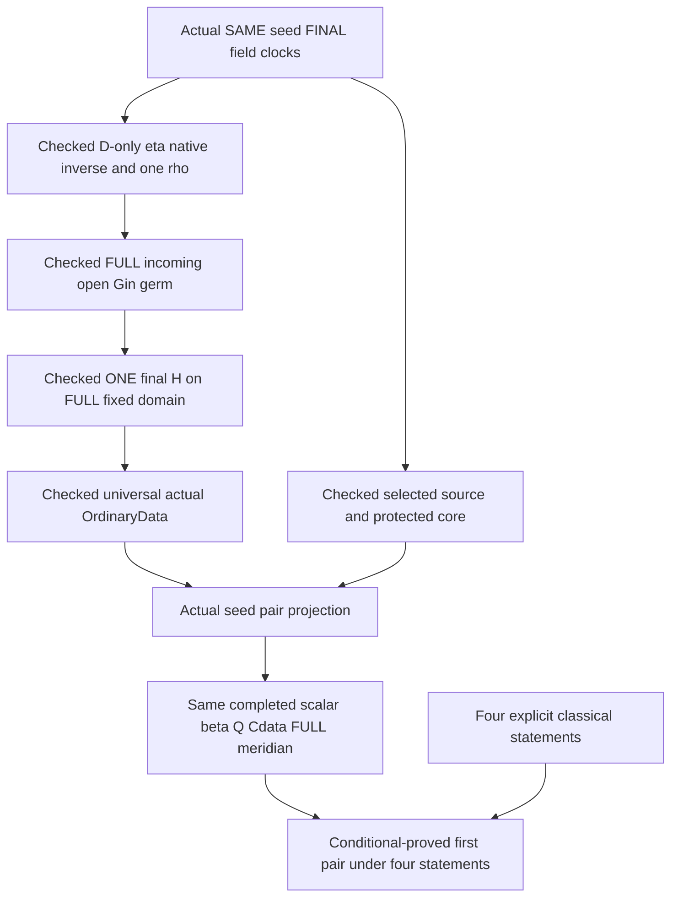

# ver503: route to a nonrigid tight-torus pair

The first objective is two noncongruent smooth embedded tight tori with exactly the same induced metric, agreement on a nonempty open set, and no open planar patch. The full Cantor-family assertion is deferred.

The CURRENT exact combined kernel report certifies every original construction gate and the ultimate first-pair theorem. The first-pair objective is conditional-proved under ONLY the four registered statements: background.positiveGaussTightness, background.coincidentEmbeddingFixedOpen, reparam and axes. No original construction assumption remains. SAME seed, FINAL Y, clocks, raw source E, one full-domain H with its OWN gradient inverse, completed scalar/beta/Q/Cdata tuple and ONE FULL meridian are retained. Full-paper and extension/Cantor-family scope remain incomplete or deferred.

The checked core retains the TightVer401 namespace in the publication engine lean. Exact current audit declarations control every completion status.

## Construction order

Closed actual route: premise-free SAME seed/FINAL Y → complete single selected prefix/source-core → D-only coherent eta/native e/one rho → D-only full Gin germ and ONE smoothing H → universal actual OrdinaryData → actual seed pair projection → exact ultimate first pair under four classical parameters.



## Objects and exact interfaces

## Authorized classical and external results

The user authorized granting classical and published external results on 2026-10-09. The first-pair target retains `background : ClassicalExternalResults` and the additional explicit `embeddedImageReparametrization : ClassicalEmbeddedImageReparametrizationClaim` and `ellipseAxesRecognition : MarkerEllipseAxesRecognition`. The exact registry is [classical-external-results.json](../classical-external-results.json); checked interfaces are [ClassicalExternal.lean](../TightVer401/ClassicalExternal.lean). External premises are explicitly assumed, while applications and novel constructions are kernel checked. There is no asserted inhabitant of the background bundle, custom axiom, or grant of the desired torus.

- `E.positive-gauss-tightness`: `TightVer401.ClassicalPositiveGaussTightnessClaim`. Consumers: R.positive-gauss, R.classical-tightness, R.stability. Finite omitted sphere points have zero spherical area, so the positive curvature integral is 4π. The published equality characterization gives tightness directly; Gauss–Bonnet is not required for this conclusion.
  Source: [Banchoff and Kühnel, Tight Submanifolds, Smooth and Polyhedral (1997), §1.1 pp.56–57](https://library.slmath.org/books/Book32/files/banchoff.pdf).
- `E.coincident-embedding-fixed-open`: `TightVer401.ClassicalCoincidentEmbeddingFixedOpenClaim`. Consumers: R.image-separation. Construct f=Y inverse composed with X through smooth embedded-submanifold inverses, differentiate Y composed with f=X, identify f as an isometry for the common actual induced metric, and use fixed-open rigidity. This is not an assumption of markedness or noncongruence.
  Source: [Ralph Cohen, Bundles, Homotopy, and Manifolds, §3.2.3, Theorem3.3/Proposition3.4](https://math.stanford.edu/~ralph/math215b/book.pdf).
  Source: [John M. Lee, Introduction to Riemannian Manifolds, connected local-isometry uniqueness](https://link.springer.com/book/10.1007/978-3-319-91755-9).
- `E.embedded-image-reparametrization`: `TightVer401.ClassicalEmbeddedImageReparametrizationClaim`. Consumers: R.image-separation. Separate explicit theorem parameter; existing two-field ClassicalExternalResults bundle is unchanged. Grants no common metric, curvature, positive image, marking or noncongruence.
  Source: [Ralph Cohen, Bundles, Homotopy, and Manifolds, §3.2.3, Theorem3.3/Proposition3.4](https://math.stanford.edu/~ralph/math215b/book.pdf).
- `E.noncircular-ellipse-axes-recognition`: `TightVer401.MarkerEllipseAxesRecognition`. Consumers: R.marking, torusAffineMarkerEllipse_pair_stabilizer, torusAffineMarker_open_annulus_rigid, torusAffineMarker_actual_meridian_rigid. Elementary COROLLARY, not a verbatim named theorem. Isometry preserves unique long diameter endpoint pair and its center midpoint; distinct long/short extreme endpoint pairs identify both axis lines; orthogonality preserves their 1D normal complement. See overnight-ellipse-background-review.md. Exact ordinary type validated in worker audit a30f703 and reviewed in root; the root combined audit PASS1325/16912 checks its imported consumers; no inhabitant or original marker stabilizer is asserted.
  Source: [OpenStax College Algebra, section8.1 The Ellipse](https://openstax.org/books/college-algebra/pages/8-1-the-ellipse).
  Source: [TU Delft Linear algebra, section8.2 Proposition8.2.5](https://interactivetextbooks.tudelft.nl/linear-algebra/Chapter8/QuadraticForms.html).

## Work removed from the blocking route

General height/component topology, native intrinsic-distance instance packaging, and a general surface-area/Gauss–Bonnet development are parked alternatives. Completed helpers are retained. Neither the external premises nor retained conditional helpers discharge the actual exits, full filling/completion, saddle annulus, exact torus positive locus, affine marking or final image noncongruence.

## Construction milestones

- `R.firstpair-selected-geometry`: audited — Actual selected source core and protected geometry from one seed.
- `R.compatible-displacement-production`: audited — Construct one compatible eta/rho family with native e and Cartesian E distinguished.
- `R.full-incoming-gin-production`: audited — Prove the full Gin open germ for the SAME incoming seam.
- `R.final-smoothed-h-production`: audited — Construct final H once on the full fixed smoothing domain.
- `R.ordinary-connector-family-production`: audited — Populate the actual universal OrdinaryData family.
- `R.pair-goal`: audited — Two noncongruent isometric tight tori.

## Downstream conditional consumers

Each interface status comes from CURRENT exact declarations. Helper implications retain their own hypotheses; the separate actual seed, D-only ordinary-family and ultimate producers discharge the original first-pair inputs only when audited.

- `R.incoming-terminal-radial-directional-stability-production`: audited — Produce simultaneous actual terminal radial directional and excess thresholds.
- `R.selected-one-common-graph-budget-production`: audited — Construct one positive amplitude budget for BOTH fixed periodic profiles.
- `R.selected-actual-traces-source-geometry-production`: audited — Derive exact selected source nesting and protected placement for SAME final traces.
- `R.incoming-original-choice-from-data-production`: audited — Construct eta angular frame and original terminal geometry from D alone.
- `R.incoming-literal-gin-terminal-stability-production`: audited — Construct displaced positive terminal filling for the SAME literal Gin family.
- `R.incoming-d-only-coherent-choice-production`: audited — Inhabit coherent retained incoming choices from D alone.
- `R.selected-round-flow-positive-source-production`: audited — Construct actual positive round-flow source from SAME selected initial values.
- `R.selected-round-flow-exact-image-production`: audited — Identify explicit round-flow open-band image with SAME flow core.
- `R.selected-round-cartesian-source-production`: audited — Construct smooth positive Cartesian source on the entire closed round annulus.
- `R.selected-raw-boundary-positive-jordan-production`: audited — Produce positive Jordan fillings for actual original raw leaves.
- `R.selected-raw-annulus-order-core-production`: audited — Derive strict raw Jordan order exact flow annulus and protected core.
- `R.selected-raw-source-construction-production`: audited — Construct raw Jordan order and actual source inverse from original seed and margins.
- `R.selected-protected-homotopy-winding-production`: audited — Transport actual inside and exterior by protected closed homotopy.
- `R.selected-fermi-protected-avoidance-production`: audited — Construct actual selected graph homotopies avoiding SAME protected set.
- `R.selected-actual-graph-to-raw-protected-production`: audited — Construct graph-to-raw protected homotopy with SAME actual speed clock.
- `R.selected-protected-jordan-placement-production`: audited — Derive selected Jordan nesting and actual protected placement from transport.
- `R.final-smoothing-literal-signed-height-production`: audited — Construct smooth literal signed height from SAME Cartesian source inverse.
- `R.final-smoothing-literal-height-normal-production`: audited — Derive actual negative normal derivative and canonical side classifier.
- `R.final-smoothing-literal-height-carrier-production`: audited — Construct seam full closed-band and compact boundary carrier facts for literal B.
- `R.final-smoothing-old-seam-coefficient-production`: audited — Derive old positive seam A from actual full rebased Delta.
- `R.final-smoothing-seam-geometry-production`: audited — Prove actual seam regular embedding and EXACT literal B zero set.
- `R.final-smoothing-from-actual-cartesian-production`: audited — Construct final H from actual Cartesian data without assumed seam or classifier packages.
- `R.incoming-uniform-negative-strip-carrier-production`: audited — Construct uniform actual Gin-domain tube and SAME-e negative strip.
- `R.incoming-compatible-rho-negative-strip-production`: audited — Choose one rho with actual coefficients lower Delta ENTIRE Gin strip and height bound.
- `R.incoming-literal-gin-compatible-choice-production`: audited — Produce one compatible rho for the exact Gin position gradient ruling family.
- `R.incoming-rebased-original-trace-production`: audited — Identify the lower rebased source with the ORIGINAL incoming curve through SAME inverse.
- `R.incoming-terminal-quotient-smoothness-production`: audited — Derive actual terminal joint C1 from SAME A/C quotient.
- `R.incoming-terminal-local-filling-stability-production`: audited — Construct one local displaced terminal positive filling with ALL-phase stability.
- `R.incoming-actual-terminal-family-filling-production`: audited — Derive positive filling and escape for the literal ACTUAL terminal quotient family.
- `R.incoming-terminal-phase-same-frontier-application`: audited — Keep the SAME terminal range and filling frontier after rebasing.
- `R.selected-annular-descent-production`: audited — Construct literal smooth angular descent on a FULL radial annulus.
- `R.selected-annular-descent-jacobian-production`: audited — Derive exact Cartesian Jacobian of SAME descended cylindrical map.
- `R.ordinary-rebased-coefficients-production`: audited — Construct upper Delta remaining length and whole rebased coefficients from SAME original A B C.
- `R.ordinary-rebased-same-jordan-topology-production`: audited — Transport SAME positive terminal filling through actual increasing phase.
- `R.ordinary-rebased-global-raw-production`: audited — Construct ONE actual rebased raw E U B retaining ORIGINAL incoming trace.
- `R.ordinary-full-rebased-band-carrier-production`: audited — Place the ENTIRE actual source closure in SAME final smoothing carrier.
- `R.ordinary-final-h-terminal-jets-production`: audited — Derive literal radius gradient and radial pairing for SAME final H terminal.
- `R.selected-core-label-gap-production`: audited — Construct uniform core label margins for SAME already selected leaves.
- `R.selected-phase-label-tubes-production`: audited — Construct actual Fermi label tubes and a COMMON later graph-amplitude budget.
- `R.selected-flow-initial-value-derivative-production`: audited — Derive genuine positive initial-value derivative of SAME complete ruled flow.
- `R.selected-core-flow-placement-production`: audited — Place SAME protected support between original selected leaves in the actual FLOW image.
- `R.selected-central-gauss-orientation-production`: audited — Compute actual central negative signed Gauss orientation.
- `R.selected-gnomonic-jacobian-production`: audited — Derive exact actual projected Gauss Jacobian from the triple product.
- `R.selected-full-band-gauss-orientation-production`: audited — Prove actual negative signed Gauss area on the ENTIRE original raw band.
- `R.final-smoothing-physical-full-band-application`: audited — Identify the ENTIRE Cartesian closed image with SAME rebased physical band.
- `R.incoming-eta-first-margins-production`: audited — Choose ONE eta before the displaced family with actual original coefficient and terminal geometry.
- `R.incoming-joint-actual-coefficients-production`: audited — Derive continuity periodicity and actual identities of joint A B C.
- `R.incoming-joint-coefficient-sign-threshold-production`: audited — Construct uniform A B C positivity from genuine central signs.
- `R.incoming-same-inverse-height-threshold-production`: audited — Produce uniform small SAME inverse height from zero-axis smoothness.
- `R.incoming-same-inverse-general-delta-threshold-production`: audited — Derive positive lower A+b(B-C) on SAME inverse phase domain.
- `R.incoming-same-inverse-actual-delta-threshold-production`: audited — Construct SAME-e lower Delta threshold for actual joint source gradient ruling.
- `R.incoming-same-inverse-gin-delta-threshold-production`: audited — Produce lower Delta of the literal SAME Gin displaced family.
- `R.incoming-rho-below-retained-margins-application`: audited — Select ONE positive rho below all supplied same-object margins and derived height bound.
- `R.ordinary-coefficient-continuity-application`: audited — Derive joint continuity of the actual source coefficients.
- `R.ordinary-lower-delta-threshold-production`: audited — Construct uniform actual Delta positivity at SAME lower inverse graph.
- `R.ordinary-terminal-escape-production`: audited — Produce actual full-phase norm escape and source boundary separation.
- `R.ordinary-fixed-source-enclosure-production`: audited — Construct one terminal filling strictly enclosing the retained incoming Jordan fill.
- `R.ordinary-round-gradient-enclosure-production`: audited — Enclose the full closed terminal gradient disk in SAME incoming gradient filling.
- `R.ordinary-global-raw-potential-production`: audited — Construct SAME global raw source inverse scalar and full closed-band saddle carrier from endpoint geometry.
- `R.final-margin-raw-leaf-connection`: audited — Rewrite the SAME final central-coordinate margins into selected raw-leaf hmargin.
- `R.incoming-local-seam-jets-application`: audited — Derive actual Gin trace derivative and construct a LOCAL matched raw scalar.
- `R.incoming-cartesian-seam-matching-application`: audited — Prove actual rebased Cartesian scalar/gradient matches at displaced old height ZERO.
- `R.incoming-displaced-seam-embedding-application`: audited — Derive closed embedding of the displaced central slice from SAME native e.
- `R.incoming-terminal-margins-production-application`: audited — Produce SAME terminal escape filling enclosure and actual C1 displacement thresholds.
- `R.incoming-terminal-literal-rebase-application`: audited — Transport the exact old terminal through SAME a and d=tc(a)-b.
- `R.final-smoothing-full-scalar-application`: audited — Construct ONE final scalar on the full carrier from actual primitive seam and branch facts.
- `R.final-smoothing-open-derivatives-application`: audited — Recover actual final-H gradient and Hessian on true open equality domains.
- `R.final-seed-support-connection`: audited — Connect FINAL margin-selected Y to the SAME original scalar and native chart.
- `R.final-selected-gradient-cartesian-connection`: audited — Flatten the ALREADY CHOSEN final selected-gradient inverse without reselection.
- `R.final-smoothing-carrier-application`: audited — Keep the ENTIRE rebased closed band in the SAME full smoothing carrier.
- `R.final-smoothing-side-application`: audited — Derive the actual canonical side classifier from the inverse height.
- `R.final-smoothing-boundary-application`: audited — Protect BOTH boundary sets and derive true open H equality neighborhoods.
- `R.ordinary-source-chart-fields-application`: audited — Produce ordinary Cartesian source fields from two actual endpoint signs.
- `R.ordinary-gradient-boundary-separation-application`: audited — Derive terminal/incoming gradient separation from visibility and the literal radius.
- `R.ordinary-source-boundary-separation-application`: audited — Separate source boundaries by evaluating the SAME final gradient.
- `R.retained-source-order-application`: audited — Retain original incoming and terminal source nesting.
- `R.retained-gradient-order-application`: audited — Derive ordinary final-gradient nesting from the full incoming open germ.
- `R.actual-incoming-collar-application`: audited — Actual incoming two-sided source collar and displaced inverse.
- `R.displaced-seam-rebase-application`: audited — Rebase the SAME old ruling and scalar with literal source height gradient identities.
- `R.canonical-ordinary-connector-assembly-application`: audited — Construct exact connector inverse and collars from ordinary final scalar data.
- `R.final-gradient-collar-application`: audited — Actual supplied-potential gradient inverse and full closed collar.
- `R.saddle-from-completion-application`: audited — Construct actual saddle geometry from ordinary completed support data.
- `R.same-completed-scalar-graph-witness-connection`: audited — Retain the actual full saddle scalar tuple and one meridian.
- `R.ver503-literal-negation-application`: audited — Literal ver503 sign transport on the SAME completed protected chart.
- `R.actual-marked-same-cylinder-application`: audited — Actual marked normal metric Gauss and positive-image rigidity.
- `R.ordinary-completed-support-marked-pair-application`: audited — Actual marked pair from the ordinary completed scalar tuple.
- `R.negative-gradient-order-marked-pair-application`: audited — Replace the marked pair target nesting premise by actual signed degree.
### O.plane: Actual plane and ambient space (audited)

Use the actual coordinate plane, Euclidean three-space, Frechet derivatives, induced metric and intrinsic Gaussian curvature from the pinned OpenAI foundation.

Route scope: `primary`. External dependencies: none.

Dependencies: none.

Lean target: `TightVer401.planarHessian`; source: `TightVer401/PlanarSupportForms.lean`.

Interface origin: `kernel_audit`.

```lean
(OAI.SmoothLocal.Geometry.Coord → ℝ) → OAI.SmoothLocal.Geometry.Coord → Matrix (Fin 2) (Fin 2) ℝ
```

### O.frame: Actual periodic physical frame (audited)

A smooth periodic closed curve and orthonormal frame satisfy the actual Frenet-type derivative equations with nowhere-zero torsion. The frame input includes no immersion, holonomy or bending conclusions.

Route scope: `primary`. External dependencies: none.

Dependencies: none.

Lean target: `TightVer401.PeriodicRuledFrame`; source: `TightVer401/PeriodicRuledFrame.lean`.

Interface origin: `kernel_audit`.

```lean
ℝ → Type
```

### O.band: Native ruled band (audited)

The actual map on the native circle times an open positive height interval is gamma(s)+u E(s). All derivatives, normal and Gaussian curvature refer to this actual map.

Route scope: `primary`. External dependencies: none.

Dependencies: `O.frame`.

Lean target: `TightVer401.PeriodicRuledFrame.bandMap`; source: `TightVer401/PeriodicRuledFrame.lean`.

Interface origin: `kernel_audit`.

```lean
{L b : ℝ} → TightVer401.PeriodicRuledFrame L → AddCircle L × ↑(Set.Ioo 0 b) → OAI.SmoothLocal.Geometry.Ambient
```

### O.bending: Actual localized bending (audited)

A native smooth ambient vector field satisfies the zero symmetric mixed derivative pairing. Full topological support, rather than only nonzero values, specifies its protected region.

Route scope: `primary`. External dependencies: none.

Dependencies: `O.band`.

Lean target: `TightVer401.IsBandBending`; source: `TightVer401/PeriodicRuledBending.lean`.

Interface origin: `kernel_audit`.

```lean
{L b : ℝ} →
  [Fact (0 < L)] →
    (AddCircle L × ↑(Set.Ioo 0 b) → OAI.SmoothLocal.Geometry.Ambient) →
      (AddCircle L × ↑(Set.Ioo 0 b) → OAI.SmoothLocal.Geometry.Ambient) → Prop
```

### O.manifold-bending: Actual plane-model manifold bending (audited)

For an actual charted surface in the OpenAI plane model, the smooth ambient field has zero actual symmetric strain pairing on every tangent vector pair. Transporting the protected band field to this global object is a separate application proof.

Route scope: `primary`. External dependencies: none.

Dependencies: none.

Lean target: `TightVer401.Manifold.IsBending`; source: `TightVer401/ManifoldBranching.lean`.

Interface origin: `kernel_audit`.

```lean
{M : Type u_1} →
  [inst : TopologicalSpace M] →
    [ChartedSpace OAI.ClosedSurfaceR4.Plane M] →
      (M → TightVer401.Manifold.ThreeSpace) → (M → TightVer401.Manifold.ThreeSpace) → Prop
```

### O.support: Actual planar support potential (audited)

G is an actual smooth scalar potential; X_G=(partial_0 G,partial_1 G,G-p dot grad G), and the Hessian is formed from its actual second derivatives.

Route scope: `primary`. External dependencies: none.

Dependencies: `O.plane`.

Lean target: `TightVer401.planarSupportMap`; source: `TightVer401/PlanarSupport.lean`.

Interface origin: `kernel_audit`.

```lean
(OAI.SmoothLocal.Geometry.Coord → ℝ) → OAI.SmoothLocal.Geometry.Coord → OAI.SmoothLocal.Geometry.Ambient
```

### O.dual: Differential Legendre transform (audited)

For an actual gradient diffeomorphism, G*(y)=p dot y-G(p), y=grad G(p). The actual inverse gradient defines the transform; convexity is not assumed.

Route scope: `primary`. External dependencies: none.

Dependencies: `O.support`.

Lean target: `TightVer401.planarLegendre`; source: `TightVer401/PlanarLegendre.lean`.

Interface origin: `kernel_audit`.

```lean
(OAI.SmoothLocal.Geometry.Coord → ℝ) →
  OpenPartialHomeomorph OAI.SmoothLocal.Geometry.Coord OAI.SmoothLocal.Geometry.Coord →
    OAI.SmoothLocal.Geometry.Coord → ℝ
```

### O.polar: Actual polar coordinate map (audited)

Phi(r,theta)=(r cos theta,r sin theta), on r>0. Its actual Jacobian determinant is r; polar Hessian expressions include chart second-derivative corrections.

Route scope: `primary`. External dependencies: none.

Dependencies: `O.plane`.

Lean target: `TightVer401.saddlePolarChart`; source: `TightVer401/PolarSaddleSignCalculus.lean`.

Interface origin: `kernel_audit`.

```lean
OAI.SmoothLocal.Geometry.Coord → OAI.SmoothLocal.Geometry.Coord
```

### O.quadratic: Quadratic radial end germ (audited)

f(r)=M R r-M r^2/2+d, with R,M>0. The support map and its boundary-circle resolution are actual derivatives of this germ.

Route scope: `primary`. External dependencies: none.

Dependencies: `O.support`.

Lean target: `TightVer401.dualRadialQuadraticProfile`; source: `TightVer401/DualRadialQuadraticGerm.lean`.

Interface origin: `kernel_audit`.

```lean
ℝ → ℝ → ℝ → ℝ → ℝ
```

### O.neck: Square-root dual neck (audited)

f_neck(r)=C+2 sqrt(B(r-a)), B>0,r>a. Its inverse gradient radius is a+B/p^2 and its inverse Legendre potential is a p-B/p-C.

Route scope: `primary`. External dependencies: none.

Dependencies: `O.dual`.

Lean target: `TightVer401.dualRadialNeck`; source: `TightVer401/DualRadialNeckCalculus.lean`.

Interface origin: `kernel_audit`.

```lean
ℝ → ℝ → ℝ → ℝ → ℝ
```

### O.torus: Actual torus source (audited)

The actual carrier is the native product of two quotient circles. Smooth structure, compactness, connectedness and annulus assembly have separate proof obligations.

Route scope: `primary`. External dependencies: none.

Dependencies: none.

Lean target: `TightVer401.NonrigidTorusSource`; source: `TightVer401/TorusGoalObjects.lean`.

Interface origin: `kernel_audit`.

```lean
Type
```

### O.tightness: Geometric tightness (audited)

Tightness means every nonempty intersection of the image with an open affine half-space is connected. The curvature equality characterization is a separate theorem, not the definition.

Route scope: `primary`. External dependencies: none.

Dependencies: none.

Lean target: `TightVer401.IsTightImage`; source: `TightVer401/TorusGoalObjects.lean`.

Interface origin: `kernel_audit`.

```lean
{M : Type u_1} → (M → OAI.SmoothLocal.Geometry.Ambient) → Prop
```

### O.no-planar-patch: Absence of open planar patches (audited)

No nonempty open part of the actual source maps into an affine plane: every nonzero ambient continuous linear functional fails to be constant on that part.

Route scope: `primary`. External dependencies: none.

Dependencies: none.

Lean target: `TightVer401.HasNoOpenPlanarPatch`; source: `TightVer401/TorusGoalObjects.lean`.

Interface origin: `kernel_audit`.

```lean
{M : Type u_1} → [TopologicalSpace M] → (M → OAI.SmoothLocal.Geometry.Ambient) → Prop
```

### O.noncongruence: Noncongruence of images (audited)

For every ambient Euclidean affine isometry A, A(range Xplus) differs from range Xminus. Distinct parametrized maps alone are insufficient.

Route scope: `primary`. External dependencies: none.

Dependencies: none.

Lean target: `TightVer401.ImageNoncongruent`; source: `TightVer401/TorusGoalObjects.lean`.

Interface origin: `kernel_audit`.

```lean
{M : Type u_1} → (M → OAI.SmoothLocal.Geometry.Ambient) → (M → OAI.SmoothLocal.Geometry.Ambient) → Prop
```

### O.actual-graph-cylinder-data: Ordinary same-scalar completed cylinder data (audited)

Retain actual G/e/beta, scalar end constants and actual gradient/Hessian/smoothness/germ data, with literal equality to the SAME saddle cylinder. This object contains no asserted normal, curvature sign, positive region, Gauss inverse or tightness result.

Route scope: `primary`. External dependencies: none.

Dependencies: `O.support`, `O.dual`.

Lean target: `TightVer401.ProtectedTorusActualGraphCylinderData`; source: `TightVer401/ProtectedTorusPositiveGaussCurvatureActualGraphCylinder.lean`.

Interface origin: `kernel_audit`.

```lean
{RN mu h : ℝ} → TightVer401.ProtectedSaddleCylinderInput RN mu h → Type
```

Additional required audited interface: `TightVer401.protectedTorusActualGraphCylinderData_of_ordinary`.

```lean
{RN mu h : ℝ} →
  (S : TightVer401.ProtectedSaddleCylinderInput RN mu h) →
    (G : OAI.SmoothLocal.Geometry.Coord → ℝ) →
      (e : OpenPartialHomeomorph OAI.SmoothLocal.Geometry.Coord OAI.SmoothLocal.Geometry.Coord) →
        (beta : ℝ → ℝ) →
          (A B L d0 dInfinity : ℝ) →
            0 < A →
              A < RN →
                0 < B →
                  0 < L →
                    e.source = {p | 0 < TightVer401.planarRadius p} →
                      e.target = TightVer401.quadraticRadialFillingOpenAnnulus A RN →
                        ContDiffOn ℝ (↑⊤) G e.source →
                          ContDiffOn ℝ (↑⊤) (↑e.symm) e.target →
                            (∀ p ∈ e.source, ↑e p = TightVer401.planarGradient G p) →
                              (∀ p ∈ e.source, (TightVer401.planarHessian G p).det < 0) →
                                (∀ (p : OAI.SmoothLocal.Geometry.Coord),
                                    L < TightVer401.planarRadius p →
                                      G p =
                                        A * TightVer401.planarRadius p - B / TightVer401.planarRadius p + dInfinity) →
                                  ContDiff ℝ (↑⊤) beta →
                                    StrictMonoOn beta (Set.Icc (Real.pi / 2) Real.pi) →
                                      beta (Real.pi / 2) = A →
                                        beta Real.pi = RN →
                                          (∀ u ∈ Set.Ioo (Real.pi / 2) Real.pi, 0 < deriv beta u) →
                                            (beta =ᶠ[nhds (Real.pi / 2)] fun u => A + B * (u - Real.pi / 2) ^ 2) →
                                              S.saddle =
                                                  TightVer401.completedSaddleAnnulusCylinderMap G e A RN d0 dInfinity
                                                    beta →
                                                TightVer401.ProtectedTorusActualGraphCylinderData S
```

### E.embedded-image-reparametrization: Granted smooth embedded-image reparameterization (external_assumed)

Two actual infinity-smooth embedded immersions of the native torus with equal entire images have an actual source homeomorphism smooth in both directions intertwining their maps. This additional explicit classical parameter supplies only embedded-submanifold inversion; all curvature covariance and marking applications remain proved obligations.

Route scope: `primary`. External dependencies: E.embedded-image-reparametrization.

Dependencies: `O.torus`.

Lean target: `TightVer401.ClassicalEmbeddedImageReparametrizationClaim`; source: `TightVer401/ClassicalEmbeddedReparam.lean`.

Interface origin: `kernel_audit`.

```lean
Prop
```

Additional required audited interface: `TightVer401.classicalEmbeddedImages_reparametrize`.

```lean
TightVer401.ClassicalEmbeddedImageReparametrizationClaim →
  ∀ (X Y : TightVer401.NonrigidTorusSource → OAI.SmoothLocal.Geometry.Ambient),
    TightVer401.NativeTorusSmoothEmbedding X →
      TightVer401.NativeTorusSmoothEmbedding Y →
        Set.range X = Set.range Y →
          ∃ e,
            ContMDiff TightVer401.nativeProductModel TightVer401.nativeProductModel ↑⊤ ⇑e ∧
              ContMDiff TightVer401.nativeProductModel TightVer401.nativeProductModel ↑⊤ ⇑e.symm ∧
                ∀ (p : TightVer401.NonrigidTorusSource), Y (e p) = X p
```

### E.positive-gauss-tightness: Granted positive-Gauss tightness criterion (external_assumed)

For an actual smooth embedded native torus and its actual smooth unit normal, a smooth inverse Gauss chart covering exactly the entire K>0 locus and the sphere minus finitely many points implies the existing open-half-space tightness predicate. This is a named classical corollary of Gauss area and Banchoff–Kühnel §1.1. All actual geometry inputs remain producer obligations.

Route scope: `primary`. External dependencies: E.positive-gauss-tightness.

Dependencies: `O.tightness`, `R.model-transport`.

Lean target: `TightVer401.ClassicalPositiveGaussTightnessClaim`; source: `TightVer401/ClassicalExternal.lean`.

Interface origin: `kernel_audit`.

```lean
Prop
```

Additional required audited interface: `TightVer401.ClassicalExternalResults`.

```lean
Prop
```

Additional required audited interface: `TightVer401.classicalPositiveGauss_tightness`.

```lean
TightVer401.ClassicalExternalResults →
  ∀ (X : TightVer401.NonrigidTorusSource → OAI.SmoothLocal.Geometry.Ambient),
    TightVer401.NativeTorusSmoothEmbedding X →
      ∀ (N : TightVer401.NonrigidTorusSource → ↑TightVer401.RoundSphere),
        ContMDiff TightVer401.nativeProductModel (modelWithCornersSelf ℝ (EuclideanSpace ℝ (Fin 2))) (↑⊤) N →
          (∀ (p : TightVer401.NonrigidTorusSource) (v : ℝ × ℝ), inner ℝ (↑(N p)) ((mfderiv% X p) v) = 0) →
            ∀ (E : Set ↑TightVer401.RoundSphere),
              E.Finite →
                ∀ (e : OpenPartialHomeomorph TightVer401.NonrigidTorusSource ↑TightVer401.RoundSphere),
                  e.source = TightVer401.nativeTorusPositiveRegion X →
                    e.target = Set.univ \ E →
                      Set.EqOn (↑e) N e.source →
                        ContMDiffOn TightVer401.nativeProductModel (modelWithCornersSelf ℝ (EuclideanSpace ℝ (Fin 2)))
                            (↑⊤) (↑e) e.source →
                          ContMDiffOn (modelWithCornersSelf ℝ (EuclideanSpace ℝ (Fin 2))) TightVer401.nativeProductModel
                              (↑⊤) (↑e.symm) e.target →
                            TightVer401.IsTightImage X
```

### E.coincident-embedding-fixed-open: Granted equal-image fixed-open rigidity corollary (external_assumed)

Actual smooth embedded immersions on the same connected native torus with equal pointwise induced forms, equal entire images and agreement on a nonempty open set are equal maps. This packages the classical smooth embedded-submanifold inverse and connected Riemannian isometry uniqueness; it grants neither affine markedness nor image noncongruence.

Route scope: `primary`. External dependencies: E.coincident-embedding-fixed-open.

Dependencies: `O.torus`, `R.model-transport`.

Lean target: `TightVer401.ClassicalCoincidentEmbeddingFixedOpenClaim`; source: `TightVer401/ClassicalExternal.lean`.

Interface origin: `kernel_audit`.

```lean
Prop
```

Additional required audited interface: `TightVer401.classicalCoincidentEmbeddings_eq`.

```lean
TightVer401.ClassicalExternalResults →
  ∀ (X Y : TightVer401.NonrigidTorusSource → OAI.SmoothLocal.Geometry.Ambient),
    TightVer401.NativeTorusSmoothEmbedding X →
      TightVer401.NativeTorusSmoothEmbedding Y →
        (∀ (p : TightVer401.NonrigidTorusSource) (v w : ℝ × ℝ),
            TightVer401.nativeProductInducedForm X p v w = TightVer401.nativeProductInducedForm Y p v w) →
          Set.range X = Set.range Y →
            ∀ (U : Set TightVer401.NonrigidTorusSource), IsOpen U → U.Nonempty → Set.EqOn X Y U → X = Y
```

### E.noncircular-ellipse-axes-recognition: Granted generic single noncircular ellipse recognition (external_assumed)

An actual ambient affine isometry between equally oriented translates of one noncircular ellipse transports its center and has signed diagonal linear action. This elementary corollary grants no two-ellipse boundary, same-meridian asymmetry or original marker stabilizer. Exact ordinary single-ellipse type is locally checked in worker a30f703; current root audit determines imported application certification.

Route scope: `primary`. External dependencies: E.noncircular-ellipse-axes-recognition.

Dependencies: `O.torus`.

Lean target: `TightVer401.MarkerEllipseAxesRecognition`; source: `TightVer401/TorusAffineMarkerEllipseBasic.lean`.

Interface origin: `kernel_audit`.

```lean
Prop
```

### R.torus-source: Derive the native compact connected smooth torus source (audited)

Construct the native ModelProd real-product charts and derive compactness, connectedness and the infinity smooth manifold structure; no embedding is supplied.

Route scope: `primary`. External dependencies: none.

Dependencies: `O.torus`.

Lean target: `TightVer401.nonrigidTorusSource_isManifold`; source: `TightVer401/TorusSourceGeometry.lean`.

Interface origin: `kernel_audit`.

```lean
IsManifold ((modelWithCornersSelf ℝ ℝ).prod (modelWithCornersSelf ℝ ℝ)) (↑⊤) TightVer401.NonrigidTorusSource
```

Additional required audited interface: `TightVer401.nonrigidTorusSource_compact`.

```lean
CompactSpace TightVer401.NonrigidTorusSource
```

Additional required audited interface: `TightVer401.nonrigidTorusSource_connected`.

```lean
ConnectedSpace TightVer401.NonrigidTorusSource
```

Additional required audited interface: `TightVer401.nonrigidTorusSource_chartedSpace`.

```lean
ChartedSpace (ModelProd ℝ ℝ) TightVer401.NonrigidTorusSource
```

Additional required audited interface: `TightVer401.nonrigidTorusSource_realProductChartedSpace`.

```lean
ChartedSpace (ℝ × ℝ) TightVer401.NonrigidTorusSource
```

### R.model-transport: Transport native product charts to the OpenAI plane model (audited)

Construct the actual continuous linear smooth equivalence between the native two-real-coordinate model and the OpenAI Euclidean plane model. Derive chart, manifold differential, induced form and local curvature compatibility for the actual band and torus. This application bridge is not supplied by a theorem stated only in the plane model.

Route scope: `primary`. External dependencies: none.

Dependencies: `O.plane`.

Proof route: Use the finite-dimensional continuous linear equivalence and its inverse to transport the actual atlas; apply the chain rule and the checked coordinate-invariance formulas.

Lean target: `TightVer401.native_product_plane_geometry_transport`; source: `TightVer401/NativeProductPlaneTransport.lean`.

Interface origin: `kernel_audit`.

```lean
∀ (M : Type u_1) [inst : TopologicalSpace M] [inst_1 : ChartedSpace (ModelProd ℝ ℝ) M]
  [IsManifold TightVer401.nativeProductModel (↑⊤) M],
  IsManifold OAI.ClosedSurfaceR4.planeModel (↑⊤) M ∧
    ∀ (F : M → OAI.SmoothLocal.Geometry.Ambient),
      ContMDiff TightVer401.nativeProductModel (modelWithCornersSelf ℝ OAI.SmoothLocal.Geometry.Ambient) (↑⊤) F →
        ContMDiff OAI.ClosedSurfaceR4.planeModel (modelWithCornersSelf ℝ OAI.SmoothLocal.Geometry.Ambient) (↑⊤) F ∧
          (∀ (p : M) (v w : ℝ × ℝ),
              (OAI.ClosedSurfaceR4.surfaceDifferential F p) (TightVer401.nativeProductPlaneEquiv v) = (mfderiv% F p) v ∧
                OAI.ClosedSurfaceR4.inducedForm F p (TightVer401.nativeProductPlaneEquiv v)
                    (TightVer401.nativeProductPlaneEquiv w) =
                  TightVer401.nativeProductInducedForm F p v w) ∧
            ∀ (p : M) (q : OAI.SmoothLocal.Geometry.Coord),
              OAI.SmoothLocal.Geometry.gaussianCurvature
                  (OAI.SmoothLocal.Geometry.inducedMetric (TightVer401.nativeProductPlaneCoordinateMap F p)) q =
                OAI.SmoothLocal.Geometry.gaussianCurvature
                  (OAI.SmoothLocal.Geometry.inducedMetric (TightVer401.nativeProductCoordinateMap F p)) q
```

Additional required audited interface: `TightVer401.nativeProductPlane_band_geometry`.

```lean
∀ {L b : ℝ} [inst : Fact (0 < L)] (d : TightVer401.PeriodicRuledFrame L),
  IsManifold OAI.ClosedSurfaceR4.planeModel (↑⊤) (AddCircle L × ↑(Set.Ioo 0 b)) ∧
    ContMDiff OAI.ClosedSurfaceR4.planeModel (modelWithCornersSelf ℝ OAI.SmoothLocal.Geometry.Ambient) (↑⊤) d.bandMap ∧
      ∀ (p : AddCircle L × ↑(Set.Ioo 0 b)),
        Function.Injective ⇑(OAI.ClosedSurfaceR4.surfaceDifferential d.bandMap p) ∧
          OAI.SmoothLocal.Geometry.gaussianCurvature
              (OAI.SmoothLocal.Geometry.inducedMetric (TightVer401.nativeProductPlaneCoordinateMap d.bandMap p))
              ![0, ↑p.2] <
            0
```

Additional required audited interface: `TightVer401.nativeProductPlane_band_gauss_support`.

```lean
∀ {L b : ℝ} [Fact (0 < L)] (d : TightVer401.PeriodicRuledFrame L) {U : Set (AddCircle L × ↑(Set.Ioo 0 b))},
  IsOpen U →
    Set.InjOn d.bandSphereGauss U →
      ∃ H,
        IsOpen (d.bandSphereGauss '' U) ∧
          ContMDiffOn (modelWithCornersSelf ℝ (EuclideanSpace ℝ (Fin 2))) (modelWithCornersSelf ℝ ℝ) (↑⊤) H
              (d.bandSphereGauss '' U) ∧
            ∀ p ∈ U, d.bandMap p = TightVer401.globalSphereSupport H (d.bandSphereGauss p)
```

### R.band: Retain the verified protected identity band and bending (audited)

From N>=10000 and eta>0 construct the same corrected speed, physical frame, embedded identity band and protected closed-leaf annulus. The entire compact support of a nonzero bending lies inside that annulus. Proved compact-support stability gives distinct opposite embedded band maps with equal actual induced forms and negative curvature for all sufficiently small amplitudes.

Route scope: `primary`. External dependencies: none.

Dependencies: `O.band`, `O.bending`.

Lean target: `TightVer401.corrugatedSeed_exists_protected_identity_band_bending`; source: `TightVer401/CorrugatedIdentityBendingBand.lean`.

Interface origin: `kernel_audit`.

```lean
∀ {N : ℕ},
  10000 ≤ N →
    ∀ {η : ℝ},
      0 < η →
        have ell := TightVer401.corrugatedSeedArcCell ↑N;
        have L := ↑N * ell;
        ∃ e,
          ⇑e = TightVer401.corrugatedSeedArcMap ↑N ∧
            ContDiff ℝ ↑⊤ ⇑e.symm ∧
              ∃ a,
                ContDiff ℝ (↑⊤) a ∧
                  Function.Periodic a ell ∧
                    (∀ (r : ℝ), 0 < a r) ∧
                      ∫ (r : ℝ) in 0..ell, ‖a r - TightVer401.corrugatedSeedInitialSpeed (↑N) (⇑e.symm) r‖ < η ∧
                        ∫ (r : ℝ) in 0..L,
                              a r • TightVer401.normalLoopTangent (TightVer401.corrugatedSeedSphere ↑N ∘ ⇑e.symm) r =
                            0 ∧
                          ∫ (r : ℝ) in 0..L,
                                deriv (TightVer401.normalLoopCurvature (TightVer401.corrugatedSeedSphere ↑N ∘ ⇑e.symm))
                                    r /
                                  √(a r) =
                              0 ∧
                            TightVer401.ComplexVisiblePair (1 / 4) (TightVer401.corrugatedSeedBeta ↑N ∘ ⇑e.symm)
                                (TightVer401.corrugatedSeedBalancedPartner (↑N) (⇑e.symm) ell a) ∧
                              TightVer401.ComplexVisiblePair (4 / 5)
                                  (TightVer401.corrugatedReverseReflect
                                    (TightVer401.corrugatedSeedBalancedPartner (↑N) (⇑e.symm) ell a))
                                  (TightVer401.corrugatedReverseReflect (TightVer401.corrugatedSeedBeta ↑N ∘ ⇑e.symm)) ∧
                                ∃ S,
                                  ⇑S = OAI.ClosedSurfaceR4.PeriodicPrimitive.rawPrimitive a ∧
                                    ContDiff ℝ ↑⊤ ⇑S.symm ∧
                                      ∃ d,
                                        d.γ = TightVer401.corrugatedSeedBalancedSpatial (↑N) (⇑e.symm) ell a ∘ ⇑S.symm ∧
                                          d.T =
                                              TightVer401.normalLoopTangent
                                                  (TightVer401.corrugatedSeedSphere ↑N ∘ ⇑e.symm) ∘
                                                ⇑S.symm ∧
                                            d.E = deriv (TightVer401.corrugatedSeedSphere ↑N ∘ ⇑e.symm) ∘ ⇑S.symm ∧
                                              d.n = (TightVer401.corrugatedSeedSphere ↑N ∘ ⇑e.symm) ∘ ⇑S.symm ∧
                                                d.k =
                                                    TightVer401.normalLoopPhysicalK a
                                                      (TightVer401.normalLoopCurvature
                                                        (TightVer401.corrugatedSeedSphere ↑N ∘ ⇑e.symm))
                                                      ⇑S.symm ∧
                                                  d.τ = TightVer401.normalLoopPhysicalTau a ⇑S.symm ∧
                                                    TightVer401.PrincipalNormalIdentityBand d ∧
                                                      ∃ (hT :
                                                        0 < OAI.ClosedSurfaceR4.PeriodicPrimitive.rawPrimitive a L),
                                                        ∃ w > 0,
                                                          ContMDiff
                                                              ((modelWithCornersSelf ℝ ℝ).prod
                                                                (modelWithCornersSelf ℝ ℝ))
                                                              (modelWithCornersSelf ℝ OAI.SmoothLocal.Geometry.Ambient)
                                                              (↑⊤) d.bandMap ∧
                                                            (∀
                                                                (p :
                                                                  AddCircle
                                                                      (OAI.ClosedSurfaceR4.PeriodicPrimitive.rawPrimitive
                                                                        a L) ×
                                                                    ↑(Set.Ioo 0 w)),
                                                                Function.Injective
                                                                  ⇑(TightVer401.bandDifferential d.bandMap p)) ∧
                                                              Topology.IsEmbedding d.bandMap ∧
                                                                Topology.IsEmbedding
                                                                    (⇑TightVer401.corrugatedAmbientHorizontalCLM ∘
                                                                      d.bandMap) ∧
                                                                  ContMDiff
                                                                      ((modelWithCornersSelf ℝ ℝ).prod
                                                                        (modelWithCornersSelf ℝ ℝ))
                                                                      (modelWithCornersSelf ℝ ℂ) (↑⊤)
                                                                      (⇑TightVer401.corrugatedAmbientHorizontalCLM ∘
                                                                        d.bandMap) ∧
                                                                    (∀
                                                                        (p :
                                                                          AddCircle
                                                                              (OAI.ClosedSurfaceR4.PeriodicPrimitive.rawPrimitive
                                                                                a L) ×
                                                                            ↑(Set.Ioo 0 w)),
                                                                        Function.Injective
                                                                          ⇑(mfderiv%
                                                                                (⇑TightVer401.corrugatedAmbientHorizontalCLM ∘
                                                                                  d.bandMap)
                                                                              p)) ∧
                                                                      (Function.Injective fun p =>
                                                                          d.fullGaussMap (p.1, ↑p.2)) ∧
                                                                        (∀
                                                                            (p :
                                                                              AddCircle
                                                                                  (OAI.ClosedSurfaceR4.PeriodicPrimitive.rawPrimitive
                                                                                    a L) ×
                                                                                ↑(Set.Ioo 0 w)),
                                                                            0 < (d.fullGaussMap (p.1, ↑p.2)).ofLp 2) ∧
                                                                          ContMDiff
                                                                              ((modelWithCornersSelf ℝ ℝ).prod
                                                                                (modelWithCornersSelf ℝ ℝ))
                                                                              (modelWithCornersSelf ℝ
                                                                                (EuclideanSpace ℝ (Fin 2)))
                                                                              (↑⊤) d.bandSphereGauss ∧
                                                                            Function.Injective d.bandSphereGauss ∧
                                                                              (∀
                                                                                  (p :
                                                                                    AddCircle
                                                                                        (OAI.ClosedSurfaceR4.PeriodicPrimitive.rawPrimitive
                                                                                          a L) ×
                                                                                      ↑(Set.Ioo 0 w)),
                                                                                  Function.Injective
                                                                                    ⇑(mfderiv% d.bandSphereGauss p)) ∧
                                                                                (∀
                                                                                    (p :
                                                                                      AddCircle
                                                                                          (OAI.ClosedSurfaceR4.PeriodicPrimitive.rawPrimitive
                                                                                            a L) ×
                                                                                        ↑(Set.Ioo 0 w))
                                                                                    (v : ℝ × ℝ),
                                                                                    inner ℝ
                                                                                        ((TightVer401.bandDifferential
                                                                                            d.bandMap p)
                                                                                          v)
                                                                                        (d.bandGaussMap p) =
                                                                                      0) ∧
                                                                                  TightVer401.IdentityReturnInsideBand d
                                                                                      w ∧
                                                                                    TightVer401.CompleteIdentityBand d
                                                                                        w ∧
                                                                                      TightVer401.SaturatedIdentitySubband
                                                                                          d w ∧
                                                                                        TightVer401.ProtectedIdentityBendingSubband
                                                                                          d w
```

Additional required audited interface: `TightVer401.periodicRuledFrame_exists_identity_bending_curvature_pair`.

```lean
∀ {L b : ℝ} [inst : Fact (0 < L)] (d : TightVer401.PeriodicRuledFrame L),
  TightVer401.PrincipalNormalIdentityBand d →
    0 < b →
      Topology.IsEmbedding d.bandMap →
        ∃ Y,
          TightVer401.IsBandBending d.bandMap Y ∧
            HasCompactSupport Y ∧
              (∃ p, Y p ≠ 0) ∧
                ∃ δ > 0,
                  (∀ (a : ℝ),
                      |a| < δ →
                        TightVer401.bandInducedForm (d.bandMap + a • Y) =
                            TightVer401.bandInducedForm (d.bandMap - a • Y) ∧
                          ∀ (p : OAI.SmoothLocal.Geometry.Coord),
                            OAI.SmoothLocal.Geometry.gaussianCurvature
                                  (OAI.SmoothLocal.Geometry.inducedMetric fun q =>
                                    TightVer401.ruledMap d.γ d.E q + a • TightVer401.bandCoordinateLift Y q)
                                  p <
                                0 ∧
                              OAI.SmoothLocal.Geometry.gaussianCurvature
                                  (OAI.SmoothLocal.Geometry.inducedMetric fun q =>
                                    TightVer401.ruledMap d.γ d.E q - a • TightVer401.bandCoordinateLift Y q)
                                  p <
                                0) ∧
                    ∀ (a : ℝ), a ≠ 0 → d.bandMap + a • Y ≠ d.bandMap - a • Y
```

Additional required audited interface: `TightVer401.periodicRuledFrame_exists_identity_embedded_curvature_pair`.

```lean
∀ {L b : ℝ} [inst : Fact (0 < L)] (d : TightVer401.PeriodicRuledFrame L),
  TightVer401.PrincipalNormalIdentityBand d →
    0 < b →
      Topology.IsEmbedding d.bandMap →
        ∃ Y,
          TightVer401.IsBandBending d.bandMap Y ∧
            HasCompactSupport Y ∧
              (∃ p, Y p ≠ 0) ∧
                ∃ δ > 0,
                  (∀ (a : ℝ),
                      |a| < δ →
                        Topology.IsEmbedding (d.bandMap + a • Y) ∧
                          Topology.IsEmbedding (d.bandMap - a • Y) ∧
                            TightVer401.bandInducedForm (d.bandMap + a • Y) =
                                TightVer401.bandInducedForm (d.bandMap - a • Y) ∧
                              ∀ (p : AddCircle L × ↑(Set.Ioo 0 b)),
                                OAI.SmoothLocal.Geometry.gaussianCurvature
                                      (OAI.SmoothLocal.Geometry.inducedMetric
                                        (TightVer401.nativeProductPlaneCoordinateMap (d.bandMap + a • Y) p))
                                      ![0, ↑p.2] <
                                    0 ∧
                                  OAI.SmoothLocal.Geometry.gaussianCurvature
                                      (OAI.SmoothLocal.Geometry.inducedMetric
                                        (TightVer401.nativeProductPlaneCoordinateMap (d.bandMap - a • Y) p))
                                      ![0, ↑p.2] <
                                    0) ∧
                    ∀ (a : ℝ), a ≠ 0 → d.bandMap + a • Y ≠ d.bandMap - a • Y
```

### R.support-calculus: Retain actual support reconstruction and dual calculus (audited)

For an already supplied smooth spherical support potential on an open northern sphere domain, reconstruct its actual support in planar gnomonic coordinates. This theorem supplies neither the particular band potential nor a global gradient inverse.

Route scope: `primary`. External dependencies: none.

Dependencies: `O.support`, `O.dual`.

Lean target: `TightVer401.gnomonicSupport_reconstruction`; source: `TightVer401/GnomonicSupport.lean`.

Interface origin: `kernel_audit`.

```lean
∀ {H : ↑TightVer401.RoundSphere → ℝ} {Ω : Set ↑TightVer401.RoundSphere},
  ContMDiffOn (modelWithCornersSelf ℝ (EuclideanSpace ℝ (Fin 2))) (modelWithCornersSelf ℝ ℝ) (↑⊤) H Ω →
    IsOpen Ω →
      (∀ q ∈ Ω, 0 < (↑q).ofLp 2) →
        ∀ {p : OAI.SmoothLocal.Geometry.Coord},
          TightVer401.gnomonicPoint p ∈ Ω →
            TightVer401.planarSupportMap (TightVer401.gnomonicPotential H) p =
              TightVer401.globalSphereSupport H (TightVer401.gnomonicPoint p)
```

### R.core-support: Represent this particular protected band by a global planar potential (audited)

Derive the actual open Gauss-image inverse and one support potential on the band image. Its source and gradient maps are diffeomorphisms onto annuli; identify the retained bending region.

Route scope: `primary`. External dependencies: none.

Dependencies: `R.band`, `R.support-calculus`, `R.model-transport`.

Proof route: Join the checked local Gauss inverses using injectivity, then identify the actual gradient with horizontal projection and retain the precise support image.

Lean target: `TightVer401.identityBand_exists_planar_support_annulus`; source: `TightVer401/IdentityBandPlanarSupport.lean`.

Interface origin: `kernel_audit`.

```lean
∀ {N : ℕ},
  10000 ≤ N →
    ∀ {η : ℝ},
      0 < η →
        have ell := TightVer401.corrugatedSeedArcCell ↑N;
        have L := ↑N * ell;
        ∃ e,
          ⇑e = TightVer401.corrugatedSeedArcMap ↑N ∧
            ContDiff ℝ ↑⊤ ⇑e.symm ∧
              ∃ a,
                ContDiff ℝ (↑⊤) a ∧
                  Function.Periodic a ell ∧
                    (∀ (r : ℝ), 0 < a r) ∧
                      ∫ (r : ℝ) in 0..ell, ‖a r - TightVer401.corrugatedSeedInitialSpeed (↑N) (⇑e.symm) r‖ < η ∧
                        ∃ S,
                          ⇑S = OAI.ClosedSurfaceR4.PeriodicPrimitive.rawPrimitive a ∧
                            ContDiff ℝ ↑⊤ ⇑S.symm ∧
                              ∃ d,
                                d.γ = TightVer401.corrugatedSeedBalancedSpatial (↑N) (⇑e.symm) ell a ∘ ⇑S.symm ∧
                                  d.T =
                                      TightVer401.normalLoopTangent (TightVer401.corrugatedSeedSphere ↑N ∘ ⇑e.symm) ∘
                                        ⇑S.symm ∧
                                    d.E = deriv (TightVer401.corrugatedSeedSphere ↑N ∘ ⇑e.symm) ∘ ⇑S.symm ∧
                                      d.n = (TightVer401.corrugatedSeedSphere ↑N ∘ ⇑e.symm) ∘ ⇑S.symm ∧
                                        d.k =
                                            TightVer401.normalLoopPhysicalK a
                                              (TightVer401.normalLoopCurvature
                                                (TightVer401.corrugatedSeedSphere ↑N ∘ ⇑e.symm))
                                              ⇑S.symm ∧
                                          d.τ = TightVer401.normalLoopPhysicalTau a ⇑S.symm ∧
                                            TightVer401.PrincipalNormalIdentityBand d ∧
                                              ∃ (hT : 0 < OAI.ClosedSurfaceR4.PeriodicPrimitive.rawPrimitive a L),
                                                ∃ w > 0,
                                                  Topology.IsEmbedding d.bandMap ∧
                                                    TightVer401.ProtectedIdentityBendingSubband d w ∧
                                                      TightVer401.IdentityBandPlanarSupportAnnulus d w
```

### R.central-tensor: Compute the central support tensor (audited)

Compute the actual central mixed entry and signed tangential entry from the same balanced speed and spherical curvature. Identify noncharacteristic positive seam directions.

Route scope: `primary`. External dependencies: none.

Dependencies: `R.core-support`.

Lean target: `TightVer401.identityBand_central_support_tensor`; source: `TightVer401/IdentityBandCentralSupport.lean`.

Interface origin: `kernel_audit`.

```lean
∀ {N : ℕ},
  10000 ≤ N →
    ∀ {η : ℝ},
      0 < η →
        have ell := TightVer401.corrugatedSeedArcCell ↑N;
        have L := ↑N * ell;
        ∃ e,
          ⇑e = TightVer401.corrugatedSeedArcMap ↑N ∧
            ContDiff ℝ ↑⊤ ⇑e.symm ∧
              ∃ a,
                ContDiff ℝ (↑⊤) a ∧
                  Function.Periodic a ell ∧
                    (∀ (r : ℝ), 0 < a r) ∧
                      ∫ (r : ℝ) in 0..ell, ‖a r - TightVer401.corrugatedSeedInitialSpeed (↑N) (⇑e.symm) r‖ < η ∧
                        ∫ (r : ℝ) in 0..L,
                              a r • TightVer401.normalLoopTangent (TightVer401.corrugatedSeedSphere ↑N ∘ ⇑e.symm) r =
                            0 ∧
                          ∫ (r : ℝ) in 0..L,
                                deriv (TightVer401.normalLoopCurvature (TightVer401.corrugatedSeedSphere ↑N ∘ ⇑e.symm))
                                    r /
                                  √(a r) =
                              0 ∧
                            TightVer401.ComplexVisiblePair (1 / 4) (TightVer401.corrugatedSeedBeta ↑N ∘ ⇑e.symm)
                                (TightVer401.corrugatedSeedBalancedPartner (↑N) (⇑e.symm) ell a) ∧
                              TightVer401.ComplexVisiblePair (4 / 5)
                                  (TightVer401.corrugatedReverseReflect
                                    (TightVer401.corrugatedSeedBalancedPartner (↑N) (⇑e.symm) ell a))
                                  (TightVer401.corrugatedReverseReflect (TightVer401.corrugatedSeedBeta ↑N ∘ ⇑e.symm)) ∧
                                ∃ S,
                                  ⇑S = OAI.ClosedSurfaceR4.PeriodicPrimitive.rawPrimitive a ∧
                                    ContDiff ℝ ↑⊤ ⇑S.symm ∧
                                      ∃ d,
                                        d.γ = TightVer401.corrugatedSeedBalancedSpatial (↑N) (⇑e.symm) ell a ∘ ⇑S.symm ∧
                                          d.T =
                                              TightVer401.normalLoopTangent
                                                  (TightVer401.corrugatedSeedSphere ↑N ∘ ⇑e.symm) ∘
                                                ⇑S.symm ∧
                                            d.E = deriv (TightVer401.corrugatedSeedSphere ↑N ∘ ⇑e.symm) ∘ ⇑S.symm ∧
                                              d.n = (TightVer401.corrugatedSeedSphere ↑N ∘ ⇑e.symm) ∘ ⇑S.symm ∧
                                                d.k =
                                                    TightVer401.normalLoopPhysicalK a
                                                      (TightVer401.normalLoopCurvature
                                                        (TightVer401.corrugatedSeedSphere ↑N ∘ ⇑e.symm))
                                                      ⇑S.symm ∧
                                                  d.τ = TightVer401.normalLoopPhysicalTau a ⇑S.symm ∧
                                                    TightVer401.PrincipalNormalIdentityBand d ∧
                                                      ∃ (hT :
                                                        0 < OAI.ClosedSurfaceR4.PeriodicPrimitive.rawPrimitive a L),
                                                        ∃ w > 0,
                                                          TightVer401.IdentityBandTwoSidedCollar d w ∧
                                                            TightVer401.ProtectedIdentityBendingSubband d w ∧
                                                              ∃ G U,
                                                                TightVer401.IdentityBandCentralSupportWithPotential d w
                                                                  a
                                                                  (TightVer401.normalLoopCurvature
                                                                    (TightVer401.corrugatedSeedSphere ↑N ∘ ⇑e.symm))
                                                                  S G U
```

### R.exits: Construct positive exits while fixing the protected region (pending)

Change support only outside a prescribed protected neighborhood; construct both positive exit pairs as positively oriented Jordan source and gradient curves enclosing zero, prove positive tangent pairing and opposite source/gradient nesting, retain zero action and both visibility conditions, and prove the changed return behavior used to locate those exits.

Route scope: `broader_manuscript_exit_interface`. External dependencies: none.

Dependencies: `R.central-tensor`.

Lean target: `TightVer401.exists_positive_exits_fixed_core`; source: `TightVer401/PositiveExitConstruction.lean`.

The mathematical interface is specified here; a complete Lean signature still needs elaboration. This node is not counted as ready merely because its dependencies are mathematical prerequisites.

### R.degree: Annular global inverse theorem (audited)

An actual smooth map on a compact annulus with constant nonzero interior Jacobian sign and nested Jordan boundary homeomorphisms of opposite induced winding is a diffeomorphism of interiors and a homeomorphism of closures. Boundary rank may vanish.

Route scope: `primary`. External dependencies: none.

Dependencies: `O.plane`.

Proof route: Define degree by actual boundary winding; constant local sign counts every interior preimage. Use local openness to exclude interior preimages of the boundary images.

Lean target: `TightVer401.annular_degree_global_diffeomorphism`; source: `TightVer401/AnnularDegree.lean`.

Interface origin: `kernel_audit`.

```lean
TightVer401.AnnularDegreeOrdinaryBoundaryClaim
```

### R.smoothing: Relative two-dimensional saddle smoothing (audited)

For matching first jets along an actual embedded seam, negative Hessian determinant and positive common tangential Hessian, construct a smooth saddle interpolation supported in any prescribed seam collar and retaining both outer germs.

Route scope: `primary`. External dependencies: none.

Dependencies: `O.support`.

Proof route: Differentiate actual first-jet agreement; reuse the retained normal-profile/Taylor construction and compact saddle control with actual curved-coordinate corrections. Construct the piecewise exterior or canonical collar sides and retain both outer germs with arbitrary actual C1 error. Global injectivity remains separate.

Lean target: `TightVer401.exists_relative_saddle_smoothing`; source: `TightVer401/RelativeSaddleSmoothing.lean`.

Interface origin: `kernel_audit`.

```lean
∀ {L : ℝ} [Fact (0 < L)] {γ : ℝ → ℂ},
  ContDiff ℝ (↑⊤) γ →
    ∀ (hL : Function.Periodic γ L),
      (∀ (s : ℝ), deriv γ s ≠ 0) →
        Function.Injective hL.lift →
          ∀ {V N P : Set OAI.SmoothLocal.Geometry.Coord},
            IsOpen V →
              IsOpen N →
                TightVer401.seamNormalSeam γ hL ⊆ V →
                  TightVer401.seamNormalSeam γ hL ⊆ N →
                    V ∩ frontier P ⊆ TightVer401.seamNormalSeam γ hL →
                      ∀ {r₀ : ℝ},
                        0 < r₀ →
                          (∀ (s t : ℝ),
                              |t| < r₀ →
                                t ≠ 0 →
                                  TightVer401.seamNormalCoordinates γ ![s, t] ∈ V →
                                    (TightVer401.seamNormalCoordinates γ ![s, t] ∈ P ↔ 0 < t)) →
                            ∀ {f g : OAI.SmoothLocal.Geometry.Coord → ℝ},
                              ContDiffOn ℝ (↑⊤) f V →
                                ContDiffOn ℝ (↑⊤) g V →
                                  (∀ (s : ℝ),
                                      f (TightVer401.seamComplexCoord (γ s)) = g (TightVer401.seamComplexCoord (γ s))) →
                                    (∀ (s : ℝ),
                                        TightVer401.planarGradient f (TightVer401.seamComplexCoord (γ s)) =
                                          TightVer401.planarGradient g (TightVer401.seamComplexCoord (γ s))) →
                                      (∀ x ∈ V, (TightVer401.planarHessian f x).det < 0) →
                                        (∀ x ∈ V, (TightVer401.planarHessian g x).det < 0) →
                                          (∀ (s : ℝ),
                                              0 <
                                                TightVer401.seamFramedHessian f (TightVer401.seamComplexCoord (γ s))
                                                  (TightVer401.seamComplexCoord (deriv γ s))
                                                  (TightVer401.seamComplexCoord (Complex.I * deriv γ s)) 0 0) →
                                            ∀ {η : ℝ},
                                              0 < η →
                                                ∃ H,
                                                  ContDiffOn ℝ (↑⊤) H V ∧
                                                    (∀ x ∈ V, (TightVer401.planarHessian H x).det < 0) ∧
                                                      (∀ x ∈ V \ N,
                                                          H =ᶠ[nhds x] TightVer401.relativeSaddlePiecewise P f g) ∧
                                                        ∀ x ∈ V,
                                                          |H x - TightVer401.relativeSaddlePiecewise P f g x| < η ∧
                                                            ‖TightVer401.planarGradient H x -
                                                                  TightVer401.planarGradient
                                                                    (TightVer401.relativeSaddlePiecewise P f g) x‖ <
                                                              η
```

Additional required audited interface: `TightVer401.exists_relative_saddle_smoothing_on_sides`.

```lean
∀ {L : ℝ} [Fact (0 < L)] {γ : ℝ → ℂ},
  ContDiff ℝ (↑⊤) γ →
    ∀ (hL : Function.Periodic γ L),
      (∀ (s : ℝ), deriv γ s ≠ 0) →
        Function.Injective hL.lift →
          ∀ {V N P Uf Ug : Set OAI.SmoothLocal.Geometry.Coord},
            IsOpen V →
              IsOpen N →
                IsOpen Uf →
                  IsOpen Ug →
                    TightVer401.seamNormalSeam γ hL ⊆ V →
                      TightVer401.seamNormalSeam γ hL ⊆ N →
                        TightVer401.seamNormalSeam γ hL ⊆ Uf →
                          TightVer401.seamNormalSeam γ hL ⊆ Ug →
                            V ∩ frontier P ⊆ TightVer401.seamNormalSeam γ hL →
                              V ∩ interior P ⊆ Uf →
                                V ∩ interior Pᶜ ⊆ Ug →
                                  ∀ {r₀ : ℝ},
                                    0 < r₀ →
                                      (∀ (s t : ℝ),
                                          |t| < r₀ →
                                            t ≠ 0 →
                                              TightVer401.seamNormalCoordinates γ ![s, t] ∈ V →
                                                (TightVer401.seamNormalCoordinates γ ![s, t] ∈ P ↔ 0 < t)) →
                                        ∀ {f g : OAI.SmoothLocal.Geometry.Coord → ℝ},
                                          ContDiffOn ℝ (↑⊤) f Uf →
                                            ContDiffOn ℝ (↑⊤) g Ug →
                                              (∀ (s : ℝ),
                                                  f (TightVer401.seamComplexCoord (γ s)) =
                                                    g (TightVer401.seamComplexCoord (γ s))) →
                                                (∀ (s : ℝ),
                                                    TightVer401.planarGradient f (TightVer401.seamComplexCoord (γ s)) =
                                                      TightVer401.planarGradient g
                                                        (TightVer401.seamComplexCoord (γ s))) →
                                                  (∀ x ∈ Uf, (TightVer401.planarHessian f x).det < 0) →
                                                    (∀ x ∈ Ug, (TightVer401.planarHessian g x).det < 0) →
                                                      ∀ {η : ℝ},
                                                        0 < η →
                                                          ∃ H,
                                                            ContDiffOn ℝ (↑⊤) H V ∧
                                                              (∀ x ∈ V, (TightVer401.planarHessian H x).det < 0) ∧
                                                                (∀ x ∈ V \ N,
                                                                    H =ᶠ[nhds x]
                                                                      TightVer401.relativeSaddlePiecewise P f g) ∧
                                                                  (∀ x ∈ V \ N ∩ interior P, H =ᶠ[nhds x] f) ∧
                                                                    (∀ x ∈ V \ N ∩ interior Pᶜ, H =ᶠ[nhds x] g) ∧
                                                                      ∀ x ∈ V,
                                                                        |H x -
                                                                                TightVer401.relativeSaddlePiecewise P f
                                                                                  g x| <
                                                                            η ∧
                                                                          ‖TightVer401.planarGradient H x -
                                                                                TightVer401.planarGradient
                                                                                  (TightVer401.relativeSaddlePiecewise P
                                                                                    f g)
                                                                                  x‖ <
                                                                            η
```

Additional required audited interface: `TightVer401.exists_relative_saddle_smoothing_in_collar`.

```lean
∀ {L : ℝ} [Fact (0 < L)] {γ : ℝ → ℂ},
  ContDiff ℝ (↑⊤) γ →
    ∀ (hL : Function.Periodic γ L),
      (∀ (s : ℝ), deriv γ s ≠ 0) →
        Function.Injective hL.lift →
          ∀ {U N : Set OAI.SmoothLocal.Geometry.Coord},
            IsOpen U →
              IsOpen N →
                TightVer401.seamNormalSeam γ hL ⊆ U →
                  TightVer401.seamNormalSeam γ hL ⊆ N →
                    ∀ {f g : OAI.SmoothLocal.Geometry.Coord → ℝ},
                      ContDiffOn ℝ (↑⊤) f U →
                        ContDiffOn ℝ (↑⊤) g U →
                          (∀ (s : ℝ), f (TightVer401.seamComplexCoord (γ s)) = g (TightVer401.seamComplexCoord (γ s))) →
                            (∀ (s : ℝ),
                                TightVer401.planarGradient f (TightVer401.seamComplexCoord (γ s)) =
                                  TightVer401.planarGradient g (TightVer401.seamComplexCoord (γ s))) →
                              (∀ x ∈ TightVer401.seamNormalSeam γ hL, (TightVer401.planarHessian f x).det < 0) →
                                (∀ x ∈ TightVer401.seamNormalSeam γ hL, (TightVer401.planarHessian g x).det < 0) →
                                  ∀ {η : ℝ},
                                    0 < η →
                                      ∃ r > 0,
                                        IsOpen (TightVer401.seamNormalOpenTube γ hL r) ∧
                                          TightVer401.seamNormalOpenTube γ hL r ⊆ U ∧
                                            ∃ H,
                                              ContDiffOn ℝ (↑⊤) H (TightVer401.seamNormalOpenTube γ hL r) ∧
                                                (∀ x ∈ TightVer401.seamNormalOpenTube γ hL r,
                                                    (TightVer401.planarHessian H x).det < 0) ∧
                                                  (∀ x ∈ TightVer401.seamNormalOpenTube γ hL r \ N,
                                                      H =ᶠ[nhds x]
                                                        TightVer401.relativeSaddlePiecewise
                                                          (TightVer401.relativeSaddleTubeSide γ hL r) f g) ∧
                                                    ∀ x ∈ TightVer401.seamNormalOpenTube γ hL r,
                                                      |H x -
                                                              TightVer401.relativeSaddlePiecewise
                                                                (TightVer401.relativeSaddleTubeSide γ hL r) f g x| <
                                                          η ∧
                                                        ‖TightVer401.planarGradient H x -
                                                              TightVer401.planarGradient
                                                                (TightVer401.relativeSaddlePiecewise
                                                                  (TightVer401.relativeSaddleTubeSide γ hL r) f g)
                                                                x‖ <
                                                          η
```

Additional required audited interface: `TightVer401.relativeSaddleSeam_shared_entries`.

```lean
∀ {γ : ℝ → ℂ},
  ContDiff ℝ (↑⊤) γ →
    ∀ {f g : OAI.SmoothLocal.Geometry.Coord → ℝ} {U : Set OAI.SmoothLocal.Geometry.Coord},
      ContDiffOn ℝ (↑⊤) f U →
        ContDiffOn ℝ (↑⊤) g U →
          IsOpen U →
            (∀ (s : ℝ), TightVer401.seamComplexCoord (γ s) ∈ U) →
              (∀ (s : ℝ),
                  TightVer401.planarGradient f (TightVer401.seamComplexCoord (γ s)) =
                    TightVer401.planarGradient g (TightVer401.seamComplexCoord (γ s))) →
                ∀ (s : ℝ) (i : Fin 2),
                  TightVer401.seamFramedHessian f (TightVer401.seamComplexCoord (γ s))
                      (TightVer401.seamComplexCoord (deriv γ s)) (TightVer401.seamComplexCoord (Complex.I * deriv γ s))
                      i 0 =
                    TightVer401.seamFramedHessian g (TightVer401.seamComplexCoord (γ s))
                      (TightVer401.seamComplexCoord (deriv γ s)) (TightVer401.seamComplexCoord (Complex.I * deriv γ s))
                      i 0
```

Additional required audited interface: `TightVer401.relativeSaddleProfile_error_bounds`.

```lean
∃ B₁ > 0,
  ∃ B₂ > 0,
    ∀ (δ : ℝ) (hδ : 0 < δ),
      δ ≤ 1 →
        ∀ (t : ℝ),
          |TightVer401.smoothingPatchedProfile δ hδ (√δ) t - max t 0 ^ 2| ≤ 7 * δ ^ 2 ∧
            |deriv (TightVer401.smoothingPatchedProfile δ hδ √δ) t - 2 * max t 0| ≤ 4 * δ + 3 * B₁ * δ * √δ ∧
              (|t| ≤ 2 * √δ →
                |TightVer401.smoothingPatchedProfile δ hδ (√δ) t| ≤ 11 * δ ∧
                  |deriv (TightVer401.smoothingPatchedProfile δ hδ √δ) t| ≤ (8 + 3 * B₁ * δ) * √δ ∧
                    |deriv (deriv (TightVer401.smoothingPatchedProfile δ hδ √δ)) t / 2 -
                          TightVer401.smoothingNormalCDF δ hδ t| ≤
                      3 * B₂ / 2 * δ)
```

Additional required audited interface: `TightVer401.relativeSaddle_correctedHessian_error`.

```lean
∀ {Φ : OAI.SmoothLocal.Geometry.Coord → OAI.SmoothLocal.Geometry.Coord} {F G : OAI.SmoothLocal.Geometry.Coord → ℝ}
  {p : OAI.SmoothLocal.Geometry.Coord} {C ε ν : ℝ},
  0 ≤ C →
    (∀ (k i j : Fin 2), |TightVer401.seamChartConnection Φ k i j p| ≤ C) →
      (∀ (k : Fin 2), |OAI.SmoothLocal.Geometry.coordPartial k F p - OAI.SmoothLocal.Geometry.coordPartial k G p| ≤ ε) →
        (∀ (i j : Fin 2), |TightVer401.planarHessian F p i j - TightVer401.planarHessian G p i j| ≤ ν) →
          ∀ (i j : Fin 2),
            |TightVer401.seamCorrectedHessian Φ F p i j - TightVer401.seamCorrectedHessian Φ G p i j| ≤ ν + 2 * C * ε
```

### R.connector: Original ordinary visible-connector family construction (pending)

Discharge the actual universal VisibleConnectorWitnessAssemblyOrdinaryData family, including compatible eta/rho, original Gin full open germ, full fixed-V smoothing and final H. Checked canonical witness assembly constructs inverse/charts/collars only AFTER ordinary data is supplied. Native e, Cartesian E and final H gradient inverse remain distinct, with exact same-object identities retained.

Route scope: `primary`. External dependencies: none.

Dependencies: `R.ordinary-connector-family-production`.

Proof route: Use the explicit segment and gradient formulas. The small-parameter radial limit proves terminal positivity and nesting; apply degree separately to source and gradient.

Lean target: `TightVer401.exists_visible_connector_radial_positive`; source: `TightVer401/VisibleConnector.lean`.

The mathematical interface is specified here; a complete Lean signature still needs elaboration. This node is not counted as ready merely because its dependencies are mathematical prerequisites.

### R.polar-sign: Actual polar saddle criterion (audited)

For a smooth Cartesian F on an open domain and f=F composed with Phi, f_rr<0 and f_thetatheta+r f_r>0 imply det D^2F<0 at Phi(r,theta), r>0. Derive actual intrinsic negative curvature.

Route scope: `primary`. External dependencies: none.

Dependencies: `O.polar`, `O.support`.

Proof route: Compute the actual Jacobian and corrected polar Hessian. Its two diagonal signs force negative determinant independently of the mixed entry.

Lean target: `TightVer401.saddlePolarChart_hessian_det_neg_on`; source: `TightVer401/PolarSaddleSignOn.lean`.

Interface origin: `kernel_audit`.

```lean
∀ {F : OAI.SmoothLocal.Geometry.Coord → ℝ} {U : Set OAI.SmoothLocal.Geometry.Coord},
  ContDiffOn ℝ (↑⊤) F U →
    IsOpen U →
      ∀ {p : OAI.SmoothLocal.Geometry.Coord},
        TightVer401.saddlePolarChart p ∈ U →
          0 < p 0 →
            TightVer401.planarHessian (fun q => F (TightVer401.saddlePolarChart q)) p 0 0 < 0 →
              0 <
                  TightVer401.planarHessian (fun q => F (TightVer401.saddlePolarChart q)) p 1 1 +
                    p 0 * OAI.SmoothLocal.Geometry.coordPartial 0 (fun q => F (TightVer401.saddlePolarChart q)) p →
                (TightVer401.planarHessian F (TightVer401.saddlePolarChart p)).det < 0
```

Additional required audited interface: `TightVer401.saddlePolarChart_gaussianCurvature_neg_on`.

```lean
∀ {F : OAI.SmoothLocal.Geometry.Coord → ℝ} {U : Set OAI.SmoothLocal.Geometry.Coord},
  ContDiffOn ℝ (↑⊤) F U →
    IsOpen U →
      ∀ {p : OAI.SmoothLocal.Geometry.Coord},
        TightVer401.saddlePolarChart p ∈ U →
          0 < p 0 →
            TightVer401.planarHessian (fun q => F (TightVer401.saddlePolarChart q)) p 0 0 < 0 →
              0 <
                  TightVer401.planarHessian (fun q => F (TightVer401.saddlePolarChart q)) p 1 1 +
                    p 0 * OAI.SmoothLocal.Geometry.coordPartial 0 (fun q => F (TightVer401.saddlePolarChart q)) p →
                OAI.SmoothLocal.Geometry.gaussianCurvature
                    (OAI.SmoothLocal.Geometry.inducedMetric (TightVer401.planarSupportMap F))
                    (TightVer401.saddlePolarChart p) <
                  0
```

### R.angular-domination: Construct the large coefficient in the angular filler (audited)

Given R>0 and actual smooth 2pi-periodic traces h,b with b>0 and h_second+R b>0, choose a cutoff zero below R/2 and one above 3R/4. For every lower bound on M construct M above it so f_M=-M(r-R)^2/2+chi(r)(h+(r-R)b) has negative radial second derivative and positive angular-plus-radial expression on 0<r<=R.

Route scope: `primary`. External dependencies: none.

Dependencies: `R.polar-sign`.

Proof route: Bound actual angular remainder derivatives on the compact circle and middle radial annulus. Use the uniform positive boundary trace on a fixed collar; away from it dominate the bounded error by M r(R-r); below R/2 the error vanishes exactly.

Lean target: `TightVer401.exists_quadratic_filler_coefficient`; source: `TightVer401/QuadraticFillingDomination.lean`.

Interface origin: `kernel_audit`.

```lean
∀ {R : ℝ},
  0 < R →
    ∀ {chi h b : ℝ → ℝ},
      ContDiff ℝ (↑⊤) chi →
        ContDiff ℝ (↑⊤) h →
          ContDiff ℝ (↑⊤) b →
            Function.Periodic h (2 * Real.pi) →
              Function.Periodic b (2 * Real.pi) →
                (∀ r ≤ R / 2, chi r = 0) →
                  (∀ (r : ℝ), 3 * R / 4 ≤ r → chi r = 1) →
                    (∀ (t : ℝ), 0 < b t) →
                      (∀ (t : ℝ), 0 < deriv (deriv h) t + R * b t) →
                        ∀ (M0 : ℝ),
                          ∃ M,
                            M0 < M ∧
                              0 < M ∧
                                ∀ (p : OAI.SmoothLocal.Geometry.Coord),
                                  0 < p 0 →
                                    p 0 ≤ R →
                                      OAI.SmoothLocal.Geometry.coordPartial 0
                                            (OAI.SmoothLocal.Geometry.coordPartial 0
                                              (TightVer401.dualQuadraticFiller R M chi h b))
                                            p <
                                          0 ∧
                                        0 <
                                          OAI.SmoothLocal.Geometry.coordPartial 1
                                              (OAI.SmoothLocal.Geometry.coordPartial 1
                                                (TightVer401.dualQuadraticFiller R M chi h b))
                                              p +
                                            p 0 *
                                              OAI.SmoothLocal.Geometry.coordPartial 0
                                                (TightVer401.dualQuadraticFiller R M chi h b) p
```

Additional required audited interface: `TightVer401.exists_quadratic_filler_coefficient_with_cutoff`.

```lean
∀ {R : ℝ},
  0 < R →
    ∀ {h b : ℝ → ℝ},
      ContDiff ℝ (↑⊤) h →
        ContDiff ℝ (↑⊤) b →
          Function.Periodic h (2 * Real.pi) →
            Function.Periodic b (2 * Real.pi) →
              (∀ (t : ℝ), 0 < b t) →
                (∀ (t : ℝ), 0 < deriv (deriv h) t + R * b t) →
                  ∀ (M0 : ℝ),
                    ∃ M,
                      M0 < M ∧
                        0 < M ∧
                          ContDiff ℝ (↑⊤)
                              (TightVer401.dualQuadraticFiller R M (TightVer401.quadraticDominationCutoff R) h b) ∧
                            (∀ (t : ℝ),
                                TightVer401.dualQuadraticFiller R M (TightVer401.quadraticDominationCutoff R) h b
                                      ![R, t] =
                                    h t ∧
                                  OAI.SmoothLocal.Geometry.coordPartial 0
                                        (TightVer401.dualQuadraticFiller R M (TightVer401.quadraticDominationCutoff R) h
                                          b)
                                        ![R, t] =
                                      b t ∧
                                    OAI.SmoothLocal.Geometry.coordPartial 1
                                        (TightVer401.dualQuadraticFiller R M (TightVer401.quadraticDominationCutoff R) h
                                          b)
                                        ![R, t] =
                                      deriv h t) ∧
                              (∀ (p : OAI.SmoothLocal.Geometry.Coord),
                                  p 0 ≤ R / 2 →
                                    TightVer401.dualQuadraticFiller R M (TightVer401.quadraticDominationCutoff R) h b
                                        p =
                                      TightVer401.dualRadialQuadraticProfile R M (-M * R ^ 2 / 2) (p 0)) ∧
                                ∀ (p : OAI.SmoothLocal.Geometry.Coord),
                                  0 < p 0 →
                                    p 0 ≤ R →
                                      OAI.SmoothLocal.Geometry.coordPartial 0
                                            (OAI.SmoothLocal.Geometry.coordPartial 0
                                              (TightVer401.dualQuadraticFiller R M
                                                (TightVer401.quadraticDominationCutoff R) h b))
                                            p <
                                          0 ∧
                                        0 <
                                          OAI.SmoothLocal.Geometry.coordPartial 1
                                              (OAI.SmoothLocal.Geometry.coordPartial 1
                                                (TightVer401.dualQuadraticFiller R M
                                                  (TightVer401.quadraticDominationCutoff R) h b))
                                              p +
                                            p 0 *
                                              OAI.SmoothLocal.Geometry.coordPartial 0
                                                (TightVer401.dualQuadraticFiller R M
                                                  (TightVer401.quadraticDominationCutoff R) h b)
                                                p
```

Additional required audited interface: `TightVer401.dualQuadraticFiller_boundary_first_jet`.

```lean
∀ {R : ℝ},
  0 < R →
    ∀ (M : ℝ) {chi h b : ℝ → ℝ},
      ContDiff ℝ (↑⊤) chi →
        ContDiff ℝ (↑⊤) h →
          ContDiff ℝ (↑⊤) b →
            (∀ (r : ℝ), 3 * R / 4 ≤ r → chi r = 1) →
              ∀ (t : ℝ),
                TightVer401.dualQuadraticFiller R M chi h b ![R, t] = h t ∧
                  OAI.SmoothLocal.Geometry.coordPartial 0 (TightVer401.dualQuadraticFiller R M chi h b) ![R, t] = b t ∧
                    OAI.SmoothLocal.Geometry.coordPartial 1 (TightVer401.dualQuadraticFiller R M chi h b) ![R, t] =
                      deriv h t
```

Additional required audited interface: `TightVer401.dualQuadraticFiller_inner_germ`.

```lean
∀ (R M : ℝ) {chi h b : ℝ → ℝ},
  (∀ r ≤ R / 2, chi r = 0) →
    ∀ {p : OAI.SmoothLocal.Geometry.Coord},
      p 0 ≤ R / 2 →
        TightVer401.dualQuadraticFiller R M chi h b p =
          TightVer401.dualRadialQuadraticProfile R M (-M * R ^ 2 / 2) (p 0)
```

Additional required audited interface: `TightVer401.dualQuadraticFiller_angular_shift`.

```lean
∀ (R M L : ℝ) {chi h b : ℝ → ℝ},
  Function.Periodic h L →
    Function.Periodic b L →
      ∀ (p : OAI.SmoothLocal.Geometry.Coord),
        TightVer401.dualQuadraticFiller R M chi h b ![p 0, p 1 + L] = TightVer401.dualQuadraticFiller R M chi h b p
```

### R.angular-descent: Descend the angular filler to an actual Cartesian potential (audited)

From the actual smooth 2pi-periodic cylinder expression construct one smooth Cartesian potential on 0<|p|<=R (with an open boundary collar), prove F composed with Phi equals the expression, and derive its actual polar first and second derivatives. A periodic scalar cylinder formula alone is not an actual Cartesian Hessian input.

Route scope: `primary`. External dependencies: none.

Dependencies: `O.polar`.

Proof route: Descend periodic angular data through the real-circle quotient, compose with the smooth radial-direction map on the punctured plane, and verify the chart equality on every local angle chart.

Lean target: `TightVer401.quadratic_filler_exists_cartesian_descent`; source: `TightVer401/QuadraticFillerDescent.lean`.

Interface origin: `kernel_audit`.

```lean
∀ {W : OAI.SmoothLocal.Geometry.Coord → ℝ},
  ContDiff ℝ (↑⊤) W →
    (∀ (r theta : ℝ), W ![r, theta + 2 * Real.pi] = W ![r, theta]) →
      ∃ F,
        ContDiffOn ℝ (↑⊤) F {p | 0 < TightVer401.planarRadius p} ∧
          ∀ (q : OAI.SmoothLocal.Geometry.Coord), 0 < q 0 → F (TightVer401.saddlePolarChart q) = W q
```

Additional required audited interface: `TightVer401.angularDescentPotential_hessian_det`.

```lean
∀ {W : OAI.SmoothLocal.Geometry.Coord → ℝ},
  ContDiff ℝ (↑⊤) W →
    (∀ (r theta : ℝ), W ![r, theta + 2 * Real.pi] = W ![r, theta]) →
      ∀ {q : OAI.SmoothLocal.Geometry.Coord},
        0 < q 0 →
          (TightVer401.planarHessian (TightVer401.angularDescentPotential W) (TightVer401.saddlePolarChart q)).det =
            (TightVer401.planarHessian W q 0 0 *
                  (TightVer401.planarHessian W q 1 1 + q 0 * OAI.SmoothLocal.Geometry.coordPartial 0 W q) -
                (TightVer401.planarHessian W q 0 1 - OAI.SmoothLocal.Geometry.coordPartial 1 W q / q 0) ^ 2) /
              q 0 ^ 2
```

Additional required audited interface: `TightVer401.angularDescentPotential_gaussianCurvature_neg`.

```lean
∀ {W : OAI.SmoothLocal.Geometry.Coord → ℝ},
  ContDiff ℝ (↑⊤) W →
    (∀ (r theta : ℝ), W ![r, theta + 2 * Real.pi] = W ![r, theta]) →
      ∀ {q : OAI.SmoothLocal.Geometry.Coord},
        0 < q 0 →
          TightVer401.planarHessian W q 0 0 < 0 →
            0 < TightVer401.planarHessian W q 1 1 + q 0 * OAI.SmoothLocal.Geometry.coordPartial 0 W q →
              OAI.SmoothLocal.Geometry.gaussianCurvature
                  (OAI.SmoothLocal.Geometry.inducedMetric
                    (TightVer401.planarSupportMap (TightVer401.angularDescentPotential W)))
                  (TightVer401.saddlePolarChart q) <
                0
```

Additional required audited interface: `TightVer401.angularDescentPotential_exists_branch_neighborhood`.

```lean
∀ {W : OAI.SmoothLocal.Geometry.Coord → ℝ},
  ContDiff ℝ (↑⊤) W →
    (∀ (r theta : ℝ), W ![r, theta + 2 * Real.pi] = W ![r, theta]) →
      ∀ {p : OAI.SmoothLocal.Geometry.Coord},
        0 < TightVer401.planarRadius p →
          ∃ U G,
            IsOpen U ∧
              p ∈ U ∧
                U ⊆ {q | 0 < TightVer401.planarRadius q} ∧
                  ContDiffOn ℝ (↑⊤) G U ∧
                    Set.EqOn (TightVer401.angularDescentPotential W) G U ∧
                      ((G = fun q => W ![TightVer401.planarRadius q, (TightVer401.angularDescentComplex q).arg]) ∨
                        G = fun q =>
                          W ![TightVer401.planarRadius q, (-TightVer401.angularDescentComplex q).arg - Real.pi])
```

### R.quadratic-germ: Actual radial germ geometry (audited)

Prove the actual derivatives, Hessian, intrinsic negative curvature and explicit support immersion of M R r-M r^2/2+d on 0<r<R.

Route scope: `primary`. External dependencies: none.

Dependencies: `O.quadratic`, `O.support`.

Lean target: `TightVer401.dualRadialQuadraticPotential_gaussianCurvature_neg`; source: `TightVer401/DualRadialQuadraticGerm.lean`.

Interface origin: `kernel_audit`.

```lean
∀ {R M d : ℝ},
  0 < M →
    ∀ {p : OAI.SmoothLocal.Geometry.Coord},
      p ∈ TightVer401.radialPlanarDomain (Set.Ioo 0 R) →
        OAI.SmoothLocal.Geometry.gaussianCurvature
            (OAI.SmoothLocal.Geometry.inducedMetric
              (TightVer401.planarSupportMap (TightVer401.dualRadialQuadraticPotential R M d)))
            p <
          0
```

Additional required audited interface: `TightVer401.dualRadialQuadraticProfile_contDiff`.

```lean
∀ (R M d : ℝ), ContDiff ℝ (↑⊤) (TightVer401.dualRadialQuadraticProfile R M d)
```

Additional required audited interface: `TightVer401.dualRadialQuadraticProfile_deriv`.

```lean
∀ (R M d : ℝ), deriv (TightVer401.dualRadialQuadraticProfile R M d) = fun r => M * R - M * r
```

Additional required audited interface: `TightVer401.dualRadialQuadraticProfile_second_deriv`.

```lean
∀ (R M d : ℝ), deriv (deriv (TightVer401.dualRadialQuadraticProfile R M d)) = fun x => -M
```

Additional required audited interface: `TightVer401.dualRadialQuadraticPotential_hessian`.

```lean
∀ {R M d : ℝ} {p : OAI.SmoothLocal.Geometry.Coord},
  p ∈ TightVer401.radialPlanarDomain (Set.Ioo 0 R) →
    ∀ (i j : Fin 2),
      TightVer401.planarHessian (TightVer401.dualRadialQuadraticPotential R M d) p i j =
        ((M * R - M * TightVer401.planarRadius p) / TightVer401.planarRadius p * if i = j then 1 else 0) +
          (-M / TightVer401.planarRadius p ^ 2 -
                (M * R - M * TightVer401.planarRadius p) / TightVer401.planarRadius p ^ 3) *
              p i *
            p j
```

Additional required audited interface: `TightVer401.dualRadialQuadraticPotential_differential_injective`.

```lean
∀ {R M d : ℝ},
  0 < M →
    ∀ {p : OAI.SmoothLocal.Geometry.Coord},
      p ∈ TightVer401.radialPlanarDomain (Set.Ioo 0 R) →
        Function.Injective ⇑(fderiv ℝ (TightVer401.planarSupportMap (TightVer401.dualRadialQuadraticPotential R M d)) p)
```

Additional required audited interface: `TightVer401.dualRadialQuadraticPotential_supportMap`.

```lean
∀ {R M d : ℝ} {p : OAI.SmoothLocal.Geometry.Coord},
  0 < p 0 ^ 2 + p 1 ^ 2 →
    TightVer401.planarSupportMap (TightVer401.dualRadialQuadraticPotential R M d) p =
      !₂[(M * R - M * TightVer401.planarRadius p) * p 0 / TightVer401.planarRadius p,
        (M * R - M * TightVer401.planarRadius p) * p 1 / TightVer401.planarRadius p,
        d + M / 2 * TightVer401.planarRadius p ^ 2]
```

### R.polar-circle: Regular boundary-circle resolution (audited)

The actual support germ is ((M R-M r)e_theta,d+M r^2/2). At r=0 its angular and transverse derivatives are independent. After negation and parameter change obtain the exact parabolic northern collar.

Route scope: `primary`. External dependencies: none.

Dependencies: `R.quadratic-germ`.

Lean target: `TightVer401.dualRadialQuadraticCompactification_boundary_regular`; source: `TightVer401/DualRadialQuadraticCompactification.lean`.

Interface origin: `kernel_audit`.

```lean
∀ {R M d : ℝ},
  0 < R →
    0 < M → ∀ (θ : ℝ), Function.Injective ⇑(fderiv ℝ (TightVer401.dualRadialQuadraticCompactification R M d) ![θ, 0])
```

Additional required audited interface: `TightVer401.dualRadialQuadraticCompactification_eq_support`.

```lean
∀ (R M d : ℝ) {θ r : ℝ},
  0 < r →
    TightVer401.dualRadialQuadraticCompactification R M d ![θ, r] =
      TightVer401.planarSupportMap (TightVer401.dualRadialQuadraticPotential R M d)
        (TightVer401.dualRadialQuadraticSource θ r)
```

Additional required audited interface: `TightVer401.dualRadialQuadraticNorthernCollar_eq_compactification`.

```lean
∀ (R M h : ℝ) (p : OAI.SmoothLocal.Geometry.Coord),
  TightVer401.dualRadialQuadraticNorthernCollar R M h p =
    -TightVer401.dualRadialQuadraticCompactification R M (-h) ![p 0 + Real.pi, -p 1]
```

### R.quadratic-filling: Full quadratic filling at a circular seam (audited)

For an actual incoming exterior saddle germ at radius R with positive radial trace and positive tangential Hessian, construct an interior saddle extension agreeing on an unchanged exterior collar and equal near zero to the quadratic germ, with arbitrarily large M. If the incoming gradient trace is a positive Jordan curve enclosing zero, prove the attached gradient is globally injective.

Route scope: `primary`. External dependencies: none.

Dependencies: `R.angular-domination`, `R.angular-descent`, `R.quadratic-germ`, `R.smoothing`, `R.degree`.

Proof route: The filler matches the actual first jet. Apply relative saddle smoothing for determinant negativity across the seam. Auxiliary radial inequalities are required only on the explicit filler and retained radial germ. Use a large inner gradient circle and degree for global injectivity.

Lean target: `TightVer401.exists_quadratic_radial_filling_global_gradient`; source: `TightVer401/QuadraticRadialFillingGlobalInverse.lean`.

Interface origin: `kernel_audit`.

```lean
TightVer401.QuadraticRadialFillingGlobalGradientClaim
```

Additional required audited interface: `TightVer401.exists_quadratic_radial_filling_global_gradient_with_overlap`.

```lean
TightVer401.QuadraticRadialFillingGlobalGradientOverlapClaim
```

Additional required audited interface: `TightVer401.exists_quadratic_radial_filling_global_gradient_with_retained_trace`.

```lean
TightVer401.QuadraticRadialFillingGlobalGradientTrimmedClaim
```

Additional required audited interface: `TightVer401.exists_quadratic_cartesian_filler`.

```lean
∀ {R : ℝ},
  0 < R →
    ∀ {h b : ℝ → ℝ},
      ContDiff ℝ (↑⊤) h →
        ContDiff ℝ (↑⊤) b →
          Function.Periodic h (2 * Real.pi) →
            Function.Periodic b (2 * Real.pi) →
              (∀ (t : ℝ), 0 < b t) →
                (∀ (t : ℝ), 0 < deriv (deriv h) t + R * b t) →
                  ∀ (M0 : ℝ),
                    ∃ M F U,
                      M0 < M ∧
                        0 < M ∧
                          F = TightVer401.quadraticFillerCartesianPotential R M h b ∧
                            ContDiffOn ℝ (↑⊤) F {p | 0 < TightVer401.planarRadius p} ∧
                              (∀ (q : OAI.SmoothLocal.Geometry.Coord),
                                  0 < q 0 →
                                    F (TightVer401.saddlePolarChart q) =
                                      TightVer401.dualQuadraticFiller R M (TightVer401.quadraticDominationCutoff R) h b
                                        q) ∧
                                (∀ (p : OAI.SmoothLocal.Geometry.Coord),
                                    0 < TightVer401.planarRadius p →
                                      TightVer401.planarRadius p ≤ R →
                                        (TightVer401.planarHessian F p).det < 0 ∧
                                          OAI.SmoothLocal.Geometry.gaussianCurvature
                                              (OAI.SmoothLocal.Geometry.inducedMetric (TightVer401.planarSupportMap F))
                                              p <
                                            0) ∧
                                  (∀ (theta : ℝ),
                                      F (TightVer401.saddlePolarChart ![R, theta]) = h theta ∧
                                        OAI.SmoothLocal.Geometry.coordPartial 0 F
                                              (TightVer401.saddlePolarChart ![R, theta]) =
                                            b theta * Real.cos theta - deriv h theta / R * Real.sin theta ∧
                                          OAI.SmoothLocal.Geometry.coordPartial 1 F
                                              (TightVer401.saddlePolarChart ![R, theta]) =
                                            b theta * Real.sin theta + deriv h theta / R * Real.cos theta) ∧
                                    (∀ (p : OAI.SmoothLocal.Geometry.Coord),
                                        0 < TightVer401.planarRadius p →
                                          TightVer401.planarRadius p ≤ R / 2 →
                                            F p = TightVer401.dualRadialQuadraticPotential R M (-M * R ^ 2 / 2) p) ∧
                                      IsOpen U ∧
                                        U ⊆ {p | 0 < TightVer401.planarRadius p} ∧
                                          ContDiffOn ℝ (↑⊤) F U ∧
                                            (∀ (p : OAI.SmoothLocal.Geometry.Coord),
                                                0 < TightVer401.planarRadius p →
                                                  TightVer401.planarRadius p ≤ R → p ∈ U) ∧
                                              ∀ p ∈ U,
                                                (TightVer401.planarHessian F p).det < 0 ∧
                                                  OAI.SmoothLocal.Geometry.gaussianCurvature
                                                      (OAI.SmoothLocal.Geometry.inducedMetric
                                                        (TightVer401.planarSupportMap F))
                                                      p <
                                                    0
```

Additional required audited interface: `TightVer401.exists_quadratic_radial_filling`.

```lean
∀ {R : ℝ},
  0 < R →
    ∀ {F : OAI.SmoothLocal.Geometry.Coord → ℝ} {U N : Set OAI.SmoothLocal.Geometry.Coord},
      IsOpen U →
        IsOpen N →
          (∀ (θ : ℝ), TightVer401.saddlePolarChart ![R, θ] ∈ U) →
            (∀ (θ : ℝ), TightVer401.saddlePolarChart ![R, θ] ∈ N) →
              ContDiffOn ℝ (↑⊤) F U →
                (∀ x ∈ U, (TightVer401.planarHessian F x).det < 0) →
                  (∀ (θ : ℝ),
                      0 <
                        TightVer401.planarGradient F (TightVer401.saddlePolarChart ![R, θ]) ⬝ᵥ
                          TightVer401.quadraticRadialFillingRadialUnit θ) →
                    (∀ (θ : ℝ),
                        0 <
                          TightVer401.quadraticRadialFillingTangentialUnit θ ⬝ᵥ
                            (TightVer401.planarHessian F (TightVer401.saddlePolarChart ![R, θ])).mulVec
                              (TightVer401.quadraticRadialFillingTangentialUnit θ)) →
                      ∀ (M₀ : ℝ) {η : ℝ},
                        0 < η →
                          ∃ M H,
                            M₀ < M ∧
                              0 < M ∧
                                ContDiffOn ℝ (↑⊤) H (TightVer401.quadraticRadialFillingDomain R U) ∧
                                  (∀ x ∈ TightVer401.quadraticRadialFillingDomain R U,
                                      (TightVer401.planarHessian H x).det < 0) ∧
                                    (∀ x ∈ U, R < TightVer401.planarRadius x → x ∉ N → H =ᶠ[nhds x] F) ∧
                                      (∀ (x : OAI.SmoothLocal.Geometry.Coord),
                                          0 < TightVer401.planarRadius x →
                                            TightVer401.planarRadius x < R / 2 →
                                              H =ᶠ[nhds x]
                                                TightVer401.dualRadialQuadraticPotential R M (-M * R ^ 2 / 2)) ∧
                                        ∀ x ∈ TightVer401.quadraticRadialFillingDomain R U,
                                          |H x -
                                                  TightVer401.relativeSaddlePiecewise
                                                    {y | TightVer401.planarRadius y < R}
                                                    (TightVer401.quadraticFillerCartesianPotential R M
                                                      (TightVer401.quadraticRadialFillingValueTrace F R)
                                                      (TightVer401.quadraticRadialFillingRadialTrace F R))
                                                    F x| <
                                              η ∧
                                            ‖TightVer401.planarGradient H x -
                                                  TightVer401.planarGradient
                                                    (TightVer401.relativeSaddlePiecewise
                                                      {y | TightVer401.planarRadius y < R}
                                                      (TightVer401.quadraticFillerCartesianPotential R M
                                                        (TightVer401.quadraticRadialFillingValueTrace F R)
                                                        (TightVer401.quadraticRadialFillingRadialTrace F R))
                                                      F)
                                                    x‖ <
                                              η
```

Additional required audited interface: `TightVer401.exists_quadratic_radial_filling_boundary_data`.

```lean
∀ {R : ℝ},
  0 < R →
    ∀ {F : OAI.SmoothLocal.Geometry.Coord → ℝ} {U N : Set OAI.SmoothLocal.Geometry.Coord},
      IsOpen U →
        IsOpen N →
          (∀ (θ : ℝ), TightVer401.saddlePolarChart ![R, θ] ∈ U) →
            (∀ (θ : ℝ), TightVer401.saddlePolarChart ![R, θ] ∈ N) →
              ContDiffOn ℝ (↑⊤) F U →
                (∀ x ∈ U, (TightVer401.planarHessian F x).det < 0) →
                  (∀ (θ : ℝ),
                      0 <
                        TightVer401.planarGradient F (TightVer401.saddlePolarChart ![R, θ]) ⬝ᵥ
                          TightVer401.quadraticRadialFillingRadialUnit θ) →
                    (∀ (θ : ℝ),
                        0 <
                          TightVer401.quadraticRadialFillingTangentialUnit θ ⬝ᵥ
                            (TightVer401.planarHessian F (TightVer401.saddlePolarChart ![R, θ])).mulVec
                              (TightVer401.quadraticRadialFillingTangentialUnit θ)) →
                      Set.InjOn (TightVer401.planarGradient F) (TightVer401.quadraticRadialFillingRadiusLevel R) →
                        ∀ (M₀ : ℝ) {η : ℝ},
                          0 < η →
                            ∃ S B M H Γ,
                              R < S ∧
                                0 < B ∧
                                  M₀ < M ∧
                                    0 < M ∧
                                      ContDiffOn ℝ (↑⊤) H (TightVer401.quadraticRadialFillingDomain R U) ∧
                                        (∀ x ∈ TightVer401.quadraticRadialFillingDomain R U,
                                            (TightVer401.planarHessian H x).det < 0) ∧
                                          TightVer401.quadraticRadialFillingClosedAnnulus (R / 4) S ⊆
                                              TightVer401.quadraticRadialFillingDomain R U ∧
                                            (∀ x ∈ U, R < TightVer401.planarRadius x → x ∉ N → H =ᶠ[nhds x] F) ∧
                                              (∀ (x : OAI.SmoothLocal.Geometry.Coord),
                                                  0 < TightVer401.planarRadius x →
                                                    TightVer401.planarRadius x < R / 2 →
                                                      H =ᶠ[nhds x]
                                                        TightVer401.dualRadialQuadraticPotential R M (-M * R ^ 2 / 2)) ∧
                                                (∀ (θ : ℝ), H =ᶠ[nhds (TightVer401.saddlePolarChart ![S, θ])] F) ∧
                                                  Set.range
                                                        (TightVer401.quadraticRadialFillingGradientComplexTrace H S) =
                                                      ⇑Γ '' Metric.sphere 0 1 ∧
                                                    Set.InjOn (TightVer401.planarGradient H)
                                                        (TightVer401.quadraticRadialFillingRadiusLevel S) ∧
                                                      0 ∈ ⇑Γ '' Metric.ball 0 1 ∧
                                                        ⇑Γ '' Metric.closedBall 0 1 ⊆ Metric.ball 0 (M * (R - R / 4)) ∧
                                                          (∀ (θ : ℝ),
                                                              0 <
                                                                TightVer401.planarGradient H
                                                                    (TightVer401.saddlePolarChart ![S, θ]) ⬝ᵥ
                                                                  TightVer401.saddlePolarChart ![S, θ]) ∧
                                                            (∀ (θ : ℝ),
                                                                TightVer401.planarRadius
                                                                    (TightVer401.planarGradient H
                                                                      (TightVer401.saddlePolarChart ![S, θ])) <
                                                                  B) ∧
                                                              ∀ (x : OAI.SmoothLocal.Geometry.Coord),
                                                                0 < TightVer401.planarRadius x →
                                                                  TightVer401.planarRadius x < R / 2 →
                                                                    B <
                                                                      TightVer401.planarRadius
                                                                        (TightVer401.planarGradient H x)
```

Additional required audited interface: `TightVer401.exists_quadratic_radial_filling_boundary_data_of_jordan_image`.

```lean
∀ {R : ℝ},
  0 < R →
    ∀ {F : OAI.SmoothLocal.Geometry.Coord → ℝ} {U N : Set OAI.SmoothLocal.Geometry.Coord},
      IsOpen U →
        IsOpen N →
          (∀ (θ : ℝ), TightVer401.saddlePolarChart ![R, θ] ∈ U) →
            (∀ (θ : ℝ), TightVer401.saddlePolarChart ![R, θ] ∈ N) →
              ContDiffOn ℝ (↑⊤) F U →
                (∀ x ∈ U, (TightVer401.planarHessian F x).det < 0) →
                  (∀ (θ : ℝ),
                      0 <
                        TightVer401.planarGradient F (TightVer401.saddlePolarChart ![R, θ]) ⬝ᵥ
                          TightVer401.quadraticRadialFillingRadialUnit θ) →
                    (∀ (θ : ℝ),
                        0 <
                          TightVer401.quadraticRadialFillingTangentialUnit θ ⬝ᵥ
                            (TightVer401.planarHessian F (TightVer401.saddlePolarChart ![R, θ])).mulVec
                              (TightVer401.quadraticRadialFillingTangentialUnit θ)) →
                      Schoenflies.IsJordanCurve
                          (Set.range
                            (⇑TightVer401.jordanComplexCoordinates.symm ∘
                              TightVer401.quadraticRadialFillingGradientComplexTrace F R)) →
                        ∀ (M₀ : ℝ) {η : ℝ},
                          0 < η →
                            ∃ S B M H Γ,
                              R < S ∧
                                0 < B ∧
                                  M₀ < M ∧
                                    0 < M ∧
                                      ContDiffOn ℝ (↑⊤) H (TightVer401.quadraticRadialFillingDomain R U) ∧
                                        (∀ x ∈ TightVer401.quadraticRadialFillingDomain R U,
                                            (TightVer401.planarHessian H x).det < 0) ∧
                                          TightVer401.quadraticRadialFillingClosedAnnulus (R / 4) S ⊆
                                              TightVer401.quadraticRadialFillingDomain R U ∧
                                            (∀ x ∈ U, R < TightVer401.planarRadius x → x ∉ N → H =ᶠ[nhds x] F) ∧
                                              (∀ (x : OAI.SmoothLocal.Geometry.Coord),
                                                  0 < TightVer401.planarRadius x →
                                                    TightVer401.planarRadius x < R / 2 →
                                                      H =ᶠ[nhds x]
                                                        TightVer401.dualRadialQuadraticPotential R M (-M * R ^ 2 / 2)) ∧
                                                (∀ (θ : ℝ), H =ᶠ[nhds (TightVer401.saddlePolarChart ![S, θ])] F) ∧
                                                  Set.range
                                                        (TightVer401.quadraticRadialFillingGradientComplexTrace H S) =
                                                      ⇑Γ '' Metric.sphere 0 1 ∧
                                                    Set.InjOn (TightVer401.planarGradient H)
                                                        (TightVer401.quadraticRadialFillingRadiusLevel S) ∧
                                                      0 ∈ ⇑Γ '' Metric.ball 0 1 ∧
                                                        ⇑Γ '' Metric.closedBall 0 1 ⊆ Metric.ball 0 (M * (R - R / 4)) ∧
                                                          (∀ (θ : ℝ),
                                                              0 <
                                                                TightVer401.planarGradient H
                                                                    (TightVer401.saddlePolarChart ![S, θ]) ⬝ᵥ
                                                                  TightVer401.saddlePolarChart ![S, θ]) ∧
                                                            (∀ (θ : ℝ),
                                                                TightVer401.planarRadius
                                                                    (TightVer401.planarGradient H
                                                                      (TightVer401.saddlePolarChart ![S, θ])) <
                                                                  B) ∧
                                                              ∀ (x : OAI.SmoothLocal.Geometry.Coord),
                                                                0 < TightVer401.planarRadius x →
                                                                  TightVer401.planarRadius x < R / 2 →
                                                                    B <
                                                                      TightVer401.planarRadius
                                                                        (TightVer401.planarGradient H x)
```

Additional required audited interface: `TightVer401.quadraticRadialFilling_puncturedDisk_image_and_injOn_of_degreeBand`.

```lean
∀ {R M ρ S : ℝ},
  0 < R →
    0 < M →
      0 < ρ →
        ρ ≤ R / 2 →
          ρ < S →
            ∀ {H : OAI.SmoothLocal.Geometry.Coord → ℝ},
              (∀ (x : OAI.SmoothLocal.Geometry.Coord),
                  0 < TightVer401.planarRadius x →
                    TightVer401.planarRadius x < R / 2 →
                      H =ᶠ[nhds x] TightVer401.dualRadialQuadraticPotential R M (-M * R ^ 2 / 2)) →
                ∀ {Jopen Jboundary Jclosed : Set OAI.SmoothLocal.Geometry.Coord},
                  Jclosed = Jopen ∪ Jboundary →
                    Jclosed ⊆ {y | TightVer401.planarRadius y < M * (R - ρ)} →
                      Set.InjOn (TightVer401.planarGradient H) (TightVer401.quadraticRadialFillingClosedAnnulus ρ S) →
                        TightVer401.planarGradient H '' TightVer401.quadraticRadialFillingClosedAnnulus ρ S =
                            {y | TightVer401.planarRadius y ≤ M * (R - ρ)} \ Jopen →
                          TightVer401.planarGradient H '' TightVer401.quadraticRadialFillingRadiusLevel S = Jboundary →
                            TightVer401.planarGradient H ''
                                  {x | 0 < TightVer401.planarRadius x ∧ TightVer401.planarRadius x < S} =
                                {y | TightVer401.planarRadius y < M * R} \ Jclosed ∧
                              Set.InjOn (TightVer401.planarGradient H)
                                {x | 0 < TightVer401.planarRadius x ∧ TightVer401.planarRadius x < S}
```

### R.neck-jet: Actual square-root neck first jet (audited)

From actual incoming value f(j) and positive actual deriv f(j), choose B=deriv f(j)^2(j-a), C=f(j)-2 deriv f(j)(j-a); prove matching values and derivatives, actual smoothness and strict derivative signs.

Route scope: `primary`. External dependencies: none.

Dependencies: `O.neck`.

Lean target: `TightVer401.dualRadialNeck_actual_first_jet`; source: `TightVer401/DualRadialNeckConstants.lean`.

Interface origin: `kernel_audit`.

```lean
∀ {f : ℝ → ℝ} {j a : ℝ},
  a < j →
    0 < deriv f j →
      have B := TightVer401.dualRadialNeckCoefficient (deriv f j) j a;
      have C := TightVer401.dualRadialNeckConstant (f j) (deriv f j) j a;
      0 < B ∧
        ContDiffOn ℝ (↑⊤) (TightVer401.dualRadialNeck C B a) (Set.Ioi a) ∧
          TightVer401.dualRadialNeck C B a j = f j ∧
            deriv (TightVer401.dualRadialNeck C B a) j = deriv f j ∧
              ∀ r ∈ Set.Ioi a,
                0 < deriv (TightVer401.dualRadialNeck C B a) r ∧ deriv (deriv (TightVer401.dualRadialNeck C B a)) r < 0
```

Additional required audited interface: `TightVer401.dualRadialNeck_contDiffOn`.

```lean
∀ (C a : ℝ) {B : ℝ}, 0 < B → ContDiffOn ℝ (↑⊤) (TightVer401.dualRadialNeck C B a) (Set.Ioi a)
```

Additional required audited interface: `TightVer401.dualRadialNeck_strict_derivative_signs`.

```lean
∀ (C a : ℝ) {B r : ℝ},
  0 < B →
    a < r → 0 < deriv (TightVer401.dualRadialNeck C B a) r ∧ deriv (deriv (TightVer401.dualRadialNeck C B a)) r < 0
```

### R.neck-inverse: Exact inverse Legendre neck calculation (audited)

For p>0 prove r=a+B/p^2, actual derivative f_neck(r)=p, and p r-f_neck(r)=a p-B/p-C.

Route scope: `primary`. External dependencies: none.

Dependencies: `R.neck-jet`, `O.dual`.

Lean target: `TightVer401.dualRadialNeck_inverse_legendre`; source: `TightVer401/DualRadialNeckInverse.lean`.

Interface origin: `kernel_audit`.

```lean
∀ (C a : ℝ) {B p : ℝ},
  0 < B →
    0 < p →
      p * TightVer401.dualRadialNeckInverseRadius a B p -
          TightVer401.dualRadialNeck C B a (TightVer401.dualRadialNeckInverseRadius a B p) =
        a * p - B / p - C
```

Additional required audited interface: `TightVer401.dualRadialNeck_inverse_deriv`.

```lean
∀ (C a : ℝ) {B p : ℝ},
  0 < B → 0 < p → deriv (TightVer401.dualRadialNeck C B a) (TightVer401.dualRadialNeckInverseRadius a B p) = p
```

Additional required audited interface: `TightVer401.dualRadialNeck_radius_of_derivative`.

```lean
∀ (C a : ℝ) {B r p : ℝ},
  0 < B →
    a < r → 0 < p → deriv (TightVer401.dualRadialNeck C B a) r = p → r = TightVer401.dualRadialNeckInverseRadius a B p
```

### R.neck-end: Actual endpoint slope escape (audited)

Prove deriv f_neck(r) tends to positive infinity as r decreases to a, and the inverse radius tends to a as p tends to infinity.

Route scope: `primary`. External dependencies: none.

Dependencies: `R.neck-jet`.

Lean target: `TightVer401.dualRadialNeck_deriv_tendsto_atTop`; source: `TightVer401/DualRadialNeckLimits.lean`.

Interface origin: `kernel_audit`.

```lean
∀ (C a : ℝ) {B : ℝ},
  0 < B → Filter.Tendsto (deriv (TightVer401.dualRadialNeck C B a)) (nhdsWithin a (Set.Ioi a)) Filter.atTop
```

Additional required audited interface: `TightVer401.dualRadialNeck_inverse_radius_tendsto`.

```lean
∀ (a B : ℝ), Filter.Tendsto (TightVer401.dualRadialNeckInverseRadius a B) Filter.atTop (nhds a)
```

### R.neck-geometry: Actual saddle geometry of the neck germs (audited)

Derive negative intrinsic Gaussian curvature and injective actual differentials for the square-root radial germ and its inverse Legendre germ.

Route scope: `primary`. External dependencies: none.

Dependencies: `R.neck-inverse`, `R.neck-end`, `O.support`.

Lean target: `TightVer401.dualRadialNeckLegendreGerm_radial_support_geometry`; source: `TightVer401/DualRadialNeckGeometry.lean`.

Interface origin: `kernel_audit`.

```lean
∀ (C : ℝ) {a B : ℝ},
  0 < a →
    0 < B →
      ∀ {p : OAI.SmoothLocal.Geometry.Coord},
        p ∈ TightVer401.radialPlanarDomain (Set.Ioi 0) →
          Function.Injective
              ⇑(fderiv ℝ
                  (TightVer401.planarSupportMap
                    (TightVer401.radialPlanarPotential (TightVer401.dualRadialNeckLegendreGerm a B C)))
                  p) ∧
            OAI.SmoothLocal.Geometry.gaussianCurvature
                (OAI.SmoothLocal.Geometry.inducedMetric
                  (TightVer401.planarSupportMap
                    (TightVer401.radialPlanarPotential (TightVer401.dualRadialNeckLegendreGerm a B C))))
                p <
              0
```

Additional required audited interface: `TightVer401.dualRadialNeck_radial_support_geometry`.

```lean
∀ (C a : ℝ) {B : ℝ},
  0 < B →
    ∀ {p : OAI.SmoothLocal.Geometry.Coord},
      p ∈ TightVer401.radialPlanarDomain (Set.Ioi a) →
        Function.Injective
            ⇑(fderiv ℝ
                (TightVer401.planarSupportMap (TightVer401.radialPlanarPotential (TightVer401.dualRadialNeck C B a)))
                p) ∧
          OAI.SmoothLocal.Geometry.gaussianCurvature
              (OAI.SmoothLocal.Geometry.inducedMetric
                (TightVer401.planarSupportMap (TightVer401.radialPlanarPotential (TightVer401.dualRadialNeck C B a))))
              p <
            0
```

### R.concave-join: Retain the actual relative concave first-jet join (audited)

For actual smooth one-dimensional profiles with matching value and derivative and negative second derivatives, construct a smooth relative join retaining both outer germs and strict concavity. Positive first derivative on a neck continuation requires a separate argument.

Route scope: `primary`. External dependencies: none.

Dependencies: none.

Proof route: Use the audited negative-second-derivative reconstruction with moment-corrected local smoothing. Restrict it to an overlap, glue the outer profiles, and derive positive slope from concavity and a retained positive right collar.

Lean target: `TightVer401.exists_concave_first_jet_join`; source: `TightVer401/ConcaveJetJoinRelative.lean`.

Interface origin: `kernel_audit`.

```lean
∀ {U V : Set ℝ},
  IsOpen U →
    IsOpen V →
      ∀ {c : ℝ},
        c ∈ U →
          c ∈ V →
            ∀ {qL qR : ℝ → ℝ},
              ContDiffOn ℝ (↑⊤) qL U →
                ContDiffOn ℝ (↑⊤) qR U →
                  qL c = qR c →
                    deriv qL c = deriv qR c →
                      (∀ x ∈ U, deriv (deriv qL) x < 0) →
                        (∀ x ∈ U, deriv (deriv qR) x < 0) →
                          ∃ q,
                            ContDiffOn ℝ (↑⊤) q U ∧
                              Set.EqOn q qL ((U ∩ Set.Iic c) \ V) ∧
                                Set.EqOn q qR ((U ∩ Set.Ici c) \ V) ∧ ∀ x ∈ U, deriv (deriv q) x < 0
```

### R.neck-adapter: Full germ-preserving radial neck join (audited)

Join an actual radial incoming germ with positive first and negative second derivative to the matched square-root neck; construct a smooth continuation preserving the incoming germ and the terminal neck germ.

Route scope: `primary`. External dependencies: none.

Dependencies: `R.neck-jet`, `R.neck-end`, `R.concave-join`.

Lean target: `TightVer401.exists_dualRadialNeck_gradient_adapter`; source: `TightVer401/DualRadialNeckGradientEscape.lean`.

Interface origin: `kernel_audit`.

```lean
∀ {U : Set ℝ},
  IsOpen U →
    ∀ {f : ℝ → ℝ},
      ContDiffOn ℝ (↑⊤) f U →
        ∀ {j a : ℝ},
          0 < a →
            a < j →
              j ∈ U →
                0 < deriv f j →
                  (∀ x ∈ U, deriv (deriv f) x < 0) →
                    have B := TightVer401.dualRadialNeckCoefficient (deriv f j) j a;
                    have C := TightVer401.dualRadialNeckConstant (f j) (deriv f j) j a;
                    ∃ b c d F,
                      j < b ∧
                        b ∈ U ∧
                          c ∈ Set.Ioo a j ∧
                            d ∈ Set.Ioo j b ∧
                              Set.Ioo d b ⊆ U ∧
                                ContDiffOn ℝ (↑⊤) F (Set.Ioo a b) ∧
                                  (∀ r ∈ Set.Ioo a b, 0 < deriv F r ∧ deriv (deriv F) r < 0) ∧
                                    Set.EqOn F (TightVer401.dualRadialNeck C B a) (Set.Ioo a c) ∧
                                      Set.EqOn F f (Set.Ioo d b) ∧
                                        Filter.Tendsto (deriv F) (nhdsWithin a (Set.Ioi a)) Filter.atTop ∧
                                          Filter.Tendsto F (nhdsWithin a (Set.Ioi a)) (nhds C) ∧
                                            (∀ p ∈ TightVer401.radialPlanarDomain (Set.Ioo a b),
                                                (TightVer401.planarHessian (TightVer401.radialPlanarPotential F)
                                                        p).det <
                                                    0 ∧
                                                  Function.Injective
                                                      ⇑(fderiv ℝ
                                                          (TightVer401.planarSupportMap
                                                            (TightVer401.radialPlanarPotential F))
                                                          p) ∧
                                                    OAI.SmoothLocal.Geometry.gaussianCurvature
                                                        (OAI.SmoothLocal.Geometry.inducedMetric
                                                          (TightVer401.planarSupportMap
                                                            (TightVer401.radialPlanarPotential F)))
                                                        p <
                                                      0) ∧
                                              ∀ (θ : ℝ),
                                                Filter.Tendsto
                                                  (fun r =>
                                                    ‖WithLp.toLp 2
                                                        (TightVer401.planarGradient
                                                          (TightVer401.radialPlanarPotential F)
                                                          (TightVer401.dualRadialPlanarRay θ r))‖)
                                                  (nhdsWithin a (Set.Ioi a)) Filter.atTop
```

Additional required audited interface: `TightVer401.exists_dualRadialNeck_adapter`.

```lean
∀ {U : Set ℝ},
  IsOpen U →
    ∀ {f : ℝ → ℝ},
      ContDiffOn ℝ (↑⊤) f U →
        ∀ {j a : ℝ},
          0 < a →
            a < j →
              j ∈ U →
                0 < deriv f j →
                  (∀ x ∈ U, deriv (deriv f) x < 0) →
                    have B := TightVer401.dualRadialNeckCoefficient (deriv f j) j a;
                    have C := TightVer401.dualRadialNeckConstant (f j) (deriv f j) j a;
                    ∃ b c d F,
                      j < b ∧
                        b ∈ U ∧
                          c ∈ Set.Ioo a j ∧
                            d ∈ Set.Ioo j b ∧
                              Set.Ioo d b ⊆ U ∧
                                ContDiffOn ℝ (↑⊤) F (Set.Ioo a b) ∧
                                  (∀ r ∈ Set.Ioo a b, 0 < deriv F r ∧ deriv (deriv F) r < 0) ∧
                                    Set.EqOn F (TightVer401.dualRadialNeck C B a) (Set.Ioo a c) ∧
                                      Set.EqOn F f (Set.Ioo d b) ∧
                                        Filter.Tendsto (deriv F) (nhdsWithin a (Set.Ioi a)) Filter.atTop
```

Additional required audited interface: `TightVer401.exists_dualRadialNeck_saddle_adapter`.

```lean
∀ {U : Set ℝ},
  IsOpen U →
    ∀ {f : ℝ → ℝ},
      ContDiffOn ℝ (↑⊤) f U →
        ∀ {j a : ℝ},
          0 < a →
            a < j →
              j ∈ U →
                0 < deriv f j →
                  (∀ x ∈ U, deriv (deriv f) x < 0) →
                    have B := TightVer401.dualRadialNeckCoefficient (deriv f j) j a;
                    have C := TightVer401.dualRadialNeckConstant (f j) (deriv f j) j a;
                    ∃ b c d F,
                      j < b ∧
                        b ∈ U ∧
                          c ∈ Set.Ioo a j ∧
                            d ∈ Set.Ioo j b ∧
                              Set.Ioo d b ⊆ U ∧
                                ContDiffOn ℝ (↑⊤) F (Set.Ioo a b) ∧
                                  (∀ r ∈ Set.Ioo a b, 0 < deriv F r ∧ deriv (deriv F) r < 0) ∧
                                    Set.EqOn F (TightVer401.dualRadialNeck C B a) (Set.Ioo a c) ∧
                                      Set.EqOn F f (Set.Ioo d b) ∧
                                        Filter.Tendsto (deriv F) (nhdsWithin a (Set.Ioi a)) Filter.atTop ∧
                                          Filter.Tendsto F (nhdsWithin a (Set.Ioi a)) (nhds C) ∧
                                            ∀ p ∈ TightVer401.radialPlanarDomain (Set.Ioo a b),
                                              (TightVer401.planarHessian (TightVer401.radialPlanarPotential F) p).det <
                                                  0 ∧
                                                Function.Injective
                                                    ⇑(fderiv ℝ
                                                        (TightVer401.planarSupportMap
                                                          (TightVer401.radialPlanarPotential F))
                                                        p) ∧
                                                  OAI.SmoothLocal.Geometry.gaussianCurvature
                                                      (OAI.SmoothLocal.Geometry.inducedMetric
                                                        (TightVer401.planarSupportMap
                                                          (TightVer401.radialPlanarPotential F)))
                                                      p <
                                                    0
```

Additional required audited interface: `TightVer401.dualRadialNeck_actual_first_jet`.

```lean
∀ {f : ℝ → ℝ} {j a : ℝ},
  a < j →
    0 < deriv f j →
      have B := TightVer401.dualRadialNeckCoefficient (deriv f j) j a;
      have C := TightVer401.dualRadialNeckConstant (f j) (deriv f j) j a;
      0 < B ∧
        ContDiffOn ℝ (↑⊤) (TightVer401.dualRadialNeck C B a) (Set.Ioi a) ∧
          TightVer401.dualRadialNeck C B a j = f j ∧
            deriv (TightVer401.dualRadialNeck C B a) j = deriv f j ∧
              ∀ r ∈ Set.Ioi a,
                0 < deriv (TightVer401.dualRadialNeck C B a) r ∧ deriv (deriv (TightVer401.dualRadialNeck C B a)) r < 0
```

### R.completion: Two-sided support completion with exact gradient annulus (pending)

From the actual protected support annulus and both visible positive exits, construct one saddle Gtilde on the punctured plane, unchanged near the protected region, with quadratic puncture germ and a r-B/r+d infinity germ. Its gradient is a diffeomorphism onto A<|y|<R_N, R_N>A>0.

Route scope: `primary`. External dependencies: none.

Dependencies: `R.connector`, `R.quadratic-filling`, `R.neck-adapter`, `R.neck-inverse`, `R.degree`.

Proof route: Dualize the circular gradient seam. Use quadratic filling on both ends, with a neck adapter on the exterior branch. Recover exact old potentials on open overlaps, then use degree on compact annuli and exhaustion to prove the full gradient image.

Lean target: `TightVer401.exists_dual_radial_support_completion`; source: `TightVer401/DualRadialCompletion.lean`.

The mathematical interface is specified here; a complete Lean signature still needs elaboration. This node is not counted as ready merely because its dependencies are mathematical prerequisites.

### R.saddle-annulus: Embedded reflected saddle annulus (pending)

Resolve the two actual support ends into circles, prove regular boundary charts and horizontal injectivity, establish height separation, and reflect smoothly at the parabolic neck. Extend the protected bending by zero.

Route scope: `primary`. External dependencies: none.

Dependencies: `R.completion`, `R.polar-circle`, `R.neck-geometry`.

Lean target: `TightVer401.exists_completed_saddle_annulus`; source: `TightVer401/CompletedSaddleAnnulus.lean`.

The mathematical interface is specified here; a complete Lean signature still needs elaboration. This node is not counted as ready merely because its dependencies are mathematical prerequisites.

Additional required audited interface: `TightVer401.completedSaddleAnnulusGraphHeight_fderiv_ne_zero`.

```lean
∀ {G : OAI.SmoothLocal.Geometry.Coord → ℝ}
  (e : OpenPartialHomeomorph OAI.SmoothLocal.Geometry.Coord OAI.SmoothLocal.Geometry.Coord),
  ContDiffOn ℝ (↑⊤) G e.source →
    ContDiffOn ℝ (↑⊤) (↑e.symm) e.target →
      (∀ p ∈ e.source, ↑e p = TightVer401.planarGradient G p) →
        (∀ p ∈ e.source, 0 < TightVer401.planarRadius p) →
          ∀ {y : OAI.SmoothLocal.Geometry.Coord},
            y ∈ e.target → fderiv ℝ (TightVer401.completedSaddleAnnulusGraphHeight G e) y ≠ 0
```

Additional required audited interface: `TightVer401.completedSaddleAnnulusHeightResolved_separation`.

```lean
∀ {A RN d0 dInfinity B μ ε : ℝ} {Z : OAI.SmoothLocal.Geometry.Coord → ℝ},
  0 < A →
    A < RN →
      0 < B →
        0 < μ →
          0 < ε →
            ε < RN - A →
              ContinuousOn Z (TightVer401.quadraticRadialFillingOpenAnnulus A RN) →
                (∀ x ∈ TightVer401.quadraticRadialFillingOpenAnnulus A RN, fderiv ℝ Z x ≠ 0) →
                  (∀ (x : OAI.SmoothLocal.Geometry.Coord),
                      A < TightVer401.planarRadius x →
                        TightVer401.planarRadius x < A + ε →
                          Z x = dInfinity - 2 * √(B * (TightVer401.planarRadius x - A))) →
                    (∀ (x : OAI.SmoothLocal.Geometry.Coord),
                        RN - ε < TightVer401.planarRadius x →
                          TightVer401.planarRadius x < RN →
                            Z x = d0 + (RN - TightVer401.planarRadius x) ^ 2 / (2 * μ)) →
                      d0 < dInfinity
```

Additional required audited interface: `TightVer401.completedSaddleAnnulusProtectedBand_of_support_coordinates`.

```lean
{T w : ℝ} →
  [inst : Fact (0 < T)] →
    (d : TightVer401.PeriodicRuledFrame T) →
      (S : AddCircle (2 * Real.pi) × ℝ → OAI.SmoothLocal.Geometry.Ambient) →
        (K : Set (AddCircle T × ↑(Set.Ioo 0 w))) →
          (a : ℝ) →
            (G0 Gtilde : OAI.SmoothLocal.Geometry.Coord → ℝ) →
              (c0 : OpenPartialHomeomorph (AddCircle T × ↑(Set.Ioo 0 w)) OAI.SmoothLocal.Geometry.Coord) →
                (c1 : OpenPartialHomeomorph OAI.SmoothLocal.Geometry.Coord (AddCircle (2 * Real.pi) × ℝ)) →
                  K ⊆ (c0.trans c1).source →
                    c1.target ⊆ Set.univ ×ˢ Set.Ioo 0 Real.pi →
                      ContMDiffOn TightVer401.nativeProductModel (modelWithCornersSelf ℝ OAI.SmoothLocal.Geometry.Coord)
                          (↑⊤) (↑c0) c0.source →
                        ContMDiffOn (modelWithCornersSelf ℝ OAI.SmoothLocal.Geometry.Coord)
                            TightVer401.nativeProductModel (↑⊤) (↑c0.symm) c0.target →
                          ContMDiffOn (modelWithCornersSelf ℝ OAI.SmoothLocal.Geometry.Coord)
                              TightVer401.nativeProductModel (↑⊤) (↑c1) c1.source →
                            ContMDiffOn TightVer401.nativeProductModel
                                (modelWithCornersSelf ℝ OAI.SmoothLocal.Geometry.Coord) (↑⊤) (↑c1.symm) c1.target →
                              (∀ p ∈ c0.source, TightVer401.planarSupportMap G0 (↑c0 p) = d.bandMap p) →
                                (∀ p ∈ (c0.trans c1).source, Gtilde =ᶠ[nhds (↑c0 p)] G0) →
                                  (∀ p ∈ c1.source,
                                      S (↑c1 p) =
                                        -TightVer401.planarSupportMap Gtilde p + a • TightVer401.revolutionAxis) →
                                    TightVer401.CompletedSaddleAnnulusProtectedBand d S K a
```

### R.convex-meridian: Construct the matching meridian from positive parameters (audited)

For arbitrary positive RN, mu and h, construct one asymmetric strictly concave meridian with the literal square-root endpoint germs and actual root meridian input. Instantiate this same witness with saddle parameters later; no completed saddle is required for this generic construction.

Route scope: `primary`. External dependencies: none.

Dependencies: `O.plane`.

Lean target: `TightVer401.exists_protectedParabolicMeridianInput`; source: `TightVer401/ParabolicConvexClosureTorusInput.lean`.

Interface origin: `kernel_audit`.

```lean
∀ (RN mu h : ℝ), 0 < RN → 0 < mu → 0 < h → Nonempty (TightVer401.ProtectedParabolicMeridianInput RN mu h)
```

Additional required audited interface: `TightVer401.exists_protectedParabolicMeridianInput_geometry`.

```lean
∀ (RN mu h : ℝ),
  0 < RN →
    0 < mu →
      0 < h →
        ∃ d,
          (∀ z ∈ Set.Ioo (-h) h, deriv (deriv d.meridian) z < 0) ∧
            StrictConcaveOn ℝ (Set.Icc (-h) h) d.meridian ∧
              d.meridian (-h) = RN ∧ d.meridian h = RN ∧ ∃ z ∈ Set.Ioo 0 h, d.meridian (-z) ≠ d.meridian z
```

### R.convex: Convex closure with exact matching parabolic germs (audited)

Construct a strictly concave positive meridian radius with prescribed square-root endpoint germs and a non-even interior perturbation. Prove convexity, positive curvature, regular Gauss image, exterior-cylinder separation and full germ agreement.

Route scope: `primary`. External dependencies: none.

Dependencies: `R.convex-meridian`.

Lean target: `TightVer401.exists_parabolic_convex_closure`; source: `TightVer401/ParabolicConvexClosureComplete.lean`.

Interface origin: `kernel_audit`.

```lean
∀ (RN mu h : ℝ), 0 < RN → 0 < mu → 0 < h → Nonempty (TightVer401.ParabolicConvexClosureData RN mu h)
```

### R.torus: Actual smooth embedded torus carrying the protected bending (pending)

Assemble the saddle and convex annuli on the actual torus source, prove smoothness across both seams, actual differential injectivity, global embedding, extension by zero of the bending, and absence of open planar patches.

Route scope: `primary`. External dependencies: none.

Dependencies: `R.saddle-annulus`, `R.convex`, `R.torus-source`, `R.model-transport`, `O.no-planar-patch`.

Lean target: `TightVer401.exists_protected_torus_embedding`; source: `TightVer401/ProtectedTorus.lean`.

The mathematical interface is specified here; a complete Lean signature still needs elaboration. This node is not counted as ready merely because its dependencies are mathematical prerequisites.

Additional required audited interface: `TightVer401.protectedTorusMap_contMDiff_and_immersion`.

```lean
∀ {RN μ h : ℝ} (d : TightVer401.ProtectedTorusAssemblyInput RN μ h),
  ContMDiff TightVer401.nativeProductModel (modelWithCornersSelf ℝ OAI.SmoothLocal.Geometry.Ambient) (↑⊤)
      (TightVer401.protectedTorusMap d.saddle d.meridian h) ∧
    ∀ (p : TightVer401.NonrigidTorusSource),
      Function.Injective ⇑(mfderiv% (TightVer401.protectedTorusMap d.saddle d.meridian h) p)
```

Additional required audited interface: `TightVer401.protectedTorusMap_injective`.

```lean
∀ {RN μ h : ℝ} (d : TightVer401.ProtectedTorusAssemblyInput RN μ h),
  Function.Injective (TightVer401.protectedTorusMap d.saddle d.meridian h)
```

Additional required audited interface: `TightVer401.protectedTorusMap_range`.

```lean
∀ {RN μ h : ℝ} (d : TightVer401.ProtectedTorusAssemblyInput RN μ h),
  Set.range (TightVer401.protectedTorusMap d.saddle d.meridian h) =
    d.saddle '' Set.univ ×ˢ Set.Icc 0 Real.pi ∪
      TightVer401.protectedTorusConvexCylinder d.meridian h '' Set.univ ×ˢ Set.Icc Real.pi (2 * Real.pi)
```

Additional required audited interface: `TightVer401.protectedTorusMap_embedding_of_annulus_and_meridian`.

```lean
∀ {RN μ h : ℝ} (d : TightVer401.ProtectedTorusAssemblyInput RN μ h),
  Topology.IsEmbedding (TightVer401.protectedTorusMap d.saddle d.meridian h)
```

Additional required audited interface: `TightVer401.protectedTorus_compact_nonzero_bending`.

```lean
∀ {T w : ℝ} [inst : Fact (0 < T)] {X Y : AddCircle T × ↑(Set.Ioo 0 w) → OAI.SmoothLocal.Geometry.Ambient},
  ContMDiff TightVer401.nativeProductModel (modelWithCornersSelf ℝ OAI.SmoothLocal.Geometry.Ambient) (↑⊤) X →
    TightVer401.IsBandBending X Y →
      HasCompactSupport Y →
        (∃ p, Y p ≠ 0) →
          ∀ (e : OpenPartialHomeomorph (AddCircle T × ↑(Set.Ioo 0 w)) TightVer401.NonrigidTorusSource),
            tsupport Y ⊆ e.source →
              ContMDiffOn TightVer401.nativeProductModel TightVer401.nativeProductModel (↑⊤) (↑e.symm) e.target →
                ∀ (A : OAI.SmoothLocal.Geometry.Ambient ≃ᵃⁱ[ℝ] OAI.SmoothLocal.Geometry.Ambient)
                  (F : TightVer401.NonrigidTorusSource → OAI.SmoothLocal.Geometry.Ambient),
                  (∀ p ∈ e.source, F (↑e p) = A (X p)) →
                    have Z := TightVer401.protectedTorusBendingField e A Y;
                    ContMDiff TightVer401.nativeProductModel (modelWithCornersSelf ℝ OAI.SmoothLocal.Geometry.Ambient)
                        (↑⊤) Z ∧
                      (∀ (p : TightVer401.NonrigidTorusSource) (v z : ℝ × ℝ),
                          TightVer401.nativeProductLinearMetricForm F Z p v z = 0) ∧
                        HasCompactSupport Z ∧ (∃ p, Z p ≠ 0) ∧ tsupport Z ⊆ ↑e '' tsupport Y
```

### R.induced-metric: Construct the actual induced Riemannian metric and intrinsic distance (pending)

For the actual smooth compact torus immersion, construct the positive smooth induced metric bundle, its chart compatibility and compatible intrinsic length distance. Prove curve-length and distance compatibility; the ambient chordal distance is not the intrinsic distance.

Route scope: `parked_nonblocking`. External dependencies: none.

Dependencies: `R.torus`, `R.torus-source`, `R.model-transport`.

Proof route: Use actual injective manifold differentials and the induced-form positivity theorem, construct the smooth metric bundle in compatible charts, and establish the intrinsic length metric and Riemannian-manifold hypotheses.

Lean target: `TightVer401.torus_induced_metric_intrinsic_distance`; source: `TightVer401/TorusIntrinsicMetric.lean`.

The mathematical interface is specified here; a complete Lean signature still needs elaboration. This node is not counted as ready merely because its dependencies are mathematical prerequisites.

### R.direct-tightness: Direct half-space tightness of the actual torus (pending)

Prove every nonempty open linear-height superlevel image is preconnected. Each component has a local height maximum; negative curvature excludes saddle-interior maxima. Strict meridian concavity gives at most one maximum for nonvertical heights, while the literal zero-curvature seams give one connected maximum circle for vertical heights.

Route scope: `parked_nonblocking`. External dependencies: none.

Dependencies: `R.torus`, `R.saddle-annulus`, `R.convex`, `O.tightness`.

Proof route: Use compactness and local connectedness for component maxima, the pinned OpenAI Gauss equation and positive-semidefinite determinant for the negative-curvature exclusion, and actual meridian/seam formulas for maximum classification. Basic torus assembly inputs alone lack the required saddle curvature and convex strict concavity. This route proves half-space tightness, not numerical curvature integrals.

Lean target: `TightVer401.protectedTorus_isTight`; source: `TightVer401/TorusTightness.lean`.

The mathematical interface is specified here; a complete Lean signature still needs elaboration. This node is not counted as ready merely because its dependencies are mathematical prerequisites.

### R.curvature-budget: Separate numerical Gauss area and curvature budget (pending)

Define actual surface area and curvature integrals. Prove positive curvature integral 4pi, Euler characteristic zero and total absolute curvature 8pi. These numerical manuscript assertions remain separate pending obligations; direct half-space tightness does not discharge them.

Route scope: `parked_nonblocking`. External dependencies: none.

Dependencies: `R.torus`, `R.induced-metric`, `R.convex`.

Proof route: Use the actual positive Gauss map for area and an actual intrinsic Gauss-Bonnet theorem. Do not assume these integral identities from geometric tightness.

Lean target: `TightVer401.protectedTorus_curvature_integrals`; source: `TightVer401/TorusCurvatureIntegrals.lean`.

The mathematical interface is specified here; a complete Lean signature still needs elaboration. This node is not counted as ready merely because its dependencies are mathematical prerequisites.

### R.marking: Remove ambient symmetries of the fixed positive region (pending)

Prove the actual small affine marking of the SAME constructed positive-curvature image: exact boundary ellipses, recognized centers/axes, trivial ambient Euclidean stabilizer, inverse-transpose bending transport, unchanged support, curvature signs and half-space tightness under the actual invertible affine map. Published tightness background supplies tightness only after its actual geometry premises are discharged.

Route scope: `primary`. External dependencies: E.noncircular-ellipse-axes-recognition, E.positive-gauss-tightness.

Dependencies: `R.classical-tightness`, `R.positive-gauss`, `E.noncircular-ellipse-axes-recognition`.

Lean target: `TightVer401.exists_affine_marked_protected_torus`; source: `TightVer401/AffineMarkedTorus.lean`.

The mathematical interface is specified here; a complete Lean signature still needs elaboration. This node is not counted as ready merely because its dependencies are mathematical prerequisites.

### R.metric-pair: Retain exact opposite-branch common metric (audited)

For a genuine smooth bending on a surface already equipped with the OpenAI plane chart model, the two actual perturbations have equal induced forms, with common value g_X+epsilon^2 g_Y. Applying this theorem to the native torus requires the separate application bridge.

Route scope: `primary`. External dependencies: none.

Dependencies: `O.manifold-bending`.

Lean target: `TightVer401.Manifold.exact_sign_pair`; source: `TightVer401/ManifoldBranching.lean`.

Interface origin: `kernel_audit`.

```lean
∀ {M : Type u_1} [inst : TopologicalSpace M] [inst_1 : ChartedSpace OAI.ClosedSurfaceR4.Plane M]
  {X y : M → TightVer401.Manifold.ThreeSpace},
  ContMDiff OAI.ClosedSurfaceR4.planeModel (modelWithCornersSelf ℝ TightVer401.Manifold.ThreeSpace) (↑⊤) X →
    TightVer401.Manifold.IsBending X y →
      ∀ (p : M) (v w : TangentSpace OAI.ClosedSurfaceR4.planeModel p),
        OAI.ClosedSurfaceR4.inducedForm (X + y) p v w = OAI.ClosedSurfaceR4.inducedForm (X - y) p v w
```

Additional required audited interface: `TightVer401.Manifold.metric_quadratic`.

```lean
∀ {M : Type u_1} [inst : TopologicalSpace M] [inst_1 : ChartedSpace OAI.ClosedSurfaceR4.Plane M]
  {X y : M → TightVer401.Manifold.ThreeSpace} {p : M},
  MDiffAt X p →
    MDiffAt y p →
      ∀ (v w : TangentSpace OAI.ClosedSurfaceR4.planeModel p),
        OAI.ClosedSurfaceR4.inducedForm (X + y) p v w =
          OAI.ClosedSurfaceR4.inducedForm X p v w + OAI.ClosedSurfaceR4.linearMetricForm X y p v w +
            OAI.ClosedSurfaceR4.inducedForm y p v w
```

Additional required audited interface: `TightVer401.Manifold.strain_const_smul`.

```lean
∀ {M : Type u_1} [inst : TopologicalSpace M] [inst_1 : ChartedSpace OAI.ClosedSurfaceR4.Plane M]
  {X y : M → TightVer401.Manifold.ThreeSpace} {p : M},
  MDiffAt y p →
    ∀ (c : ℝ) (v w : TangentSpace OAI.ClosedSurfaceR4.planeModel p),
      OAI.ClosedSurfaceR4.linearMetricForm X (c • y) p v w = c * OAI.ClosedSurfaceR4.linearMetricForm X y p v w
```

Additional required audited interface: `TightVer401.Manifold.metric_const_smul`.

```lean
∀ {M : Type u_1} [inst : TopologicalSpace M] [inst_1 : ChartedSpace OAI.ClosedSurfaceR4.Plane M]
  {y : M → TightVer401.Manifold.ThreeSpace} {p : M},
  MDiffAt y p →
    ∀ (c : ℝ) (v w : TangentSpace OAI.ClosedSurfaceR4.planeModel p),
      OAI.ClosedSurfaceR4.inducedForm (c • y) p v w = c ^ 2 * OAI.ClosedSurfaceR4.inducedForm y p v w
```

### R.metric-application: Apply exact branching to the actual torus bending (audited)

Given the actual smooth immersed torus F and the SAME protected nonzero bending transported through its actual open chart and affine-isometry placement, derive actual zero strain, common positive smooth opposite-branch metric, open agreement and distinct maps. Under actual negative curvature of both branches on the protected support, derive equality of their entire positive regions and images. These checked conditional applications do not construct F, its embedding, affine marker or curvature threshold.

Route scope: `primary`. External dependencies: none.

Dependencies: `R.torus`, `R.metric-pair`, `R.model-transport`.

Proof route: Use protectedTorus_isNativeBending and the audited actual native induced forms. Off support the actual germs agree; support negativity excludes modified points from the entire positive locus.

Lean target: `TightVer401.protectedTorus_metric_branching`; source: `TightVer401/TorusMetricBranching.lean`.

Interface origin: `kernel_audit`.

```lean
∀ {T w : ℝ} [inst : Fact (0 < T)] {X Y : AddCircle T × ↑(Set.Ioo 0 w) → OAI.SmoothLocal.Geometry.Ambient},
  ContMDiff TightVer401.nativeProductModel (modelWithCornersSelf ℝ OAI.SmoothLocal.Geometry.Ambient) (↑⊤) X →
    TightVer401.IsBandBending X Y →
      HasCompactSupport Y →
        (∃ p, Y p ≠ 0) →
          ∀ (e : OpenPartialHomeomorph (AddCircle T × ↑(Set.Ioo 0 w)) TightVer401.NonrigidTorusSource),
            tsupport Y ⊆ e.source →
              ContMDiffOn TightVer401.nativeProductModel TightVer401.nativeProductModel (↑⊤) (↑e.symm) e.target →
                ∀ (A : OAI.SmoothLocal.Geometry.Ambient ≃ᵃⁱ[ℝ] OAI.SmoothLocal.Geometry.Ambient)
                  (F : TightVer401.NonrigidTorusSource → OAI.SmoothLocal.Geometry.Ambient),
                  (∀ p ∈ e.source, F (↑e p) = A (X p)) →
                    ContMDiff TightVer401.nativeProductModel (modelWithCornersSelf ℝ OAI.SmoothLocal.Geometry.Ambient)
                        (↑⊤) F →
                      (∀ (p : TightVer401.NonrigidTorusSource), Function.Injective ⇑(mfderiv% F p)) →
                        (∃ q, q ∉ ↑e '' tsupport Y) →
                          ∀ {ε : ℝ},
                            ε ≠ 0 →
                              have Z := TightVer401.protectedTorusBendingField e A Y;
                              have U := (↑e '' tsupport Y)ᶜ;
                              ∃ g,
                                ContMDiff TightVer401.nativeProductModel
                                    (modelWithCornersSelf ℝ OAI.SmoothLocal.Geometry.Ambient) (↑⊤) (F + ε • Z) ∧
                                  ContMDiff TightVer401.nativeProductModel
                                      (modelWithCornersSelf ℝ OAI.SmoothLocal.Geometry.Ambient) (↑⊤) (F - ε • Z) ∧
                                    ContMDiff OAI.ClosedSurfaceR4.planeModel
                                        (modelWithCornersSelf ℝ OAI.SmoothLocal.Geometry.Ambient) (↑⊤) (F + ε • Z) ∧
                                      ContMDiff OAI.ClosedSurfaceR4.planeModel
                                          (modelWithCornersSelf ℝ OAI.SmoothLocal.Geometry.Ambient) (↑⊤) (F - ε • Z) ∧
                                        (∀ (p : TightVer401.NonrigidTorusSource)
                                            (v z : TangentSpace OAI.ClosedSurfaceR4.planeModel p),
                                            ((g.inner p) v) z = OAI.ClosedSurfaceR4.inducedForm (F + ε • Z) p v z ∧
                                              ((g.inner p) v) z = OAI.ClosedSurfaceR4.inducedForm (F - ε • Z) p v z) ∧
                                          (∀ (p : TightVer401.NonrigidTorusSource) (v z : ℝ × ℝ),
                                              TightVer401.nativeProductInducedForm (F + ε • Z) p v z =
                                                  TightVer401.nativeProductInducedForm (F - ε • Z) p v z ∧
                                                TightVer401.nativeProductInducedForm (F + ε • Z) p v z =
                                                  TightVer401.nativeProductInducedForm F p v z +
                                                    ε ^ 2 * TightVer401.nativeProductInducedForm Z p v z) ∧
                                            (∀ (p : TightVer401.NonrigidTorusSource) (v : ℝ × ℝ),
                                                v ≠ 0 → 0 < TightVer401.nativeProductInducedForm (F + ε • Z) p v v) ∧
                                              (∀ (p : TightVer401.NonrigidTorusSource),
                                                  Function.Injective ⇑(mfderiv% (F + ε • Z) p) ∧
                                                    Function.Injective ⇑(mfderiv% (F - ε • Z) p)) ∧
                                                (IsOpen U ∧
                                                    U.Nonempty ∧ Set.EqOn (F + ε • Z) F U ∧ Set.EqOn (F - ε • Z) F U) ∧
                                                  F + ε • Z ≠ F - ε • Z
```

Additional required audited interface: `TightVer401.protectedTorus_exact_sign_pair`.

```lean
∀ {T w : ℝ} [inst : Fact (0 < T)] {X Y : AddCircle T × ↑(Set.Ioo 0 w) → OAI.SmoothLocal.Geometry.Ambient},
  ContMDiff TightVer401.nativeProductModel (modelWithCornersSelf ℝ OAI.SmoothLocal.Geometry.Ambient) (↑⊤) X →
    TightVer401.IsBandBending X Y →
      HasCompactSupport Y →
        (∃ p, Y p ≠ 0) →
          ∀ (e : OpenPartialHomeomorph (AddCircle T × ↑(Set.Ioo 0 w)) TightVer401.NonrigidTorusSource),
            tsupport Y ⊆ e.source →
              ContMDiffOn TightVer401.nativeProductModel TightVer401.nativeProductModel (↑⊤) (↑e.symm) e.target →
                ∀ (A : OAI.SmoothLocal.Geometry.Ambient ≃ᵃⁱ[ℝ] OAI.SmoothLocal.Geometry.Ambient)
                  (F : TightVer401.NonrigidTorusSource → OAI.SmoothLocal.Geometry.Ambient),
                  (∀ p ∈ e.source, F (↑e p) = A (X p)) →
                    ContMDiff TightVer401.nativeProductModel (modelWithCornersSelf ℝ OAI.SmoothLocal.Geometry.Ambient)
                        (↑⊤) F →
                      ∀ (ε : ℝ) (p : TightVer401.NonrigidTorusSource) (v z : ℝ × ℝ),
                        TightVer401.nativeProductInducedForm (F + ε • TightVer401.protectedTorusBendingField e A Y) p v
                            z =
                          TightVer401.nativeProductInducedForm (F - ε • TightVer401.protectedTorusBendingField e A Y) p
                            v z
```

Additional required audited interface: `TightVer401.protectedTorus_bending_common_smooth_metric`.

```lean
∀ {T w : ℝ} [inst : Fact (0 < T)] {X Y : AddCircle T × ↑(Set.Ioo 0 w) → OAI.SmoothLocal.Geometry.Ambient},
  ContMDiff TightVer401.nativeProductModel (modelWithCornersSelf ℝ OAI.SmoothLocal.Geometry.Ambient) (↑⊤) X →
    TightVer401.IsBandBending X Y →
      HasCompactSupport Y →
        (∃ p, Y p ≠ 0) →
          ∀ (e : OpenPartialHomeomorph (AddCircle T × ↑(Set.Ioo 0 w)) TightVer401.NonrigidTorusSource),
            tsupport Y ⊆ e.source →
              ContMDiffOn TightVer401.nativeProductModel TightVer401.nativeProductModel (↑⊤) (↑e.symm) e.target →
                ∀ (A : OAI.SmoothLocal.Geometry.Ambient ≃ᵃⁱ[ℝ] OAI.SmoothLocal.Geometry.Ambient)
                  (F : TightVer401.NonrigidTorusSource → OAI.SmoothLocal.Geometry.Ambient),
                  (∀ p ∈ e.source, F (↑e p) = A (X p)) →
                    ContMDiff TightVer401.nativeProductModel (modelWithCornersSelf ℝ OAI.SmoothLocal.Geometry.Ambient)
                        (↑⊤) F →
                      (∀ (p : TightVer401.NonrigidTorusSource), Function.Injective ⇑(mfderiv% F p)) →
                        ∀ (ε : ℝ),
                          have Z := TightVer401.protectedTorusBendingField e A Y;
                          ∃ g,
                            ContMDiff OAI.ClosedSurfaceR4.planeModel
                                (modelWithCornersSelf ℝ OAI.SmoothLocal.Geometry.Ambient) (↑⊤) (F + ε • Z) ∧
                              ContMDiff OAI.ClosedSurfaceR4.planeModel
                                  (modelWithCornersSelf ℝ OAI.SmoothLocal.Geometry.Ambient) (↑⊤) (F - ε • Z) ∧
                                (∀ (p : TightVer401.NonrigidTorusSource)
                                    (v z : TangentSpace OAI.ClosedSurfaceR4.planeModel p),
                                    ((g.inner p) v) z = OAI.ClosedSurfaceR4.inducedForm (F + ε • Z) p v z ∧
                                      ((g.inner p) v) z = OAI.ClosedSurfaceR4.inducedForm (F - ε • Z) p v z) ∧
                                  ∀ (p : TightVer401.NonrigidTorusSource),
                                    Function.Injective ⇑(OAI.ClosedSurfaceR4.surfaceDifferential (F + ε • Z) p) ∧
                                      Function.Injective ⇑(OAI.ClosedSurfaceR4.surfaceDifferential (F - ε • Z) p)
```

Additional required audited interface: `TightVer401.protectedTorus_bending_positive_regions`.

```lean
∀ {T w : ℝ} [Fact (0 < T)] {Y : AddCircle T × ↑(Set.Ioo 0 w) → OAI.SmoothLocal.Geometry.Ambient}
  (e : OpenPartialHomeomorph (AddCircle T × ↑(Set.Ioo 0 w)) TightVer401.NonrigidTorusSource)
  (A : OAI.SmoothLocal.Geometry.Ambient ≃ᵃⁱ[ℝ] OAI.SmoothLocal.Geometry.Ambient),
  HasCompactSupport Y →
    tsupport Y ⊆ e.source →
      ∀ (F : TightVer401.NonrigidTorusSource → OAI.SmoothLocal.Geometry.Ambient) (ε : ℝ),
        (∀ p ∈ ↑e '' tsupport Y, TightVer401.nativeTorusChartCurvature F p < 0) →
          (∀ p ∈ ↑e '' tsupport Y,
              TightVer401.nativeTorusChartCurvature (F + ε • TightVer401.protectedTorusBendingField e A Y) p < 0) →
            (∀ p ∈ ↑e '' tsupport Y,
                TightVer401.nativeTorusChartCurvature (F - ε • TightVer401.protectedTorusBendingField e A Y) p < 0) →
              have Z := TightVer401.protectedTorusBendingField e A Y;
              TightVer401.nativeTorusPositiveRegion (F + ε • Z) = TightVer401.nativeTorusPositiveRegion F ∧
                TightVer401.nativeTorusPositiveRegion (F - ε • Z) = TightVer401.nativeTorusPositiveRegion F ∧
                  Set.EqOn (F + ε • Z) F (TightVer401.nativeTorusPositiveRegion F) ∧
                    Set.EqOn (F - ε • Z) F (TightVer401.nativeTorusPositiveRegion F) ∧
                      (F + ε • Z) '' TightVer401.nativeTorusPositiveRegion (F + ε • Z) =
                          F '' TightVer401.nativeTorusPositiveRegion F ∧
                        (F - ε • Z) '' TightVer401.nativeTorusPositiveRegion (F - ε • Z) =
                            F '' TightVer401.nativeTorusPositiveRegion F ∧
                          (F + ε • Z) '' TightVer401.nativeTorusPositiveRegion (F + ε • Z) =
                            (F - ε • Z) '' TightVer401.nativeTorusPositiveRegion (F - ε • Z)
```

### R.stability: Small perturbations remain tight embeddings (pending)

Choose an actual positive amplitude threshold for the same compact torus and supported nonzero bending. Reuse audited compact embedding and compact negative-curvature stability. Prove the entire positive region and its actual Gauss restriction are unchanged because all modified points remain K<0; reapply the named classical positive-Gauss criterion to both branches. No general curvature-integral or component-maxima library is required.

Route scope: `primary`. External dependencies: E.noncircular-ellipse-axes-recognition, E.positive-gauss-tightness.

Dependencies: `R.marking`, `R.classical-tightness`, `R.metric-application`.

Lean target: `TightVer401.exists_tight_bending_amplitude_threshold`; source: `TightVer401/TorusBendingStability.lean`.

The mathematical interface is specified here; a complete Lean signature still needs elaboration. This node is not counted as ready merely because its dependencies are mathematical prerequisites.

Additional required audited interface: `TightVer401.bandBending_actual_curvature_family_contDiffOn`.

```lean
∀ {X Y : OAI.SmoothLocal.Geometry.Coord → OAI.SmoothLocal.Geometry.Ambient} {U : Set OAI.SmoothLocal.Geometry.Coord},
  ContDiffOn ℝ (↑⊤) X U →
    TightVer401.IsInfinitesimalBendingOn X Y U →
      IsOpen U →
        (∀ p ∈ U, Function.Injective ⇑(fderiv ℝ X p)) →
          ContDiffOn ℝ (↑⊤)
            (fun z =>
              OAI.SmoothLocal.Geometry.gaussianCurvature
                (OAI.SmoothLocal.Geometry.inducedMetric fun q => X q + z.1 • Y q) z.2)
            (Set.univ ×ˢ U)
```

Additional required audited interface: `TightVer401.bandBending_compact_actual_curvature_threshold`.

```lean
∀ {X Y : OAI.SmoothLocal.Geometry.Coord → OAI.SmoothLocal.Geometry.Ambient} {U K : Set OAI.SmoothLocal.Geometry.Coord},
  ContDiffOn ℝ (↑⊤) X U →
    TightVer401.IsInfinitesimalBendingOn X Y U →
      IsOpen U →
        (∀ p ∈ U, Function.Injective ⇑(fderiv ℝ X p)) →
          IsCompact K →
            K ⊆ U →
              (∀ p ∈ K, OAI.SmoothLocal.Geometry.gaussianCurvature (OAI.SmoothLocal.Geometry.inducedMetric X) p < 0) →
                ∃ δ > 0,
                  ∀ (a : ℝ),
                    |a| < δ →
                      ∀ p ∈ K,
                        OAI.SmoothLocal.Geometry.gaussianCurvature
                            (OAI.SmoothLocal.Geometry.inducedMetric fun q => X q + a • Y q) p <
                          0
```

Additional required audited interface: `TightVer401.periodicRuledFrame_compact_bending_curvature_threshold`.

```lean
∀ {L b : ℝ} [inst : Fact (0 < L)] (d : TightVer401.PeriodicRuledFrame L),
  0 < b →
    ∀ {Y : AddCircle L × ↑(Set.Ioo 0 b) → OAI.SmoothLocal.Geometry.Ambient},
      TightVer401.IsBandBending d.bandMap Y →
        HasCompactSupport Y →
          ∃ δ > 0,
            ∀ (a : ℝ),
              |a| < δ →
                ∀ (p : OAI.SmoothLocal.Geometry.Coord),
                  OAI.SmoothLocal.Geometry.gaussianCurvature
                      (OAI.SmoothLocal.Geometry.inducedMetric fun q =>
                        TightVer401.ruledMap d.γ d.E q + a • TightVer401.bandCoordinateLift Y q)
                      p <
                    0
```

Additional required audited interface: `TightVer401.periodicRuledFrame_native_compact_bending_curvature_threshold`.

```lean
∀ {L b : ℝ} [inst : Fact (0 < L)] (d : TightVer401.PeriodicRuledFrame L),
  0 < b →
    ∀ {Y : AddCircle L × ↑(Set.Ioo 0 b) → OAI.SmoothLocal.Geometry.Ambient},
      TightVer401.IsBandBending d.bandMap Y →
        HasCompactSupport Y →
          ∃ δ > 0,
            ∀ (a : ℝ),
              |a| < δ →
                ∀ (p : AddCircle L × ↑(Set.Ioo 0 b)),
                  OAI.SmoothLocal.Geometry.gaussianCurvature
                      (OAI.SmoothLocal.Geometry.inducedMetric
                        (TightVer401.nativeProductPlaneCoordinateMap (d.bandMap + a • Y) p))
                      ![0, ↑p.2] <
                    0
```

Additional required audited interface: `TightVer401.nativeCompactEmbedding_exists_amplitude_threshold`.

```lean
∀ {M : Type u_1} [inst : MetricSpace M] [inst_1 : ChartedSpace (ModelProd ℝ ℝ) M] [CompactSpace M]
  {X Y : M → OAI.SmoothLocal.Geometry.Ambient},
  ContMDiff TightVer401.nativeProductModel (modelWithCornersSelf ℝ OAI.SmoothLocal.Geometry.Ambient) (↑⊤) X →
    ContMDiff TightVer401.nativeProductModel (modelWithCornersSelf ℝ OAI.SmoothLocal.Geometry.Ambient) (↑⊤) Y →
      Topology.IsEmbedding X →
        (∀ (p : M), Function.Injective ⇑(mfderiv% X p)) →
          ∃ δ > 0, ∀ (a : ℝ), |a| < δ → Topology.IsEmbedding fun p => X p + a • Y p
```

Additional required audited interface: `TightVer401.nativeSupportedEmbedding_exists_amplitude_threshold`.

```lean
∀ {M : Type u_1} [inst : MetricSpace M] [WeaklyLocallyCompactSpace M] [inst_2 : ChartedSpace (ModelProd ℝ ℝ) M]
  {X Y : M → OAI.SmoothLocal.Geometry.Ambient},
  ContMDiff TightVer401.nativeProductModel (modelWithCornersSelf ℝ OAI.SmoothLocal.Geometry.Ambient) (↑⊤) X →
    ContMDiff TightVer401.nativeProductModel (modelWithCornersSelf ℝ OAI.SmoothLocal.Geometry.Ambient) (↑⊤) Y →
      Topology.IsEmbedding X →
        (∀ (p : M), Function.Injective ⇑(mfderiv% X p)) →
          IsCompact (tsupport Y) → ∃ δ > 0, ∀ (a : ℝ), |a| < δ → Topology.IsEmbedding fun p => X p + a • Y p
```

### R.fixed-open: Use the checked compact fixed-open isometry theorem (audited)

A smooth intrinsic isometry of the actual compact connected boundaryless Riemannian surface fixing a nonempty open set is the identity. The broader noncompact and boundary statement is deferred.

Route scope: `primary`. External dependencies: none.

Dependencies: none.

Lean target: `TightVer401.isometry_eq_id_of_fixed_open_compact`; source: `TightVer401/FixedOpenCompact.lean`.

Interface origin: `kernel_audit`.

```lean
∀ {n : ℕ} {M : Type u_1} [inst : MetricSpace M] [inst_1 : ChartedSpace (OAI.WeakMTWGlobalSupport.WeakMTW.Model n) M]
  [inst_2 : IsManifold (OAI.WeakMTWGlobalSupport.WeakMTW.model n) (↑⊤) M]
  [inst_3 : Bundle.RiemannianBundle fun x => TangentSpace (OAI.WeakMTWGlobalSupport.WeakMTW.model n) x]
  [IsContMDiffRiemannianBundle (OAI.WeakMTWGlobalSupport.WeakMTW.model n) (↑⊤)
      (OAI.WeakMTWGlobalSupport.WeakMTW.Model n) fun x => TangentSpace (OAI.WeakMTWGlobalSupport.WeakMTW.model n) x]
  [IsRiemannianManifold (OAI.WeakMTWGlobalSupport.WeakMTW.model n) M] [CompactSpace M] [ConnectedSpace M] {f : M → M},
  Isometry f →
    ContMDiff (OAI.WeakMTWGlobalSupport.WeakMTW.model n) (OAI.WeakMTWGlobalSupport.WeakMTW.model n) (↑⊤) f →
      ∀ {U : Set M}, IsOpen U → U.Nonempty → (∀ p ∈ U, f p = p) → f = id
```

### R.distance-isometry: Derive intrinsic isometry from coincident images and equal induced forms (pending)

If the two actual smooth torus embeddings have equal induced metrics and coincident images, construct the smooth reparametrization and prove it preserves lengths of actual curves and therefore the compatible intrinsic distance. It then meets the Isometry hypothesis of the checked fixed-open theorem.

Route scope: `parked_nonblocking`. External dependencies: E.noncircular-ellipse-axes-recognition, E.positive-gauss-tightness.

Dependencies: `R.stability`, `R.metric-application`, `R.induced-metric`.

Proof route: Use the embedding inverse and immersion charts for smoothness, differentiate the composition to identify pullback induced forms, then compare lengths and infima in both directions.

Lean target: `TightVer401.coincident_torus_images_intrinsic_isometry`; source: `TightVer401/TorusIntrinsicIsometry.lean`.

The mathematical interface is specified here; a complete Lean signature still needs elaboration. This node is not counted as ready merely because its dependencies are mathematical prerequisites.

### R.image-separation: Prove actual image noncongruence for one bending (pending)

Assume an actual ambient congruence between opposite branch images. Prove it preserves the SAME unchanged entire K>0 image; actual affine marking forces it to be identity. Equal images, actual equal induced forms and open agreement then meet the granted coincident-embedding fixed-open corollary. Nonzero bending at the chosen nonzero amplitude contradicts equality. Image noncongruence itself is proved, never granted.

Route scope: `primary`. External dependencies: E.coincident-embedding-fixed-open, E.embedded-image-reparametrization, E.noncircular-ellipse-axes-recognition, E.positive-gauss-tightness.

Dependencies: `R.stability`, `R.metric-application`, `R.marking`, `E.coincident-embedding-fixed-open`, `E.embedded-image-reparametrization`, `O.noncongruence`.

Proof route: Port only the derivative/range argument from ver28 after adapting its abstract witnesses to actual native maps; use the exact classical parameter to bypass nonessential distance-instance packaging.

Lean target: `TightVer401.opposite_torus_bending_images_noncongruent_of_classical`; source: `TightVer401/TorusImageSeparation.lean`.

The mathematical interface is specified here; a complete Lean signature still needs elaboration. This node is not counted as ready merely because its dependencies are mathematical prerequisites.

### R.pair-goal: Two noncongruent isometric tight tori (audited)

CLOSED by CURRENT exact kernel-audited producer TightVer401.exists_noncongruent_isometric_tight_tori_pair_of_classical. The CURRENT exact combined kernel report certifies every original construction gate and the ultimate first-pair theorem. The first-pair objective is conditional-proved under ONLY the four registered statements: background.positiveGaussTightness, background.coincidentEmbeddingFixedOpen, reparam and axes. No original construction assumption remains. SAME seed, FINAL Y, clocks, raw source E, one full-domain H with its OWN gradient inverse, completed scalar/beta/Q/Cdata tuple and ONE FULL meridian are retained. Full-paper and extension/Cantor-family scope remain incomplete or deferred.

Route scope: `primary`. External dependencies: E.coincident-embedding-fixed-open, E.embedded-image-reparametrization, E.noncircular-ellipse-axes-recognition, E.positive-gauss-tightness.

Dependencies: `R.ultimate-classical-first-pair-production`.

Proof route: Choose one actual nonzero protected bending and a positive amplitude below the proved threshold. Apply the exact metric pair, marked image separation and unchanged-curvature arguments. This proves the first assertion only; the Cantor-family clause is deferred.

Lean target: `TightVer401.exists_noncongruent_isometric_tight_tori_pair_of_classical`; source: `TightVer401/NonrigidTorusPair.lean`.

Interface origin: `kernel_audit`.

```lean
TightVer401.ClassicalExternalResults →
  TightVer401.ClassicalEmbeddedImageReparametrizationClaim →
    TightVer401.MarkerEllipseAxesRecognition →
      ∃ T,
        ∃ (hT : 0 < T),
          ∃ d w c0 G0 Y Ge e0 O Xplus Xminus g V,
            TightVer401.NativeTorusSmoothEmbedding Xplus ∧
              TightVer401.NativeTorusSmoothEmbedding Xminus ∧
                TightVer401.IsTightImage Xplus ∧
                  TightVer401.IsTightImage Xminus ∧
                    ContMDiff OAI.ClosedSurfaceR4.planeModel (modelWithCornersSelf ℝ OAI.SmoothLocal.Geometry.Ambient)
                        (↑⊤) Xplus ∧
                      ContMDiff OAI.ClosedSurfaceR4.planeModel (modelWithCornersSelf ℝ OAI.SmoothLocal.Geometry.Ambient)
                          (↑⊤) Xminus ∧
                        (∀ (p : TightVer401.NonrigidTorusSource) (v z : TangentSpace OAI.ClosedSurfaceR4.planeModel p),
                            ((g.inner p) v) z = OAI.ClosedSurfaceR4.inducedForm Xplus p v z ∧
                              ((g.inner p) v) z = OAI.ClosedSurfaceR4.inducedForm Xminus p v z) ∧
                          (∀ (p : TightVer401.NonrigidTorusSource) (v z : ℝ × ℝ),
                              TightVer401.nativeProductInducedForm Xplus p v z =
                                TightVer401.nativeProductInducedForm Xminus p v z) ∧
                            TightVer401.ImageNoncongruent Xplus Xminus ∧
                              IsOpen V ∧
                                V.Nonempty ∧
                                  Set.EqOn Xplus Xminus V ∧
                                    TightVer401.HasNoOpenPlanarPatch Xplus ∧
                                      TightVer401.HasNoOpenPlanarPatch Xminus ∧
                                        ∃ A RN mu B d0 dInfinity epsilon L Gtilde W E β Q Cdata D a,
                                          0 < A ∧ A < RN ∧ 0 < mu ∧ 0 < B ∧ ⋯
```

### R.positive-gauss: Construct the actual positive-region Gauss data (audited)

For the actual same saddle/convex assembled torus, construct NativeTorusPositiveGaussData X: infinity smooth embedded immersion; one global smooth unit normal orthogonal to the actual differential; exact entire K>0 locus identified with the SAME convex interior; actual Gauss inverse transported to that locus with precisely the two sphere poles omitted. Prove K<0 on saddle interior and K=0 on both literal seams in actual preferred charts. No tightness premise is accepted.

Route scope: `primary`. External dependencies: none.

Dependencies: `R.torus`, `R.saddle-annulus`, `R.convex`, `R.model-transport`, `O.actual-graph-cylinder-data`.

Proof route: Use same-object native curvature locality and the existing closed-meridian/Gauss diffeomorphism. Root owns quotient-phase transport; transport owns actual normal/positive-region application, smoothing supplies saddle signs.

Lean target: `TightVer401.protectedTorusActualCylinderPositiveGaussData`; source: `TightVer401/ProtectedTorusPositiveGaussData.lean`.

Interface origin: `kernel_audit`.

```lean
{RN mu h : ℝ} →
  (S : TightVer401.ProtectedSaddleCylinderInput RN mu h) →
    (D : TightVer401.ParabolicConvexClosureData RN mu h) →
      TightVer401.ProtectedTorusActualGraphCylinderData S →
        TightVer401.NativeTorusPositiveGaussData (TightVer401.protectedTorusMap S.saddle D.meridian h)
```

Additional required audited interface: `TightVer401.protectedTorusActualGraphCylinderData_of_ordinary`.

```lean
{RN mu h : ℝ} →
  (S : TightVer401.ProtectedSaddleCylinderInput RN mu h) →
    (G : OAI.SmoothLocal.Geometry.Coord → ℝ) →
      (e : OpenPartialHomeomorph OAI.SmoothLocal.Geometry.Coord OAI.SmoothLocal.Geometry.Coord) →
        (beta : ℝ → ℝ) →
          (A B L d0 dInfinity : ℝ) →
            0 < A →
              A < RN →
                0 < B →
                  0 < L →
                    e.source = {p | 0 < TightVer401.planarRadius p} →
                      e.target = TightVer401.quadraticRadialFillingOpenAnnulus A RN →
                        ContDiffOn ℝ (↑⊤) G e.source →
                          ContDiffOn ℝ (↑⊤) (↑e.symm) e.target →
                            (∀ p ∈ e.source, ↑e p = TightVer401.planarGradient G p) →
                              (∀ p ∈ e.source, (TightVer401.planarHessian G p).det < 0) →
                                (∀ (p : OAI.SmoothLocal.Geometry.Coord),
                                    L < TightVer401.planarRadius p →
                                      G p =
                                        A * TightVer401.planarRadius p - B / TightVer401.planarRadius p + dInfinity) →
                                  ContDiff ℝ (↑⊤) beta →
                                    StrictMonoOn beta (Set.Icc (Real.pi / 2) Real.pi) →
                                      beta (Real.pi / 2) = A →
                                        beta Real.pi = RN →
                                          (∀ u ∈ Set.Ioo (Real.pi / 2) Real.pi, 0 < deriv beta u) →
                                            (beta =ᶠ[nhds (Real.pi / 2)] fun u => A + B * (u - Real.pi / 2) ^ 2) →
                                              S.saddle =
                                                  TightVer401.completedSaddleAnnulusCylinderMap G e A RN d0 dInfinity
                                                    beta →
                                                TightVer401.ProtectedTorusActualGraphCylinderData S
```

Additional required audited interface: `TightVer401.protectedTorusPositiveGauss_actualCylinder_region_eq_phase`.

```lean
∀ {RN μ h : ℝ} (S : TightVer401.ProtectedSaddleCylinderInput RN μ h) (D : TightVer401.ParabolicConvexClosureData RN μ h)
  (C : TightVer401.ProtectedTorusActualGraphCylinderData S),
  TightVer401.nativeTorusPositiveRegion (TightVer401.protectedTorusMap S.saddle D.meridian h) =
    ↑TightVer401.protectedTorusPositiveGaussRegion
```

Additional required audited interface: `TightVer401.protectedTorusPositiveGauss_actualCylinder_positive_image`.

```lean
∀ {RN μ h : ℝ} (S : TightVer401.ProtectedSaddleCylinderInput RN μ h) (D : TightVer401.ParabolicConvexClosureData RN μ h)
  (C : TightVer401.ProtectedTorusActualGraphCylinderData S),
  TightVer401.protectedTorusMap S.saddle D.meridian h ''
      TightVer401.nativeTorusPositiveRegion (TightVer401.protectedTorusMap S.saddle D.meridian h) =
    TightVer401.parabolicConvexClosureLateralCarrier D.meridian h
```

### R.classical-tightness: Apply granted tightness to the constructed torus (audited)

Apply nativeTorusPositiveGaussData_tight_of_classical to the actual producer data and the explicit external background parameter. Granting the general criterion does not produce its input torus or its positive-region Gauss data.

Route scope: `primary`. External dependencies: E.positive-gauss-tightness.

Dependencies: `R.positive-gauss`, `E.positive-gauss-tightness`.

Proof route: A small application of the typed classical criterion once the SAME actual positive-Gauss producer is discharged.

Lean target: `TightVer401.protectedTorusActualCylinderPositiveGauss_tight_of_classical`; source: `TightVer401/ProtectedTorusPositiveGaussData.lean`.

Interface origin: `kernel_audit`.

```lean
TightVer401.ClassicalExternalResults →
  ∀ {RN mu h : ℝ} (S : TightVer401.ProtectedSaddleCylinderInput RN mu h)
    (D : TightVer401.ParabolicConvexClosureData RN mu h) (C : TightVer401.ProtectedTorusActualGraphCylinderData S),
    TightVer401.IsTightImage (TightVer401.protectedTorusMap S.saddle D.meridian h)
```

Additional required audited interface: `TightVer401.nativeTorusPositiveGaussData_tight_of_classical`.

```lean
TightVer401.ClassicalExternalResults →
  ∀ {X : TightVer401.NonrigidTorusSource → OAI.SmoothLocal.Geometry.Ambient}
    (data : TightVer401.NativeTorusPositiveGaussData X), TightVer401.IsTightImage X
```

### R.saddle-from-completion-application: Construct actual saddle geometry from ordinary completed support data (audited)

For the SAME actual completed smooth G, actual gradient inverse e, strict negative Hessian, exact near/far radial scalar germs and actual unchanged protected open W, construct beta and the literal reflected regular embedded saddle with exact RN/mu/h collars, protected coordinates, height separation and actual negative intrinsic curvature. The original existence of such G/e/W remains R.completion.

Route scope: `primary`. External dependencies: none.

Dependencies: `R.completion`, `R.neck-geometry`.

Lean target: `TightVer401.exists_completedSaddleAnnulusGeometryOutput`; source: `TightVer401/CompletedSaddleAnnulusProtectedAssembly.lean`.

Interface origin: `kernel_audit`.

```lean
∀ {T w : ℝ} [inst : Fact (0 < T)] (d : TightVer401.PeriodicRuledFrame T) (K : Set (AddCircle T × ↑(Set.Ioo 0 w)))
  {G G0 : OAI.SmoothLocal.Geometry.Coord → ℝ}
  (e : OpenPartialHomeomorph OAI.SmoothLocal.Geometry.Coord OAI.SmoothLocal.Geometry.Coord)
  {A RN μ B ε L d0 dInfinity : ℝ},
  0 < A →
    A < RN →
      0 < μ →
        0 < B →
          0 < ε →
            0 < L →
              e.source = {p | 0 < TightVer401.planarRadius p} →
                e.target = TightVer401.quadraticRadialFillingOpenAnnulus A RN →
                  ContDiffOn ℝ (↑⊤) G e.source →
                    ContDiffOn ℝ (↑⊤) (↑e.symm) e.target →
                      (∀ p ∈ e.source, ↑e p = TightVer401.planarGradient G p) →
                        (∀ p ∈ e.source, (TightVer401.planarHessian G p).det < 0) →
                          (∀ (p : OAI.SmoothLocal.Geometry.Coord),
                              0 < TightVer401.planarRadius p →
                                TightVer401.planarRadius p < ε →
                                  G p = RN * TightVer401.planarRadius p - μ * TightVer401.planarRadius p ^ 2 / 2 + d0) →
                            (∀ (p : OAI.SmoothLocal.Geometry.Coord),
                                L < TightVer401.planarRadius p →
                                  G p = A * TightVer401.planarRadius p - B / TightVer401.planarRadius p + dInfinity) →
                              ∀
                                (c0 :
                                  OpenPartialHomeomorph (AddCircle T × ↑(Set.Ioo 0 w)) OAI.SmoothLocal.Geometry.Coord),
                                ContMDiffOn TightVer401.nativeProductModel
                                    (modelWithCornersSelf ℝ OAI.SmoothLocal.Geometry.Coord) (↑⊤) (↑c0) c0.source →
                                  ContMDiffOn (modelWithCornersSelf ℝ OAI.SmoothLocal.Geometry.Coord)
                                      TightVer401.nativeProductModel (↑⊤) (↑c0.symm) c0.target →
                                    (∀ p ∈ c0.source, TightVer401.planarSupportMap G0 (↑c0 p) = d.bandMap p) →
                                      K ⊆ c0.source →
                                        ∀ {W : Set OAI.SmoothLocal.Geometry.Coord},
                                          IsOpen W →
                                            W ⊆ e.source →
                                              ↑c0 '' K ⊆ W →
                                                Set.EqOn G G0 W →
                                                  d0 < dInfinity ∧
                                                    ∃ β,
                                                      ContDiff ℝ (↑⊤) β ∧
                                                        StrictMonoOn β (Set.Icc (Real.pi / 2) Real.pi) ∧
                                                          β (Real.pi / 2) = A ∧
                                                            β Real.pi = RN ∧
                                                              (∀ u ∈ Set.Ioo (Real.pi / 2) Real.pi, 0 < deriv β u) ∧
                                                                (β =ᶠ[nhds (Real.pi / 2)] fun u =>
                                                                    A + B * (u - Real.pi / 2) ^ 2) ∧
                                                                  (β =ᶠ[nhds Real.pi] fun u =>
                                                                      RN -
                                                                        2 * √(μ * (dInfinity - d0)) *
                                                                          Real.cos (u / 2)) ∧
                                                                    ∃ Q,
                                                                      Q.cylinder.saddle =
                                                                          TightVer401.completedSaddleAnnulusCylinderMap
                                                                            G e A RN d0 dInfinity β ∧
                                                                        Q.verticalOffset = dInfinity
```

Additional required audited interface: `TightVer401.exists_completedSaddleAnnulusCylinderInput`.

```lean
∀ {G : OAI.SmoothLocal.Geometry.Coord → ℝ}
  (e : OpenPartialHomeomorph OAI.SmoothLocal.Geometry.Coord OAI.SmoothLocal.Geometry.Coord)
  {A RN μ B ε L d0 dInfinity : ℝ},
  0 < A →
    A < RN →
      0 < μ →
        0 < B →
          0 < ε →
            0 < L →
              e.source = {p | 0 < TightVer401.planarRadius p} →
                e.target = TightVer401.quadraticRadialFillingOpenAnnulus A RN →
                  ContDiffOn ℝ (↑⊤) G e.source →
                    ContDiffOn ℝ (↑⊤) (↑e.symm) e.target →
                      (∀ p ∈ e.source, ↑e p = TightVer401.planarGradient G p) →
                        (∀ (p : OAI.SmoothLocal.Geometry.Coord),
                            0 < TightVer401.planarRadius p →
                              TightVer401.planarRadius p < ε →
                                G p = RN * TightVer401.planarRadius p - μ * TightVer401.planarRadius p ^ 2 / 2 + d0) →
                          (∀ (p : OAI.SmoothLocal.Geometry.Coord),
                              L < TightVer401.planarRadius p →
                                G p = A * TightVer401.planarRadius p - B / TightVer401.planarRadius p + dInfinity) →
                            (∀ p ∈ e.source, (TightVer401.planarHessian G p).det < 0) →
                              d0 < dInfinity ∧
                                ∃ β,
                                  ContDiff ℝ (↑⊤) β ∧
                                    StrictMonoOn β (Set.Icc (Real.pi / 2) Real.pi) ∧
                                      β (Real.pi / 2) = A ∧
                                        β Real.pi = RN ∧
                                          (∀ u ∈ Set.Ioo (Real.pi / 2) Real.pi, 0 < deriv β u) ∧
                                            (β =ᶠ[nhds (Real.pi / 2)] fun u => A + B * (u - Real.pi / 2) ^ 2) ∧
                                              (β =ᶠ[nhds Real.pi] fun u =>
                                                  RN - 2 * √(μ * (dInfinity - d0)) * Real.cos (u / 2)) ∧
                                                ∃ D,
                                                  D.saddle =
                                                      TightVer401.completedSaddleAnnulusCylinderMap G e A RN d0
                                                        dInfinity β ∧
                                                    (∀ p ∈ Set.univ ×ˢ Set.Icc 0 Real.pi,
                                                        (p.2 < Real.pi / 2 → (D.saddle p).ofLp 2 < 0) ∧
                                                          (Real.pi / 2 < p.2 → 0 < (D.saddle p).ofLp 2)) ∧
                                                      (∀ p ∈ Set.univ ×ˢ Set.Icc 0 Real.pi,
                                                          (D.saddle p).ofLp 2 = 0 ↔ p.2 = Real.pi / 2) ∧
                                                        ∀ p ∈ Set.univ ×ˢ Set.Ioo 0 Real.pi,
                                                          OAI.SmoothLocal.Geometry.gaussianCurvature
                                                              (OAI.SmoothLocal.Geometry.inducedMetric
                                                                (TightVer401.nativeProductPlaneCoordinateMap D.saddle
                                                                  p))
                                                              ((ContinuousLinearEquiv.finTwoArrow ℝ ℝ).symm
                                                                (↑(chartAt (ModelProd ℝ ℝ) p) p)) <
                                                            0
```

### R.torus-from-saddle-application: Choose one convex meridian and assemble the same actual embedded torus (audited)

Given actual ordinary saddle data, choose one strictly concave asymmetric convex meridian with both endpoints RN and construct the actual smooth embedded native torus. The same selected meridian and saddle are exposed to all positive-Gauss and marker consumers. This is not a grant of saddle existence or tightness.

Route scope: `primary`. External dependencies: none.

Dependencies: `R.saddle-from-completion-application`, `R.convex`.

Lean target: `TightVer401.exists_protectedTorusAssembly_from_saddle`; source: `TightVer401/CompletedSaddleTorusConnection.lean`.

Interface origin: `kernel_audit`.

```lean
∀ {RN μ h : ℝ} (S : TightVer401.ProtectedSaddleCylinderInput RN μ h),
  ∃ D,
    D.toProtectedSaddleCylinderInput = S ∧
      TightVer401.NativeTorusSmoothEmbedding (TightVer401.protectedTorusMap D.saddle D.meridian h) ∧
        (∀ z ∈ Set.Ioo (-h) h, deriv (deriv D.meridian) z < 0) ∧
          StrictConcaveOn ℝ (Set.Icc (-h) h) D.meridian ∧
            D.meridian (-h) = RN ∧ D.meridian h = RN ∧ ∃ z ∈ Set.Ioo 0 h, D.meridian (-z) ≠ D.meridian z
```

### R.rigid-curvature-connection: Exact intrinsic curvature and entire positive image under rigid ambient motion (audited)

Prove full actual induced-metric equality under ambient affine isometries from actual derivatives, hence exact preferred-chart curvature equality and the precise entire positive-image transport. No curvature premise or generic source covariance is granted.

Route scope: `primary`. External dependencies: none.

Dependencies: `O.torus`.

Lean target: `TightVer401.nativeTorusChartCurvature_affineIsometry`; source: `TightVer401/TorusRigidCurvatureConnection.lean`.

Interface origin: `kernel_audit`.

```lean
∀ (A : OAI.SmoothLocal.Geometry.Ambient ≃ᵃⁱ[ℝ] OAI.SmoothLocal.Geometry.Ambient)
  (F : TightVer401.NonrigidTorusSource → OAI.SmoothLocal.Geometry.Ambient) (p : TightVer401.NonrigidTorusSource),
  TightVer401.nativeTorusChartCurvature (⇑A ∘ F) p = TightVer401.nativeTorusChartCurvature F p
```

Additional required audited interface: `TightVer401.nativeTorusPositiveRegion_affineIsometry`.

```lean
∀ (A : OAI.SmoothLocal.Geometry.Ambient ≃ᵃⁱ[ℝ] OAI.SmoothLocal.Geometry.Ambient)
  (F : TightVer401.NonrigidTorusSource → OAI.SmoothLocal.Geometry.Ambient),
  TightVer401.nativeTorusPositiveRegion (⇑A ∘ F) = TightVer401.nativeTorusPositiveRegion F
```

Additional required audited interface: `TightVer401.nativeTorusPositiveImage_affineIsometry`.

```lean
∀ (A : OAI.SmoothLocal.Geometry.Ambient ≃ᵃⁱ[ℝ] OAI.SmoothLocal.Geometry.Ambient)
  (F : TightVer401.NonrigidTorusSource → OAI.SmoothLocal.Geometry.Ambient),
  ⇑A ∘ F '' TightVer401.nativeTorusPositiveRegion (⇑A ∘ F) = ⇑A '' F '' TightVer401.nativeTorusPositiveRegion F
```

### R.protected-image-inequality-connection: Prove unequal entire protected branch images (audited)

For the SAME actual protected bending, smooth baseline immersion, derived common metric and open agreement, actual embedding of both branches and nonzero amplitude, apply the explicit coincident-embedding fixed-open theorem and contradict derived map separation. This proves image inequality; ambient noncongruence additionally needs the original affine marker and source curvature transport.

Route scope: `primary`. External dependencies: E.coincident-embedding-fixed-open.

Dependencies: `R.metric-application`, `E.coincident-embedding-fixed-open`.

Lean target: `TightVer401.protectedTorus_bending_ranges_ne_of_classical`; source: `TightVer401/TorusImageSeparationConnection.lean`.

Interface origin: `kernel_audit`.

```lean
TightVer401.ClassicalExternalResults →
  ∀ {T w : ℝ} [inst : Fact (0 < T)] {X Y : AddCircle T × ↑(Set.Ioo 0 w) → OAI.SmoothLocal.Geometry.Ambient},
    ContMDiff TightVer401.nativeProductModel (modelWithCornersSelf ℝ OAI.SmoothLocal.Geometry.Ambient) (↑⊤) X →
      TightVer401.IsBandBending X Y →
        HasCompactSupport Y →
          (∃ p, Y p ≠ 0) →
            ∀ (e : OpenPartialHomeomorph (AddCircle T × ↑(Set.Ioo 0 w)) TightVer401.NonrigidTorusSource),
              tsupport Y ⊆ e.source →
                ContMDiffOn TightVer401.nativeProductModel TightVer401.nativeProductModel (↑⊤) (↑e.symm) e.target →
                  ∀ (A : OAI.SmoothLocal.Geometry.Ambient ≃ᵃⁱ[ℝ] OAI.SmoothLocal.Geometry.Ambient)
                    (F : TightVer401.NonrigidTorusSource → OAI.SmoothLocal.Geometry.Ambient),
                    (∀ p ∈ e.source, F (↑e p) = A (X p)) →
                      ContMDiff TightVer401.nativeProductModel (modelWithCornersSelf ℝ OAI.SmoothLocal.Geometry.Ambient)
                          (↑⊤) F →
                        (∀ (p : TightVer401.NonrigidTorusSource), Function.Injective ⇑(mfderiv% F p)) →
                          (∃ q, q ∉ ↑e '' tsupport Y) →
                            ∀ {ε : ℝ},
                              ε ≠ 0 →
                                Topology.IsEmbedding (F + ε • TightVer401.protectedTorusBendingField e A Y) →
                                  Topology.IsEmbedding (F - ε • TightVer401.protectedTorusBendingField e A Y) →
                                    Set.range (F + ε • TightVer401.protectedTorusBendingField e A Y) ≠
                                      Set.range (F - ε • TightVer401.protectedTorusBendingField e A Y)
```

### R.completed-band-chart-connection: Actual protected band chart and torus placement (audited)

Compose the same completed saddle protected coordinates and quotient phase chart; derive both smooth directions, literal affine placement and an outside seam point. Original saddle existence remains pending.

Route scope: `primary`. External dependencies: none.

Dependencies: `R.saddle-from-completion-application`, `R.torus-from-saddle-application`.

Lean target: `TightVer401.completedSaddleTorusBandChart_placement`; source: `TightVer401/CompletedSaddleTorusBandChartConnection.lean`.

Interface origin: `kernel_audit`.

```lean
∀ {T w RN μ h : ℝ} [inst : Fact (0 < T)] {d : TightVer401.PeriodicRuledFrame T} {K : Set (AddCircle T × ↑(Set.Ioo 0 w))}
  (Q : TightVer401.CompletedSaddleAnnulusGeometryOutput d K RN μ h) (r : ℝ → ℝ) (height : ℝ)
  {p : AddCircle T × ↑(Set.Ioo 0 w)},
  p ∈ (TightVer401.completedSaddleTorusBandChart Q).source →
    TightVer401.protectedTorusMap Q.cylinder.saddle r height (↑(TightVer401.completedSaddleTorusBandChart Q) p) =
      -d.bandMap p + Q.verticalOffset • TightVer401.revolutionAxis
```

Additional required audited interface: `TightVer401.completedSaddleTorusBandChart_forward_smooth`.

```lean
∀ {T w RN μ h : ℝ} [inst : Fact (0 < T)] {d : TightVer401.PeriodicRuledFrame T} {K : Set (AddCircle T × ↑(Set.Ioo 0 w))}
  (Q : TightVer401.CompletedSaddleAnnulusGeometryOutput d K RN μ h),
  ContMDiffOn TightVer401.nativeProductModel TightVer401.nativeProductModel (↑⊤)
    (↑(TightVer401.completedSaddleTorusBandChart Q)) (TightVer401.completedSaddleTorusBandChart Q).source
```

Additional required audited interface: `TightVer401.completedSaddleTorusBandChart_inverse_smooth`.

```lean
∀ {T w RN μ h : ℝ} [inst : Fact (0 < T)] {d : TightVer401.PeriodicRuledFrame T} {K : Set (AddCircle T × ↑(Set.Ioo 0 w))}
  (Q : TightVer401.CompletedSaddleAnnulusGeometryOutput d K RN μ h),
  ContMDiffOn TightVer401.nativeProductModel TightVer401.nativeProductModel (↑⊤)
    (↑(TightVer401.completedSaddleTorusBandChart Q).symm) (TightVer401.completedSaddleTorusBandChart Q).target
```

### R.completed-torus-bending-connection: Same saddle torus supported bending and metric branches (audited)

Construct the actual extension of the same compact nonzero band bending onto one selected meridian torus, with actual zero strain, common smooth metric and open agreement. The final positive Gauss caller must retain the SAME full convex witness.

Route scope: `primary`. External dependencies: none.

Dependencies: `R.completed-band-chart-connection`, `R.metric-application`.

Lean target: `TightVer401.exists_completedSaddleTorus_metric_branching`; source: `TightVer401/CompletedSaddleTorusBendingConnection.lean`.

Interface origin: `kernel_audit`.

```lean
∀ {T w RN μ h : ℝ} [inst : Fact (0 < T)] {d : TightVer401.PeriodicRuledFrame T} {K : Set (AddCircle T × ↑(Set.Ioo 0 w))}
  (Q : TightVer401.CompletedSaddleAnnulusGeometryOutput d K RN μ h)
  {Y : AddCircle T × ↑(Set.Ioo 0 w) → OAI.SmoothLocal.Geometry.Ambient},
  ContMDiff TightVer401.nativeProductModel (modelWithCornersSelf ℝ OAI.SmoothLocal.Geometry.Ambient) (↑⊤) d.bandMap →
    TightVer401.IsBandBending d.bandMap Y →
      HasCompactSupport Y →
        (∃ p, Y p ≠ 0) →
          tsupport Y ⊆ K →
            ∀ {ε : ℝ},
              ε ≠ 0 →
                ∃ D,
                  D.toProtectedSaddleCylinderInput = Q.cylinder ∧
                    TightVer401.NativeTorusSmoothEmbedding (TightVer401.protectedTorusMap D.saddle D.meridian h) ∧
                      have F := TightVer401.protectedTorusMap D.saddle D.meridian h;
                      have e := TightVer401.completedSaddleTorusBandChart Q;
                      have Z :=
                        TightVer401.protectedTorusBendingField e (TightVer401.completedSaddleTorusBandAffine Q) Y;
                      have U := (↑e '' tsupport Y)ᶜ;
                      (ContMDiff TightVer401.nativeProductModel
                            (modelWithCornersSelf ℝ OAI.SmoothLocal.Geometry.Ambient) (↑⊤) Z ∧
                          (∀ (p : TightVer401.NonrigidTorusSource) (v z : ℝ × ℝ),
                              TightVer401.nativeProductLinearMetricForm F Z p v z = 0) ∧
                            HasCompactSupport Z ∧ (∃ p, Z p ≠ 0) ∧ tsupport Z ⊆ ↑e '' tsupport Y) ∧
                        ∃ g,
                          ContMDiff TightVer401.nativeProductModel
                              (modelWithCornersSelf ℝ OAI.SmoothLocal.Geometry.Ambient) (↑⊤) (F + ε • Z) ∧
                            ContMDiff TightVer401.nativeProductModel
                                (modelWithCornersSelf ℝ OAI.SmoothLocal.Geometry.Ambient) (↑⊤) (F - ε • Z) ∧
                              ContMDiff OAI.ClosedSurfaceR4.planeModel
                                  (modelWithCornersSelf ℝ OAI.SmoothLocal.Geometry.Ambient) (↑⊤) (F + ε • Z) ∧
                                ContMDiff OAI.ClosedSurfaceR4.planeModel
                                    (modelWithCornersSelf ℝ OAI.SmoothLocal.Geometry.Ambient) (↑⊤) (F - ε • Z) ∧
                                  (∀ (p : TightVer401.NonrigidTorusSource)
                                      (v z : TangentSpace OAI.ClosedSurfaceR4.planeModel p),
                                      ((g.inner p) v) z = OAI.ClosedSurfaceR4.inducedForm (F + ε • Z) p v z ∧
                                        ((g.inner p) v) z = OAI.ClosedSurfaceR4.inducedForm (F - ε • Z) p v z) ∧
                                    (∀ (p : TightVer401.NonrigidTorusSource) (v z : ℝ × ℝ),
                                        TightVer401.nativeProductInducedForm (F + ε • Z) p v z =
                                            TightVer401.nativeProductInducedForm (F - ε • Z) p v z ∧
                                          TightVer401.nativeProductInducedForm (F + ε • Z) p v z =
                                            TightVer401.nativeProductInducedForm F p v z +
                                              ε ^ 2 * TightVer401.nativeProductInducedForm Z p v z) ∧
                                      (∀ (p : TightVer401.NonrigidTorusSource) (v : ℝ × ℝ),
                                          v ≠ 0 → 0 < TightVer401.nativeProductInducedForm (F + ε • Z) p v v) ∧
                                        (∀ (p : TightVer401.NonrigidTorusSource),
                                            Function.Injective ⇑(mfderiv% (F + ε • Z) p) ∧
                                              Function.Injective ⇑(mfderiv% (F - ε • Z) p)) ∧
                                          (IsOpen U ∧
                                              U.Nonempty ∧ Set.EqOn (F + ε • Z) F U ∧ Set.EqOn (F - ε • Z) F U) ∧
                                            F + ε • Z ≠ F - ε • Z
```

Additional required audited interface: `TightVer401.exists_completedSaddleTorus_compact_nonzero_bending`.

```lean
∀ {T w RN μ h : ℝ} [inst : Fact (0 < T)] {d : TightVer401.PeriodicRuledFrame T} {K : Set (AddCircle T × ↑(Set.Ioo 0 w))}
  (Q : TightVer401.CompletedSaddleAnnulusGeometryOutput d K RN μ h)
  {Y : AddCircle T × ↑(Set.Ioo 0 w) → OAI.SmoothLocal.Geometry.Ambient},
  ContMDiff TightVer401.nativeProductModel (modelWithCornersSelf ℝ OAI.SmoothLocal.Geometry.Ambient) (↑⊤) d.bandMap →
    TightVer401.IsBandBending d.bandMap Y →
      HasCompactSupport Y →
        (∃ p, Y p ≠ 0) →
          tsupport Y ⊆ K →
            ∃ D,
              D.toProtectedSaddleCylinderInput = Q.cylinder ∧
                TightVer401.NativeTorusSmoothEmbedding (TightVer401.protectedTorusMap D.saddle D.meridian h) ∧
                  (∀ p ∈ (TightVer401.completedSaddleTorusBandChart Q).source,
                      TightVer401.protectedTorusMap D.saddle D.meridian h
                          (↑(TightVer401.completedSaddleTorusBandChart Q) p) =
                        (TightVer401.completedSaddleTorusBandAffine Q) (d.bandMap p)) ∧
                    have F := TightVer401.protectedTorusMap D.saddle D.meridian h;
                    have Z :=
                      TightVer401.protectedTorusBendingField (TightVer401.completedSaddleTorusBandChart Q)
                        (TightVer401.completedSaddleTorusBandAffine Q) Y;
                    ContMDiff TightVer401.nativeProductModel (modelWithCornersSelf ℝ OAI.SmoothLocal.Geometry.Ambient)
                        (↑⊤) Z ∧
                      (∀ (p : TightVer401.NonrigidTorusSource) (v z : ℝ × ℝ),
                          TightVer401.nativeProductLinearMetricForm F Z p v z = 0) ∧
                        HasCompactSupport Z ∧
                          (∃ p, Z p ≠ 0) ∧ tsupport Z ⊆ ↑(TightVer401.completedSaddleTorusBandChart Q) '' tsupport Y
```

### R.native-source-curvature-connection: Actual native torus curvature reparameterization (audited)

Derive true preferred-chart curvature covariance from existing OpenAI coordinate geometry, actual inverse ranks and unit normal. No curvature covariance is granted.

Route scope: `primary`. External dependencies: none.

Dependencies: `R.model-transport`.

Lean target: `TightVer401.nativeTorusChartCurvature_comp_homeomorph`; source: `TightVer401/TorusNativeCurvatureReparamConnection.lean`.

Interface origin: `kernel_audit`.

```lean
∀ {F : TightVer401.NonrigidTorusSource → OAI.SmoothLocal.Geometry.Ambient},
  ContMDiff TightVer401.nativeProductModel (modelWithCornersSelf ℝ OAI.SmoothLocal.Geometry.Ambient) (↑⊤) F →
    (∀ (q : TightVer401.NonrigidTorusSource), Function.Injective ⇑(mfderiv% F q)) →
      ∀ (e : TightVer401.NonrigidTorusSource ≃ₜ TightVer401.NonrigidTorusSource),
        ContMDiff TightVer401.nativeProductModel TightVer401.nativeProductModel ↑⊤ ⇑e →
          ContMDiff TightVer401.nativeProductModel TightVer401.nativeProductModel ↑⊤ ⇑e.symm →
            ∀ (p : TightVer401.NonrigidTorusSource),
              TightVer401.nativeTorusChartCurvature (F ∘ ⇑e) p = TightVer401.nativeTorusChartCurvature F (e p)
```

### R.band-torus-curvature-connection: Actual local band curvature and torus branch threshold (audited)

Through the same smooth partial homeomorphism and affine-isometry placement, transfer the retained band threshold to both literal unmarked torus branches on the same support. Contragredient marked branches require their own bound.

Route scope: `primary`. External dependencies: none.

Dependencies: `R.completed-band-chart-connection`, `R.native-source-curvature-connection`, `R.rigid-curvature-connection`.

Lean target: `TightVer401.protectedTorus_ruled_bending_curvature_threshold`; source: `TightVer401/TorusBandCurvatureConnection.lean`.

Interface origin: `kernel_audit`.

```lean
∀ {T w : ℝ} [inst : Fact (0 < T)] (d : TightVer401.PeriodicRuledFrame T),
  0 < w →
    ∀ {Y : AddCircle T × ↑(Set.Ioo 0 w) → OAI.SmoothLocal.Geometry.Ambient},
      TightVer401.IsBandBending d.bandMap Y →
        HasCompactSupport Y →
          (∃ p, Y p ≠ 0) →
            ∀ (F : TightVer401.NonrigidTorusSource → OAI.SmoothLocal.Geometry.Ambient),
              ContMDiff TightVer401.nativeProductModel (modelWithCornersSelf ℝ OAI.SmoothLocal.Geometry.Ambient) (↑⊤)
                  F →
                (∀ (q : TightVer401.NonrigidTorusSource), Function.Injective ⇑(mfderiv% F q)) →
                  ∀ (e : OpenPartialHomeomorph (AddCircle T × ↑(Set.Ioo 0 w)) TightVer401.NonrigidTorusSource),
                    tsupport Y ⊆ e.source →
                      ContMDiffOn TightVer401.nativeProductModel TightVer401.nativeProductModel (↑⊤) (↑e) e.source →
                        ContMDiffOn TightVer401.nativeProductModel TightVer401.nativeProductModel (↑⊤) (↑e.symm)
                            e.target →
                          ∀ (A : OAI.SmoothLocal.Geometry.Ambient ≃ᵃⁱ[ℝ] OAI.SmoothLocal.Geometry.Ambient),
                            (∀ p ∈ e.source, F (↑e p) = A (d.bandMap p)) →
                              ∃ δ > 0,
                                ∀ (a : ℝ),
                                  |a| < δ →
                                    ∀ q ∈ ↑e '' tsupport Y,
                                      TightVer401.nativeTorusChartCurvature F q < 0 ∧
                                        TightVer401.nativeTorusChartCurvature
                                              (F + a • TightVer401.protectedTorusBendingField e A Y) q <
                                            0 ∧
                                          TightVer401.nativeTorusChartCurvature
                                              (F - a • TightVer401.protectedTorusBendingField e A Y) q <
                                            0
```

Additional required audited interface: `TightVer401.nativeTorusChartCurvature_of_band_placement`.

```lean
∀ {T w : ℝ} [inst : Fact (0 < T)] (X : AddCircle T × ↑(Set.Ioo 0 w) → OAI.SmoothLocal.Geometry.Ambient)
  (G : TightVer401.NonrigidTorusSource → OAI.SmoothLocal.Geometry.Ambient),
  ContMDiff TightVer401.nativeProductModel (modelWithCornersSelf ℝ OAI.SmoothLocal.Geometry.Ambient) (↑⊤) G →
    (∀ (q : TightVer401.NonrigidTorusSource), Function.Injective ⇑(mfderiv% G q)) →
      ∀ (e : OpenPartialHomeomorph (AddCircle T × ↑(Set.Ioo 0 w)) TightVer401.NonrigidTorusSource),
        ContMDiffOn TightVer401.nativeProductModel TightVer401.nativeProductModel (↑⊤) (↑e) e.source →
          ContMDiffOn TightVer401.nativeProductModel TightVer401.nativeProductModel (↑⊤) (↑e.symm) e.target →
            ∀ (A : OAI.SmoothLocal.Geometry.Ambient ≃ᵃⁱ[ℝ] OAI.SmoothLocal.Geometry.Ambient),
              (∀ p ∈ e.source, G (↑e p) = A (X p)) →
                ∀ {p : AddCircle T × ↑(Set.Ioo 0 w)},
                  p ∈ e.source →
                    TightVer401.nativeTorusChartCurvature G (↑e p) =
                      OAI.SmoothLocal.Geometry.gaussianCurvature
                        (OAI.SmoothLocal.Geometry.inducedMetric (TightVer401.nativeProductPlaneCoordinateMap X p))
                        ((ContinuousLinearEquiv.finTwoArrow ℝ ℝ).symm (↑(chartAt (ModelProd ℝ ℝ) p) p))
```

### R.marked-image-noncongruence-connection: Conditional actual marked-image noncongruence (audited)

Actual branch embeddings, equal forms, open agreement, unequal maps and the same entire positive image with its ORIGINAL trivial stabilizer imply image noncongruence. Generic reparameterization and fixed-open rigidity remain explicit classical parameters. This does not prove the marker or original pair existence.

Route scope: `primary`. External dependencies: E.coincident-embedding-fixed-open, E.embedded-image-reparametrization, E.noncircular-ellipse-axes-recognition, E.positive-gauss-tightness.

Dependencies: `R.native-source-curvature-connection`, `R.rigid-curvature-connection`, `R.protected-image-inequality-connection`, `R.marking`, `E.embedded-image-reparametrization`.

Lean target: `TightVer401.torusImageNoncongruent_of_positive_marker_and_open_agreement`; source: `TightVer401/TorusMarkedImageNoncongruenceConnection.lean`.

Interface origin: `kernel_audit`.

```lean
TightVer401.ClassicalEmbeddedImageReparametrizationClaim →
  TightVer401.ClassicalExternalResults →
    ∀ (X Y : TightVer401.NonrigidTorusSource → OAI.SmoothLocal.Geometry.Ambient),
      TightVer401.NativeTorusSmoothEmbedding X →
        TightVer401.NativeTorusSmoothEmbedding Y →
          (∀ (p : TightVer401.NonrigidTorusSource) (v w : ℝ × ℝ),
              TightVer401.nativeProductInducedForm X p v w = TightVer401.nativeProductInducedForm Y p v w) →
            ∀ (U : Set TightVer401.NonrigidTorusSource),
              IsOpen U →
                U.Nonempty →
                  Set.EqOn X Y U →
                    X ≠ Y →
                      ∀ (P : Set OAI.SmoothLocal.Geometry.Ambient),
                        X '' TightVer401.nativeTorusPositiveRegion X = P →
                          Y '' TightVer401.nativeTorusPositiveRegion Y = P →
                            (∀ (A : OAI.SmoothLocal.Geometry.Ambient ≃ᵃⁱ[ℝ] OAI.SmoothLocal.Geometry.Ambient),
                                ⇑A '' P = P → ∀ (x : OAI.SmoothLocal.Geometry.Ambient), A x = x) →
                              TightVer401.ImageNoncongruent X Y
```

Additional required audited interface: `TightVer401.nativeTorusPositiveImages_eq_of_ambient_congruence`.

```lean
TightVer401.ClassicalEmbeddedImageReparametrizationClaim →
  ∀ (X Y : TightVer401.NonrigidTorusSource → OAI.SmoothLocal.Geometry.Ambient),
    TightVer401.NativeTorusSmoothEmbedding X →
      TightVer401.NativeTorusSmoothEmbedding Y →
        ∀ (A : OAI.SmoothLocal.Geometry.Ambient ≃ᵃⁱ[ℝ] OAI.SmoothLocal.Geometry.Ambient),
          ⇑A '' Set.range X = Set.range Y →
            ⇑A '' X '' TightVer401.nativeTorusPositiveRegion X = Y '' TightVer401.nativeTorusPositiveRegion Y
```

### R.same-meridian-witness-connection: Retain one full convex witness for every torus consumer (audited)

Choose the full actual convex closure once and expose the literal matching torus assembly and baseline embedding. Its same meridian remains available for Gauss and affine marker consumers; no independent second choice is made.

Route scope: `primary`. External dependencies: none.

Dependencies: `R.saddle-from-completion-application`, `R.convex`.

Lean target: `TightVer401.exists_completedSaddleTorusAssembly_with_full_meridian`; source: `TightVer401/CompletedSaddleTorusMeridianWitnessConnection.lean`.

Interface origin: `kernel_audit`.

```lean
∀ {RN μ h : ℝ} (S : TightVer401.ProtectedSaddleCylinderInput RN μ h),
  ∃ C D,
    D = TightVer401.completedSaddleTorusAssemblyFromMeridian S C ∧
      D.toProtectedSaddleCylinderInput = S ∧
        D.toProtectedParabolicMeridianInput = C.toProtectedParabolicMeridianInput ∧
          D.meridian = C.meridian ∧
            TightVer401.NativeTorusSmoothEmbedding (TightVer401.protectedTorusMap D.saddle D.meridian h)
```

Additional required audited interface: `TightVer401.completedSaddleTorusAssemblyFromMeridian_embedding`.

```lean
∀ {RN μ h : ℝ} (S : TightVer401.ProtectedSaddleCylinderInput RN μ h)
  (C : TightVer401.ParabolicConvexClosureData RN μ h),
  TightVer401.NativeTorusSmoothEmbedding (TightVer401.protectedTorusMap S.saddle C.meridian h)
```

### R.same-torus-branch-stability-connection: Actual small embedded branches with unchanged entire positive images (audited)

For a fixed SAME actual assembly and completed saddle, combine the retained compact embedding and actual band curvature thresholds. Derive both smooth embedded branches and unchanged entire positive regions and images. The marked B/C family requires its own curvature bound; no tightness or marker is an input or output.

Route scope: `primary`. External dependencies: none.

Dependencies: `R.completed-torus-bending-connection`, `R.band-torus-curvature-connection`.

Lean target: `TightVer401.completedSaddleTorusBending_branch_stability`; source: `TightVer401/CompletedSaddleTorusBranchStabilityConnection.lean`.

Interface origin: `kernel_audit`.

```lean
∀ {T w RN μ h : ℝ} [inst : Fact (0 < T)] {d : TightVer401.PeriodicRuledFrame T} {K : Set (AddCircle T × ↑(Set.Ioo 0 w))}
  (Q : TightVer401.CompletedSaddleAnnulusGeometryOutput d K RN μ h),
  0 < w →
    ∀ {Y : AddCircle T × ↑(Set.Ioo 0 w) → OAI.SmoothLocal.Geometry.Ambient},
      TightVer401.IsBandBending d.bandMap Y →
        HasCompactSupport Y →
          (∃ p, Y p ≠ 0) →
            tsupport Y ⊆ K →
              ∀ (D : TightVer401.ProtectedTorusAssemblyInput RN μ h),
                D.toProtectedSaddleCylinderInput = Q.cylinder →
                  TightVer401.NativeTorusSmoothEmbedding (TightVer401.protectedTorusMap D.saddle D.meridian h) →
                    have F := TightVer401.protectedTorusMap D.saddle D.meridian h;
                    have e := TightVer401.completedSaddleTorusBandChart Q;
                    have Z := TightVer401.protectedTorusBendingField e (TightVer401.completedSaddleTorusBandAffine Q) Y;
                    ∃ δ > 0,
                      ∀ (a : ℝ),
                        |a| < δ →
                          TightVer401.NativeTorusSmoothEmbedding (F + a • Z) ∧
                            TightVer401.NativeTorusSmoothEmbedding (F - a • Z) ∧
                              TightVer401.nativeTorusPositiveRegion (F + a • Z) =
                                  TightVer401.nativeTorusPositiveRegion F ∧
                                TightVer401.nativeTorusPositiveRegion (F - a • Z) =
                                    TightVer401.nativeTorusPositiveRegion F ∧
                                  Set.EqOn (F + a • Z) F (TightVer401.nativeTorusPositiveRegion F) ∧
                                    Set.EqOn (F - a • Z) F (TightVer401.nativeTorusPositiveRegion F) ∧
                                      (F + a • Z) '' TightVer401.nativeTorusPositiveRegion (F + a • Z) =
                                          F '' TightVer401.nativeTorusPositiveRegion F ∧
                                        (F - a • Z) '' TightVer401.nativeTorusPositiveRegion (F - a • Z) =
                                            F '' TightVer401.nativeTorusPositiveRegion F ∧
                                          (F + a • Z) '' TightVer401.nativeTorusPositiveRegion (F + a • Z) =
                                            (F - a • Z) '' TightVer401.nativeTorusPositiveRegion (F - a • Z)
```

Additional required audited interface: `TightVer401.exists_completedSaddleTorus_embedded_stable_branches`.

```lean
∀ {T w RN μ h : ℝ} [inst : Fact (0 < T)] {d : TightVer401.PeriodicRuledFrame T} {K : Set (AddCircle T × ↑(Set.Ioo 0 w))}
  (Q : TightVer401.CompletedSaddleAnnulusGeometryOutput d K RN μ h),
  0 < w →
    ∀ {Y : AddCircle T × ↑(Set.Ioo 0 w) → OAI.SmoothLocal.Geometry.Ambient},
      TightVer401.IsBandBending d.bandMap Y →
        HasCompactSupport Y →
          (∃ p, Y p ≠ 0) →
            tsupport Y ⊆ K →
              ∃ D,
                D.toProtectedSaddleCylinderInput = Q.cylinder ∧
                  TightVer401.NativeTorusSmoothEmbedding (TightVer401.protectedTorusMap D.saddle D.meridian h) ∧
                    have F := TightVer401.protectedTorusMap D.saddle D.meridian h;
                    have e := TightVer401.completedSaddleTorusBandChart Q;
                    have Z := TightVer401.protectedTorusBendingField e (TightVer401.completedSaddleTorusBandAffine Q) Y;
                    (ContMDiff TightVer401.nativeProductModel (modelWithCornersSelf ℝ OAI.SmoothLocal.Geometry.Ambient)
                          (↑⊤) Z ∧
                        (∀ (p : TightVer401.NonrigidTorusSource) (v z : ℝ × ℝ),
                            TightVer401.nativeProductLinearMetricForm F Z p v z = 0) ∧
                          HasCompactSupport Z ∧ (∃ p, Z p ≠ 0) ∧ tsupport Z ⊆ ↑e '' tsupport Y) ∧
                      ∃ δ > 0,
                        ∀ (a : ℝ),
                          |a| < δ →
                            TightVer401.NativeTorusSmoothEmbedding (F + a • Z) ∧
                              TightVer401.NativeTorusSmoothEmbedding (F - a • Z) ∧
                                TightVer401.nativeTorusPositiveRegion (F + a • Z) =
                                    TightVer401.nativeTorusPositiveRegion F ∧
                                  TightVer401.nativeTorusPositiveRegion (F - a • Z) =
                                      TightVer401.nativeTorusPositiveRegion F ∧
                                    Set.EqOn (F + a • Z) F (TightVer401.nativeTorusPositiveRegion F) ∧
                                      Set.EqOn (F - a • Z) F (TightVer401.nativeTorusPositiveRegion F) ∧
                                        (F + a • Z) '' TightVer401.nativeTorusPositiveRegion (F + a • Z) =
                                            F '' TightVer401.nativeTorusPositiveRegion F ∧
                                          (F - a • Z) '' TightVer401.nativeTorusPositiveRegion (F - a • Z) =
                                              F '' TightVer401.nativeTorusPositiveRegion F ∧
                                            (F + a • Z) '' TightVer401.nativeTorusPositiveRegion (F + a • Z) =
                                              (F - a • Z) '' TightVer401.nativeTorusPositiveRegion (F - a • Z)
```

### R.full-filling-retained-trace-application: Full filling with same-potential open retained inverse collar (audited)

The actual global filling constructs one H/M/S/e, retaining the original excluded GammaS hole and a distinct Gamma0 at R<S0<S. Scalar agreement and actual gradient inverse agreement hold on a true open retained collar; completion must use these same witnesses.

Route scope: `primary`. External dependencies: none.

Dependencies: `R.quadratic-filling`, `R.degree`.

Lean target: `TightVer401.exists_quadratic_radial_filling_global_gradient_with_retained_trace`; source: `TightVer401/QuadraticRadialFillingGlobalTrimmed.lean`.

Interface origin: `kernel_audit`.

```lean
TightVer401.QuadraticRadialFillingGlobalGradientTrimmedClaim
```

### R.native-no-planar-consumer: Actual curvature density excludes open planar patches (audited)

For an actual infinity-smooth native torus immersion, dense nonzero intrinsic curvature excludes any nonempty open affine-planar patch. The actual Gauss equation derives zero K on such a patch. Original baseline curvature coverage is a separate producer.

Route scope: `primary`. External dependencies: none.

Dependencies: `O.no-planar-patch`, `R.native-source-curvature-connection`.

Lean target: `TightVer401.nativeTorus_hasNoOpenPlanarPatch_of_dense_nonzero_curvature`; source: `TightVer401/TorusNoPlanarPatchConnection.lean`.

Interface origin: `kernel_audit`.

```lean
∀ {X : TightVer401.NonrigidTorusSource → OAI.SmoothLocal.Geometry.Ambient},
  ContMDiff TightVer401.nativeProductModel (modelWithCornersSelf ℝ OAI.SmoothLocal.Geometry.Ambient) (↑⊤) X →
    (∀ (q : TightVer401.NonrigidTorusSource), Function.Injective ⇑(mfderiv% X q)) →
      Dense {p | TightVer401.nativeTorusChartCurvature X p ≠ 0} → TightVer401.HasNoOpenPlanarPatch X
```

Additional required audited interface: `TightVer401.nativeTorus_nonzero_curvature_dense_of_support_negative`.

```lean
∀ {F G : TightVer401.NonrigidTorusSource → OAI.SmoothLocal.Geometry.Ambient} (K : Set TightVer401.NonrigidTorusSource),
  Dense {p | TightVer401.nativeTorusChartCurvature F p ≠ 0} →
    (∀ p ∈ K, TightVer401.nativeTorusChartCurvature G p < 0) →
      (∀ p ∉ K, TightVer401.nativeTorusChartCurvature G p = TightVer401.nativeTorusChartCurvature F p) →
        Dense {p | TightVer401.nativeTorusChartCurvature G p ≠ 0}
```

### R.actual-phase-seam-density-consumer: Density off the two literal torus phase seams (audited)

The complement of phase zero and pi is dense on the actual quotient-circle product. Actual same-map K nonzero off those two seams gives dense nonzero curvature; zero seam curvature is allowed.

Route scope: `primary`. External dependencies: none.

Dependencies: `O.torus`.

Lean target: `TightVer401.nativeTorus_nonzero_curvature_dense_of_off_seams`; source: `TightVer401/TorusNonzeroCurvatureDensityConnection.lean`.

Interface origin: `kernel_audit`.

```lean
∀ (F : TightVer401.NonrigidTorusSource → OAI.SmoothLocal.Geometry.Ambient),
  (∀ (q : TightVer401.NonrigidTorusSource),
      q.2 ≠ 0 →
        q.2 ≠ (TightVer401.periodProjection (2 * Real.pi)) Real.pi → TightVer401.nativeTorusChartCurvature F q ≠ 0) →
    Dense {q | TightVer401.nativeTorusChartCurvature F q ≠ 0}
```

Additional required audited interface: `TightVer401.protectedTorusOffPhaseSeams_dense`.

```lean
Dense TightVer401.protectedTorusOffPhaseSeams
```

### R.marked-family-curvature-connection: Fresh marked contragredient curvature threshold (audited)

For the literal marked baseline B(F) and field C(Z), construct a new compact-support amplitude threshold. Actual rank, strain and K premises refer only to the positive-height band, and native curvature uses the SAME protected chart/placement. C is the inverse transpose in the original marking producer; an unmarked amplitude or affine image of an unmarked branch is never substituted.

Route scope: `primary`. External dependencies: none.

Dependencies: `R.band-torus-curvature-connection`, `R.metric-application`.

Lean target: `TightVer401.protectedTorus_marked_bending_curvature_threshold`; source: `TightVer401/TorusMarkedBandCurvatureConnection.lean`.

Interface origin: `kernel_audit`.

```lean
∀ {T w : ℝ} [inst : Fact (0 < T)] (d : TightVer401.PeriodicRuledFrame T),
  0 < w →
    ∀ (Y : AddCircle T × ↑(Set.Ioo 0 w) → OAI.SmoothLocal.Geometry.Ambient),
      HasCompactSupport Y →
        ∀ (F : TightVer401.NonrigidTorusSource → OAI.SmoothLocal.Geometry.Ambient)
          (e : OpenPartialHomeomorph (AddCircle T × ↑(Set.Ioo 0 w)) TightVer401.NonrigidTorusSource),
          tsupport Y ⊆ e.source →
            ContMDiffOn TightVer401.nativeProductModel TightVer401.nativeProductModel (↑⊤) (↑e) e.source →
              ContMDiffOn TightVer401.nativeProductModel TightVer401.nativeProductModel (↑⊤) (↑e.symm) e.target →
                ∀ (A : OAI.SmoothLocal.Geometry.Ambient ≃ᵃⁱ[ℝ] OAI.SmoothLocal.Geometry.Ambient)
                  (B C : OAI.SmoothLocal.Geometry.Ambient →L[ℝ] OAI.SmoothLocal.Geometry.Ambient),
                  (∀ p ∈ e.source, F (↑e p) = A (d.bandMap p)) →
                    ContDiff ℝ (↑⊤) (TightVer401.markedRuledBandCoordinateBase d A B) →
                      TightVer401.IsInfinitesimalBendingOn (TightVer401.markedRuledBandCoordinateBase d A B)
                          (TightVer401.markedRuledBandCoordinateField Y A C)
                          (TightVer401.markedRuledBandCoordinateDomain w) →
                        (∀ q ∈ TightVer401.markedRuledBandCoordinateDomain w,
                            Function.Injective ⇑(fderiv ℝ (TightVer401.markedRuledBandCoordinateBase d A B) q)) →
                          (∀ q ∈ TightVer401.markedRuledBandCoordinateDomain w,
                              OAI.SmoothLocal.Geometry.gaussianCurvature
                                  (OAI.SmoothLocal.Geometry.inducedMetric
                                    (TightVer401.markedRuledBandCoordinateBase d A B))
                                  q <
                                0) →
                            (ContMDiff TightVer401.nativeProductModel
                                (modelWithCornersSelf ℝ OAI.SmoothLocal.Geometry.Ambient) ↑⊤ fun q => B (F q)) →
                              (∀ (q : TightVer401.NonrigidTorusSource),
                                  Function.Injective ⇑((mfderiv% fun r => B (F r)) q)) →
                                (TightVer401.nativeProductIsBending (fun q => B (F q)) fun q =>
                                    C (TightVer401.protectedTorusBendingField e A Y q)) →
                                  ∃ δ > 0,
                                    ∀ (a : ℝ),
                                      |a| < δ →
                                        ∀ q ∈ ↑e '' tsupport Y,
                                          TightVer401.nativeTorusChartCurvature (fun r => B (F r)) q < 0 ∧
                                            TightVer401.nativeTorusChartCurvature
                                                  (fun r =>
                                                    B (F r) + a • C (TightVer401.protectedTorusBendingField e A Y r))
                                                  q <
                                                0 ∧
                                              TightVer401.nativeTorusChartCurvature
                                                  (fun r =>
                                                    B (F r) - a • C (TightVer401.protectedTorusBendingField e A Y r))
                                                  q <
                                                0
```

Additional required audited interface: `TightVer401.markedRuledBand_native_compact_curvature_threshold`.

```lean
∀ {T w : ℝ} [inst : Fact (0 < T)] (d : TightVer401.PeriodicRuledFrame T),
  0 < w →
    ∀ (Y : AddCircle T × ↑(Set.Ioo 0 w) → OAI.SmoothLocal.Geometry.Ambient)
      (A : OAI.SmoothLocal.Geometry.Ambient ≃ᵃⁱ[ℝ] OAI.SmoothLocal.Geometry.Ambient)
      (B C : OAI.SmoothLocal.Geometry.Ambient →L[ℝ] OAI.SmoothLocal.Geometry.Ambient),
      HasCompactSupport Y →
        ContDiff ℝ (↑⊤) (TightVer401.markedRuledBandCoordinateBase d A B) →
          TightVer401.IsInfinitesimalBendingOn (TightVer401.markedRuledBandCoordinateBase d A B)
              (TightVer401.markedRuledBandCoordinateField Y A C) (TightVer401.markedRuledBandCoordinateDomain w) →
            (∀ q ∈ TightVer401.markedRuledBandCoordinateDomain w,
                Function.Injective ⇑(fderiv ℝ (TightVer401.markedRuledBandCoordinateBase d A B) q)) →
              (∀ q ∈ TightVer401.markedRuledBandCoordinateDomain w,
                  OAI.SmoothLocal.Geometry.gaussianCurvature
                      (OAI.SmoothLocal.Geometry.inducedMetric (TightVer401.markedRuledBandCoordinateBase d A B)) q <
                    0) →
                ∃ δ > 0,
                  ∀ (a : ℝ),
                    |a| < δ →
                      ∀ p ∈ tsupport Y,
                        OAI.SmoothLocal.Geometry.gaussianCurvature
                            (OAI.SmoothLocal.Geometry.inducedMetric
                              (TightVer401.nativeProductPlaneCoordinateMap
                                (TightVer401.markedRuledBandNativeBranch d Y A B C a) p))
                            ![0, ↑p.2] <
                          0
```

### R.same-cylinder-no-planar-connection: Same completed cylinder has no open planar patches (audited)

Actual saddle-negative and same-meridian convex-positive curvature cover all points off the two literal seams; derived density and the actual Gauss equation exclude every nonempty open planar patch. Protected branch smooth embeddings and support negativity give the same conclusion for both branches. No curvature-coverage conclusion is assumed.

Route scope: `primary`. External dependencies: none.

Dependencies: `R.positive-gauss`, `R.actual-phase-seam-density-consumer`, `R.native-no-planar-consumer`.

Lean target: `TightVer401.protectedTorusActualCylinder_hasNoOpenPlanarPatch`; source: `TightVer401/ProtectedTorusActualCylinderNoPlanarConnection.lean`.

Interface origin: `kernel_audit`.

```lean
∀ {RN μ h : ℝ} (S : TightVer401.ProtectedSaddleCylinderInput RN μ h) (D : TightVer401.ParabolicConvexClosureData RN μ h)
  (C : TightVer401.ProtectedTorusActualGraphCylinderData S),
  TightVer401.HasNoOpenPlanarPatch (TightVer401.protectedTorusMap S.saddle D.meridian h)
```

Additional required audited interface: `TightVer401.protectedTorusActualCylinder_curvature_ne_zero_off_seams`.

```lean
∀ {RN μ h : ℝ} (S : TightVer401.ProtectedSaddleCylinderInput RN μ h) (D : TightVer401.ParabolicConvexClosureData RN μ h)
  (C : TightVer401.ProtectedTorusActualGraphCylinderData S) (p : TightVer401.NonrigidTorusSource),
  p.2 ≠ 0 →
    p.2 ≠ (TightVer401.periodProjection (2 * Real.pi)) Real.pi →
      TightVer401.nativeTorusChartCurvature (TightVer401.protectedTorusMap S.saddle D.meridian h) p ≠ 0
```

Additional required audited interface: `TightVer401.protectedTorusActualCylinder_nonzero_curvature_dense`.

```lean
∀ {RN μ h : ℝ} (S : TightVer401.ProtectedSaddleCylinderInput RN μ h) (D : TightVer401.ParabolicConvexClosureData RN μ h)
  (C : TightVer401.ProtectedTorusActualGraphCylinderData S),
  Dense {p | TightVer401.nativeTorusChartCurvature (TightVer401.protectedTorusMap S.saddle D.meridian h) p ≠ 0}
```

Additional required audited interface: `TightVer401.protectedTorusActualCylinder_bending_hasNoOpenPlanarPatch`.

```lean
∀ {RN μ h T w : ℝ} [Fact (0 < T)] (S : TightVer401.ProtectedSaddleCylinderInput RN μ h)
  (D : TightVer401.ParabolicConvexClosureData RN μ h) (C : TightVer401.ProtectedTorusActualGraphCylinderData S)
  {Y : AddCircle T × ↑(Set.Ioo 0 w) → OAI.SmoothLocal.Geometry.Ambient}
  (e : OpenPartialHomeomorph (AddCircle T × ↑(Set.Ioo 0 w)) TightVer401.NonrigidTorusSource)
  (A : OAI.SmoothLocal.Geometry.Ambient ≃ᵃⁱ[ℝ] OAI.SmoothLocal.Geometry.Ambient),
  HasCompactSupport Y →
    tsupport Y ⊆ e.source →
      ∀ (a : ℝ),
        TightVer401.NativeTorusSmoothEmbedding
            (TightVer401.protectedTorusMap S.saddle D.meridian h + a • TightVer401.protectedTorusBendingField e A Y) →
          TightVer401.NativeTorusSmoothEmbedding
              (TightVer401.protectedTorusMap S.saddle D.meridian h - a • TightVer401.protectedTorusBendingField e A Y) →
            (∀ p ∈ ↑e '' tsupport Y,
                TightVer401.nativeTorusChartCurvature
                    (TightVer401.protectedTorusMap S.saddle D.meridian h +
                      a • TightVer401.protectedTorusBendingField e A Y)
                    p <
                  0) →
              (∀ p ∈ ↑e '' tsupport Y,
                  TightVer401.nativeTorusChartCurvature
                      (TightVer401.protectedTorusMap S.saddle D.meridian h -
                        a • TightVer401.protectedTorusBendingField e A Y)
                      p <
                    0) →
                TightVer401.HasNoOpenPlanarPatch
                    (TightVer401.protectedTorusMap S.saddle D.meridian h +
                      a • TightVer401.protectedTorusBendingField e A Y) ∧
                  TightVer401.HasNoOpenPlanarPatch
                    (TightVer401.protectedTorusMap S.saddle D.meridian h -
                      a • TightVer401.protectedTorusBendingField e A Y)
```

### R.same-cylinder-branch-gauss-connection: Both supported branches have actual Gauss data and conditional tightness (audited)

Construct actual global branch normals from their native derivatives. On the unchanged whole positive phase, map germs identify these with the baseline normal, so the SAME Gauss map and inverse supply both branch data. Apply the exact explicit classical criterion to both. Actual embedding/region equality/support negativity remain real branch-stability inputs.

Route scope: `primary`. External dependencies: E.positive-gauss-tightness.

Dependencies: `R.positive-gauss`, `R.same-torus-branch-stability-connection`, `R.classical-tightness`.

Lean target: `TightVer401.protectedTorusActualCylinder_supported_branches_tight`; source: `TightVer401/ProtectedTorusBranchGaussConnection.lean`.

Interface origin: `kernel_audit`.

```lean
TightVer401.ClassicalExternalResults →
  ∀ {RN μ h T w : ℝ} [Fact (0 < T)] (S : TightVer401.ProtectedSaddleCylinderInput RN μ h)
    (D : TightVer401.ParabolicConvexClosureData RN μ h) (C : TightVer401.ProtectedTorusActualGraphCylinderData S)
    {Y : AddCircle T × ↑(Set.Ioo 0 w) → OAI.SmoothLocal.Geometry.Ambient}
    (e : OpenPartialHomeomorph (AddCircle T × ↑(Set.Ioo 0 w)) TightVer401.NonrigidTorusSource)
    (A : OAI.SmoothLocal.Geometry.Ambient ≃ᵃⁱ[ℝ] OAI.SmoothLocal.Geometry.Ambient),
    HasCompactSupport Y →
      tsupport Y ⊆ e.source →
        ∀ (a : ℝ),
          (∀ p ∈ ↑e '' tsupport Y,
              TightVer401.nativeTorusChartCurvature (TightVer401.protectedTorusMap S.saddle D.meridian h) p < 0) →
            TightVer401.NativeTorusSmoothEmbedding
                (TightVer401.protectedTorusMap S.saddle D.meridian h +
                  a • TightVer401.protectedTorusBendingField e A Y) →
              TightVer401.NativeTorusSmoothEmbedding
                  (TightVer401.protectedTorusMap S.saddle D.meridian h -
                    a • TightVer401.protectedTorusBendingField e A Y) →
                TightVer401.nativeTorusPositiveRegion
                      (TightVer401.protectedTorusMap S.saddle D.meridian h +
                        a • TightVer401.protectedTorusBendingField e A Y) =
                    TightVer401.nativeTorusPositiveRegion (TightVer401.protectedTorusMap S.saddle D.meridian h) →
                  TightVer401.nativeTorusPositiveRegion
                        (TightVer401.protectedTorusMap S.saddle D.meridian h -
                          a • TightVer401.protectedTorusBendingField e A Y) =
                      TightVer401.nativeTorusPositiveRegion (TightVer401.protectedTorusMap S.saddle D.meridian h) →
                    TightVer401.IsTightImage
                        (TightVer401.protectedTorusMap S.saddle D.meridian h +
                          a • TightVer401.protectedTorusBendingField e A Y) ∧
                      TightVer401.IsTightImage
                        (TightVer401.protectedTorusMap S.saddle D.meridian h -
                          a • TightVer401.protectedTorusBendingField e A Y)
```

Additional required audited interface: `TightVer401.nativeTorusImmersionNormal_eq_of_eventuallyEq`.

```lean
∀ {F G : TightVer401.NonrigidTorusSource → OAI.SmoothLocal.Geometry.Ambient}
  (hF : ∀ (q : TightVer401.NonrigidTorusSource), Function.Injective ⇑(mfderiv% F q))
  (hG : ∀ (q : TightVer401.NonrigidTorusSource), Function.Injective ⇑(mfderiv% G q))
  {p : TightVer401.NonrigidTorusSource},
  F =ᶠ[nhds p] G → TightVer401.nativeTorusImmersionNormal F hF p = TightVer401.nativeTorusImmersionNormal G hG p
```

Additional required audited interface: `TightVer401.protectedTorusActualCylinderBranchPositiveGaussData`.

```lean
{RN μ h : ℝ} →
  (S : TightVer401.ProtectedSaddleCylinderInput RN μ h) →
    (D : TightVer401.ParabolicConvexClosureData RN μ h) →
      TightVer401.ProtectedTorusActualGraphCylinderData S →
        (G : TightVer401.NonrigidTorusSource → OAI.SmoothLocal.Geometry.Ambient) →
          TightVer401.NativeTorusSmoothEmbedding G →
            TightVer401.nativeTorusPositiveRegion G =
                TightVer401.nativeTorusPositiveRegion (TightVer401.protectedTorusMap S.saddle D.meridian h) →
              (∀ p ∈ TightVer401.nativeTorusPositiveRegion (TightVer401.protectedTorusMap S.saddle D.meridian h),
                  G =ᶠ[nhds p] TightVer401.protectedTorusMap S.saddle D.meridian h) →
                TightVer401.NativeTorusPositiveGaussData G
```

Additional required audited interface: `TightVer401.protectedTorusActualCylinderBranch_tight_of_classical`.

```lean
TightVer401.ClassicalExternalResults →
  ∀ {RN μ h : ℝ} (S : TightVer401.ProtectedSaddleCylinderInput RN μ h)
    (D : TightVer401.ParabolicConvexClosureData RN μ h) (C : TightVer401.ProtectedTorusActualGraphCylinderData S)
    (G : TightVer401.NonrigidTorusSource → OAI.SmoothLocal.Geometry.Ambient),
    TightVer401.NativeTorusSmoothEmbedding G →
      TightVer401.nativeTorusPositiveRegion G =
          TightVer401.nativeTorusPositiveRegion (TightVer401.protectedTorusMap S.saddle D.meridian h) →
        (∀ p ∈ TightVer401.nativeTorusPositiveRegion (TightVer401.protectedTorusMap S.saddle D.meridian h),
            G =ᶠ[nhds p] TightVer401.protectedTorusMap S.saddle D.meridian h) →
          TightVer401.IsTightImage G
```

### R.same-completed-scalar-graph-witness-connection: Retain the actual full saddle scalar tuple and one meridian (audited)

Call the existing ordinary completed-saddle geometry producer once. Retain its constructed beta and literal Q, package SAME G/e/beta into actualGraph C, and choose one FULL convex D with the literal matching assembly. All subsequent chart, Gauss, bending and marker consumers refer to these same objects; no new producer or assumed Q inhabitant is introduced.

Route scope: `primary`. External dependencies: none.

Dependencies: `R.saddle-from-completion-application`, `R.same-meridian-witness-connection`, `O.actual-graph-cylinder-data`.

Lean target: `TightVer401.exists_completedSaddleTorusActualGraph_with_full_meridian`; source: `TightVer401/CompletedSaddleTorusActualGraphConnection.lean`.

Interface origin: `kernel_audit`.

```lean
∀ {T w : ℝ} [inst : Fact (0 < T)] (d : TightVer401.PeriodicRuledFrame T) (K : Set (AddCircle T × ↑(Set.Ioo 0 w)))
  {G G0 : OAI.SmoothLocal.Geometry.Coord → ℝ}
  (e : OpenPartialHomeomorph OAI.SmoothLocal.Geometry.Coord OAI.SmoothLocal.Geometry.Coord)
  {A RN μ B ε L d0 dInfinity : ℝ},
  0 < A →
    A < RN →
      0 < μ →
        0 < B →
          0 < ε →
            0 < L →
              e.source = {p | 0 < TightVer401.planarRadius p} →
                e.target = TightVer401.quadraticRadialFillingOpenAnnulus A RN →
                  ContDiffOn ℝ (↑⊤) G e.source →
                    ContDiffOn ℝ (↑⊤) (↑e.symm) e.target →
                      (∀ p ∈ e.source, ↑e p = TightVer401.planarGradient G p) →
                        (∀ p ∈ e.source, (TightVer401.planarHessian G p).det < 0) →
                          (∀ (p : OAI.SmoothLocal.Geometry.Coord),
                              0 < TightVer401.planarRadius p →
                                TightVer401.planarRadius p < ε →
                                  G p = RN * TightVer401.planarRadius p - μ * TightVer401.planarRadius p ^ 2 / 2 + d0) →
                            (∀ (p : OAI.SmoothLocal.Geometry.Coord),
                                L < TightVer401.planarRadius p →
                                  G p = A * TightVer401.planarRadius p - B / TightVer401.planarRadius p + dInfinity) →
                              ∀
                                (c0 :
                                  OpenPartialHomeomorph (AddCircle T × ↑(Set.Ioo 0 w)) OAI.SmoothLocal.Geometry.Coord),
                                ContMDiffOn TightVer401.nativeProductModel
                                    (modelWithCornersSelf ℝ OAI.SmoothLocal.Geometry.Coord) (↑⊤) (↑c0) c0.source →
                                  ContMDiffOn (modelWithCornersSelf ℝ OAI.SmoothLocal.Geometry.Coord)
                                      TightVer401.nativeProductModel (↑⊤) (↑c0.symm) c0.target →
                                    (∀ p ∈ c0.source, TightVer401.planarSupportMap G0 (↑c0 p) = d.bandMap p) →
                                      K ⊆ c0.source →
                                        ∀ {W : Set OAI.SmoothLocal.Geometry.Coord},
                                          IsOpen W →
                                            W ⊆ e.source →
                                              ↑c0 '' K ⊆ W →
                                                Set.EqOn G G0 W →
                                                  d0 < dInfinity ∧
                                                    ∃ β,
                                                      ContDiff ℝ (↑⊤) β ∧
                                                        StrictMonoOn β (Set.Icc (Real.pi / 2) Real.pi) ∧
                                                          β (Real.pi / 2) = A ∧
                                                            β Real.pi = RN ∧
                                                              (∀ u ∈ Set.Ioo (Real.pi / 2) Real.pi, 0 < deriv β u) ∧
                                                                (β =ᶠ[nhds (Real.pi / 2)] fun u =>
                                                                    A + B * (u - Real.pi / 2) ^ 2) ∧
                                                                  (β =ᶠ[nhds Real.pi] fun u =>
                                                                      RN -
                                                                        2 * √(μ * (dInfinity - d0)) *
                                                                          Real.cos (u / 2)) ∧
                                                                    ∃ Q,
                                                                      Q.cylinder.saddle =
                                                                          TightVer401.completedSaddleAnnulusCylinderMap
                                                                            G e A RN d0 dInfinity β ∧
                                                                        Q.verticalOffset = dInfinity ∧
                                                                          ∃ C,
                                                                            C.G = G ∧
                                                                              C.e = e ∧
                                                                                C.beta = β ∧
                                                                                  C.A = A ∧ C.B = B ∧ ⋯ = L ∧ ⋯ ∧ ⋯
```

Additional required audited interface: `TightVer401.completedSaddleTorusActualGraphData_of_literal`.

```lean
{T w RN μ h : ℝ} →
  [inst : Fact (0 < T)] →
    (d : TightVer401.PeriodicRuledFrame T) →
      (K : Set (AddCircle T × ↑(Set.Ioo 0 w))) →
        (Q : TightVer401.CompletedSaddleAnnulusGeometryOutput d K RN μ h) →
          (G : OAI.SmoothLocal.Geometry.Coord → ℝ) →
            (e : OpenPartialHomeomorph OAI.SmoothLocal.Geometry.Coord OAI.SmoothLocal.Geometry.Coord) →
              (β : ℝ → ℝ) →
                (A B L d0 dInfinity : ℝ) →
                  0 < A →
                    A < RN →
                      0 < B →
                        0 < L →
                          e.source = {p | 0 < TightVer401.planarRadius p} →
                            e.target = TightVer401.quadraticRadialFillingOpenAnnulus A RN →
                              ContDiffOn ℝ (↑⊤) G e.source →
                                ContDiffOn ℝ (↑⊤) (↑e.symm) e.target →
                                  (∀ p ∈ e.source, ↑e p = TightVer401.planarGradient G p) →
                                    (∀ p ∈ e.source, (TightVer401.planarHessian G p).det < 0) →
                                      (∀ (p : OAI.SmoothLocal.Geometry.Coord),
                                          L < TightVer401.planarRadius p →
                                            G p =
                                              A * TightVer401.planarRadius p - B / TightVer401.planarRadius p +
                                                dInfinity) →
                                        ContDiff ℝ (↑⊤) β →
                                          StrictMonoOn β (Set.Icc (Real.pi / 2) Real.pi) →
                                            β (Real.pi / 2) = A →
                                              β Real.pi = RN →
                                                (∀ u ∈ Set.Ioo (Real.pi / 2) Real.pi, 0 < deriv β u) →
                                                  (β =ᶠ[nhds (Real.pi / 2)] fun u => A + B * (u - Real.pi / 2) ^ 2) →
                                                    Q.cylinder.saddle =
                                                        TightVer401.completedSaddleAnnulusCylinderMap G e A RN d0
                                                          dInfinity β →
                                                      TightVer401.ProtectedTorusActualGraphCylinderData Q.cylinder
```

### R.completion-visible-connector-application: Complete the support using actual filling and degree (audited)

Apply the ordinary two-ended completion caller to original G/e/Jordan/protected-core data. Actual retained filling and gradient degree are supplied by proved exports; ONLY the original visible connector construction remains an explicit producer obligation. This implication does not discharge original completion existence.

Route scope: `primary`. External dependencies: none.

Dependencies: `R.connector`, `R.full-filling-retained-trace-application`, `R.degree`.

Lean target: `TightVer401.exists_dual_radial_support_completion_of_visible_connector`; source: `TightVer401/DualRadialCompletion.lean`.

Interface origin: `kernel_audit`.

```lean
(∀ (Gin : OAI.SmoothLocal.Geometry.Coord → ℝ) (Uin : Set OAI.SmoothLocal.Geometry.Coord) (R : ℝ)
    (D : TightVer401.VisibleConnectorIncomingData Gin Uin 1 R), TightVer401.VisibleConnectorConstructionStatement D) →
  TightVer401.DualRadialCompletionClaim
```

Additional required audited interface: `TightVer401.dualRadialCompletionClaim_of_producers`.

```lean
(∀ (Gin : OAI.SmoothLocal.Geometry.Coord → ℝ) (Uin : Set OAI.SmoothLocal.Geometry.Coord) (R : ℝ)
    (D : TightVer401.VisibleConnectorIncomingData Gin Uin 1 R), TightVer401.VisibleConnectorConstructionStatement D) →
  TightVer401.QuadraticRadialFillingGlobalGradientTrimmedClaim →
    TightVer401.DualRadialCompletionCircularDegreeClaim → TightVer401.DualRadialCompletionClaim
```

### R.exit-all-interior-winding-application: Actual full-period exit winding and positive Jordan traces (audited)

Construct an actual smooth full-period argument, propagate unit turn to EVERY point inside the SAME filled Jordan trace, and build actual source/gradient positive traces. Original selected exits and nesting remain separate obligations.

Route scope: `primary`. External dependencies: none.

Dependencies: `R.exits`, `R.degree`.

Lean target: `TightVer401.positiveExitTrace_exists_completion_positive_traces`; source: `TightVer401/PositiveExitConstructionWindingBridge.lean`.

Interface origin: `kernel_audit`.

```lean
∀ {G : OAI.SmoothLocal.Geometry.Coord → ℝ} {U : Set OAI.SmoothLocal.Geometry.Coord}
  (h : TightVer401.PositiveExitTrace G U 1),
  ∃ Hp Hg,
    TightVer401.DualRadialCompletionPositiveTrace Hp (TightVer401.positiveExitComplexTrace h.p) ∧
      TightVer401.DualRadialCompletionPositiveTrace Hg (TightVer401.positiveExitComplexTrace h.gamma) ∧
        0 ∈ ⇑Hp '' Metric.ball 0 1 ∧ 0 ∈ ⇑Hg '' Metric.ball 0 1
```

Additional required audited interface: `TightVer401.positiveExit_actual_positive_argument_lift`.

```lean
∀ {γ : ℝ → ℂ} {L : ℝ},
  ContDiff ℝ (↑⊤) γ →
    Function.Periodic γ L →
      (∀ (t : ℝ), γ t ≠ 0) →
        TightVer401.HasPositiveArgumentTurn γ L →
          ∃ φ,
            ContDiff ℝ (↑⊤) φ ∧
              (∀ (t : ℝ), TightVer401.complexCircleDirection (γ t) = Circle.exp (φ t)) ∧
                ∀ (t : ℝ), φ (t + L) = φ t + 2 * Real.pi
```

Additional required audited interface: `TightVer401.positiveExit_positive_turn_all_interior_lifts`.

```lean
∀ {γ : ℝ → ℂ},
  Continuous γ →
    γ 1 = γ 0 →
      TightVer401.HasPositiveArgumentTurn γ 1 →
        ∀ (H : ℂ ≃ₜ ℂ),
          Set.range γ ⊆ frontier (OAI.CircleDomainRigidity.jordanInterior H) →
            0 ∈ OAI.CircleDomainRigidity.jordanInterior H →
              ∀ z ∈ OAI.CircleDomainRigidity.jordanInterior H,
                ∃ u,
                  (∀ (t : ↑unitInterval),
                      ↑(u t) = OAI.CircleDomainRigidity.FiniteTransfer.normalizedArgument (γ ↑t - z)) ∧
                    u 1 = u 0 + 1
```

### R.actual-marked-same-cylinder-application: Actual marked normal metric Gauss and positive-image rigidity (audited)

The deterministic B map and inverse-transpose C construct the NEW common metric and normalized actual normal. Actual K scales by the proved positive factor, the entire Gauss image is transported, and actual SAME-RN boundary ellipses and SAME-fullD asymmetry prove the original marked-image stabilizer under the single-ellipse background. Original input saddle existence is not granted.

Route scope: `primary`. External dependencies: E.noncircular-ellipse-axes-recognition.

Dependencies: `R.positive-gauss`, `E.noncircular-ellipse-axes-recognition`.

Lean target: `TightVer401.affineMarkedTorusGauss_actualCylinder_positive_image_rigid`; source: `TightVer401/AffineMarkedTorusGaussApplications.lean`.

Interface origin: `kernel_audit`.

```lean
TightVer401.MarkerEllipseAxesRecognition →
  ∀ {RN mu h : ℝ} (S : TightVer401.ProtectedSaddleCylinderInput RN mu h)
    (D : TightVer401.ParabolicConvexClosureData RN mu h) (C : TightVer401.ProtectedTorusActualGraphCylinderData S)
    (L : OAI.SmoothLocal.Geometry.Ambient ≃ₗᵢ[ℝ] OAI.SmoothLocal.Geometry.Ambient)
    (b : OAI.SmoothLocal.Geometry.Ambient),
    TightVer401.torusAffineMarkerIsometry L b ''
          TightVer401.affineMarkedTorusLinearBase (TightVer401.protectedTorusMap S.saddle D.meridian h) ''
            TightVer401.nativeTorusPositiveRegion
              (TightVer401.affineMarkedTorusLinearBase (TightVer401.protectedTorusMap S.saddle D.meridian h)) =
        TightVer401.affineMarkedTorusLinearBase (TightVer401.protectedTorusMap S.saddle D.meridian h) ''
          TightVer401.nativeTorusPositiveRegion
            (TightVer401.affineMarkedTorusLinearBase (TightVer401.protectedTorusMap S.saddle D.meridian h)) →
      ∀ (p : OAI.SmoothLocal.Geometry.Ambient), TightVer401.torusAffineMarkerIsometry L b p = p
```

Additional required audited interface: `TightVer401.affineMarkedTorusLinear_common_smooth_metric`.

```lean
∀ {M : Type u_1} [inst : TopologicalSpace M] [inst_1 : ChartedSpace (ModelProd ℝ ℝ) M]
  [inst_2 : IsManifold TightVer401.nativeProductModel (↑⊤) M] {X Y : M → OAI.SmoothLocal.Geometry.Ambient},
  ContMDiff TightVer401.nativeProductModel (modelWithCornersSelf ℝ OAI.SmoothLocal.Geometry.Ambient) (↑⊤) X →
    TightVer401.nativeProductIsBending X Y →
      ∀ (t : ℝ),
        (∀ (p : M), Function.Injective ⇑(mfderiv% X p)) →
          ∃ g,
            ContMDiff OAI.ClosedSurfaceR4.planeModel (modelWithCornersSelf ℝ OAI.SmoothLocal.Geometry.Ambient) (↑⊤)
                (TightVer401.affineMarkedTorusLinearBase X + t • TightVer401.affineMarkedTorusLinearBending Y) ∧
              ContMDiff OAI.ClosedSurfaceR4.planeModel (modelWithCornersSelf ℝ OAI.SmoothLocal.Geometry.Ambient) (↑⊤)
                  (TightVer401.affineMarkedTorusLinearBase X - t • TightVer401.affineMarkedTorusLinearBending Y) ∧
                (∀ (p : M) (v w : TangentSpace OAI.ClosedSurfaceR4.planeModel p),
                    ((g.inner p) v) w =
                        OAI.ClosedSurfaceR4.inducedForm
                          (TightVer401.affineMarkedTorusLinearBase X + t • TightVer401.affineMarkedTorusLinearBending Y)
                          p v w ∧
                      ((g.inner p) v) w =
                        OAI.ClosedSurfaceR4.inducedForm
                          (TightVer401.affineMarkedTorusLinearBase X - t • TightVer401.affineMarkedTorusLinearBending Y)
                          p v w) ∧
                  (∀ (p : M),
                      Function.Injective
                          ⇑(OAI.ClosedSurfaceR4.surfaceDifferential
                              (TightVer401.affineMarkedTorusLinearBase X +
                                t • TightVer401.affineMarkedTorusLinearBending Y)
                              p) ∧
                        Function.Injective
                          ⇑(OAI.ClosedSurfaceR4.surfaceDifferential
                              (TightVer401.affineMarkedTorusLinearBase X -
                                t • TightVer401.affineMarkedTorusLinearBending Y)
                              p)) ∧
                    ∀ (p : M) (v w : ℝ × ℝ),
                      ((g.inner p) (TightVer401.nativeProductPlaneEquiv v)) (TightVer401.nativeProductPlaneEquiv w) =
                        TightVer401.affineMarkedTorusLinearQuadraticForm X Y t p v w
```

Additional required audited interface: `TightVer401.affineMarkedTorusGauss_native_curvature`.

```lean
∀ {X : TightVer401.NonrigidTorusSource → OAI.SmoothLocal.Geometry.Ambient}
  (data : TightVer401.NativeTorusPositiveGaussData X) (p : TightVer401.NonrigidTorusSource),
  TightVer401.nativeTorusChartCurvature (TightVer401.affineMarkedTorusLinearBase X) p =
    TightVer401.nativeTorusChartCurvature X p / (4 * ‖TightVer401.torusAffineMarkerContra ↑(data.normal p)‖ ^ 4)
```

Additional required audited interface: `TightVer401.affineMarkedTorusPositiveGaussData`.

```lean
{X : TightVer401.NonrigidTorusSource → OAI.SmoothLocal.Geometry.Ambient} →
  TightVer401.NativeTorusPositiveGaussData X →
    TightVer401.NativeTorusPositiveGaussData (TightVer401.affineMarkedTorusLinearBase X)
```

### R.actual-marked-same-cylinder-stability-application: Fresh same-object marked branch stability and tightness (audited)

Derive the physical marked-coordinate inputs from the actual frame and original bending. Intersect actual compact embedding and FRESH marked curvature bounds; retain SAME field zero strain and all three support-negative K facts. Construct both actual branch embeddings and whole-positive-region Gauss inverses and apply the explicit classical tightness criterion.

Route scope: `primary`. External dependencies: E.noncircular-ellipse-axes-recognition, E.positive-gauss-tightness.

Dependencies: `R.actual-marked-same-cylinder-application`, `R.marked-family-curvature-connection`, `R.completed-band-chart-connection`, `E.positive-gauss-tightness`.

Lean target: `TightVer401.completedSaddleTorus_marked_branch_stability`; source: `TightVer401/TorusMarkedPairStabilityConnection.lean`.

Interface origin: `kernel_audit`.

```lean
∀ {T w RN μ h : ℝ} [inst : Fact (0 < T)] {d : TightVer401.PeriodicRuledFrame T}
  {K : Set (AddCircle T × ↑(Set.Ioo 0 w))},
  TightVer401.ClassicalExternalResults →
    ∀ (Q : TightVer401.CompletedSaddleAnnulusGeometryOutput d K RN μ h)
      (Cdata : TightVer401.ProtectedTorusActualGraphCylinderData Q.cylinder)
      (D : TightVer401.ParabolicConvexClosureData RN μ h),
      0 < w →
        ∀ {Y : AddCircle T × ↑(Set.Ioo 0 w) → OAI.SmoothLocal.Geometry.Ambient},
          TightVer401.IsBandBending d.bandMap Y →
            HasCompactSupport Y →
              (∃ p, Y p ≠ 0) →
                tsupport Y ⊆ K →
                  ContDiff ℝ (↑⊤)
                      (TightVer401.markedRuledBandCoordinateBase d (TightVer401.completedSaddleTorusBandAffine Q)
                        ↑TightVer401.torusAffineMarkerLinearEquiv) →
                    TightVer401.IsInfinitesimalBendingOn
                        (TightVer401.markedRuledBandCoordinateBase d (TightVer401.completedSaddleTorusBandAffine Q)
                          ↑TightVer401.torusAffineMarkerLinearEquiv)
                        (TightVer401.markedRuledBandCoordinateField Y (TightVer401.completedSaddleTorusBandAffine Q)
                          ↑TightVer401.torusAffineMarkerContraLinearEquiv)
                        (TightVer401.markedRuledBandCoordinateDomain w) →
                      (∀ q ∈ TightVer401.markedRuledBandCoordinateDomain w,
                          Function.Injective
                            ⇑(fderiv ℝ
                                (TightVer401.markedRuledBandCoordinateBase d
                                  (TightVer401.completedSaddleTorusBandAffine Q)
                                  ↑TightVer401.torusAffineMarkerLinearEquiv)
                                q)) →
                        (∀ q ∈ TightVer401.markedRuledBandCoordinateDomain w,
                            OAI.SmoothLocal.Geometry.gaussianCurvature
                                (OAI.SmoothLocal.Geometry.inducedMetric
                                  (TightVer401.markedRuledBandCoordinateBase d
                                    (TightVer401.completedSaddleTorusBandAffine Q)
                                    ↑TightVer401.torusAffineMarkerLinearEquiv))
                                q <
                              0) →
                          have F := TightVer401.protectedTorusMap Q.cylinder.saddle D.meridian h;
                          have Z :=
                            TightVer401.protectedTorusBendingField (TightVer401.completedSaddleTorusBandChart Q)
                              (TightVer401.completedSaddleTorusBandAffine Q) Y;
                          have G := TightVer401.affineMarkedTorusLinearBase F;
                          have W := TightVer401.affineMarkedTorusLinearBending Z;
                          TightVer401.nativeProductIsBending F Z ∧
                            ∃ δ > 0,
                              ∀ (a : ℝ),
                                |a| < δ →
                                  TightVer401.NativeTorusSmoothEmbedding (G + a • W) ∧
                                    TightVer401.NativeTorusSmoothEmbedding (G - a • W) ∧
                                      (∀ p ∈ ↑(TightVer401.completedSaddleTorusBandChart Q) '' tsupport Y,
                                          TightVer401.nativeTorusChartCurvature G p < 0 ∧
                                            TightVer401.nativeTorusChartCurvature (G + a • W) p < 0 ∧
                                              TightVer401.nativeTorusChartCurvature (G - a • W) p < 0) ∧
                                        TightVer401.nativeTorusPositiveRegion (G + a • W) =
                                            TightVer401.nativeTorusPositiveRegion G ∧
                                          TightVer401.nativeTorusPositiveRegion (G - a • W) =
                                              TightVer401.nativeTorusPositiveRegion G ∧
                                            Set.EqOn (G + a • W) G (TightVer401.nativeTorusPositiveRegion G) ∧
                                              Set.EqOn (G - a • W) G (TightVer401.nativeTorusPositiveRegion G) ∧
                                                (G + a • W) '' TightVer401.nativeTorusPositiveRegion (G + a • W) =
                                                    G '' TightVer401.nativeTorusPositiveRegion G ∧
                                                  (G - a • W) '' TightVer401.nativeTorusPositiveRegion (G - a • W) =
                                                      G '' TightVer401.nativeTorusPositiveRegion G ∧
                                                    (G + a • W) '' TightVer401.nativeTorusPositiveRegion (G + a • W) =
                                                        (G - a • W) ''
                                                          TightVer401.nativeTorusPositiveRegion (G - a • W) ∧
                                                      (∀ p ∈ TightVer401.nativeTorusPositiveRegion G,
                                                          G + a • W =ᶠ[nhds p] G) ∧
                                                        (∀ p ∈ TightVer401.nativeTorusPositiveRegion G,
                                                            G - a • W =ᶠ[nhds p] G) ∧
                                                          Nonempty
                                                              (TightVer401.NativeTorusPositiveGaussData (G + a • W)) ∧
                                                            Nonempty
                                                                (TightVer401.NativeTorusPositiveGaussData (G - a • W)) ∧
                                                              TightVer401.IsTightImage (G + a • W) ∧
                                                                TightVer401.IsTightImage (G - a • W)
```

Additional required audited interface: `TightVer401.periodicRuledFrame_marked_coordinate_inputs`.

```lean
∀ {T w : ℝ} [inst : Fact (0 < T)] (d : TightVer401.PeriodicRuledFrame T)
  (A : OAI.SmoothLocal.Geometry.Ambient ≃ᵃⁱ[ℝ] OAI.SmoothLocal.Geometry.Ambient)
  {Y : AddCircle T × ↑(Set.Ioo 0 w) → OAI.SmoothLocal.Geometry.Ambient},
  TightVer401.IsBandBending d.bandMap Y →
    ContDiff ℝ (↑⊤) (TightVer401.markedRuledBandCoordinateBase d A ↑TightVer401.torusAffineMarkerLinearEquiv) ∧
      TightVer401.IsInfinitesimalBendingOn
          (TightVer401.markedRuledBandCoordinateBase d A ↑TightVer401.torusAffineMarkerLinearEquiv)
          (TightVer401.markedRuledBandCoordinateField Y A ↑TightVer401.torusAffineMarkerContraLinearEquiv)
          (TightVer401.markedRuledBandCoordinateDomain w) ∧
        (∀ q ∈ TightVer401.markedRuledBandCoordinateDomain w,
            Function.Injective
              ⇑(fderiv ℝ (TightVer401.markedRuledBandCoordinateBase d A ↑TightVer401.torusAffineMarkerLinearEquiv) q)) ∧
          ∀ q ∈ TightVer401.markedRuledBandCoordinateDomain w,
            OAI.SmoothLocal.Geometry.gaussianCurvature
                (OAI.SmoothLocal.Geometry.inducedMetric
                  (TightVer401.markedRuledBandCoordinateBase d A ↑TightVer401.torusAffineMarkerLinearEquiv))
                q <
              0
```

Additional required audited interface: `TightVer401.nativeTorusPositiveGaussData_of_branch_germs`.

```lean
{F : TightVer401.NonrigidTorusSource → OAI.SmoothLocal.Geometry.Ambient} →
  (base : TightVer401.NativeTorusPositiveGaussData F) →
    base.normal = TightVer401.nativeTorusImmersionNormal F ⋯ →
      (G : TightVer401.NonrigidTorusSource → OAI.SmoothLocal.Geometry.Ambient) →
        TightVer401.NativeTorusSmoothEmbedding G →
          TightVer401.nativeTorusPositiveRegion G = TightVer401.nativeTorusPositiveRegion F →
            (∀ p ∈ TightVer401.nativeTorusPositiveRegion F, G =ᶠ[nhds p] F) → TightVer401.NativeTorusPositiveGaussData G
```

Additional required audited interface: `TightVer401.protectedTorus_marked_positive_regions`.

```lean
∀ {T w : ℝ} [Fact (0 < T)] {Y : AddCircle T × ↑(Set.Ioo 0 w) → OAI.SmoothLocal.Geometry.Ambient}
  (e : OpenPartialHomeomorph (AddCircle T × ↑(Set.Ioo 0 w)) TightVer401.NonrigidTorusSource)
  (A : OAI.SmoothLocal.Geometry.Ambient ≃ᵃⁱ[ℝ] OAI.SmoothLocal.Geometry.Ambient),
  HasCompactSupport Y →
    tsupport Y ⊆ e.source →
      ∀ (F : TightVer401.NonrigidTorusSource → OAI.SmoothLocal.Geometry.Ambient)
        (B C : OAI.SmoothLocal.Geometry.Ambient →L[ℝ] OAI.SmoothLocal.Geometry.Ambient) (a : ℝ),
        (∀ p ∈ ↑e '' tsupport Y, TightVer401.nativeTorusChartCurvature (fun q => B (F q)) p < 0) →
          (∀ p ∈ ↑e '' tsupport Y,
              TightVer401.nativeTorusChartCurvature
                  (fun q => B (F q) + a • C (TightVer401.protectedTorusBendingField e A Y q)) p <
                0) →
            (∀ p ∈ ↑e '' tsupport Y,
                TightVer401.nativeTorusChartCurvature
                    (fun q => B (F q) - a • C (TightVer401.protectedTorusBendingField e A Y q)) p <
                  0) →
              have G := fun q => B (F q);
              have Z := fun q => C (TightVer401.protectedTorusBendingField e A Y q);
              TightVer401.nativeTorusPositiveRegion (G + a • Z) = TightVer401.nativeTorusPositiveRegion G ∧
                TightVer401.nativeTorusPositiveRegion (G - a • Z) = TightVer401.nativeTorusPositiveRegion G ∧
                  Set.EqOn (G + a • Z) G (TightVer401.nativeTorusPositiveRegion G) ∧
                    Set.EqOn (G - a • Z) G (TightVer401.nativeTorusPositiveRegion G) ∧
                      (G + a • Z) '' TightVer401.nativeTorusPositiveRegion (G + a • Z) =
                          G '' TightVer401.nativeTorusPositiveRegion G ∧
                        (G - a • Z) '' TightVer401.nativeTorusPositiveRegion (G - a • Z) =
                            G '' TightVer401.nativeTorusPositiveRegion G ∧
                          (G + a • Z) '' TightVer401.nativeTorusPositiveRegion (G + a • Z) =
                            (G - a • Z) '' TightVer401.nativeTorusPositiveRegion (G - a • Z)
```

### R.completed-saddle-marked-pair-application: First actual marked pair from completed protected geometry (audited)

Given SAME actual Q/Cdata and once-chosen FULLD plus original compact nonzero protected bending, derive all coordinate inputs, choose one nonzero amplitude, build the NEW common positive smooth metric, both tight smooth embeddings, actual image noncongruence, nonempty open agreement and no open planar patches. All three named classical parameters remain explicit. The original completed Q exists only after original exits/full connector/completion; this theorem is NOT the ultimate original-existence target.

Route scope: `primary`. External dependencies: E.coincident-embedding-fixed-open, E.embedded-image-reparametrization, E.noncircular-ellipse-axes-recognition, E.positive-gauss-tightness.

Dependencies: `R.same-completed-scalar-graph-witness-connection`, `R.actual-marked-same-cylinder-stability-application`, `R.actual-marked-same-cylinder-application`, `R.marked-image-noncongruence-connection`, `R.same-cylinder-no-planar-connection`, `E.coincident-embedding-fixed-open`, `E.embedded-image-reparametrization`.

Lean target: `TightVer401.exists_completedSaddleTorus_marked_pair`; source: `TightVer401/TorusMarkedCompletedPairConnection.lean`.

Interface origin: `kernel_audit`.

```lean
∀ {T w RN μ h : ℝ} [inst : Fact (0 < T)] {d : TightVer401.PeriodicRuledFrame T}
  {K : Set (AddCircle T × ↑(Set.Ioo 0 w))},
  TightVer401.ClassicalExternalResults →
    TightVer401.ClassicalEmbeddedImageReparametrizationClaim →
      TightVer401.MarkerEllipseAxesRecognition →
        ∀ (Q : TightVer401.CompletedSaddleAnnulusGeometryOutput d K RN μ h)
          (Cdata : TightVer401.ProtectedTorusActualGraphCylinderData Q.cylinder)
          (D : TightVer401.ParabolicConvexClosureData RN μ h),
          0 < w →
            ∀ {Y : AddCircle T × ↑(Set.Ioo 0 w) → OAI.SmoothLocal.Geometry.Ambient},
              ContMDiff TightVer401.nativeProductModel (modelWithCornersSelf ℝ OAI.SmoothLocal.Geometry.Ambient) (↑⊤)
                  d.bandMap →
                TightVer401.IsBandBending d.bandMap Y →
                  HasCompactSupport Y →
                    (∃ p, Y p ≠ 0) →
                      tsupport Y ⊆ K →
                        have F := TightVer401.protectedTorusMap Q.cylinder.saddle D.meridian h;
                        have e := TightVer401.completedSaddleTorusBandChart Q;
                        have Z :=
                          TightVer401.protectedTorusBendingField e (TightVer401.completedSaddleTorusBandAffine Q) Y;
                        have G := TightVer401.affineMarkedTorusLinearBase F;
                        have W := TightVer401.affineMarkedTorusLinearBending Z;
                        have U := (↑e '' tsupport Y)ᶜ;
                        ∃ a,
                          0 < a ∧
                            ∃ g,
                              TightVer401.NativeTorusSmoothEmbedding (G + a • W) ∧
                                TightVer401.NativeTorusSmoothEmbedding (G - a • W) ∧
                                  TightVer401.IsTightImage (G + a • W) ∧
                                    TightVer401.IsTightImage (G - a • W) ∧
                                      ContMDiff OAI.ClosedSurfaceR4.planeModel
                                          (modelWithCornersSelf ℝ OAI.SmoothLocal.Geometry.Ambient) (↑⊤) (G + a • W) ∧
                                        ContMDiff OAI.ClosedSurfaceR4.planeModel
                                            (modelWithCornersSelf ℝ OAI.SmoothLocal.Geometry.Ambient) (↑⊤) (G - a • W) ∧
                                          (∀ (p : TightVer401.NonrigidTorusSource)
                                              (v z : TangentSpace OAI.ClosedSurfaceR4.planeModel p),
                                              ((g.inner p) v) z = OAI.ClosedSurfaceR4.inducedForm (G + a • W) p v z ∧
                                                ((g.inner p) v) z = OAI.ClosedSurfaceR4.inducedForm (G - a • W) p v z) ∧
                                            (∀ (p : TightVer401.NonrigidTorusSource) (v z : ℝ × ℝ),
                                                TightVer401.nativeProductInducedForm (G + a • W) p v z =
                                                  TightVer401.nativeProductInducedForm (G - a • W) p v z) ∧
                                              TightVer401.ImageNoncongruent (G + a • W) (G - a • W) ∧
                                                IsOpen U ∧
                                                  U.Nonempty ∧
                                                    Set.EqOn (G + a • W) (G - a • W) U ∧
                                                      TightVer401.HasNoOpenPlanarPatch (G + a • W) ∧
                                                        TightVer401.HasNoOpenPlanarPatch (G - a • W)
```

Additional required audited interface: `TightVer401.affineMarkedTorus_actual_positive_image_affine_rigid`.

```lean
TightVer401.MarkerEllipseAxesRecognition →
  ∀ {RN mu h : ℝ} (S : TightVer401.ProtectedSaddleCylinderInput RN mu h)
    (D : TightVer401.ParabolicConvexClosureData RN mu h) (C : TightVer401.ProtectedTorusActualGraphCylinderData S)
    (A : OAI.SmoothLocal.Geometry.Ambient ≃ᵃⁱ[ℝ] OAI.SmoothLocal.Geometry.Ambient),
    ⇑A ''
          TightVer401.affineMarkedTorusLinearBase (TightVer401.protectedTorusMap S.saddle D.meridian h) ''
            TightVer401.nativeTorusPositiveRegion
              (TightVer401.affineMarkedTorusLinearBase (TightVer401.protectedTorusMap S.saddle D.meridian h)) =
        TightVer401.affineMarkedTorusLinearBase (TightVer401.protectedTorusMap S.saddle D.meridian h) ''
          TightVer401.nativeTorusPositiveRegion
            (TightVer401.affineMarkedTorusLinearBase (TightVer401.protectedTorusMap S.saddle D.meridian h)) →
      ∀ (p : OAI.SmoothLocal.Geometry.Ambient), A p = p
```

Additional required audited interface: `TightVer401.affineMarkedTorus_actualCylinder_bending_imageNoncongruent`.

```lean
TightVer401.ClassicalExternalResults →
  TightVer401.ClassicalEmbeddedImageReparametrizationClaim →
    TightVer401.MarkerEllipseAxesRecognition →
      ∀ {RN mu h T w : ℝ} [Fact (0 < T)] (S : TightVer401.ProtectedSaddleCylinderInput RN mu h)
        (D : TightVer401.ParabolicConvexClosureData RN mu h)
        (Cdata : TightVer401.ProtectedTorusActualGraphCylinderData S)
        {Y : AddCircle T × ↑(Set.Ioo 0 w) → OAI.SmoothLocal.Geometry.Ambient}
        (e : OpenPartialHomeomorph (AddCircle T × ↑(Set.Ioo 0 w)) TightVer401.NonrigidTorusSource)
        (A : OAI.SmoothLocal.Geometry.Ambient ≃ᵃⁱ[ℝ] OAI.SmoothLocal.Geometry.Ambient),
        HasCompactSupport Y →
          tsupport Y ⊆ e.source →
            (∃ p, Y p ≠ 0) →
              TightVer401.nativeProductIsBending (TightVer401.protectedTorusMap S.saddle D.meridian h)
                  (TightVer401.protectedTorusBendingField e A Y) →
                (∃ q, q ∉ ↑e '' tsupport Y) →
                  ∀ {a : ℝ},
                    a ≠ 0 →
                      TightVer401.NativeTorusSmoothEmbedding
                          (TightVer401.affineMarkedTorusLinearBase
                              (TightVer401.protectedTorusMap S.saddle D.meridian h) +
                            a •
                              TightVer401.affineMarkedTorusLinearBending
                                (TightVer401.protectedTorusBendingField e A Y)) →
                        TightVer401.NativeTorusSmoothEmbedding
                            (TightVer401.affineMarkedTorusLinearBase
                                (TightVer401.protectedTorusMap S.saddle D.meridian h) -
                              a •
                                TightVer401.affineMarkedTorusLinearBending
                                  (TightVer401.protectedTorusBendingField e A Y)) →
                          (∀ p ∈ ↑e '' tsupport Y,
                              TightVer401.nativeTorusChartCurvature
                                  (TightVer401.affineMarkedTorusLinearBase
                                    (TightVer401.protectedTorusMap S.saddle D.meridian h))
                                  p <
                                0) →
                            (∀ p ∈ ↑e '' tsupport Y,
                                TightVer401.nativeTorusChartCurvature
                                    (TightVer401.affineMarkedTorusLinearBase
                                        (TightVer401.protectedTorusMap S.saddle D.meridian h) +
                                      a •
                                        TightVer401.affineMarkedTorusLinearBending
                                          (TightVer401.protectedTorusBendingField e A Y))
                                    p <
                                  0) →
                              (∀ p ∈ ↑e '' tsupport Y,
                                  TightVer401.nativeTorusChartCurvature
                                      (TightVer401.affineMarkedTorusLinearBase
                                          (TightVer401.protectedTorusMap S.saddle D.meridian h) -
                                        a •
                                          TightVer401.affineMarkedTorusLinearBending
                                            (TightVer401.protectedTorusBendingField e A Y))
                                      p <
                                    0) →
                                TightVer401.ImageNoncongruent
                                  (TightVer401.affineMarkedTorusLinearBase
                                      (TightVer401.protectedTorusMap S.saddle D.meridian h) +
                                    a •
                                      TightVer401.affineMarkedTorusLinearBending
                                        (TightVer401.protectedTorusBendingField e A Y))
                                  (TightVer401.affineMarkedTorusLinearBase
                                      (TightVer401.protectedTorusMap S.saddle D.meridian h) -
                                    a •
                                      TightVer401.affineMarkedTorusLinearBending
                                        (TightVer401.protectedTorusBendingField e A Y))
```

Additional required audited interface: `TightVer401.affineMarkedTorus_actualCylinder_bending_hasNoOpenPlanarPatch`.

```lean
∀ {RN mu h T w : ℝ} [Fact (0 < T)] (S : TightVer401.ProtectedSaddleCylinderInput RN mu h)
  (D : TightVer401.ParabolicConvexClosureData RN mu h) (C : TightVer401.ProtectedTorusActualGraphCylinderData S)
  {Y : AddCircle T × ↑(Set.Ioo 0 w) → OAI.SmoothLocal.Geometry.Ambient}
  (e : OpenPartialHomeomorph (AddCircle T × ↑(Set.Ioo 0 w)) TightVer401.NonrigidTorusSource)
  (A : OAI.SmoothLocal.Geometry.Ambient ≃ᵃⁱ[ℝ] OAI.SmoothLocal.Geometry.Ambient),
  HasCompactSupport Y →
    tsupport Y ⊆ e.source →
      ∀ (a : ℝ),
        TightVer401.NativeTorusSmoothEmbedding
            (TightVer401.affineMarkedTorusLinearBase (TightVer401.protectedTorusMap S.saddle D.meridian h) +
              a • TightVer401.affineMarkedTorusLinearBending (TightVer401.protectedTorusBendingField e A Y)) →
          TightVer401.NativeTorusSmoothEmbedding
              (TightVer401.affineMarkedTorusLinearBase (TightVer401.protectedTorusMap S.saddle D.meridian h) -
                a • TightVer401.affineMarkedTorusLinearBending (TightVer401.protectedTorusBendingField e A Y)) →
            (∀ p ∈ ↑e '' tsupport Y,
                TightVer401.nativeTorusChartCurvature
                    (TightVer401.affineMarkedTorusLinearBase (TightVer401.protectedTorusMap S.saddle D.meridian h) +
                      a • TightVer401.affineMarkedTorusLinearBending (TightVer401.protectedTorusBendingField e A Y))
                    p <
                  0) →
              (∀ p ∈ ↑e '' tsupport Y,
                  TightVer401.nativeTorusChartCurvature
                      (TightVer401.affineMarkedTorusLinearBase (TightVer401.protectedTorusMap S.saddle D.meridian h) -
                        a • TightVer401.affineMarkedTorusLinearBending (TightVer401.protectedTorusBendingField e A Y))
                      p <
                    0) →
                TightVer401.HasNoOpenPlanarPatch
                    (TightVer401.affineMarkedTorusLinearBase (TightVer401.protectedTorusMap S.saddle D.meridian h) +
                      a • TightVer401.affineMarkedTorusLinearBending (TightVer401.protectedTorusBendingField e A Y)) ∧
                  TightVer401.HasNoOpenPlanarPatch
                    (TightVer401.affineMarkedTorusLinearBase (TightVer401.protectedTorusMap S.saddle D.meridian h) -
                      a • TightVer401.affineMarkedTorusLinearBending (TightVer401.protectedTorusBendingField e A Y))
```

### R.ordinary-completed-support-marked-pair-application: Actual marked pair from the ordinary completed scalar tuple (audited)

From the actual ordinary completed G/e/end formulas and original protected c0/open scalar germ, construct SAME beta/Q/Cdata and choose FULLD ONCE, then derive all literal marked-pair conclusions with the original compact nonzero bending. No completed geometry or torus witness is a caller premise. Production of ordinary G/e from actual exits/connector remains an original obligation.

Route scope: `primary`. External dependencies: E.coincident-embedding-fixed-open, E.embedded-image-reparametrization, E.noncircular-ellipse-axes-recognition, E.positive-gauss-tightness.

Dependencies: `R.completed-saddle-marked-pair-application`, `R.same-completed-scalar-graph-witness-connection`.

Lean target: `TightVer401.exists_markedTorus_pair_of_ordinary_completed_support`; source: `TightVer401/TorusMarkedOrdinaryCompletionConnection.lean`.

Interface origin: `kernel_audit`.

```lean
∀ {T w : ℝ} [inst : Fact (0 < T)],
  TightVer401.ClassicalExternalResults →
    TightVer401.ClassicalEmbeddedImageReparametrizationClaim →
      TightVer401.MarkerEllipseAxesRecognition →
        ∀ (d : TightVer401.PeriodicRuledFrame T) (K : Set (AddCircle T × ↑(Set.Ioo 0 w)))
          {G G0 : OAI.SmoothLocal.Geometry.Coord → ℝ}
          (e : OpenPartialHomeomorph OAI.SmoothLocal.Geometry.Coord OAI.SmoothLocal.Geometry.Coord)
          {A RN μ B ε L d0 dInfinity : ℝ},
          0 < A →
            A < RN →
              0 < μ →
                0 < B →
                  0 < ε →
                    0 < L →
                      e.source = {p | 0 < TightVer401.planarRadius p} →
                        e.target = TightVer401.quadraticRadialFillingOpenAnnulus A RN →
                          ContDiffOn ℝ (↑⊤) G e.source →
                            ContDiffOn ℝ (↑⊤) (↑e.symm) e.target →
                              (∀ p ∈ e.source, ↑e p = TightVer401.planarGradient G p) →
                                (∀ p ∈ e.source, (TightVer401.planarHessian G p).det < 0) →
                                  (∀ (p : OAI.SmoothLocal.Geometry.Coord),
                                      0 < TightVer401.planarRadius p →
                                        TightVer401.planarRadius p < ε →
                                          G p =
                                            RN * TightVer401.planarRadius p - μ * TightVer401.planarRadius p ^ 2 / 2 +
                                              d0) →
                                    (∀ (p : OAI.SmoothLocal.Geometry.Coord),
                                        L < TightVer401.planarRadius p →
                                          G p =
                                            A * TightVer401.planarRadius p - B / TightVer401.planarRadius p +
                                              dInfinity) →
                                      ∀
                                        (c0 :
                                          OpenPartialHomeomorph (AddCircle T × ↑(Set.Ioo 0 w))
                                            OAI.SmoothLocal.Geometry.Coord),
                                        ContMDiffOn TightVer401.nativeProductModel
                                            (modelWithCornersSelf ℝ OAI.SmoothLocal.Geometry.Coord) (↑⊤) (↑c0)
                                            c0.source →
                                          ContMDiffOn (modelWithCornersSelf ℝ OAI.SmoothLocal.Geometry.Coord)
                                              TightVer401.nativeProductModel (↑⊤) (↑c0.symm) c0.target →
                                            (∀ p ∈ c0.source, TightVer401.planarSupportMap G0 (↑c0 p) = d.bandMap p) →
                                              K ⊆ c0.source →
                                                ∀ {W : Set OAI.SmoothLocal.Geometry.Coord},
                                                  IsOpen W →
                                                    W ⊆ e.source →
                                                      ↑c0 '' K ⊆ W →
                                                        Set.EqOn G G0 W →
                                                          0 < w →
                                                            ∀
                                                              {Y :
                                                                AddCircle T × ↑(Set.Ioo 0 w) →
                                                                  OAI.SmoothLocal.Geometry.Ambient},
                                                              TightVer401.IsBandBending d.bandMap Y →
                                                                HasCompactSupport Y →
                                                                  (∃ p, Y p ≠ 0) →
                                                                    tsupport Y ⊆ K →
                                                                      d0 < dInfinity ∧
                                                                        ∃ Xplus Xminus g V,
                                                                          TightVer401.NativeTorusSmoothEmbedding Xplus ∧
                                                                            TightVer401.NativeTorusSmoothEmbedding
                                                                                Xminus ∧
                                                                              TightVer401.IsTightImage Xplus ∧
                                                                                TightVer401.IsTightImage Xminus ∧
                                                                                  ContMDiff
                                                                                      OAI.ClosedSurfaceR4.planeModel ⋯
                                                                                      (↑⊤) Xplus ∧
                                                                                    ⋯ ∧ ⋯
```

### R.same-seed-visible-field-application: Select the protected field after the actual visibility margin (audited)

For SAME corrected d/G0/clocks/central traces, choose complete-flow visibility margin FIRST then construct the actual compact nonzero band bending within it. Both full outer/reflected-inner visibility radii remain literal. Never retain an earlier field after shrinking its margin.

Route scope: `primary`. External dependencies: none.

Dependencies: `R.central-tensor`, `R.band`.

Lean target: `TightVer401.positiveExit_same_seed_visible_protected_field`; source: `TightVer401/PositiveExitConstructionVisibleSeed.lean`.

Interface origin: `kernel_audit`.

```lean
∀ {T w N ell : ℝ} [inst : Fact (0 < T)] (d : TightVer401.PeriodicRuledFrame T) {ψ a κ : ℝ → ℝ}
  {G : OAI.SmoothLocal.Geometry.Coord → ℝ} {U : Set OAI.SmoothLocal.Geometry.Coord},
  0 < w →
    ∀ (hidentity : TightVer401.PrincipalNormalIdentityBand d),
      ContDiff ℝ (↑⊤) ψ →
        ContDiff ℝ (↑⊤) a →
          (∀ (r : ℝ), 0 < a r) →
            ∀ (S : ℝ ≃ₜ ℝ),
              ⇑S = OAI.ClosedSurfaceR4.PeriodicPrimitive.rawPrimitive a →
                ContDiff ℝ ↑⊤ ⇑S.symm →
                  d.γ = TightVer401.corrugatedSeedBalancedSpatial N ψ ell a ∘ ⇑S.symm →
                    d.n = (TightVer401.corrugatedSeedSphere N ∘ ψ) ∘ ⇑S.symm →
                      TightVer401.IdentityBandCentralSupportWithPotential d w a κ S G U →
                        TightVer401.ComplexVisiblePair (1 / 4) (TightVer401.corrugatedSeedBeta N ∘ ψ)
                            (TightVer401.corrugatedSeedBalancedPartner N ψ ell a) →
                          TightVer401.ComplexVisiblePair (4 / 5)
                              (TightVer401.corrugatedReverseReflect
                                (TightVer401.corrugatedSeedBalancedPartner N ψ ell a))
                              (TightVer401.corrugatedReverseReflect (TightVer401.corrugatedSeedBeta N ∘ ψ)) →
                            have hb := ⋯;
                            ∃ δ > 0,
                              δ < w ∧
                                ∃ (hinside :
                                  ∀ v ∈ Set.Ioo 0 δ,
                                    ∀ (s : ℝ),
                                      TightVer401.principalTrajectory (TightVer401.ruledRho d.τ)
                                          (TightVer401.ruledOmega d.k d.τ) 0 v s ∈
                                        Set.Ioo 0 w),
                                  ∃ Y,
                                    TightVer401.IsBandBending d.bandMap Y ∧
                                      HasCompactSupport Y ∧
                                        (∃ p, Y p ≠ 0) ∧
                                          tsupport Y ⊆
                                              Set.range (TightVer401.identityFlowBandInclusion d hb 0 hinside) ∧
                                            ∀ v ∈ Set.Ioo 0 δ,
                                              have u :=
                                                TightVer401.principalTrajectory (TightVer401.ruledRho d.τ)
                                                  (TightVer401.ruledOmega d.k d.τ) 0 v;
                                              (TightVer401.ComplexVisiblePair (1 / 4)
                                                  (TightVer401.positiveExitComplexTrace fun s =>
                                                    TightVer401.identityBandCentralCoordinates d ![s, u s])
                                                  fun s =>
                                                  Complex.I *
                                                    TightVer401.positiveExitComplexPoint
                                                      (TightVer401.planarGradient G
                                                        (TightVer401.identityBandCentralCoordinates d ![s, u s]))) ∧
                                                TightVer401.ComplexVisiblePair (4 / 5)
                                                  (TightVer401.corrugatedReverseReflect
                                                    (TightVer401.positiveExitComplexTrace fun s =>
                                                      TightVer401.planarGradient G
                                                        (TightVer401.identityBandCentralCoordinates d ![s, u s])))
                                                  fun s =>
                                                  Complex.I *
                                                    TightVer401.corrugatedReverseReflect
                                                      (TightVer401.positiveExitComplexTrace fun s =>
                                                        TightVer401.identityBandCentralCoordinates d ![s, u s])
                                                      s
```

Additional required audited interface: `TightVer401.positiveExit_seed_central_visible`.

```lean
∀ {T w N ell : ℝ} (d : TightVer401.PeriodicRuledFrame T) {ψ a : ℝ → ℝ} {G : OAI.SmoothLocal.Geometry.Coord → ℝ},
  0 < w →
    ContDiff ℝ (↑⊤) ψ →
      ContDiff ℝ (↑⊤) a →
        (∀ (r : ℝ), 0 < a r) →
          ∀ (S : ℝ ≃ₜ ℝ),
            ⇑S = OAI.ClosedSurfaceR4.PeriodicPrimitive.rawPrimitive a →
              ContDiff ℝ ↑⊤ ⇑S.symm →
                d.γ = TightVer401.corrugatedSeedBalancedSpatial N ψ ell a ∘ ⇑S.symm →
                  d.n = (TightVer401.corrugatedSeedSphere N ∘ ψ) ∘ ⇑S.symm →
                    Set.EqOn (TightVer401.planarSupportMap G ∘ TightVer401.identityBandCentralCoordinates d)
                        (TightVer401.ruledMap d.γ d.E) (TightVer401.identityBandCentralRawDomain w) →
                      TightVer401.ComplexVisiblePair (1 / 4) (TightVer401.corrugatedSeedBeta N ∘ ψ)
                          (TightVer401.corrugatedSeedBalancedPartner N ψ ell a) →
                        TightVer401.ComplexVisiblePair (4 / 5)
                            (TightVer401.corrugatedReverseReflect (TightVer401.corrugatedSeedBalancedPartner N ψ ell a))
                            (TightVer401.corrugatedReverseReflect (TightVer401.corrugatedSeedBeta N ∘ ψ)) →
                          (TightVer401.ComplexVisiblePair (1 / 4)
                              (TightVer401.positiveExitComplexTrace fun s =>
                                TightVer401.identityBandCentralCoordinates d ![s, 0])
                              fun s =>
                              Complex.I *
                                TightVer401.positiveExitComplexPoint
                                  (TightVer401.planarGradient G
                                    (TightVer401.identityBandCentralCoordinates d ![s, 0]))) ∧
                            TightVer401.ComplexVisiblePair (4 / 5)
                              (TightVer401.corrugatedReverseReflect
                                (TightVer401.positiveExitComplexTrace fun s =>
                                  TightVer401.planarGradient G (TightVer401.identityBandCentralCoordinates d ![s, 0])))
                              fun s =>
                              Complex.I *
                                TightVer401.corrugatedReverseReflect
                                  (TightVer401.positiveExitComplexTrace fun s =>
                                    TightVer401.identityBandCentralCoordinates d ![s, 0])
                                  s
```

### R.actual-flow-protected-neighborhood-application: Actual open flow image and protected compact neighborhood (audited)

The literal rational inverse identifies the actual open characteristic image. SAME positive trajectory bounds force nonzero denominators; the original c0 transports openness. Apply existing compact-neighborhood topology to c0 image support of the later selected Y. No flow openness/neighborhood grant or extra shrink.

Route scope: `primary`. External dependencies: none.

Dependencies: `R.same-seed-visible-field-application`, `R.core-support`.

Lean target: `TightVer401.identityFlowBandInclusion_exists_protected_neighborhood`; source: `TightVer401/IdentityBandFlowOpenConnection.lean`.

Interface origin: `kernel_audit`.

```lean
∀ {T δ w : ℝ} [Fact (0 < T)] (d : TightVer401.PeriodicRuledFrame T)
  (hbalance : ∫ (r : ℝ) in 0..T, TightVer401.ruledPeriodCoefficient d.k d.τ r = 0) (s : ℝ)
  (hinside :
    ∀ v ∈ Set.Ioo 0 δ,
      ∀ (t : ℝ),
        TightVer401.principalTrajectory (TightVer401.ruledRho d.τ) (TightVer401.ruledOmega d.k d.τ) s v t ∈ Set.Ioo 0 w)
  (c0 : OpenPartialHomeomorph (AddCircle T × ↑(Set.Ioo 0 w)) OAI.SmoothLocal.Geometry.Coord),
  c0.source = Set.univ →
    ∀ {Y : AddCircle T × ↑(Set.Ioo 0 w) → OAI.SmoothLocal.Geometry.Ambient},
      HasCompactSupport Y →
        tsupport Y ⊆ Set.range (TightVer401.identityFlowBandInclusion d hbalance s hinside) →
          ∃ O,
            IsOpen O ∧
              ↑c0 '' tsupport Y ⊆ O ∧
                IsCompact (closure O) ∧
                  closure O ⊆ Set.range (↑c0 ∘ TightVer401.identityFlowBandInclusion d hbalance s hinside)
```

Additional required audited interface: `TightVer401.identityFlowCoordinates_isOpen_range`.

```lean
∀ {T δ : ℝ} [Fact (0 < T)] (d : TightVer401.PeriodicRuledFrame T)
  (hbalance : ∫ (r : ℝ) in 0..T, TightVer401.ruledPeriodCoefficient d.k d.τ r = 0) (s : ℝ),
  (∀ v ∈ Set.Ioo 0 δ,
      ∀ (t : ℝ),
        1 + TightVer401.ruledRho d.τ s * v * (TightVer401.ruledOmega d.k d.τ t - TightVer401.ruledOmega d.k d.τ s) ≠
          0) →
    IsOpen (Set.range (TightVer401.identityFlowCoordinates d hbalance s))
```

Additional required audited interface: `TightVer401.identityFlowBandInclusion_isOpen_range`.

```lean
∀ {T δ w : ℝ} [Fact (0 < T)] (d : TightVer401.PeriodicRuledFrame T)
  (hbalance : ∫ (r : ℝ) in 0..T, TightVer401.ruledPeriodCoefficient d.k d.τ r = 0) (s : ℝ)
  (hinside :
    ∀ v ∈ Set.Ioo 0 δ,
      ∀ (t : ℝ),
        TightVer401.principalTrajectory (TightVer401.ruledRho d.τ) (TightVer401.ruledOmega d.k d.τ) s v t ∈
          Set.Ioo 0 w),
  IsOpen (Set.range (TightVer401.identityFlowBandInclusion d hbalance s hinside))
```

Additional required audited interface: `TightVer401.identityFlowBandInclusion_planar_isOpen_range`.

```lean
∀ {T δ w : ℝ} [Fact (0 < T)] (d : TightVer401.PeriodicRuledFrame T)
  (hbalance : ∫ (r : ℝ) in 0..T, TightVer401.ruledPeriodCoefficient d.k d.τ r = 0) (s : ℝ)
  (hinside :
    ∀ v ∈ Set.Ioo 0 δ,
      ∀ (t : ℝ),
        TightVer401.principalTrajectory (TightVer401.ruledRho d.τ) (TightVer401.ruledOmega d.k d.τ) s v t ∈ Set.Ioo 0 w)
  (c0 : OpenPartialHomeomorph (AddCircle T × ↑(Set.Ioo 0 w)) OAI.SmoothLocal.Geometry.Coord),
  c0.source = Set.univ → IsOpen (Set.range (↑c0 ∘ TightVer401.identityFlowBandInclusion d hbalance s hinside))
```

### R.actual-cartesian-connector-source-application: Actual raw connector closed source inverse and same scalar (audited)

From literal periodic ruling/height and ordinary whole-strip signs and nested Jordan boundaries, derive positive actual Cartesian Jacobian, construct full closed annulus image/inverse/open collar, and SAME scalar with actual ruled gradient/Hessian and open saddle carrier covering the ENTIRE closed target band. Full original incoming Gin open germ, actual supplied boundary/nesting/sign data and final native charts remain original applications. No Jacobian/inverse/potential or connector conclusion is granted.

Route scope: `primary`. External dependencies: none.

Dependencies: `R.degree`, `R.angular-descent`.

Lean target: `TightVer401.visibleConnectorCartesianPotentialApplication_global`; source: `TightVer401/VisibleConnectorCartesianPotentialApplication.lean`.

Interface origin: `kernel_audit`.

```lean
∀ {L : ℝ},
  0 < L →
    ∀ {p gamma w : ℝ → OAI.SmoothLocal.Geometry.Coord} {g h : ℝ → ℝ},
      ContDiff ℝ (↑⊤) p →
        ContDiff ℝ (↑⊤) gamma →
          ContDiff ℝ (↑⊤) w →
            ContDiff ℝ (↑⊤) g →
              ContDiff ℝ (↑⊤) h →
                Function.Periodic p L →
                  Function.Periodic gamma L →
                    Function.Periodic w L →
                      Function.Periodic g L →
                        Function.Periodic h L →
                          (∀ (s : ℝ), 0 < h s) →
                            (∀ (s : ℝ), deriv g s = gamma s ⬝ᵥ deriv p s) →
                              (∀ (s : ℝ), 0 < TightVer401.visibleConnectorA p w s) →
                                (∀ (s : ℝ), 0 < TightVer401.visibleConnectorB gamma w s) →
                                  (∀ (q : OAI.SmoothLocal.Geometry.Coord),
                                      0 ≤ q 1 → q 1 ≤ h (q 0) → 0 < TightVer401.visibleConnectorDelta p gamma w q) →
                                    ∀ {Ho Hi : ℂ ≃ₜ ℂ},
                                      (OAI.CircleDomainRigidity.PositiveJordanParametrization Ho fun t =>
                                          TightVer401.seamComplexCoord.symm (p (L * t) + h (L * t) • w (L * t))) →
                                        (OAI.CircleDomainRigidity.PositiveJordanParametrization Hi fun t =>
                                            TightVer401.seamComplexCoord.symm (p (L * t))) →
                                          closure (OAI.CircleDomainRigidity.jordanInterior Hi) ⊆
                                              OAI.CircleDomainRigidity.jordanInterior Ho →
                                            ∃ e0 E H G U,
                                              e0.source =
                                                  {z |
                                                    1 < TightVer401.planarRadius z ∧ TightVer401.planarRadius z < 2} ∧
                                                e0.target = TightVer401.annularCoordJordanInterior Ho Hi ∧
                                                  ↑e0 = TightVer401.visibleConnectorCartesianSource L p w h ∧
                                                    ContDiffOn ℝ (↑⊤) (↑e0.symm) e0.target ∧
                                                      (∀
                                                          (z :
                                                            ↑{z |
                                                                1 ≤ TightVer401.planarRadius z ∧
                                                                  TightVer401.planarRadius z ≤ 2}),
                                                          ↑(H z) =
                                                            TightVer401.visibleConnectorCartesianSource L p w h ↑z) ∧
                                                        TightVer401.visibleConnectorCartesianSource L p w h ''
                                                              {z |
                                                                1 ≤ TightVer401.planarRadius z ∧
                                                                  TightVer401.planarRadius z ≤ 2} =
                                                            TightVer401.annularCoordJordanClosure Ho Hi ∧
                                                          {z |
                                                                1 ≤ TightVer401.planarRadius z ∧
                                                                  TightVer401.planarRadius z ≤ 2} ⊆
                                                              E.source ∧
                                                            E.source ⊆ {z | 0 < TightVer401.planarRadius z} ∧
                                                              ContDiffOn ℝ (↑⊤)
                                                                  (TightVer401.visibleConnectorCartesianSource L p w h)
                                                                  E.source ∧
                                                                (∀ z ∈ E.source,
                                                                    0 <
                                                                      TightVer401.annularJacobian
                                                                        (TightVer401.visibleConnectorCartesianSource L p
                                                                          w h)
                                                                        z) ∧
                                                                  ↑E =
                                                                      TightVer401.visibleConnectorCartesianSource L p w
                                                                        h ∧
                                                                    ContDiffOn ℝ (↑⊤) (↑E.symm) E.target ∧
                                                                      TightVer401.annularCoordJordanClosure Ho Hi ⊆
                                                                          E.target ∧
                                                                        Set.EqOn (↑E.symm) (↑e0.symm)
                                                                            (TightVer401.annularCoordJordanInterior Ho
                                                                              Hi) ∧
                                                                          G =
                                                                              TightVer401.visibleConnectorCartesianPotential
                                                                                L g gamma w h E ∧
                                                                            IsOpen U ∧
                                                                              TightVer401.annularCoordJordanClosure Ho
                                                                                    Hi ⊆
                                                                                  U ∧
                                                                                U ⊆ E.target ∧
                                                                                  ContDiffOn ℝ (↑⊤) G U ∧
                                                                                    (∀ y ∈ U,
                                                                                        (TightVer401.planarHessian G
                                                                                              y).det <
                                                                                          0) ∧
                                                                                      Set.MapsTo
                                                                                          (TightVer401.visibleConnectorSource
                                                                                            p w)
                                                                                          (TightVer401.visibleConnectorCartesianPotentialRuledDomain
                                                                                            L p gamma w h E)
                                                                                          U ∧
                                                                                        Set.EqOn
                                                                                            (G ∘
                                                                                              TightVer401.visibleConnectorSource
                                                                                                p w)
                                                                                            (TightVer401.visibleConnectorHeight
                                                                                              g gamma w)
                                                                                            (TightVer401.visibleConnectorCartesianPotentialRuledDomain
                                                                                              L p gamma w h E) ∧
                                                                                          Set.EqOn
                                                                                              (TightVer401.planarGradient
                                                                                                  G ∘
                                                                                                TightVer401.visibleConnectorSource
                                                                                                  p w)
                                                                                              (TightVer401.visibleConnectorGradient
                                                                                                p gamma w)
                                                                                              (TightVer401.visibleConnectorCartesianPotentialRuledDomain
                                                                                                L p gamma w h E) ∧
                                                                                            ⋯
```

Additional required audited interface: `TightVer401.visibleConnector_cartesian_descent`.

```lean
∀ {L : ℝ},
  0 < L →
    ∀ {p gamma w : ℝ → OAI.SmoothLocal.Geometry.Coord} {g h : ℝ → ℝ},
      ContDiff ℝ (↑⊤) p →
        ContDiff ℝ (↑⊤) gamma →
          ContDiff ℝ (↑⊤) w →
            ContDiff ℝ (↑⊤) g →
              ContDiff ℝ (↑⊤) h →
                Function.Periodic p L →
                  Function.Periodic gamma L →
                    Function.Periodic w L →
                      Function.Periodic g L →
                        Function.Periodic h L →
                          ContDiffOn ℝ (↑⊤) (TightVer401.visibleConnectorCartesianSource L p w h)
                              {z | 0 < TightVer401.planarRadius z} ∧
                            ContDiffOn ℝ (↑⊤) (TightVer401.visibleConnectorCartesianHeight L g gamma w h)
                                {z | 0 < TightVer401.planarRadius z} ∧
                              Set.EqOn
                                  (TightVer401.visibleConnectorCartesianSource L p w h ∘ TightVer401.saddlePolarChart)
                                  (TightVer401.visibleConnectorPolarSource L p w h) {q | 0 < q 0} ∧
                                Set.EqOn
                                  (TightVer401.visibleConnectorCartesianHeight L g gamma w h ∘
                                    TightVer401.saddlePolarChart)
                                  (TightVer401.visibleConnectorPolarHeight L g gamma w h) {q | 0 < q 0}
```

Additional required audited interface: `TightVer401.visibleConnectorSourceInverse_cartesian_positive_closed`.

```lean
∀ {L : ℝ},
  0 < L →
    ∀ {p w : ℝ → OAI.SmoothLocal.Geometry.Coord} {h : ℝ → ℝ},
      ContDiff ℝ (↑⊤) p →
        ContDiff ℝ (↑⊤) w →
          ContDiff ℝ (↑⊤) h →
            Function.Periodic p L →
              Function.Periodic w L →
                Function.Periodic h L →
                  (∀ (s : ℝ), 0 < h s) →
                    ∀ (gamma : ℝ → OAI.SmoothLocal.Geometry.Coord),
                      (∀ (q : OAI.SmoothLocal.Geometry.Coord),
                          0 ≤ q 1 → q 1 ≤ h (q 0) → 0 < TightVer401.visibleConnectorDelta p gamma w q) →
                        ∀ (z : OAI.SmoothLocal.Geometry.Coord),
                          1 ≤ TightVer401.planarRadius z →
                            TightVer401.planarRadius z ≤ 2 →
                              0 < TightVer401.annularJacobian (TightVer401.visibleConnectorCartesianSource L p w h) z
```

Additional required audited interface: `TightVer401.visibleConnectorSourceInverseApplication_global`.

```lean
∀ {L : ℝ} {p w : ℝ → OAI.SmoothLocal.Geometry.Coord} {h : ℝ → ℝ} {Ho Hi : ℂ ≃ₜ ℂ},
  0 < L →
    ContDiff ℝ (↑⊤) p →
      ContDiff ℝ (↑⊤) w →
        ContDiff ℝ (↑⊤) h →
          Function.Periodic p L →
            Function.Periodic w L →
              Function.Periodic h L →
                (∀ (s : ℝ), 0 < h s) →
                  ∀ (gamma : ℝ → OAI.SmoothLocal.Geometry.Coord),
                    (∀ (q : OAI.SmoothLocal.Geometry.Coord),
                        0 ≤ q 1 → q 1 ≤ h (q 0) → 0 < TightVer401.visibleConnectorDelta p gamma w q) →
                      (OAI.CircleDomainRigidity.PositiveJordanParametrization Ho fun t =>
                          TightVer401.seamComplexCoord.symm (p (L * t) + h (L * t) • w (L * t))) →
                        (OAI.CircleDomainRigidity.PositiveJordanParametrization Hi fun t =>
                            TightVer401.seamComplexCoord.symm (p (L * t))) →
                          closure (OAI.CircleDomainRigidity.jordanInterior Hi) ⊆
                              OAI.CircleDomainRigidity.jordanInterior Ho →
                            ∃ e0 E H,
                              e0.source = {z | 1 < TightVer401.planarRadius z ∧ TightVer401.planarRadius z < 2} ∧
                                e0.target = TightVer401.annularCoordJordanInterior Ho Hi ∧
                                  ↑e0 = TightVer401.visibleConnectorCartesianSource L p w h ∧
                                    ContDiffOn ℝ (↑⊤) (↑e0.symm) e0.target ∧
                                      (∀ (z : ↑{z | 1 ≤ TightVer401.planarRadius z ∧ TightVer401.planarRadius z ≤ 2}),
                                          ↑(H z) = TightVer401.visibleConnectorCartesianSource L p w h ↑z) ∧
                                        TightVer401.visibleConnectorCartesianSource L p w h ''
                                              {z | 1 ≤ TightVer401.planarRadius z ∧ TightVer401.planarRadius z ≤ 2} =
                                            TightVer401.annularCoordJordanClosure Ho Hi ∧
                                          {z | 1 ≤ TightVer401.planarRadius z ∧ TightVer401.planarRadius z ≤ 2} ⊆
                                              E.source ∧
                                            E.source ⊆ {z | 0 < TightVer401.planarRadius z} ∧
                                              ContDiffOn ℝ (↑⊤) (TightVer401.visibleConnectorCartesianSource L p w h)
                                                  E.source ∧
                                                (∀ z ∈ E.source,
                                                    0 <
                                                      TightVer401.annularJacobian
                                                        (TightVer401.visibleConnectorCartesianSource L p w h) z) ∧
                                                  ↑E = TightVer401.visibleConnectorCartesianSource L p w h ∧
                                                    ContDiffOn ℝ (↑⊤) (↑E.symm) E.target ∧
                                                      TightVer401.annularCoordJordanClosure Ho Hi ⊆ E.target ∧
                                                        Set.EqOn (↑E.symm) (↑e0.symm)
                                                          (TightVer401.annularCoordJordanInterior Ho Hi)
```

Additional required audited interface: `TightVer401.visibleConnectorCartesianPotential_closed_strip_calculus`.

```lean
∀ {L : ℝ},
  0 < L →
    ∀ {p gamma w : ℝ → OAI.SmoothLocal.Geometry.Coord} {g h : ℝ → ℝ},
      ContDiff ℝ (↑⊤) p →
        ContDiff ℝ (↑⊤) gamma →
          ContDiff ℝ (↑⊤) w →
            ContDiff ℝ (↑⊤) g →
              ContDiff ℝ (↑⊤) h →
                Function.Periodic p L →
                  Function.Periodic gamma L →
                    Function.Periodic w L →
                      Function.Periodic g L →
                        Function.Periodic h L →
                          (∀ (s : ℝ), 0 < h s) →
                            (∀ (s : ℝ), deriv g s = gamma s ⬝ᵥ deriv p s) →
                              (∀ (s : ℝ), 0 < TightVer401.visibleConnectorA p w s) →
                                (∀ (s : ℝ), 0 < TightVer401.visibleConnectorB gamma w s) →
                                  (∀ (q : OAI.SmoothLocal.Geometry.Coord),
                                      0 ≤ q 1 → q 1 ≤ h (q 0) → 0 < TightVer401.visibleConnectorDelta p gamma w q) →
                                    ∀
                                      (E :
                                        OpenPartialHomeomorph OAI.SmoothLocal.Geometry.Coord
                                          OAI.SmoothLocal.Geometry.Coord),
                                      ↑E = TightVer401.visibleConnectorCartesianSource L p w h →
                                        E.source ⊆ {z | 0 < TightVer401.planarRadius z} →
                                          ContDiffOn ℝ (↑⊤) (↑E.symm) E.target →
                                            {z | 1 ≤ TightVer401.planarRadius z ∧ TightVer401.planarRadius z ≤ 2} ⊆
                                                E.source →
                                              ContDiffOn ℝ (↑⊤)
                                                  (TightVer401.visibleConnectorCartesianPotential L g gamma w h E)
                                                  E.target ∧
                                                IsOpen
                                                    (TightVer401.visibleConnectorCartesianPotentialRuledDomain L p gamma
                                                      w h E) ∧
                                                  {q | 0 ≤ q 1 ∧ q 1 ≤ h (q 0)} ⊆
                                                      TightVer401.visibleConnectorCartesianPotentialRuledDomain L p
                                                        gamma w h E ∧
                                                    Set.EqOn
                                                        (TightVer401.visibleConnectorCartesianPotential L g gamma w h
                                                            E ∘
                                                          TightVer401.visibleConnectorSource p w)
                                                        (TightVer401.visibleConnectorHeight g gamma w)
                                                        (TightVer401.visibleConnectorCartesianPotentialRuledDomain L p
                                                          gamma w h E) ∧
                                                      Set.EqOn
                                                          (TightVer401.planarGradient
                                                              (TightVer401.visibleConnectorCartesianPotential L g gamma
                                                                w h E) ∘
                                                            TightVer401.visibleConnectorSource p w)
                                                          (TightVer401.visibleConnectorGradient p gamma w)
                                                          (TightVer401.visibleConnectorCartesianPotentialRuledDomain L p
                                                            gamma w h E) ∧
                                                        (∀
                                                            q ∈
                                                              TightVer401.visibleConnectorCartesianPotentialRuledDomain
                                                                L p gamma w h E,
                                                            (TightVer401.planarHessian
                                                                    (TightVer401.visibleConnectorCartesianPotential L g
                                                                      gamma w h E)
                                                                    (TightVer401.visibleConnectorSource p w q)).mulVec
                                                                (w (q 0)) =
                                                              (TightVer401.visibleConnectorA p w (q 0) *
                                                                    TightVer401.visibleConnectorB gamma w (q 0) /
                                                                  TightVer401.visibleConnectorDelta p gamma w q ^ 2) •
                                                                TightVer401.visibleConnectorJ (w (q 0))) ∧
                                                          (∀
                                                              q ∈
                                                                TightVer401.visibleConnectorCartesianPotentialRuledDomain
                                                                  L p gamma w h E,
                                                              (TightVer401.planarHessian
                                                                    (TightVer401.visibleConnectorCartesianPotential L g
                                                                      gamma w h E)
                                                                    (TightVer401.visibleConnectorSource p w q)).det =
                                                                -TightVer401.visibleConnectorA p w (q 0) ^ 2 *
                                                                    TightVer401.visibleConnectorB gamma w (q 0) ^ 2 /
                                                                  TightVer401.visibleConnectorDelta p gamma w q ^ 4) ∧
                                                            ∀
                                                              q ∈
                                                                TightVer401.visibleConnectorCartesianPotentialRuledDomain
                                                                  L p gamma w h E,
                                                              ∃ N,
                                                                IsOpen N ∧
                                                                  TightVer401.visibleConnectorSource p w q ∈ N ∧
                                                                    N ⊆ E.target ∧
                                                                      ∀ y ∈ N,
                                                                        (TightVer401.planarHessian
                                                                              (TightVer401.visibleConnectorCartesianPotential
                                                                                L g gamma w h E)
                                                                              y).det <
                                                                          0
```

### R.actual-exit-completion-application: Actual exits produce the same-original-potential completion (audited)

Normalize each actual return period independently, construct actual positive Jordan source/gradient traces and enlarged whole closed-exit gradient collar, retain actual source/reversed-gradient nesting, and apply proved filling/degree completion with the original visible-connector producer explicit. Return SAME original G0 open germ on W intersect O for SAME c0/Y. Actual exits and connector remain original obligations.

Route scope: `primary`. External dependencies: none.

Dependencies: `R.exits`, `R.completion-visible-connector-application`, `R.exit-all-interior-winding-application`.

Lean target: `TightVer401.exists_dualRadialCompletionExitApplication_of_visible_connector`; source: `TightVer401/DualRadialCompletionExitApplication.lean`.

Interface origin: `kernel_audit`.

```lean
∀ {T w delta : ℝ} [inst : Fact (0 < T)] {d : TightVer401.PeriodicRuledFrame T} {G : OAI.SmoothLocal.Geometry.Coord → ℝ}
  {U : Set OAI.SmoothLocal.Geometry.Coord}
  {e : OpenPartialHomeomorph (AddCircle T × ↑(Set.Ioo 0 w)) OAI.SmoothLocal.Geometry.Coord} {he : e.source = Set.univ}
  {Y : AddCircle T × ↑(Set.Ioo 0 w) → OAI.SmoothLocal.Geometry.Ambient}
  {hbalance : ∫ (s : ℝ) in 0..T, TightVer401.ruledPeriodCoefficient d.k d.τ s = 0}
  {hinside :
    ∀ v ∈ Set.Ioo 0 delta,
      ∀ (t : ℝ),
        TightVer401.principalTrajectory (TightVer401.ruledRho d.τ) (TightVer401.ruledOmega d.k d.τ) 0 v t ∈ Set.Ioo 0 w}
  {O : Set OAI.SmoothLocal.Geometry.Coord} {xi : ℝ},
  (∀ (Gin : OAI.SmoothLocal.Geometry.Coord → ℝ) (Uin : Set OAI.SmoothLocal.Geometry.Coord) (R : ℝ)
      (D : TightVer401.VisibleConnectorIncomingData Gin Uin 1 R), TightVer401.VisibleConnectorConstructionStatement D) →
    ∀ (X : TightVer401.PositiveExitConstructionData d G U e he Y hbalance hinside O xi),
      ∃ A RN mu B d0 dInfinity epsilon L Gtilde W E,
        0 < A ∧
          A < RN ∧
            0 < mu ∧
              0 < B ∧
                0 < epsilon ∧
                  epsilon < L ∧
                    ContDiffOn ℝ (↑⊤) Gtilde {p | 0 < TightVer401.planarRadius p} ∧
                      (∀ (p : OAI.SmoothLocal.Geometry.Coord),
                          0 < TightVer401.planarRadius p → (TightVer401.planarHessian Gtilde p).det < 0) ∧
                        IsOpen W ∧
                          ↑e '' tsupport Y ⊆ W ∧
                            W ⊆ e.target ∧
                              W ⊆ X.source_annulus ∧
                                W ⊆ X.Uexit ∧
                                  W ⊆ {p | 0 < TightVer401.planarRadius p} ∧
                                    Set.EqOn Gtilde X.Gexit W ∧
                                      Set.EqOn Gtilde G W ∧
                                        (∀ p ∈ W, Gtilde =ᶠ[nhds p] G) ∧
                                          (∀ (p : OAI.SmoothLocal.Geometry.Coord),
                                              0 < TightVer401.planarRadius p →
                                                TightVer401.planarRadius p < epsilon →
                                                  Gtilde p =
                                                    RN * TightVer401.planarRadius p -
                                                        mu * TightVer401.planarRadius p ^ 2 / 2 +
                                                      d0) ∧
                                            (∀ (p : OAI.SmoothLocal.Geometry.Coord),
                                                L < TightVer401.planarRadius p →
                                                  Gtilde p =
                                                    A * TightVer401.planarRadius p - B / TightVer401.planarRadius p +
                                                      dInfinity) ∧
                                              E.source = {p | 0 < TightVer401.planarRadius p} ∧
                                                E.target =
                                                    {y |
                                                      A < TightVer401.planarRadius y ∧
                                                        TightVer401.planarRadius y < RN} ∧
                                                  (∀ p ∈ E.source, ↑E p = TightVer401.planarGradient Gtilde p) ∧
                                                    ContDiffOn ℝ (↑⊤) (↑E.symm) E.target
```

Additional required audited interface: `TightVer401.exists_dualRadialCompletionExitApplication_inputs`.

```lean
∀ {T w delta : ℝ} [inst : Fact (0 < T)] {d : TightVer401.PeriodicRuledFrame T} {G : OAI.SmoothLocal.Geometry.Coord → ℝ}
  {U : Set OAI.SmoothLocal.Geometry.Coord}
  {e : OpenPartialHomeomorph (AddCircle T × ↑(Set.Ioo 0 w)) OAI.SmoothLocal.Geometry.Coord} {he : e.source = Set.univ}
  {Y : AddCircle T × ↑(Set.Ioo 0 w) → OAI.SmoothLocal.Geometry.Ambient}
  {hbalance : ∫ (s : ℝ) in 0..T, TightVer401.ruledPeriodCoefficient d.k d.τ s = 0}
  {hinside :
    ∀ v ∈ Set.Ioo 0 delta,
      ∀ (t : ℝ),
        TightVer401.principalTrajectory (TightVer401.ruledRho d.τ) (TightVer401.ruledOmega d.k d.τ) 0 v t ∈ Set.Ioo 0 w}
  {O : Set OAI.SmoothLocal.Geometry.Coord} {xi : ℝ}
  (X : TightVer401.PositiveExitConstructionData d G U e he Y hbalance hinside O xi),
  Nonempty (TightVer401.DualRadialCompletionExitApplicationInputs X)
```

Additional required audited interface: `TightVer401.exists_dualRadialCompletion_exit_application_collar`.

```lean
∀ {T w delta : ℝ} [inst : Fact (0 < T)] {d : TightVer401.PeriodicRuledFrame T} {G : OAI.SmoothLocal.Geometry.Coord → ℝ}
  {U : Set OAI.SmoothLocal.Geometry.Coord}
  {e : OpenPartialHomeomorph (AddCircle T × ↑(Set.Ioo 0 w)) OAI.SmoothLocal.Geometry.Coord} {he : e.source = Set.univ}
  {Y : AddCircle T × ↑(Set.Ioo 0 w) → OAI.SmoothLocal.Geometry.Ambient}
  {hbalance : ∫ (s : ℝ) in 0..T, TightVer401.ruledPeriodCoefficient d.k d.τ s = 0}
  {hinside :
    ∀ v ∈ Set.Ioo 0 delta,
      ∀ (t : ℝ),
        TightVer401.principalTrajectory (TightVer401.ruledRho d.τ) (TightVer401.ruledOmega d.k d.τ) 0 v t ∈ Set.Ioo 0 w}
  {O : Set OAI.SmoothLocal.Geometry.Coord} {xi : ℝ}
  (X : TightVer401.PositiveExitConstructionData d G U e he Y hbalance hinside O xi),
  ∃ E,
    closure X.source_annulus ⊆ E.source ∧
      E.source ⊆ X.Uexit ∧
        ContDiffOn ℝ (↑⊤) X.Gexit E.source ∧
          (∀ p ∈ E.source, (TightVer401.planarHessian X.Gexit p).det < 0) ∧
            ↑E = TightVer401.planarGradient X.Gexit ∧
              ContDiffOn ℝ (↑⊤) (↑E.symm) E.target ∧
                X.gradient_annulus ⊆ E.target ∧
                  Set.EqOn (↑E) (↑X.gradient_chart) X.source_annulus ∧
                    Set.EqOn (↑E.symm) (↑X.gradient_chart.symm) X.gradient_annulus
```

Additional required audited interface: `TightVer401.dualRadialCompletionExitApplicationPeriod_positive_traces`.

```lean
∀ {G : OAI.SmoothLocal.Geometry.Coord → ℝ} {U : Set OAI.SmoothLocal.Geometry.Coord} {L : ℝ}
  (h : TightVer401.PositiveExitTrace G U L),
  ∃ Hp Hg,
    (TightVer401.DualRadialCompletionPositiveTrace Hp fun t => TightVer401.positiveExitComplexTrace h.p (L * t)) ∧
      (TightVer401.DualRadialCompletionPositiveTrace Hg fun t => TightVer401.positiveExitComplexTrace h.gamma (L * t)) ∧
        0 ∈ ⇑Hp '' Metric.ball 0 1 ∧
          0 ∈ ⇑Hg '' Metric.ball 0 1 ∧
            TightVer401.positiveExitInside h.p = ⇑TightVer401.seamComplexCoord '' ⇑Hp '' Metric.ball 0 1 ∧
              TightVer401.positiveExitInside h.gamma = ⇑TightVer401.seamComplexCoord '' ⇑Hg '' Metric.ball 0 1
```

### R.ordinary-exit-traces-marked-pair-application: First marked pair directly from actual ordinary selected traces (audited)

From SAME actual Gexit/e0, four positive Jordan traces, actual source/reversed-gradient nesting, ENTIRE closed source annulus in e0.source, protected core placement and original open G0 germ, apply actual completion ONCE and construct SAME beta/Q/Cdata/FULLD and both literal marked branches. The original full visible-connector producer and all original geometry remain explicit. Full-X native positive-exit charts and Fermi-return packaging are not first-pair premises; connector-native charts are distinct original obligations.

Route scope: `primary`. External dependencies: E.coincident-embedding-fixed-open, E.embedded-image-reparametrization, E.noncircular-ellipse-axes-recognition, E.positive-gauss-tightness.

Dependencies: `R.completion-visible-connector-application`, `R.ordinary-completed-support-marked-pair-application`, `R.actual-flow-protected-neighborhood-application`.

Lean target: `TightVer401.exists_markedTorus_pair_of_ordinary_exit_traces`; source: `TightVer401/TorusMarkedOrdinaryExitTraceConnection.lean`.

Interface origin: `kernel_audit`.

```lean
∀ {T w : ℝ} [inst : Fact (0 < T)] {d : TightVer401.PeriodicRuledFrame T} {G0 Gexit : OAI.SmoothLocal.Geometry.Coord → ℝ}
  {c0 : OpenPartialHomeomorph (AddCircle T × ↑(Set.Ioo 0 w)) OAI.SmoothLocal.Geometry.Coord}
  {Y : AddCircle T × ↑(Set.Ioo 0 w) → OAI.SmoothLocal.Geometry.Ambient} {HpPlus HpMinus HgPlus HgMinus : ℂ ≃ₜ ℂ}
  {pPlus pMinus gammaPlus gammaMinus : ℝ → ℂ} {RPlus RMinus : ℝ} {O : Set OAI.SmoothLocal.Geometry.Coord},
  TightVer401.ClassicalExternalResults →
    TightVer401.ClassicalEmbeddedImageReparametrizationClaim →
      TightVer401.MarkerEllipseAxesRecognition →
        (∀ (Gin : OAI.SmoothLocal.Geometry.Coord → ℝ) (Uin : Set OAI.SmoothLocal.Geometry.Coord) (R : ℝ)
            (D : TightVer401.VisibleConnectorIncomingData Gin Uin 1 R),
            TightVer401.VisibleConnectorConstructionStatement D) →
          ∀ (e0 : OpenPartialHomeomorph OAI.SmoothLocal.Geometry.Coord OAI.SmoothLocal.Geometry.Coord),
            ContDiffOn ℝ (↑⊤) Gexit e0.source →
              (∀ p ∈ e0.source, (TightVer401.planarHessian Gexit p).det < 0) →
                (∀ p ∈ e0.source, ↑e0 p = TightVer401.planarGradient Gexit p) →
                  ContDiffOn ℝ (↑⊤) (↑e0.symm) e0.target →
                    TightVer401.DualRadialCompletionPositiveTrace HpPlus pPlus →
                      TightVer401.DualRadialCompletionPositiveTrace HpMinus pMinus →
                        TightVer401.DualRadialCompletionPositiveTrace HgPlus gammaPlus →
                          TightVer401.DualRadialCompletionPositiveTrace HgMinus gammaMinus →
                            closure (⇑HpMinus '' Metric.ball 0 1) ⊆ ⇑HpPlus '' Metric.ball 0 1 →
                              closure (⇑HgPlus '' Metric.ball 0 1) ⊆ ⇑HgMinus '' Metric.ball 0 1 →
                                0 ∈ ⇑HpMinus '' Metric.ball 0 1 →
                                  0 ∈ ⇑HgPlus '' Metric.ball 0 1 →
                                    ⇑TightVer401.seamComplexCoord ''
                                          (closure (⇑HpPlus '' Metric.ball 0 1) \ ⇑HpMinus '' Metric.ball 0 1) ⊆
                                        e0.source →
                                      (∀ (t : ℝ),
                                          ↑e0 (TightVer401.seamComplexCoord (pPlus t)) =
                                            TightVer401.seamComplexCoord (gammaPlus t)) →
                                        (∀ (t : ℝ),
                                            ↑e0 (TightVer401.seamComplexCoord (pMinus t)) =
                                              TightVer401.seamComplexCoord (gammaMinus t)) →
                                          (∀ (t : ℝ), 0 < inner ℝ (deriv pPlus t) (deriv gammaPlus t)) →
                                            (∀ (t : ℝ), 0 < inner ℝ (deriv pMinus t) (deriv gammaMinus t)) →
                                              0 < RPlus →
                                                0 < RMinus →
                                                  (TightVer401.ComplexVisiblePair RPlus pPlus fun t =>
                                                      Complex.I * gammaPlus t) →
                                                    (TightVer401.ComplexVisiblePair RMinus
                                                        (TightVer401.corrugatedReverseReflect gammaMinus) fun t =>
                                                        Complex.I * TightVer401.corrugatedReverseReflect pMinus t) →
                                                      ↑c0 '' tsupport Y ⊆
                                                          ⇑TightVer401.seamComplexCoord ''
                                                            (⇑HpPlus '' Metric.ball 0 1 \
                                                              closure (⇑HpMinus '' Metric.ball 0 1)) →
                                                        0 < w →
                                                          ContMDiffOn TightVer401.nativeProductModel
                                                              (modelWithCornersSelf ℝ OAI.SmoothLocal.Geometry.Coord)
                                                              (↑⊤) (↑c0) c0.source →
                                                            ContMDiffOn
                                                                (modelWithCornersSelf ℝ OAI.SmoothLocal.Geometry.Coord)
                                                                TightVer401.nativeProductModel (↑⊤) (↑c0.symm)
                                                                c0.target →
                                                              (∀ p ∈ c0.source,
                                                                  TightVer401.planarSupportMap G0 (↑c0 p) =
                                                                    d.bandMap p) →
                                                                TightVer401.IsBandBending d.bandMap Y →
                                                                  HasCompactSupport Y →
                                                                    (∃ p, Y p ≠ 0) →
                                                                      tsupport Y ⊆ c0.source →
                                                                        IsOpen O →
                                                                          ↑c0 '' tsupport Y ⊆ O →
                                                                            Set.EqOn Gexit G0 O → ∃ Xplus Xminus g, ⋯
```

### R.actual-exit-marked-pair-application: Actual exit data connects to every first-pair conclusion (audited)

From actual SAME selected exit X and explicit original visible-connector production plus original c0/bending facts, construct the ordinary completed scalar/end/inverse tuple and retain G0 germs; select SAME beta/Q/Cdata/FULLD once and derive all literal marked-pair conclusions. No completed potential, torus, metric, Gauss/stabilizer or pair premise. This does not prove production of X or the connector.

Route scope: `primary`. External dependencies: E.coincident-embedding-fixed-open, E.embedded-image-reparametrization, E.noncircular-ellipse-axes-recognition, E.positive-gauss-tightness.

Dependencies: `R.actual-exit-completion-application`, `R.ordinary-completed-support-marked-pair-application`.

Lean target: `TightVer401.exists_markedTorus_pair_of_actual_positive_exits`; source: `TightVer401/TorusMarkedExitPairConnection.lean`.

Interface origin: `kernel_audit`.

```lean
∀ {T w delta : ℝ} [inst : Fact (0 < T)] {d : TightVer401.PeriodicRuledFrame T} {G0 : OAI.SmoothLocal.Geometry.Coord → ℝ}
  {U0 : Set OAI.SmoothLocal.Geometry.Coord}
  {c0 : OpenPartialHomeomorph (AddCircle T × ↑(Set.Ioo 0 w)) OAI.SmoothLocal.Geometry.Coord} {he : c0.source = Set.univ}
  {Y : AddCircle T × ↑(Set.Ioo 0 w) → OAI.SmoothLocal.Geometry.Ambient}
  {hbalance : ∫ (s : ℝ) in 0..T, TightVer401.ruledPeriodCoefficient d.k d.τ s = 0}
  {hinside :
    ∀ v ∈ Set.Ioo 0 delta,
      ∀ (t : ℝ),
        TightVer401.principalTrajectory (TightVer401.ruledRho d.τ) (TightVer401.ruledOmega d.k d.τ) 0 v t ∈ Set.Ioo 0 w}
  {O : Set OAI.SmoothLocal.Geometry.Coord} {xi : ℝ},
  TightVer401.ClassicalExternalResults →
    TightVer401.ClassicalEmbeddedImageReparametrizationClaim →
      TightVer401.MarkerEllipseAxesRecognition →
        (∀ (Gin : OAI.SmoothLocal.Geometry.Coord → ℝ) (Uin : Set OAI.SmoothLocal.Geometry.Coord) (R : ℝ)
            (D : TightVer401.VisibleConnectorIncomingData Gin Uin 1 R),
            TightVer401.VisibleConnectorConstructionStatement D) →
          ∀ (X : TightVer401.PositiveExitConstructionData d G0 U0 c0 he Y hbalance hinside O xi),
            0 < w →
              ContMDiffOn TightVer401.nativeProductModel (modelWithCornersSelf ℝ OAI.SmoothLocal.Geometry.Coord) (↑⊤)
                  (↑c0) c0.source →
                ContMDiffOn (modelWithCornersSelf ℝ OAI.SmoothLocal.Geometry.Coord) TightVer401.nativeProductModel (↑⊤)
                    (↑c0.symm) c0.target →
                  (∀ p ∈ c0.source, TightVer401.planarSupportMap G0 (↑c0 p) = d.bandMap p) →
                    TightVer401.IsBandBending d.bandMap Y →
                      ∃ Xplus Xminus g V,
                        TightVer401.NativeTorusSmoothEmbedding Xplus ∧
                          TightVer401.NativeTorusSmoothEmbedding Xminus ∧
                            TightVer401.IsTightImage Xplus ∧
                              TightVer401.IsTightImage Xminus ∧
                                ContMDiff OAI.ClosedSurfaceR4.planeModel
                                    (modelWithCornersSelf ℝ OAI.SmoothLocal.Geometry.Ambient) (↑⊤) Xplus ∧
                                  ContMDiff OAI.ClosedSurfaceR4.planeModel
                                      (modelWithCornersSelf ℝ OAI.SmoothLocal.Geometry.Ambient) (↑⊤) Xminus ∧
                                    (∀ (p : TightVer401.NonrigidTorusSource)
                                        (v z : TangentSpace OAI.ClosedSurfaceR4.planeModel p),
                                        ((g.inner p) v) z = OAI.ClosedSurfaceR4.inducedForm Xplus p v z ∧
                                          ((g.inner p) v) z = OAI.ClosedSurfaceR4.inducedForm Xminus p v z) ∧
                                      (∀ (p : TightVer401.NonrigidTorusSource) (v z : ℝ × ℝ),
                                          TightVer401.nativeProductInducedForm Xplus p v z =
                                            TightVer401.nativeProductInducedForm Xminus p v z) ∧
                                        TightVer401.ImageNoncongruent Xplus Xminus ∧
                                          IsOpen V ∧
                                            V.Nonempty ∧
                                              Set.EqOn Xplus Xminus V ∧
                                                TightVer401.HasNoOpenPlanarPatch Xplus ∧
                                                  TightVer401.HasNoOpenPlanarPatch Xminus ∧
                                                    ∃ A RN mu B d0 dInfinity epsilon L Gtilde W E, ⋯
```

### R.same-corrected-seed-full-turn-application: One corrected seed supplies both visibility and full turns (audited)

Choose the actual balanced-turn tolerance before one correction with min eta etaTurn. Carry SAME speed/clocks/frame/G0/c0 through central and full-flow turn proofs, then select final Y after intersecting visibility and turn margins. Seed-specific facts do not assert the generic universal exit construction statement.

Route scope: `primary`. External dependencies: none.

Dependencies: `R.same-seed-visible-field-application`, `R.central-tensor`.

Lean target: `TightVer401.positiveExit_same_seed_visible_turn_protected_field`; source: `TightVer401/PositiveExitConstructionVisibleTurnSeed.lean`.

Interface origin: `kernel_audit`.

```lean
∀ {N : ℕ},
  10000 ≤ N →
    ∀ (e : ℝ ≃ₜ ℝ),
      ⇑e = TightVer401.corrugatedSeedArcMap ↑N →
        ContDiff ℝ ↑⊤ ⇑e.symm →
          ∀ {a : ℝ → ℝ},
            ContDiff ℝ (↑⊤) a →
              (∀ (r : ℝ), 0 < a r) →
                ∀ (S : ℝ ≃ₜ ℝ),
                  ⇑S = OAI.ClosedSurfaceR4.PeriodicPrimitive.rawPrimitive a →
                    ContDiff ℝ ↑⊤ ⇑S.symm →
                      ∀
                        (d :
                          TightVer401.PeriodicRuledFrame
                            (OAI.ClosedSurfaceR4.PeriodicPrimitive.rawPrimitive a
                              (↑N * TightVer401.corrugatedSeedArcCell ↑N)))
                        [inst :
                          Fact
                            (0 <
                              OAI.ClosedSurfaceR4.PeriodicPrimitive.rawPrimitive a
                                (↑N * TightVer401.corrugatedSeedArcCell ↑N))],
                        d.γ =
                            TightVer401.corrugatedSeedBalancedSpatial (↑N) (⇑e.symm)
                                (TightVer401.corrugatedSeedArcCell ↑N) a ∘
                              ⇑S.symm →
                          d.n = (TightVer401.corrugatedSeedSphere ↑N ∘ ⇑e.symm) ∘ ⇑S.symm →
                            ∀ {w : ℝ},
                              0 < w →
                                ∀ (hidentity : TightVer401.PrincipalNormalIdentityBand d) {κ : ℝ → ℝ}
                                  {G : OAI.SmoothLocal.Geometry.Coord → ℝ} {U : Set OAI.SmoothLocal.Geometry.Coord},
                                  TightVer401.IdentityBandCentralSupportWithPotential d w a κ S G U →
                                    TightVer401.HasPositiveArgumentTurn
                                        (TightVer401.corrugatedSeedBalancedPartner (↑N) (⇑e.symm)
                                          (TightVer401.corrugatedSeedArcCell ↑N) a)
                                        (↑N * TightVer401.corrugatedSeedArcCell ↑N) →
                                      TightVer401.ComplexVisiblePair (1 / 4)
                                          (TightVer401.corrugatedSeedBeta ↑N ∘ ⇑e.symm)
                                          (TightVer401.corrugatedSeedBalancedPartner (↑N) (⇑e.symm)
                                            (TightVer401.corrugatedSeedArcCell ↑N) a) →
                                        TightVer401.ComplexVisiblePair (4 / 5)
                                            (TightVer401.corrugatedReverseReflect
                                              (TightVer401.corrugatedSeedBalancedPartner (↑N) (⇑e.symm)
                                                (TightVer401.corrugatedSeedArcCell ↑N) a))
                                            (TightVer401.corrugatedReverseReflect
                                              (TightVer401.corrugatedSeedBeta ↑N ∘ ⇑e.symm)) →
                                          let T :=
                                            OAI.ClosedSurfaceR4.PeriodicPrimitive.rawPrimitive a
                                              (↑N * TightVer401.corrugatedSeedArcCell ↑N);
                                          have hb := ⋯;
                                          ∃ δ > 0,
                                            δ < w ∧
                                              ∃ (hinside :
                                                ∀ v ∈ Set.Ioo 0 δ,
                                                  ∀ (s : ℝ),
                                                    TightVer401.principalTrajectory (TightVer401.ruledRho d.τ)
                                                        (TightVer401.ruledOmega d.k d.τ) 0 v s ∈
                                                      Set.Ioo 0 w),
                                                ∃ Y,
                                                  TightVer401.IsBandBending d.bandMap Y ∧
                                                    HasCompactSupport Y ∧
                                                      (∃ p, Y p ≠ 0) ∧
                                                        tsupport Y ⊆
                                                            Set.range
                                                              (TightVer401.identityFlowBandInclusion d hb 0 hinside) ∧
                                                          ∀ v ∈ Set.Ioo 0 δ,
                                                            have u :=
                                                              TightVer401.principalTrajectory (TightVer401.ruledRho d.τ)
                                                                (TightVer401.ruledOmega d.k d.τ) 0 v;
                                                            ContDiff ℝ (↑⊤) u ∧
                                                              Function.Periodic u T ∧
                                                                TightVer401.HasPositiveArgumentTurn
                                                                    (TightVer401.positiveExitComplexTrace fun s =>
                                                                      TightVer401.identityBandCentralCoordinates d
                                                                        ![s, u s])
                                                                    T ∧
                                                                  TightVer401.HasPositiveArgumentTurn
                                                                      (TightVer401.positiveExitComplexTrace fun s =>
                                                                        TightVer401.planarGradient G
                                                                          (TightVer401.identityBandCentralCoordinates d
                                                                            ![s, u s]))
                                                                      T ∧
                                                                    (∀ (s : ℝ),
                                                                        TightVer401.positiveExitComplexPoint
                                                                            (TightVer401.identityBandCentralCoordinates
                                                                              d ![s, u s]) ≠
                                                                          0) ∧
                                                                      (∀ (s : ℝ),
                                                                          TightVer401.positiveExitComplexPoint
                                                                              (TightVer401.planarGradient G
                                                                                (TightVer401.identityBandCentralCoordinates
                                                                                  d ![s, u s])) ≠
                                                                            0) ∧
                                                                        (TightVer401.ComplexVisiblePair (1 / 4)
                                                                            (TightVer401.positiveExitComplexTrace
                                                                              fun s =>
                                                                              TightVer401.identityBandCentralCoordinates
                                                                                d ![s, u s])
                                                                            fun s =>
                                                                            Complex.I *
                                                                              TightVer401.positiveExitComplexPoint
                                                                                (TightVer401.planarGradient G
                                                                                  (TightVer401.identityBandCentralCoordinates
                                                                                    d ![s, u s]))) ∧
                                                                          TightVer401.ComplexVisiblePair (4 / 5)
                                                                            (TightVer401.corrugatedReverseReflect
                                                                              (TightVer401.positiveExitComplexTrace
                                                                                fun s =>
                                                                                TightVer401.planarGradient G
                                                                                  (TightVer401.identityBandCentralCoordinates
                                                                                    d ![s, u s])))
                                                                            fun s =>
                                                                            Complex.I *
                                                                              TightVer401.corrugatedReverseReflect
                                                                                (TightVer401.positiveExitComplexTrace ⋯)
                                                                                s
```

Additional required audited interface: `TightVer401.positiveExit_balancedPartner_positive_turn_uniform_threshold`.

```lean
∀ {N : ℕ},
  10000 ≤ N →
    have ell := TightVer401.corrugatedSeedArcCell ↑N;
    have L := ↑N * ell;
    ∃ ηTurn > 0,
      ∀ (e : ℝ ≃ₜ ℝ),
        ⇑e = TightVer401.corrugatedSeedArcMap ↑N →
          ∀ (a : ℝ → ℝ),
            ContDiff ℝ (↑⊤) a →
              Function.Periodic a ell →
                ∫ (r : ℝ) in 0..ell, ‖a r - TightVer401.corrugatedSeedInitialSpeed (↑N) (⇑e.symm) r‖ < ηTurn →
                  TightVer401.HasPositiveArgumentTurn (TightVer401.corrugatedSeedBalancedPartner (↑N) (⇑e.symm) ell a) L
```

Additional required audited interface: `TightVer401.positiveExit_central_support_with_balanced_turn`.

```lean
∀ {N : ℕ},
  10000 ≤ N →
    ∀ {η : ℝ},
      0 < η →
        have ell := TightVer401.corrugatedSeedArcCell ↑N;
        have L := ↑N * ell;
        ∃ e,
          ⇑e = TightVer401.corrugatedSeedArcMap ↑N ∧
            ContDiff ℝ ↑⊤ ⇑e.symm ∧
              ∃ a,
                ContDiff ℝ (↑⊤) a ∧
                  Function.Periodic a ell ∧
                    (∀ (r : ℝ), 0 < a r) ∧
                      ∫ (r : ℝ) in 0..ell, ‖a r - TightVer401.corrugatedSeedInitialSpeed (↑N) (⇑e.symm) r‖ < η ∧
                        ∫ (r : ℝ) in 0..L,
                              a r • TightVer401.normalLoopTangent (TightVer401.corrugatedSeedSphere ↑N ∘ ⇑e.symm) r =
                            0 ∧
                          ∫ (r : ℝ) in 0..L,
                                deriv (TightVer401.normalLoopCurvature (TightVer401.corrugatedSeedSphere ↑N ∘ ⇑e.symm))
                                    r /
                                  √(a r) =
                              0 ∧
                            TightVer401.HasPositiveArgumentTurn
                                (TightVer401.corrugatedSeedBalancedPartner (↑N) (⇑e.symm) ell a) L ∧
                              TightVer401.ComplexVisiblePair (1 / 4) (TightVer401.corrugatedSeedBeta ↑N ∘ ⇑e.symm)
                                  (TightVer401.corrugatedSeedBalancedPartner (↑N) (⇑e.symm) ell a) ∧
                                TightVer401.ComplexVisiblePair (4 / 5)
                                    (TightVer401.corrugatedReverseReflect
                                      (TightVer401.corrugatedSeedBalancedPartner (↑N) (⇑e.symm) ell a))
                                    (TightVer401.corrugatedReverseReflect
                                      (TightVer401.corrugatedSeedBeta ↑N ∘ ⇑e.symm)) ∧
                                  ∃ S,
                                    ⇑S = OAI.ClosedSurfaceR4.PeriodicPrimitive.rawPrimitive a ∧
                                      ContDiff ℝ ↑⊤ ⇑S.symm ∧
                                        ∃ d,
                                          d.γ =
                                              TightVer401.corrugatedSeedBalancedSpatial (↑N) (⇑e.symm) ell a ∘ ⇑S.symm ∧
                                            d.T =
                                                TightVer401.normalLoopTangent
                                                    (TightVer401.corrugatedSeedSphere ↑N ∘ ⇑e.symm) ∘
                                                  ⇑S.symm ∧
                                              d.E = deriv (TightVer401.corrugatedSeedSphere ↑N ∘ ⇑e.symm) ∘ ⇑S.symm ∧
                                                d.n = (TightVer401.corrugatedSeedSphere ↑N ∘ ⇑e.symm) ∘ ⇑S.symm ∧
                                                  d.k =
                                                      TightVer401.normalLoopPhysicalK a
                                                        (TightVer401.normalLoopCurvature
                                                          (TightVer401.corrugatedSeedSphere ↑N ∘ ⇑e.symm))
                                                        ⇑S.symm ∧
                                                    d.τ = TightVer401.normalLoopPhysicalTau a ⇑S.symm ∧
                                                      TightVer401.PrincipalNormalIdentityBand d ∧
                                                        ∃ (hT :
                                                          0 < OAI.ClosedSurfaceR4.PeriodicPrimitive.rawPrimitive a L),
                                                          ∃ w > 0,
                                                            TightVer401.IdentityBandTwoSidedCollar d w ∧
                                                              TightVer401.ProtectedIdentityBendingSubband d w ∧
                                                                ∃ G U,
                                                                  TightVer401.IdentityBandCentralSupportWithPotential d
                                                                    w a
                                                                    (TightVer401.normalLoopCurvature
                                                                      (TightVer401.corrugatedSeedSphere ↑N ∘ ⇑e.symm))
                                                                    S G U
```

Additional required audited interface: `TightVer401.positiveExit_seed_central_positive_turns`.

```lean
∀ {N : ℕ},
  10000 ≤ N →
    ∀ (e : ℝ ≃ₜ ℝ),
      ⇑e = TightVer401.corrugatedSeedArcMap ↑N →
        ContDiff ℝ ↑⊤ ⇑e.symm →
          ∀ {a : ℝ → ℝ},
            ContDiff ℝ (↑⊤) a →
              (∀ (r : ℝ), 0 < a r) →
                ∀ (S : ℝ ≃ₜ ℝ),
                  ⇑S = OAI.ClosedSurfaceR4.PeriodicPrimitive.rawPrimitive a →
                    ∀
                      (d :
                        TightVer401.PeriodicRuledFrame
                          (OAI.ClosedSurfaceR4.PeriodicPrimitive.rawPrimitive a
                            (↑N * TightVer401.corrugatedSeedArcCell ↑N))),
                      d.γ =
                          TightVer401.corrugatedSeedBalancedSpatial (↑N) (⇑e.symm)
                              (TightVer401.corrugatedSeedArcCell ↑N) a ∘
                            ⇑S.symm →
                        d.n = (TightVer401.corrugatedSeedSphere ↑N ∘ ⇑e.symm) ∘ ⇑S.symm →
                          ∀ {w : ℝ},
                            0 < w →
                              ∀ {G : OAI.SmoothLocal.Geometry.Coord → ℝ},
                                Set.EqOn (TightVer401.planarSupportMap G ∘ TightVer401.identityBandCentralCoordinates d)
                                    (TightVer401.ruledMap d.γ d.E) (TightVer401.identityBandCentralRawDomain w) →
                                  TightVer401.HasPositiveArgumentTurn
                                      (TightVer401.corrugatedSeedBalancedPartner (↑N) (⇑e.symm)
                                        (TightVer401.corrugatedSeedArcCell ↑N) a)
                                      (↑N * TightVer401.corrugatedSeedArcCell ↑N) →
                                    TightVer401.ComplexVisiblePair (1 / 4) (TightVer401.corrugatedSeedBeta ↑N ∘ ⇑e.symm)
                                        (TightVer401.corrugatedSeedBalancedPartner (↑N) (⇑e.symm)
                                          (TightVer401.corrugatedSeedArcCell ↑N) a) →
                                      TightVer401.HasPositiveArgumentTurn
                                          (TightVer401.positiveExitComplexTrace fun s =>
                                            TightVer401.identityBandCentralCoordinates d ![s, 0])
                                          (OAI.ClosedSurfaceR4.PeriodicPrimitive.rawPrimitive a
                                            (↑N * TightVer401.corrugatedSeedArcCell ↑N)) ∧
                                        TightVer401.HasPositiveArgumentTurn
                                          (TightVer401.positiveExitComplexTrace fun s =>
                                            TightVer401.planarGradient G
                                              (TightVer401.identityBandCentralCoordinates d ![s, 0]))
                                          (OAI.ClosedSurfaceR4.PeriodicPrimitive.rawPrimitive a
                                            (↑N * TightVer401.corrugatedSeedArcCell ↑N))
```

Additional required audited interface: `TightVer401.positiveExit_exists_turn_complete_flow_initial_margin`.

```lean
∀ {T w : ℝ} [Fact (0 < T)] (d : TightVer401.PeriodicRuledFrame T),
  ∫ (r : ℝ) in 0..T, TightVer401.ruledPeriodCoefficient d.k d.τ r = 0 →
    ∀ {G : OAI.SmoothLocal.Geometry.Coord → ℝ} {U : Set OAI.SmoothLocal.Geometry.Coord},
      0 < w →
        IsOpen U →
          ContDiffOn ℝ (↑⊤) G U →
            ContDiffOn ℝ (↑⊤) (TightVer401.identityBandCentralCoordinates d)
                (TightVer401.identityBandCentralRawDomain w) →
              Set.MapsTo (TightVer401.identityBandCentralCoordinates d) (TightVer401.identityBandCentralRawDomain w) U →
                (∀ (s : ℝ),
                    TightVer401.positiveExitComplexPoint (TightVer401.identityBandCentralCoordinates d ![s, 0]) ≠ 0) →
                  (∀ (s : ℝ),
                      TightVer401.positiveExitComplexPoint
                          (TightVer401.planarGradient G (TightVer401.identityBandCentralCoordinates d ![s, 0])) ≠
                        0) →
                    TightVer401.HasPositiveArgumentTurn
                        (TightVer401.positiveExitComplexTrace fun s =>
                          TightVer401.identityBandCentralCoordinates d ![s, 0])
                        T →
                      TightVer401.HasPositiveArgumentTurn
                          (TightVer401.positiveExitComplexTrace fun s =>
                            TightVer401.planarGradient G (TightVer401.identityBandCentralCoordinates d ![s, 0]))
                          T →
                        ∃ ρ > 0,
                          ρ < w ∧
                            ∃ δ > 0,
                              δ < ρ ∧
                                ∀ v ∈ Set.Ioo 0 δ,
                                  have u :=
                                    TightVer401.principalTrajectory (TightVer401.ruledRho d.τ)
                                      (TightVer401.ruledOmega d.k d.τ) 0 v;
                                  ContDiff ℝ (↑⊤) u ∧
                                    Function.Periodic u T ∧
                                      (∀ (s : ℝ), u s ∈ Set.Ioo 0 ρ) ∧
                                        ContDiff ℝ (↑⊤)
                                            (TightVer401.positiveExitComplexTrace fun s =>
                                              TightVer401.identityBandCentralCoordinates d ![s, u s]) ∧
                                          Function.Periodic
                                              (TightVer401.positiveExitComplexTrace fun s =>
                                                TightVer401.identityBandCentralCoordinates d ![s, u s])
                                              T ∧
                                            ContDiff ℝ (↑⊤)
                                                (TightVer401.positiveExitComplexTrace fun s =>
                                                  TightVer401.planarGradient G
                                                    (TightVer401.identityBandCentralCoordinates d ![s, u s])) ∧
                                              Function.Periodic
                                                  (TightVer401.positiveExitComplexTrace fun s =>
                                                    TightVer401.planarGradient G
                                                      (TightVer401.identityBandCentralCoordinates d ![s, u s]))
                                                  T ∧
                                                TightVer401.HasPositiveArgumentTurn
                                                    (TightVer401.positiveExitComplexTrace fun s =>
                                                      TightVer401.identityBandCentralCoordinates d ![s, u s])
                                                    T ∧
                                                  TightVer401.HasPositiveArgumentTurn
                                                      (TightVer401.positiveExitComplexTrace fun s =>
                                                        TightVer401.planarGradient G
                                                          (TightVer401.identityBandCentralCoordinates d ![s, u s]))
                                                      T ∧
                                                    (∀ (s : ℝ),
                                                        TightVer401.positiveExitComplexPoint
                                                            (TightVer401.identityBandCentralCoordinates d ![s, u s]) ≠
                                                          0) ∧
                                                      ∀ (s : ℝ),
                                                        TightVer401.positiveExitComplexPoint
                                                            (TightVer401.planarGradient G
                                                              (TightVer401.identityBandCentralCoordinates d
                                                                ![s, u s])) ≠
                                                          0
```

### R.selected-patches-budget-application: Construct SAME potential and actual selected traces within a later geometric budget (audited)

Construct two actual Cartesian patches and one globally negative-Hessian Ge with actual global gradient embedding, preserving SAME corrected seed/clocks/protected Y. Only AFTER fixing these objects choose the two final graphs below a caller-selected positive geometric budget, retaining actual visibility, positive Jordan traces, full strip containment and ambient first jets. Ambient first jets are not already planar-source jet estimates. Original source/core/reverse-gradient order remains separate.

Route scope: `primary`. External dependencies: none.

Dependencies: `R.same-corrected-seed-full-turn-application`, `R.central-tensor`, `R.band`, `R.final-seed-support-connection`, `R.final-margin-raw-leaf-connection`.

Lean target: `TightVer401.positiveExit_exists_two_selected_visible_cartesian_patches`; source: `TightVer401/PositiveExitConstructionSelectedPatches.lean`.

Interface origin: `kernel_audit`.

```lean
∀ {T δ w : ℝ} [inst : Fact (0 < T)] (d : TightVer401.PeriodicRuledFrame T)
  (hb : ∫ (r : ℝ) in 0..T, TightVer401.ruledPeriodCoefficient d.k d.τ r = 0),
  0 < δ →
    ∀
      (hinside :
        ∀ u ∈ Set.Ioo 0 δ,
          ∀ (t : ℝ),
            TightVer401.principalTrajectory (TightVer401.ruledRho d.τ) (TightVer401.ruledOmega d.k d.τ) 0 u t ∈
              Set.Ioo 0 w),
      Function.Injective d.bandGaussMap →
        (∀ (p : AddCircle T × ↑(Set.Ioo 0 w)), 0 < (d.bandGaussMap p).ofLp 2) →
          (∀ (t : ℝ), TightVer401.ambientCross (d.T t) (d.E t) = d.n t) →
            (∀ (t : ℝ), d.τ t < 0) →
              ∀ (e : OpenPartialHomeomorph (AddCircle T × ↑(Set.Ioo 0 w)) OAI.SmoothLocal.Geometry.Coord),
                e.source = Set.univ →
                  (∀ (p : AddCircle T × ↑(Set.Ioo 0 w)), ↑e p = TightVer401.gnomonicInverse (d.bandGaussMap p)) →
                    ContMDiff TightVer401.nativeProductModel (modelWithCornersSelf ℝ OAI.SmoothLocal.Geometry.Coord) ↑⊤
                        ↑e →
                      ContMDiffOn (modelWithCornersSelf ℝ OAI.SmoothLocal.Geometry.Coord) TightVer401.nativeProductModel
                          (↑⊤) (↑e.symm) e.target →
                        ∀ (G : OAI.SmoothLocal.Geometry.Coord → ℝ),
                          ContDiffOn ℝ (↑⊤) G e.target →
                            (∀ (p : AddCircle T × ↑(Set.Ioo 0 w)),
                                TightVer401.planarSupportMap G (↑e p) = d.bandMap p) →
                              (∀ y ∈ e.target, (TightVer401.planarHessian G y).det < 0) →
                                (Topology.IsEmbedding fun y => TightVer401.planarGradient G ↑y) →
                                  ∀ (C : Set OAI.SmoothLocal.Geometry.Coord),
                                    IsCompact C →
                                      C.Nonempty →
                                        C ⊆ ↑e '' Set.range (TightVer401.identityFlowBandInclusion d hb 0 hinside) →
                                          ∀ (Y : AddCircle T × ↑(Set.Ioo 0 w) → OAI.SmoothLocal.Geometry.Ambient),
                                            TightVer401.IsInfinitesimalBendingOn (TightVer401.planarSupportMap G)
                                                (Y ∘ ↑e.symm) e.target →
                                              ↑e '' tsupport Y ⊆ C →
                                                ∀ {η ξ σin σout : ℝ},
                                                  0 < η →
                                                    0 < ξ →
                                                      σin ≠ 0 →
                                                        σout ≠ 0 →
                                                          (∀ (v : ↑(Set.Ioo 0 δ)),
                                                              (∀ (s : ℝ),
                                                                  TightVer401.angularDescentComplex
                                                                      (TightVer401.gnomonicInverse
                                                                        (TightVer401.positiveExitRawLeaf d hb hinside v
                                                                          s)) ≠
                                                                    0) ∧
                                                                (∀ (s : ℝ),
                                                                    TightVer401.angularDescentComplex
                                                                        (TightVer401.planarGradient G
                                                                          (TightVer401.gnomonicInverse
                                                                            (TightVer401.positiveExitRawLeaf d hb
                                                                              hinside v s))) ≠
                                                                      0) ∧
                                                                  TightVer401.HasPositiveArgumentTurn
                                                                      (TightVer401.angularDescentComplex ∘
                                                                        TightVer401.gnomonicInverse ∘
                                                                          TightVer401.positiveExitRawLeaf d hb hinside
                                                                            v)
                                                                      T ∧
                                                                    TightVer401.HasPositiveArgumentTurn
                                                                        (TightVer401.angularDescentComplex ∘
                                                                          TightVer401.planarGradient G ∘
                                                                            TightVer401.gnomonicInverse ∘
                                                                              TightVer401.positiveExitRawLeaf d hb
                                                                                hinside v)
                                                                        T ∧
                                                                      (TightVer401.ComplexVisiblePair (1 / 4)
                                                                          (TightVer401.angularDescentComplex ∘
                                                                            TightVer401.gnomonicInverse ∘
                                                                              TightVer401.positiveExitRawLeaf d hb
                                                                                hinside v)
                                                                          fun s =>
                                                                          Complex.I *
                                                                            TightVer401.angularDescentComplex
                                                                              (TightVer401.planarGradient G
                                                                                (TightVer401.gnomonicInverse
                                                                                  (TightVer401.positiveExitRawLeaf d hb
                                                                                    hinside v s)))) ∧
                                                                        TightVer401.ComplexVisiblePair (4 / 5)
                                                                          (TightVer401.corrugatedReverseReflect
                                                                            (TightVer401.angularDescentComplex ∘
                                                                              TightVer401.planarGradient G ∘
                                                                                TightVer401.gnomonicInverse ∘
                                                                                  TightVer401.positiveExitRawLeaf d hb
                                                                                    hinside v))
                                                                          fun s =>
                                                                          Complex.I *
                                                                            TightVer401.corrugatedReverseReflect
                                                                              (TightVer401.angularDescentComplex ∘
                                                                                TightVer401.gnomonicInverse ∘
                                                                                  TightVer401.positiveExitRawLeaf d hb
                                                                                    hinside v)
                                                                              s) →
                                                            ∃ ηChosen > 0,
                                                              ηChosen ≤ η ∧
                                                                ∃ vin vout,
                                                                  ↑vin < ↑vout ∧
                                                                    ∃ S1 P1,
                                                                      ∃ (hP1 : 0 < P1),
                                                                        ∃ ρMax1,
                                                                          ∃ (hp1 :
                                                                            Function.Periodic
                                                                              (TightVer401.positiveExitRawLeaf d hb
                                                                                  hinside vin ∘
                                                                                ⇑S1.symm)
                                                                              P1),
                                                                            ∃ D1 B1,
                                                                              have A1 :=
                                                                                TightVer401.positiveExitFermiPatchStrip
                                                                                  D1.fermi_chart ⋯;
                                                                              ∃ S2 P2, ∃ (hP2 : 0 < P2), ∃ ρMax2, ⋯
```

### R.selected-homotopy-domain-application: Actual selected homotopy supplies whole closed source annulus domain (audited)

Build the literal inner-graph to clock to complete-flow to clock to outer-graph homotopy entirely in SAME original source domain. Reverse it for outer-minus-inner completion orientation; actual positive Jordan winding and seamComplexCoord transport prove whole CLOSED source annulus containment. No nesting, annular inverse or new domain grant is assumed. Source/core placement and target reverse order remain original obligations.

Route scope: `primary`. External dependencies: none.

Dependencies: `R.selected-patches-budget-application`, `R.degree`.

Lean target: `TightVer401.positiveExit_actual_selected_pair_source_homotopy`; source: `TightVer401/PositiveExitConstructionSelectedHomotopyPair.lean`.

Interface origin: `kernel_audit`.

```lean
∀ {T delta w P1 P2 : ℝ} [Fact (0 < T)] [inst : Fact (0 < P1)] [inst_1 : Fact (0 < P2)]
  (d : TightVer401.PeriodicRuledFrame T) (hb : ∫ (r : ℝ) in 0..T, TightVer401.ruledPeriodCoefficient d.k d.τ r = 0)
  (hinside :
    ∀ u ∈ Set.Ioo 0 delta,
      ∀ (t : ℝ),
        TightVer401.principalTrajectory (TightVer401.ruledRho d.τ) (TightVer401.ruledOmega d.k d.τ) 0 u t ∈ Set.Ioo 0 w)
  (e : OpenPartialHomeomorph (AddCircle T × ↑(Set.Ioo 0 w)) OAI.SmoothLocal.Geometry.Coord),
  e.source = Set.univ →
    (∀ (q : AddCircle T × ↑(Set.Ioo 0 w)), ↑e q = TightVer401.gnomonicInverse (d.bandGaussMap q)) →
      (∀ (q : AddCircle T × ↑(Set.Ioo 0 w)), 0 < (d.bandGaussMap q).ofLp 2) →
        ∀ (vin vout : ↑(Set.Ioo 0 delta)),
          ↑vin < ↑vout →
            ∀ (S1 S2 : ℝ ≃ₜ ℝ),
              ⇑S1 =
                  OAI.ClosedSurfaceR4.PeriodicPrimitive.rawPrimitive
                    (TightVer401.positiveExitLeafSpeed d hb hinside vin) →
                P1 =
                    OAI.ClosedSurfaceR4.PeriodicPrimitive.rawPrimitive
                      (TightVer401.positiveExitLeafSpeed d hb hinside vin) T →
                  ⇑S2 =
                      OAI.ClosedSurfaceR4.PeriodicPrimitive.rawPrimitive
                        (TightVer401.positiveExitLeafSpeed d hb hinside vout) →
                    P2 =
                        OAI.ClosedSurfaceR4.PeriodicPrimitive.rawPrimitive
                          (TightVer401.positiveExitLeafSpeed d hb hinside vout) T →
                      ∀ {G : OAI.SmoothLocal.Geometry.Coord → ℝ}
                        {hp1 : Function.Periodic (TightVer401.positiveExitRawLeaf d hb hinside vin ∘ ⇑S1.symm) P1}
                        {hp2 : Function.Periodic (TightVer401.positiveExitRawLeaf d hb hinside vout ∘ ⇑S2.symm) P2}
                        {η1 ξ1 σ1 rhoMax1 η2 ξ2 σ2 rhoMax2 : ℝ}
                        (D1 :
                          TightVer401.PositiveExitActualFermiData G e.target
                            (TightVer401.positiveExitRawLeaf d hb hinside vin ∘ ⇑S1.symm) hp1 η1 ξ1 σ1 rhoMax1)
                        (D2 :
                          TightVer401.PositiveExitActualFermiData G e.target
                            (TightVer401.positiveExitRawLeaf d hb hinside vout ∘ ⇑S2.symm) hp2 η2 ξ2 σ2 rhoMax2)
                        (ε1 ε2 δ1 δ2 : ℝ) (p1 p2 : ℝ → OAI.SmoothLocal.Geometry.Coord),
                        (have ζ1 := TightVer401.positiveExitRawLeaf d hb hinside vin ∘ ⇑S1.symm;
                          have v1 :=
                            TightVer401.exitPositiveGraphProfile P1
                              (TightVer401.fermiSupportSeamSlope (TightVer401.normalLoopCurvature ζ1)
                                (TightVer401.fermiPerturbedSupport ε1 (TightVer401.normalLoopCurvature ζ1)
                                  (TightVer401.positiveExitFermiHeight G ζ1) (TightVer401.fermiExitCutoff D1.rho ⋯)));
                          ∀ (s : ℝ),
                            p1 s = TightVer401.positiveExitFermiSource ζ1 (TightVer401.exitGraphCurve v1 δ1 s)) →
                          (have ζ2 := TightVer401.positiveExitRawLeaf d hb hinside vout ∘ ⇑S2.symm;
                            have v2 :=
                              TightVer401.exitPositiveGraphProfile P2
                                (TightVer401.fermiSupportSeamSlope (TightVer401.normalLoopCurvature ζ2)
                                  (TightVer401.fermiPerturbedSupport ε2 (TightVer401.normalLoopCurvature ζ2)
                                    (TightVer401.positiveExitFermiHeight G ζ2) (TightVer401.fermiExitCutoff D2.rho ⋯)));
                            ∀ (s : ℝ),
                              p2 s = TightVer401.positiveExitFermiSource ζ2 (TightVer401.exitGraphCurve v2 δ2 s)) →
                            (have ζ1 := TightVer401.positiveExitRawLeaf d hb hinside vin ∘ ⇑S1.symm;
                              have v1 :=
                                TightVer401.exitPositiveGraphProfile P1
                                  (TightVer401.fermiSupportSeamSlope (TightVer401.normalLoopCurvature ζ1)
                                    (TightVer401.fermiPerturbedSupport ε1 (TightVer401.normalLoopCurvature ζ1)
                                      (TightVer401.positiveExitFermiHeight G ζ1)
                                      (TightVer401.fermiExitCutoff D1.rho ⋯)));
                              ∀ s ∈ Set.Icc 0 P1, |δ1 * v1 s| < D1.rho) →
                              (have ζ2 := TightVer401.positiveExitRawLeaf d hb hinside vout ∘ ⇑S2.symm;
                                have v2 :=
                                  TightVer401.exitPositiveGraphProfile P2
                                    (TightVer401.fermiSupportSeamSlope (TightVer401.normalLoopCurvature ζ2)
                                      (TightVer401.fermiPerturbedSupport ε2 (TightVer401.normalLoopCurvature ζ2)
                                        (TightVer401.positiveExitFermiHeight G ζ2)
                                        (TightVer401.fermiExitCutoff D2.rho ⋯)));
                                ∀ s ∈ Set.Icc 0 P2, |δ2 * v2 s| < D2.rho) →
                                ∃ H,
                                  (∀ (t : ↑unitInterval), (H 0) t = TightVer401.positiveExitComplexTrace p1 (P1 * ↑t)) ∧
                                    (∀ (t : ↑unitInterval),
                                        (H 1) t = TightVer401.positiveExitComplexTrace p2 (P2 * ↑t)) ∧
                                      (∀ (a : ↑unitInterval), (H a) 1 = (H a) 0) ∧
                                        ∀ (a t : ↑unitInterval), (H a) t ∈ TightVer401.angularDescentComplex '' e.target
```

Additional required audited interface: `TightVer401.positiveExit_actual_source_homotopy_closed_annulus_in_domain`.

```lean
∀ {Ho Hi : ℂ ≃ₜ ℂ} {γo γi : ℝ → ℂ} (ho : OAI.CircleDomainRigidity.RegularJordanParametrization Ho γo)
  (hi : OAI.CircleDomainRigidity.RegularJordanParametrization Hi γi) {U : Set ℂ},
  (∀ (s : ℝ), γo s ∈ U) →
    (∀ (s : ℝ), γi s ∈ U) →
      ∀ c ∈ OAI.CircleDomainRigidity.jordanInterior Ho,
        OAI.CircleDomainRigidity.planarFormIntegral (TightVer401.annularAngularFormP id c)
              (TightVer401.annularAngularFormQ id c) γo =
            1 →
          ∀ (H : C(↑unitInterval, C(↑unitInterval, ℂ))),
            H 0 = TightVer401.annularLoopPath γo ⋯ →
              H 1 = TightVer401.annularLoopPath γi ⋯ →
                (∀ (a : ↑unitInterval), (H a) 1 = (H a) 0) →
                  (∀ (a t : ↑unitInterval), (H a) t ∈ U) → TightVer401.annularJordanClosure Ho Hi ⊆ U
```

### R.native-connector-chart-application: Actual native open and closed connector charts for SAME inverse (audited)

Use existing positive round native chart and period-rescaling smoothness; compose SAME actual e0/H from scalar source producer. Exact physical phase is p(s)+t*h(s)*w(s), including both boundary circles. Do not choose another scalar/inverse collar or identify displaced raw p with original incoming p. Gradient inverse and full incoming Gin germ remain distinct obligations.

Route scope: `primary`. External dependencies: none.

Dependencies: `R.actual-cartesian-connector-source-application`.

Lean target: `TightVer401.visibleConnectorSourceInverse_native_charts_of_actual_inverse`; source: `TightVer401/VisibleConnectorSourceInverseNativeChartsComposition.lean`.

Interface origin: `kernel_audit`.

```lean
∀ (L : ℝ) [inst : Fact (0 < L)] {F : OAI.SmoothLocal.Geometry.Coord → OAI.SmoothLocal.Geometry.Coord} {Ho Hi : ℂ ≃ₜ ℂ},
  closure (OAI.CircleDomainRigidity.jordanInterior Hi) ⊆ OAI.CircleDomainRigidity.jordanInterior Ho →
    ContDiffOn ℝ (↑⊤) F {z | 1 < TightVer401.planarRadius z ∧ TightVer401.planarRadius z < 2} →
      ∀ (e0 : OpenPartialHomeomorph OAI.SmoothLocal.Geometry.Coord OAI.SmoothLocal.Geometry.Coord),
        e0.source = {z | 1 < TightVer401.planarRadius z ∧ TightVer401.planarRadius z < 2} →
          e0.target = TightVer401.annularCoordJordanInterior Ho Hi →
            ↑e0 = F →
              ContDiffOn ℝ (↑⊤) (↑e0.symm) e0.target →
                ∀
                  (H :
                    ↑{z | 1 ≤ TightVer401.planarRadius z ∧ TightVer401.planarRadius z ≤ 2} ≃ₜ
                      ↑(TightVer401.annularCoordJordanClosure Ho Hi)),
                  (∀ (z : ↑{z | 1 ≤ TightVer401.planarRadius z ∧ TightVer401.planarRadius z ≤ 2}), ↑(H z) = F ↑z) →
                    ∃ P HN,
                      Continuous (TightVer401.visibleConnectorSourceInverseNativeSource L F) ∧
                        (∀ (s : ℝ) (t : ↑(Set.Icc 0 1)),
                            TightVer401.visibleConnectorSourceInverseNativeSource L F
                                ((TightVer401.periodProjection L) s, t) =
                              TightVer401.visibleConnectorSourceInverseNativeRawSource L F ![s, ↑t]) ∧
                          (∀ (p : AddCircle L × ↑(Set.Icc 0 1)),
                              ↑(HN p) = TightVer401.visibleConnectorSourceInverseNativeSource L F p) ∧
                            P.source = Set.univ ∧
                              P.target = TightVer401.annularCoordJordanInterior Ho Hi ∧
                                (∀ (p : AddCircle L × ↑(Set.Ioo 0 1)),
                                    ↑P p = TightVer401.visibleConnectorSourceInverseNativeSource L F (p.1, ⟨↑p.2, ⋯⟩)) ∧
                                  ContMDiff TightVer401.nativeProductModel
                                      (modelWithCornersSelf ℝ OAI.SmoothLocal.Geometry.Coord) ↑⊤ ↑P ∧
                                    ContMDiffOn (modelWithCornersSelf ℝ OAI.SmoothLocal.Geometry.Coord)
                                      TightVer401.nativeProductModel (↑⊤) (↑P.symm)
                                      (TightVer401.annularCoordJordanInterior Ho Hi)
```

Additional required audited interface: `TightVer401.visibleConnectorSourceInverse_native_charts_of_raw`.

```lean
∀ (L : ℝ) [hL : Fact (0 < L)] {p w : ℝ → OAI.SmoothLocal.Geometry.Coord} {h : ℝ → ℝ},
  ContDiff ℝ (↑⊤) p →
    ContDiff ℝ (↑⊤) w →
      ContDiff ℝ (↑⊤) h →
        Function.Periodic p L →
          Function.Periodic w L →
            Function.Periodic h L →
              (∀ (s : ℝ), 0 < h s) →
                ∀ (gamma : ℝ → OAI.SmoothLocal.Geometry.Coord),
                  (∀ (q : OAI.SmoothLocal.Geometry.Coord),
                      0 ≤ q 1 → q 1 ≤ h (q 0) → 0 < TightVer401.visibleConnectorDelta p gamma w q) →
                    ∀ {Ho Hi : ℂ ≃ₜ ℂ},
                      (OAI.CircleDomainRigidity.PositiveJordanParametrization Ho fun t =>
                          TightVer401.seamComplexCoord.symm (p (L * t) + h (L * t) • w (L * t))) →
                        (OAI.CircleDomainRigidity.PositiveJordanParametrization Hi fun t =>
                            TightVer401.seamComplexCoord.symm (p (L * t))) →
                          closure (OAI.CircleDomainRigidity.jordanInterior Hi) ⊆
                              OAI.CircleDomainRigidity.jordanInterior Ho →
                            ∃ P HN,
                              Continuous
                                  (TightVer401.visibleConnectorSourceInverseNativeSource L
                                    (TightVer401.visibleConnectorCartesianSource L p w h)) ∧
                                (∀ (s : ℝ) (t : ↑(Set.Icc 0 1)),
                                    TightVer401.visibleConnectorSourceInverseNativeSource L
                                        (TightVer401.visibleConnectorCartesianSource L p w h)
                                        ((TightVer401.periodProjection L) s, t) =
                                      p s + (↑t * h s) • w s) ∧
                                  (∀ (z : AddCircle L × ↑(Set.Icc 0 1)),
                                      ↑(HN z) =
                                        TightVer401.visibleConnectorSourceInverseNativeSource L
                                          (TightVer401.visibleConnectorCartesianSource L p w h) z) ∧
                                    P.source = Set.univ ∧
                                      P.target = TightVer401.annularCoordJordanInterior Ho Hi ∧
                                        (∀ (z : AddCircle L × ↑(Set.Ioo 0 1)),
                                            ↑P z =
                                              TightVer401.visibleConnectorSourceInverseNativeSource L
                                                (TightVer401.visibleConnectorCartesianSource L p w h)
                                                (z.1, ⟨↑z.2, ⋯⟩)) ∧
                                          ContMDiff TightVer401.nativeProductModel
                                              (modelWithCornersSelf ℝ OAI.SmoothLocal.Geometry.Coord) ↑⊤ ↑P ∧
                                            ContMDiffOn (modelWithCornersSelf ℝ OAI.SmoothLocal.Geometry.Coord)
                                              TightVer401.nativeProductModel (↑⊤) (↑P.symm)
                                              (TightVer401.annularCoordJordanInterior Ho Hi)
```

### R.actual-terminal-geometry-application: Actual same-terminal positive pairing and native Jordan curve (audited)

For SAME actual ruling select one small positive rotation below coefficient/radial/pairing/Jordan thresholds. Derive literal terminal gradient circle, positive radial and derivative pairing, actual smooth period/native Jordan embedding and positive origin turn. Recover original p through actual joint displaced SOURCE inverse with displacement derivatives (0,-1). This inverse is not a scalar/gradient inverse or Gin open germ; chosen positive-Jordan filling/enclosure/nesting and actual relative smoothing remain original obligations.

Route scope: `primary`. External dependencies: none.

Dependencies: `R.actual-cartesian-connector-source-application`, `R.degree`.

Lean target: `TightVer401.visibleConnector_periodic_actual_terminal_jordan`; source: `TightVer401/VisibleConnectorTerminalJordan.lean`.

Interface origin: `kernel_audit`.

```lean
∀ {R L : ℝ},
  0 < R →
    0 < L →
      ∀ {p gamma : ℝ → OAI.SmoothLocal.Geometry.Coord} {theta kappa : ℝ → ℝ},
        ContDiff ℝ (↑⊤) p →
          ContDiff ℝ (↑⊤) gamma →
            ContDiff ℝ (↑⊤) theta →
              ContDiff ℝ (↑⊤) kappa →
                Function.Periodic p L →
                  Function.Periodic gamma L →
                    (∀ (s : ℝ), theta (s + L) = theta s + 2 * Real.pi) →
                      (∀ (s : ℝ),
                          TightVer401.visibleConnectorJ (gamma s) =
                            R • TightVer401.visibleConnectorUnitDirection (theta s) -
                              kappa s •
                                TightVer401.visibleConnectorJ (TightVer401.visibleConnectorUnitDirection (theta s))) →
                        (∀ (s : ℝ), 0 < kappa s) →
                          (∀ (s : ℝ), 0 < deriv p s ⬝ᵥ TightVer401.visibleConnectorUnitDirection (theta s)) →
                            (∀ (s : ℝ),
                                0 <
                                  TightVer401.visibleConnectorJ (deriv gamma s) ⬝ᵥ
                                    TightVer401.visibleConnectorUnitDirection (theta s)) →
                              (∀ (s : ℝ), 0 < deriv theta s) →
                                ∃ eps > 0,
                                  ∀ (eta : ℝ),
                                    0 < eta →
                                      eta < eps →
                                        have T :=
                                          TightVer401.visibleConnectorActualTerminalSource p gamma
                                            (TightVer401.visibleConnectorShiftedRuling R gamma theta eta);
                                        ContDiff ℝ (↑⊤) T ∧
                                          Function.Periodic T L ∧
                                            (∀ (s : ℝ), TightVer401.positiveExitComplexTrace T s ≠ 0) ∧
                                              (∀ (s : ℝ), 0 < TightVer401.visibleConnectorDet (T s) (deriv T s)) ∧
                                                TightVer401.HasPositiveArgumentTurn
                                                    (TightVer401.positiveExitComplexTrace T) L ∧
                                                  Set.InjOn T (Set.Ico 0 L) ∧
                                                    Schoenflies.IsJordanCurve
                                                        (Set.range
                                                          (⇑TightVer401.jordanComplexCoordinates.symm ∘
                                                            TightVer401.positiveExitComplexTrace T)) ∧
                                                      ∃ (hperiod :
                                                        Function.Periodic (TightVer401.positiveExitComplexTrace T) L),
                                                        Topology.IsEmbedding hperiod.lift
```

Additional required audited interface: `TightVer401.visibleConnector_periodic_actual_positive_terminal_pair`.

```lean
∀ {R L : ℝ},
  0 < R →
    0 < L →
      ∀ {p gamma : ℝ → OAI.SmoothLocal.Geometry.Coord} {theta kappa : ℝ → ℝ},
        ContDiff ℝ (↑⊤) p →
          ContDiff ℝ (↑⊤) gamma →
            ContDiff ℝ (↑⊤) theta →
              ContDiff ℝ (↑⊤) kappa →
                Function.Periodic p L →
                  Function.Periodic gamma L →
                    (∀ (s : ℝ), theta (s + L) = theta s + 2 * Real.pi) →
                      (∀ (s : ℝ),
                          TightVer401.visibleConnectorJ (gamma s) =
                            R • TightVer401.visibleConnectorUnitDirection (theta s) -
                              kappa s •
                                TightVer401.visibleConnectorJ (TightVer401.visibleConnectorUnitDirection (theta s))) →
                        (∀ (s : ℝ), 0 < kappa s) →
                          (∀ (s : ℝ), 0 < deriv p s ⬝ᵥ TightVer401.visibleConnectorUnitDirection (theta s)) →
                            (∀ (s : ℝ),
                                0 <
                                  TightVer401.visibleConnectorJ (deriv gamma s) ⬝ᵥ
                                    TightVer401.visibleConnectorUnitDirection (theta s)) →
                              (∀ (s : ℝ), 0 < deriv theta s) →
                                ∃ eps > 0,
                                  ∀ (eta : ℝ),
                                    0 < eta →
                                      eta < eps →
                                        ∀ (s : ℝ),
                                          have e := TightVer401.visibleConnectorShiftedDirection theta eta;
                                          have w := TightVer401.visibleConnectorShiftedRuling R gamma theta eta;
                                          have T := TightVer401.visibleConnectorActualTerminalSource p gamma w;
                                          have Y := fun r =>
                                            TightVer401.visibleConnectorGradient p gamma w
                                              ![r, TightVer401.visibleConnectorActualTerminalHeight p gamma w r];
                                          0 < TightVer401.visibleConnectorA p w s ∧
                                            0 < TightVer401.visibleConnectorB gamma w s ∧
                                              0 < TightVer401.visibleConnectorC gamma w s ∧
                                                0 < T s ⬝ᵥ -TightVer401.visibleConnectorJ (e s) ∧
                                                  0 < deriv T s ⬝ᵥ deriv Y s ∧ deriv T s ≠ 0 ∧ deriv Y s ≠ 0
```

Additional required audited interface: `TightVer401.visibleConnectorDisplaced_exists_local_inverse`.

```lean
∀ {p w0 : ℝ → OAI.SmoothLocal.Geometry.Coord} {w : ℝ × ℝ → OAI.SmoothLocal.Geometry.Coord} {Omega : Set (ℝ × ℝ)},
  ContDiff ℝ (↑⊤) p →
    ContDiff ℝ (↑⊤) w0 →
      IsOpen Omega →
        ContDiffOn ℝ (↑⊤) w Omega →
          (∀ (r : ℝ), w (0, r) = w0 r) →
            ∀ (s : ℝ),
              (0, s) ∈ Omega →
                TightVer401.visibleConnectorDet (deriv p s) (w0 s) ≠ 0 →
                  ∃ e,
                    (0, ![s, 0]) ∈ e.source ∧
                      ↑e = TightVer401.visibleConnectorDisplacedPsi p w0 w ∧
                        e.source ⊆ (fun z => (z.1, z.2 0)) ⁻¹' Omega ∧
                          ContDiffOn ℝ (↑⊤) (↑e.symm) e.target ∧
                            IsOpen (TightVer401.visibleConnectorDisplacedSolutionDomain e p) ∧
                              (0, s) ∈ TightVer401.visibleConnectorDisplacedSolutionDomain e p ∧
                                ContDiffOn ℝ (↑⊤) (TightVer401.visibleConnectorDisplacedSolution e p)
                                    (TightVer401.visibleConnectorDisplacedSolutionDomain e p) ∧
                                  (∀ z ∈ TightVer401.visibleConnectorDisplacedSolutionDomain e p,
                                      TightVer401.visibleConnectorDisplacedPhi p w0 w z.1
                                          (TightVer401.visibleConnectorDisplacedSolution e p z) =
                                        p z.2) ∧
                                    TightVer401.visibleConnectorDisplacedSolution e p (0, s) = ![s, 0] ∧
                                      HasDerivAt (fun rho => TightVer401.visibleConnectorDisplacedSolution e p (rho, s))
                                          ![0, -1] 0 ∧
                                        HasDerivAt
                                            (fun rho => TightVer401.visibleConnectorDisplacedSolution e p (rho, s) 0) 0
                                            0 ∧
                                          HasDerivAt
                                            (fun rho => TightVer401.visibleConnectorDisplacedSolution e p (rho, s) 1)
                                            (-1) 0
```

### R.final-gradient-collar-application: Actual supplied-potential gradient inverse and full closed collar (audited)

From SAME actual final G on open U, closed source band inclusion, actual strict negative Hessian including boundaries and ordinary positively oriented nested source/reversed-gradient traces, construct actual gradient inverse, closed homeomorphism and enlarged smooth collar. P is the restriction of SAME enlarged inverse; no gradient chart/count package is assumed. Final Gin germ and ordinary original nesting remain producer obligations.

Route scope: `primary`. External dependencies: none.

Dependencies: `R.degree`, `R.actual-cartesian-connector-source-application`.

Lean target: `TightVer401.visibleConnectorGradientInverseApplication_charts`; source: `TightVer401/VisibleConnectorGradientInverseApplication.lean`.

Interface origin: `kernel_audit`.

```lean
∀ {Ho Hi To Ti : ℂ ≃ₜ ℂ} {gammaOuter gammaInner etaOuter etaInner : ℝ → ℂ},
  OAI.CircleDomainRigidity.PositiveJordanParametrization Ho gammaOuter →
    OAI.CircleDomainRigidity.PositiveJordanParametrization Hi gammaInner →
      OAI.CircleDomainRigidity.PositiveJordanParametrization Ti etaOuter →
        OAI.CircleDomainRigidity.PositiveJordanParametrization To etaInner →
          closure (OAI.CircleDomainRigidity.jordanInterior Hi) ⊆ OAI.CircleDomainRigidity.jordanInterior Ho →
            closure (OAI.CircleDomainRigidity.jordanInterior Ti) ⊆ OAI.CircleDomainRigidity.jordanInterior To →
              ∀ {G : OAI.SmoothLocal.Geometry.Coord → ℝ} {U : Set OAI.SmoothLocal.Geometry.Coord},
                IsOpen U →
                  ContDiffOn ℝ (↑⊤) G U →
                    TightVer401.annularCoordJordanClosure Ho Hi ⊆ U →
                      (∀ z ∈ TightVer401.annularCoordJordanClosure Ho Hi, (TightVer401.planarHessian G z).det < 0) →
                        (∀ (t : ℝ),
                            TightVer401.annularComplexConjugate (TightVer401.planarGradient G) (gammaOuter t) =
                              etaOuter t) →
                          (∀ (t : ℝ),
                              TightVer401.annularComplexConjugate (TightVer401.planarGradient G) (gammaInner t) =
                                etaInner t) →
                            ∃ P E H,
                              P =
                                  TightVer401.visibleConnectorGradientInverseApplication_restricted_chart E
                                    (TightVer401.annularCoordJordanInterior Ho Hi) ⋯ ∧
                                P.source = TightVer401.annularCoordJordanInterior Ho Hi ∧
                                  P.target = TightVer401.annularCoordJordanInterior To Ti ∧
                                    ↑P = TightVer401.planarGradient G ∧
                                      ContDiffOn ℝ (↑⊤) (↑P) (TightVer401.annularCoordJordanInterior Ho Hi) ∧
                                        ContDiffOn ℝ (↑⊤) (↑P.symm) (TightVer401.annularCoordJordanInterior To Ti) ∧
                                          (∀ (z : ↑(closure (TightVer401.annularCoordJordanInterior Ho Hi))),
                                              ↑(H z) = TightVer401.planarGradient G ↑z) ∧
                                            TightVer401.planarGradient G ''
                                                  closure (TightVer401.annularCoordJordanInterior Ho Hi) =
                                                closure (TightVer401.annularCoordJordanInterior To Ti) ∧
                                              closure (TightVer401.annularCoordJordanInterior Ho Hi) ⊆ E.source ∧
                                                E.source ⊆ U ∧
                                                  ContDiffOn ℝ (↑⊤) G E.source ∧
                                                    (∀ z ∈ E.source, (TightVer401.planarHessian G z).det < 0) ∧
                                                      ↑E = TightVer401.planarGradient G ∧
                                                        ContDiffOn ℝ (↑⊤) (↑E) E.source ∧
                                                          ContDiffOn ℝ (↑⊤) (↑E.symm) E.target ∧
                                                            closure (TightVer401.annularCoordJordanInterior To Ti) ⊆
                                                                E.target ∧
                                                              Set.EqOn (↑E) (↑P)
                                                                  (TightVer401.annularCoordJordanInterior Ho Hi) ∧
                                                                Set.EqOn (↑E.symm) (↑P.symm)
                                                                    (TightVer401.annularCoordJordanInterior To Ti) ∧
                                                                  E.target = TightVer401.planarGradient G '' E.source
```

Additional required audited interface: `TightVer401.visibleConnectorGradientInverseApplication_global`.

```lean
∀ {Ho Hi To Ti : ℂ ≃ₜ ℂ} {gammaOuter gammaInner etaOuter etaInner : ℝ → ℂ},
  OAI.CircleDomainRigidity.PositiveJordanParametrization Ho gammaOuter →
    OAI.CircleDomainRigidity.PositiveJordanParametrization Hi gammaInner →
      OAI.CircleDomainRigidity.PositiveJordanParametrization Ti etaOuter →
        OAI.CircleDomainRigidity.PositiveJordanParametrization To etaInner →
          closure (OAI.CircleDomainRigidity.jordanInterior Hi) ⊆ OAI.CircleDomainRigidity.jordanInterior Ho →
            closure (OAI.CircleDomainRigidity.jordanInterior Ti) ⊆ OAI.CircleDomainRigidity.jordanInterior To →
              ∀ {G : OAI.SmoothLocal.Geometry.Coord → ℝ} {U : Set OAI.SmoothLocal.Geometry.Coord},
                IsOpen U →
                  ContDiffOn ℝ (↑⊤) G U →
                    TightVer401.annularCoordJordanClosure Ho Hi ⊆ U →
                      (∀ z ∈ TightVer401.annularCoordJordanClosure Ho Hi, (TightVer401.planarHessian G z).det < 0) →
                        (∀ (t : ℝ),
                            TightVer401.annularComplexConjugate (TightVer401.planarGradient G) (gammaOuter t) =
                              etaOuter t) →
                          (∀ (t : ℝ),
                              TightVer401.annularComplexConjugate (TightVer401.planarGradient G) (gammaInner t) =
                                etaInner t) →
                            ∃ e E H,
                              e.source = TightVer401.annularCoordJordanInterior Ho Hi ∧
                                e.target = TightVer401.annularCoordJordanInterior To Ti ∧
                                  ↑e = TightVer401.planarGradient G ∧
                                    ContDiffOn ℝ (↑⊤) (↑e) (TightVer401.annularCoordJordanInterior Ho Hi) ∧
                                      ContDiffOn ℝ (↑⊤) (↑e.symm) (TightVer401.annularCoordJordanInterior To Ti) ∧
                                        (∀ (z : ↑(closure (TightVer401.annularCoordJordanInterior Ho Hi))),
                                            ↑(H z) = TightVer401.planarGradient G ↑z) ∧
                                          TightVer401.planarGradient G ''
                                                closure (TightVer401.annularCoordJordanInterior Ho Hi) =
                                              closure (TightVer401.annularCoordJordanInterior To Ti) ∧
                                            closure (TightVer401.annularCoordJordanInterior Ho Hi) ⊆ E.source ∧
                                              E.source ⊆ U ∧
                                                ContDiffOn ℝ (↑⊤) G E.source ∧
                                                  (∀ z ∈ E.source, (TightVer401.planarHessian G z).det < 0) ∧
                                                    ↑E = TightVer401.planarGradient G ∧
                                                      ContDiffOn ℝ (↑⊤) (↑E) E.source ∧
                                                        ContDiffOn ℝ (↑⊤) (↑E.symm) E.target ∧
                                                          closure (TightVer401.annularCoordJordanInterior To Ti) ⊆
                                                              E.target ∧
                                                            Set.EqOn (↑E) (↑e)
                                                                (TightVer401.annularCoordJordanInterior Ho Hi) ∧
                                                              Set.EqOn (↑E.symm) (↑e.symm)
                                                                  (TightVer401.annularCoordJordanInterior To Ti) ∧
                                                                E.target = TightVer401.planarGradient G '' E.source
```

Additional required audited interface: `TightVer401.visibleConnectorGradientInverseApplication_terminal_circle_in_target`.

```lean
∀ {R : ℝ} (hR : 0 < R) {To : ℂ ≃ₜ ℂ} {T : Set OAI.SmoothLocal.Geometry.Coord},
  closure (OAI.CircleDomainRigidity.jordanInterior (OAI.CircleDomainRigidity.roundDiskChart R hR)) ⊆
      OAI.CircleDomainRigidity.jordanInterior To →
    closure (TightVer401.annularCoordJordanInterior To (OAI.CircleDomainRigidity.roundDiskChart R hR)) ⊆ T →
      {y | TightVer401.planarRadius y = R} ⊆ T
```

### R.homotopy-exit-traces-marked-pair-application: Actual same-domain homotopy replaces the ordinary pair domain premise (audited)

Use SAME normalized inner-to-outer closedloop homotopy and derive boundary membership by periodicity, then whole closed source band containment. Apply the ordinary marked-pair caller ONCE retaining all original source/core/reversed-gradient nesting, Gin connector, protected field and registered background premises. No second graph, inverse, potential or full meridian choice.

Route scope: `primary`. External dependencies: E.coincident-embedding-fixed-open, E.embedded-image-reparametrization, E.noncircular-ellipse-axes-recognition, E.positive-gauss-tightness.

Dependencies: `R.selected-homotopy-domain-application`, `R.ordinary-exit-traces-marked-pair-application`.

Lean target: `TightVer401.exists_markedTorus_pair_of_homotopy_exit_traces`; source: `TightVer401/TorusMarkedHomotopyExitTraceConnection.lean`.

Interface origin: `kernel_audit`.

```lean
∀ {T w : ℝ} [inst : Fact (0 < T)] {d : TightVer401.PeriodicRuledFrame T} {G0 Gexit : OAI.SmoothLocal.Geometry.Coord → ℝ}
  {c0 : OpenPartialHomeomorph (AddCircle T × ↑(Set.Ioo 0 w)) OAI.SmoothLocal.Geometry.Coord}
  {Y : AddCircle T × ↑(Set.Ioo 0 w) → OAI.SmoothLocal.Geometry.Ambient} {HpPlus HpMinus HgPlus HgMinus : ℂ ≃ₜ ℂ}
  {pPlus pMinus gammaPlus gammaMinus : ℝ → ℂ} {RPlus RMinus : ℝ} {O : Set OAI.SmoothLocal.Geometry.Coord},
  TightVer401.ClassicalExternalResults →
    TightVer401.ClassicalEmbeddedImageReparametrizationClaim →
      TightVer401.MarkerEllipseAxesRecognition →
        (∀ (Gin : OAI.SmoothLocal.Geometry.Coord → ℝ) (Uin : Set OAI.SmoothLocal.Geometry.Coord) (R : ℝ)
            (D : TightVer401.VisibleConnectorIncomingData Gin Uin 1 R),
            TightVer401.VisibleConnectorConstructionStatement D) →
          ∀ (e0 : OpenPartialHomeomorph OAI.SmoothLocal.Geometry.Coord OAI.SmoothLocal.Geometry.Coord),
            ContDiffOn ℝ (↑⊤) Gexit e0.source →
              (∀ p ∈ e0.source, (TightVer401.planarHessian Gexit p).det < 0) →
                (∀ p ∈ e0.source, ↑e0 p = TightVer401.planarGradient Gexit p) →
                  ContDiffOn ℝ (↑⊤) (↑e0.symm) e0.target →
                    TightVer401.DualRadialCompletionPositiveTrace HpPlus pPlus →
                      TightVer401.DualRadialCompletionPositiveTrace HpMinus pMinus →
                        TightVer401.DualRadialCompletionPositiveTrace HgPlus gammaPlus →
                          TightVer401.DualRadialCompletionPositiveTrace HgMinus gammaMinus →
                            closure (⇑HpMinus '' Metric.ball 0 1) ⊆ ⇑HpPlus '' Metric.ball 0 1 →
                              closure (⇑HgPlus '' Metric.ball 0 1) ⊆ ⇑HgMinus '' Metric.ball 0 1 →
                                0 ∈ ⇑HpMinus '' Metric.ball 0 1 →
                                  0 ∈ ⇑HgPlus '' Metric.ball 0 1 →
                                    ∀ (H : C(↑unitInterval, C(↑unitInterval, ℂ))),
                                      (∀ (t : ↑unitInterval), (H 0) t = pMinus ↑t) →
                                        (∀ (t : ↑unitInterval), (H 1) t = pPlus ↑t) →
                                          (∀ (a : ↑unitInterval), (H a) 1 = (H a) 0) →
                                            (∀ (a t : ↑unitInterval),
                                                (H a) t ∈ TightVer401.angularDescentComplex '' e0.source) →
                                              (∀ (t : ℝ),
                                                  ↑e0 (TightVer401.seamComplexCoord (pPlus t)) =
                                                    TightVer401.seamComplexCoord (gammaPlus t)) →
                                                (∀ (t : ℝ),
                                                    ↑e0 (TightVer401.seamComplexCoord (pMinus t)) =
                                                      TightVer401.seamComplexCoord (gammaMinus t)) →
                                                  (∀ (t : ℝ), 0 < inner ℝ (deriv pPlus t) (deriv gammaPlus t)) →
                                                    (∀ (t : ℝ), 0 < inner ℝ (deriv pMinus t) (deriv gammaMinus t)) →
                                                      0 < RPlus →
                                                        0 < RMinus →
                                                          (TightVer401.ComplexVisiblePair RPlus pPlus fun t =>
                                                              Complex.I * gammaPlus t) →
                                                            (TightVer401.ComplexVisiblePair RMinus
                                                                (TightVer401.corrugatedReverseReflect gammaMinus)
                                                                fun t =>
                                                                Complex.I *
                                                                  TightVer401.corrugatedReverseReflect pMinus t) →
                                                              ↑c0 '' tsupport Y ⊆
                                                                  ⇑TightVer401.seamComplexCoord ''
                                                                    (⇑HpPlus '' Metric.ball 0 1 \
                                                                      closure (⇑HpMinus '' Metric.ball 0 1)) →
                                                                0 < w →
                                                                  ContMDiffOn TightVer401.nativeProductModel
                                                                      (modelWithCornersSelf ℝ
                                                                        OAI.SmoothLocal.Geometry.Coord)
                                                                      (↑⊤) (↑c0) c0.source →
                                                                    ContMDiffOn
                                                                        (modelWithCornersSelf ℝ
                                                                          OAI.SmoothLocal.Geometry.Coord)
                                                                        TightVer401.nativeProductModel (↑⊤) (↑c0.symm)
                                                                        c0.target →
                                                                      (∀ p ∈ c0.source,
                                                                          TightVer401.planarSupportMap G0 (↑c0 p) =
                                                                            d.bandMap p) →
                                                                        TightVer401.IsBandBending d.bandMap Y →
                                                                          HasCompactSupport Y →
                                                                            (∃ p, Y p ≠ 0) →
                                                                              tsupport Y ⊆ ⋯.source → IsOpen O → ⋯ → ⋯
```

Additional required audited interface: `TightVer401.selectedSourceHomotopy_closedBand_subset`.

```lean
∀ {HpPlus HpMinus : ℂ ≃ₜ ℂ} {pPlus pMinus : ℝ → ℂ} {U : Set OAI.SmoothLocal.Geometry.Coord},
  TightVer401.DualRadialCompletionPositiveTrace HpPlus pPlus →
    TightVer401.DualRadialCompletionPositiveTrace HpMinus pMinus →
      (∀ (s : ℝ), pPlus s ∈ TightVer401.angularDescentComplex '' U) →
        (∀ (s : ℝ), pMinus s ∈ TightVer401.angularDescentComplex '' U) →
          ∀ (H : C(↑unitInterval, C(↑unitInterval, ℂ))),
            (∀ (t : ↑unitInterval), (H 0) t = pMinus ↑t) →
              (∀ (t : ↑unitInterval), (H 1) t = pPlus ↑t) →
                (∀ (a : ↑unitInterval), (H a) 1 = (H a) 0) →
                  (∀ (a t : ↑unitInterval), (H a) t ∈ TightVer401.angularDescentComplex '' U) →
                    ⇑TightVer401.seamComplexCoord ''
                        (closure (⇑HpPlus '' Metric.ball 0 1) \ ⇑HpMinus '' Metric.ball 0 1) ⊆
                      U
```

Additional required audited interface: `TightVer401.selectedSourceHomotopy_closedBand_subset_source`.

```lean
∀ {HpPlus HpMinus : ℂ ≃ₜ ℂ} {pPlus pMinus : ℝ → ℂ}
  (e0 : OpenPartialHomeomorph OAI.SmoothLocal.Geometry.Coord OAI.SmoothLocal.Geometry.Coord),
  TightVer401.DualRadialCompletionPositiveTrace HpPlus pPlus →
    TightVer401.DualRadialCompletionPositiveTrace HpMinus pMinus →
      (∀ (s : ℝ), pPlus s ∈ TightVer401.angularDescentComplex '' e0.source) →
        (∀ (s : ℝ), pMinus s ∈ TightVer401.angularDescentComplex '' e0.source) →
          ∀ (H : C(↑unitInterval, C(↑unitInterval, ℂ))),
            (∀ (t : ↑unitInterval), (H 0) t = pMinus ↑t) →
              (∀ (t : ↑unitInterval), (H 1) t = pPlus ↑t) →
                (∀ (a : ↑unitInterval), (H a) 1 = (H a) 0) →
                  (∀ (a t : ↑unitInterval), (H a) t ∈ TightVer401.angularDescentComplex '' e0.source) →
                    ⇑TightVer401.seamComplexCoord ''
                        (closure (⇑HpPlus '' Metric.ball 0 1) \ ⇑HpMinus '' Metric.ball 0 1) ⊆
                      e0.source
```

### R.canonical-ordinary-connector-assembly-application: Construct exact connector inverse and collars from ordinary final scalar data (audited)

From actual final G/U/F/O, full Gin open overlap, whole closed source-band Hessian sign and ordinary source/terminal geometry, build SAME source inverse/native charts and SAME gradient inverse/enlarged collar. No inverse/chart/image conclusion package enters the ordinary data Current exact audit certifies the concrete original producers and ultimate theorem; this helper retains only its explicitly stated hypotheses.

Route scope: `primary`. External dependencies: none.

Dependencies: `R.degree`, `R.native-connector-chart-application`, `R.final-gradient-collar-application`, `R.actual-terminal-geometry-application`.

Lean target: `TightVer401.visibleConnectorWitnessAssembly_of_ordinary`; source: `TightVer401/VisibleConnectorWitnessAssembly.lean`.

Interface origin: `kernel_audit`.

```lean
∀ {Gin : OAI.SmoothLocal.Geometry.Coord → ℝ} {Uin : Set OAI.SmoothLocal.Geometry.Coord} {L R etaMax : ℝ}
  [inst : Fact (0 < L)] (D : TightVer401.VisibleConnectorIncomingData Gin Uin L R)
  (A : TightVer401.VisibleConnectorWitnessAssemblyOrdinaryData D etaMax),
  Nonempty (TightVer401.VisibleConnectorConstructionData D etaMax)
```

Additional required audited interface: `TightVer401.visibleConnectorWitnessAssembly_statement`.

```lean
∀ {Gin : OAI.SmoothLocal.Geometry.Coord → ℝ} {Uin : Set OAI.SmoothLocal.Geometry.Coord} {L R : ℝ} [inst : Fact (0 < L)]
  (D : TightVer401.VisibleConnectorIncomingData Gin Uin L R),
  (∀ (etaMax : ℝ), 0 < etaMax → Nonempty (TightVer401.VisibleConnectorWitnessAssemblyOrdinaryData D etaMax)) →
    TightVer401.VisibleConnectorConstructionStatement D
```

Additional required audited interface: `TightVer401.exists_dual_radial_support_completion_of_ordinary_connector_data`.

```lean
(∀ (Gin : OAI.SmoothLocal.Geometry.Coord → ℝ) (Uin : Set OAI.SmoothLocal.Geometry.Coord) (R : ℝ)
    (D : TightVer401.VisibleConnectorIncomingData Gin Uin 1 R) (etaMax : ℝ),
    0 < etaMax → Nonempty (TightVer401.VisibleConnectorWitnessAssemblyOrdinaryData D etaMax)) →
  TightVer401.DualRadialCompletionClaim
```

### R.ordinary-connector-data-marked-pair-application: Connect ordinary connector family to the same homotopy marked pair (audited)

Derive the canonical connector statement from the existing ordinary data family, then apply SAME homotopy/trace first-pair caller once. Actual universal family, original source/core and gradient nesting remain explicit; G/e/beta/Q/Cdata and full meridian are chosen once. This is a conditional connection, not the family construction.

Route scope: `primary`. External dependencies: E.coincident-embedding-fixed-open, E.embedded-image-reparametrization, E.noncircular-ellipse-axes-recognition, E.positive-gauss-tightness.

Dependencies: `R.canonical-ordinary-connector-assembly-application`, `R.homotopy-exit-traces-marked-pair-application`.

Lean target: `TightVer401.exists_markedTorus_pair_of_ordinary_connector_data`; source: `TightVer401/TorusMarkedOrdinaryConnectorDataConnection.lean`.

Interface origin: `kernel_audit`.

```lean
∀ {T w : ℝ} [inst : Fact (0 < T)] {d : TightVer401.PeriodicRuledFrame T} {G0 Gexit : OAI.SmoothLocal.Geometry.Coord → ℝ}
  {c0 : OpenPartialHomeomorph (AddCircle T × ↑(Set.Ioo 0 w)) OAI.SmoothLocal.Geometry.Coord}
  {Y : AddCircle T × ↑(Set.Ioo 0 w) → OAI.SmoothLocal.Geometry.Ambient} {HpPlus HpMinus HgPlus HgMinus : ℂ ≃ₜ ℂ}
  {pPlus pMinus gammaPlus gammaMinus : ℝ → ℂ} {RPlus RMinus : ℝ} {O : Set OAI.SmoothLocal.Geometry.Coord},
  TightVer401.ClassicalExternalResults →
    TightVer401.ClassicalEmbeddedImageReparametrizationClaim →
      TightVer401.MarkerEllipseAxesRecognition →
        (∀ (Gin : OAI.SmoothLocal.Geometry.Coord → ℝ) (Uin : Set OAI.SmoothLocal.Geometry.Coord) (R : ℝ)
            (D : TightVer401.VisibleConnectorIncomingData Gin Uin 1 R) (etaMax : ℝ),
            0 < etaMax → Nonempty (TightVer401.VisibleConnectorWitnessAssemblyOrdinaryData D etaMax)) →
          ∀ (e0 : OpenPartialHomeomorph OAI.SmoothLocal.Geometry.Coord OAI.SmoothLocal.Geometry.Coord),
            ContDiffOn ℝ (↑⊤) Gexit e0.source →
              (∀ p ∈ e0.source, (TightVer401.planarHessian Gexit p).det < 0) →
                (∀ p ∈ e0.source, ↑e0 p = TightVer401.planarGradient Gexit p) →
                  ContDiffOn ℝ (↑⊤) (↑e0.symm) e0.target →
                    TightVer401.DualRadialCompletionPositiveTrace HpPlus pPlus →
                      TightVer401.DualRadialCompletionPositiveTrace HpMinus pMinus →
                        TightVer401.DualRadialCompletionPositiveTrace HgPlus gammaPlus →
                          TightVer401.DualRadialCompletionPositiveTrace HgMinus gammaMinus →
                            closure (⇑HpMinus '' Metric.ball 0 1) ⊆ ⇑HpPlus '' Metric.ball 0 1 →
                              closure (⇑HgPlus '' Metric.ball 0 1) ⊆ ⇑HgMinus '' Metric.ball 0 1 →
                                0 ∈ ⇑HpMinus '' Metric.ball 0 1 →
                                  0 ∈ ⇑HgPlus '' Metric.ball 0 1 →
                                    ∀ (H : C(↑unitInterval, C(↑unitInterval, ℂ))),
                                      (∀ (t : ↑unitInterval), (H 0) t = pMinus ↑t) →
                                        (∀ (t : ↑unitInterval), (H 1) t = pPlus ↑t) →
                                          (∀ (a : ↑unitInterval), (H a) 1 = (H a) 0) →
                                            (∀ (a t : ↑unitInterval),
                                                (H a) t ∈ TightVer401.angularDescentComplex '' e0.source) →
                                              (∀ (t : ℝ),
                                                  ↑e0 (TightVer401.seamComplexCoord (pPlus t)) =
                                                    TightVer401.seamComplexCoord (gammaPlus t)) →
                                                (∀ (t : ℝ),
                                                    ↑e0 (TightVer401.seamComplexCoord (pMinus t)) =
                                                      TightVer401.seamComplexCoord (gammaMinus t)) →
                                                  (∀ (t : ℝ), 0 < inner ℝ (deriv pPlus t) (deriv gammaPlus t)) →
                                                    (∀ (t : ℝ), 0 < inner ℝ (deriv pMinus t) (deriv gammaMinus t)) →
                                                      0 < RPlus →
                                                        0 < RMinus →
                                                          (TightVer401.ComplexVisiblePair RPlus pPlus fun t =>
                                                              Complex.I * gammaPlus t) →
                                                            (TightVer401.ComplexVisiblePair RMinus
                                                                (TightVer401.corrugatedReverseReflect gammaMinus)
                                                                fun t =>
                                                                Complex.I *
                                                                  TightVer401.corrugatedReverseReflect pMinus t) →
                                                              ↑c0 '' tsupport Y ⊆
                                                                  ⇑TightVer401.seamComplexCoord ''
                                                                    (⇑HpPlus '' Metric.ball 0 1 \
                                                                      closure (⇑HpMinus '' Metric.ball 0 1)) →
                                                                0 < w →
                                                                  ContMDiffOn TightVer401.nativeProductModel
                                                                      (modelWithCornersSelf ℝ
                                                                        OAI.SmoothLocal.Geometry.Coord)
                                                                      (↑⊤) (↑c0) c0.source →
                                                                    ContMDiffOn
                                                                        (modelWithCornersSelf ℝ
                                                                          OAI.SmoothLocal.Geometry.Coord)
                                                                        TightVer401.nativeProductModel (↑⊤) (↑c0.symm)
                                                                        c0.target →
                                                                      (∀ p ∈ c0.source,
                                                                          TightVer401.planarSupportMap G0 (↑c0 p) =
                                                                            d.bandMap p) →
                                                                        TightVer401.IsBandBending d.bandMap Y →
                                                                          HasCompactSupport Y →
                                                                            (∃ p, Y p ≠ 0) →
                                                                              tsupport Y ⊆ ⋯.source → IsOpen O → ⋯ → ⋯
```

### R.negative-gradient-order-application: Derive actual reverse gradient order from negative Hessian (audited)

Use SAME actual final G/domain and physical or normalized positive boundary loops; actual signed degree plus negative Hessian forces reverse gradient nesting. Actual source nesting, target boundary separation and common enclosure remain original facts. No target order or global inverse is assumed.

Route scope: `primary`. External dependencies: none.

Dependencies: `R.degree`, `R.actual-cartesian-connector-source-application`.

Lean target: `TightVer401.visibleConnectorGradientOrder_physical`; source: `TightVer401/VisibleConnectorGradientOrderPhysical.lean`.

Interface origin: `kernel_audit`.

```lean
∀ {L : ℝ},
  0 < L →
    ∀ {pOuter pInner gammaOuter gammaInner : ℝ → OAI.SmoothLocal.Geometry.Coord} {Ho Hi To Ti : ℂ ≃ₜ ℂ},
      (OAI.CircleDomainRigidity.PositiveJordanParametrization Ho fun t =>
          TightVer401.seamComplexCoord.symm (pOuter (L * t))) →
        (OAI.CircleDomainRigidity.PositiveJordanParametrization Hi fun t =>
            TightVer401.seamComplexCoord.symm (pInner (L * t))) →
          (OAI.CircleDomainRigidity.PositiveJordanParametrization Ti fun t =>
              TightVer401.seamComplexCoord.symm (gammaOuter (L * t))) →
            (OAI.CircleDomainRigidity.PositiveJordanParametrization To fun t =>
                TightVer401.seamComplexCoord.symm (gammaInner (L * t))) →
              Schoenflies.IsJordanCurve (TightVer401.positiveExitJordanRange pOuter) →
                Schoenflies.IsJordanCurve (TightVer401.positiveExitJordanRange pInner) →
                  Schoenflies.IsJordanCurve (TightVer401.positiveExitJordanRange gammaOuter) →
                    Schoenflies.IsJordanCurve (TightVer401.positiveExitJordanRange gammaInner) →
                      closure (TightVer401.positiveExitInside pInner) ⊆ TightVer401.positiveExitInside pOuter →
                        ∀ {G : OAI.SmoothLocal.Geometry.Coord → ℝ} {U : Set OAI.SmoothLocal.Geometry.Coord},
                          IsOpen U →
                            ContDiffOn ℝ (↑⊤) G U →
                              closure
                                    (TightVer401.positiveExitInside pOuter \
                                      closure (TightVer401.positiveExitInside pInner)) ⊆
                                  U →
                                (∀
                                    q ∈
                                      TightVer401.positiveExitInside pOuter \
                                        closure (TightVer401.positiveExitInside pInner),
                                    (TightVer401.planarHessian G q).det < 0) →
                                  (∀ (s : ℝ), TightVer401.planarGradient G (pOuter s) = gammaOuter s) →
                                    (∀ (s : ℝ), TightVer401.planarGradient G (pInner s) = gammaInner s) →
                                      Disjoint (Set.range gammaOuter) (Set.range gammaInner) →
                                        ∀ {c : OAI.SmoothLocal.Geometry.Coord},
                                          c ∈ TightVer401.positiveExitInside gammaOuter →
                                            c ∈ TightVer401.positiveExitInside gammaInner →
                                              closure (TightVer401.positiveExitInside gammaOuter) ⊆
                                                TightVer401.positiveExitInside gammaInner
```

Additional required audited interface: `TightVer401.visibleConnectorGradientOrder_planarGradient`.

```lean
∀ {Ho Hi To Ti : ℂ ≃ₜ ℂ} {gammaOuter gammaInner etaOuter etaInner : ℝ → ℂ},
  OAI.CircleDomainRigidity.PositiveJordanParametrization Ho gammaOuter →
    OAI.CircleDomainRigidity.PositiveJordanParametrization Hi gammaInner →
      OAI.CircleDomainRigidity.PositiveJordanParametrization Ti etaOuter →
        OAI.CircleDomainRigidity.PositiveJordanParametrization To etaInner →
          closure (OAI.CircleDomainRigidity.jordanInterior Hi) ⊆ OAI.CircleDomainRigidity.jordanInterior Ho →
            ∀ {G : OAI.SmoothLocal.Geometry.Coord → ℝ} {U : Set OAI.SmoothLocal.Geometry.Coord},
              IsOpen U →
                ContDiffOn ℝ (↑⊤) G U →
                  TightVer401.annularCoordJordanClosure Ho Hi ⊆ U →
                    (∀ z ∈ TightVer401.annularCoordJordanInterior Ho Hi, (TightVer401.planarHessian G z).det < 0) →
                      (∀ (t : ℝ),
                          TightVer401.annularComplexConjugate (TightVer401.planarGradient G) (gammaOuter t) =
                            etaOuter t) →
                        (∀ (t : ℝ),
                            TightVer401.annularComplexConjugate (TightVer401.planarGradient G) (gammaInner t) =
                              etaInner t) →
                          Disjoint (frontier (OAI.CircleDomainRigidity.jordanInterior Ti))
                              (frontier (OAI.CircleDomainRigidity.jordanInterior To)) →
                            ∀ {c : ℂ},
                              c ∈ OAI.CircleDomainRigidity.jordanInterior Ti →
                                c ∈ OAI.CircleDomainRigidity.jordanInterior To →
                                  closure (OAI.CircleDomainRigidity.jordanInterior Ti) ⊆
                                    OAI.CircleDomainRigidity.jordanInterior To
```

### R.negative-gradient-order-marked-pair-application: Replace the marked pair target nesting premise by actual signed degree (audited)

The checked final ordinary-family consumer retains hOrdinary quantified over ALL Gin/Uin/R/D and positive etaMax, SAME selected e0/Ge/trace/homotopy, actual source nesting, both gradient origin enclosures, protected source/core hCore and original G0 open agreement. It derives reverse gradient order and invokes the marked-pair producer ONCE, retaining completed scalar/beta/Q/Cdata and ONE full meridian. This export already provides every pair conclusion conditionally; constructing hOrdinary and the actual selected source/core inputs is still original work.

Route scope: `primary`. External dependencies: E.coincident-embedding-fixed-open, E.embedded-image-reparametrization, E.noncircular-ellipse-axes-recognition, E.positive-gauss-tightness.

Dependencies: `R.negative-gradient-order-application`, `R.ordinary-connector-data-marked-pair-application`.

Lean target: `TightVer401.exists_markedTorus_pair_of_negative_gradient_order`; source: `TightVer401/TorusMarkedGradientOrderPairConnection.lean`.

Interface origin: `kernel_audit`.

```lean
∀ {T w : ℝ} [inst : Fact (0 < T)] {d : TightVer401.PeriodicRuledFrame T} {G0 Gexit : OAI.SmoothLocal.Geometry.Coord → ℝ}
  {c0 : OpenPartialHomeomorph (AddCircle T × ↑(Set.Ioo 0 w)) OAI.SmoothLocal.Geometry.Coord}
  {Y : AddCircle T × ↑(Set.Ioo 0 w) → OAI.SmoothLocal.Geometry.Ambient} {HpPlus HpMinus HgPlus HgMinus : ℂ ≃ₜ ℂ}
  {pPlus pMinus gammaPlus gammaMinus : ℝ → ℂ} {RPlus RMinus : ℝ} {O : Set OAI.SmoothLocal.Geometry.Coord},
  TightVer401.ClassicalExternalResults →
    TightVer401.ClassicalEmbeddedImageReparametrizationClaim →
      TightVer401.MarkerEllipseAxesRecognition →
        (∀ (Gin : OAI.SmoothLocal.Geometry.Coord → ℝ) (Uin : Set OAI.SmoothLocal.Geometry.Coord) (R : ℝ)
            (D : TightVer401.VisibleConnectorIncomingData Gin Uin 1 R) (etaMax : ℝ),
            0 < etaMax → Nonempty (TightVer401.VisibleConnectorWitnessAssemblyOrdinaryData D etaMax)) →
          ∀ (e0 : OpenPartialHomeomorph OAI.SmoothLocal.Geometry.Coord OAI.SmoothLocal.Geometry.Coord),
            ContDiffOn ℝ (↑⊤) Gexit e0.source →
              (∀ p ∈ e0.source, (TightVer401.planarHessian Gexit p).det < 0) →
                (∀ p ∈ e0.source, ↑e0 p = TightVer401.planarGradient Gexit p) →
                  ContDiffOn ℝ (↑⊤) (↑e0.symm) e0.target →
                    TightVer401.DualRadialCompletionPositiveTrace HpPlus pPlus →
                      TightVer401.DualRadialCompletionPositiveTrace HpMinus pMinus →
                        TightVer401.DualRadialCompletionPositiveTrace HgPlus gammaPlus →
                          TightVer401.DualRadialCompletionPositiveTrace HgMinus gammaMinus →
                            closure (⇑HpMinus '' Metric.ball 0 1) ⊆ ⇑HpPlus '' Metric.ball 0 1 →
                              0 ∈ ⇑HpMinus '' Metric.ball 0 1 →
                                0 ∈ ⇑HgPlus '' Metric.ball 0 1 →
                                  0 ∈ ⇑HgMinus '' Metric.ball 0 1 →
                                    ∀ (H : C(↑unitInterval, C(↑unitInterval, ℂ))),
                                      (∀ (t : ↑unitInterval), (H 0) t = pMinus ↑t) →
                                        (∀ (t : ↑unitInterval), (H 1) t = pPlus ↑t) →
                                          (∀ (a : ↑unitInterval), (H a) 1 = (H a) 0) →
                                            (∀ (a t : ↑unitInterval),
                                                (H a) t ∈ TightVer401.angularDescentComplex '' e0.source) →
                                              (∀ (t : ℝ),
                                                  ↑e0 (TightVer401.seamComplexCoord (pPlus t)) =
                                                    TightVer401.seamComplexCoord (gammaPlus t)) →
                                                (∀ (t : ℝ),
                                                    ↑e0 (TightVer401.seamComplexCoord (pMinus t)) =
                                                      TightVer401.seamComplexCoord (gammaMinus t)) →
                                                  (∀ (t : ℝ), 0 < inner ℝ (deriv pPlus t) (deriv gammaPlus t)) →
                                                    (∀ (t : ℝ), 0 < inner ℝ (deriv pMinus t) (deriv gammaMinus t)) →
                                                      0 < RPlus →
                                                        0 < RMinus →
                                                          (TightVer401.ComplexVisiblePair RPlus pPlus fun t =>
                                                              Complex.I * gammaPlus t) →
                                                            (TightVer401.ComplexVisiblePair RMinus
                                                                (TightVer401.corrugatedReverseReflect gammaMinus)
                                                                fun t =>
                                                                Complex.I *
                                                                  TightVer401.corrugatedReverseReflect pMinus t) →
                                                              ↑c0 '' tsupport Y ⊆
                                                                  ⇑TightVer401.seamComplexCoord ''
                                                                    (⇑HpPlus '' Metric.ball 0 1 \
                                                                      closure (⇑HpMinus '' Metric.ball 0 1)) →
                                                                0 < w →
                                                                  ContMDiffOn TightVer401.nativeProductModel
                                                                      (modelWithCornersSelf ℝ
                                                                        OAI.SmoothLocal.Geometry.Coord)
                                                                      (↑⊤) (↑c0) c0.source →
                                                                    ContMDiffOn
                                                                        (modelWithCornersSelf ℝ
                                                                          OAI.SmoothLocal.Geometry.Coord)
                                                                        TightVer401.nativeProductModel (↑⊤) (↑c0.symm)
                                                                        c0.target →
                                                                      (∀ p ∈ c0.source,
                                                                          TightVer401.planarSupportMap G0 (↑c0 p) =
                                                                            d.bandMap p) →
                                                                        TightVer401.IsBandBending d.bandMap Y →
                                                                          HasCompactSupport Y →
                                                                            (∃ p, Y p ≠ 0) →
                                                                              tsupport Y ⊆ ⋯.source → IsOpen O → ⋯ → ⋯
```

### R.actual-incoming-collar-application: Actual incoming two-sided source collar and displaced inverse (audited)

Construct ONE actual displaced native e from SAME periodic p/w0/w with original injective central curve and nonzero source determinant. The strengthened output retains its central target solution, ALL central source points, joint smooth real phase and height, period/shift laws, zero-axis values, one uniform sign strip, global smooth phase inverses and literal original-source recovery. This is a checked conditional phase/sign application; it does not choose the complete compatible eta/rho family, identify Cartesian E with native e or supply the full Gin scalar germ.

Route scope: `primary`. External dependencies: none.

Dependencies: `R.actual-terminal-geometry-application`.

Proof route: Use the same existential native inverse throughout; retain the central/source and joint smoothness fields before applying compact derivative-sign control. Final caller still constructs all compatible geometric margins.

Lean target: `TightVer401.visibleConnectorDisplaced_exists_uniform_phase_signs`; source: `TightVer401/VisibleConnectorDisplacedSeamPhaseSigns.lean`.

Interface origin: `kernel_audit`.

```lean
∀ {L : ℝ} [hL : Fact (0 < L)] {p w0 : ℝ → OAI.SmoothLocal.Geometry.Coord} {w : ℝ × ℝ → OAI.SmoothLocal.Geometry.Coord}
  {Omega : Set (ℝ × ℝ)},
  ContDiff ℝ (↑⊤) p →
    ContDiff ℝ (↑⊤) w0 →
      ∀ (hpL : Function.Periodic p L) (hw0L : Function.Periodic w0 L)
        (hwL : ∀ (rho : ℝ), Function.Periodic (fun s => w (rho, s)) L),
        Function.Injective hpL.lift →
          IsOpen Omega →
            ContDiffOn ℝ (↑⊤) w Omega →
              (∀ (s : ℝ), (0, s) ∈ Omega) →
                (∀ (s : ℝ), w (0, s) = w0 s) →
                  (∀ (s : ℝ), TightVer401.visibleConnectorDet (deriv p s) (w0 s) ≠ 0) →
                    ∃ e,
                      ↑e = TightVer401.visibleConnectorDisplacedNativePsi hpL hw0L hwL ∧
                        (∀ y ∈ e.target,
                            ∃ s a,
                              ContDiffOn ℝ (↑⊤) (↑a.symm) a.target ∧
                                ∃ B,
                                  IsOpen B ∧
                                    y ∈ B ∧
                                      B ⊆ e.target ∧
                                        B ⊆ a.target ∧
                                          ∀ v ∈ B,
                                            ↑e.symm v =
                                              ↑(TightVer401.visibleConnectorDisplacedNativeChart L s) (↑a.symm v)) ∧
                          (∀ (s : ℝ),
                              (0, p s) ∈ e.target ∧
                                TightVer401.visibleConnectorDisplacedNativeSolution e p (0, s) =
                                  ((TightVer401.periodProjection L) s, 0)) ∧
                            (∀ (q : AddCircle L), (0, q, 0) ∈ e.source) ∧
                              IsOpen (TightVer401.visibleConnectorDisplacedRealPhaseDomain e p) ∧
                                ContDiffOn ℝ (↑⊤) (TightVer401.visibleConnectorDisplacedRealPhase e p)
                                    (TightVer401.visibleConnectorDisplacedRealPhaseDomain e p) ∧
                                  ContDiffOn ℝ (↑⊤)
                                      (fun z => (TightVer401.visibleConnectorDisplacedNativeSolution e p z).2)
                                      (TightVer401.visibleConnectorDisplacedRealPhaseDomain e p) ∧
                                    (∀ (rho s : ℝ),
                                        TightVer401.visibleConnectorDisplacedRealPhase e p (rho, s + L) =
                                          TightVer401.visibleConnectorDisplacedRealPhase e p (rho, s) + L) ∧
                                      (∀ (rho : ℝ),
                                          Function.Periodic
                                            (fun s =>
                                              (TightVer401.visibleConnectorDisplacedNativeSolution e p (rho, s)).2)
                                            L) ∧
                                        (∀ (s : ℝ), TightVer401.visibleConnectorDisplacedRealPhase e p (0, s) = s) ∧
                                          (∀ (s : ℝ),
                                              (TightVer401.visibleConnectorDisplacedNativeSolution e p (0, s)).2 = 0) ∧
                                            ∃ eta > 0,
                                              ∃ eps > 0,
                                                eps ≤ eta ∧
                                                  Set.Icc (-eta) eta ×ˢ Set.univ ⊆
                                                      TightVer401.visibleConnectorDisplacedRealPhaseDomain e p ∧
                                                    (∀ (rho s : ℝ),
                                                        |rho| < eps →
                                                          0 <
                                                              deriv
                                                                (fun t =>
                                                                  TightVer401.visibleConnectorDisplacedRealPhase e p
                                                                    (rho, t))
                                                                s ∧
                                                            deriv
                                                                (fun r =>
                                                                  (TightVer401.visibleConnectorDisplacedNativeSolution e
                                                                      p (r, s)).2)
                                                                rho <
                                                              0) ∧
                                                      (∀ (rho s : ℝ),
                                                          0 < rho →
                                                            rho < eps →
                                                              (TightVer401.visibleConnectorDisplacedNativeSolution e p
                                                                    (rho, s)).2 <
                                                                0) ∧
                                                        (∀ (rho : ℝ),
                                                            |rho| < eps →
                                                              ∃ A,
                                                                (⇑A = fun s =>
                                                                    TightVer401.visibleConnectorDisplacedRealPhase e p
                                                                      (rho, s)) ∧
                                                                  ContDiff ℝ ↑⊤ ⇑A.symm ∧
                                                                    ∀ (s : ℝ), A.symm (s + L) = A.symm s + L) ∧
                                                          ∀ (rho s : ℝ),
                                                            |rho| < eps →
                                                              TightVer401.visibleConnectorDisplacedPhi p w0 w rho
                                                                  ![TightVer401.visibleConnectorDisplacedRealPhase e p
                                                                      (rho, s),
                                                                    (TightVer401.visibleConnectorDisplacedNativeSolution
                                                                        e p (rho, s)).2] =
                                                                p s
```

Additional required audited interface: `TightVer401.visibleConnectorDisplaced_exists_native_open_image`.

```lean
∀ {L : ℝ} [inst : Fact (0 < L)] {p w0 : ℝ → OAI.SmoothLocal.Geometry.Coord} {w : ℝ × ℝ → OAI.SmoothLocal.Geometry.Coord}
  {Omega : Set (ℝ × ℝ)},
  ContDiff ℝ (↑⊤) p →
    ContDiff ℝ (↑⊤) w0 →
      ∀ (hpL : Function.Periodic p L) (hw0L : Function.Periodic w0 L)
        (hwL : ∀ (rho : ℝ), Function.Periodic (fun s => w (rho, s)) L),
        Function.Injective hpL.lift →
          IsOpen Omega →
            ContDiffOn ℝ (↑⊤) w Omega →
              (∀ (s : ℝ), (0, s) ∈ Omega) →
                (∀ (s : ℝ), w (0, s) = w0 s) →
                  (∀ (s : ℝ), TightVer401.visibleConnectorDet (deriv p s) (w0 s) ≠ 0) →
                    ∃ e,
                      ↑e = TightVer401.visibleConnectorDisplacedNativePsi hpL hw0L hwL ∧
                        (∀ (q : AddCircle L), (0, q, 0) ∈ e.source) ∧
                          (∀ z ∈ e.source,
                              ∃ s,
                                z ∈ (TightVer401.visibleConnectorDisplacedNativeChart L s).target ∧
                                  ((↑(TightVer401.visibleConnectorDisplacedNativeChart L s).symm z).1,
                                        (↑(TightVer401.visibleConnectorDisplacedNativeChart L s).symm z).2 0) ∈
                                      Omega ∧
                                    Function.Injective
                                      ⇑(fderiv ℝ (TightVer401.visibleConnectorDisplacedPsi p w0 w)
                                          (↑(TightVer401.visibleConnectorDisplacedNativeChart L s).symm z))) ∧
                            (∀ y ∈ e.target,
                                ∃ s a,
                                  ContDiffOn ℝ (↑⊤) (↑a.symm) a.target ∧
                                    ∃ B,
                                      IsOpen B ∧
                                        y ∈ B ∧
                                          B ⊆ e.target ∧
                                            B ⊆ a.target ∧
                                              ∀ v ∈ B,
                                                ↑e.symm v =
                                                  ↑(TightVer401.visibleConnectorDisplacedNativeChart L s) (↑a.symm v)) ∧
                              IsOpen (TightVer401.visibleConnectorDisplacedNativeSolutionDomain e p) ∧
                                ContinuousOn (TightVer401.visibleConnectorDisplacedNativeSolution e p)
                                    (TightVer401.visibleConnectorDisplacedNativeSolutionDomain e p) ∧
                                  ContDiffOn ℝ (↑⊤)
                                      (fun z => (TightVer401.visibleConnectorDisplacedNativeSolution e p z).2)
                                      (TightVer401.visibleConnectorDisplacedNativeSolutionDomain e p) ∧
                                    (∀ z ∈ TightVer401.visibleConnectorDisplacedNativeSolutionDomain e p,
                                        TightVer401.visibleConnectorDisplacedNativePsi hpL hw0L hwL
                                            (z.1, TightVer401.visibleConnectorDisplacedNativeSolution e p z) =
                                          (z.1, p z.2)) ∧
                                      (∀ (rho : ℝ),
                                          Function.Periodic
                                            (fun s => TightVer401.visibleConnectorDisplacedNativeSolution e p (rho, s))
                                            L) ∧
                                        (∀ (s : ℝ),
                                            TightVer401.visibleConnectorDisplacedNativeSolution e p (0, s) =
                                              ((TightVer401.periodProjection L) s, 0)) ∧
                                          (∀ (s : ℝ),
                                              ∃ D Q,
                                                IsOpen D ∧
                                                  (0, s) ∈ D ∧
                                                    D ⊆ TightVer401.visibleConnectorDisplacedNativeSolutionDomain e p ∧
                                                      ContDiffOn ℝ (↑⊤) Q D ∧
                                                        (∀ z ∈ D,
                                                            TightVer401.visibleConnectorDisplacedNativeSolution e p z =
                                                              ((TightVer401.periodProjection L) (Q z 0), Q z 1)) ∧
                                                          (∀ z ∈ D,
                                                              TightVer401.visibleConnectorDisplacedPhi p w0 w z.1
                                                                  (Q z) =
                                                                p z.2) ∧
                                                            Q (0, s) = ![s, 0] ∧
                                                              HasDerivAt (fun rho => Q (rho, s) 0) 0 0 ∧
                                                                HasDerivAt (fun rho => Q (rho, s) 1) (-1) 0) ∧
                                            (∀ (s : ℝ),
                                                HasDerivAt
                                                  (fun rho =>
                                                    (TightVer401.visibleConnectorDisplacedNativeSolution e p
                                                        (rho, s)).2)
                                                  (-1) 0) ∧
                                              ∃ delta > 0, ∀ (rho s : ℝ), |rho| ≤ delta → (rho, p s) ∈ e.target
```

Additional required audited interface: `TightVer401.visibleConnectorGinDisplacedFamily_properties`.

```lean
∀ {L R eta : ℝ} {Gin : OAI.SmoothLocal.Geometry.Coord → ℝ} {U : Set OAI.SmoothLocal.Geometry.Coord}
  {p w0 gamma : ℝ → OAI.SmoothLocal.Geometry.Coord},
  0 < R →
    IsOpen U →
      ContDiffOn ℝ (↑⊤) Gin U →
        ContDiff ℝ (↑⊤) p →
          ContDiff ℝ (↑⊤) w0 →
            Function.Periodic p L →
              Function.Periodic w0 L →
                (∀ (s : ℝ), p s ∈ U) →
                  (∀ (s : ℝ), gamma s = TightVer401.planarGradient Gin (p s)) →
                    (∀ (s : ℝ), R < ‖Complex.I * TightVer401.angularDescentComplex (gamma s)‖) →
                      (∀ (s : ℝ), w0 s = TightVer401.visibleConnectorGinRotatedRuling R eta gamma s) →
                        ContDiff ℝ (↑⊤) (TightVer401.visibleConnectorGinDisplacedPosition p w0) ∧
                          IsOpen (TightVer401.visibleConnectorGinDisplacedDomain U p w0) ∧
                            ContDiffOn ℝ (↑⊤) (TightVer401.visibleConnectorGinDisplacedGradient Gin p w0)
                                (TightVer401.visibleConnectorGinDisplacedDomain U p w0) ∧
                              IsOpen (TightVer401.visibleConnectorGinDisplacedVisibilityDomain Gin U R p w0) ∧
                                TightVer401.visibleConnectorGinDisplacedVisibilityDomain Gin U R p w0 ⊆
                                    TightVer401.visibleConnectorGinDisplacedDomain U p w0 ∧
                                  (∀ (s : ℝ),
                                      (0, s) ∈ TightVer401.visibleConnectorGinDisplacedVisibilityDomain Gin U R p w0) ∧
                                    ContDiffOn ℝ (↑⊤) (TightVer401.visibleConnectorGinDisplacedRuling Gin R eta p w0)
                                        (TightVer401.visibleConnectorGinDisplacedVisibilityDomain Gin U R p w0) ∧
                                      (∀ (rho : ℝ),
                                          Function.Periodic
                                            (fun s => TightVer401.visibleConnectorGinDisplacedPosition p w0 (rho, s))
                                            L) ∧
                                        (∀ (rho : ℝ),
                                            Function.Periodic
                                              (fun s =>
                                                TightVer401.visibleConnectorGinDisplacedGradient Gin p w0 (rho, s))
                                              L) ∧
                                          (∀ (rho : ℝ),
                                              Function.Periodic
                                                (fun s =>
                                                  TightVer401.visibleConnectorGinDisplacedRuling Gin R eta p w0
                                                    (rho, s))
                                                L) ∧
                                            (∀ (rho s : ℝ),
                                                (rho, s + L) ∈
                                                    TightVer401.visibleConnectorGinDisplacedVisibilityDomain Gin U R p
                                                      w0 ↔
                                                  (rho, s) ∈
                                                    TightVer401.visibleConnectorGinDisplacedVisibilityDomain Gin U R p
                                                      w0) ∧
                                              (∀ (s : ℝ),
                                                  TightVer401.visibleConnectorGinDisplacedGradient Gin p w0 (0, s) =
                                                    gamma s) ∧
                                                ∀ (s : ℝ),
                                                  TightVer401.visibleConnectorGinDisplacedRuling Gin R eta p w0 (0, s) =
                                                    w0 s
```

### R.actual-terminal-filling-enclosure-application: Actual terminal positive filling and strict Jordan enclosure (audited)

Normalize SAME actual terminal trace by its positive period and use existing winding producer for ONE positive filling and origin inclusion. Actual terminal norm escape and frontier bounds yield enclosure. Apply with ONE final eta/rho; generic inputs do not discharge original curve separation or full smoothing.

Route scope: `primary`. External dependencies: none.

Dependencies: `R.actual-terminal-geometry-application`, `R.degree`.

Lean target: `TightVer401.visibleConnector_periodic_actual_terminal_positive_trace`; source: `TightVer401/VisibleConnectorTerminalPositiveTrace.lean`.

Interface origin: `kernel_audit`.

```lean
∀ {R L : ℝ},
  0 < R →
    0 < L →
      ∀ {p gamma : ℝ → OAI.SmoothLocal.Geometry.Coord} {theta kappa : ℝ → ℝ},
        ContDiff ℝ (↑⊤) p →
          ContDiff ℝ (↑⊤) gamma →
            ContDiff ℝ (↑⊤) theta →
              ContDiff ℝ (↑⊤) kappa →
                Function.Periodic p L →
                  Function.Periodic gamma L →
                    (∀ (s : ℝ), theta (s + L) = theta s + 2 * Real.pi) →
                      (∀ (s : ℝ),
                          TightVer401.visibleConnectorJ (gamma s) =
                            R • TightVer401.visibleConnectorUnitDirection (theta s) -
                              kappa s •
                                TightVer401.visibleConnectorJ (TightVer401.visibleConnectorUnitDirection (theta s))) →
                        (∀ (s : ℝ), 0 < kappa s) →
                          (∀ (s : ℝ), 0 < deriv p s ⬝ᵥ TightVer401.visibleConnectorUnitDirection (theta s)) →
                            (∀ (s : ℝ),
                                0 <
                                  TightVer401.visibleConnectorJ (deriv gamma s) ⬝ᵥ
                                    TightVer401.visibleConnectorUnitDirection (theta s)) →
                              (∀ (s : ℝ), 0 < deriv theta s) →
                                ∃ eps > 0,
                                  ∀ (eta : ℝ),
                                    0 < eta →
                                      eta < eps →
                                        have T :=
                                          TightVer401.visibleConnectorActualTerminalSource p gamma
                                            (TightVer401.visibleConnectorShiftedRuling R gamma theta eta);
                                        ∃ H,
                                          TightVer401.DualRadialCompletionPositiveTrace H
                                              (TightVer401.visibleConnectorTerminalNormalizedTrace L T) ∧
                                            0 ∈ ⇑H '' Metric.ball 0 1 ∧
                                              Set.range (TightVer401.positiveExitComplexTrace T) =
                                                  frontier (⇑H '' Metric.ball 0 1) ∧
                                                TightVer401.HasPositiveArgumentTurn
                                                    (TightVer401.visibleConnectorTerminalNormalizedTrace L T) 1 ∧
                                                  ∀ (t : ℝ),
                                                    TightVer401.visibleConnectorTerminalNormalizedTrace L T t ≠ 0
```

Additional required audited interface: `TightVer401.visibleConnector_jordan_enclosure_of_frontier_norm_bounds`.

```lean
∀ (Hin Hout : ℂ ≃ₜ ℂ) {M : ℝ},
  0 ≤ M →
    (∀ z ∈ frontier (OAI.CircleDomainRigidity.jordanInterior Hin), ‖z‖ ≤ M) →
      (∀ z ∈ frontier (OAI.CircleDomainRigidity.jordanInterior Hout), M < ‖z‖) →
        0 ∈ OAI.CircleDomainRigidity.jordanInterior Hout →
          closure (OAI.CircleDomainRigidity.jordanInterior Hin) ⊆ OAI.CircleDomainRigidity.jordanInterior Hout
```

### R.firstpair-selected-geometry: Actual selected source core and protected geometry from one seed (audited)

CLOSED by CURRENT exact kernel-audited producer TightVer401.actualSeed_exists_selected_single_prefix. The CURRENT exact combined kernel report certifies every original construction gate and the ultimate first-pair theorem. The first-pair objective is conditional-proved under ONLY the four registered statements: background.positiveGaussTightness, background.coincidentEmbeddingFixedOpen, reparam and axes. No original construction assumption remains. SAME seed, FINAL Y, clocks, raw source E, one full-domain H with its OWN gradient inverse, completed scalar/beta/Q/Cdata tuple and ONE FULL meridian are retained. Full-paper and extension/Cantor-family scope remain incomplete or deferred.

Route scope: `primary`. External dependencies: none.

Dependencies: `R.selected-patches-budget-application`, `R.selected-homotopy-domain-application`, `R.actual-flow-protected-neighborhood-application`, `R.degree`, `R.final-seed-support-connection`, `R.final-selected-gradient-cartesian-connection`, `R.selected-core-label-gap-production`, `R.selected-phase-label-tubes-production`, `R.selected-core-flow-placement-production`, `R.selected-full-band-gauss-orientation-production`, `R.selected-annular-descent-production`, `R.selected-annular-descent-jacobian-production`, `R.selected-raw-source-construction-production`, `R.selected-protected-jordan-placement-production`, `R.selected-actual-traces-source-geometry-production`, `R.actual-seed-selected-existence-production`.

Lean target: `TightVer401.actualSeed_exists_selected_single_prefix`; source: `TightVer401/PositiveExitConstructionActualSeedSelected.lean`.

Interface origin: `kernel_audit`.

```lean
∃ T,
  ∃ (hT : 0 < T),
    ∃ d w c0 G0 Y,
      0 < w ∧
        c0.source = Set.univ ∧
          ContMDiffOn TightVer401.nativeProductModel (modelWithCornersSelf ℝ OAI.SmoothLocal.Geometry.Coord) (↑⊤) (↑c0)
              c0.source ∧
            ContMDiffOn (modelWithCornersSelf ℝ OAI.SmoothLocal.Geometry.Coord) TightVer401.nativeProductModel (↑⊤)
                (↑c0.symm) c0.target ∧
              (∀ p ∈ c0.source, TightVer401.planarSupportMap G0 (↑c0 p) = d.bandMap p) ∧
                TightVer401.IsBandBending d.bandMap Y ∧
                  HasCompactSupport Y ∧
                    (∃ p, Y p ≠ 0) ∧
                      tsupport Y ⊆ c0.source ∧ Nonempty (TightVer401.PositiveExitSinglePrefixGeometry d c0 G0 Y)
```

Additional required audited interface: `TightVer401.positiveExit_exists_single_prefix_source_geometry`.

```lean
∀ {T δ w : ℝ} [inst : Fact (0 < T)] (d : TightVer401.PeriodicRuledFrame T)
  (hb : ∫ (r : ℝ) in 0..T, TightVer401.ruledPeriodCoefficient d.k d.τ r = 0),
  0 < δ →
    ∀
      (hinside :
        ∀ u ∈ Set.Ioo 0 δ,
          ∀ (t : ℝ),
            TightVer401.principalTrajectory (TightVer401.ruledRho d.τ) (TightVer401.ruledOmega d.k d.τ) 0 u t ∈
              Set.Ioo 0 w),
      Function.Injective d.bandGaussMap →
        (∀ (p : AddCircle T × ↑(Set.Ioo 0 w)), 0 < (d.bandGaussMap p).ofLp 2) →
          (∀ (t : ℝ), TightVer401.ambientCross (d.T t) (d.E t) = d.n t) →
            (∀ (t : ℝ), d.τ t < 0) →
              ∀ (e : OpenPartialHomeomorph (AddCircle T × ↑(Set.Ioo 0 w)) OAI.SmoothLocal.Geometry.Coord),
                e.source = Set.univ →
                  (∀ (p : AddCircle T × ↑(Set.Ioo 0 w)), ↑e p = TightVer401.gnomonicInverse (d.bandGaussMap p)) →
                    ContMDiff TightVer401.nativeProductModel (modelWithCornersSelf ℝ OAI.SmoothLocal.Geometry.Coord) ↑⊤
                        ↑e →
                      ContMDiffOn (modelWithCornersSelf ℝ OAI.SmoothLocal.Geometry.Coord) TightVer401.nativeProductModel
                          (↑⊤) (↑e.symm) e.target →
                        ∀ (G : OAI.SmoothLocal.Geometry.Coord → ℝ),
                          ContDiffOn ℝ (↑⊤) G e.target →
                            (∀ (p : AddCircle T × ↑(Set.Ioo 0 w)),
                                TightVer401.planarSupportMap G (↑e p) = d.bandMap p) →
                              (∀ y ∈ e.target, (TightVer401.planarHessian G y).det < 0) →
                                (Topology.IsEmbedding fun y => TightVer401.planarGradient G ↑y) →
                                  ∀ (C : Set OAI.SmoothLocal.Geometry.Coord),
                                    IsCompact C →
                                      C.Nonempty →
                                        C ⊆ ↑e '' Set.range (TightVer401.identityFlowBandInclusion d hb 0 hinside) →
                                          ∀ (Y : AddCircle T × ↑(Set.Ioo 0 w) → OAI.SmoothLocal.Geometry.Ambient),
                                            TightVer401.IsInfinitesimalBendingOn (TightVer401.planarSupportMap G)
                                                (Y ∘ ↑e.symm) e.target →
                                              ↑e '' tsupport Y ⊆ C →
                                                ∀ {η ξ σin σout : ℝ},
                                                  0 < η →
                                                    0 < ξ →
                                                      σin ≠ 0 →
                                                        σout ≠ 0 →
                                                          (∀ (v : ↑(Set.Ioo 0 δ)),
                                                              (∀ (s : ℝ),
                                                                  TightVer401.angularDescentComplex
                                                                      (TightVer401.gnomonicInverse
                                                                        (TightVer401.positiveExitRawLeaf d hb hinside v
                                                                          s)) ≠
                                                                    0) ∧
                                                                (∀ (s : ℝ),
                                                                    TightVer401.angularDescentComplex
                                                                        (TightVer401.planarGradient G
                                                                          (TightVer401.gnomonicInverse
                                                                            (TightVer401.positiveExitRawLeaf d hb
                                                                              hinside v s))) ≠
                                                                      0) ∧
                                                                  TightVer401.HasPositiveArgumentTurn
                                                                      (TightVer401.angularDescentComplex ∘
                                                                        TightVer401.gnomonicInverse ∘
                                                                          TightVer401.positiveExitRawLeaf d hb hinside
                                                                            v)
                                                                      T ∧
                                                                    TightVer401.HasPositiveArgumentTurn
                                                                        (TightVer401.angularDescentComplex ∘
                                                                          TightVer401.planarGradient G ∘
                                                                            TightVer401.gnomonicInverse ∘
                                                                              TightVer401.positiveExitRawLeaf d hb
                                                                                hinside v)
                                                                        T ∧
                                                                      (TightVer401.ComplexVisiblePair (1 / 4)
                                                                          (TightVer401.angularDescentComplex ∘
                                                                            TightVer401.gnomonicInverse ∘
                                                                              TightVer401.positiveExitRawLeaf d hb
                                                                                hinside v)
                                                                          fun s =>
                                                                          Complex.I *
                                                                            TightVer401.angularDescentComplex
                                                                              (TightVer401.planarGradient G
                                                                                (TightVer401.gnomonicInverse
                                                                                  (TightVer401.positiveExitRawLeaf d hb
                                                                                    hinside v s)))) ∧
                                                                        TightVer401.ComplexVisiblePair (4 / 5)
                                                                          (TightVer401.corrugatedReverseReflect
                                                                            (TightVer401.angularDescentComplex ∘
                                                                              TightVer401.planarGradient G ∘
                                                                                TightVer401.gnomonicInverse ∘
                                                                                  TightVer401.positiveExitRawLeaf d hb
                                                                                    hinside v))
                                                                          fun s =>
                                                                          Complex.I *
                                                                            TightVer401.corrugatedReverseReflect
                                                                              (TightVer401.angularDescentComplex ∘
                                                                                TightVer401.gnomonicInverse ∘
                                                                                  TightVer401.positiveExitRawLeaf d hb
                                                                                    hinside v)
                                                                              s) →
                                                            Nonempty
                                                              (TightVer401.PositiveExitSinglePrefixGeometry d e G Y)
```

### R.round-source-order-application: Derive strict source order on the fixed round annulus (audited)

From the SAME smooth Cartesian map F on open O containing the ENTIRE closed round 1-to-2 band, positive actual Jacobian including its boundaries, exact positive Jordan boundary traces, disjoint boundary ranges and a common enclosed point, derive incoming-inside-terminal strict Jordan nesting. The round specialization derives round1<round2 internally; no desired source nesting or global inverse is an input.

Route scope: `primary`. External dependencies: none.

Dependencies: `R.degree`.

Lean target: `TightVer401.visibleConnectorSourceOrder_round`; source: `TightVer401/VisibleConnectorSourceOrderRound.lean`.

Interface origin: `kernel_audit`.

```lean
∀ {F : OAI.SmoothLocal.Geometry.Coord → OAI.SmoothLocal.Geometry.Coord} {O : Set OAI.SmoothLocal.Geometry.Coord}
  {Ho Hi : ℂ ≃ₜ ℂ} {etaOuter etaInner : ℝ → ℂ},
  IsOpen O →
    ContDiffOn ℝ (↑⊤) F O →
      {p | 1 ≤ TightVer401.planarRadius p ∧ TightVer401.planarRadius p ≤ 2} ⊆ O →
        (∀ (p : OAI.SmoothLocal.Geometry.Coord),
            1 ≤ TightVer401.planarRadius p → TightVer401.planarRadius p ≤ 2 → 0 < TightVer401.annularJacobian F p) →
          OAI.CircleDomainRigidity.PositiveJordanParametrization Ho etaOuter →
            OAI.CircleDomainRigidity.PositiveJordanParametrization Hi etaInner →
              (∀ (t : ℝ),
                  TightVer401.annularComplexConjugate F (OAI.CircleDomainRigidity.unitCircleParam 0 2 t) = etaOuter t) →
                (∀ (t : ℝ),
                    TightVer401.annularComplexConjugate F (OAI.CircleDomainRigidity.unitCircleParam 0 1 t) =
                      etaInner t) →
                  Disjoint (frontier (OAI.CircleDomainRigidity.jordanInterior Ho))
                      (frontier (OAI.CircleDomainRigidity.jordanInterior Hi)) →
                    ∀ {c : ℂ},
                      c ∈ OAI.CircleDomainRigidity.jordanInterior Ho →
                        c ∈ OAI.CircleDomainRigidity.jordanInterior Hi →
                          closure (OAI.CircleDomainRigidity.jordanInterior Hi) ⊆
                            OAI.CircleDomainRigidity.jordanInterior Ho
```

### R.retained-source-order-application: Retain original incoming and terminal source nesting (audited)

Apply actual signed source order to SAME F/O/D/T and caller-selected Ho/Hi. The retained export uses the incoming and terminal origin-enclosure facts and constructs OrdinaryData.source_nesting. It does not construct F, closed-round coverage, its positive Jacobian, honest boundary equations or source range separation, and does not prove protected core placement hCore.

Route scope: `primary`. External dependencies: none.

Dependencies: `R.round-source-order-application`, `R.ordinary-source-chart-fields-application`, `R.ordinary-source-boundary-separation-application`.

Lean target: `TightVer401.visibleConnectorSourceOrder_retained_incoming_terminal`; source: `TightVer401/VisibleConnectorSourceOrderPhysical.lean`.

Interface origin: `kernel_audit`.

```lean
∀ {Gin G : OAI.SmoothLocal.Geometry.Coord → ℝ} {Uin U : Set OAI.SmoothLocal.Geometry.Coord} {L R : ℝ}
  [inst : Fact (0 < L)] (D : TightVer401.VisibleConnectorIncomingData Gin Uin L R)
  (T : TightVer401.VisibleConnectorWitnessAssemblyTerminalFacts G U L) {Ho Hi : ℂ ≃ₜ ℂ},
  (OAI.CircleDomainRigidity.PositiveJordanParametrization Ho fun t => TightVer401.seamComplexCoord.symm (T.p (L * t))) →
    (OAI.CircleDomainRigidity.PositiveJordanParametrization Hi fun t =>
        TightVer401.seamComplexCoord.symm (D.incoming.p (L * t))) →
      ∀ {F : OAI.SmoothLocal.Geometry.Coord → OAI.SmoothLocal.Geometry.Coord} {O : Set OAI.SmoothLocal.Geometry.Coord},
        IsOpen O →
          ContDiffOn ℝ (↑⊤) F O →
            {p | 1 ≤ TightVer401.planarRadius p ∧ TightVer401.planarRadius p ≤ 2} ⊆ O →
              (∀ (p : OAI.SmoothLocal.Geometry.Coord),
                  1 ≤ TightVer401.planarRadius p →
                    TightVer401.planarRadius p ≤ 2 → 0 < TightVer401.annularJacobian F p) →
                (∀ (s : ℝ), F (TightVer401.saddlePolarChart ![2, 2 * Real.pi * s / L]) = T.p s) →
                  (∀ (s : ℝ), F (TightVer401.saddlePolarChart ![1, 2 * Real.pi * s / L]) = D.incoming.p s) →
                    Disjoint (Set.range D.incoming.p) (Set.range T.p) →
                      closure (TightVer401.positiveExitInside D.incoming.p) ⊆ TightVer401.positiveExitInside T.p
```

Additional required audited interface: `TightVer401.visibleConnectorSourceOrder_physical`.

```lean
∀ {L : ℝ},
  0 < L →
    ∀ {terminal incoming : ℝ → OAI.SmoothLocal.Geometry.Coord} {Ho Hi : ℂ ≃ₜ ℂ},
      (OAI.CircleDomainRigidity.PositiveJordanParametrization Ho fun t =>
          TightVer401.seamComplexCoord.symm (terminal (L * t))) →
        (OAI.CircleDomainRigidity.PositiveJordanParametrization Hi fun t =>
            TightVer401.seamComplexCoord.symm (incoming (L * t))) →
          Schoenflies.IsJordanCurve (TightVer401.positiveExitJordanRange terminal) →
            Schoenflies.IsJordanCurve (TightVer401.positiveExitJordanRange incoming) →
              ∀ {F : OAI.SmoothLocal.Geometry.Coord → OAI.SmoothLocal.Geometry.Coord}
                {O : Set OAI.SmoothLocal.Geometry.Coord},
                IsOpen O →
                  ContDiffOn ℝ (↑⊤) F O →
                    {p | 1 ≤ TightVer401.planarRadius p ∧ TightVer401.planarRadius p ≤ 2} ⊆ O →
                      (∀ (p : OAI.SmoothLocal.Geometry.Coord),
                          1 ≤ TightVer401.planarRadius p →
                            TightVer401.planarRadius p ≤ 2 → 0 < TightVer401.annularJacobian F p) →
                        (∀ (s : ℝ), F (TightVer401.saddlePolarChart ![2, 2 * Real.pi * s / L]) = terminal s) →
                          (∀ (s : ℝ), F (TightVer401.saddlePolarChart ![1, 2 * Real.pi * s / L]) = incoming s) →
                            Disjoint (Set.range incoming) (Set.range terminal) →
                              ∀ {c : OAI.SmoothLocal.Geometry.Coord},
                                c ∈ TightVer401.positiveExitInside terminal →
                                  c ∈ TightVer401.positiveExitInside incoming →
                                    closure (TightVer401.positiveExitInside incoming) ⊆
                                      TightVer401.positiveExitInside terminal
```

### R.retained-gradient-order-application: Derive ordinary final-gradient nesting from the full incoming open germ (audited)

Retain SAME final G/U, original D.incoming, terminal T and ALL FOUR caller-selected positive Jordan fills. Source nesting, closure of the entire source band in U, smoothness, actual negative Hessian, open N containing the whole incoming curve with EqOn G Gin N, and gradient boundary disjointness imply terminal-gradient-inside-incoming-gradient strict nesting. The full open germ derives the incoming final-gradient equality; first jets alone do not suffice. No desired target order or gradient inverse is assumed.

Route scope: `primary`. External dependencies: none.

Dependencies: `R.negative-gradient-order-application`, `R.retained-source-order-application`, `R.ordinary-gradient-boundary-separation-application`.

Lean target: `TightVer401.visibleConnectorGradientOrder_retained_incoming_terminal`; source: `TightVer401/VisibleConnectorGradientOrderWitnessApplication.lean`.

Interface origin: `kernel_audit`.

```lean
∀ {Gin G : OAI.SmoothLocal.Geometry.Coord → ℝ} {Uin U N : Set OAI.SmoothLocal.Geometry.Coord} {L R : ℝ}
  [inst : Fact (0 < L)] (D : TightVer401.VisibleConnectorIncomingData Gin Uin L R)
  (T : TightVer401.PositiveExitTrace G U L) {Ho Hi To Ti : ℂ ≃ₜ ℂ},
  (OAI.CircleDomainRigidity.PositiveJordanParametrization Ho fun t => TightVer401.seamComplexCoord.symm (T.p (L * t))) →
    (OAI.CircleDomainRigidity.PositiveJordanParametrization Hi fun t =>
        TightVer401.seamComplexCoord.symm (D.incoming.p (L * t))) →
      (OAI.CircleDomainRigidity.PositiveJordanParametrization Ti fun t =>
          TightVer401.seamComplexCoord.symm (T.gamma (L * t))) →
        (OAI.CircleDomainRigidity.PositiveJordanParametrization To fun t =>
            TightVer401.seamComplexCoord.symm (D.incoming.gamma (L * t))) →
          closure (TightVer401.positiveExitInside D.incoming.p) ⊆ TightVer401.positiveExitInside T.p →
            IsOpen U →
              ContDiffOn ℝ (↑⊤) G U →
                closure (TightVer401.positiveExitInside T.p \ closure (TightVer401.positiveExitInside D.incoming.p)) ⊆
                    U →
                  (∀ q ∈ TightVer401.positiveExitInside T.p \ closure (TightVer401.positiveExitInside D.incoming.p),
                      (TightVer401.planarHessian G q).det < 0) →
                    IsOpen N →
                      Set.range D.incoming.p ⊆ N →
                        Set.EqOn G Gin N →
                          Disjoint (Set.range D.incoming.gamma) (Set.range T.gamma) →
                            closure (TightVer401.positiveExitInside T.gamma) ⊆
                              TightVer401.positiveExitInside D.incoming.gamma
```

### R.displaced-seam-rebase-application: Rebase the SAME old ruling and scalar with literal source height gradient identities (audited)

For the SAME phase a, old height b and scale d, transport the ruling through old parameters (a(s),b(s)+u*d(s)). Retain literal source and scalar equalities, smoothness, determinant factors a_prime*d, positive pairing and actual gradient identity. Original Delta nonzero and required a_prime/d nonzero remain real hypotheses. This algebraic application supplies no original curve/scalar identification, full Gin equality germ or compatible displacement choice.

Route scope: `primary`. External dependencies: none.

Dependencies: `R.actual-incoming-collar-application`.

Lean target: `TightVer401.visibleConnector_rebase_source`; source: `TightVer401/VisibleConnectorDisplacedSeamRebase.lean`.

Interface origin: `kernel_audit`.

```lean
∀ (p w : ℝ → OAI.SmoothLocal.Geometry.Coord) (a b d : ℝ → ℝ) (s u : ℝ),
  TightVer401.visibleConnectorSource (TightVer401.visibleConnectorRebasedSource p w a b)
      (TightVer401.visibleConnectorRebasedRuling w a d) ![s, u] =
    TightVer401.visibleConnectorSource p w ![a s, b s + u * d s]
```

Additional required audited interface: `TightVer401.visibleConnector_rebase_height`.

```lean
∀ (g : ℝ → ℝ) (p gamma w : ℝ → OAI.SmoothLocal.Geometry.Coord) (a b d : ℝ → ℝ) (s u : ℝ),
  TightVer401.visibleConnectorDelta p gamma w ![a s, b s] ≠ 0 →
    TightVer401.visibleConnectorHeight (TightVer401.visibleConnectorRebasedHeight g gamma w a b)
        (TightVer401.visibleConnectorRebasedGradient p gamma w a b) (TightVer401.visibleConnectorRebasedRuling w a d)
        ![s, u] =
      TightVer401.visibleConnectorHeight g gamma w ![a s, b s + u * d s]
```

Additional required audited interface: `TightVer401.visibleConnector_rebase_smooth`.

```lean
∀ {g a b d : ℝ → ℝ} {p gamma w : ℝ → OAI.SmoothLocal.Geometry.Coord},
  ContDiff ℝ (↑⊤) g →
    ContDiff ℝ (↑⊤) p →
      ContDiff ℝ (↑⊤) gamma →
        ContDiff ℝ (↑⊤) w →
          ContDiff ℝ (↑⊤) a →
            ContDiff ℝ (↑⊤) b →
              ContDiff ℝ (↑⊤) d →
                (∀ (s : ℝ), TightVer401.visibleConnectorDelta p gamma w ![a s, b s] ≠ 0) →
                  ContDiff ℝ (↑⊤) (TightVer401.visibleConnectorRebasedSource p w a b) ∧
                    ContDiff ℝ (↑⊤) (TightVer401.visibleConnectorRebasedHeight g gamma w a b) ∧
                      ContDiff ℝ (↑⊤) (TightVer401.visibleConnectorRebasedRuling w a d) ∧
                        ContDiff ℝ (↑⊤) (TightVer401.visibleConnectorRebasedGradient p gamma w a b)
```

Additional required audited interface: `TightVer401.visibleConnector_rebase_determinants`.

```lean
∀ {p gamma w : ℝ → OAI.SmoothLocal.Geometry.Coord} {a b d : ℝ → ℝ},
  ContDiff ℝ (↑⊤) p →
    ContDiff ℝ (↑⊤) w →
      ContDiff ℝ (↑⊤) a →
        ContDiff ℝ (↑⊤) b →
          ContDiff ℝ (↑⊤) d →
            ∀ (s u : ℝ),
              TightVer401.visibleConnectorA (TightVer401.visibleConnectorRebasedSource p w a b)
                    (TightVer401.visibleConnectorRebasedRuling w a d) s =
                  deriv a s * d s * TightVer401.visibleConnectorDelta p gamma w ![a s, b s] ∧
                TightVer401.visibleConnectorDelta (TightVer401.visibleConnectorRebasedSource p w a b)
                    (TightVer401.visibleConnectorRebasedGradient p gamma w a b)
                    (TightVer401.visibleConnectorRebasedRuling w a d) ![s, u] =
                  deriv a s * d s * TightVer401.visibleConnectorDelta p gamma w ![a s, b s + u * d s]
```

Additional required audited interface: `TightVer401.visibleConnector_rebase_value_deriv`.

```lean
∀ {g a b : ℝ → ℝ} {p gamma w : ℝ → OAI.SmoothLocal.Geometry.Coord},
  ContDiff ℝ (↑⊤) g →
    ContDiff ℝ (↑⊤) p →
      ContDiff ℝ (↑⊤) gamma →
        ContDiff ℝ (↑⊤) w →
          ContDiff ℝ (↑⊤) a →
            ContDiff ℝ (↑⊤) b →
              (∀ (s : ℝ), deriv g s = gamma s ⬝ᵥ deriv p s) →
                ∀ (s : ℝ),
                  TightVer401.visibleConnectorDelta p gamma w ![a s, b s] ≠ 0 →
                    deriv (TightVer401.visibleConnectorRebasedHeight g gamma w a b) s =
                      TightVer401.visibleConnectorRebasedGradient p gamma w a b s ⬝ᵥ
                        deriv (TightVer401.visibleConnectorRebasedSource p w a b) s
```

Additional required audited interface: `TightVer401.visibleConnector_rebase_B`.

```lean
∀ {p gamma w : ℝ → OAI.SmoothLocal.Geometry.Coord} {a b d : ℝ → ℝ},
  ContDiff ℝ (↑⊤) p →
    ContDiff ℝ (↑⊤) gamma →
      ContDiff ℝ (↑⊤) w →
        ContDiff ℝ (↑⊤) a →
          ContDiff ℝ (↑⊤) b →
            ContDiff ℝ (↑⊤) d →
              (∀ (s : ℝ), TightVer401.visibleConnectorDelta p gamma w ![a s, b s] ≠ 0) →
                ∀ (s : ℝ),
                  TightVer401.visibleConnectorB (TightVer401.visibleConnectorRebasedGradient p gamma w a b)
                      (TightVer401.visibleConnectorRebasedRuling w a d) s =
                    deriv a s * d s * TightVer401.visibleConnectorA p w (a s) *
                        TightVer401.visibleConnectorB gamma w (a s) /
                      TightVer401.visibleConnectorDelta p gamma w ![a s, b s]
```

Additional required audited interface: `TightVer401.visibleConnector_rebase_positive`.

```lean
∀ {p gamma w : ℝ → OAI.SmoothLocal.Geometry.Coord} {a b d : ℝ → ℝ},
  ContDiff ℝ (↑⊤) p →
    ContDiff ℝ (↑⊤) gamma →
      ContDiff ℝ (↑⊤) w →
        ContDiff ℝ (↑⊤) a →
          ContDiff ℝ (↑⊤) b →
            ContDiff ℝ (↑⊤) d →
              (∀ (s : ℝ), 0 < deriv a s) →
                (∀ (s : ℝ), 0 < d s) →
                  (∀ (s : ℝ), 0 < TightVer401.visibleConnectorA p w (a s)) →
                    (∀ (s : ℝ), 0 < TightVer401.visibleConnectorB gamma w (a s)) →
                      (∀ (s : ℝ), 0 < TightVer401.visibleConnectorDelta p gamma w ![a s, b s]) →
                        ∀ (s u : ℝ),
                          0 < TightVer401.visibleConnectorDelta p gamma w ![a s, b s + u * d s] →
                            0 <
                                TightVer401.visibleConnectorA (TightVer401.visibleConnectorRebasedSource p w a b)
                                  (TightVer401.visibleConnectorRebasedRuling w a d) s ∧
                              0 <
                                  TightVer401.visibleConnectorB
                                    (TightVer401.visibleConnectorRebasedGradient p gamma w a b)
                                    (TightVer401.visibleConnectorRebasedRuling w a d) s ∧
                                0 <
                                  TightVer401.visibleConnectorDelta (TightVer401.visibleConnectorRebasedSource p w a b)
                                    (TightVer401.visibleConnectorRebasedGradient p gamma w a b)
                                    (TightVer401.visibleConnectorRebasedRuling w a d) ![s, u]
```

Additional required audited interface: `TightVer401.visibleConnector_rebase_gradient`.

```lean
∀ {p gamma w : ℝ → OAI.SmoothLocal.Geometry.Coord} {a b d : ℝ → ℝ},
  ContDiff ℝ (↑⊤) p →
    ContDiff ℝ (↑⊤) gamma →
      ContDiff ℝ (↑⊤) w →
        ContDiff ℝ (↑⊤) a →
          ContDiff ℝ (↑⊤) b →
            ContDiff ℝ (↑⊤) d →
              (∀ (s : ℝ), TightVer401.visibleConnectorDelta p gamma w ![a s, b s] ≠ 0) →
                (∀ (s : ℝ), deriv a s ≠ 0) →
                  (∀ (s : ℝ), d s ≠ 0) →
                    ∀ (s u : ℝ),
                      TightVer401.visibleConnectorDelta p gamma w ![a s, b s + u * d s] ≠ 0 →
                        TightVer401.visibleConnectorGradient (TightVer401.visibleConnectorRebasedSource p w a b)
                            (TightVer401.visibleConnectorRebasedGradient p gamma w a b)
                            (TightVer401.visibleConnectorRebasedRuling w a d) ![s, u] =
                          TightVer401.visibleConnectorGradient p gamma w ![a s, b s + u * d s]
```

Additional required audited interface: `TightVer401.visibleConnector_rebase_periodic`.

```lean
∀ {L : ℝ} {g a b d : ℝ → ℝ} {p gamma w : ℝ → OAI.SmoothLocal.Geometry.Coord},
  Function.Periodic p L →
    Function.Periodic g L →
      Function.Periodic gamma L →
        Function.Periodic w L →
          (∀ (s : ℝ), a (s + L) = a s + L) →
            Function.Periodic b L →
              Function.Periodic d L →
                Function.Periodic (TightVer401.visibleConnectorRebasedSource p w a b) L ∧
                  Function.Periodic (TightVer401.visibleConnectorRebasedHeight g gamma w a b) L ∧
                    Function.Periodic (TightVer401.visibleConnectorRebasedRuling w a d) L ∧
                      Function.Periodic (TightVer401.visibleConnectorRebasedGradient p gamma w a b) L
```

### R.ver503-literal-negation-application: Literal ver503 sign transport on the SAME completed protected chart (audited)

For the SAME CompletedSaddleAnnulusGeometryOutput Q and original field Y, the normalization linear isometry acts as x maps to -x, while its vertical translation acts only on the immersion. On the SAME completedSaddleTorusBandChart Q source, the transported torus field at that chart image is literally -Y p. These two exports construct no new geometry or field and retain exactly Q/Y from the compact nonzero bending consumer.

Route scope: `primary`. External dependencies: none.

Dependencies: `R.completed-band-chart-connection`, `R.completed-torus-bending-connection`.

Lean target: `TightVer401.completedSaddleTorusBandAffine_linear_apply`; source: `TightVer401/CompletedSaddleTorusVer503Bending.lean`.

Interface origin: `kernel_audit`.

```lean
∀ {T w RN μ h : ℝ} [inst : Fact (0 < T)] {d : TightVer401.PeriodicRuledFrame T} {K : Set (AddCircle T × ↑(Set.Ioo 0 w))}
  (Q : TightVer401.CompletedSaddleAnnulusGeometryOutput d K RN μ h) (x : OAI.SmoothLocal.Geometry.Ambient),
  (TightVer401.completedSaddleTorusBandAffine Q).linearIsometryEquiv x = -x
```

Additional required audited interface: `TightVer401.completedSaddleTorusBendingField_source_eq_neg`.

```lean
∀ {T w RN μ h : ℝ} [inst : Fact (0 < T)] {d : TightVer401.PeriodicRuledFrame T} {K : Set (AddCircle T × ↑(Set.Ioo 0 w))}
  (Q : TightVer401.CompletedSaddleAnnulusGeometryOutput d K RN μ h)
  (Y : AddCircle T × ↑(Set.Ioo 0 w) → OAI.SmoothLocal.Geometry.Ambient) {p : AddCircle T × ↑(Set.Ioo 0 w)},
  p ∈ (TightVer401.completedSaddleTorusBandChart Q).source →
    TightVer401.protectedTorusBendingField (TightVer401.completedSaddleTorusBandChart Q)
        (TightVer401.completedSaddleTorusBandAffine Q) Y (↑(TightVer401.completedSaddleTorusBandChart Q) p) =
      -Y p
```

### R.compatible-displacement-production: Construct one compatible eta/rho family with native e and Cartesian E distinguished (audited)

CLOSED by CURRENT exact kernel-audited producer TightVer401.visibleConnectorIncomingParametersChoice_nonempty. The CURRENT exact combined kernel report certifies every original construction gate and the ultimate first-pair theorem. The first-pair objective is conditional-proved under ONLY the four registered statements: background.positiveGaussTightness, background.coincidentEmbeddingFixedOpen, reparam and axes. No original construction assumption remains. SAME seed, FINAL Y, clocks, raw source E, one full-domain H with its OWN gradient inverse, completed scalar/beta/Q/Cdata tuple and ONE FULL meridian are retained. Full-paper and extension/Cantor-family scope remain incomplete or deferred.

Route scope: `primary`. External dependencies: none.

Dependencies: `R.incoming-d-only-coherent-choice-production`.

Lean target: `TightVer401.visibleConnectorIncomingParametersChoice_nonempty`; source: `TightVer401/VisibleConnectorIncomingParametersChoice.lean`.

Interface origin: `kernel_audit`.

```lean
∀ {Gin : OAI.SmoothLocal.Geometry.Coord → ℝ} {Uin : Set OAI.SmoothLocal.Geometry.Coord} {L R etaMax : ℝ}
  [hL : Fact (0 < L)] (D : TightVer401.VisibleConnectorIncomingData Gin Uin L R),
  0 < etaMax → Nonempty (TightVer401.VisibleConnectorIncomingParametersChoice D etaMax)
```

### R.full-incoming-gin-production: Prove the full Gin open germ for the SAME incoming seam (audited)

CLOSED by CURRENT exact kernel-audited producer TightVer401.visibleConnectorOrdinaryFamily_exists_scalar_from_incoming. The CURRENT exact combined kernel report certifies every original construction gate and the ultimate first-pair theorem. The first-pair objective is conditional-proved under ONLY the four registered statements: background.positiveGaussTightness, background.coincidentEmbeddingFixedOpen, reparam and axes. No original construction assumption remains. SAME seed, FINAL Y, clocks, raw source E, one full-domain H with its OWN gradient inverse, completed scalar/beta/Q/Cdata tuple and ONE FULL meridian are retained. Full-paper and extension/Cantor-family scope remain incomplete or deferred.

Route scope: `primary`. External dependencies: none.

Dependencies: `R.ordinary-d-only-final-scalar-production`.

Lean target: `TightVer401.visibleConnectorOrdinaryFamily_exists_scalar_from_incoming`; source: `TightVer401/VisibleConnectorOrdinaryFamilyFromIncomingScalar.lean`.

Interface origin: `kernel_audit`.

```lean
∀ {Gin : OAI.SmoothLocal.Geometry.Coord → ℝ} {Uin : Set OAI.SmoothLocal.Geometry.Coord} {L R etaMax : ℝ}
  [hL : Fact (0 < L)] (D : TightVer401.VisibleConnectorIncomingData Gin Uin L R),
  0 < etaMax →
    ∃ C Ho Hi,
      have pc := fun s => TightVer401.visibleConnectorGinDisplacedPosition D.incoming.p C.w0 (C.rho, s);
      have gc := fun s => TightVer401.visibleConnectorGinDisplacedGradient Gin D.incoming.p C.w0 (C.rho, s);
      have wc := fun s => TightVer401.visibleConnectorGinDisplacedRuling Gin R C.etaAngle D.incoming.p C.w0 (C.rho, s);
      have a := fun s => TightVer401.visibleConnectorDisplacedRealPhase C.e D.incoming.p (C.rho, s);
      have b := fun s => (TightVer401.visibleConnectorDisplacedNativeSolution C.e D.incoming.p (C.rho, s)).2;
      have tc := TightVer401.visibleConnectorActualTerminalHeight pc gc wc;
      have d := fun s => tc (a s) - b s;
      have P := TightVer401.visibleConnectorRebasedSource pc wc a b;
      have W := TightVer401.visibleConnectorRebasedRuling wc a d;
      (OAI.CircleDomainRigidity.PositiveJordanParametrization Hi fun t =>
          TightVer401.seamComplexCoord.symm (D.incoming.p (L * t))) ∧
        TightVer401.DualRadialCompletionPositiveTrace Ho
            (TightVer401.visibleConnectorTerminalNormalizedTrace L
              (TightVer401.visibleConnectorActualTerminalSource pc gc wc)) ∧
          0 ∈ OAI.CircleDomainRigidity.jordanInterior Ho ∧
            0 ∈ OAI.CircleDomainRigidity.jordanInterior Hi ∧
              Set.range
                    (TightVer401.positiveExitComplexTrace (TightVer401.visibleConnectorActualTerminalSource pc gc wc)) =
                  frontier (OAI.CircleDomainRigidity.jordanInterior Ho) ∧
                ∃ e0 E Hband raw Uraw,
                  TightVer401.VisibleConnectorOrdinaryFamilyIncomingRawFields L pc gc wc (Gin ∘ pc) a b Ho Hi e0 E Hband
                      raw Uraw ∧
                    (∀ (s : ℝ), P s = D.incoming.p s) ∧
                      TightVer401.annularCoordJordanClosure Ho Hi =
                          TightVer401.visibleConnectorFinalSmoothingClosedRebasedBand pc wc a b d ∧
                        ∀ (epsilon : ℝ),
                          0 < epsilon →
                            have Bheight := TightVer401.visibleConnectorFinalSmoothingHeight L b d E;
                            have V := TightVer401.visibleConnectorFinalSmoothingCarrier Uraw Uin Bheight;
                            ∃ H Oin Ot,
                              IsOpen V ∧
                                V ⊆ E.target ∧
                                  TightVer401.annularCoordJordanClosure Ho Hi ⊆ V ∧
                                    TightVer401.visibleConnectorFinalSmoothingClosedRebasedBand pc wc a b d ⊆ V ∧
                                      ContDiffOn ℝ (↑⊤) H V ∧
                                        (∀ x ∈ V, (TightVer401.planarHessian H x).det < 0) ∧
                                          (∀
                                              x ∈
                                                TightVer401.visibleConnectorFinalSmoothingClosedRebasedBand pc wc a b d,
                                              (TightVer401.planarHessian H x).det < 0) ∧
                                            (∀ (s u : ℝ),
                                                u ∈ Set.Icc 0 1 →
                                                  Bheight (TightVer401.visibleConnectorSource P W ![s, u]) =
                                                    b s + u * d s) ∧
                                              (IsOpen Oin ∧
                                                  Set.range D.incoming.p ⊆ Oin ∧ Oin ⊆ V ∩ Uin ∧ Set.EqOn H Gin Oin) ∧
                                                (IsOpen Ot ∧ ⋯ ⊆ Ot ∧ Ot ⊆ V ∩ Uraw ∧ Set.EqOn H raw Ot) ∧
                                                  ∀ x ∈ V, ⋯ ∧ ⋯
```

### R.final-smoothed-h-production: Construct final H once on the full fixed smoothing domain (audited)

CLOSED by CURRENT exact kernel-audited producer TightVer401.visibleConnectorOrdinaryFamily_exists_scalar_from_incoming. The CURRENT exact combined kernel report certifies every original construction gate and the ultimate first-pair theorem. The first-pair objective is conditional-proved under ONLY the four registered statements: background.positiveGaussTightness, background.coincidentEmbeddingFixedOpen, reparam and axes. No original construction assumption remains. SAME seed, FINAL Y, clocks, raw source E, one full-domain H with its OWN gradient inverse, completed scalar/beta/Q/Cdata tuple and ONE FULL meridian are retained. Full-paper and extension/Cantor-family scope remain incomplete or deferred.

Route scope: `primary`. External dependencies: none.

Dependencies: `R.ordinary-d-only-final-scalar-production`.

Lean target: `TightVer401.visibleConnectorOrdinaryFamily_exists_scalar_from_incoming`; source: `TightVer401/VisibleConnectorOrdinaryFamilyFromIncomingScalar.lean`.

Interface origin: `kernel_audit`.

```lean
∀ {Gin : OAI.SmoothLocal.Geometry.Coord → ℝ} {Uin : Set OAI.SmoothLocal.Geometry.Coord} {L R etaMax : ℝ}
  [hL : Fact (0 < L)] (D : TightVer401.VisibleConnectorIncomingData Gin Uin L R),
  0 < etaMax →
    ∃ C Ho Hi,
      have pc := fun s => TightVer401.visibleConnectorGinDisplacedPosition D.incoming.p C.w0 (C.rho, s);
      have gc := fun s => TightVer401.visibleConnectorGinDisplacedGradient Gin D.incoming.p C.w0 (C.rho, s);
      have wc := fun s => TightVer401.visibleConnectorGinDisplacedRuling Gin R C.etaAngle D.incoming.p C.w0 (C.rho, s);
      have a := fun s => TightVer401.visibleConnectorDisplacedRealPhase C.e D.incoming.p (C.rho, s);
      have b := fun s => (TightVer401.visibleConnectorDisplacedNativeSolution C.e D.incoming.p (C.rho, s)).2;
      have tc := TightVer401.visibleConnectorActualTerminalHeight pc gc wc;
      have d := fun s => tc (a s) - b s;
      have P := TightVer401.visibleConnectorRebasedSource pc wc a b;
      have W := TightVer401.visibleConnectorRebasedRuling wc a d;
      (OAI.CircleDomainRigidity.PositiveJordanParametrization Hi fun t =>
          TightVer401.seamComplexCoord.symm (D.incoming.p (L * t))) ∧
        TightVer401.DualRadialCompletionPositiveTrace Ho
            (TightVer401.visibleConnectorTerminalNormalizedTrace L
              (TightVer401.visibleConnectorActualTerminalSource pc gc wc)) ∧
          0 ∈ OAI.CircleDomainRigidity.jordanInterior Ho ∧
            0 ∈ OAI.CircleDomainRigidity.jordanInterior Hi ∧
              Set.range
                    (TightVer401.positiveExitComplexTrace (TightVer401.visibleConnectorActualTerminalSource pc gc wc)) =
                  frontier (OAI.CircleDomainRigidity.jordanInterior Ho) ∧
                ∃ e0 E Hband raw Uraw,
                  TightVer401.VisibleConnectorOrdinaryFamilyIncomingRawFields L pc gc wc (Gin ∘ pc) a b Ho Hi e0 E Hband
                      raw Uraw ∧
                    (∀ (s : ℝ), P s = D.incoming.p s) ∧
                      TightVer401.annularCoordJordanClosure Ho Hi =
                          TightVer401.visibleConnectorFinalSmoothingClosedRebasedBand pc wc a b d ∧
                        ∀ (epsilon : ℝ),
                          0 < epsilon →
                            have Bheight := TightVer401.visibleConnectorFinalSmoothingHeight L b d E;
                            have V := TightVer401.visibleConnectorFinalSmoothingCarrier Uraw Uin Bheight;
                            ∃ H Oin Ot,
                              IsOpen V ∧
                                V ⊆ E.target ∧
                                  TightVer401.annularCoordJordanClosure Ho Hi ⊆ V ∧
                                    TightVer401.visibleConnectorFinalSmoothingClosedRebasedBand pc wc a b d ⊆ V ∧
                                      ContDiffOn ℝ (↑⊤) H V ∧
                                        (∀ x ∈ V, (TightVer401.planarHessian H x).det < 0) ∧
                                          (∀
                                              x ∈
                                                TightVer401.visibleConnectorFinalSmoothingClosedRebasedBand pc wc a b d,
                                              (TightVer401.planarHessian H x).det < 0) ∧
                                            (∀ (s u : ℝ),
                                                u ∈ Set.Icc 0 1 →
                                                  Bheight (TightVer401.visibleConnectorSource P W ![s, u]) =
                                                    b s + u * d s) ∧
                                              (IsOpen Oin ∧
                                                  Set.range D.incoming.p ⊆ Oin ∧ Oin ⊆ V ∩ Uin ∧ Set.EqOn H Gin Oin) ∧
                                                (IsOpen Ot ∧ ⋯ ⊆ Ot ∧ Ot ⊆ V ∩ Uraw ∧ Set.EqOn H raw Ot) ∧
                                                  ∀ x ∈ V, ⋯ ∧ ⋯
```

### R.ordinary-connector-family-production: Populate the actual universal OrdinaryData family (audited)

CLOSED by CURRENT exact kernel-audited producer TightVer401.visibleConnectorOrdinaryFamily_nonempty_from_incoming. The CURRENT exact combined kernel report certifies every original construction gate and the ultimate first-pair theorem. The first-pair objective is conditional-proved under ONLY the four registered statements: background.positiveGaussTightness, background.coincidentEmbeddingFixedOpen, reparam and axes. No original construction assumption remains. SAME seed, FINAL Y, clocks, raw source E, one full-domain H with its OWN gradient inverse, completed scalar/beta/Q/Cdata tuple and ONE FULL meridian are retained. Full-paper and extension/Cantor-family scope remain incomplete or deferred.

Route scope: `primary`. External dependencies: none.

Dependencies: `R.ordinary-d-only-inhabitant-production`.

Lean target: `TightVer401.visibleConnectorOrdinaryFamily_nonempty_from_incoming`; source: `TightVer401/VisibleConnectorOrdinaryFamilyFromIncomingAssembly.lean`.

Interface origin: `kernel_audit`.

```lean
∀ {Gin : OAI.SmoothLocal.Geometry.Coord → ℝ} {Uin : Set OAI.SmoothLocal.Geometry.Coord} {L R etaMax : ℝ}
  [hL : Fact (0 < L)] (D : TightVer401.VisibleConnectorIncomingData Gin Uin L R),
  0 < etaMax → Nonempty (TightVer401.VisibleConnectorWitnessAssemblyOrdinaryData D etaMax)
```

### R.final-smoothing-carrier-application: Keep the ENTIRE rebased closed band in the SAME full smoothing carrier (audited)

Construct the explicit full carrier Vraw intersect (GinU union positive inverse-height). Its openness follows from actual continuity on Vraw; retain Vraw subset SAME Cartesian E.target. Literal inverse height b(s)+u*d(s), positive SAME d, whole old raw-strip containment and the ENTIRE old nonpositive strip in GinU imply closed rebased u in [0,1] band coverage, including both boundaries. Physical closed-band identification remains a real independent input. No seam-collar shrink or new inverse is introduced.

Route scope: `primary`. External dependencies: none.

Dependencies: `R.displaced-seam-rebase-application`.

Lean target: `TightVer401.visibleConnectorFinalSmoothingCarrier_closed_rebased_band`; source: `TightVer401/VisibleConnectorFinalSmoothingCarrier.lean`.

Interface origin: `kernel_audit`.

```lean
∀ {Vraw GinU : Set OAI.SmoothLocal.Geometry.Coord} {B : OAI.SmoothLocal.Geometry.Coord → ℝ}
  {p w : ℝ → OAI.SmoothLocal.Geometry.Coord} {a b d : ℝ → ℝ},
  (∀ (s : ℝ), 0 < d s) →
    (∀ (s t : ℝ), b s ≤ t → t ≤ b s + d s → TightVer401.visibleConnectorSource p w ![a s, t] ∈ Vraw) →
      (∀ (s t : ℝ), b s ≤ t → t ≤ 0 → TightVer401.visibleConnectorSource p w ![a s, t] ∈ GinU) →
        (∀ (s u : ℝ),
            u ∈ Set.Icc 0 1 →
              B
                  (TightVer401.visibleConnectorSource (TightVer401.visibleConnectorRebasedSource p w a b)
                    (TightVer401.visibleConnectorRebasedRuling w a d) ![s, u]) =
                b s + u * d s) →
          TightVer401.visibleConnectorFinalSmoothingClosedRebasedBand p w a b d ⊆
            TightVer401.visibleConnectorFinalSmoothingCarrier Vraw GinU B
```

Additional required audited interface: `TightVer401.visibleConnectorFinalSmoothingCarrier_open`.

```lean
∀ {Vraw GinU : Set OAI.SmoothLocal.Geometry.Coord} {B : OAI.SmoothLocal.Geometry.Coord → ℝ},
  IsOpen Vraw →
    IsOpen GinU → ContinuousOn B Vraw → IsOpen (TightVer401.visibleConnectorFinalSmoothingCarrier Vraw GinU B)
```

Additional required audited interface: `TightVer401.visibleConnectorFinalSmoothingCarrier_subset_target`.

```lean
∀ {Vraw GinU T : Set OAI.SmoothLocal.Geometry.Coord} {B : OAI.SmoothLocal.Geometry.Coord → ℝ},
  Vraw ⊆ T → TightVer401.visibleConnectorFinalSmoothingCarrier Vraw GinU B ⊆ T
```

Additional required audited interface: `TightVer401.visibleConnectorFinalSmoothingCarrier_positive_domain`.

```lean
∀ (Vraw GinU : Set OAI.SmoothLocal.Geometry.Coord) (B : OAI.SmoothLocal.Geometry.Coord → ℝ),
  TightVer401.visibleConnectorFinalSmoothingCarrier Vraw GinU B ∩ interior (B ⁻¹' Set.Ioi 0) ⊆ Vraw
```

Additional required audited interface: `TightVer401.visibleConnectorFinalSmoothingCarrier_negative_domain`.

```lean
∀ (Vraw GinU : Set OAI.SmoothLocal.Geometry.Coord) (B : OAI.SmoothLocal.Geometry.Coord → ℝ),
  TightVer401.visibleConnectorFinalSmoothingCarrier Vraw GinU B ∩ interior (B ⁻¹' Set.Ioi 0)ᶜ ⊆ GinU
```

Additional required audited interface: `TightVer401.visibleConnectorFinalSmoothingCarrier_nonpositive_domain`.

```lean
∀ {Vraw GinU : Set OAI.SmoothLocal.Geometry.Coord} {B : OAI.SmoothLocal.Geometry.Coord → ℝ}
  {x : OAI.SmoothLocal.Geometry.Coord},
  x ∈ TightVer401.visibleConnectorFinalSmoothingCarrier Vraw GinU B → B x ≤ 0 → x ∈ GinU
```

Additional required audited interface: `TightVer401.visibleConnectorFinalSmoothingCarrier_closed_subset`.

```lean
∀ {Vraw GinU C : Set OAI.SmoothLocal.Geometry.Coord} {B : OAI.SmoothLocal.Geometry.Coord → ℝ}
  {p w : ℝ → OAI.SmoothLocal.Geometry.Coord} {a b d : ℝ → ℝ},
  C ⊆ TightVer401.visibleConnectorFinalSmoothingClosedRebasedBand p w a b d →
    (∀ (s : ℝ), 0 < d s) →
      (∀ (s t : ℝ), b s ≤ t → t ≤ b s + d s → TightVer401.visibleConnectorSource p w ![a s, t] ∈ Vraw) →
        (∀ (s t : ℝ), b s ≤ t → t ≤ 0 → TightVer401.visibleConnectorSource p w ![a s, t] ∈ GinU) →
          (∀ (s u : ℝ),
              u ∈ Set.Icc 0 1 →
                B
                    (TightVer401.visibleConnectorSource (TightVer401.visibleConnectorRebasedSource p w a b)
                      (TightVer401.visibleConnectorRebasedRuling w a d) ![s, u]) =
                  b s + u * d s) →
            C ⊆ TightVer401.visibleConnectorFinalSmoothingCarrier Vraw GinU B
```

### R.final-smoothing-side-application: Derive the actual canonical side classifier from the inverse height (audited)

For SAME smooth periodic seam gamma, actual inverse height B smooth on open V, seam inclusion and zero seam height, an actual STRICT NEGATIVE B normal derivative yields ONE uniform normal-coordinate radius, full carrier inclusion and B<0 iff positive normal parameter. A continuous sublevel has frontier only at B=0. Actual seam embedding, normal derivative and original scalar/gradient matching are still producer obligations; this conditional derivative application does not produce final H.

Route scope: `primary`. External dependencies: none.

Dependencies: `R.actual-incoming-collar-application`, `R.displaced-seam-rebase-application`.

Lean target: `TightVer401.visibleConnectorFinalSmoothing_exists_canonical_side_threshold`; source: `TightVer401/VisibleConnectorFinalSmoothingSide.lean`.

Interface origin: `kernel_audit`.

```lean
∀ {L : ℝ},
  0 < L →
    ∀ {gamma : ℝ → ℂ} {B : OAI.SmoothLocal.Geometry.Coord → ℝ} {V : Set OAI.SmoothLocal.Geometry.Coord},
      ContDiff ℝ (↑⊤) gamma →
        Function.Periodic gamma L →
          IsOpen V →
            ContDiffOn ℝ (↑⊤) B V →
              (∀ (s : ℝ), TightVer401.seamComplexCoord (gamma s) ∈ V) →
                (∀ (s : ℝ), B (TightVer401.seamComplexCoord (gamma s)) = 0) →
                  (∀ (s : ℝ),
                      (fderiv ℝ B (TightVer401.seamComplexCoord (gamma s)))
                          (TightVer401.seamComplexCoord (Complex.I * deriv gamma s)) <
                        0) →
                    ∃ r > 0,
                      ∀ (s t : ℝ),
                        |t| ≤ r →
                          TightVer401.seamNormalCoordinates gamma ![s, t] ∈ V ∧
                            (B (TightVer401.seamNormalCoordinates gamma ![s, t]) < 0 ↔ 0 < t)
```

Additional required audited interface: `TightVer401.visibleConnectorFinalSmoothing_sublevel_frontier_zero`.

```lean
∀ {B : OAI.SmoothLocal.Geometry.Coord → ℝ} {V : Set OAI.SmoothLocal.Geometry.Coord},
  IsOpen V → ContinuousOn B V → ∀ x ∈ V ∩ frontier {y | B y < 0}, B x = 0
```

### R.final-smoothing-boundary-application: Protect BOTH boundary sets and derive true open H equality neighborhoods (audited)

For the SAME full fixed V, compact zero-height seam C, negative-height incoming K and positive-height terminal T, choose open modification N with closure in V minus BOTH boundaries. Given relative on_sides outside-germ equality, construct explicit open neighborhoods of ENTIRE K/T within V intersect GinU/Vraw and prove literal EqOn H Gin and EqOn H raw respectively. The helper uses real open equality germs rather than inferring equality from first jets. Actual branch domains, signs and the single relative smoothing call remain original inputs.

Route scope: `primary`. External dependencies: none.

Dependencies: `R.final-smoothing-carrier-application`, `R.final-smoothing-side-application`, `R.smoothing`.

Lean target: `TightVer401.visibleConnectorFinalSmoothing_exists_modification`; source: `TightVer401/VisibleConnectorFinalSmoothingBoundary.lean`.

Interface origin: `kernel_audit`.

```lean
∀ {B : OAI.SmoothLocal.Geometry.Coord → ℝ} {V C K T : Set OAI.SmoothLocal.Geometry.Coord},
  IsOpen V →
    IsCompact C →
      IsCompact K →
        IsCompact T →
          C ⊆ V →
            (∀ x ∈ C, B x = 0) →
              (∀ x ∈ K, B x < 0) → (∀ x ∈ T, 0 < B x) → ∃ N, IsOpen N ∧ C ⊆ N ∧ closure N ⊆ V \ (K ∪ T)
```

Additional required audited interface: `TightVer401.visibleConnectorFinalSmoothing_incoming_open`.

```lean
∀ {B Gin raw H : OAI.SmoothLocal.Geometry.Coord → ℝ} {V GinU N K : Set OAI.SmoothLocal.Geometry.Coord},
  IsOpen V →
    IsOpen GinU →
      ContinuousOn B V →
        K ⊆ V →
          K ⊆ GinU →
            Disjoint K (closure N) →
              (∀ x ∈ K, B x < 0) →
                (∀ x ∈ V \ N, H =ᶠ[nhds x] TightVer401.relativeSaddlePiecewise {y | B y < 0} Gin raw) →
                  have O := TightVer401.visibleConnectorFinalSmoothingIncomingOpen V GinU N B;
                  IsOpen O ∧ K ⊆ O ∧ O ⊆ V ∩ GinU ∧ Set.EqOn H Gin O
```

Additional required audited interface: `TightVer401.visibleConnectorFinalSmoothing_terminal_open`.

```lean
∀ {B Gin raw H : OAI.SmoothLocal.Geometry.Coord → ℝ} {V Vraw N T : Set OAI.SmoothLocal.Geometry.Coord},
  IsOpen V →
    IsOpen Vraw →
      ContinuousOn B V →
        T ⊆ V →
          T ⊆ Vraw →
            Disjoint T (closure N) →
              (∀ x ∈ T, 0 < B x) →
                (∀ x ∈ V \ N, H =ᶠ[nhds x] TightVer401.relativeSaddlePiecewise {y | B y < 0} Gin raw) →
                  have O := TightVer401.visibleConnectorFinalSmoothingTerminalOpen V Vraw N B;
                  IsOpen O ∧ T ⊆ O ∧ O ⊆ V ∩ Vraw ∧ Set.EqOn H raw O
```

### R.ordinary-source-chart-fields-application: Produce ordinary Cartesian source fields from two actual endpoint signs (audited)

For SAME smooth periodic p/w/h with h>0, actual negative source determinant at BOTH endpoints yields positive Delta throughout the ENTIRE closed strip. Construct F as the literal Cartesian descent on the punctured plane O, with full closed round1-to-round2 coverage, positive actual Jacobian and exact incoming/terminal physical traces p and p+h*w. Rebased endpoint signs and whole-strip positivity follow from SAME a/b/d with actual a_prime>0,d>0 and old Delta positive at BOTH (a,b) and (a,b+d). Lower negative b is permitted; its positivity fact remains real work. No terminal curve, inverse or family is independently selected.

Route scope: `primary`. External dependencies: none.

Dependencies: `R.displaced-seam-rebase-application`, `R.actual-cartesian-connector-source-application`.

Lean target: `TightVer401.visibleConnectorOrdinaryFamilySourceChart_fields`; source: `TightVer401/VisibleConnectorOrdinaryFamilySourceChart.lean`.

Interface origin: `kernel_audit`.

```lean
∀ {L : ℝ},
  0 < L →
    ∀ {p w : ℝ → OAI.SmoothLocal.Geometry.Coord} {h : ℝ → ℝ},
      ContDiff ℝ (↑⊤) p →
        ContDiff ℝ (↑⊤) w →
          ContDiff ℝ (↑⊤) h →
            Function.Periodic p L →
              Function.Periodic w L →
                Function.Periodic h L →
                  (∀ (s : ℝ), 0 < h s) →
                    (∀ (s : ℝ), TightVer401.visibleConnectorDet (deriv p s) (w s) < 0) →
                      (∀ (s : ℝ), TightVer401.visibleConnectorDet (deriv p s + h s • deriv w s) (w s) < 0) →
                        have F := TightVer401.visibleConnectorCartesianSource L p w h;
                        have O := {q | 0 < TightVer401.planarRadius q};
                        IsOpen O ∧
                          ContDiffOn ℝ (↑⊤) F O ∧
                            {q | 1 ≤ TightVer401.planarRadius q ∧ TightVer401.planarRadius q ≤ 2} ⊆ O ∧
                              (∀ (q : OAI.SmoothLocal.Geometry.Coord),
                                  1 ≤ TightVer401.planarRadius q →
                                    TightVer401.planarRadius q ≤ 2 → 0 < TightVer401.annularJacobian F q) ∧
                                (∀ (s : ℝ), F (TightVer401.saddlePolarChart ![1, 2 * Real.pi * s / L]) = p s) ∧
                                  ∀ (s : ℝ),
                                    F (TightVer401.saddlePolarChart ![2, 2 * Real.pi * s / L]) = p s + h s • w s
```

Additional required audited interface: `TightVer401.visibleConnectorOrdinaryFamilySourceChart_delta_closed`.

```lean
∀ {p gamma w : ℝ → OAI.SmoothLocal.Geometry.Coord} {h : ℝ → ℝ},
  (∀ (s : ℝ), TightVer401.visibleConnectorDet (deriv p s) (w s) < 0) →
    (∀ (s : ℝ), TightVer401.visibleConnectorDet (deriv p s + h s • deriv w s) (w s) < 0) →
      ∀ (q : OAI.SmoothLocal.Geometry.Coord),
        0 ≤ q 1 → q 1 ≤ h (q 0) → 0 < TightVer401.visibleConnectorDelta p gamma w q
```

Additional required audited interface: `TightVer401.visibleConnectorOrdinaryFamilySourceChart_physical`.

```lean
∀ {L : ℝ},
  0 < L →
    ∀ {p w : ℝ → OAI.SmoothLocal.Geometry.Coord} {h : ℝ → ℝ},
      Function.Periodic p L →
        Function.Periodic w L →
          Function.Periodic h L →
            ∀ {r : ℝ},
              0 < r →
                ∀ (s : ℝ),
                  TightVer401.visibleConnectorCartesianSource L p w h
                      (TightVer401.saddlePolarChart ![r, 2 * Real.pi * s / L]) =
                    p s + ((r - 1) * h s) • w s
```

Additional required audited interface: `TightVer401.visibleConnectorOrdinaryFamilySourceChart_rebased_endpoint_signs`.

```lean
∀ {p gamma w : ℝ → OAI.SmoothLocal.Geometry.Coord} {a b d : ℝ → ℝ},
  ContDiff ℝ (↑⊤) p →
    ContDiff ℝ (↑⊤) w →
      ContDiff ℝ (↑⊤) a →
        ContDiff ℝ (↑⊤) b →
          ContDiff ℝ (↑⊤) d →
            (∀ (s : ℝ), 0 < deriv a s) →
              (∀ (s : ℝ), 0 < d s) →
                (∀ (s : ℝ), 0 < TightVer401.visibleConnectorDelta p gamma w ![a s, b s]) →
                  (∀ (s : ℝ), 0 < TightVer401.visibleConnectorDelta p gamma w ![a s, b s + d s]) →
                    ∀ (s : ℝ),
                      TightVer401.visibleConnectorDet (deriv (TightVer401.visibleConnectorRebasedSource p w a b) s)
                            (TightVer401.visibleConnectorRebasedRuling w a d s) <
                          0 ∧
                        TightVer401.visibleConnectorDet
                            (deriv (TightVer401.visibleConnectorRebasedSource p w a b) s +
                              deriv (TightVer401.visibleConnectorRebasedRuling w a d) s)
                            (TightVer401.visibleConnectorRebasedRuling w a d s) <
                          0
```

Additional required audited interface: `TightVer401.visibleConnectorOrdinaryFamilySourceChart_rebased_delta_closed`.

```lean
∀ {p gamma w : ℝ → OAI.SmoothLocal.Geometry.Coord} {a b d : ℝ → ℝ},
  ContDiff ℝ (↑⊤) p →
    ContDiff ℝ (↑⊤) w →
      ContDiff ℝ (↑⊤) a →
        ContDiff ℝ (↑⊤) b →
          ContDiff ℝ (↑⊤) d →
            (∀ (s : ℝ), 0 < deriv a s) →
              (∀ (s : ℝ), 0 < d s) →
                (∀ (s : ℝ), 0 < TightVer401.visibleConnectorDelta p gamma w ![a s, b s]) →
                  (∀ (s : ℝ), 0 < TightVer401.visibleConnectorDelta p gamma w ![a s, b s + d s]) →
                    ∀ (q : OAI.SmoothLocal.Geometry.Coord),
                      0 ≤ q 1 →
                        q 1 ≤ 1 →
                          0 <
                            TightVer401.visibleConnectorDelta (TightVer401.visibleConnectorRebasedSource p w a b)
                              (TightVer401.visibleConnectorRebasedGradient p gamma w a b)
                              (TightVer401.visibleConnectorRebasedRuling w a d) q
```

### R.ordinary-gradient-boundary-separation-application: Derive terminal/incoming gradient separation from visibility and the literal radius (audited)

For SAME D : VisibleConnectorIncomingData, incoming visibility implies radius strictly greater than R and constructs ONE uniform positive margin from its physical period. Every SAME radius-R terminal gradient is therefore disjoint from the incoming gradient. No terminal inverse, reversed nesting, eta choice or final scalar construction is assumed; actual terminal circle equality remains the supplied geometric fact.

Route scope: `primary`. External dependencies: none.

Dependencies: `R.actual-terminal-geometry-application`.

Lean target: `TightVer401.visibleConnectorOrdinaryFamily_gradient_boundaries_disjoint`; source: `TightVer401/VisibleConnectorOrdinaryFamilyGradientSeparation.lean`.

Interface origin: `kernel_audit`.

```lean
∀ {Gin : OAI.SmoothLocal.Geometry.Coord → ℝ} {Uin : Set OAI.SmoothLocal.Geometry.Coord} {L R : ℝ} [inst : Fact (0 < L)]
  (D : TightVer401.VisibleConnectorIncomingData Gin Uin L R) {gamma : ℝ → OAI.SmoothLocal.Geometry.Coord},
  (∀ (s : ℝ), TightVer401.planarRadius (gamma s) = R) → Disjoint (Set.range D.incoming.gamma) (Set.range gamma)
```

Additional required audited interface: `TightVer401.visibleConnectorOrdinaryFamily_incoming_gradient_radius`.

```lean
∀ {Gin : OAI.SmoothLocal.Geometry.Coord → ℝ} {Uin : Set OAI.SmoothLocal.Geometry.Coord} {L R : ℝ} [inst : Fact (0 < L)]
  (D : TightVer401.VisibleConnectorIncomingData Gin Uin L R) (s : ℝ), R < TightVer401.planarRadius (D.incoming.gamma s)
```

Additional required audited interface: `TightVer401.visibleConnectorOrdinaryFamily_incoming_gradient_uniform_margin`.

```lean
∀ {Gin : OAI.SmoothLocal.Geometry.Coord → ℝ} {Uin : Set OAI.SmoothLocal.Geometry.Coord} {L R : ℝ} [inst : Fact (0 < L)]
  (D : TightVer401.VisibleConnectorIncomingData Gin Uin L R),
  ∃ eps > 0, ∀ (s : ℝ), R + eps ≤ TightVer401.planarRadius (D.incoming.gamma s)
```

### R.ordinary-source-boundary-separation-application: Separate source boundaries by evaluating the SAME final gradient (audited)

Retain SAME final G/U/D/T and FULL open incoming N containing range D.incoming.p with EqOn G Gin N. The actual radius-R terminal gradient and incoming visibility yield gradient boundary disjointness; evaluating THIS SAME final gradient proves incoming/terminal source boundaries disjoint. No source inverse, source nesting or global gradient injectivity is an input. The companion full-turn circle export retains SAME theta period shift and literal terminal circle. Original final H/open Gin construction remains required.

Route scope: `primary`. External dependencies: none.

Dependencies: `R.ordinary-gradient-boundary-separation-application`, `R.final-smoothing-boundary-application`.

Lean target: `TightVer401.visibleConnectorOrdinaryFamily_source_boundaries_disjoint`; source: `TightVer401/VisibleConnectorOrdinaryFamilySourceSeparation.lean`.

Interface origin: `kernel_audit`.

```lean
∀ {Gin G : OAI.SmoothLocal.Geometry.Coord → ℝ} {Uin U N : Set OAI.SmoothLocal.Geometry.Coord} {L R : ℝ}
  [inst : Fact (0 < L)] (D : TightVer401.VisibleConnectorIncomingData Gin Uin L R)
  (T : TightVer401.VisibleConnectorWitnessAssemblyTerminalFacts G U L),
  IsOpen N →
    Set.range D.incoming.p ⊆ N →
      Set.EqOn G Gin N →
        (∀ (s : ℝ), TightVer401.planarRadius (T.gamma s) = R) → Disjoint (Set.range D.incoming.p) (Set.range T.p)
```

Additional required audited interface: `TightVer401.visibleConnectorOrdinaryFamily_terminal_circle_gradient_disjoint`.

```lean
∀ {Gin : OAI.SmoothLocal.Geometry.Coord → ℝ} {Uin : Set OAI.SmoothLocal.Geometry.Coord} {L R : ℝ} [inst : Fact (0 < L)]
  (D : TightVer401.VisibleConnectorIncomingData Gin Uin L R) {gamma : ℝ → OAI.SmoothLocal.Geometry.Coord}
  {theta : ℝ → ℝ},
  Continuous theta →
    (∀ (s : ℝ), theta (s + L) = theta s + 2 * Real.pi) →
      (∀ (s : ℝ), gamma s = R • TightVer401.visibleConnectorUnitDirection (theta s)) →
        Disjoint (Set.range D.incoming.gamma) (Set.range gamma)
```

### R.final-seed-support-connection: Connect FINAL margin-selected Y to the SAME original scalar and native chart (audited)

Extract the actual native c0 for SAME G from IdentityBandCentralSupportWithPotential, then transfer the FINAL Y selected AFTER the common visible/turn margin. Retain SAME d/hb/hinside, exact c0 forward Gauss coordinates, full source, smooth inverse, original support reconstruction, strict Hessian and gradient embedding. C is LITERALLY c0 image tsupport Y, compact/nonempty and inside the SAME complete-flow image. The old support-package field is discarded, with no new Y, corrected seed, clock, potential or selected exit choice. Consumers: actual two-selected-patches producer and final hCore connection.

Route scope: `primary`. External dependencies: none.

Dependencies: `R.same-corrected-seed-full-turn-application`, `R.core-support`.

Lean target: `TightVer401.positiveExit_final_seed_support_connection`; source: `TightVer401/PositiveExitConstructionFinalSeedConnection.lean`.

Interface origin: `kernel_audit`.

```lean
∀ {T w : ℝ} [inst : Fact (0 < T)] (d : TightVer401.PeriodicRuledFrame T) {a κ : ℝ → ℝ} {S : ℝ ≃ₜ ℝ}
  {G : OAI.SmoothLocal.Geometry.Coord → ℝ} {U : Set OAI.SmoothLocal.Geometry.Coord},
  TightVer401.IdentityBandCentralSupportWithPotential d w a κ S G U →
    ∀ {δ : ℝ} (hb : ∫ (r : ℝ) in 0..T, TightVer401.ruledPeriodCoefficient d.k d.τ r = 0)
      (hinside :
        ∀ v ∈ Set.Ioo 0 δ,
          ∀ (s : ℝ),
            TightVer401.principalTrajectory (TightVer401.ruledRho d.τ) (TightVer401.ruledOmega d.k d.τ) 0 v s ∈
              Set.Ioo 0 w)
      (Y : AddCircle T × ↑(Set.Ioo 0 w) → OAI.SmoothLocal.Geometry.Ambient),
      TightVer401.IsBandBending d.bandMap Y →
        HasCompactSupport Y →
          (∃ p, Y p ≠ 0) →
            tsupport Y ⊆ Set.range (TightVer401.identityFlowBandInclusion d hb 0 hinside) →
              ∃ c0,
                c0.source = Set.univ ∧
                  c0.target = Set.range (TightVer401.identityBandPlanarSource d.bandSphereGauss) ∧
                    (∀ (p : AddCircle T × ↑(Set.Ioo 0 w)), ↑c0 p = TightVer401.gnomonicInverse (d.bandGaussMap p)) ∧
                      ContMDiff TightVer401.nativeProductModel (modelWithCornersSelf ℝ OAI.SmoothLocal.Geometry.Coord)
                          ↑⊤ ↑c0 ∧
                        ContMDiffOn (modelWithCornersSelf ℝ OAI.SmoothLocal.Geometry.Coord)
                            TightVer401.nativeProductModel (↑⊤) (↑c0.symm) c0.target ∧
                          ContDiffOn ℝ (↑⊤) G c0.target ∧
                            (∀ (p : AddCircle T × ↑(Set.Ioo 0 w)),
                                TightVer401.planarSupportMap G (↑c0 p) = d.bandMap p) ∧
                              (∀ q ∈ c0.target, (TightVer401.planarHessian G q).det < 0) ∧
                                (Topology.IsEmbedding fun q => TightVer401.planarGradient G ↑q) ∧
                                  TightVer401.IsInfinitesimalBendingOn (TightVer401.planarSupportMap G) (Y ∘ ↑c0.symm)
                                      c0.target ∧
                                    ∃ C,
                                      C = ↑c0 '' tsupport Y ∧
                                        IsCompact C ∧
                                          C.Nonempty ∧
                                            C ⊆
                                                ↑c0 ''
                                                  Set.range (TightVer401.identityFlowBandInclusion d hb 0 hinside) ∧
                                              ↑c0 '' tsupport Y ⊆ C
```

Additional required audited interface: `TightVer401.positiveExit_final_band_bending_transfer`.

```lean
∀ {T w : ℝ} [inst : Fact (0 < T)] (d : TightVer401.PeriodicRuledFrame T) {G : OAI.SmoothLocal.Geometry.Coord → ℝ}
  {Y : AddCircle T × ↑(Set.Ioo 0 w) → OAI.SmoothLocal.Geometry.Ambient},
  TightVer401.IsBandBending d.bandMap Y →
    ∀ (c0 : OpenPartialHomeomorph (AddCircle T × ↑(Set.Ioo 0 w)) OAI.SmoothLocal.Geometry.Coord),
      c0.source = Set.univ →
        ContMDiffOn (modelWithCornersSelf ℝ OAI.SmoothLocal.Geometry.Coord) TightVer401.nativeProductModel (↑⊤)
            (↑c0.symm) c0.target →
          (∀ (p : AddCircle T × ↑(Set.Ioo 0 w)), TightVer401.planarSupportMap G (↑c0 p) = d.bandMap p) →
            TightVer401.IsInfinitesimalBendingOn (TightVer401.planarSupportMap G) (Y ∘ ↑c0.symm) c0.target
```

### R.final-selected-gradient-cartesian-connection: Flatten the ALREADY CHOSEN final selected-gradient inverse without reselection (audited)

Lift SAME subtype chart h : OpenPartialHomeomorph U Coord through its actual open inclusion. The resulting Cartesian e0 has source exactly U, target exactly h.target, literal forward planarGradient Ge and inverse literally subtype-erased h.symm. Smoothness on full source and inverse on original target are retained. No new inversion, degree argument, final scalar Ge, clock or selected geometry is constructed. This is the exact selected-patch inverse interface for exists_markedTorus_pair_of_negative_gradient_order; final smoothed connector H still requires its own distinct gradient inverse.

Route scope: `primary`. External dependencies: none.

Dependencies: `R.selected-patches-budget-application`.

Lean target: `TightVer401.positiveExit_final_gradient_cartesian_connection`; source: `TightVer401/PositiveExitConstructionFinalGradientConnection.lean`.

Interface origin: `kernel_audit`.

```lean
∀ {Ge : OAI.SmoothLocal.Geometry.Coord → ℝ} {U : Set OAI.SmoothLocal.Geometry.Coord} (hU : IsOpen U),
  ContDiffOn ℝ (↑⊤) Ge U →
    ∀ (h : OpenPartialHomeomorph (↑U) OAI.SmoothLocal.Geometry.Coord),
      h.source = Set.univ →
        (↑h = fun p => TightVer401.planarGradient Ge ↑p) →
          ContDiffOn ℝ (↑⊤) (fun p => ↑(↑h.symm p)) h.target →
            have e0 := TightVer401.positiveExitFinalGradientChart hU h;
            e0.source = U ∧
              e0.target = h.target ∧
                (∀ p ∈ e0.source, ↑e0 p = TightVer401.planarGradient Ge p) ∧
                  (∀ (p : OAI.SmoothLocal.Geometry.Coord), ↑e0.symm p = ↑(↑h.symm p)) ∧
                    ContDiffOn ℝ (↑⊤) (↑e0) e0.source ∧ ContDiffOn ℝ (↑⊤) (↑e0.symm) e0.target
```

Additional required audited interface: `TightVer401.positiveExitFinalGradientChart_source`.

```lean
∀ {U : Set OAI.SmoothLocal.Geometry.Coord} (hU : IsOpen U)
  (h : OpenPartialHomeomorph (↑U) OAI.SmoothLocal.Geometry.Coord),
  h.source = Set.univ → (TightVer401.positiveExitFinalGradientChart hU h).source = U
```

Additional required audited interface: `TightVer401.positiveExitFinalGradientChart_target`.

```lean
∀ {U : Set OAI.SmoothLocal.Geometry.Coord} (hU : IsOpen U)
  (h : OpenPartialHomeomorph (↑U) OAI.SmoothLocal.Geometry.Coord),
  (TightVer401.positiveExitFinalGradientChart hU h).target = h.target
```

Additional required audited interface: `TightVer401.positiveExitFinalGradientChart_apply`.

```lean
∀ {U : Set OAI.SmoothLocal.Geometry.Coord} (hU : IsOpen U)
  (h : OpenPartialHomeomorph (↑U) OAI.SmoothLocal.Geometry.Coord) {p : OAI.SmoothLocal.Geometry.Coord} (hp : p ∈ U),
  ↑(TightVer401.positiveExitFinalGradientChart hU h) p = ↑h ⟨p, hp⟩
```

Additional required audited interface: `TightVer401.positiveExitFinalGradientChart_symm_apply`.

```lean
∀ {U : Set OAI.SmoothLocal.Geometry.Coord} (hU : IsOpen U)
  (h : OpenPartialHomeomorph (↑U) OAI.SmoothLocal.Geometry.Coord) (p : OAI.SmoothLocal.Geometry.Coord),
  ↑(TightVer401.positiveExitFinalGradientChart hU h).symm p = ↑(↑h.symm p)
```

Additional required audited interface: `TightVer401.positiveExitFinalGradientChart_contDiffOn`.

```lean
∀ {U : Set OAI.SmoothLocal.Geometry.Coord} (hU : IsOpen U)
  (h : OpenPartialHomeomorph (↑U) OAI.SmoothLocal.Geometry.Coord),
  h.source = Set.univ →
    ∀ {F : OAI.SmoothLocal.Geometry.Coord → OAI.SmoothLocal.Geometry.Coord},
      ContDiffOn ℝ (↑⊤) F U →
        (∀ (p : ↑U), ↑h p = F ↑p) →
          ContDiffOn ℝ (↑⊤) (↑(TightVer401.positiveExitFinalGradientChart hU h))
            (TightVer401.positiveExitFinalGradientChart hU h).source
```

Additional required audited interface: `TightVer401.positiveExitFinalGradientChart_inverse_contDiffOn`.

```lean
∀ {U : Set OAI.SmoothLocal.Geometry.Coord} (hU : IsOpen U)
  (h : OpenPartialHomeomorph (↑U) OAI.SmoothLocal.Geometry.Coord),
  ContDiffOn ℝ (↑⊤) (fun p => ↑(↑h.symm p)) h.target →
    ContDiffOn ℝ (↑⊤) (↑(TightVer401.positiveExitFinalGradientChart hU h).symm)
      (TightVer401.positiveExitFinalGradientChart hU h).target
```

### R.final-smoothing-full-scalar-application: Construct ONE final scalar on the full carrier from actual primitive seam and branch facts (audited)

The exact export constructs N and H on V = visibleConnectorFinalSmoothingCarrier Vraw GinU B, retains V subset SAME Cartesian E.target, smooth H and negative Hessian throughout V and supplied closed C, BOTH explicit true open incoming/terminal equality neighborhoods, outside piecewise germs and arbitrary actual C1 error. It calls relative on_sides smoothing ONCE. Inputs are actual periodic regular embedded seam, smooth B/Gin/raw on full domains with negative Hessians, seam inclusion/zero and zero-set identification, actual negative B normal derivative, literal value/gradient matching, compact boundary sets with strict height signs and full closed-band containment. These original primitive inputs are still to instantiate; H gradient inverse remains subsequent and distinct. Frozen source provenance fb6dab8 grants no current-audit status.

Route scope: `primary`. External dependencies: none.

Dependencies: `R.final-smoothing-carrier-application`, `R.final-smoothing-side-application`, `R.final-smoothing-boundary-application`, `R.smoothing`, `R.incoming-cartesian-seam-matching-application`, `R.incoming-displaced-seam-embedding-application`.

Lean target: `TightVer401.visibleConnectorFinalSmoothing_exists_full_scalar`; source: `TightVer401/VisibleConnectorFinalSmoothingConstruction.lean`.

Interface origin: `kernel_audit`.

```lean
∀ {L : ℝ} [hL : Fact (0 < L)] {gamma : ℝ → ℂ},
  ContDiff ℝ (↑⊤) gamma →
    ∀ (hp : Function.Periodic gamma L),
      (∀ (s : ℝ), deriv gamma s ≠ 0) →
        Function.Injective hp.lift →
          ∀ {B Gin raw : OAI.SmoothLocal.Geometry.Coord → ℝ} {Vraw GinU K T C : Set OAI.SmoothLocal.Geometry.Coord}
            (E : OpenPartialHomeomorph OAI.SmoothLocal.Geometry.Coord OAI.SmoothLocal.Geometry.Coord),
            Vraw ⊆ E.target →
              IsOpen Vraw →
                IsOpen GinU →
                  ContDiffOn ℝ (↑⊤) B Vraw →
                    ContDiffOn ℝ (↑⊤) Gin GinU →
                      ContDiffOn ℝ (↑⊤) raw Vraw →
                        (∀ x ∈ GinU, (TightVer401.planarHessian Gin x).det < 0) →
                          (∀ x ∈ Vraw, (TightVer401.planarHessian raw x).det < 0) →
                            (∀ (s : ℝ), TightVer401.seamComplexCoord (gamma s) ∈ Vraw) →
                              (∀ (s : ℝ), TightVer401.seamComplexCoord (gamma s) ∈ GinU) →
                                (∀ (s : ℝ), B (TightVer401.seamComplexCoord (gamma s)) = 0) →
                                  (∀ x ∈ TightVer401.visibleConnectorFinalSmoothingCarrier Vraw GinU B,
                                      B x = 0 → x ∈ Set.range fun s => TightVer401.seamComplexCoord (gamma s)) →
                                    (∀ (s : ℝ),
                                        (fderiv ℝ B (TightVer401.seamComplexCoord (gamma s)))
                                            (TightVer401.seamComplexCoord (Complex.I * deriv gamma s)) <
                                          0) →
                                      (∀ (s : ℝ),
                                          Gin (TightVer401.seamComplexCoord (gamma s)) =
                                            raw (TightVer401.seamComplexCoord (gamma s))) →
                                        (∀ (s : ℝ),
                                            TightVer401.planarGradient Gin (TightVer401.seamComplexCoord (gamma s)) =
                                              TightVer401.planarGradient raw (TightVer401.seamComplexCoord (gamma s))) →
                                          IsCompact K →
                                            IsCompact T →
                                              K ⊆ TightVer401.visibleConnectorFinalSmoothingCarrier Vraw GinU B →
                                                T ⊆ TightVer401.visibleConnectorFinalSmoothingCarrier Vraw GinU B →
                                                  (∀ x ∈ K, B x < 0) →
                                                    (∀ x ∈ T, 0 < B x) →
                                                      C ⊆
                                                          TightVer401.visibleConnectorFinalSmoothingCarrier Vraw GinU
                                                            B →
                                                        ∀ {epsilon : ℝ},
                                                          0 < epsilon →
                                                            have V :=
                                                              TightVer401.visibleConnectorFinalSmoothingCarrier Vraw
                                                                GinU B;
                                                            ∃ N H,
                                                              IsOpen V ∧
                                                                V ⊆ E.target ∧
                                                                  IsOpen N ∧
                                                                    TightVer401.seamNormalSeam gamma hp ⊆ N ∧
                                                                      closure N ⊆ V \ (K ∪ T) ∧
                                                                        ContDiffOn ℝ (↑⊤) H V ∧
                                                                          (∀ x ∈ V,
                                                                              (TightVer401.planarHessian H x).det < 0) ∧
                                                                            (∀ x ∈ C,
                                                                                (TightVer401.planarHessian H x).det <
                                                                                  0) ∧
                                                                              (have Oin :=
                                                                                  TightVer401.visibleConnectorFinalSmoothingIncomingOpen
                                                                                    V GinU N B;
                                                                                IsOpen Oin ∧
                                                                                  K ⊆ Oin ∧
                                                                                    Oin ⊆ V ∩ GinU ∧
                                                                                      Set.EqOn H Gin Oin) ∧
                                                                                (have Ot :=
                                                                                    TightVer401.visibleConnectorFinalSmoothingTerminalOpen
                                                                                      V Vraw N B;
                                                                                  IsOpen Ot ∧
                                                                                    T ⊆ Ot ∧
                                                                                      Ot ⊆ V ∩ Vraw ∧
                                                                                        Set.EqOn H raw Ot) ∧
                                                                                  (∀ x ∈ V \ N,
                                                                                      H =ᶠ[nhds x]
                                                                                        TightVer401.relativeSaddlePiecewise
                                                                                          {y | B y < 0} Gin raw) ∧
                                                                                    ∀ x ∈ V, ⋯ ∧ ⋯
```

Additional required audited interface: `TightVer401.visibleConnectorFinalSmoothing_seam_range`.

```lean
∀ {L : ℝ} {gamma : ℝ → ℂ} (hp : Function.Periodic gamma L),
  TightVer401.seamNormalSeam gamma hp = Set.range fun s => TightVer401.seamComplexCoord (gamma s)
```

### R.final-smoothing-open-derivatives-application: Recover actual final-H gradient and Hessian on true open equality domains (audited)

Given literal EqOn H f on SAME open O, derive EqOn of actual planar gradients AND Hessians on O using true neighborhood germ equality. Apply to the exact open Gin/raw-terminal neighborhoods of ONE full-carrier H; this cannot be inferred from first jets alone, and it produces no new scalar or inverse Current exact audit certifies the concrete original producers and ultimate theorem; this helper retains only its explicitly stated hypotheses.

Route scope: `primary`. External dependencies: none.

Dependencies: `R.final-smoothing-full-scalar-application`.

Lean target: `TightVer401.visibleConnectorFinalSmoothing_open_equality_derivatives`; source: `TightVer401/VisibleConnectorFinalSmoothingGerms.lean`.

Interface origin: `kernel_audit`.

```lean
∀ {H f : OAI.SmoothLocal.Geometry.Coord → ℝ} {O : Set OAI.SmoothLocal.Geometry.Coord},
  IsOpen O →
    Set.EqOn H f O →
      Set.EqOn (TightVer401.planarGradient H) (TightVer401.planarGradient f) O ∧
        Set.EqOn (TightVer401.planarHessian H) (TightVer401.planarHessian f) O
```

### R.incoming-local-seam-jets-application: Derive actual Gin trace derivative and construct a LOCAL matched raw scalar (audited)

For SAME smooth Gin on actual open U, smooth p/w with whole p in U and nonzero source determinant at a supplied seam parameter, derive the scalar trace chain rule and construct local Cartesian E/raw with SAME forward source, smooth inverse, literal raw ruling-height and gradient equations on E.source, and scalar/gradient equality at zero-height seam points there. This is LOCAL matched-jet construction, not the universal full Gin open germ, global Cartesian E or final H. Frozen source provenance 4acaef7 supplies no current-audit credit.

Route scope: `primary`. External dependencies: none.

Dependencies: `R.displaced-seam-rebase-application`.

Lean target: `TightVer401.visibleConnectorIncomingSeam_exists_local_matched_potential`; source: `TightVer401/VisibleConnectorIncomingSeamJets.lean`.

Interface origin: `kernel_audit`.

```lean
∀ {Gin : OAI.SmoothLocal.Geometry.Coord → ℝ} {U : Set OAI.SmoothLocal.Geometry.Coord}
  {p w : ℝ → OAI.SmoothLocal.Geometry.Coord},
  IsOpen U →
    ContDiffOn ℝ (↑⊤) Gin U →
      ContDiff ℝ (↑⊤) p →
        ContDiff ℝ (↑⊤) w →
          (∀ (s : ℝ), p s ∈ U) →
            ∀ (r : ℝ),
              TightVer401.visibleConnectorDet (deriv p r) (w r) ≠ 0 →
                ∃ E raw,
                  ![r, 0] ∈ E.source ∧
                    ↑E = TightVer401.visibleConnectorSource p w ∧
                      ContDiffOn ℝ (↑⊤) (↑E.symm) E.target ∧
                        ContDiffOn ℝ (↑⊤) raw E.target ∧
                          Set.EqOn (raw ∘ TightVer401.visibleConnectorSource p w)
                              (TightVer401.visibleConnectorHeight (Gin ∘ p) (TightVer401.planarGradient Gin ∘ p) w)
                              E.source ∧
                            Set.EqOn (TightVer401.planarGradient raw ∘ TightVer401.visibleConnectorSource p w)
                                (TightVer401.visibleConnectorGradient p (TightVer401.planarGradient Gin ∘ p) w)
                                E.source ∧
                              ∀ (s : ℝ),
                                ![s, 0] ∈ E.source →
                                  raw (p s) = Gin (p s) ∧
                                    TightVer401.planarGradient raw (p s) = TightVer401.planarGradient Gin (p s)
```

Additional required audited interface: `TightVer401.visibleConnectorIncomingSeam_trace_deriv`.

```lean
∀ {Gin : OAI.SmoothLocal.Geometry.Coord → ℝ} {U : Set OAI.SmoothLocal.Geometry.Coord}
  {p : ℝ → OAI.SmoothLocal.Geometry.Coord},
  IsOpen U →
    ContDiffOn ℝ (↑⊤) Gin U →
      ContDiff ℝ (↑⊤) p →
        (∀ (s : ℝ), p s ∈ U) → ∀ (s : ℝ), deriv (Gin ∘ p) s = TightVer401.planarGradient Gin (p s) ⬝ᵥ deriv p s
```

### R.incoming-cartesian-seam-matching-application: Prove actual rebased Cartesian scalar/gradient matches at displaced old height ZERO (audited)

For SAME Gin/p/w/a/b/d and already retained Cartesian E with literal descended rebased source, actual periodic/shift facts, old lower Delta nonzero, nonzero a_prime/d, full open physical V mapping into E.source, positive physical radius and nonzero rebased Delta, require the ACTUAL seam coordinate (s,-b(s)/d(s)) in V. The literal raw scalar then equals Gin and has its exact planarGradient at p(a(s)). This discharges smoothing hValue/hGradient from ordinary facts, rather than assumes the matches. It neither identifies native e with Cartesian E nor produces full open Gin equality. Frozen source provenance 4acaef7 remains separate from current root audit.

Route scope: `primary`. External dependencies: none.

Dependencies: `R.incoming-local-seam-jets-application`, `R.displaced-seam-rebase-application`, `R.actual-cartesian-connector-source-application`.

Lean target: `TightVer401.visibleConnectorIncomingRebase_cartesian_seam_matches`; source: `TightVer401/VisibleConnectorIncomingRebaseMatching.lean`.

Interface origin: `kernel_audit`.

```lean
∀ {L : ℝ},
  0 < L →
    ∀ {Gin : OAI.SmoothLocal.Geometry.Coord → ℝ} {U : Set OAI.SmoothLocal.Geometry.Coord}
      {p w : ℝ → OAI.SmoothLocal.Geometry.Coord} {a b d : ℝ → ℝ},
      IsOpen U →
        ContDiffOn ℝ (↑⊤) Gin U →
          ContDiff ℝ (↑⊤) p →
            ContDiff ℝ (↑⊤) w →
              (∀ (s : ℝ), p s ∈ U) →
                ContDiff ℝ (↑⊤) a →
                  ContDiff ℝ (↑⊤) b →
                    ContDiff ℝ (↑⊤) d →
                      Function.Periodic p L →
                        Function.Periodic w L →
                          (∀ (s : ℝ), a (s + L) = a s + L) →
                            Function.Periodic b L →
                              Function.Periodic d L →
                                (∀ (s : ℝ),
                                    TightVer401.visibleConnectorDelta p (TightVer401.planarGradient Gin ∘ p) w
                                        ![a s, b s] ≠
                                      0) →
                                  (∀ (s : ℝ), deriv a s ≠ 0) →
                                    (∀ (s : ℝ), d s ≠ 0) →
                                      ∀
                                        (E :
                                          OpenPartialHomeomorph OAI.SmoothLocal.Geometry.Coord
                                            OAI.SmoothLocal.Geometry.Coord),
                                        (↑E =
                                            TightVer401.visibleConnectorCartesianSource L
                                              (TightVer401.visibleConnectorRebasedSource p w a b)
                                              (TightVer401.visibleConnectorRebasedRuling w a d) fun x => 1) →
                                          ∀ {V : Set OAI.SmoothLocal.Geometry.Coord},
                                            IsOpen V →
                                              Set.MapsTo
                                                  (TightVer401.visibleConnectorCartesianPotentialPhysicalChart L
                                                    fun x => 1)
                                                  V E.source →
                                                (∀ q ∈ V,
                                                    0 <
                                                      TightVer401.visibleConnectorCartesianPotentialRadius (fun x => 1)
                                                        q) →
                                                  (∀ q ∈ V,
                                                      TightVer401.visibleConnectorDelta
                                                          (TightVer401.visibleConnectorRebasedSource p w a b)
                                                          (TightVer401.visibleConnectorRebasedGradient p
                                                            (TightVer401.planarGradient Gin ∘ p) w a b)
                                                          (TightVer401.visibleConnectorRebasedRuling w a d) q ≠
                                                        0) →
                                                    (∀ (s : ℝ), ![s, -b s / d s] ∈ V) →
                                                      have raw :=
                                                        TightVer401.visibleConnectorCartesianPotential L
                                                          (TightVer401.visibleConnectorRebasedHeight (Gin ∘ p)
                                                            (TightVer401.planarGradient Gin ∘ p) w a b)
                                                          (TightVer401.visibleConnectorRebasedGradient p
                                                            (TightVer401.planarGradient Gin ∘ p) w a b)
                                                          (TightVer401.visibleConnectorRebasedRuling w a d) (fun x => 1)
                                                          E;
                                                      ∀ (s : ℝ),
                                                        raw (p (a s)) = Gin (p (a s)) ∧
                                                          TightVer401.planarGradient raw (p (a s)) =
                                                            TightVer401.planarGradient Gin (p (a s))
```

### R.incoming-displaced-seam-embedding-application: Derive closed embedding of the displaced central slice from SAME native e (audited)

Retain ONE actual native e and its exact visibleConnectorDisplacedNativePsi forward equation. Once ALL (rho,(q,0)) source memberships are supplied, injectivity of THIS inverse and smooth periodic p/w0 prove the actual displaced seam q maps to p(q)+rho*w0(q) is a closed embedding. No seam injectivity package, replacement inverse or independently chosen rho enters the proof. Producing one rho satisfying the full source slice and every other compatible bound remains original work. Frozen source provenance 4acaef7 does not certify root imports.

Route scope: `primary`. External dependencies: none.

Dependencies: `R.actual-incoming-collar-application`.

Lean target: `TightVer401.visibleConnectorIncomingSeam_displaced_isClosedEmbedding`; source: `TightVer401/VisibleConnectorIncomingSeamEmbedding.lean`.

Interface origin: `kernel_audit`.

```lean
∀ {L : ℝ} [Fact (0 < L)] {p w0 : ℝ → OAI.SmoothLocal.Geometry.Coord} {w : ℝ × ℝ → OAI.SmoothLocal.Geometry.Coord},
  ContDiff ℝ (↑⊤) p →
    ContDiff ℝ (↑⊤) w0 →
      ∀ (hpL : Function.Periodic p L) (hw0L : Function.Periodic w0 L)
        (hwL : ∀ (rho : ℝ), Function.Periodic (fun s => w (rho, s)) L)
        (e : OpenPartialHomeomorph (ℝ × AddCircle L × ℝ) (ℝ × OAI.SmoothLocal.Geometry.Coord)),
        ↑e = TightVer401.visibleConnectorDisplacedNativePsi hpL hw0L hwL →
          ∀ (rho : ℝ),
            (∀ (q : AddCircle L), (rho, q, 0) ∈ e.source) →
              Topology.IsClosedEmbedding fun q => hpL.lift q + rho • hw0L.lift q
```

### R.incoming-terminal-margins-production-application: Produce SAME terminal escape filling enclosure and actual C1 displacement thresholds (audited)

From original smooth periodic ruling, actual positive radius, phase shift and positive phase/pairings/decomposition, choose ONE eta threshold BEFORE the eta-dependent inverse; construct the SAME terminal positive trace/filling, origin enclosure, strict norm escape at ALL physical phases, strict enclosed incoming filled disk and enclosed closed norm ball. Compact strict separation produces an explicit C0 perturbation budget. AFTER eta is fixed, actual joint value and phase-derivative continuity at rho=0 plus genuine baseline terminal norm/determinant yield ONE rho threshold retaining norm and positive polar determinant. These are substantive threshold/filling producers; original decomposition, derivative continuity and compatibility with SAME e/carriers/coefficient bounds still need instantiation. Frozen source provenance 4acaef7 alone supplies no root validation.

Route scope: `primary`. External dependencies: none.

Dependencies: `R.actual-terminal-geometry-application`, `R.actual-terminal-filling-enclosure-application`.

Lean target: `TightVer401.visibleConnectorIncomingTerminal_exists_escape_and_filling`; source: `TightVer401/VisibleConnectorIncomingTerminalMargins.lean`.

Interface origin: `kernel_audit`.

```lean
∀ {R L M : ℝ},
  0 < R →
    0 < L →
      ∀ {p gamma : ℝ → OAI.SmoothLocal.Geometry.Coord} {theta kappa : ℝ → ℝ},
        ContDiff ℝ (↑⊤) p →
          ContDiff ℝ (↑⊤) gamma →
            ContDiff ℝ (↑⊤) theta →
              ContDiff ℝ (↑⊤) kappa →
                Function.Periodic p L →
                  Function.Periodic gamma L →
                    (∀ (s : ℝ), theta (s + L) = theta s + 2 * Real.pi) →
                      (∀ (s : ℝ),
                          TightVer401.visibleConnectorJ (gamma s) =
                            R • TightVer401.visibleConnectorUnitDirection (theta s) -
                              kappa s •
                                TightVer401.visibleConnectorJ (TightVer401.visibleConnectorUnitDirection (theta s))) →
                        (∀ (s : ℝ), 0 < kappa s) →
                          (∀ (s : ℝ), 0 < deriv p s ⬝ᵥ TightVer401.visibleConnectorUnitDirection (theta s)) →
                            (∀ (s : ℝ),
                                0 <
                                  TightVer401.visibleConnectorJ (deriv gamma s) ⬝ᵥ
                                    TightVer401.visibleConnectorUnitDirection (theta s)) →
                              (∀ (s : ℝ), 0 < deriv theta s) →
                                ∃ eps > 0,
                                  ∀ (eta : ℝ),
                                    0 < eta →
                                      eta < eps →
                                        have T :=
                                          TightVer401.visibleConnectorActualTerminalSource p gamma
                                            (TightVer401.visibleConnectorShiftedRuling R gamma theta eta);
                                        ContDiff ℝ (↑⊤) T ∧
                                          Function.Periodic T L ∧
                                            (∀ (s : ℝ), M < ‖TightVer401.positiveExitComplexTrace T s‖) ∧
                                              (∀ (s : ℝ), 0 < TightVer401.visibleConnectorDet (T s) (deriv T s)) ∧
                                                ∃ H,
                                                  TightVer401.DualRadialCompletionPositiveTrace H
                                                      (TightVer401.visibleConnectorTerminalNormalizedTrace L T) ∧
                                                    0 ∈ OAI.CircleDomainRigidity.jordanInterior H ∧
                                                      Set.range (TightVer401.positiveExitComplexTrace T) =
                                                        frontier (OAI.CircleDomainRigidity.jordanInterior H)
```

Additional required audited interface: `TightVer401.visibleConnectorIncomingTerminal_compact_norm_margin`.

```lean
∀ {A : Type u_1} {E : Type u_2} [inst : TopologicalSpace A] [inst_1 : NormedAddCommGroup E] {K : Set A},
  IsCompact K →
    ∀ {T : A → E},
      ContinuousOn T K →
        ∀ {M : ℝ},
          (∀ s ∈ K, M < ‖T s‖) →
            ∃ delta > 0,
              (∀ s ∈ K, M + 2 * delta ≤ ‖T s‖) ∧
                ∀ (U : A → E), (∀ s ∈ K, ‖U s - T s‖ < delta) → ∀ s ∈ K, M + delta < ‖U s‖
```

Additional required audited interface: `TightVer401.visibleConnectorIncomingTerminal_exists_enclosing_filling`.

```lean
∀ {R L M : ℝ},
  0 < R →
    0 < L →
      0 ≤ M →
        ∀ (Hin : ℂ ≃ₜ ℂ),
          (∀ z ∈ frontier (OAI.CircleDomainRigidity.jordanInterior Hin), ‖z‖ ≤ M) →
            ∀ {p gamma : ℝ → OAI.SmoothLocal.Geometry.Coord} {theta kappa : ℝ → ℝ},
              ContDiff ℝ (↑⊤) p →
                ContDiff ℝ (↑⊤) gamma →
                  ContDiff ℝ (↑⊤) theta →
                    ContDiff ℝ (↑⊤) kappa →
                      Function.Periodic p L →
                        Function.Periodic gamma L →
                          (∀ (s : ℝ), theta (s + L) = theta s + 2 * Real.pi) →
                            (∀ (s : ℝ),
                                TightVer401.visibleConnectorJ (gamma s) =
                                  R • TightVer401.visibleConnectorUnitDirection (theta s) -
                                    kappa s •
                                      TightVer401.visibleConnectorJ
                                        (TightVer401.visibleConnectorUnitDirection (theta s))) →
                              (∀ (s : ℝ), 0 < kappa s) →
                                (∀ (s : ℝ), 0 < deriv p s ⬝ᵥ TightVer401.visibleConnectorUnitDirection (theta s)) →
                                  (∀ (s : ℝ),
                                      0 <
                                        TightVer401.visibleConnectorJ (deriv gamma s) ⬝ᵥ
                                          TightVer401.visibleConnectorUnitDirection (theta s)) →
                                    (∀ (s : ℝ), 0 < deriv theta s) →
                                      ∃ eps > 0,
                                        ∀ (eta : ℝ),
                                          0 < eta →
                                            eta < eps →
                                              have T :=
                                                TightVer401.visibleConnectorActualTerminalSource p gamma
                                                  (TightVer401.visibleConnectorShiftedRuling R gamma theta eta);
                                              ∃ H,
                                                TightVer401.DualRadialCompletionPositiveTrace H
                                                    (TightVer401.visibleConnectorTerminalNormalizedTrace L T) ∧
                                                  Set.range (TightVer401.positiveExitComplexTrace T) =
                                                      frontier (OAI.CircleDomainRigidity.jordanInterior H) ∧
                                                    closure (OAI.CircleDomainRigidity.jordanInterior Hin) ⊆
                                                        OAI.CircleDomainRigidity.jordanInterior H ∧
                                                      Metric.closedBall 0 M ⊆ OAI.CircleDomainRigidity.jordanInterior H
```

Additional required audited interface: `TightVer401.visibleConnectorIncomingTerminal_exists_displacement_threshold`.

```lean
∀ {F : ℝ × ℝ → OAI.SmoothLocal.Geometry.Coord} {K : Set ℝ},
  IsCompact K →
    ∀ {M : ℝ},
      (∀ s ∈ K, ContinuousAt F (0, s)) →
        (∀ s ∈ K, ContinuousAt (fun q => deriv (fun t => F (q.1, t)) q.2) (0, s)) →
          (∀ s ∈ K, M < ‖TightVer401.positiveExitComplexPoint (F (0, s))‖) →
            (∀ s ∈ K, 0 < TightVer401.visibleConnectorDet (F (0, s)) (deriv (fun t => F (0, t)) s)) →
              ∃ rhoMax > 0,
                ∀ (rho : ℝ),
                  |rho| < rhoMax →
                    ∀ s ∈ K,
                      M < ‖TightVer401.positiveExitComplexPoint (F (rho, s))‖ ∧
                        0 < TightVer401.visibleConnectorDet (F (rho, s)) (deriv (fun t => F (rho, t)) s)
```

### R.incoming-terminal-literal-rebase-application: Transport the exact old terminal through SAME a and d=tc(a)-b (audited)

The rebased u=1 source is LITERALLY the old terminal composed with SAME phase a; its actual derivative is multiplied by a_prime. Retain d(s)=tc(a(s))-b(s), old terminal smoothness, actual a_prime>0 and original full-phase norm/positive determinant. These ordinary facts imply the SAME rebased terminal norm and determinant without a second C1 approximation or a separately selected curve. This does not select eta/rho or prove all remaining endpoint Delta/carrier facts. Frozen source provenance 4acaef7 receives only current-audit bound credit.

Route scope: `primary`. External dependencies: none.

Dependencies: `R.displaced-seam-rebase-application`, `R.incoming-terminal-margins-production-application`.

Lean target: `TightVer401.visibleConnectorIncomingTerminal_rebase_geometry`; source: `TightVer401/VisibleConnectorIncomingTerminalRebase.lean`.

Interface origin: `kernel_audit`.

```lean
∀ {p w : ℝ → OAI.SmoothLocal.Geometry.Coord} {a b d tc : ℝ → ℝ} {M : ℝ},
  ContDiff ℝ (↑⊤) p →
    ContDiff ℝ (↑⊤) w →
      ContDiff ℝ (↑⊤) a →
        ContDiff ℝ (↑⊤) tc →
          (∀ (s : ℝ), d s = tc (a s) - b s) →
            (∀ (s : ℝ), 0 < deriv a s) →
              (∀ (s : ℝ),
                  M < ‖TightVer401.positiveExitComplexPoint (TightVer401.visibleConnectorSource p w ![s, tc s])‖) →
                (∀ (s : ℝ),
                    0 <
                      TightVer401.visibleConnectorDet (TightVer401.visibleConnectorSource p w ![s, tc s])
                        (deriv (fun t => TightVer401.visibleConnectorSource p w ![t, tc t]) s)) →
                  have T := fun s =>
                    TightVer401.visibleConnectorSource (TightVer401.visibleConnectorRebasedSource p w a b)
                      (TightVer401.visibleConnectorRebasedRuling w a d) ![s, 1];
                  ∀ (s : ℝ),
                    M < ‖TightVer401.positiveExitComplexPoint (T s)‖ ∧
                      0 < TightVer401.visibleConnectorDet (T s) (deriv T s)
```

Additional required audited interface: `TightVer401.visibleConnectorIncomingTerminal_rebase_eq`.

```lean
∀ (p w : ℝ → OAI.SmoothLocal.Geometry.Coord) (a b d tc : ℝ → ℝ),
  (∀ (s : ℝ), d s = tc (a s) - b s) →
    ∀ (s : ℝ),
      TightVer401.visibleConnectorSource (TightVer401.visibleConnectorRebasedSource p w a b)
          (TightVer401.visibleConnectorRebasedRuling w a d) ![s, 1] =
        TightVer401.visibleConnectorSource p w ![a s, tc (a s)]
```

Additional required audited interface: `TightVer401.visibleConnectorIncomingTerminal_rebase_deriv`.

```lean
∀ {p w : ℝ → OAI.SmoothLocal.Geometry.Coord} {a b d tc : ℝ → ℝ},
  ContDiff ℝ (↑⊤) p →
    ContDiff ℝ (↑⊤) w →
      ContDiff ℝ (↑⊤) a →
        ContDiff ℝ (↑⊤) tc →
          (∀ (s : ℝ), d s = tc (a s) - b s) →
            ∀ (s : ℝ),
              deriv
                  (fun t =>
                    TightVer401.visibleConnectorSource (TightVer401.visibleConnectorRebasedSource p w a b)
                      (TightVer401.visibleConnectorRebasedRuling w a d) ![t, 1])
                  s =
                deriv a s • deriv (fun t => TightVer401.visibleConnectorSource p w ![t, tc t]) (a s)
```

### R.final-margin-raw-leaf-connection: Rewrite the SAME final central-coordinate margins into selected raw-leaf hmargin (audited)

For SAME corrected frame d, fixed original G, period balance hb, final flow margin/containment hinside and final visible-turn output, prove literal central-to-raw coordinate equality and equality of the TWO complex-coordinate conventions. Reorder exactly the retained nonzero, turn and visibility conclusions into selected-patch hmargin. No leaf, final Y, clock, scalar or inverse is chosen. This root source is an adapter whose interface status remains pending until its exact exports occur in CURRENT audit; writing or freezing it alone supplies no certification.

Route scope: `primary`. External dependencies: none.

Dependencies: `R.same-corrected-seed-full-turn-application`, `R.final-seed-support-connection`.

Lean target: `TightVer401.positiveExit_final_margin_selected_raw_leaves`; source: `TightVer401/PositiveExitConstructionFinalMarginConnection.lean`.

Interface origin: `kernel_audit`.

```lean
∀ {T δ w : ℝ} [Fact (0 < T)] (d : TightVer401.PeriodicRuledFrame T)
  (hb : ∫ (r : ℝ) in 0..T, TightVer401.ruledPeriodCoefficient d.k d.τ r = 0)
  (hinside :
    ∀ v ∈ Set.Ioo 0 δ,
      ∀ (s : ℝ),
        TightVer401.principalTrajectory (TightVer401.ruledRho d.τ) (TightVer401.ruledOmega d.k d.τ) 0 v s ∈ Set.Ioo 0 w)
  (G : OAI.SmoothLocal.Geometry.Coord → ℝ),
  (∀ v ∈ Set.Ioo 0 δ,
      have u := TightVer401.principalTrajectory (TightVer401.ruledRho d.τ) (TightVer401.ruledOmega d.k d.τ) 0 v;
      ContDiff ℝ (↑⊤) u ∧
        Function.Periodic u T ∧
          TightVer401.HasPositiveArgumentTurn
              (TightVer401.positiveExitComplexTrace fun s => TightVer401.identityBandCentralCoordinates d ![s, u s]) T ∧
            TightVer401.HasPositiveArgumentTurn
                (TightVer401.positiveExitComplexTrace fun s =>
                  TightVer401.planarGradient G (TightVer401.identityBandCentralCoordinates d ![s, u s]))
                T ∧
              (∀ (s : ℝ),
                  TightVer401.positiveExitComplexPoint (TightVer401.identityBandCentralCoordinates d ![s, u s]) ≠ 0) ∧
                (∀ (s : ℝ),
                    TightVer401.positiveExitComplexPoint
                        (TightVer401.planarGradient G (TightVer401.identityBandCentralCoordinates d ![s, u s])) ≠
                      0) ∧
                  (TightVer401.ComplexVisiblePair (1 / 4)
                      (TightVer401.positiveExitComplexTrace fun s =>
                        TightVer401.identityBandCentralCoordinates d ![s, u s])
                      fun s =>
                      Complex.I *
                        TightVer401.positiveExitComplexPoint
                          (TightVer401.planarGradient G (TightVer401.identityBandCentralCoordinates d ![s, u s]))) ∧
                    TightVer401.ComplexVisiblePair (4 / 5)
                      (TightVer401.corrugatedReverseReflect
                        (TightVer401.positiveExitComplexTrace fun s =>
                          TightVer401.planarGradient G (TightVer401.identityBandCentralCoordinates d ![s, u s])))
                      fun s =>
                      Complex.I *
                        TightVer401.corrugatedReverseReflect
                          (TightVer401.positiveExitComplexTrace fun s =>
                            TightVer401.identityBandCentralCoordinates d ![s, u s])
                          s) →
    ∀ (v : ↑(Set.Ioo 0 δ)),
      (∀ (s : ℝ),
          TightVer401.angularDescentComplex
              (TightVer401.gnomonicInverse (TightVer401.positiveExitRawLeaf d hb hinside v s)) ≠
            0) ∧
        (∀ (s : ℝ),
            TightVer401.angularDescentComplex
                (TightVer401.planarGradient G
                  (TightVer401.gnomonicInverse (TightVer401.positiveExitRawLeaf d hb hinside v s))) ≠
              0) ∧
          TightVer401.HasPositiveArgumentTurn
              (TightVer401.angularDescentComplex ∘
                TightVer401.gnomonicInverse ∘ TightVer401.positiveExitRawLeaf d hb hinside v)
              T ∧
            TightVer401.HasPositiveArgumentTurn
                (TightVer401.angularDescentComplex ∘
                  TightVer401.planarGradient G ∘
                    TightVer401.gnomonicInverse ∘ TightVer401.positiveExitRawLeaf d hb hinside v)
                T ∧
              (TightVer401.ComplexVisiblePair (1 / 4)
                  (TightVer401.angularDescentComplex ∘
                    TightVer401.gnomonicInverse ∘ TightVer401.positiveExitRawLeaf d hb hinside v)
                  fun s =>
                  Complex.I *
                    TightVer401.angularDescentComplex
                      (TightVer401.planarGradient G
                        (TightVer401.gnomonicInverse (TightVer401.positiveExitRawLeaf d hb hinside v s)))) ∧
                TightVer401.ComplexVisiblePair (4 / 5)
                  (TightVer401.corrugatedReverseReflect
                    (TightVer401.angularDescentComplex ∘
                      TightVer401.planarGradient G ∘
                        TightVer401.gnomonicInverse ∘ TightVer401.positiveExitRawLeaf d hb hinside v))
                  fun s =>
                  Complex.I *
                    TightVer401.corrugatedReverseReflect
                      (TightVer401.angularDescentComplex ∘
                        TightVer401.gnomonicInverse ∘ TightVer401.positiveExitRawLeaf d hb hinside v)
                      s
```

Additional required audited interface: `TightVer401.positiveExitComplexPoint_eq_angularDescentComplex`.

```lean
TightVer401.positiveExitComplexPoint = TightVer401.angularDescentComplex
```

Additional required audited interface: `TightVer401.positiveExit_final_margin_central_coordinates`.

```lean
∀ {T δ w : ℝ} (d : TightVer401.PeriodicRuledFrame T)
  (hb : ∫ (r : ℝ) in 0..T, TightVer401.ruledPeriodCoefficient d.k d.τ r = 0)
  (hinside :
    ∀ v ∈ Set.Ioo 0 δ,
      ∀ (s : ℝ),
        TightVer401.principalTrajectory (TightVer401.ruledRho d.τ) (TightVer401.ruledOmega d.k d.τ) 0 v s ∈ Set.Ioo 0 w)
  (v : ↑(Set.Ioo 0 δ)) (s : ℝ),
  TightVer401.identityBandCentralCoordinates d
      ![s, TightVer401.principalTrajectory (TightVer401.ruledRho d.τ) (TightVer401.ruledOmega d.k d.τ) 0 (↑v) s] =
    TightVer401.gnomonicInverse (TightVer401.positiveExitRawLeaf d hb hinside v s)
```

### R.ordinary-coefficient-continuity-application: Derive joint continuity of the actual source coefficients (audited)

For SAME joint smooth p/w on their actual open Omega, identify slice longitudinal derivatives with actual fderiv applied to the second coordinate and prove continuity of those derivatives. Consequently the actual A(p,w) and det(w_prime,w) coefficient maps are continuous on SAME Omega. No desired Delta-sign field or displacement bound is assumed; choosing the actual joint domain and map (rho,s) to (rho,a(rho,s)) inside Omega remains original work.

Route scope: `primary`. External dependencies: none.

Dependencies: `R.displaced-seam-rebase-application`.

Lean target: `TightVer401.visibleConnectorOrdinaryFamilyCoefficientContinuity_actual`; source: `TightVer401/VisibleConnectorOrdinaryFamilyCoefficientContinuity.lean`.

Interface origin: `kernel_audit`.

```lean
∀ {p w : ℝ × ℝ → OAI.SmoothLocal.Geometry.Coord} {Omega : Set (ℝ × ℝ)},
  IsOpen Omega →
    ContDiffOn ℝ (↑⊤) p Omega →
      ContDiffOn ℝ (↑⊤) w Omega →
        ContinuousOn (fun z => TightVer401.visibleConnectorA (fun s => p (z.1, s)) (fun s => w (z.1, s)) z.2) Omega ∧
          ContinuousOn (fun z => TightVer401.visibleConnectorDet (deriv (fun s => w (z.1, s)) z.2) (w z)) Omega
```

Additional required audited interface: `TightVer401.visibleConnectorOrdinaryFamilyCoefficientContinuity_longitudinal`.

```lean
∀ {P : ℝ × ℝ → OAI.SmoothLocal.Geometry.Coord} {Omega : Set (ℝ × ℝ)},
  IsOpen Omega →
    ContDiffOn ℝ (↑⊤) P Omega → ∀ {z : ℝ × ℝ}, z ∈ Omega → deriv (fun s => P (z.1, s)) z.2 = (fderiv ℝ P z) (0, 1)
```

Additional required audited interface: `TightVer401.visibleConnectorOrdinaryFamilyCoefficientContinuity_deriv`.

```lean
∀ {P : ℝ × ℝ → OAI.SmoothLocal.Geometry.Coord} {Omega : Set (ℝ × ℝ)},
  IsOpen Omega → ContDiffOn ℝ (↑⊤) P Omega → ContinuousOn (fun z => deriv (fun s => P (z.1, s)) z.2) Omega
```

### R.ordinary-lower-delta-threshold-production: Construct uniform actual Delta positivity at SAME lower inverse graph (audited)

Retain actual joint p/gamma/w, SAME inverse phase/height a/b on open V with central a(0,s)=s and b(0,s)=0, period/shift laws and actual coefficient-domain containment (rho,a(rho,s)) in Omega. Positive CENTRAL A and actual coefficient/phase/height continuity construct ONE two-sided rho threshold with Delta(p_rho,gamma_rho,w_rho)(a(rho,s),b(rho,s))>0 for EVERY real phase. The literal Delta identity is independent of gamma; lower negativity of b does not invalidate it. Desired lower Delta is a conclusion, not a premise. Original central A and domain compatibility remain genuine inputs.

Route scope: `primary`. External dependencies: none.

Dependencies: `R.ordinary-coefficient-continuity-application`, `R.actual-incoming-collar-application`.

Lean target: `TightVer401.visibleConnectorOrdinaryFamilyLowerDelta_uniform`; source: `TightVer401/VisibleConnectorOrdinaryFamilyLowerDelta.lean`.

Interface origin: `kernel_audit`.

```lean
∀ {L : ℝ},
  0 < L →
    ∀ {p gamma w : ℝ × ℝ → OAI.SmoothLocal.Geometry.Coord} {a b : ℝ × ℝ → ℝ} {Omega V : Set (ℝ × ℝ)},
      IsOpen V →
        (∀ (s : ℝ), (0, s) ∈ V) →
          ContinuousOn a V →
            ContinuousOn b V →
              (∀ z ∈ V, (z.1, a z) ∈ Omega) →
                ContinuousOn (fun z => TightVer401.visibleConnectorA (fun s => p (z.1, s)) (fun s => w (z.1, s)) z.2)
                    Omega →
                  ContinuousOn (fun z => TightVer401.visibleConnectorDet (deriv (fun s => w (z.1, s)) z.2) (w z))
                      Omega →
                    (∀ (rho : ℝ), Function.Periodic (fun s => p (rho, s)) L) →
                      (∀ (rho : ℝ), Function.Periodic (fun s => w (rho, s)) L) →
                        (∀ (rho s : ℝ), a (rho, s + L) = a (rho, s) + L) →
                          (∀ (rho : ℝ), Function.Periodic (fun s => b (rho, s)) L) →
                            (∀ (s : ℝ), a (0, s) = s) →
                              (∀ (s : ℝ), b (0, s) = 0) →
                                (∀ (s : ℝ),
                                    0 < TightVer401.visibleConnectorA (fun t => p (0, t)) (fun t => w (0, t)) s) →
                                  ∃ eps > 0,
                                    ∀ (rho s : ℝ),
                                      |rho| < eps →
                                        0 <
                                          TightVer401.visibleConnectorDelta (fun t => p (rho, t))
                                            (fun t => gamma (rho, t)) (fun t => w (rho, t)) ![a (rho, s), b (rho, s)]
```

Additional required audited interface: `TightVer401.visibleConnectorOrdinaryFamilyLowerDelta_geometry`.

```lean
∀ (p gamma w : ℝ → OAI.SmoothLocal.Geometry.Coord) (a b : ℝ),
  TightVer401.visibleConnectorDelta p gamma w ![a, b] =
    TightVer401.visibleConnectorA p w a - b * TightVer401.visibleConnectorDet (deriv w a) (w a)
```

### R.ordinary-terminal-escape-production: Produce actual full-phase norm escape and source boundary separation (audited)

From SAME original smooth periodic p/gamma/theta/kappa, positive radius, full theta shift and genuine positive kappa/phase/source pairing/decomposition, choose ONE eta threshold forcing literal actual terminal beyond ANY norm bound at ALL real phases. Construct a global norm bound for the periodic incoming source and derive actual ruling-source boundary disjointness. Coordinate-norm escape is also proved. No assumed terminal embedding, desired separation or changed terminal is used. Actual phase/decomposition/pairing facts and compatible eta/rho selection still need application.

Route scope: `primary`. External dependencies: none.

Dependencies: `R.actual-terminal-geometry-application`.

Lean target: `TightVer401.visibleConnectorOrdinaryFamily_uniform_actual_terminal_norm_gt`; source: `TightVer401/VisibleConnectorOrdinaryFamilyTerminalEscape.lean`.

Interface origin: `kernel_audit`.

```lean
∀ {R L M : ℝ},
  0 < R →
    0 < L →
      ∀ {p gamma : ℝ → OAI.SmoothLocal.Geometry.Coord} {theta kappa : ℝ → ℝ},
        ContDiff ℝ (↑⊤) p →
          ContDiff ℝ (↑⊤) gamma →
            ContDiff ℝ (↑⊤) theta →
              ContDiff ℝ (↑⊤) kappa →
                Function.Periodic p L →
                  Function.Periodic gamma L →
                    (∀ (s : ℝ), theta (s + L) = theta s + 2 * Real.pi) →
                      (∀ (s : ℝ),
                          TightVer401.visibleConnectorJ (gamma s) =
                            R • TightVer401.visibleConnectorUnitDirection (theta s) -
                              kappa s •
                                TightVer401.visibleConnectorJ (TightVer401.visibleConnectorUnitDirection (theta s))) →
                        (∀ (s : ℝ), 0 < kappa s) →
                          (∀ (s : ℝ), 0 < deriv p s ⬝ᵥ TightVer401.visibleConnectorUnitDirection (theta s)) →
                            (∀ (s : ℝ), 0 < deriv theta s) →
                              ∃ eps > 0,
                                ∀ (eta : ℝ),
                                  0 < eta →
                                    eta < eps →
                                      ∀ (s : ℝ),
                                        M <
                                          ‖TightVer401.positiveExitComplexPoint
                                              (TightVer401.visibleConnectorActualTerminalSource p gamma
                                                (TightVer401.visibleConnectorShiftedRuling R gamma theta eta) s)‖
```

Additional required audited interface: `TightVer401.visibleConnectorOrdinaryFamily_actual_terminal_periodic`.

```lean
∀ {R L : ℝ} {p gamma : ℝ → OAI.SmoothLocal.Geometry.Coord} {theta : ℝ → ℝ},
  ContDiff ℝ (↑⊤) p →
    ContDiff ℝ (↑⊤) gamma →
      ContDiff ℝ (↑⊤) theta →
        Function.Periodic p L →
          Function.Periodic gamma L →
            (∀ (s : ℝ), theta (s + L) = theta s + 2 * Real.pi) →
              ∀ (eta : ℝ),
                Function.Periodic
                  (TightVer401.visibleConnectorActualTerminalSource p gamma
                    (TightVer401.visibleConnectorShiftedRuling R gamma theta eta))
                  L
```

Additional required audited interface: `TightVer401.visibleConnectorOrdinaryFamily_incoming_source_norm_bound`.

```lean
∀ {L : ℝ},
  0 < L →
    ∀ {p : ℝ → OAI.SmoothLocal.Geometry.Coord},
      Continuous p → Function.Periodic p L → ∃ M ≥ 0, ∀ (s : ℝ), ‖TightVer401.positiveExitComplexPoint (p s)‖ ≤ M
```

Additional required audited interface: `TightVer401.visibleConnectorOrdinaryFamily_actual_ruling_source_boundaries_disjoint`.

```lean
∀ {R L : ℝ},
  0 < R →
    0 < L →
      ∀ {p gamma : ℝ → OAI.SmoothLocal.Geometry.Coord} {theta kappa : ℝ → ℝ},
        ContDiff ℝ (↑⊤) p →
          ContDiff ℝ (↑⊤) gamma →
            ContDiff ℝ (↑⊤) theta →
              ContDiff ℝ (↑⊤) kappa →
                Function.Periodic p L →
                  Function.Periodic gamma L →
                    (∀ (s : ℝ), theta (s + L) = theta s + 2 * Real.pi) →
                      (∀ (s : ℝ),
                          TightVer401.visibleConnectorJ (gamma s) =
                            R • TightVer401.visibleConnectorUnitDirection (theta s) -
                              kappa s •
                                TightVer401.visibleConnectorJ (TightVer401.visibleConnectorUnitDirection (theta s))) →
                        (∀ (s : ℝ), 0 < kappa s) →
                          (∀ (s : ℝ), 0 < deriv p s ⬝ᵥ TightVer401.visibleConnectorUnitDirection (theta s)) →
                            (∀ (s : ℝ), 0 < deriv theta s) →
                              ∃ eps > 0,
                                ∀ (eta : ℝ),
                                  0 < eta →
                                    eta < eps →
                                      Disjoint (Set.range p)
                                        (Set.range
                                          (TightVer401.visibleConnectorActualTerminalSource p gamma
                                            (TightVer401.visibleConnectorShiftedRuling R gamma theta eta)))
```

Additional required audited interface: `TightVer401.visibleConnectorOrdinaryFamily_uniform_actual_terminal_coord_norm_gt`.

```lean
∀ {R L M : ℝ},
  0 < R →
    0 < L →
      ∀ {p gamma : ℝ → OAI.SmoothLocal.Geometry.Coord} {theta kappa : ℝ → ℝ},
        ContDiff ℝ (↑⊤) p →
          ContDiff ℝ (↑⊤) gamma →
            ContDiff ℝ (↑⊤) theta →
              ContDiff ℝ (↑⊤) kappa →
                Function.Periodic p L →
                  Function.Periodic gamma L →
                    (∀ (s : ℝ), theta (s + L) = theta s + 2 * Real.pi) →
                      (∀ (s : ℝ),
                          TightVer401.visibleConnectorJ (gamma s) =
                            R • TightVer401.visibleConnectorUnitDirection (theta s) -
                              kappa s •
                                TightVer401.visibleConnectorJ (TightVer401.visibleConnectorUnitDirection (theta s))) →
                        (∀ (s : ℝ), 0 < kappa s) →
                          (∀ (s : ℝ), 0 < deriv p s ⬝ᵥ TightVer401.visibleConnectorUnitDirection (theta s)) →
                            (∀ (s : ℝ), 0 < deriv theta s) →
                              ∃ eps > 0,
                                ∀ (eta : ℝ),
                                  0 < eta →
                                    eta < eps →
                                      ∀ (s : ℝ),
                                        M <
                                          ‖TightVer401.visibleConnectorActualTerminalSource p gamma
                                              (TightVer401.visibleConnectorShiftedRuling R gamma theta eta) s‖
```

### R.ordinary-fixed-source-enclosure-production: Construct one terminal filling strictly enclosing the retained incoming Jordan fill (audited)

For the caller-fixed incoming Hin, compactness constructs a global norm bound on its ENTIRE closure. SAME original terminal norm-escape selects eta threshold BEFORE any outgoing filling; EVERY origin-containing filling with the SAME terminal frontier strictly encloses Hin. With actual gradient pairing, the positive-terminal producer constructs ONE Hout with its positive trace, origin, exact frontier, positive full turn/nonzero and strict enclosure together. Hin may differ from the displaced source underlying the ruling; it is never silently replaced. Original ruling facts remain genuine inputs.

Route scope: `primary`. External dependencies: none.

Dependencies: `R.ordinary-terminal-escape-production`, `R.actual-terminal-filling-enclosure-application`.

Lean target: `TightVer401.visibleConnectorOrdinaryFamily_actual_terminal_positive_trace_encloses`; source: `TightVer401/VisibleConnectorOrdinaryFamilySourceEnclosure.lean`.

Interface origin: `kernel_audit`.

```lean
∀ (Hin : ℂ ≃ₜ ℂ) {R L : ℝ},
  0 < R →
    0 < L →
      ∀ {p gamma : ℝ → OAI.SmoothLocal.Geometry.Coord} {theta kappa : ℝ → ℝ},
        ContDiff ℝ (↑⊤) p →
          ContDiff ℝ (↑⊤) gamma →
            ContDiff ℝ (↑⊤) theta →
              ContDiff ℝ (↑⊤) kappa →
                Function.Periodic p L →
                  Function.Periodic gamma L →
                    (∀ (s : ℝ), theta (s + L) = theta s + 2 * Real.pi) →
                      (∀ (s : ℝ),
                          TightVer401.visibleConnectorJ (gamma s) =
                            R • TightVer401.visibleConnectorUnitDirection (theta s) -
                              kappa s •
                                TightVer401.visibleConnectorJ (TightVer401.visibleConnectorUnitDirection (theta s))) →
                        (∀ (s : ℝ), 0 < kappa s) →
                          (∀ (s : ℝ), 0 < deriv p s ⬝ᵥ TightVer401.visibleConnectorUnitDirection (theta s)) →
                            (∀ (s : ℝ),
                                0 <
                                  TightVer401.visibleConnectorJ (deriv gamma s) ⬝ᵥ
                                    TightVer401.visibleConnectorUnitDirection (theta s)) →
                              (∀ (s : ℝ), 0 < deriv theta s) →
                                ∃ eps > 0,
                                  ∀ (eta : ℝ),
                                    0 < eta →
                                      eta < eps →
                                        have T :=
                                          TightVer401.visibleConnectorActualTerminalSource p gamma
                                            (TightVer401.visibleConnectorShiftedRuling R gamma theta eta);
                                        ∃ Hout,
                                          TightVer401.DualRadialCompletionPositiveTrace Hout
                                              (TightVer401.visibleConnectorTerminalNormalizedTrace L T) ∧
                                            0 ∈ OAI.CircleDomainRigidity.jordanInterior Hout ∧
                                              Set.range (TightVer401.positiveExitComplexTrace T) =
                                                  frontier (OAI.CircleDomainRigidity.jordanInterior Hout) ∧
                                                TightVer401.HasPositiveArgumentTurn
                                                    (TightVer401.visibleConnectorTerminalNormalizedTrace L T) 1 ∧
                                                  (∀ (t : ℝ),
                                                      TightVer401.visibleConnectorTerminalNormalizedTrace L T t ≠ 0) ∧
                                                    closure (OAI.CircleDomainRigidity.jordanInterior Hin) ⊆
                                                      OAI.CircleDomainRigidity.jordanInterior Hout
```

Additional required audited interface: `TightVer401.visibleConnectorOrdinaryFamily_jordan_closure_norm_bound`.

```lean
∀ (Hin : ℂ ≃ₜ ℂ), ∃ M ≥ 0, ∀ z ∈ closure (OAI.CircleDomainRigidity.jordanInterior Hin), ‖z‖ ≤ M
```

Additional required audited interface: `TightVer401.visibleConnectorOrdinaryFamily_actual_terminal_encloses_fixed_jordan`.

```lean
∀ (Hin : ℂ ≃ₜ ℂ) {R L : ℝ},
  0 < R →
    0 < L →
      ∀ {p gamma : ℝ → OAI.SmoothLocal.Geometry.Coord} {theta kappa : ℝ → ℝ},
        ContDiff ℝ (↑⊤) p →
          ContDiff ℝ (↑⊤) gamma →
            ContDiff ℝ (↑⊤) theta →
              ContDiff ℝ (↑⊤) kappa →
                Function.Periodic p L →
                  Function.Periodic gamma L →
                    (∀ (s : ℝ), theta (s + L) = theta s + 2 * Real.pi) →
                      (∀ (s : ℝ),
                          TightVer401.visibleConnectorJ (gamma s) =
                            R • TightVer401.visibleConnectorUnitDirection (theta s) -
                              kappa s •
                                TightVer401.visibleConnectorJ (TightVer401.visibleConnectorUnitDirection (theta s))) →
                        (∀ (s : ℝ), 0 < kappa s) →
                          (∀ (s : ℝ), 0 < deriv p s ⬝ᵥ TightVer401.visibleConnectorUnitDirection (theta s)) →
                            (∀ (s : ℝ), 0 < deriv theta s) →
                              ∃ eps > 0,
                                ∀ (eta : ℝ),
                                  0 < eta →
                                    eta < eps →
                                      ∀ (Hout : ℂ ≃ₜ ℂ),
                                        Set.range
                                              (TightVer401.positiveExitComplexTrace
                                                (TightVer401.visibleConnectorActualTerminalSource p gamma
                                                  (TightVer401.visibleConnectorShiftedRuling R gamma theta eta))) =
                                            frontier (OAI.CircleDomainRigidity.jordanInterior Hout) →
                                          0 ∈ OAI.CircleDomainRigidity.jordanInterior Hout →
                                            closure (OAI.CircleDomainRigidity.jordanInterior Hin) ⊆
                                              OAI.CircleDomainRigidity.jordanInterior Hout
```

### R.ordinary-round-gradient-enclosure-production: Enclose the full closed terminal gradient disk in SAME incoming gradient filling (audited)

For SAME D.incoming and caller-selected positive Jordan filling H, incoming visibility gives gradient radius>R and D supplies origin enclosure. Derive the ENTIRE closed terminal radius-R disk inside positiveExitInside D.incoming.gamma, then strict roundDiskChart-R filling nesting inside SAME H. No target-nesting premise, new incoming filling, inverse or final scalar is assumed. This is an available exact-round alternative to retained negative-Hessian gradient order and can feed final H gradient-chart construction only after its ordinary domain/Hessian/germ data exists.

Route scope: `primary`. External dependencies: none.

Dependencies: `R.ordinary-gradient-boundary-separation-application`.

Lean target: `TightVer401.visibleConnectorOrdinaryFamily_round_gradient_nesting`; source: `TightVer401/VisibleConnectorOrdinaryFamilyGradientEnclosure.lean`.

Interface origin: `kernel_audit`.

```lean
∀ {Gin : OAI.SmoothLocal.Geometry.Coord → ℝ} {Uin : Set OAI.SmoothLocal.Geometry.Coord} {L R : ℝ} [inst : Fact (0 < L)]
  (D : TightVer401.VisibleConnectorIncomingData Gin Uin L R) {H : ℂ ≃ₜ ℂ},
  (OAI.CircleDomainRigidity.PositiveJordanParametrization H fun t =>
      TightVer401.seamComplexCoord.symm (D.incoming.gamma (L * t))) →
    closure (OAI.CircleDomainRigidity.jordanInterior (OAI.CircleDomainRigidity.roundDiskChart R ⋯)) ⊆
      OAI.CircleDomainRigidity.jordanInterior H
```

Additional required audited interface: `TightVer401.visibleConnectorOrdinaryFamily_closed_terminal_disk_in_incoming`.

```lean
∀ {Gin : OAI.SmoothLocal.Geometry.Coord → ℝ} {Uin : Set OAI.SmoothLocal.Geometry.Coord} {L R : ℝ} [inst : Fact (0 < L)]
  (D : TightVer401.VisibleConnectorIncomingData Gin Uin L R) {H : ℂ ≃ₜ ℂ},
  (OAI.CircleDomainRigidity.PositiveJordanParametrization H fun t =>
      TightVer401.seamComplexCoord.symm (D.incoming.gamma (L * t))) →
    {q | TightVer401.planarRadius q ≤ R} ⊆ TightVer401.positiveExitInside D.incoming.gamma
```

### R.ordinary-global-raw-potential-production: Construct SAME global raw source inverse scalar and full closed-band saddle carrier from endpoint geometry (audited)

Use actual smooth periodic p/gamma/w/g/h, h>0, trace derivative g_prime=gamma dot p_prime, actual negative source determinants at BOTH endpoints and positive COEFFICIENT visibleConnectorB gamma w. Together with actual positive Jordan boundary parametrizations, source range separation and common-origin enclosure, derive whole-strip Delta positivity, actual F/O/Jacobian fields and source nesting internally. Invoke EXISTING global raw-potential producer to construct e0/E/closed H and raw scalar B/U, full closed target-band coverage in U subset SAME E.target, smooth inverse and strict Hessian sign, exact ruled value/gradient/Hessian formulas and BOTH boundary first jets. No desired source nesting, inverse, scalar or Hessian package is a premise. Raw B is upstream of final H and does NOT supply full Gin open germ or final-H inverse. Primitive coefficient-B positivity, actual topology/separation/origin and compatible rebased endpoint facts remain real producer inputs.

Route scope: `primary`. External dependencies: none.

Dependencies: `R.ordinary-source-chart-fields-application`, `R.round-source-order-application`, `R.ordinary-terminal-escape-production`, `R.ordinary-fixed-source-enclosure-production`, `R.actual-cartesian-connector-source-application`.

Lean target: `TightVer401.visibleConnectorOrdinaryFamilyRawPotential_global`; source: `TightVer401/VisibleConnectorOrdinaryFamilyRawPotential.lean`.

Interface origin: `kernel_audit`.

```lean
∀ {L : ℝ},
  0 < L →
    ∀ {p gamma w : ℝ → OAI.SmoothLocal.Geometry.Coord} {g h : ℝ → ℝ},
      ContDiff ℝ (↑⊤) p →
        ContDiff ℝ (↑⊤) gamma →
          ContDiff ℝ (↑⊤) w →
            ContDiff ℝ (↑⊤) g →
              ContDiff ℝ (↑⊤) h →
                Function.Periodic p L →
                  Function.Periodic gamma L →
                    Function.Periodic w L →
                      Function.Periodic g L →
                        Function.Periodic h L →
                          (∀ (s : ℝ), 0 < h s) →
                            (∀ (s : ℝ), deriv g s = gamma s ⬝ᵥ deriv p s) →
                              (∀ (s : ℝ), TightVer401.visibleConnectorDet (deriv p s) (w s) < 0) →
                                (∀ (s : ℝ), TightVer401.visibleConnectorDet (deriv p s + h s • deriv w s) (w s) < 0) →
                                  (∀ (s : ℝ), 0 < TightVer401.visibleConnectorB gamma w s) →
                                    ∀ {Ho Hi : ℂ ≃ₜ ℂ},
                                      (OAI.CircleDomainRigidity.PositiveJordanParametrization Ho fun t =>
                                          TightVer401.seamComplexCoord.symm (p (L * t) + h (L * t) • w (L * t))) →
                                        (OAI.CircleDomainRigidity.PositiveJordanParametrization Hi fun t =>
                                            TightVer401.seamComplexCoord.symm (p (L * t))) →
                                          Disjoint (Set.range p) (Set.range fun s => p s + h s • w s) →
                                            0 ∈ OAI.CircleDomainRigidity.jordanInterior Ho →
                                              0 ∈ OAI.CircleDomainRigidity.jordanInterior Hi →
                                                ∃ e0 E H B U,
                                                  e0.source =
                                                      {z |
                                                        1 < TightVer401.planarRadius z ∧
                                                          TightVer401.planarRadius z < 2} ∧
                                                    e0.target = TightVer401.annularCoordJordanInterior Ho Hi ∧
                                                      ↑e0 = TightVer401.visibleConnectorCartesianSource L p w h ∧
                                                        ContDiffOn ℝ (↑⊤) (↑e0.symm) e0.target ∧
                                                          (∀
                                                              (z :
                                                                ↑{z |
                                                                    1 ≤ TightVer401.planarRadius z ∧
                                                                      TightVer401.planarRadius z ≤ 2}),
                                                              ↑(H z) =
                                                                TightVer401.visibleConnectorCartesianSource L p w h
                                                                  ↑z) ∧
                                                            TightVer401.visibleConnectorCartesianSource L p w h ''
                                                                  {z |
                                                                    1 ≤ TightVer401.planarRadius z ∧
                                                                      TightVer401.planarRadius z ≤ 2} =
                                                                TightVer401.annularCoordJordanClosure Ho Hi ∧
                                                              {z |
                                                                    1 ≤ TightVer401.planarRadius z ∧
                                                                      TightVer401.planarRadius z ≤ 2} ⊆
                                                                  E.source ∧
                                                                E.source ⊆ {z | 0 < TightVer401.planarRadius z} ∧
                                                                  ContDiffOn ℝ (↑⊤)
                                                                      (TightVer401.visibleConnectorCartesianSource L p w
                                                                        h)
                                                                      E.source ∧
                                                                    (∀ z ∈ E.source,
                                                                        0 <
                                                                          TightVer401.annularJacobian
                                                                            (TightVer401.visibleConnectorCartesianSource
                                                                              L p w h)
                                                                            z) ∧
                                                                      ↑E =
                                                                          TightVer401.visibleConnectorCartesianSource L
                                                                            p w h ∧
                                                                        ContDiffOn ℝ (↑⊤) (↑E.symm) E.target ∧
                                                                          TightVer401.annularCoordJordanClosure Ho Hi ⊆
                                                                              E.target ∧
                                                                            Set.EqOn (↑E.symm) (↑e0.symm)
                                                                                (TightVer401.annularCoordJordanInterior
                                                                                  Ho Hi) ∧
                                                                              B =
                                                                                  TightVer401.visibleConnectorCartesianPotential
                                                                                    L g gamma w h E ∧
                                                                                IsOpen U ∧
                                                                                  TightVer401.annularCoordJordanClosure
                                                                                        Ho Hi ⊆
                                                                                      U ∧
                                                                                    U ⊆ E.target ∧
                                                                                      ContDiffOn ℝ (↑⊤) B U ∧
                                                                                        (∀
                                                                                            (y :
                                                                                              OAI.SmoothLocal.Geometry.Coord),
                                                                                            ⋯) ∧
                                                                                          Set.MapsTo
                                                                                              (TightVer401.visibleConnectorSource
                                                                                                p w)
                                                                                              (TightVer401.visibleConnectorCartesianPotentialRuledDomain
                                                                                                L p gamma w h E)
                                                                                              U ∧
                                                                                            ⋯
```

### R.selected-core-label-gap-production: Construct uniform core label margins for SAME already selected leaves (audited)

Apply actual SelectedPatches hlabels to SAME C/c0/vin/vout and actual smooth inverse: compactness produces epsilon>0 and open W containing C in c0.target with uniform TWO-sided label gaps. Restrict the ALREADY produced strip-complement Ge=G equality to that W to retain original protected open germ. The optional uniform_core_band helper can initially select leaves, but is not a license to reselect the final SelectedPatches vin/vout; that helper is excluded from this route binding. This is actual label separation, not Jordan hCore.

Route scope: `primary`. External dependencies: none.

Dependencies: `R.selected-patches-budget-application`, `R.final-seed-support-connection`.

Lean target: `TightVer401.positiveExit_selectedSourceGeometry_core_uniform_gap`; source: `TightVer401/PositiveExitConstructionSelectedSourceGeometryCore.lean`.

Interface origin: `kernel_audit`.

```lean
∀ {T w : ℝ} [inst : Fact (0 < T)] (d : TightVer401.PeriodicRuledFrame T)
  (hb : ∫ (r : ℝ) in 0..T, TightVer401.ruledPeriodCoefficient d.k d.τ r = 0)
  (e : OpenPartialHomeomorph (AddCircle T × ↑(Set.Ioo 0 w)) OAI.SmoothLocal.Geometry.Coord),
  ContMDiffOn (modelWithCornersSelf ℝ OAI.SmoothLocal.Geometry.Coord) TightVer401.nativeProductModel (↑⊤) (↑e.symm)
      e.target →
    ∀ {C : Set OAI.SmoothLocal.Geometry.Coord},
      IsCompact C →
        C.Nonempty →
          C ⊆ e.target →
            ∀ {lo hi : ℝ},
              (∀ p ∈ C,
                  lo < TightVer401.positiveExitCartesianLabel d hb e p ∧
                    TightVer401.positiveExitCartesianLabel d hb e p < hi) →
                ∃ ε > 0,
                  ∃ W,
                    IsOpen W ∧
                      C ⊆ W ∧
                        W ⊆ e.target ∧
                          ∀ p ∈ W,
                            lo + ε < TightVer401.positiveExitCartesianLabel d hb e p ∧
                              TightVer401.positiveExitCartesianLabel d hb e p < hi - ε
```

Additional required audited interface: `TightVer401.positiveExit_selectedSourceGeometry_protected_agreement`.

```lean
∀ {G Ge : OAI.SmoothLocal.Geometry.Coord → ℝ} {C W A1 A2 : Set OAI.SmoothLocal.Geometry.Coord},
  IsOpen W →
    C ⊆ W →
      IsOpen (A1 ∪ A2)ᶜ →
        C ⊆ (A1 ∪ A2)ᶜ →
          Set.EqOn Ge G (A1 ∪ A2)ᶜ → ∃ O, IsOpen O ∧ C ⊆ O ∧ O ⊆ W ∧ Set.EqOn Ge G O ∧ ∀ p ∈ C, Ge =ᶠ[nhds p] G
```

### R.selected-phase-label-tubes-production: Construct actual Fermi label tubes and a COMMON later graph-amplitude budget (audited)

For SAME selected raw leaf, original northern band, native c0 and retained Si/Pi clock, derive actual seam-domain membership and its constant label, then uniform ALL-real-phase Fermi label control. Each actual smooth periodic graph profile yields a positive amplitude budget; label-gap tubes derive graph/core and graph/graph range disjointness. Choose a COMMON min budget BEFORE invoking SelectedPatches final nuGeom and retain those returned traces ONCE. Ordinary actual northern/chart/raw-leaf/period/profile facts remain inputs; no final source nesting or protected Jordan placement is a conclusion.

Route scope: `primary`. External dependencies: none.

Dependencies: `R.selected-core-label-gap-production`, `R.selected-patches-budget-application`.

Lean target: `TightVer401.positiveExitFermiLabel_selected_exists_uniform_tube`; source: `TightVer401/PositiveExitConstructionSelectedSourceGeometryPhase.lean`.

Interface origin: `kernel_audit`.

```lean
∀ {T w P δ η : ℝ} [inst : Fact (0 < T)] (d : TightVer401.PeriodicRuledFrame T)
  (hb : ∫ (r : ℝ) in 0..T, TightVer401.ruledPeriodCoefficient d.k d.τ r = 0)
  (e : OpenPartialHomeomorph (AddCircle T × ↑(Set.Ioo 0 w)) OAI.SmoothLocal.Geometry.Coord),
  e.source = Set.univ →
    (∀ (p : AddCircle T × ↑(Set.Ioo 0 w)), ↑e p = TightVer401.gnomonicInverse (d.bandGaussMap p)) →
      ContMDiffOn (modelWithCornersSelf ℝ OAI.SmoothLocal.Geometry.Coord) TightVer401.nativeProductModel (↑⊤) (↑e.symm)
          e.target →
        ∀
          (hinside :
            ∀ u ∈ Set.Ioo 0 δ,
              ∀ (t : ℝ),
                TightVer401.principalTrajectory (TightVer401.ruledRho d.τ) (TightVer401.ruledOmega d.k d.τ) 0 u t ∈
                  Set.Ioo 0 w)
          (v : ↑(Set.Ioo 0 δ)) (ψ : ℝ → ℝ) {ζ : ℝ → OAI.SmoothLocal.Geometry.Ambient},
          ContDiff ℝ (↑⊤) ζ →
            Function.Periodic ζ P →
              0 < P →
                (∀ (r : ℝ), ζ r = TightVer401.positiveExitRawLeaf d hb hinside v (ψ r)) →
                  (∀ (p : AddCircle T × ↑(Set.Ioo 0 w)), 0 < (d.bandGaussMap p).ofLp 2) →
                    0 < η →
                      ∃ ρ > 0,
                        ∀ (r x : ℝ),
                          |x| ≤ ρ →
                            |TightVer401.positiveExitCartesianLabel d hb e
                                    (TightVer401.positiveExitFermiSource ζ ![r, x]) -
                                  (1 / (TightVer401.ruledRho d.τ 0 * ↑v) - TightVer401.ruledOmega d.k d.τ 0)| <
                              η
```

Additional required audited interface: `TightVer401.positiveExitSelected_exists_periodic_label_tube`.

```lean
∀ {P c η : ℝ},
  0 < P →
    0 < η →
      ∀ {L : OAI.SmoothLocal.Geometry.Coord → ℝ} {U : Set OAI.SmoothLocal.Geometry.Coord},
        IsOpen U →
          ContinuousOn L U →
            TightVer401.FermiPeriodic P L →
              (∀ (r : ℝ), ![r, 0] ∈ U) →
                (∀ (r : ℝ), L ![r, 0] = c) → ∃ ρ > 0, ∀ (r x : ℝ), |x| ≤ ρ → |L ![r, x] - c| < η
```

Additional required audited interface: `TightVer401.positiveExitFermiLabel_exists_uniform_tube`.

```lean
∀ {T w P c η : ℝ} [inst : Fact (0 < T)] (d : TightVer401.PeriodicRuledFrame T)
  (hb : ∫ (r : ℝ) in 0..T, TightVer401.ruledPeriodCoefficient d.k d.τ r = 0)
  (e : OpenPartialHomeomorph (AddCircle T × ↑(Set.Ioo 0 w)) OAI.SmoothLocal.Geometry.Coord)
  {ζ : ℝ → OAI.SmoothLocal.Geometry.Ambient},
  ContDiff ℝ (↑⊤) ζ →
    Function.Periodic ζ P →
      0 < P →
        ContMDiffOn (modelWithCornersSelf ℝ OAI.SmoothLocal.Geometry.Coord) TightVer401.nativeProductModel (↑⊤)
            (↑e.symm) e.target →
          (∀ (r : ℝ), ![r, 0] ∈ TightVer401.positiveExitFermiLabelDomain e ζ) →
            (∀ (r : ℝ), TightVer401.positiveExitFermiLabel d hb e ζ ![r, 0] = c) →
              0 < η →
                ∃ ρ > 0,
                  ∀ (r x : ℝ),
                    |x| ≤ ρ →
                      |TightVer401.positiveExitCartesianLabel d hb e (TightVer401.positiveExitFermiSource ζ ![r, x]) -
                            c| <
                        η
```

Additional required audited interface: `TightVer401.positiveExitSelected_exists_graph_amplitude_budget`.

```lean
∀ {P ρ : ℝ},
  0 < P →
    0 < ρ → ∀ {v : ℝ → ℝ}, Continuous v → Function.Periodic v P → ∃ ν > 0, ∀ (δ : ℝ), |δ| < ν → ∀ (r : ℝ), |δ * v r| < ρ
```

Additional required audited interface: `TightVer401.positiveExitSelected_graph_disjoint_of_label_tube`.

```lean
∀ {L : OAI.SmoothLocal.Geometry.Coord → ℝ} {Φ : OAI.SmoothLocal.Geometry.Coord → OAI.SmoothLocal.Geometry.Coord}
  {C : Set OAI.SmoothLocal.Geometry.Coord} {c η ρ : ℝ},
  (∀ (r x : ℝ), |x| ≤ ρ → |L (Φ ![r, x]) - c| < η) →
    (∀ q ∈ C, η ≤ |L q - c|) → ∀ (u : ℝ → ℝ), (∀ (r : ℝ), |u r| ≤ ρ) → Disjoint ((fun r => Φ ![r, u r]) '' Set.univ) C
```

Additional required audited interface: `TightVer401.positiveExitSelected_two_graphs_disjoint_of_label_tubes`.

```lean
∀ {L : OAI.SmoothLocal.Geometry.Coord → ℝ} {Φ₁ Φ₂ : OAI.SmoothLocal.Geometry.Coord → OAI.SmoothLocal.Geometry.Coord}
  {c₁ c₂ η₁ η₂ ρ₁ ρ₂ : ℝ},
  (∀ (r x : ℝ), |x| ≤ ρ₁ → |L (Φ₁ ![r, x]) - c₁| < η₁) →
    (∀ (r x : ℝ), |x| ≤ ρ₂ → |L (Φ₂ ![r, x]) - c₂| < η₂) →
      η₁ + η₂ < |c₁ - c₂| →
        ∀ (u₁ u₂ : ℝ → ℝ),
          (∀ (r : ℝ), |u₁ r| ≤ ρ₁) →
            (∀ (r : ℝ), |u₂ r| ≤ ρ₂) →
              Disjoint ((fun r => Φ₁ ![r, u₁ r]) '' Set.univ) ((fun r => Φ₂ ![r, u₂ r]) '' Set.univ)
```

### R.selected-flow-initial-value-derivative-production: Derive genuine positive initial-value derivative of SAME complete ruled flow (audited)

Differentiate the literal principalTrajectory with respect to its original initial value: rho(s)/(rho(t)*(1+rho(s)*v*(W(t)-W(s)))^2. For SAME original ruled flow, actual complete containment supplies nonzero denominator and rho positivity yields a STRICT positive derivative on the retained initial-value margin. No desired flow orientation/sign package is assumed. This fixes the increasing vin-to-vout radial orientation needed by the eventual positive round-source map.

Route scope: `primary`. External dependencies: none.

Dependencies: `R.same-corrected-seed-full-turn-application`.

Lean target: `TightVer401.positiveExit_selectedSourceGeometry_ruledFlow_initialValue_deriv_pos`; source: `TightVer401/PositiveExitConstructionSelectedSourceGeometryFlowDerivative.lean`.

Interface origin: `kernel_audit`.

```lean
∀ {T δ w : ℝ} (d : TightVer401.PeriodicRuledFrame T),
  (∀ u ∈ Set.Ioo 0 δ,
      ∀ (t : ℝ),
        TightVer401.principalTrajectory (TightVer401.ruledRho d.τ) (TightVer401.ruledOmega d.k d.τ) 0 u t ∈
          Set.Ioo 0 w) →
    ∀ {v : ℝ},
      v ∈ Set.Ioo 0 δ →
        ∀ (t : ℝ),
          HasDerivAt
              (fun u =>
                TightVer401.principalTrajectory (TightVer401.ruledRho d.τ) (TightVer401.ruledOmega d.k d.τ) 0 u t)
              (TightVer401.ruledRho d.τ 0 /
                (TightVer401.ruledRho d.τ t *
                  (1 +
                      TightVer401.ruledRho d.τ 0 * v *
                        (TightVer401.ruledOmega d.k d.τ t - TightVer401.ruledOmega d.k d.τ 0)) ^
                    2))
              v ∧
            0 <
              deriv
                (fun u =>
                  TightVer401.principalTrajectory (TightVer401.ruledRho d.τ) (TightVer401.ruledOmega d.k d.τ) 0 u t)
                v
```

Additional required audited interface: `TightVer401.positiveExit_selectedSourceGeometry_trajectory_initialValue_hasDerivAt`.

```lean
∀ (ρ W : ℝ → ℝ) (s t v : ℝ),
  ρ t ≠ 0 →
    1 + ρ s * v * (W t - W s) ≠ 0 →
      HasDerivAt (fun u => TightVer401.principalTrajectory ρ W s u t) (ρ s / (ρ t * (1 + ρ s * v * (W t - W s)) ^ 2)) v
```

Additional required audited interface: `TightVer401.positiveExit_selectedSourceGeometry_trajectory_initialValue_deriv_pos`.

```lean
∀ (ρ W : ℝ → ℝ) (s t v : ℝ),
  0 < ρ s →
    0 < ρ t →
      1 + ρ s * v * (W t - W s) ≠ 0 →
        deriv (fun u => TightVer401.principalTrajectory ρ W s u t) v = ρ s / (ρ t * (1 + ρ s * v * (W t - W s)) ^ 2) ∧
          0 < deriv (fun u => TightVer401.principalTrajectory ρ W s u t) v
```

### R.selected-core-flow-placement-production: Place SAME protected support between original selected leaves in the actual FLOW image (audited)

Retain SAME C/c0/vin/vout, original hprotect and actual SelectedPatches hlabels. Invert the genuine reciprocal label to show C lies in the literal image of complete flow with vin<initial_value<vout, then transfer SAME c0 image tsupport Y using its existing support containment. This is TRUE original flow placement, not yet the final selected Jordan annulus hCore. No final graph, clock, field or source inverse is reselected.

Route scope: `primary`. External dependencies: none.

Dependencies: `R.selected-core-label-gap-production`, `R.selected-flow-initial-value-derivative-production`.

Lean target: `TightVer401.positiveExit_selectedSourceGeometry_core_in_flowCore`; source: `TightVer401/PositiveExitConstructionSelectedSourceGeometryFlowCore.lean`.

Interface origin: `kernel_audit`.

```lean
∀ {T δ w : ℝ} [Fact (0 < T)] (d : TightVer401.PeriodicRuledFrame T)
  (hb : ∫ (r : ℝ) in 0..T, TightVer401.ruledPeriodCoefficient d.k d.τ r = 0)
  (hinside :
    ∀ u ∈ Set.Ioo 0 δ,
      ∀ (t : ℝ),
        TightVer401.principalTrajectory (TightVer401.ruledRho d.τ) (TightVer401.ruledOmega d.k d.τ) 0 u t ∈ Set.Ioo 0 w)
  (e : OpenPartialHomeomorph (AddCircle T × ↑(Set.Ioo 0 w)) OAI.SmoothLocal.Geometry.Coord),
  e.source = Set.univ →
    ∀ (vin vout : ↑(Set.Ioo 0 δ)) {C : Set OAI.SmoothLocal.Geometry.Coord},
      C ⊆ ↑e '' Set.range (TightVer401.identityFlowBandInclusion d hb 0 hinside) →
        (∀ p ∈ C,
            1 / (TightVer401.ruledRho d.τ 0 * ↑vout) - TightVer401.ruledOmega d.k d.τ 0 <
                TightVer401.positiveExitCartesianLabel d hb e p ∧
              TightVer401.positiveExitCartesianLabel d hb e p <
                1 / (TightVer401.ruledRho d.τ 0 * ↑vin) - TightVer401.ruledOmega d.k d.τ 0) →
          C ⊆ TightVer401.positiveExit_selectedSourceGeometry_flowCore d hb hinside e vin vout
```

Additional required audited interface: `TightVer401.positiveExit_selectedSourceGeometry_support_in_flowCore`.

```lean
∀ {T δ w : ℝ} [Fact (0 < T)] (d : TightVer401.PeriodicRuledFrame T)
  (hb : ∫ (r : ℝ) in 0..T, TightVer401.ruledPeriodCoefficient d.k d.τ r = 0)
  (hinside :
    ∀ u ∈ Set.Ioo 0 δ,
      ∀ (t : ℝ),
        TightVer401.principalTrajectory (TightVer401.ruledRho d.τ) (TightVer401.ruledOmega d.k d.τ) 0 u t ∈ Set.Ioo 0 w)
  (e : OpenPartialHomeomorph (AddCircle T × ↑(Set.Ioo 0 w)) OAI.SmoothLocal.Geometry.Coord),
  e.source = Set.univ →
    ∀ (vin vout : ↑(Set.Ioo 0 δ)) {C : Set OAI.SmoothLocal.Geometry.Coord},
      C ⊆ ↑e '' Set.range (TightVer401.identityFlowBandInclusion d hb 0 hinside) →
        (∀ p ∈ C,
            1 / (TightVer401.ruledRho d.τ 0 * ↑vout) - TightVer401.ruledOmega d.k d.τ 0 <
                TightVer401.positiveExitCartesianLabel d hb e p ∧
              TightVer401.positiveExitCartesianLabel d hb e p <
                1 / (TightVer401.ruledRho d.τ 0 * ↑vin) - TightVer401.ruledOmega d.k d.τ 0) →
          ∀ {Y : AddCircle T × ↑(Set.Ioo 0 w) → OAI.SmoothLocal.Geometry.Ambient},
            ↑e '' tsupport Y ⊆ C →
              ↑e '' tsupport Y ⊆ TightVer401.positiveExit_selectedSourceGeometry_flowCore d hb hinside e vin vout
```

### R.selected-central-gauss-orientation-production: Compute actual central negative signed Gauss orientation (audited)

Using SAME frame orientation cross(T,E)=n and actual central derivatives, prove cross(partial0 rawGaussMap,partial1 rawGaussMap)=-(tau^2)*n at height zero and hence exact signed area -(tau^2)<0. This is actual derivative/cross-product calculation rather than an assumed projection or Jacobian sign. Full-band extension has its own GaussBand producer.

Route scope: `primary`. External dependencies: none.

Dependencies: `R.band`, `R.central-tensor`.

Lean target: `TightVer401.positiveExit_selectedSourceGeometry_central_gauss_orientation`; source: `TightVer401/PositiveExitConstructionSelectedSourceGeometryOrientation.lean`.

Interface origin: `kernel_audit`.

```lean
∀ {T : ℝ} (d : TightVer401.PeriodicRuledFrame T) (r : ℝ),
  TightVer401.ambientCross (d.T r) (d.E r) = d.n r →
    inner ℝ (d.n r)
          (TightVer401.ambientCross (OAI.SmoothLocal.Geometry.coordPartial 0 d.rawGaussMap ![r, 0])
            (OAI.SmoothLocal.Geometry.coordPartial 1 d.rawGaussMap ![r, 0])) =
        -d.τ r ^ 2 ∧
      inner ℝ (d.n r)
          (TightVer401.ambientCross (OAI.SmoothLocal.Geometry.coordPartial 0 d.rawGaussMap ![r, 0])
            (OAI.SmoothLocal.Geometry.coordPartial 1 d.rawGaussMap ![r, 0])) <
        0
```

Additional required audited interface: `TightVer401.positiveExit_selectedSourceGeometry_central_gauss_cross`.

```lean
∀ {T : ℝ} (d : TightVer401.PeriodicRuledFrame T) (r : ℝ),
  TightVer401.ambientCross (d.T r) (d.E r) = d.n r →
    TightVer401.ambientCross (OAI.SmoothLocal.Geometry.coordPartial 0 d.rawGaussMap ![r, 0])
        (OAI.SmoothLocal.Geometry.coordPartial 1 d.rawGaussMap ![r, 0]) =
      -d.τ r ^ 2 • d.n r
```

### R.selected-gnomonic-jacobian-production: Derive exact actual projected Gauss Jacobian from the triple product (audited)

For an actual differentiable N with N2 nonzero, derive component quotient partials and det D(gnomonicInverse composed N)=inner(N,cross(partial0 N,partial1 N))/(N2)^3, in BOTH seam and annular conventions. Under actual north and negative signed area derive negative Cartesian Jacobian. No unit/tangent or original Gauss sign package is assumed; the full-band raw sign comes from the separate genuine GaussBand proof.

Route scope: `primary`. External dependencies: none.

Dependencies: `O.plane`, `R.selected-central-gauss-orientation-production`.

Lean target: `TightVer401.positiveExitSelected_gnomonic_annular_jacobian`; source: `TightVer401/PositiveExitConstructionSelectedSourceGeometryProjection.lean`.

Interface origin: `kernel_audit`.

```lean
∀ {N : OAI.SmoothLocal.Geometry.Coord → OAI.SmoothLocal.Geometry.Ambient} {q : OAI.SmoothLocal.Geometry.Coord},
  DifferentiableAt ℝ N q →
    (N q).ofLp 2 ≠ 0 →
      TightVer401.annularJacobian (TightVer401.gnomonicInverse ∘ N) q =
        inner ℝ (N q)
            (TightVer401.ambientCross (OAI.SmoothLocal.Geometry.coordPartial 0 N q)
              (OAI.SmoothLocal.Geometry.coordPartial 1 N q)) /
          (N q).ofLp 2 ^ 3
```

Additional required audited interface: `TightVer401.positiveExitSelected_gnomonic_component_partial`.

```lean
∀ {N : OAI.SmoothLocal.Geometry.Coord → OAI.SmoothLocal.Geometry.Ambient} {q : OAI.SmoothLocal.Geometry.Coord},
  DifferentiableAt ℝ N q →
    (N q).ofLp 2 ≠ 0 →
      ∀ (a i : Fin 2),
        OAI.SmoothLocal.Geometry.coordPartial i (fun x => TightVer401.gnomonicInverse (N x) a) q =
          ((OAI.SmoothLocal.Geometry.coordPartial i N q).ofLp a.castSucc * (N q).ofLp 2 -
              (N q).ofLp a.castSucc * (OAI.SmoothLocal.Geometry.coordPartial i N q).ofLp 2) /
            (N q).ofLp 2 ^ 2
```

Additional required audited interface: `TightVer401.positiveExitSelected_gnomonic_seam_jacobian`.

```lean
∀ {N : OAI.SmoothLocal.Geometry.Coord → OAI.SmoothLocal.Geometry.Ambient} {q : OAI.SmoothLocal.Geometry.Coord},
  DifferentiableAt ℝ N q →
    (N q).ofLp 2 ≠ 0 →
      (TightVer401.seamCoordinateJacobian (TightVer401.gnomonicInverse ∘ N) q).det =
        inner ℝ (N q)
            (TightVer401.ambientCross (OAI.SmoothLocal.Geometry.coordPartial 0 N q)
              (OAI.SmoothLocal.Geometry.coordPartial 1 N q)) /
          (N q).ofLp 2 ^ 3
```

Additional required audited interface: `TightVer401.positiveExitSelected_gnomonic_annular_jacobian_neg`.

```lean
∀ {N : OAI.SmoothLocal.Geometry.Coord → OAI.SmoothLocal.Geometry.Ambient} {q : OAI.SmoothLocal.Geometry.Coord},
  DifferentiableAt ℝ N q →
    0 < (N q).ofLp 2 →
      inner ℝ (N q)
            (TightVer401.ambientCross (OAI.SmoothLocal.Geometry.coordPartial 0 N q)
              (OAI.SmoothLocal.Geometry.coordPartial 1 N q)) <
          0 →
        TightVer401.annularJacobian (TightVer401.gnomonicInverse ∘ N) q < 0
```

### R.selected-full-band-gauss-orientation-production: Prove actual negative signed Gauss area on the ENTIRE original raw band (audited)

Use actual unit-normal derivatives and determinant of the actual second fundamental form; compute the ruled tangent cross as sqrt(ruledEnergy)*SAME raw normal. Genuine frame orientation yields STRICT negative raw Gauss signed area at EVERY raw q, extending beyond central height zero. Under actual north derive negative gnomonic annular Jacobian throughout the entire original band. Combined with positive initial-value flow derivative, the future round map must INCREASE initial value vin-to-vout so polar coordinate ordering gives positive source orientation Current exact audit certifies the concrete original producers and ultimate theorem; this helper retains only its explicitly stated hypotheses.

Route scope: `primary`. External dependencies: none.

Dependencies: `R.selected-central-gauss-orientation-production`, `R.selected-gnomonic-jacobian-production`, `R.selected-flow-initial-value-derivative-production`.

Lean target: `TightVer401.positiveExit_selectedSourceGeometry_raw_gnomonic_jacobian_neg`; source: `TightVer401/PositiveExitConstructionSelectedSourceGeometryGaussBand.lean`.

Interface origin: `kernel_audit`.

```lean
∀ {T : ℝ} (d : TightVer401.PeriodicRuledFrame T) (q : OAI.SmoothLocal.Geometry.Coord),
  TightVer401.ambientCross (d.T (q 0)) (d.E (q 0)) = d.n (q 0) →
    0 < (d.rawGaussMap q).ofLp 2 → TightVer401.annularJacobian (TightVer401.gnomonicInverse ∘ d.rawGaussMap) q < 0
```

Additional required audited interface: `TightVer401.positiveExit_selectedSourceGeometry_gauss_cross_pairing_det`.

```lean
∀ {X N : OAI.SmoothLocal.Geometry.Coord → OAI.SmoothLocal.Geometry.Ambient} {U : Set OAI.SmoothLocal.Geometry.Coord},
  ContDiffOn ℝ (↑⊤) X U →
    ContDiffOn ℝ (↑⊤) N U →
      IsOpen U →
        (∀ p ∈ U, OAI.SmoothLocal.Geometry.IsUnitNormalAt X (N p) p) →
          ∀ {q : OAI.SmoothLocal.Geometry.Coord},
            q ∈ U →
              inner ℝ
                  (TightVer401.ambientCross (OAI.SmoothLocal.Geometry.coordPartial 0 N q)
                    (OAI.SmoothLocal.Geometry.coordPartial 1 N q))
                  (TightVer401.ambientCross (OAI.SmoothLocal.Geometry.coordPartial 0 X q)
                    (OAI.SmoothLocal.Geometry.coordPartial 1 X q)) =
                (OAI.SmoothLocal.Geometry.secondFundamental X (N q) q).det
```

Additional required audited interface: `TightVer401.positiveExit_selectedSourceGeometry_ruled_tangent_cross`.

```lean
∀ {T : ℝ} (d : TightVer401.PeriodicRuledFrame T) (q : OAI.SmoothLocal.Geometry.Coord),
  TightVer401.ambientCross (d.T (q 0)) (d.E (q 0)) = d.n (q 0) →
    TightVer401.ambientCross (OAI.SmoothLocal.Geometry.coordPartial 0 (TightVer401.ruledMap d.γ d.E) q)
        (OAI.SmoothLocal.Geometry.coordPartial 1 (TightVer401.ruledMap d.γ d.E) q) =
      √(TightVer401.ruledEnergy (d.k (q 0)) (d.τ (q 0)) (q 1)) • d.rawGaussMap q
```

Additional required audited interface: `TightVer401.positiveExit_selectedSourceGeometry_raw_gauss_signed_area_neg`.

```lean
∀ {T : ℝ} (d : TightVer401.PeriodicRuledFrame T) (q : OAI.SmoothLocal.Geometry.Coord),
  TightVer401.ambientCross (d.T (q 0)) (d.E (q 0)) = d.n (q 0) →
    inner ℝ (d.rawGaussMap q)
        (TightVer401.ambientCross (OAI.SmoothLocal.Geometry.coordPartial 0 d.rawGaussMap q)
          (OAI.SmoothLocal.Geometry.coordPartial 1 d.rawGaussMap q)) <
      0
```

### R.final-smoothing-physical-full-band-application: Identify the ENTIRE Cartesian closed image with SAME rebased physical band (audited)

For SAME positive period and periodic rebased source/ruling, prove exact equality between CartesianSource image of the CLOSED round1-to-round2 annulus and the rebased u in [0,1] physical band. With the SAME positive Jordan traces, actual Jordan facts, physical source nesting and global raw image equation, identify closure of the entire physical source annulus with that SAME band. This supplies the full-band identity consumed by Carrier_closed_subset; it does not silently shrink V, produce branch domains or supply a final-H inverse.

Route scope: `primary`. External dependencies: none.

Dependencies: `R.ordinary-global-raw-potential-production`, `R.ordinary-source-chart-fields-application`.

Lean target: `TightVer401.visibleConnectorFinalSmoothing_cartesian_image_rebased_band`; source: `TightVer401/VisibleConnectorFinalSmoothingBand.lean`.

Interface origin: `kernel_audit`.

```lean
∀ {L : ℝ},
  0 < L →
    ∀ {p w : ℝ → OAI.SmoothLocal.Geometry.Coord} {a b d : ℝ → ℝ},
      Function.Periodic (TightVer401.visibleConnectorRebasedSource p w a b) L →
        Function.Periodic (TightVer401.visibleConnectorRebasedRuling w a d) L →
          (TightVer401.visibleConnectorCartesianSource L (TightVer401.visibleConnectorRebasedSource p w a b)
                (TightVer401.visibleConnectorRebasedRuling w a d) fun x => 1) ''
              {z | 1 ≤ TightVer401.planarRadius z ∧ TightVer401.planarRadius z ≤ 2} =
            TightVer401.visibleConnectorFinalSmoothingClosedRebasedBand p w a b d
```

Additional required audited interface: `TightVer401.visibleConnectorFinalSmoothing_physical_closure_rebased_band`.

```lean
∀ {L : ℝ},
  0 < L →
    ∀ {p w : ℝ → OAI.SmoothLocal.Geometry.Coord} {a b d : ℝ → ℝ},
      Function.Periodic (TightVer401.visibleConnectorRebasedSource p w a b) L →
        Function.Periodic (TightVer401.visibleConnectorRebasedRuling w a d) L →
          ∀ {Ho Hi : ℂ ≃ₜ ℂ},
            (OAI.CircleDomainRigidity.PositiveJordanParametrization Ho fun t =>
                TightVer401.seamComplexCoord.symm
                  (TightVer401.visibleConnectorRebasedSource p w a b (L * t) +
                    TightVer401.visibleConnectorRebasedRuling w a d (L * t))) →
              (OAI.CircleDomainRigidity.PositiveJordanParametrization Hi fun t =>
                  TightVer401.seamComplexCoord.symm (TightVer401.visibleConnectorRebasedSource p w a b (L * t))) →
                Schoenflies.IsJordanCurve
                    (TightVer401.positiveExitJordanRange fun s =>
                      TightVer401.visibleConnectorRebasedSource p w a b s +
                        TightVer401.visibleConnectorRebasedRuling w a d s) →
                  Schoenflies.IsJordanCurve
                      (TightVer401.positiveExitJordanRange (TightVer401.visibleConnectorRebasedSource p w a b)) →
                    (closure (TightVer401.positiveExitInside (TightVer401.visibleConnectorRebasedSource p w a b)) ⊆
                        TightVer401.positiveExitInside fun s =>
                          TightVer401.visibleConnectorRebasedSource p w a b s +
                            TightVer401.visibleConnectorRebasedRuling w a d s) →
                      (TightVer401.visibleConnectorCartesianSource L (TightVer401.visibleConnectorRebasedSource p w a b)
                              (TightVer401.visibleConnectorRebasedRuling w a d) fun x => 1) ''
                            {z | 1 ≤ TightVer401.planarRadius z ∧ TightVer401.planarRadius z ≤ 2} =
                          TightVer401.annularCoordJordanClosure Ho Hi →
                        closure
                            ((TightVer401.positiveExitInside fun s =>
                                TightVer401.visibleConnectorRebasedSource p w a b s +
                                  TightVer401.visibleConnectorRebasedRuling w a d s) \
                              closure
                                (TightVer401.positiveExitInside (TightVer401.visibleConnectorRebasedSource p w a b))) =
                          TightVer401.visibleConnectorFinalSmoothingClosedRebasedBand p w a b d
```

### R.incoming-eta-first-margins-production: Choose ONE eta before the displaced family with actual original coefficient and terminal geometry (audited)

For actual original p/gamma/theta/kappa, positive R/L/etaMax and genuine decomposition, positive kappa/phase and BOTH source/gradient pairings, choose eta>0 below etaMax BEFORE defining eta-dependent w0/pc. SAME literal w0 yields positive actual A/B/C and terminal radial pairing; SAME terminal is smooth periodic nonzero, positive polar determinant/full turn, injective/Jordan, above supplied norm M and has ONE retained positive filling/origin/frontier. No Gin match or displaced inverse is assumed; instantiate these actual original facts and retain this one ruling in all later rho thresholds.

Route scope: `primary`. External dependencies: none.

Dependencies: `R.incoming-terminal-margins-production-application`, `R.ordinary-terminal-escape-production`.

Lean target: `TightVer401.visibleConnectorIncomingParameters_exists_eta_original_margins`; source: `TightVer401/VisibleConnectorIncomingParametersEta.lean`.

Interface origin: `kernel_audit`.

```lean
∀ {R L etaMax M : ℝ},
  0 < R →
    0 < L →
      0 < etaMax →
        ∀ {p gamma : ℝ → OAI.SmoothLocal.Geometry.Coord} {theta kappa : ℝ → ℝ},
          ContDiff ℝ (↑⊤) p →
            ContDiff ℝ (↑⊤) gamma →
              ContDiff ℝ (↑⊤) theta →
                ContDiff ℝ (↑⊤) kappa →
                  Function.Periodic p L →
                    Function.Periodic gamma L →
                      (∀ (s : ℝ), theta (s + L) = theta s + 2 * Real.pi) →
                        (∀ (s : ℝ),
                            TightVer401.visibleConnectorJ (gamma s) =
                              R • TightVer401.visibleConnectorUnitDirection (theta s) -
                                kappa s •
                                  TightVer401.visibleConnectorJ (TightVer401.visibleConnectorUnitDirection (theta s))) →
                          (∀ (s : ℝ), 0 < kappa s) →
                            (∀ (s : ℝ), 0 < deriv p s ⬝ᵥ TightVer401.visibleConnectorUnitDirection (theta s)) →
                              (∀ (s : ℝ),
                                  0 <
                                    TightVer401.visibleConnectorJ (deriv gamma s) ⬝ᵥ
                                      TightVer401.visibleConnectorUnitDirection (theta s)) →
                                (∀ (s : ℝ), 0 < deriv theta s) →
                                  ∃ eta > 0,
                                    eta < etaMax ∧
                                      have w0 := TightVer401.visibleConnectorShiftedRuling R gamma theta eta;
                                      have T := TightVer401.visibleConnectorActualTerminalSource p gamma w0;
                                      (∀ (s : ℝ),
                                          0 < TightVer401.visibleConnectorA p w0 s ∧
                                            0 < TightVer401.visibleConnectorB gamma w0 s ∧
                                              0 < TightVer401.visibleConnectorC gamma w0 s ∧
                                                0 <
                                                  T s ⬝ᵥ
                                                    -TightVer401.visibleConnectorJ
                                                        (TightVer401.visibleConnectorShiftedDirection theta eta s)) ∧
                                        ContDiff ℝ (↑⊤) T ∧
                                          Function.Periodic T L ∧
                                            (∀ (s : ℝ), TightVer401.positiveExitComplexTrace T s ≠ 0) ∧
                                              (∀ (s : ℝ), 0 < TightVer401.visibleConnectorDet (T s) (deriv T s)) ∧
                                                TightVer401.HasPositiveArgumentTurn
                                                    (TightVer401.positiveExitComplexTrace T) L ∧
                                                  Set.InjOn T (Set.Ico 0 L) ∧
                                                    Schoenflies.IsJordanCurve
                                                        (Set.range
                                                          (⇑TightVer401.jordanComplexCoordinates.symm ∘
                                                            TightVer401.positiveExitComplexTrace T)) ∧
                                                      (∀ (s : ℝ), M < ‖TightVer401.positiveExitComplexPoint (T s)‖) ∧
                                                        ∃ H,
                                                          TightVer401.DualRadialCompletionPositiveTrace H
                                                              (TightVer401.visibleConnectorTerminalNormalizedTrace L
                                                                T) ∧
                                                            0 ∈ ⇑H '' Metric.ball 0 1 ∧
                                                              Set.range (TightVer401.positiveExitComplexTrace T) =
                                                                frontier (⇑H '' Metric.ball 0 1)
```

### R.incoming-joint-actual-coefficients-production: Derive continuity periodicity and actual identities of joint A B C (audited)

From SAME joint smooth P/G/W on actual open Omega, derive the longitudinal slice derivative from fderiv, continuity of that derivative and actual A/B/C coefficients. Retain their literal identities to visibleConnectorA/B/C and full-period laws from original joint periodicity. No independent coefficient package or desired Delta sign is granted; actual joint family/domain instantiation remains required.

Route scope: `primary`. External dependencies: none.

Dependencies: `R.ordinary-coefficient-continuity-application`.

Lean target: `TightVer401.visibleConnectorIncomingParametersFamily_actual_coefficients_continuousOn`; source: `TightVer401/VisibleConnectorIncomingParametersCoefficients.lean`.

Interface origin: `kernel_audit`.

```lean
∀ {P G W : ℝ × ℝ → OAI.SmoothLocal.Geometry.Coord} {Omega : Set (ℝ × ℝ)},
  IsOpen Omega →
    ContDiffOn ℝ (↑⊤) P Omega →
      ContDiffOn ℝ (↑⊤) G Omega →
        ContDiffOn ℝ (↑⊤) W Omega →
          ContinuousOn (fun z => TightVer401.visibleConnectorA (fun s => P (z.1, s)) (fun s => W (z.1, s)) z.2) Omega ∧
            ContinuousOn (fun z => TightVer401.visibleConnectorB (fun s => G (z.1, s)) (fun s => W (z.1, s)) z.2)
                Omega ∧
              ContinuousOn (fun z => TightVer401.visibleConnectorC (fun s => G (z.1, s)) (fun s => W (z.1, s)) z.2)
                Omega
```

Additional required audited interface: `TightVer401.visibleConnectorIncomingParametersFamilyPhaseDerivative_actual`.

```lean
∀ {F : ℝ × ℝ → OAI.SmoothLocal.Geometry.Coord} {Omega : Set (ℝ × ℝ)},
  IsOpen Omega →
    ContDiffOn ℝ (↑⊤) F Omega →
      ∀ {z : ℝ × ℝ},
        z ∈ Omega →
          deriv (fun s => F (z.1, s)) z.2 = TightVer401.visibleConnectorIncomingParametersFamilyPhaseDerivative F z
```

Additional required audited interface: `TightVer401.visibleConnectorIncomingParametersFamilyPhaseDerivative_continuousOn`.

```lean
∀ {F : ℝ × ℝ → OAI.SmoothLocal.Geometry.Coord} {Omega : Set (ℝ × ℝ)},
  IsOpen Omega →
    ContDiffOn ℝ (↑⊤) F Omega →
      ContinuousOn (TightVer401.visibleConnectorIncomingParametersFamilyPhaseDerivative F) Omega
```

Additional required audited interface: `TightVer401.visibleConnectorIncomingParametersFamily_coefficients_continuousOn`.

```lean
∀ {P G W : ℝ × ℝ → OAI.SmoothLocal.Geometry.Coord} {Omega : Set (ℝ × ℝ)},
  IsOpen Omega →
    ContDiffOn ℝ (↑⊤) P Omega →
      ContDiffOn ℝ (↑⊤) G Omega →
        ContDiffOn ℝ (↑⊤) W Omega →
          ContinuousOn (TightVer401.visibleConnectorIncomingParametersFamilyA P W) Omega ∧
            ContinuousOn (TightVer401.visibleConnectorIncomingParametersFamilyB G W) Omega ∧
              ContinuousOn (TightVer401.visibleConnectorIncomingParametersFamilyC G W) Omega
```

Additional required audited interface: `TightVer401.visibleConnectorIncomingParametersFamily_coefficients_actual`.

```lean
∀ {P G W : ℝ × ℝ → OAI.SmoothLocal.Geometry.Coord} {Omega : Set (ℝ × ℝ)},
  IsOpen Omega →
    ContDiffOn ℝ (↑⊤) P Omega →
      ContDiffOn ℝ (↑⊤) G Omega →
        ContDiffOn ℝ (↑⊤) W Omega →
          ∀ {z : ℝ × ℝ},
            z ∈ Omega →
              TightVer401.visibleConnectorIncomingParametersFamilyA P W z =
                  TightVer401.visibleConnectorA (fun s => P (z.1, s)) (fun s => W (z.1, s)) z.2 ∧
                TightVer401.visibleConnectorIncomingParametersFamilyB G W z =
                    TightVer401.visibleConnectorB (fun s => G (z.1, s)) (fun s => W (z.1, s)) z.2 ∧
                  TightVer401.visibleConnectorIncomingParametersFamilyC G W z =
                    TightVer401.visibleConnectorC (fun s => G (z.1, s)) (fun s => W (z.1, s)) z.2
```

Additional required audited interface: `TightVer401.visibleConnectorIncomingParametersFamily_actual_coefficients_periodic`.

```lean
∀ {P G W : ℝ × ℝ → OAI.SmoothLocal.Geometry.Coord} {L : ℝ},
  (∀ (rho : ℝ), Function.Periodic (fun s => P (rho, s)) L) →
    (∀ (rho : ℝ), Function.Periodic (fun s => G (rho, s)) L) →
      (∀ (rho : ℝ), Function.Periodic (fun s => W (rho, s)) L) →
        (∀ (rho : ℝ),
            Function.Periodic (fun s => TightVer401.visibleConnectorA (fun t => P (rho, t)) (fun t => W (rho, t)) s)
              L) ∧
          (∀ (rho : ℝ),
              Function.Periodic (fun s => TightVer401.visibleConnectorB (fun t => G (rho, t)) (fun t => W (rho, t)) s)
                L) ∧
            ∀ (rho : ℝ),
              Function.Periodic (fun s => TightVer401.visibleConnectorC (fun t => G (rho, t)) (fun t => W (rho, t)) s) L
```

### R.incoming-joint-coefficient-sign-threshold-production: Construct uniform A B C positivity from genuine central signs (audited)

For SAME joint smooth periodic P/G/W on open Omega containing the whole zero axis and actual positive A/B/C at rho=0, construct ONE uniform two-sided rho threshold retaining positive ACTUAL A/B/C at EVERY real phase. Continuity and compact-period reduction are derived; no desired rho coefficient sign premise is used. Initial central signs and actual family domain still require same-eta instantiation.

Route scope: `primary`. External dependencies: none.

Dependencies: `R.incoming-joint-actual-coefficients-production`, `R.incoming-eta-first-margins-production`.

Lean target: `TightVer401.visibleConnectorIncomingParameters_uniform_actual_coefficient_signs`; source: `TightVer401/VisibleConnectorIncomingParametersSigns.lean`.

Interface origin: `kernel_audit`.

```lean
∀ {L : ℝ} [Fact (0 < L)] {Omega : Set (ℝ × ℝ)} {P G W : ℝ × ℝ → OAI.SmoothLocal.Geometry.Coord},
  IsOpen Omega →
    ContDiffOn ℝ (↑⊤) P Omega →
      ContDiffOn ℝ (↑⊤) G Omega →
        ContDiffOn ℝ (↑⊤) W Omega →
          (∀ (s : ℝ), (0, s) ∈ Omega) →
            (∀ (rho : ℝ), Function.Periodic (fun s => P (rho, s)) L) →
              (∀ (rho : ℝ), Function.Periodic (fun s => G (rho, s)) L) →
                (∀ (rho : ℝ), Function.Periodic (fun s => W (rho, s)) L) →
                  (∀ (s : ℝ),
                      0 < TightVer401.visibleConnectorA (fun t => P (0, t)) (fun t => W (0, t)) s ∧
                        0 < TightVer401.visibleConnectorB (fun t => G (0, t)) (fun t => W (0, t)) s ∧
                          0 < TightVer401.visibleConnectorC (fun t => G (0, t)) (fun t => W (0, t)) s) →
                    ∃ delta > 0,
                      ∀ (rho s : ℝ),
                        |rho| < delta →
                          0 < TightVer401.visibleConnectorA (fun t => P (rho, t)) (fun t => W (rho, t)) s ∧
                            0 < TightVer401.visibleConnectorB (fun t => G (rho, t)) (fun t => W (rho, t)) s ∧
                              0 < TightVer401.visibleConnectorC (fun t => G (rho, t)) (fun t => W (rho, t)) s
```

### R.incoming-same-inverse-height-threshold-production: Produce uniform small SAME inverse height from zero-axis smoothness (audited)

Retain ONE native e and its actual open real phase domain, smooth periodic height b with all central axis points and b(0,s)=0. For ANY positive requested height r, compactness constructs a uniform two-sided rho threshold with abs(b(rho,s))<r for ALL phases. No new inverse or height map is chosen; this is a numerical smallness producer rather than a full negative Gin strip/domain theorem.

Route scope: `primary`. External dependencies: none.

Dependencies: `R.actual-incoming-collar-application`.

Lean target: `TightVer401.visibleConnectorIncomingParameters_uniform_height_small`; source: `TightVer401/VisibleConnectorIncomingParametersHeight.lean`.

Interface origin: `kernel_audit`.

```lean
∀ {L : ℝ} [hL : Fact (0 < L)] {p : ℝ → OAI.SmoothLocal.Geometry.Coord}
  (e : OpenPartialHomeomorph (ℝ × AddCircle L × ℝ) (ℝ × OAI.SmoothLocal.Geometry.Coord)),
  IsOpen (TightVer401.visibleConnectorDisplacedRealPhaseDomain e p) →
    ContDiffOn ℝ (↑⊤) (fun z => (TightVer401.visibleConnectorDisplacedNativeSolution e p z).2)
        (TightVer401.visibleConnectorDisplacedRealPhaseDomain e p) →
      (∀ (s : ℝ), (0, s) ∈ TightVer401.visibleConnectorDisplacedRealPhaseDomain e p) →
        (∀ (s : ℝ), (TightVer401.visibleConnectorDisplacedNativeSolution e p (0, s)).2 = 0) →
          (∀ (rho : ℝ),
              Function.Periodic (fun s => (TightVer401.visibleConnectorDisplacedNativeSolution e p (rho, s)).2) L) →
            ∀ {r : ℝ},
              0 < r →
                ∃ delta > 0,
                  ∀ (rho s : ℝ),
                    |rho| < delta → |(TightVer401.visibleConnectorDisplacedNativeSolution e p (rho, s)).2| < r
```

### R.incoming-same-inverse-general-delta-threshold-production: Derive positive lower A+b(B-C) on SAME inverse phase domain (audited)

For actual SAME e with smooth a/b, retained axis values and period/shift laws, actual open D0 in its phase domain mapping (rho,s) to (rho,a) into coefficient Omega, and continuous periodic A/B/C with central A>0, construct uniform lower A(rho,a)+b*(B-C)(rho,a)>0. Desired lower Delta positivity is not an input. General coefficient-domain map containment is a real premise here; the following actual-family export constructs its usable D0 rather than assuming the entire phase domain maps there.

Route scope: `primary`. External dependencies: none.

Dependencies: `R.incoming-joint-actual-coefficients-production`, `R.actual-incoming-collar-application`.

Lean target: `TightVer401.visibleConnectorIncomingParameters_uniform_lower_delta`; source: `TightVer401/VisibleConnectorIncomingParametersDelta.lean`.

Interface origin: `kernel_audit`.

```lean
∀ {L : ℝ} [hL : Fact (0 < L)] {p : ℝ → OAI.SmoothLocal.Geometry.Coord}
  (e : OpenPartialHomeomorph (ℝ × AddCircle L × ℝ) (ℝ × OAI.SmoothLocal.Geometry.Coord)) {Omega D0 : Set (ℝ × ℝ)}
  {A B C : ℝ × ℝ → ℝ},
  IsOpen D0 →
    D0 ⊆ TightVer401.visibleConnectorDisplacedRealPhaseDomain e p →
      ContDiffOn ℝ (↑⊤) (TightVer401.visibleConnectorDisplacedRealPhase e p)
          (TightVer401.visibleConnectorDisplacedRealPhaseDomain e p) →
        ContDiffOn ℝ (↑⊤) (fun z => (TightVer401.visibleConnectorDisplacedNativeSolution e p z).2)
            (TightVer401.visibleConnectorDisplacedRealPhaseDomain e p) →
          (∀ (s : ℝ), (0, s) ∈ D0) →
            (∀ (s : ℝ), TightVer401.visibleConnectorDisplacedRealPhase e p (0, s) = s) →
              (∀ (s : ℝ), (TightVer401.visibleConnectorDisplacedNativeSolution e p (0, s)).2 = 0) →
                (∀ (rho s : ℝ),
                    TightVer401.visibleConnectorDisplacedRealPhase e p (rho, s + L) =
                      TightVer401.visibleConnectorDisplacedRealPhase e p (rho, s) + L) →
                  (∀ (rho : ℝ),
                      Function.Periodic (fun s => (TightVer401.visibleConnectorDisplacedNativeSolution e p (rho, s)).2)
                        L) →
                    ContinuousOn A Omega →
                      ContinuousOn B Omega →
                        ContinuousOn C Omega →
                          Set.MapsTo (fun z => (z.1, TightVer401.visibleConnectorDisplacedRealPhase e p z)) D0 Omega →
                            (∀ (rho : ℝ), Function.Periodic (fun s => A (rho, s)) L) →
                              (∀ (rho : ℝ), Function.Periodic (fun s => B (rho, s)) L) →
                                (∀ (rho : ℝ), Function.Periodic (fun s => C (rho, s)) L) →
                                  (∀ (s : ℝ), 0 < A (0, s)) →
                                    ∃ delta > 0,
                                      ∀ (rho s : ℝ),
                                        |rho| < delta →
                                          0 <
                                            A (rho, TightVer401.visibleConnectorDisplacedRealPhase e p (rho, s)) +
                                              (TightVer401.visibleConnectorDisplacedNativeSolution e p (rho, s)).2 *
                                                (B (rho, TightVer401.visibleConnectorDisplacedRealPhase e p (rho, s)) -
                                                  C (rho, TightVer401.visibleConnectorDisplacedRealPhase e p (rho, s)))
```

### R.incoming-same-inverse-actual-delta-threshold-production: Construct SAME-e lower Delta threshold for actual joint source gradient ruling (audited)

For SAME joint smooth periodic P/G/W on open Omega containing the central axis and actual central A>0, retain strengthened SAME native e/phase/height smoothness and zero-axis/shift/period laws. Construct a suitable open D0 mapping into the ACTUAL coefficient domain and produce uniform positive literal visibleConnectorDelta at SAME (a(rho,s),b(rho,s)). No desired lower Delta or whole-domain coefficient map is assumed; it does not select the final compatible rho or produce full ordinary data.

Route scope: `primary`. External dependencies: none.

Dependencies: `R.incoming-same-inverse-general-delta-threshold-production`, `R.incoming-joint-actual-coefficients-production`.

Lean target: `TightVer401.visibleConnectorIncomingParameters_uniform_actual_lower_delta`; source: `TightVer401/VisibleConnectorIncomingParametersActualDelta.lean`.

Interface origin: `kernel_audit`.

```lean
∀ {L : ℝ} [inst : Fact (0 < L)] {p : ℝ → OAI.SmoothLocal.Geometry.Coord}
  (e : OpenPartialHomeomorph (ℝ × AddCircle L × ℝ) (ℝ × OAI.SmoothLocal.Geometry.Coord)) {Omega : Set (ℝ × ℝ)}
  {P G W : ℝ × ℝ → OAI.SmoothLocal.Geometry.Coord},
  IsOpen Omega →
    ContDiffOn ℝ (↑⊤) P Omega →
      ContDiffOn ℝ (↑⊤) G Omega →
        ContDiffOn ℝ (↑⊤) W Omega →
          (∀ (s : ℝ), (0, s) ∈ Omega) →
            (∀ (rho : ℝ), Function.Periodic (fun s => P (rho, s)) L) →
              (∀ (rho : ℝ), Function.Periodic (fun s => G (rho, s)) L) →
                (∀ (rho : ℝ), Function.Periodic (fun s => W (rho, s)) L) →
                  (∀ (s : ℝ), 0 < TightVer401.visibleConnectorA (fun t => P (0, t)) (fun t => W (0, t)) s) →
                    IsOpen (TightVer401.visibleConnectorDisplacedRealPhaseDomain e p) →
                      ContDiffOn ℝ (↑⊤) (TightVer401.visibleConnectorDisplacedRealPhase e p)
                          (TightVer401.visibleConnectorDisplacedRealPhaseDomain e p) →
                        ContDiffOn ℝ (↑⊤) (fun z => (TightVer401.visibleConnectorDisplacedNativeSolution e p z).2)
                            (TightVer401.visibleConnectorDisplacedRealPhaseDomain e p) →
                          (∀ (s : ℝ), (0, s) ∈ TightVer401.visibleConnectorDisplacedRealPhaseDomain e p) →
                            (∀ (s : ℝ), TightVer401.visibleConnectorDisplacedRealPhase e p (0, s) = s) →
                              (∀ (s : ℝ), (TightVer401.visibleConnectorDisplacedNativeSolution e p (0, s)).2 = 0) →
                                (∀ (rho s : ℝ),
                                    TightVer401.visibleConnectorDisplacedRealPhase e p (rho, s + L) =
                                      TightVer401.visibleConnectorDisplacedRealPhase e p (rho, s) + L) →
                                  (∀ (rho : ℝ),
                                      Function.Periodic
                                        (fun s => (TightVer401.visibleConnectorDisplacedNativeSolution e p (rho, s)).2)
                                        L) →
                                    ∃ delta > 0,
                                      ∀ (rho s : ℝ),
                                        |rho| < delta →
                                          0 <
                                            TightVer401.visibleConnectorDelta (fun t => P (rho, t))
                                              (fun t => G (rho, t)) (fun t => W (rho, t))
                                              ![TightVer401.visibleConnectorDisplacedRealPhase e p (rho, s),
                                                (TightVer401.visibleConnectorDisplacedNativeSolution e p (rho, s)).2]
```

### R.incoming-same-inverse-gin-delta-threshold-production: Produce lower Delta of the literal SAME Gin displaced family (audited)

Use actual Gin smooth on open U, SAME original p/w0 in U, gamma=planarGradient Gin(p), genuine incoming radius margin, w0=LITERAL GinRotatedRuling(R,eta,gamma) and positive central A. The actual GinDisplacedPosition/Gradient/Ruling joint coefficient/domain facts are derived internally. Retain ONE strengthened e and obtain uniform positive Delta at its SAME a/b graph with no lower-old-Delta sign assumption. This is a genuine literal-family producer; actual eta/ruling identification, whole compatible rho/carriers and full Gin equality/nonpositive domain still need instantiation.

Route scope: `primary`. External dependencies: none.

Dependencies: `R.incoming-same-inverse-actual-delta-threshold-production`, `R.incoming-eta-first-margins-production`, `R.actual-incoming-collar-application`.

Lean target: `TightVer401.visibleConnectorIncomingParameters_uniform_Gin_lower_delta`; source: `TightVer401/VisibleConnectorIncomingParametersGinDelta.lean`.

Interface origin: `kernel_audit`.

```lean
∀ {L R eta : ℝ} [inst : Fact (0 < L)] {Gin : OAI.SmoothLocal.Geometry.Coord → ℝ}
  {U : Set OAI.SmoothLocal.Geometry.Coord} {p w0 gamma : ℝ → OAI.SmoothLocal.Geometry.Coord},
  0 < R →
    IsOpen U →
      ContDiffOn ℝ (↑⊤) Gin U →
        ContDiff ℝ (↑⊤) p →
          ContDiff ℝ (↑⊤) w0 →
            Function.Periodic p L →
              Function.Periodic w0 L →
                (∀ (s : ℝ), p s ∈ U) →
                  (∀ (s : ℝ), gamma s = TightVer401.planarGradient Gin (p s)) →
                    (∀ (s : ℝ), R < ‖Complex.I * TightVer401.angularDescentComplex (gamma s)‖) →
                      (∀ (s : ℝ), w0 s = TightVer401.visibleConnectorGinRotatedRuling R eta gamma s) →
                        (∀ (s : ℝ), 0 < TightVer401.visibleConnectorA p w0 s) →
                          ∀ (e : OpenPartialHomeomorph (ℝ × AddCircle L × ℝ) (ℝ × OAI.SmoothLocal.Geometry.Coord)),
                            IsOpen (TightVer401.visibleConnectorDisplacedRealPhaseDomain e p) →
                              ContDiffOn ℝ (↑⊤) (TightVer401.visibleConnectorDisplacedRealPhase e p)
                                  (TightVer401.visibleConnectorDisplacedRealPhaseDomain e p) →
                                ContDiffOn ℝ (↑⊤)
                                    (fun z => (TightVer401.visibleConnectorDisplacedNativeSolution e p z).2)
                                    (TightVer401.visibleConnectorDisplacedRealPhaseDomain e p) →
                                  (∀ (s : ℝ), (0, s) ∈ TightVer401.visibleConnectorDisplacedRealPhaseDomain e p) →
                                    (∀ (s : ℝ), TightVer401.visibleConnectorDisplacedRealPhase e p (0, s) = s) →
                                      (∀ (s : ℝ),
                                          (TightVer401.visibleConnectorDisplacedNativeSolution e p (0, s)).2 = 0) →
                                        (∀ (rho s : ℝ),
                                            TightVer401.visibleConnectorDisplacedRealPhase e p (rho, s + L) =
                                              TightVer401.visibleConnectorDisplacedRealPhase e p (rho, s) + L) →
                                          (∀ (rho : ℝ),
                                              Function.Periodic
                                                (fun s =>
                                                  (TightVer401.visibleConnectorDisplacedNativeSolution e p (rho, s)).2)
                                                L) →
                                            ∃ delta > 0,
                                              ∀ (rho s : ℝ),
                                                |rho| < delta →
                                                  0 <
                                                    TightVer401.visibleConnectorDelta
                                                      (fun t =>
                                                        TightVer401.visibleConnectorGinDisplacedPosition p w0 (rho, t))
                                                      (fun t =>
                                                        TightVer401.visibleConnectorGinDisplacedGradient Gin p w0
                                                          (rho, t))
                                                      (fun t =>
                                                        TightVer401.visibleConnectorGinDisplacedRuling Gin R eta p w0
                                                          (rho, t))
                                                      ![TightVer401.visibleConnectorDisplacedRealPhase e p (rho, s),
                                                        (TightVer401.visibleConnectorDisplacedNativeSolution e p
                                                            (rho, s)).2]
```

### R.incoming-rho-below-retained-margins-application: Select ONE positive rho below all supplied same-object margins and derived height bound (audited)

Retain SAME e and height. Given genuine positive phase/carrier/coefficient/lowerDelta/terminal bounds and requested height r, produce ONE positive rho below EVERY supplied bound and uniform abs(b(rho,s))<r. The height bound is derived; the listed geometric thresholds remain real inputs produced by their exact preceding leaves. This intersection does not instantiate the universal OrdinaryData family, choose a new inverse or prove actual full nonpositive strip/Gin/H facts.

Route scope: `primary`. External dependencies: none.

Dependencies: `R.incoming-same-inverse-height-threshold-production`, `R.incoming-joint-coefficient-sign-threshold-production`, `R.incoming-same-inverse-gin-delta-threshold-production`, `R.incoming-terminal-margins-production-application`.

Lean target: `TightVer401.visibleConnectorIncomingParameters_exists_rho_below_margins`; source: `TightVer401/VisibleConnectorIncomingParametersRho.lean`.

Interface origin: `kernel_audit`.

```lean
∀ {L : ℝ} [inst : Fact (0 < L)] {p : ℝ → OAI.SmoothLocal.Geometry.Coord}
  (e : OpenPartialHomeomorph (ℝ × AddCircle L × ℝ) (ℝ × OAI.SmoothLocal.Geometry.Coord)),
  IsOpen (TightVer401.visibleConnectorDisplacedRealPhaseDomain e p) →
    ContDiffOn ℝ (↑⊤) (fun z => (TightVer401.visibleConnectorDisplacedNativeSolution e p z).2)
        (TightVer401.visibleConnectorDisplacedRealPhaseDomain e p) →
      (∀ (s : ℝ), (0, s) ∈ TightVer401.visibleConnectorDisplacedRealPhaseDomain e p) →
        (∀ (s : ℝ), (TightVer401.visibleConnectorDisplacedNativeSolution e p (0, s)).2 = 0) →
          (∀ (rho : ℝ),
              Function.Periodic (fun s => (TightVer401.visibleConnectorDisplacedNativeSolution e p (rho, s)).2) L) →
            ∀ {phase carrier coefficient lowerDelta terminal r : ℝ},
              0 < phase →
                0 < carrier →
                  0 < coefficient →
                    0 < lowerDelta →
                      0 < terminal →
                        0 < r →
                          ∃ rho > 0,
                            rho < phase ∧
                              rho < carrier ∧
                                rho < coefficient ∧
                                  rho < lowerDelta ∧
                                    rho < terminal ∧
                                      ∀ (s : ℝ),
                                        |(TightVer401.visibleConnectorDisplacedNativeSolution e p (rho, s)).2| < r
```

### R.incoming-uniform-negative-strip-carrier-production: Construct uniform actual Gin-domain tube and SAME-e negative strip (audited)

From SAME joint smooth periodic P/W on actual open Omega with central P(0,s) in open GinU, construct a uniform rho/height tube wholly contained in GinU at ALL real phases. Retain SAME e and derived small height b to choose positive rho below a caller bound so the ENTIRE old strip b(rho,s)≤u≤0 at SAME phase a lies in GinU. Negative-strip domain inclusion is a genuine conclusion, not a supplied missing field. It does not alone assemble the coherent universal D family or prove final scalar equality.

Route scope: `primary`. External dependencies: none.

Dependencies: `R.incoming-joint-actual-coefficients-production`, `R.incoming-same-inverse-height-threshold-production`.

Lean target: `TightVer401.visibleConnectorIncomingParameters_exists_rho_negative_strip`; source: `TightVer401/VisibleConnectorIncomingParametersCarrier.lean`.

Interface origin: `kernel_audit`.

```lean
∀ {L : ℝ} [hL : Fact (0 < L)] {p : ℝ → OAI.SmoothLocal.Geometry.Coord} {P W : ℝ × ℝ → OAI.SmoothLocal.Geometry.Coord}
  {Omega : Set (ℝ × ℝ)} {U : Set OAI.SmoothLocal.Geometry.Coord},
  IsOpen Omega →
    ContDiffOn ℝ (↑⊤) P Omega →
      ContDiffOn ℝ (↑⊤) W Omega →
        (∀ (s : ℝ), (0, s) ∈ Omega) →
          (∀ (rho : ℝ), Function.Periodic (fun s => P (rho, s)) L) →
            (∀ (rho : ℝ), Function.Periodic (fun s => W (rho, s)) L) →
              IsOpen U →
                (∀ (s : ℝ), P (0, s) ∈ U) →
                  ∀ (e : OpenPartialHomeomorph (ℝ × AddCircle L × ℝ) (ℝ × OAI.SmoothLocal.Geometry.Coord)),
                    IsOpen (TightVer401.visibleConnectorDisplacedRealPhaseDomain e p) →
                      ContDiffOn ℝ (↑⊤) (fun z => (TightVer401.visibleConnectorDisplacedNativeSolution e p z).2)
                          (TightVer401.visibleConnectorDisplacedRealPhaseDomain e p) →
                        (∀ (s : ℝ), (0, s) ∈ TightVer401.visibleConnectorDisplacedRealPhaseDomain e p) →
                          (∀ (s : ℝ), (TightVer401.visibleConnectorDisplacedNativeSolution e p (0, s)).2 = 0) →
                            (∀ (rho : ℝ),
                                Function.Periodic
                                  (fun s => (TightVer401.visibleConnectorDisplacedNativeSolution e p (rho, s)).2) L) →
                              ∀ {bound : ℝ},
                                0 < bound →
                                  ∃ rho > 0,
                                    rho < bound ∧
                                      ∀ (s u : ℝ),
                                        (TightVer401.visibleConnectorDisplacedNativeSolution e p (rho, s)).2 ≤ u →
                                          u ≤ 0 →
                                            P (rho, TightVer401.visibleConnectorDisplacedRealPhase e p (rho, s)) +
                                                u •
                                                  W (rho, TightVer401.visibleConnectorDisplacedRealPhase e p (rho, s)) ∈
                                              U
```

Additional required audited interface: `TightVer401.visibleConnectorIncomingParameters_uniform_source_domain`.

```lean
∀ {L : ℝ},
  0 < L →
    ∀ {P W : ℝ × ℝ → OAI.SmoothLocal.Geometry.Coord} {Omega : Set (ℝ × ℝ)} {U : Set OAI.SmoothLocal.Geometry.Coord},
      IsOpen Omega →
        ContDiffOn ℝ (↑⊤) P Omega →
          ContDiffOn ℝ (↑⊤) W Omega →
            (∀ (s : ℝ), (0, s) ∈ Omega) →
              (∀ (rho : ℝ), Function.Periodic (fun s => P (rho, s)) L) →
                (∀ (rho : ℝ), Function.Periodic (fun s => W (rho, s)) L) →
                  IsOpen U →
                    (∀ (s : ℝ), P (0, s) ∈ U) →
                      ∃ delta > 0, ∀ (rho s u : ℝ), |rho| < delta → |u| ≤ delta → P (rho, s) + u • W (rho, s) ∈ U
```

### R.incoming-compatible-rho-negative-strip-production: Choose one rho with actual coefficients lower Delta ENTIRE Gin strip and height bound (audited)

For SAME strengthened e and SAME actual joint smooth periodic P/G/W with genuine central positive A/B/C, central source in GinU and full retained axis/shift laws, choose ONE positive rho below real phase/terminal bounds. Derive simultaneously actual A/B/C>0, lower Delta at SAME a/b graph, ENTIRE b≤u≤0 strip in GinU and uniform height smallness. Coefficient/carrier/lowerDelta bounds are produced internally; only genuine phase/terminal/requested-height bounds and actual joint original facts remain inputs. This is substantial compatible choice, not universal ordinary-family inhabitation.

Route scope: `primary`. External dependencies: none.

Dependencies: `R.incoming-uniform-negative-strip-carrier-production`, `R.incoming-same-inverse-actual-delta-threshold-production`, `R.incoming-joint-coefficient-sign-threshold-production`, `R.incoming-rho-below-retained-margins-application`.

Lean target: `TightVer401.visibleConnectorIncomingParameters_exists_compatible_rho`; source: `TightVer401/VisibleConnectorIncomingParametersCompatible.lean`.

Interface origin: `kernel_audit`.

```lean
∀ {L : ℝ} [hL : Fact (0 < L)] {p : ℝ → OAI.SmoothLocal.Geometry.Coord}
  (e : OpenPartialHomeomorph (ℝ × AddCircle L × ℝ) (ℝ × OAI.SmoothLocal.Geometry.Coord)) {Omega : Set (ℝ × ℝ)}
  {P G W : ℝ × ℝ → OAI.SmoothLocal.Geometry.Coord} {GinU : Set OAI.SmoothLocal.Geometry.Coord},
  IsOpen Omega →
    ContDiffOn ℝ (↑⊤) P Omega →
      ContDiffOn ℝ (↑⊤) G Omega →
        ContDiffOn ℝ (↑⊤) W Omega →
          (∀ (s : ℝ), (0, s) ∈ Omega) →
            (∀ (rho : ℝ), Function.Periodic (fun s => P (rho, s)) L) →
              (∀ (rho : ℝ), Function.Periodic (fun s => G (rho, s)) L) →
                (∀ (rho : ℝ), Function.Periodic (fun s => W (rho, s)) L) →
                  (∀ (s : ℝ),
                      0 < TightVer401.visibleConnectorA (fun t => P (0, t)) (fun t => W (0, t)) s ∧
                        0 < TightVer401.visibleConnectorB (fun t => G (0, t)) (fun t => W (0, t)) s ∧
                          0 < TightVer401.visibleConnectorC (fun t => G (0, t)) (fun t => W (0, t)) s) →
                    IsOpen GinU →
                      (∀ (s : ℝ), P (0, s) ∈ GinU) →
                        IsOpen (TightVer401.visibleConnectorDisplacedRealPhaseDomain e p) →
                          ContDiffOn ℝ (↑⊤) (TightVer401.visibleConnectorDisplacedRealPhase e p)
                              (TightVer401.visibleConnectorDisplacedRealPhaseDomain e p) →
                            ContDiffOn ℝ (↑⊤) (fun z => (TightVer401.visibleConnectorDisplacedNativeSolution e p z).2)
                                (TightVer401.visibleConnectorDisplacedRealPhaseDomain e p) →
                              (∀ (s : ℝ), (0, s) ∈ TightVer401.visibleConnectorDisplacedRealPhaseDomain e p) →
                                (∀ (s : ℝ), TightVer401.visibleConnectorDisplacedRealPhase e p (0, s) = s) →
                                  (∀ (s : ℝ), (TightVer401.visibleConnectorDisplacedNativeSolution e p (0, s)).2 = 0) →
                                    (∀ (rho s : ℝ),
                                        TightVer401.visibleConnectorDisplacedRealPhase e p (rho, s + L) =
                                          TightVer401.visibleConnectorDisplacedRealPhase e p (rho, s) + L) →
                                      (∀ (rho : ℝ),
                                          Function.Periodic
                                            (fun s =>
                                              (TightVer401.visibleConnectorDisplacedNativeSolution e p (rho, s)).2)
                                            L) →
                                        ∀ {phase terminal r : ℝ},
                                          0 < phase →
                                            0 < terminal →
                                              0 < r →
                                                ∃ rho > 0,
                                                  rho < phase ∧
                                                    rho < terminal ∧
                                                      (∀ (s : ℝ),
                                                          0 <
                                                              TightVer401.visibleConnectorA (fun t => P (rho, t))
                                                                (fun t => W (rho, t)) s ∧
                                                            0 <
                                                                TightVer401.visibleConnectorB (fun t => G (rho, t))
                                                                  (fun t => W (rho, t)) s ∧
                                                              0 <
                                                                TightVer401.visibleConnectorC (fun t => G (rho, t))
                                                                  (fun t => W (rho, t)) s) ∧
                                                        (∀ (s : ℝ),
                                                            0 <
                                                              TightVer401.visibleConnectorDelta (fun t => P (rho, t))
                                                                (fun t => G (rho, t)) (fun t => W (rho, t))
                                                                ![TightVer401.visibleConnectorDisplacedRealPhase e p
                                                                    (rho, s),
                                                                  (TightVer401.visibleConnectorDisplacedNativeSolution e
                                                                      p (rho, s)).2]) ∧
                                                          (∀ (s u : ℝ),
                                                              (TightVer401.visibleConnectorDisplacedNativeSolution e p
                                                                      (rho, s)).2 ≤
                                                                  u →
                                                                u ≤ 0 →
                                                                  P
                                                                        (rho,
                                                                          TightVer401.visibleConnectorDisplacedRealPhase
                                                                            e p (rho, s)) +
                                                                      u •
                                                                        W
                                                                          (rho,
                                                                            TightVer401.visibleConnectorDisplacedRealPhase
                                                                              e p (rho, s)) ∈
                                                                    GinU) ∧
                                                            ∀ (s : ℝ),
                                                              |(TightVer401.visibleConnectorDisplacedNativeSolution e p
                                                                      (rho, s)).2| <
                                                                r
```

### R.incoming-literal-gin-compatible-choice-production: Produce one compatible rho for the exact Gin position gradient ruling family (audited)

Instantiate actual GinDisplacedPosition/Gradient/Ruling from Gin on U, SAME original p/w0/gamma with actual gradient, radius margin and literal GinRotatedRuling, genuine central A/B/C and SAME native e. Construct joint-domain facts internally and return ONE rho with literal pc/gc/wc coefficient positivity, lower Delta, ENTIRE negative Gin strip and height smallness, below real phase/terminal bounds. No independent pc/wc, inverse or scalar is selected Current exact audit certifies the concrete original producers and ultimate theorem; this helper retains only its explicitly stated hypotheses.

Route scope: `primary`. External dependencies: none.

Dependencies: `R.incoming-compatible-rho-negative-strip-production`, `R.incoming-same-inverse-gin-delta-threshold-production`, `R.incoming-eta-first-margins-production`.

Lean target: `TightVer401.visibleConnectorIncomingParameters_exists_Gin_compatible_rho`; source: `TightVer401/VisibleConnectorIncomingParametersGinChoice.lean`.

Interface origin: `kernel_audit`.

```lean
∀ {L R eta : ℝ} [inst : Fact (0 < L)] {Gin : OAI.SmoothLocal.Geometry.Coord → ℝ}
  {U : Set OAI.SmoothLocal.Geometry.Coord} {p w0 gamma : ℝ → OAI.SmoothLocal.Geometry.Coord},
  0 < R →
    IsOpen U →
      ContDiffOn ℝ (↑⊤) Gin U →
        ContDiff ℝ (↑⊤) p →
          ContDiff ℝ (↑⊤) w0 →
            Function.Periodic p L →
              Function.Periodic w0 L →
                (∀ (s : ℝ), p s ∈ U) →
                  (∀ (s : ℝ), gamma s = TightVer401.planarGradient Gin (p s)) →
                    (∀ (s : ℝ), R < ‖Complex.I * TightVer401.angularDescentComplex (gamma s)‖) →
                      (∀ (s : ℝ), w0 s = TightVer401.visibleConnectorGinRotatedRuling R eta gamma s) →
                        (∀ (s : ℝ),
                            0 < TightVer401.visibleConnectorA p w0 s ∧
                              0 < TightVer401.visibleConnectorB gamma w0 s ∧
                                0 < TightVer401.visibleConnectorC gamma w0 s) →
                          ∀ (e : OpenPartialHomeomorph (ℝ × AddCircle L × ℝ) (ℝ × OAI.SmoothLocal.Geometry.Coord)),
                            IsOpen (TightVer401.visibleConnectorDisplacedRealPhaseDomain e p) →
                              ContDiffOn ℝ (↑⊤) (TightVer401.visibleConnectorDisplacedRealPhase e p)
                                  (TightVer401.visibleConnectorDisplacedRealPhaseDomain e p) →
                                ContDiffOn ℝ (↑⊤)
                                    (fun z => (TightVer401.visibleConnectorDisplacedNativeSolution e p z).2)
                                    (TightVer401.visibleConnectorDisplacedRealPhaseDomain e p) →
                                  (∀ (s : ℝ), (0, s) ∈ TightVer401.visibleConnectorDisplacedRealPhaseDomain e p) →
                                    (∀ (s : ℝ), TightVer401.visibleConnectorDisplacedRealPhase e p (0, s) = s) →
                                      (∀ (s : ℝ),
                                          (TightVer401.visibleConnectorDisplacedNativeSolution e p (0, s)).2 = 0) →
                                        (∀ (rho s : ℝ),
                                            TightVer401.visibleConnectorDisplacedRealPhase e p (rho, s + L) =
                                              TightVer401.visibleConnectorDisplacedRealPhase e p (rho, s) + L) →
                                          (∀ (rho : ℝ),
                                              Function.Periodic
                                                (fun s =>
                                                  (TightVer401.visibleConnectorDisplacedNativeSolution e p (rho, s)).2)
                                                L) →
                                            ∀ {phase terminal r : ℝ},
                                              0 < phase →
                                                0 < terminal →
                                                  0 < r →
                                                    ∃ rho > 0,
                                                      rho < phase ∧
                                                        rho < terminal ∧
                                                          have pc := fun t =>
                                                            TightVer401.visibleConnectorGinDisplacedPosition p w0
                                                              (rho, t);
                                                          have gc := fun t =>
                                                            TightVer401.visibleConnectorGinDisplacedGradient Gin p w0
                                                              (rho, t);
                                                          have wc := fun t =>
                                                            TightVer401.visibleConnectorGinDisplacedRuling Gin R eta p
                                                              w0 (rho, t);
                                                          (∀ (s : ℝ),
                                                              0 < TightVer401.visibleConnectorA pc wc s ∧
                                                                0 < TightVer401.visibleConnectorB gc wc s ∧
                                                                  0 < TightVer401.visibleConnectorC gc wc s) ∧
                                                            (∀ (s : ℝ),
                                                                0 <
                                                                  TightVer401.visibleConnectorDelta pc gc wc
                                                                    ![TightVer401.visibleConnectorDisplacedRealPhase e p
                                                                        (rho, s),
                                                                      (TightVer401.visibleConnectorDisplacedNativeSolution
                                                                          e p (rho, s)).2]) ∧
                                                              (∀ (s u : ℝ),
                                                                  (TightVer401.visibleConnectorDisplacedNativeSolution e
                                                                          p (rho, s)).2 ≤
                                                                      u →
                                                                    u ≤ 0 →
                                                                      pc
                                                                            (TightVer401.visibleConnectorDisplacedRealPhase
                                                                              e p (rho, s)) +
                                                                          u •
                                                                            wc
                                                                              (TightVer401.visibleConnectorDisplacedRealPhase
                                                                                e p (rho, s)) ∈
                                                                        U) ∧
                                                                ∀ (s : ℝ),
                                                                  |(TightVer401.visibleConnectorDisplacedNativeSolution
                                                                          e p (rho, s)).2| <
                                                                    r
```

### R.incoming-rebased-original-trace-production: Identify the lower rebased source with the ORIGINAL incoming curve through SAME inverse (audited)

Retain SAME native e and exact NativePsi forward formula, original periods and actual (rho,s) in its real phase domain. The rebased source built from pc=p+rho*w0, wc=w(rho,.) and SAME inverse phase/height is LITERALLY p(s). This original-trace equality is proved from inverse identities; neither a different incoming boundary nor a new Cartesian E is chosen. Actual phase-domain membership must be supplied by SAME compatible choice.

Route scope: `primary`. External dependencies: none.

Dependencies: `R.actual-incoming-collar-application`, `R.displaced-seam-rebase-application`.

Lean target: `TightVer401.visibleConnectorIncomingRebase_original_trace`; source: `TightVer401/VisibleConnectorIncomingRebaseOriginalTrace.lean`.

Interface origin: `kernel_audit`.

```lean
∀ {L : ℝ} [inst : Fact (0 < L)] {p w0 : ℝ → OAI.SmoothLocal.Geometry.Coord} {w : ℝ × ℝ → OAI.SmoothLocal.Geometry.Coord}
  (hpL : Function.Periodic p L) (hw0L : Function.Periodic w0 L)
  (hwL : ∀ (rho : ℝ), Function.Periodic (fun s => w (rho, s)) L)
  (e : OpenPartialHomeomorph (ℝ × AddCircle L × ℝ) (ℝ × OAI.SmoothLocal.Geometry.Coord)),
  ↑e = TightVer401.visibleConnectorDisplacedNativePsi hpL hw0L hwL →
    ∀ (rho s : ℝ),
      (rho, s) ∈ TightVer401.visibleConnectorDisplacedRealPhaseDomain e p →
        TightVer401.visibleConnectorRebasedSource (fun t => p t + rho • w0 t) (fun t => w (rho, t))
            (fun t => TightVer401.visibleConnectorDisplacedRealPhase e p (rho, t))
            (fun t => (TightVer401.visibleConnectorDisplacedNativeSolution e p (rho, t)).2) s =
          p s
```

### R.incoming-terminal-quotient-smoothness-production: Derive actual terminal joint C1 from SAME A/C quotient (audited)

For SAME actual joint smooth P/G/W on open Omega and genuine coefficient C nonzero, construct the literal terminalActualFamily=P+(A/C)*W and prove smoothness of its phase derivative, A/C ingredients, whole terminal family and actual joint C1 continuity. No terminal C1 package is assumed. Actual C positivity/domain containment and chosen eta/e/rho remain shared primitive facts.

Route scope: `primary`. External dependencies: none.

Dependencies: `R.incoming-joint-actual-coefficients-production`, `R.incoming-joint-coefficient-sign-threshold-production`.

Lean target: `TightVer401.visibleConnectorIncomingTerminal_actualFamily_C1`; source: `TightVer401/VisibleConnectorIncomingTerminalQuotient.lean`.

Interface origin: `kernel_audit`.

```lean
∀ {P G W : ℝ × ℝ → OAI.SmoothLocal.Geometry.Coord} {Omega : Set (ℝ × ℝ)},
  IsOpen Omega →
    ContDiffOn ℝ (↑⊤) P Omega →
      ContDiffOn ℝ (↑⊤) G Omega →
        ContDiffOn ℝ (↑⊤) W Omega →
          (∀ z ∈ Omega, TightVer401.visibleConnectorC (fun s => G (z.1, s)) (fun s => W (z.1, s)) z.2 ≠ 0) →
            ContinuousOn (TightVer401.visibleConnectorIncomingTerminalActualFamily P G W) Omega ∧
              ContinuousOn
                (fun z => deriv (fun s => TightVer401.visibleConnectorIncomingTerminalActualFamily P G W (z.1, s)) z.2)
                Omega
```

Additional required audited interface: `TightVer401.visibleConnectorIncomingTerminal_familyPhaseDerivative_contDiffOn`.

```lean
∀ {F : ℝ × ℝ → OAI.SmoothLocal.Geometry.Coord} {Omega : Set (ℝ × ℝ)},
  IsOpen Omega →
    ContDiffOn ℝ (↑⊤) F Omega →
      ContDiffOn ℝ (↑⊤) (TightVer401.visibleConnectorIncomingParametersFamilyPhaseDerivative F) Omega
```

Additional required audited interface: `TightVer401.visibleConnectorIncomingTerminal_familyAC_contDiffOn`.

```lean
∀ {P G W : ℝ × ℝ → OAI.SmoothLocal.Geometry.Coord} {Omega : Set (ℝ × ℝ)},
  IsOpen Omega →
    ContDiffOn ℝ (↑⊤) P Omega →
      ContDiffOn ℝ (↑⊤) G Omega →
        ContDiffOn ℝ (↑⊤) W Omega →
          ContDiffOn ℝ (↑⊤) (TightVer401.visibleConnectorIncomingParametersFamilyA P W) Omega ∧
            ContDiffOn ℝ (↑⊤) (TightVer401.visibleConnectorIncomingParametersFamilyC G W) Omega
```

Additional required audited interface: `TightVer401.visibleConnectorIncomingTerminal_actualFamily_contDiffOn`.

```lean
∀ {P G W : ℝ × ℝ → OAI.SmoothLocal.Geometry.Coord} {Omega : Set (ℝ × ℝ)},
  IsOpen Omega →
    ContDiffOn ℝ (↑⊤) P Omega →
      ContDiffOn ℝ (↑⊤) G Omega →
        ContDiffOn ℝ (↑⊤) W Omega →
          (∀ z ∈ Omega, TightVer401.visibleConnectorC (fun s => G (z.1, s)) (fun s => W (z.1, s)) z.2 ≠ 0) →
            ContDiffOn ℝ (↑⊤) (TightVer401.visibleConnectorIncomingTerminalActualFamily P G W) Omega
```

### R.incoming-terminal-local-filling-stability-production: Construct one local displaced terminal positive filling with ALL-phase stability (audited)

For SAME actual periodic terminal F(rho,s), real joint value/phase-derivative continuity at rho=0 on compact period and genuine baseline norm/determinant, derive uniform ALL-phase norm and positive determinant. Actual smooth slices in one rho neighborhood plus baseline nonzero/full turn produce a threshold retaining actual Ico injectivity and ONE positive terminal filling/origin/frontier for EVERY sufficiently small rho. Local C1 data is real analytic input; no displaced terminal geometry or filling is assumed.

Route scope: `primary`. External dependencies: none.

Dependencies: `R.incoming-terminal-margins-production-application`.

Lean target: `TightVer401.visibleConnectorIncomingTerminal_exists_local_displaced_positive_filling`; source: `TightVer401/VisibleConnectorIncomingTerminalLocalStability.lean`.

Interface origin: `kernel_audit`.

```lean
∀ {F : ℝ × ℝ → OAI.SmoothLocal.Geometry.Coord} {L M : ℝ},
  0 < L →
    ∀ {rhoSmooth : ℝ},
      0 < rhoSmooth →
        (∀ (rho : ℝ), |rho| < rhoSmooth → ContDiff ℝ ↑⊤ fun s => F (rho, s)) →
          (∀ (rho : ℝ), Function.Periodic (fun s => F (rho, s)) L) →
            (∀ s ∈ Set.Icc 0 L, ContinuousAt F (0, s)) →
              (∀ s ∈ Set.Icc 0 L, ContinuousAt (fun q => deriv (fun t => F (q.1, t)) q.2) (0, s)) →
                (∀ s ∈ Set.Icc 0 L, M < ‖TightVer401.positiveExitComplexPoint (F (0, s))‖) →
                  (∀ s ∈ Set.Icc 0 L, 0 < TightVer401.visibleConnectorDet (F (0, s)) (deriv (fun t => F (0, t)) s)) →
                    (∀ (s : ℝ), TightVer401.positiveExitComplexTrace (fun t => F (0, t)) s ≠ 0) →
                      TightVer401.HasPositiveArgumentTurn (TightVer401.positiveExitComplexTrace fun t => F (0, t)) L →
                        ∃ rhoMax > 0,
                          ∀ (rho : ℝ),
                            |rho| < rhoMax →
                              have T := fun s => F (rho, s);
                              (∀ (s : ℝ), M < ‖TightVer401.positiveExitComplexTrace T s‖) ∧
                                (∀ (s : ℝ), 0 < TightVer401.visibleConnectorDet (T s) (deriv T s)) ∧
                                  Set.InjOn T (Set.Ico 0 L) ∧
                                    ∃ H,
                                      TightVer401.DualRadialCompletionPositiveTrace H
                                          (TightVer401.visibleConnectorTerminalNormalizedTrace L T) ∧
                                        0 ∈ OAI.CircleDomainRigidity.jordanInterior H ∧
                                          Set.range (TightVer401.positiveExitComplexTrace T) =
                                            frontier (OAI.CircleDomainRigidity.jordanInterior H)
```

Additional required audited interface: `TightVer401.visibleConnectorIncomingTerminal_exists_local_periodic_displacement_threshold`.

```lean
∀ {F : ℝ × ℝ → OAI.SmoothLocal.Geometry.Coord} {L M : ℝ},
  0 < L →
    (∀ (rho : ℝ), Function.Periodic (fun s => F (rho, s)) L) →
      (∀ s ∈ Set.Icc 0 L, ContinuousAt F (0, s)) →
        (∀ s ∈ Set.Icc 0 L, ContinuousAt (fun q => deriv (fun t => F (q.1, t)) q.2) (0, s)) →
          (∀ s ∈ Set.Icc 0 L, M < ‖TightVer401.positiveExitComplexPoint (F (0, s))‖) →
            (∀ s ∈ Set.Icc 0 L, 0 < TightVer401.visibleConnectorDet (F (0, s)) (deriv (fun t => F (0, t)) s)) →
              ∃ rhoMax > 0,
                ∀ (rho : ℝ),
                  |rho| < rhoMax →
                    ∀ (s : ℝ),
                      M < ‖TightVer401.positiveExitComplexPoint (F (rho, s))‖ ∧
                        0 < TightVer401.visibleConnectorDet (F (rho, s)) (deriv (fun t => F (rho, t)) s)
```

### R.incoming-actual-terminal-family-filling-production: Derive positive filling and escape for the literal ACTUAL terminal quotient family (audited)

For SAME smooth periodic P/G/W and phase-periodic open Omega containing the whole central axis, actual central C>0 and original norm/determinant/nonzero/full turn, produce ONE rho threshold giving actual terminal escape, positive determinant, Ico injectivity and positive filling/origin/frontier for the LITERAL ActualFamily. Smooth/C1 data is derived from the quotient on an actual nonzero-C carrier, not granted as a package. This supplies the real terminal threshold to SAME compatible-rho choice; universal family application is still original work.

Route scope: `primary`. External dependencies: none.

Dependencies: `R.incoming-terminal-quotient-smoothness-production`, `R.incoming-terminal-local-filling-stability-production`, `R.incoming-eta-first-margins-production`.

Lean target: `TightVer401.visibleConnectorIncomingTerminal_actualFamily_exists_positive_filling`; source: `TightVer401/VisibleConnectorIncomingTerminalActualStability.lean`.

Interface origin: `kernel_audit`.

```lean
∀ {P G W : ℝ × ℝ → OAI.SmoothLocal.Geometry.Coord} {Omega : Set (ℝ × ℝ)} {L M : ℝ},
  0 < L →
    IsOpen Omega →
      ContDiffOn ℝ (↑⊤) P Omega →
        ContDiffOn ℝ (↑⊤) G Omega →
          ContDiffOn ℝ (↑⊤) W Omega →
            (∀ (s : ℝ), (0, s) ∈ Omega) →
              (∀ (rho : ℝ), Function.Periodic (fun s => (rho, s) ∈ Omega) L) →
                (∀ (rho : ℝ), Function.Periodic (fun s => P (rho, s)) L) →
                  (∀ (rho : ℝ), Function.Periodic (fun s => G (rho, s)) L) →
                    (∀ (rho : ℝ), Function.Periodic (fun s => W (rho, s)) L) →
                      (∀ (s : ℝ), 0 < TightVer401.visibleConnectorC (fun t => G (0, t)) (fun t => W (0, t)) s) →
                        (∀ s ∈ Set.Icc 0 L,
                            M <
                              ‖TightVer401.positiveExitComplexPoint
                                  (TightVer401.visibleConnectorIncomingTerminalActualFamily P G W (0, s))‖) →
                          (∀ s ∈ Set.Icc 0 L,
                              0 <
                                TightVer401.visibleConnectorDet
                                  (TightVer401.visibleConnectorIncomingTerminalActualFamily P G W (0, s))
                                  (deriv
                                    (fun t => TightVer401.visibleConnectorIncomingTerminalActualFamily P G W (0, t))
                                    s)) →
                            (∀ (s : ℝ),
                                TightVer401.positiveExitComplexTrace
                                    (fun t => TightVer401.visibleConnectorIncomingTerminalActualFamily P G W (0, t)) s ≠
                                  0) →
                              TightVer401.HasPositiveArgumentTurn
                                  (TightVer401.positiveExitComplexTrace fun t =>
                                    TightVer401.visibleConnectorIncomingTerminalActualFamily P G W (0, t))
                                  L →
                                ∃ rhoMax > 0,
                                  ∀ (rho : ℝ),
                                    |rho| < rhoMax →
                                      have T := fun s =>
                                        TightVer401.visibleConnectorIncomingTerminalActualFamily P G W (rho, s);
                                      (∀ (s : ℝ), M < ‖TightVer401.positiveExitComplexTrace T s‖) ∧
                                        (∀ (s : ℝ), 0 < TightVer401.visibleConnectorDet (T s) (deriv T s)) ∧
                                          Set.InjOn T (Set.Ico 0 L) ∧
                                            ∃ H,
                                              TightVer401.DualRadialCompletionPositiveTrace H
                                                  (TightVer401.visibleConnectorTerminalNormalizedTrace L T) ∧
                                                0 ∈ OAI.CircleDomainRigidity.jordanInterior H ∧
                                                  Set.range (TightVer401.positiveExitComplexTrace T) =
                                                    frontier (OAI.CircleDomainRigidity.jordanInterior H)
```

### R.incoming-terminal-phase-same-frontier-application: Keep the SAME terminal range and filling frontier after rebasing (audited)

Continuity and a(s+L)=a(s)+L prove phase surjectivity. With SAME d=tc(a)-b, literal terminal rebasing retains its ENTIRE complex range and SAME supplied filling frontier. No second terminal filling, chosen phase inverse or range-identification premise is introduced. This range transfer complements the literal derivative/geometry producer; actual smooth positive phase and topology remain supplied by retained family outputs.

Route scope: `primary`. External dependencies: none.

Dependencies: `R.incoming-terminal-literal-rebase-application`.

Lean target: `TightVer401.visibleConnectorIncomingTerminal_rebase_frontier`; source: `TightVer401/VisibleConnectorIncomingTerminalPhase.lean`.

Interface origin: `kernel_audit`.

```lean
∀ {L : ℝ},
  0 < L →
    ∀ (p w : ℝ → OAI.SmoothLocal.Geometry.Coord) {a b d tc : ℝ → ℝ},
      Continuous a →
        (∀ (s : ℝ), a (s + L) = a s + L) →
          (∀ (s : ℝ), d s = tc (a s) - b s) →
            ∀ (H : ℂ ≃ₜ ℂ),
              (Set.range fun s =>
                    TightVer401.positiveExitComplexPoint (TightVer401.visibleConnectorSource p w ![s, tc s])) =
                  frontier (OAI.CircleDomainRigidity.jordanInterior H) →
                (Set.range fun s =>
                    TightVer401.positiveExitComplexPoint
                      (TightVer401.visibleConnectorSource (TightVer401.visibleConnectorRebasedSource p w a b)
                        (TightVer401.visibleConnectorRebasedRuling w a d) ![s, 1])) =
                  frontier (OAI.CircleDomainRigidity.jordanInterior H)
```

Additional required audited interface: `TightVer401.visibleConnectorIncomingTerminal_phase_surjective`.

```lean
∀ {L : ℝ}, 0 < L → ∀ {a : ℝ → ℝ}, Continuous a → (∀ (s : ℝ), a (s + L) = a s + L) → Function.Surjective a
```

Additional required audited interface: `TightVer401.visibleConnectorIncomingTerminal_rebase_range_eq`.

```lean
∀ {L : ℝ},
  0 < L →
    ∀ (p w : ℝ → OAI.SmoothLocal.Geometry.Coord) {a b d tc : ℝ → ℝ},
      Continuous a →
        (∀ (s : ℝ), a (s + L) = a s + L) →
          (∀ (s : ℝ), d s = tc (a s) - b s) →
            (Set.range fun s =>
                TightVer401.positiveExitComplexPoint
                  (TightVer401.visibleConnectorSource (TightVer401.visibleConnectorRebasedSource p w a b)
                    (TightVer401.visibleConnectorRebasedRuling w a d) ![s, 1])) =
              Set.range fun s =>
                TightVer401.positiveExitComplexPoint (TightVer401.visibleConnectorSource p w ![s, tc s])
```

### R.selected-annular-descent-production: Construct literal smooth angular descent on a FULL radial annulus (audited)

From actual smooth cylindrical W on open radial set R and true 2pi-periodicity, construct literal componentwise Cartesian angular descent, its smoothness on the ENTIRE positive-radius/R domain, exact equality on saddlePolarChart and whole closed round1-to-round2 inclusion when Icc1-2 subset R. This closes the descent/gluing helper; the actual increasing-initial-value flow cylinder W, boundary traces and signed Jacobian still need original construction.

Route scope: `primary`. External dependencies: none.

Dependencies: `R.selected-full-band-gauss-orientation-production`.

Lean target: `TightVer401.positiveExitSelectedAnnularDescent_contDiffOn`; source: `TightVer401/PositiveExitConstructionSelectedSourceGeometryAnnularDescent.lean`.

Interface origin: `kernel_audit`.

```lean
∀ {W : OAI.SmoothLocal.Geometry.Coord → OAI.SmoothLocal.Geometry.Coord} {R : Set ℝ},
  IsOpen R →
    ContDiffOn ℝ (↑⊤) W {q | q 0 ∈ R} →
      (∀ (r theta : ℝ), W ![r, theta + 2 * Real.pi] = W ![r, theta]) →
        ContDiffOn ℝ (↑⊤) (TightVer401.positiveExitSelectedAnnularDescent W)
          (TightVer401.positiveExitSelectedAnnularDescentDomain R)
```

Additional required audited interface: `TightVer401.positiveExitSelected_angularDescentPotential_contDiffAt`.

```lean
∀ {W : OAI.SmoothLocal.Geometry.Coord → ℝ} {R : Set ℝ},
  IsOpen R →
    ContDiffOn ℝ (↑⊤) W {q | q 0 ∈ R} →
      (∀ (r theta : ℝ), W ![r, theta + 2 * Real.pi] = W ![r, theta]) →
        ∀ {p : OAI.SmoothLocal.Geometry.Coord},
          0 < TightVer401.planarRadius p →
            TightVer401.planarRadius p ∈ R → ContDiffAt ℝ (↑⊤) (TightVer401.angularDescentPotential W) p
```

Additional required audited interface: `TightVer401.positiveExitSelectedAnnularDescentDomain_isOpen`.

```lean
∀ {R : Set ℝ}, IsOpen R → IsOpen (TightVer401.positiveExitSelectedAnnularDescentDomain R)
```

Additional required audited interface: `TightVer401.positiveExitSelectedAnnularDescent_polar`.

```lean
∀ {W : OAI.SmoothLocal.Geometry.Coord → OAI.SmoothLocal.Geometry.Coord},
  (∀ (r theta : ℝ), W ![r, theta + 2 * Real.pi] = W ![r, theta]) →
    ∀ {q : OAI.SmoothLocal.Geometry.Coord},
      0 < q 0 → TightVer401.positiveExitSelectedAnnularDescent W (TightVer401.saddlePolarChart q) = W q
```

Additional required audited interface: `TightVer401.positiveExitSelectedAnnularDescentDomain_closed_band`.

```lean
∀ {R : Set ℝ},
  Set.Icc 1 2 ⊆ R →
    {p | 1 ≤ TightVer401.planarRadius p ∧ TightVer401.planarRadius p ≤ 2} ⊆
      TightVer401.positiveExitSelectedAnnularDescentDomain R
```

### R.selected-annular-descent-jacobian-production: Derive exact Cartesian Jacobian of SAME descended cylindrical map (audited)

For SAME W/R and actual smooth periodic cylinder, prove annularJacobian(descended W)(Phi q)=annularJacobian W q/q_radius. Actual positive cylinder Jacobian and positive radius yield strictly positive Cartesian Jacobian. No desired cylindrical orientation is assumed by this conversion; genuine increasing vin-to-vout flow map must be assembled using the existing full-band Gauss/positive-flow exports Current exact audit certifies the concrete original producers and ultimate theorem; this helper retains only its explicitly stated hypotheses.

Route scope: `primary`. External dependencies: none.

Dependencies: `R.selected-annular-descent-production`, `R.selected-flow-initial-value-derivative-production`.

Lean target: `TightVer401.positiveExitSelectedAnnularDescent_jacobian`; source: `TightVer401/PositiveExitConstructionSelectedSourceGeometryAnnularJacobian.lean`.

Interface origin: `kernel_audit`.

```lean
∀ {W : OAI.SmoothLocal.Geometry.Coord → OAI.SmoothLocal.Geometry.Coord} {R : Set ℝ},
  IsOpen R →
    ContDiffOn ℝ (↑⊤) W {q | q 0 ∈ R} →
      (∀ (r theta : ℝ), W ![r, theta + 2 * Real.pi] = W ![r, theta]) →
        ∀ {q : OAI.SmoothLocal.Geometry.Coord},
          0 < q 0 →
            q 0 ∈ R →
              TightVer401.annularJacobian (TightVer401.positiveExitSelectedAnnularDescent W)
                  (TightVer401.saddlePolarChart q) =
                TightVer401.annularJacobian W q / q 0
```

Additional required audited interface: `TightVer401.positiveExitSelectedAnnularDescent_jacobian_pos`.

```lean
∀ {W : OAI.SmoothLocal.Geometry.Coord → OAI.SmoothLocal.Geometry.Coord} {R : Set ℝ},
  IsOpen R →
    ContDiffOn ℝ (↑⊤) W {q | q 0 ∈ R} →
      (∀ (r theta : ℝ), W ![r, theta + 2 * Real.pi] = W ![r, theta]) →
        ∀ {q : OAI.SmoothLocal.Geometry.Coord},
          0 < q 0 →
            q 0 ∈ R →
              0 < TightVer401.annularJacobian W q →
                0 <
                  TightVer401.annularJacobian (TightVer401.positiveExitSelectedAnnularDescent W)
                    (TightVer401.saddlePolarChart q)
```

### R.ordinary-rebased-coefficients-production: Construct upper Delta remaining length and whole rebased coefficients from SAME original A B C (audited)

Retain actual original smooth periodic p/gamma/w/g, SAME smooth phase a and negative height b, actual a_prime>0, A/B/C>0, lower Delta>0 and literal trace derivative. The terminal identity Delta(s,tc)=A*B/C constructs positive upper Delta; SAME d=tc(a)-b is smooth periodic POSITIVE. Construct all rebased P/f/W/Gamma smooth/periodic facts, trace derivative, A/B positivity and Delta>0 on ENTIRE closed u0-to1 strip, with exact SAME terminal P+W. Thus upper Delta and coefficient transport are proved conclusions, not missing construction packages. Actual original central/family inputs must still be instantiated.

Route scope: `primary`. External dependencies: none.

Dependencies: `R.incoming-literal-gin-compatible-choice-production`, `R.incoming-terminal-literal-rebase-application`, `R.ordinary-source-chart-fields-application`.

Lean target: `TightVer401.visibleConnectorOrdinaryFamilyRebasedCoefficients_actual`; source: `TightVer401/VisibleConnectorOrdinaryFamilyRebasedCoefficients.lean`.

Interface origin: `kernel_audit`.

```lean
∀ {L : ℝ} {p gamma w : ℝ → OAI.SmoothLocal.Geometry.Coord} {g a b : ℝ → ℝ},
  ContDiff ℝ (↑⊤) p →
    ContDiff ℝ (↑⊤) gamma →
      ContDiff ℝ (↑⊤) w →
        ContDiff ℝ (↑⊤) g →
          ContDiff ℝ (↑⊤) a →
            ContDiff ℝ (↑⊤) b →
              Function.Periodic p L →
                Function.Periodic gamma L →
                  Function.Periodic w L →
                    Function.Periodic g L →
                      (∀ (s : ℝ), a (s + L) = a s + L) →
                        Function.Periodic b L →
                          (∀ (s : ℝ), 0 < deriv a s) →
                            (∀ (s : ℝ), b s < 0) →
                              (∀ (s : ℝ), 0 < TightVer401.visibleConnectorA p w s) →
                                (∀ (s : ℝ), 0 < TightVer401.visibleConnectorB gamma w s) →
                                  (∀ (s : ℝ), 0 < TightVer401.visibleConnectorC gamma w s) →
                                    (∀ (s : ℝ), 0 < TightVer401.visibleConnectorDelta p gamma w ![a s, b s]) →
                                      (∀ (s : ℝ), deriv g s = gamma s ⬝ᵥ deriv p s) →
                                        have tc := TightVer401.visibleConnectorActualTerminalHeight p gamma w;
                                        have d := fun s => tc (a s) - b s;
                                        have P := TightVer401.visibleConnectorRebasedSource p w a b;
                                        have f := TightVer401.visibleConnectorRebasedHeight g gamma w a b;
                                        have W := TightVer401.visibleConnectorRebasedRuling w a d;
                                        have Gamma := TightVer401.visibleConnectorRebasedGradient p gamma w a b;
                                        ContDiff ℝ (↑⊤) tc ∧
                                          Function.Periodic tc L ∧
                                            (∀ (s : ℝ), 0 < tc s) ∧
                                              ContDiff ℝ (↑⊤) d ∧
                                                Function.Periodic d L ∧
                                                  (∀ (s : ℝ), 0 < d s) ∧
                                                    (∀ (s : ℝ),
                                                        0 <
                                                          TightVer401.visibleConnectorDelta p gamma w
                                                            ![a s, b s + d s]) ∧
                                                      ContDiff ℝ (↑⊤) P ∧
                                                        ContDiff ℝ (↑⊤) f ∧
                                                          ContDiff ℝ (↑⊤) W ∧
                                                            ContDiff ℝ (↑⊤) Gamma ∧
                                                              Function.Periodic P L ∧
                                                                Function.Periodic f L ∧
                                                                  Function.Periodic W L ∧
                                                                    Function.Periodic Gamma L ∧
                                                                      (∀ (s : ℝ), deriv f s = Gamma s ⬝ᵥ deriv P s) ∧
                                                                        (∀ (s : ℝ),
                                                                            0 < TightVer401.visibleConnectorA P W s) ∧
                                                                          (∀ (s : ℝ),
                                                                              0 <
                                                                                TightVer401.visibleConnectorB Gamma W
                                                                                  s) ∧
                                                                            (∀ (q : OAI.SmoothLocal.Geometry.Coord),
                                                                                0 ≤ q 1 →
                                                                                  q 1 ≤ 1 →
                                                                                    0 <
                                                                                      TightVer401.visibleConnectorDelta
                                                                                        P Gamma W q) ∧
                                                                              ∀ (s : ℝ),
                                                                                P s + W s = p (a s) + tc (a s) • w (a s)
```

Additional required audited interface: `TightVer401.visibleConnectorOrdinaryFamilyRebasedCoefficients_terminal_delta`.

```lean
∀ (p gamma w : ℝ → OAI.SmoothLocal.Geometry.Coord) (s : ℝ),
  TightVer401.visibleConnectorC gamma w s ≠ 0 →
    TightVer401.visibleConnectorDelta p gamma w ![s, TightVer401.visibleConnectorActualTerminalHeight p gamma w s] =
      TightVer401.visibleConnectorA p w s * TightVer401.visibleConnectorB gamma w s /
        TightVer401.visibleConnectorC gamma w s
```

### R.ordinary-rebased-same-jordan-topology-production: Transport SAME positive terminal filling through actual increasing phase (audited)

For actual smooth periodic terminal T with Ico injectivity/nonzero/positive polar determinant/full turn and SAME smooth a with a_prime>0 and full shift, derive all rebased terminal fields, injectivity, range equality and PositiveJordanParametrization of the SAME supplied H. Normalized trace frontier remains exactly the SAME H frontier; no replacement filling or desired reparameterized topology is assumed. Retain actual frontier/origin and genuine positive phase from original producers.

Route scope: `primary`. External dependencies: none.

Dependencies: `R.incoming-actual-terminal-family-filling-production`, `R.incoming-terminal-phase-same-frontier-application`.

Lean target: `TightVer401.visibleConnectorOrdinaryFamily_rebased_same_positive_jordan`; source: `TightVer401/VisibleConnectorOrdinaryFamilyRebasedTopology.lean`.

Interface origin: `kernel_audit`.

```lean
∀ {L : ℝ},
  0 < L →
    ∀ {T : ℝ → OAI.SmoothLocal.Geometry.Coord} {a : ℝ → ℝ} (H : ℂ ≃ₜ ℂ),
      ContDiff ℝ (↑⊤) T →
        ContDiff ℝ (↑⊤) a →
          Function.Periodic T L →
            Set.InjOn T (Set.Ico 0 L) →
              (∀ (s : ℝ), TightVer401.positiveExitComplexTrace T s ≠ 0) →
                (∀ (s : ℝ), 0 < TightVer401.visibleConnectorDet (T s) (deriv T s)) →
                  TightVer401.HasPositiveArgumentTurn (TightVer401.positiveExitComplexTrace T) L →
                    (∀ (s : ℝ), 0 < deriv a s) →
                      (∀ (s : ℝ), a (s + L) = a s + L) →
                        Set.range (TightVer401.positiveExitComplexTrace T) =
                            frontier (OAI.CircleDomainRigidity.jordanInterior H) →
                          0 ∈ OAI.CircleDomainRigidity.jordanInterior H →
                            OAI.CircleDomainRigidity.PositiveJordanParametrization H
                                (TightVer401.visibleConnectorTerminalNormalizedTrace L fun s => T (a s)) ∧
                              (Set.range fun s => T (a s)) = Set.range T ∧
                                Set.range (TightVer401.visibleConnectorTerminalNormalizedTrace L fun s => T (a s)) =
                                  frontier (OAI.CircleDomainRigidity.jordanInterior H)
```

Additional required audited interface: `TightVer401.visibleConnectorOrdinaryFamily_rebased_phase_surjective`.

```lean
∀ {a : ℝ → ℝ} {L : ℝ}, Continuous a → 0 < L → (∀ (s : ℝ), a (s + L) = a s + L) → Function.Surjective a
```

Additional required audited interface: `TightVer401.visibleConnectorOrdinaryFamily_rebased_range`.

```lean
∀ {V : Type u_1} {T : ℝ → V} {a : ℝ → ℝ} {L : ℝ},
  Continuous a → 0 < L → (∀ (s : ℝ), a (s + L) = a s + L) → (Set.range fun s => T (a s)) = Set.range T
```

Additional required audited interface: `TightVer401.visibleConnectorOrdinaryFamily_rebased_injOn`.

```lean
∀ {V : Type u_1} {T : ℝ → V} {a : ℝ → ℝ} {L : ℝ},
  0 < L →
    Function.Periodic T L →
      Set.InjOn T (Set.Ico 0 L) →
        (∀ (s : ℝ), 0 < deriv a s) → (∀ (s : ℝ), a (s + L) = a s + L) → Set.InjOn (fun s => T (a s)) (Set.Ico 0 L)
```

Additional required audited interface: `TightVer401.visibleConnectorOrdinaryFamily_rebased_terminal_fields`.

```lean
∀ {L : ℝ},
  0 < L →
    ∀ {T : ℝ → OAI.SmoothLocal.Geometry.Coord} {a : ℝ → ℝ},
      ContDiff ℝ (↑⊤) T →
        ContDiff ℝ (↑⊤) a →
          Function.Periodic T L →
            Set.InjOn T (Set.Ico 0 L) →
              (∀ (s : ℝ), TightVer401.positiveExitComplexTrace T s ≠ 0) →
                (∀ (s : ℝ), 0 < TightVer401.visibleConnectorDet (T s) (deriv T s)) →
                  TightVer401.HasPositiveArgumentTurn (TightVer401.positiveExitComplexTrace T) L →
                    (∀ (s : ℝ), 0 < deriv a s) →
                      (∀ (s : ℝ), a (s + L) = a s + L) →
                        have Ta := fun s => T (a s);
                        ContDiff ℝ (↑⊤) Ta ∧
                          Function.Periodic Ta L ∧
                            Set.InjOn Ta (Set.Ico 0 L) ∧
                              (∀ (s : ℝ), TightVer401.positiveExitComplexTrace Ta s ≠ 0) ∧
                                (∀ (s : ℝ), 0 < TightVer401.visibleConnectorDet (Ta s) (deriv Ta s)) ∧
                                  TightVer401.HasPositiveArgumentTurn (TightVer401.positiveExitComplexTrace Ta) L ∧
                                    Set.range Ta = Set.range T
```

### R.ordinary-rebased-global-raw-production: Construct ONE actual rebased raw E U B retaining ORIGINAL incoming trace (audited)

Retain SAME original p/gamma/w/g/a/b, real smooth periodic/shift/sign/trace facts, proved original lower Delta and ORIGINAL incoming equality P=incoming. Rebased coefficient producer derives d/upper Delta/whole signs; exact positive incoming/terminal fills, boundary disjointness and common origin let existing global raw producer construct SAME e0/E/closed chart/raw B/U and full-band negative Hessian, literal scalar/gradient/Hessian and boundary outputs. Desired inverse, raw scalar, nesting or coefficient package is not a premise. Actual positive fills/topology and original trace identification remain genuine inputs; universal family and final H are not inhabited by this conditional export.

Route scope: `primary`. External dependencies: none.

Dependencies: `R.ordinary-rebased-coefficients-production`, `R.ordinary-rebased-same-jordan-topology-production`, `R.incoming-rebased-original-trace-production`, `R.ordinary-global-raw-potential-production`.

Lean target: `TightVer401.visibleConnectorOrdinaryFamilyRebasedRawPotential_actual`; source: `TightVer401/VisibleConnectorOrdinaryFamilyRebasedRawPotential.lean`.

Interface origin: `kernel_audit`.

```lean
∀ {L : ℝ},
  0 < L →
    ∀ {p gamma w incoming : ℝ → OAI.SmoothLocal.Geometry.Coord} {g a b : ℝ → ℝ},
      ContDiff ℝ (↑⊤) p →
        ContDiff ℝ (↑⊤) gamma →
          ContDiff ℝ (↑⊤) w →
            ContDiff ℝ (↑⊤) g →
              ContDiff ℝ (↑⊤) a →
                ContDiff ℝ (↑⊤) b →
                  Function.Periodic p L →
                    Function.Periodic gamma L →
                      Function.Periodic w L →
                        Function.Periodic g L →
                          (∀ (s : ℝ), a (s + L) = a s + L) →
                            Function.Periodic b L →
                              (∀ (s : ℝ), 0 < deriv a s) →
                                (∀ (s : ℝ), b s < 0) →
                                  (∀ (s : ℝ), 0 < TightVer401.visibleConnectorA p w s) →
                                    (∀ (s : ℝ), 0 < TightVer401.visibleConnectorB gamma w s) →
                                      (∀ (s : ℝ), 0 < TightVer401.visibleConnectorC gamma w s) →
                                        (∀ (s : ℝ), 0 < TightVer401.visibleConnectorDelta p gamma w ![a s, b s]) →
                                          (∀ (s : ℝ), deriv g s = gamma s ⬝ᵥ deriv p s) →
                                            (∀ (s : ℝ),
                                                TightVer401.visibleConnectorRebasedSource p w a b s = incoming s) →
                                              ∀ {Ho Hi : ℂ ≃ₜ ℂ},
                                                (OAI.CircleDomainRigidity.PositiveJordanParametrization Ho fun t =>
                                                    TightVer401.seamComplexCoord.symm
                                                      (p (a (L * t)) +
                                                        TightVer401.visibleConnectorActualTerminalHeight p gamma w
                                                            (a (L * t)) •
                                                          w (a (L * t)))) →
                                                  (OAI.CircleDomainRigidity.PositiveJordanParametrization Hi fun t =>
                                                      TightVer401.seamComplexCoord.symm (incoming (L * t))) →
                                                    Disjoint (Set.range incoming)
                                                        (Set.range fun s =>
                                                          p (a s) +
                                                            TightVer401.visibleConnectorActualTerminalHeight p gamma w
                                                                (a s) •
                                                              w (a s)) →
                                                      0 ∈ OAI.CircleDomainRigidity.jordanInterior Ho →
                                                        0 ∈ OAI.CircleDomainRigidity.jordanInterior Hi →
                                                          have tc :=
                                                            TightVer401.visibleConnectorActualTerminalHeight p gamma w;
                                                          have d := fun s => tc (a s) - b s;
                                                          have P := TightVer401.visibleConnectorRebasedSource p w a b;
                                                          have f :=
                                                            TightVer401.visibleConnectorRebasedHeight g gamma w a b;
                                                          have W := TightVer401.visibleConnectorRebasedRuling w a d;
                                                          have Gamma :=
                                                            TightVer401.visibleConnectorRebasedGradient p gamma w a b;
                                                          have h := fun x => 1;
                                                          ∃ e0 E H B U,
                                                            e0.source =
                                                                {z |
                                                                  1 < TightVer401.planarRadius z ∧
                                                                    TightVer401.planarRadius z < 2} ∧
                                                              e0.target = TightVer401.annularCoordJordanInterior Ho Hi ∧
                                                                ↑e0 =
                                                                    TightVer401.visibleConnectorCartesianSource L P W
                                                                      h ∧
                                                                  ContDiffOn ℝ (↑⊤) (↑e0.symm) e0.target ∧
                                                                    (∀
                                                                        (z :
                                                                          ↑{z |
                                                                              1 ≤ TightVer401.planarRadius z ∧
                                                                                TightVer401.planarRadius z ≤ 2}),
                                                                        ↑(H z) =
                                                                          TightVer401.visibleConnectorCartesianSource L
                                                                            P W h ↑z) ∧
                                                                      TightVer401.visibleConnectorCartesianSource L P W
                                                                              h ''
                                                                            {z |
                                                                              1 ≤ TightVer401.planarRadius z ∧
                                                                                TightVer401.planarRadius z ≤ 2} =
                                                                          TightVer401.annularCoordJordanClosure Ho Hi ∧
                                                                        {z |
                                                                              1 ≤ TightVer401.planarRadius z ∧
                                                                                TightVer401.planarRadius z ≤ 2} ⊆
                                                                            E.source ∧
                                                                          ⋯ ⊆ {z | 0 < TightVer401.planarRadius z} ∧
                                                                            ⋯ ∧ ⋯
```

### R.ordinary-full-rebased-band-carrier-production: Place the ENTIRE actual source closure in SAME final smoothing carrier (audited)

Use literal periodic Cartesian image and SAME raw global image equation to identify the WHOLE annularCoordJordanClosure with closed physical/rebased u0-to1 band. With actual d>0 derive ENTIRE old strip b≤t≤b+d containment in raw U. Together with the produced negative Gin strip and literal inverse-height equation B(source)=b+u*d, prove ENTIRE source closure is inside the SAME full final carrier U intersect (GinU union B>0). No band/shrunk-domain grant or new E is used; constructing the actual inverse-height equation and branch/seam facts remains input work.

Route scope: `primary`. External dependencies: none.

Dependencies: `R.ordinary-rebased-global-raw-production`, `R.incoming-literal-gin-compatible-choice-production`, `R.final-smoothing-physical-full-band-application`.

Lean target: `TightVer401.visibleConnectorOrdinaryFamily_full_source_band_subset_final_carrier`; source: `TightVer401/VisibleConnectorOrdinaryFamilyBandCarrier.lean`.

Interface origin: `kernel_audit`.

```lean
∀ {L : ℝ},
  0 < L →
    ∀ {p w : ℝ → OAI.SmoothLocal.Geometry.Coord} {a b d : ℝ → ℝ},
      Function.Periodic (TightVer401.visibleConnectorRebasedSource p w a b) L →
        Function.Periodic (TightVer401.visibleConnectorRebasedRuling w a d) L →
          ∀ {Ho Hi : ℂ ≃ₜ ℂ},
            (TightVer401.visibleConnectorCartesianSource L (TightVer401.visibleConnectorRebasedSource p w a b)
                    (TightVer401.visibleConnectorRebasedRuling w a d) fun x => 1) ''
                  {z | 1 ≤ TightVer401.planarRadius z ∧ TightVer401.planarRadius z ≤ 2} =
                TightVer401.annularCoordJordanClosure Ho Hi →
              ∀ {U GinU : Set OAI.SmoothLocal.Geometry.Coord} {B : OAI.SmoothLocal.Geometry.Coord → ℝ},
                TightVer401.annularCoordJordanClosure Ho Hi ⊆ U →
                  (∀ (s : ℝ), 0 < d s) →
                    (∀ (s t : ℝ), b s ≤ t → t ≤ 0 → TightVer401.visibleConnectorSource p w ![a s, t] ∈ GinU) →
                      (∀ (s u : ℝ),
                          u ∈ Set.Icc 0 1 →
                            B
                                (TightVer401.visibleConnectorSource (TightVer401.visibleConnectorRebasedSource p w a b)
                                  (TightVer401.visibleConnectorRebasedRuling w a d) ![s, u]) =
                              b s + u * d s) →
                        TightVer401.annularCoordJordanClosure Ho Hi ⊆
                          TightVer401.visibleConnectorFinalSmoothingCarrier U GinU B
```

Additional required audited interface: `TightVer401.visibleConnectorOrdinaryFamily_cartesian_image_eq_closed_physical_band`.

```lean
∀ {L : ℝ},
  0 < L →
    ∀ {P W : ℝ → OAI.SmoothLocal.Geometry.Coord},
      Function.Periodic P L →
        Function.Periodic W L →
          (TightVer401.visibleConnectorCartesianSource L P W fun x => 1) ''
              {z | 1 ≤ TightVer401.planarRadius z ∧ TightVer401.planarRadius z ≤ 2} =
            {x | ∃ s, ∃ u ∈ Set.Icc 0 1, x = TightVer401.visibleConnectorSource P W ![s, u]}
```

Additional required audited interface: `TightVer401.visibleConnectorOrdinaryFamily_source_closure_eq_closed_physical_band`.

```lean
∀ {L : ℝ},
  0 < L →
    ∀ {P W : ℝ → OAI.SmoothLocal.Geometry.Coord},
      Function.Periodic P L →
        Function.Periodic W L →
          ∀ {Ho Hi : ℂ ≃ₜ ℂ},
            (TightVer401.visibleConnectorCartesianSource L P W fun x => 1) ''
                  {z | 1 ≤ TightVer401.planarRadius z ∧ TightVer401.planarRadius z ≤ 2} =
                TightVer401.annularCoordJordanClosure Ho Hi →
              TightVer401.annularCoordJordanClosure Ho Hi =
                {x | ∃ s, ∃ u ∈ Set.Icc 0 1, x = TightVer401.visibleConnectorSource P W ![s, u]}
```

Additional required audited interface: `TightVer401.visibleConnectorOrdinaryFamily_source_closure_eq_closed_rebased_band`.

```lean
∀ {L : ℝ},
  0 < L →
    ∀ {p w : ℝ → OAI.SmoothLocal.Geometry.Coord} {a b d : ℝ → ℝ},
      Function.Periodic (TightVer401.visibleConnectorRebasedSource p w a b) L →
        Function.Periodic (TightVer401.visibleConnectorRebasedRuling w a d) L →
          ∀ {Ho Hi : ℂ ≃ₜ ℂ},
            (TightVer401.visibleConnectorCartesianSource L (TightVer401.visibleConnectorRebasedSource p w a b)
                    (TightVer401.visibleConnectorRebasedRuling w a d) fun x => 1) ''
                  {z | 1 ≤ TightVer401.planarRadius z ∧ TightVer401.planarRadius z ≤ 2} =
                TightVer401.annularCoordJordanClosure Ho Hi →
              TightVer401.annularCoordJordanClosure Ho Hi =
                TightVer401.visibleConnectorFinalSmoothingClosedRebasedBand p w a b d
```

Additional required audited interface: `TightVer401.visibleConnectorOrdinaryFamily_raw_contains_full_rebased_strip`.

```lean
∀ {L : ℝ},
  0 < L →
    ∀ {p w : ℝ → OAI.SmoothLocal.Geometry.Coord} {a b d : ℝ → ℝ},
      Function.Periodic (TightVer401.visibleConnectorRebasedSource p w a b) L →
        Function.Periodic (TightVer401.visibleConnectorRebasedRuling w a d) L →
          ∀ {Ho Hi : ℂ ≃ₜ ℂ},
            (TightVer401.visibleConnectorCartesianSource L (TightVer401.visibleConnectorRebasedSource p w a b)
                    (TightVer401.visibleConnectorRebasedRuling w a d) fun x => 1) ''
                  {z | 1 ≤ TightVer401.planarRadius z ∧ TightVer401.planarRadius z ≤ 2} =
                TightVer401.annularCoordJordanClosure Ho Hi →
              ∀ {U : Set OAI.SmoothLocal.Geometry.Coord},
                TightVer401.annularCoordJordanClosure Ho Hi ⊆ U →
                  (∀ (s : ℝ), 0 < d s) →
                    ∀ (s t : ℝ), b s ≤ t → t ≤ b s + d s → TightVer401.visibleConnectorSource p w ![a s, t] ∈ U
```

### R.ordinary-final-h-terminal-jets-production: Derive literal radius gradient and radial pairing for SAME final H terminal (audited)

Given SAME final H/raw on true open Ot and actual terminal membership, genuine original unit direction and A/B/C positivity, literal raw-gradient boundary and radial pairing, recover final-H terminal planarGradient exactly -R*J(direction), actual positive radial pairing and squared radius R^2. The rebased endpoint companion derives literal old terminal and raw gradient equality via SAME d=tc(a)-b and actual Delta factors. No terminal first jets, final H gradient inverse or new scalar are assumed. Final smoothing must already produce the true open raw equality neighborhood; these are its actual ordinary TerminalFacts consumers.

Route scope: `primary`. External dependencies: none.

Dependencies: `R.ordinary-rebased-global-raw-production`, `R.final-smoothing-open-derivatives-application`, `R.incoming-terminal-literal-rebase-application`.

Lean target: `TightVer401.visibleConnectorOrdinaryFamilyTerminalJets_actual_ruling`; source: `TightVer401/VisibleConnectorOrdinaryFamilyTerminalJets.lean`.

Interface origin: `kernel_audit`.

```lean
∀ {R : ℝ},
  0 < R →
    ∀ {p gamma e : ℝ → OAI.SmoothLocal.Geometry.Coord} {H raw : OAI.SmoothLocal.Geometry.Coord → ℝ}
      {Ot : Set OAI.SmoothLocal.Geometry.Coord},
      IsOpen Ot →
        Set.EqOn H raw Ot →
          (∀ (s : ℝ), e s ⬝ᵥ e s = 1) →
            (∀ (s : ℝ), 0 < TightVer401.visibleConnectorA p (TightVer401.visibleConnectorActualRuling R gamma e) s) →
              (∀ (s : ℝ),
                  0 < TightVer401.visibleConnectorB gamma (TightVer401.visibleConnectorActualRuling R gamma e) s) →
                (∀ (s : ℝ),
                    0 < TightVer401.visibleConnectorC gamma (TightVer401.visibleConnectorActualRuling R gamma e) s) →
                  (∀ (s : ℝ),
                      TightVer401.visibleConnectorActualTerminalSource p gamma
                          (TightVer401.visibleConnectorActualRuling R gamma e) s ∈
                        Ot) →
                    (∀ (s : ℝ),
                        TightVer401.planarGradient raw
                            (TightVer401.visibleConnectorActualTerminalSource p gamma
                              (TightVer401.visibleConnectorActualRuling R gamma e) s) =
                          TightVer401.visibleConnectorGradient p gamma
                            (TightVer401.visibleConnectorActualRuling R gamma e)
                            ![s,
                              TightVer401.visibleConnectorActualTerminalHeight p gamma
                                (TightVer401.visibleConnectorActualRuling R gamma e) s]) →
                      (∀ (s : ℝ),
                          0 <
                            TightVer401.visibleConnectorActualTerminalSource p gamma
                                (TightVer401.visibleConnectorActualRuling R gamma e) s ⬝ᵥ
                              -TightVer401.visibleConnectorJ (e s)) →
                        have T :=
                          TightVer401.visibleConnectorActualTerminalSource p gamma
                            (TightVer401.visibleConnectorActualRuling R gamma e);
                        (fun s => -R • TightVer401.visibleConnectorJ (e s)) = TightVer401.planarGradient H ∘ T ∧
                          (∀ (s : ℝ),
                              TightVer401.planarGradient H (T s) =
                                TightVer401.visibleConnectorGradient p gamma
                                  (TightVer401.visibleConnectorActualRuling R gamma e)
                                  ![s,
                                    TightVer401.visibleConnectorActualTerminalHeight p gamma
                                      (TightVer401.visibleConnectorActualRuling R gamma e) s]) ∧
                            (∀ (s : ℝ), 0 < T s ⬝ᵥ TightVer401.planarGradient H (T s)) ∧
                              ∀ (s : ℝ),
                                TightVer401.planarGradient H (T s) ⬝ᵥ TightVer401.planarGradient H (T s) = R ^ 2
```

Additional required audited interface: `TightVer401.visibleConnectorOrdinaryFamilyTerminalJets_rebased_endpoint`.

```lean
∀ {p gamma w : ℝ → OAI.SmoothLocal.Geometry.Coord} {a b d : ℝ → ℝ} {raw : OAI.SmoothLocal.Geometry.Coord → ℝ},
  ContDiff ℝ (↑⊤) p →
    ContDiff ℝ (↑⊤) gamma →
      ContDiff ℝ (↑⊤) w →
        ContDiff ℝ (↑⊤) a →
          ContDiff ℝ (↑⊤) b →
            ContDiff ℝ (↑⊤) d →
              (∀ (s : ℝ), TightVer401.visibleConnectorDelta p gamma w ![a s, b s] ≠ 0) →
                (∀ (s : ℝ), deriv a s ≠ 0) →
                  (∀ (s : ℝ), d s ≠ 0) →
                    (∀ (s : ℝ), d s = TightVer401.visibleConnectorActualTerminalHeight p gamma w (a s) - b s) →
                      (∀ (s : ℝ),
                          TightVer401.visibleConnectorDelta p gamma w
                              ![a s, TightVer401.visibleConnectorActualTerminalHeight p gamma w (a s)] ≠
                            0) →
                        (∀ (s : ℝ),
                            TightVer401.planarGradient raw
                                (TightVer401.visibleConnectorRebasedSource p w a b s +
                                  TightVer401.visibleConnectorRebasedRuling w a d s) =
                              TightVer401.visibleConnectorGradient (TightVer401.visibleConnectorRebasedSource p w a b)
                                (TightVer401.visibleConnectorRebasedGradient p gamma w a b)
                                (TightVer401.visibleConnectorRebasedRuling w a d) ![s, 1]) →
                          (∀ (s : ℝ),
                              TightVer401.visibleConnectorRebasedSource p w a b s +
                                  TightVer401.visibleConnectorRebasedRuling w a d s =
                                TightVer401.visibleConnectorActualTerminalSource p gamma w (a s)) ∧
                            ∀ (s : ℝ),
                              TightVer401.planarGradient raw
                                  (TightVer401.visibleConnectorActualTerminalSource p gamma w (a s)) =
                                TightVer401.visibleConnectorGradient p gamma w
                                  ![a s, TightVer401.visibleConnectorActualTerminalHeight p gamma w (a s)]
```

### R.final-smoothing-literal-signed-height-production: Construct smooth literal signed height from SAME Cartesian source inverse (audited)

Define B(y) by descending the polar old-height expression b(s)+(r-1)*d(s) through SAME E.symm. Actual smooth/periodic b/d, E.source in positive-radius plane and smooth SAME inverse prove B smooth on ENTIRE E.target. Retain explicit inverse formula, exact physical pullback and closed-band height b(s)+u*d(s). In the SAME rebased band obtain literal negative lower height b, positive terminal b+d, zero-height seam pc(a(s)) at 0<-b/d<1. Every B-zero point in E.target lies in SAME pc composed a range. No abstract signed-height scalar, classifier or second inverse is assumed.

Route scope: `primary`. External dependencies: none.

Dependencies: `R.ordinary-rebased-global-raw-production`, `R.ordinary-rebased-coefficients-production`.

Lean target: `TightVer401.visibleConnectorFinalSmoothingHeight_closed_band`; source: `TightVer401/VisibleConnectorFinalSmoothingHeight.lean`.

Interface origin: `kernel_audit`.

```lean
∀ {L : ℝ},
  0 < L →
    ∀ {p w : ℝ → OAI.SmoothLocal.Geometry.Coord} {b d : ℝ → ℝ},
      Function.Periodic p L →
        Function.Periodic w L →
          Function.Periodic b L →
            Function.Periodic d L →
              ∀ (E : OpenPartialHomeomorph OAI.SmoothLocal.Geometry.Coord OAI.SmoothLocal.Geometry.Coord),
                (↑E = TightVer401.visibleConnectorCartesianSource L p w fun x => 1) →
                  {z | 1 ≤ TightVer401.planarRadius z ∧ TightVer401.planarRadius z ≤ 2} ⊆ E.source →
                    ∀ (s u : ℝ),
                      0 ≤ u →
                        u ≤ 1 →
                          TightVer401.visibleConnectorSource p w ![s, u] ∈ E.target ∧
                            TightVer401.visibleConnectorFinalSmoothingHeight L b d E
                                (TightVer401.visibleConnectorSource p w ![s, u]) =
                              b s + u * d s
```

Additional required audited interface: `TightVer401.visibleConnectorFinalSmoothingPolarHeight_contDiff`.

```lean
∀ {L : ℝ} {b d : ℝ → ℝ},
  ContDiff ℝ (↑⊤) b → ContDiff ℝ (↑⊤) d → ContDiff ℝ (↑⊤) (TightVer401.visibleConnectorFinalSmoothingPolarHeight L b d)
```

Additional required audited interface: `TightVer401.visibleConnectorFinalSmoothingPolarHeight_periodic`.

```lean
∀ {L : ℝ} {b d : ℝ → ℝ},
  Function.Periodic b L →
    Function.Periodic d L →
      ∀ (r theta : ℝ),
        TightVer401.visibleConnectorFinalSmoothingPolarHeight L b d ![r, theta + 2 * Real.pi] =
          TightVer401.visibleConnectorFinalSmoothingPolarHeight L b d ![r, theta]
```

Additional required audited interface: `TightVer401.visibleConnectorFinalSmoothingHeight_contDiffOn`.

```lean
∀ {L : ℝ} {b d : ℝ → ℝ},
  ContDiff ℝ (↑⊤) b →
    ContDiff ℝ (↑⊤) d →
      Function.Periodic b L →
        Function.Periodic d L →
          ∀ (E : OpenPartialHomeomorph OAI.SmoothLocal.Geometry.Coord OAI.SmoothLocal.Geometry.Coord),
            E.source ⊆ {z | 0 < TightVer401.planarRadius z} →
              ContDiffOn ℝ (↑⊤) (↑E.symm) E.target →
                ContDiffOn ℝ (↑⊤) (TightVer401.visibleConnectorFinalSmoothingHeight L b d E) E.target
```

Additional required audited interface: `TightVer401.visibleConnectorFinalSmoothingHeight_inverse_formula`.

```lean
∀ (L : ℝ) (b d : ℝ → ℝ) (E : OpenPartialHomeomorph OAI.SmoothLocal.Geometry.Coord OAI.SmoothLocal.Geometry.Coord)
  (y : OAI.SmoothLocal.Geometry.Coord),
  TightVer401.visibleConnectorFinalSmoothingHeight L b d E y =
    b (TightVer401.visibleConnectorPhysicalParameter L (TightVer401.angularDescentComplex (↑E.symm y)).arg) +
      (TightVer401.planarRadius (↑E.symm y) - 1) *
        d (TightVer401.visibleConnectorPhysicalParameter L (TightVer401.angularDescentComplex (↑E.symm y)).arg)
```

Additional required audited interface: `TightVer401.visibleConnectorFinalSmoothingHeight_pullback`.

```lean
∀ {L : ℝ},
  0 < L →
    ∀ {p w : ℝ → OAI.SmoothLocal.Geometry.Coord} {b d : ℝ → ℝ},
      Function.Periodic p L →
        Function.Periodic w L →
          Function.Periodic b L →
            Function.Periodic d L →
              ∀ (E : OpenPartialHomeomorph OAI.SmoothLocal.Geometry.Coord OAI.SmoothLocal.Geometry.Coord),
                (↑E = TightVer401.visibleConnectorCartesianSource L p w fun x => 1) →
                  ∀ (s u : ℝ),
                    0 < 1 + u →
                      TightVer401.saddlePolarChart ![1 + u, 2 * Real.pi * s / L] ∈ E.source →
                        TightVer401.visibleConnectorSource p w ![s, u] ∈ E.target ∧
                          TightVer401.visibleConnectorFinalSmoothingHeight L b d E
                              (TightVer401.visibleConnectorSource p w ![s, u]) =
                            b s + u * d s
```

Additional required audited interface: `TightVer401.visibleConnectorFinalSmoothingHeight_target_representation`.

```lean
∀ {L : ℝ} {p w : ℝ → OAI.SmoothLocal.Geometry.Coord}
  (E : OpenPartialHomeomorph OAI.SmoothLocal.Geometry.Coord OAI.SmoothLocal.Geometry.Coord),
  (↑E = TightVer401.visibleConnectorCartesianSource L p w fun x => 1) →
    ∀ {y : OAI.SmoothLocal.Geometry.Coord},
      y ∈ E.target →
        y =
          TightVer401.visibleConnectorSource p w
            ![TightVer401.visibleConnectorPhysicalParameter L (TightVer401.angularDescentComplex (↑E.symm y)).arg,
              TightVer401.planarRadius (↑E.symm y) - 1]
```

Additional required audited interface: `TightVer401.visibleConnectorFinalSmoothingHeight_rebased_band`.

```lean
∀ {L : ℝ},
  0 < L →
    ∀ {pc wc : ℝ → OAI.SmoothLocal.Geometry.Coord} {a b d : ℝ → ℝ},
      Function.Periodic (TightVer401.visibleConnectorRebasedSource pc wc a b) L →
        Function.Periodic (TightVer401.visibleConnectorRebasedRuling wc a d) L →
          Function.Periodic b L →
            Function.Periodic d L →
              (∀ (s : ℝ), b s < 0) →
                (∀ (s : ℝ), 0 < d s) →
                  (∀ (s : ℝ), 0 < b s + d s) →
                    ∀ (E : OpenPartialHomeomorph OAI.SmoothLocal.Geometry.Coord OAI.SmoothLocal.Geometry.Coord),
                      (↑E =
                          TightVer401.visibleConnectorCartesianSource L
                            (TightVer401.visibleConnectorRebasedSource pc wc a b)
                            (TightVer401.visibleConnectorRebasedRuling wc a d) fun x => 1) →
                        {z | 1 ≤ TightVer401.planarRadius z ∧ TightVer401.planarRadius z ≤ 2} ⊆ E.source →
                          ∀ (s : ℝ),
                            TightVer401.visibleConnectorRebasedSource pc wc a b s ∈ E.target ∧
                              TightVer401.visibleConnectorFinalSmoothingHeight L b d E
                                    (TightVer401.visibleConnectorRebasedSource pc wc a b s) =
                                  b s ∧
                                TightVer401.visibleConnectorSource pc wc ![a s, b s + d s] ∈ E.target ∧
                                  TightVer401.visibleConnectorFinalSmoothingHeight L b d E
                                        (TightVer401.visibleConnectorSource pc wc ![a s, b s + d s]) =
                                      b s + d s ∧
                                    pc (a s) ∈ E.target ∧
                                      TightVer401.visibleConnectorFinalSmoothingHeight L b d E (pc (a s)) = 0 ∧
                                        0 < -b s / d s ∧ -b s / d s < 1
```

Additional required audited interface: `TightVer401.visibleConnectorFinalSmoothingHeight_zero_range`.

```lean
∀ {L : ℝ} {pc wc : ℝ → OAI.SmoothLocal.Geometry.Coord} {a b d : ℝ → ℝ}
  (E : OpenPartialHomeomorph OAI.SmoothLocal.Geometry.Coord OAI.SmoothLocal.Geometry.Coord),
  (↑E =
      TightVer401.visibleConnectorCartesianSource L (TightVer401.visibleConnectorRebasedSource pc wc a b)
        (TightVer401.visibleConnectorRebasedRuling wc a d) fun x => 1) →
    ∀ {y : OAI.SmoothLocal.Geometry.Coord},
      y ∈ E.target → TightVer401.visibleConnectorFinalSmoothingHeight L b d E y = 0 → y ∈ Set.range (pc ∘ a)
```

### R.final-smoothing-literal-height-normal-production: Derive actual negative normal derivative and canonical side classifier (audited)

For SAME literal signed B, derive zero seam value, B differential annihilating actual seam tangent and evaluating to ONE on old wc. Actual positive phase and old A give negative tangent/ruling determinant; exact planar linear algebra gives STRICT negative B derivative on J(seam tangent). Construct ONE uniform canonical normal-coordinate side threshold on actual open V in SAME E.target, with B<0 iff positive normal parameter. These are conclusions from derivatives of the constructed scalar, not supplied normal/classifier fields. Original branch smoothness/values/gradients/Hessian domains remain separate application inputs.

Route scope: `primary`. External dependencies: none.

Dependencies: `R.final-smoothing-literal-signed-height-production`, `R.displaced-seam-rebase-application`.

Lean target: `TightVer401.visibleConnectorFinalSmoothingHeight_exists_side_threshold`; source: `TightVer401/VisibleConnectorFinalSmoothingHeightDerivatives.lean`.

Interface origin: `kernel_audit`.

```lean
∀ {L : ℝ},
  0 < L →
    ∀ {pc wc : ℝ → OAI.SmoothLocal.Geometry.Coord} {a b d : ℝ → ℝ},
      ContDiff ℝ (↑⊤) pc →
        ContDiff ℝ (↑⊤) wc →
          ContDiff ℝ (↑⊤) a →
            Function.Periodic (TightVer401.visibleConnectorRebasedSource pc wc a b) L →
              Function.Periodic (TightVer401.visibleConnectorRebasedRuling wc a d) L →
                Function.Periodic b L →
                  Function.Periodic d L →
                    Function.Periodic (pc ∘ a) L →
                      (∀ (s : ℝ), b s < 0) →
                        (∀ (s : ℝ), 0 < d s) →
                          (∀ (s : ℝ), 0 < b s + d s) →
                            (∀ (s : ℝ), 0 < deriv a s) →
                              (∀ (s : ℝ), 0 < TightVer401.visibleConnectorA pc wc (a s)) →
                                ∀
                                  (E :
                                    OpenPartialHomeomorph OAI.SmoothLocal.Geometry.Coord
                                      OAI.SmoothLocal.Geometry.Coord),
                                  (↑E =
                                      TightVer401.visibleConnectorCartesianSource L
                                        (TightVer401.visibleConnectorRebasedSource pc wc a b)
                                        (TightVer401.visibleConnectorRebasedRuling wc a d) fun x => 1) →
                                    {z | 1 ≤ TightVer401.planarRadius z ∧ TightVer401.planarRadius z ≤ 2} ⊆ E.source →
                                      ContDiffOn ℝ (↑⊤) (TightVer401.visibleConnectorFinalSmoothingHeight L b d E)
                                          E.target →
                                        ∀ {V : Set OAI.SmoothLocal.Geometry.Coord},
                                          IsOpen V →
                                            V ⊆ E.target →
                                              (∀ (s : ℝ), pc (a s) ∈ V) →
                                                have gamma := fun s => TightVer401.seamComplexCoord.symm (pc (a s));
                                                ∃ r > 0,
                                                  ∀ (s t : ℝ),
                                                    |t| ≤ r →
                                                      TightVer401.seamNormalCoordinates gamma ![s, t] ∈ V ∧
                                                        (TightVer401.seamNormalCoordinates gamma ![s, t] ∈
                                                            {y |
                                                              TightVer401.visibleConnectorFinalSmoothingHeight L b d E
                                                                  y <
                                                                0} ↔
                                                          0 < t)
```

Additional required audited interface: `TightVer401.visibleConnectorFinalSmoothingHeight_normal_derivative`.

```lean
∀ (A : OAI.SmoothLocal.Geometry.Coord →L[ℝ] ℝ) (v w : OAI.SmoothLocal.Geometry.Coord),
  A v = 0 → A w = 1 → TightVer401.visibleConnectorDet v w * A (TightVer401.visibleConnectorJ v) = v 0 ^ 2 + v 1 ^ 2
```

Additional required audited interface: `TightVer401.visibleConnectorFinalSmoothingHeight_normal_derivative_neg`.

```lean
∀ (A : OAI.SmoothLocal.Geometry.Coord →L[ℝ] ℝ) (v w : OAI.SmoothLocal.Geometry.Coord),
  A v = 0 → A w = 1 → TightVer401.visibleConnectorDet v w < 0 → A (TightVer401.visibleConnectorJ v) < 0
```

Additional required audited interface: `TightVer401.visibleConnectorFinalSmoothingHeight_seam_derivatives`.

```lean
∀ {L : ℝ},
  0 < L →
    ∀ {pc wc : ℝ → OAI.SmoothLocal.Geometry.Coord} {a b d : ℝ → ℝ},
      ContDiff ℝ (↑⊤) pc →
        ContDiff ℝ (↑⊤) a →
          Function.Periodic (TightVer401.visibleConnectorRebasedSource pc wc a b) L →
            Function.Periodic (TightVer401.visibleConnectorRebasedRuling wc a d) L →
              Function.Periodic b L →
                Function.Periodic d L →
                  (∀ (s : ℝ), b s < 0) →
                    (∀ (s : ℝ), 0 < d s) →
                      (∀ (s : ℝ), 0 < b s + d s) →
                        ∀ (E : OpenPartialHomeomorph OAI.SmoothLocal.Geometry.Coord OAI.SmoothLocal.Geometry.Coord),
                          (↑E =
                              TightVer401.visibleConnectorCartesianSource L
                                (TightVer401.visibleConnectorRebasedSource pc wc a b)
                                (TightVer401.visibleConnectorRebasedRuling wc a d) fun x => 1) →
                            {z | 1 ≤ TightVer401.planarRadius z ∧ TightVer401.planarRadius z ≤ 2} ⊆ E.source →
                              ContDiffOn ℝ (↑⊤) (TightVer401.visibleConnectorFinalSmoothingHeight L b d E) E.target →
                                ∀ (s : ℝ),
                                  TightVer401.visibleConnectorFinalSmoothingHeight L b d E (pc (a s)) = 0 ∧
                                    (fderiv ℝ (TightVer401.visibleConnectorFinalSmoothingHeight L b d E) (pc (a s)))
                                          (deriv (pc ∘ a) s) =
                                        0 ∧
                                      (fderiv ℝ (TightVer401.visibleConnectorFinalSmoothingHeight L b d E) (pc (a s)))
                                          (wc (a s)) =
                                        1
```

Additional required audited interface: `TightVer401.visibleConnectorFinalSmoothingHeight_seam_determinant`.

```lean
∀ {pc wc : ℝ → OAI.SmoothLocal.Geometry.Coord} {a : ℝ → ℝ},
  ContDiff ℝ (↑⊤) pc →
    ContDiff ℝ (↑⊤) wc →
      ContDiff ℝ (↑⊤) a →
        (∀ (s : ℝ), 0 < deriv a s) →
          (∀ (s : ℝ), 0 < TightVer401.visibleConnectorA pc wc (a s)) →
            ∀ (s : ℝ), TightVer401.visibleConnectorDet (deriv (pc ∘ a) s) (wc (a s)) < 0
```

Additional required audited interface: `TightVer401.visibleConnectorFinalSmoothingHeight_normal_neg`.

```lean
∀ {L : ℝ},
  0 < L →
    ∀ {pc wc : ℝ → OAI.SmoothLocal.Geometry.Coord} {a b d : ℝ → ℝ},
      ContDiff ℝ (↑⊤) pc →
        ContDiff ℝ (↑⊤) wc →
          ContDiff ℝ (↑⊤) a →
            Function.Periodic (TightVer401.visibleConnectorRebasedSource pc wc a b) L →
              Function.Periodic (TightVer401.visibleConnectorRebasedRuling wc a d) L →
                Function.Periodic b L →
                  Function.Periodic d L →
                    (∀ (s : ℝ), b s < 0) →
                      (∀ (s : ℝ), 0 < d s) →
                        (∀ (s : ℝ), 0 < b s + d s) →
                          (∀ (s : ℝ), 0 < deriv a s) →
                            (∀ (s : ℝ), 0 < TightVer401.visibleConnectorA pc wc (a s)) →
                              ∀
                                (E :
                                  OpenPartialHomeomorph OAI.SmoothLocal.Geometry.Coord OAI.SmoothLocal.Geometry.Coord),
                                (↑E =
                                    TightVer401.visibleConnectorCartesianSource L
                                      (TightVer401.visibleConnectorRebasedSource pc wc a b)
                                      (TightVer401.visibleConnectorRebasedRuling wc a d) fun x => 1) →
                                  {z | 1 ≤ TightVer401.planarRadius z ∧ TightVer401.planarRadius z ≤ 2} ⊆ E.source →
                                    ContDiffOn ℝ (↑⊤) (TightVer401.visibleConnectorFinalSmoothingHeight L b d E)
                                        E.target →
                                      ∀ (s : ℝ),
                                        (fderiv ℝ (TightVer401.visibleConnectorFinalSmoothingHeight L b d E) (pc (a s)))
                                            (TightVer401.visibleConnectorJ (deriv (pc ∘ a) s)) <
                                          0
```

### R.final-smoothing-literal-height-carrier-production: Construct seam full closed-band and compact boundary carrier facts for literal B (audited)

Use SAME exact closed Cartesian source/inverse, literal B pullback, d>0, real full raw u0-to1 coverage and produced ENTIRE negative Gin strip to place ENTIRE rebased closed band in full carrier Vraw intersect (GinU union B>0). Actual b<0 and b+d>0 place the zero seam in SAME carrier. Smooth periodic rebased source/ruling produces compact incoming and terminal boundary ranges. No compactness, source-closure inclusion or abstract inverse-height equation package is assumed; actual raw/Gin domain coverage still must be supplied on the SAME witnesses.

Route scope: `primary`. External dependencies: none.

Dependencies: `R.final-smoothing-literal-signed-height-production`, `R.ordinary-full-rebased-band-carrier-production`, `R.incoming-literal-gin-compatible-choice-production`.

Lean target: `TightVer401.visibleConnectorFinalSmoothingHeightCarrier_closed_band`; source: `TightVer401/VisibleConnectorFinalSmoothingHeightCarrier.lean`.

Interface origin: `kernel_audit`.

```lean
∀ {L : ℝ},
  0 < L →
    ∀ {pc wc : ℝ → OAI.SmoothLocal.Geometry.Coord} {a b d : ℝ → ℝ},
      Function.Periodic (TightVer401.visibleConnectorRebasedSource pc wc a b) L →
        Function.Periodic (TightVer401.visibleConnectorRebasedRuling wc a d) L →
          Function.Periodic b L →
            Function.Periodic d L →
              (∀ (s : ℝ), 0 < d s) →
                ∀ (E : OpenPartialHomeomorph OAI.SmoothLocal.Geometry.Coord OAI.SmoothLocal.Geometry.Coord),
                  (↑E =
                      TightVer401.visibleConnectorCartesianSource L
                        (TightVer401.visibleConnectorRebasedSource pc wc a b)
                        (TightVer401.visibleConnectorRebasedRuling wc a d) fun x => 1) →
                    {z | 1 ≤ TightVer401.planarRadius z ∧ TightVer401.planarRadius z ≤ 2} ⊆ E.source →
                      ∀ {Vraw GinU : Set OAI.SmoothLocal.Geometry.Coord},
                        (∀ (s u : ℝ),
                            u ∈ Set.Icc 0 1 →
                              TightVer401.visibleConnectorSource (TightVer401.visibleConnectorRebasedSource pc wc a b)
                                  (TightVer401.visibleConnectorRebasedRuling wc a d) ![s, u] ∈
                                Vraw) →
                          (∀ (s t : ℝ), b s ≤ t → t ≤ 0 → TightVer401.visibleConnectorSource pc wc ![a s, t] ∈ GinU) →
                            TightVer401.visibleConnectorFinalSmoothingClosedRebasedBand pc wc a b d ⊆
                              TightVer401.visibleConnectorFinalSmoothingCarrier Vraw GinU
                                (TightVer401.visibleConnectorFinalSmoothingHeight L b d E)
```

Additional required audited interface: `TightVer401.visibleConnectorFinalSmoothingHeightCarrier_seam`.

```lean
∀ {L : ℝ},
  0 < L →
    ∀ {pc wc : ℝ → OAI.SmoothLocal.Geometry.Coord} {a b d : ℝ → ℝ},
      Function.Periodic (TightVer401.visibleConnectorRebasedSource pc wc a b) L →
        Function.Periodic (TightVer401.visibleConnectorRebasedRuling wc a d) L →
          Function.Periodic b L →
            Function.Periodic d L →
              (∀ (s : ℝ), 0 < d s) →
                ∀ (E : OpenPartialHomeomorph OAI.SmoothLocal.Geometry.Coord OAI.SmoothLocal.Geometry.Coord),
                  (↑E =
                      TightVer401.visibleConnectorCartesianSource L
                        (TightVer401.visibleConnectorRebasedSource pc wc a b)
                        (TightVer401.visibleConnectorRebasedRuling wc a d) fun x => 1) →
                    {z | 1 ≤ TightVer401.planarRadius z ∧ TightVer401.planarRadius z ≤ 2} ⊆ E.source →
                      ∀ {Vraw GinU : Set OAI.SmoothLocal.Geometry.Coord},
                        (∀ (s u : ℝ),
                            u ∈ Set.Icc 0 1 →
                              TightVer401.visibleConnectorSource (TightVer401.visibleConnectorRebasedSource pc wc a b)
                                  (TightVer401.visibleConnectorRebasedRuling wc a d) ![s, u] ∈
                                Vraw) →
                          (∀ (s t : ℝ), b s ≤ t → t ≤ 0 → TightVer401.visibleConnectorSource pc wc ![a s, t] ∈ GinU) →
                            (∀ (s : ℝ), b s < 0) →
                              (∀ (s : ℝ), 0 < b s + d s) →
                                ∀ (s : ℝ),
                                  pc (a s) ∈
                                    TightVer401.visibleConnectorFinalSmoothingCarrier Vraw GinU
                                      (TightVer401.visibleConnectorFinalSmoothingHeight L b d E)
```

Additional required audited interface: `TightVer401.visibleConnectorFinalSmoothingHeightCarrier_boundary_compact`.

```lean
∀ {L : ℝ},
  0 < L →
    ∀ {pc wc : ℝ → OAI.SmoothLocal.Geometry.Coord} {a b d : ℝ → ℝ},
      ContDiff ℝ (↑⊤) pc →
        ContDiff ℝ (↑⊤) wc →
          ContDiff ℝ (↑⊤) a →
            ContDiff ℝ (↑⊤) b →
              ContDiff ℝ (↑⊤) d →
                Function.Periodic (TightVer401.visibleConnectorRebasedSource pc wc a b) L →
                  Function.Periodic (TightVer401.visibleConnectorRebasedRuling wc a d) L →
                    IsCompact (Set.range (TightVer401.visibleConnectorRebasedSource pc wc a b)) ∧
                      IsCompact
                        (Set.range fun s =>
                          TightVer401.visibleConnectorRebasedSource pc wc a b s +
                            TightVer401.visibleConnectorRebasedRuling wc a d s)
```

### R.final-smoothing-old-seam-coefficient-production: Derive old positive seam A from actual full rebased Delta (audited)

Actual a_prime>0,d>0,b<0,b+d>0 and STRICT positive rebased Delta on ENTIRE closed strip imply genuine old visibleConnectorA pc wc at SAME a(s)>0. Evaluate the exact transport at the actual zero-height parameter -b/d in (0,1). Thus smoothing normal/regularity proofs do not assume an extra old seam coefficient sign; no new source, phase or rawGamma is selected.

Route scope: `primary`. External dependencies: none.

Dependencies: `R.ordinary-rebased-coefficients-production`.

Lean target: `TightVer401.visibleConnectorFinalSmoothing_old_coefficient_of_rebased_Delta`; source: `TightVer401/VisibleConnectorFinalSmoothingSeamDelta.lean`.

Interface origin: `kernel_audit`.

```lean
∀ {pc wc rawGamma : ℝ → OAI.SmoothLocal.Geometry.Coord} {a b d : ℝ → ℝ},
  ContDiff ℝ (↑⊤) pc →
    ContDiff ℝ (↑⊤) wc →
      ContDiff ℝ (↑⊤) a →
        ContDiff ℝ (↑⊤) b →
          ContDiff ℝ (↑⊤) d →
            (∀ (s : ℝ), 0 < deriv a s) →
              (∀ (s : ℝ), 0 < d s) →
                (∀ (s : ℝ), b s < 0) →
                  (∀ (s : ℝ), 0 < b s + d s) →
                    (∀ (q : OAI.SmoothLocal.Geometry.Coord),
                        0 ≤ q 1 →
                          q 1 ≤ 1 →
                            0 <
                              TightVer401.visibleConnectorDelta (TightVer401.visibleConnectorRebasedSource pc wc a b)
                                rawGamma (TightVer401.visibleConnectorRebasedRuling wc a d) q) →
                      ∀ (s : ℝ), 0 < TightVer401.visibleConnectorA pc wc (a s)
```

### R.final-smoothing-seam-geometry-production: Prove actual seam regular embedding and EXACT literal B zero set (audited)

Use SAME global Cartesian E forward equation and whole closed-round source coverage with actual periodic rebased source/ruling, b<0,d>0,b+d>0. E injectivity proves quotient injectivity of the SAME displaced seam pc composed a; literal B-zero points give EXACT zero set throughout E.target. Genuine phase and derived old A yield smooth seam and nonzero actual derivative, then its exact complex seam period has injective lift. No assumed seam embedding, zero-only classifier or independently chosen native inverse is used.

Route scope: `primary`. External dependencies: none.

Dependencies: `R.final-smoothing-literal-signed-height-production`, `R.final-smoothing-old-seam-coefficient-production`.

Lean target: `TightVer401.visibleConnectorFinalSmoothing_seam_geometry`; source: `TightVer401/VisibleConnectorFinalSmoothingSeamEmbedding.lean`.

Interface origin: `kernel_audit`.

```lean
∀ {L : ℝ} [hL : Fact (0 < L)] {pc wc : ℝ → OAI.SmoothLocal.Geometry.Coord} {a b d : ℝ → ℝ},
  ContDiff ℝ (↑⊤) pc →
    ContDiff ℝ (↑⊤) wc →
      ContDiff ℝ (↑⊤) a →
        Function.Periodic (TightVer401.visibleConnectorRebasedSource pc wc a b) L →
          Function.Periodic (TightVer401.visibleConnectorRebasedRuling wc a d) L →
            Function.Periodic (pc ∘ a) L →
              (∀ (s : ℝ), b s < 0) →
                (∀ (s : ℝ), 0 < d s) →
                  (∀ (s : ℝ), 0 < b s + d s) →
                    (∀ (s : ℝ), 0 < deriv a s) →
                      (∀ (s : ℝ), 0 < TightVer401.visibleConnectorA pc wc (a s)) →
                        ∀ (E : OpenPartialHomeomorph OAI.SmoothLocal.Geometry.Coord OAI.SmoothLocal.Geometry.Coord),
                          (↑E =
                              TightVer401.visibleConnectorCartesianSource L
                                (TightVer401.visibleConnectorRebasedSource pc wc a b)
                                (TightVer401.visibleConnectorRebasedRuling wc a d) fun x => 1) →
                            {z | 1 ≤ TightVer401.planarRadius z ∧ TightVer401.planarRadius z ≤ 2} ⊆ E.source →
                              have gamma := fun s => TightVer401.seamComplexCoord.symm ((pc ∘ a) s);
                              ContDiff ℝ (↑⊤) gamma ∧
                                (∀ (s : ℝ), deriv gamma s ≠ 0) ∧
                                  ∃ (hperiod : Function.Periodic gamma L), Function.Injective hperiod.lift
```

Additional required audited interface: `TightVer401.visibleConnectorFinalSmoothing_source_parameter`.

```lean
∀ {L : ℝ},
  0 < L →
    ∀ {p w : ℝ → OAI.SmoothLocal.Geometry.Coord},
      Function.Periodic p L →
        Function.Periodic w L →
          ∀ (s u : ℝ),
            0 < 1 + u →
              TightVer401.visibleConnectorCartesianSource L p w (fun x => 1)
                  (TightVer401.saddlePolarChart ![1 + u, 2 * Real.pi * s / L]) =
                TightVer401.visibleConnectorSource p w ![s, u]
```

Additional required audited interface: `TightVer401.visibleConnectorFinalSmoothing_seam_injective`.

```lean
∀ {L : ℝ} [hL : Fact (0 < L)] {pc wc : ℝ → OAI.SmoothLocal.Geometry.Coord} {a b d : ℝ → ℝ},
  Function.Periodic (TightVer401.visibleConnectorRebasedSource pc wc a b) L →
    Function.Periodic (TightVer401.visibleConnectorRebasedRuling wc a d) L →
      ∀ (hc : Function.Periodic (pc ∘ a) L),
        (∀ (s : ℝ), b s < 0) →
          (∀ (s : ℝ), 0 < d s) →
            (∀ (s : ℝ), 0 < b s + d s) →
              ∀ (E : OpenPartialHomeomorph OAI.SmoothLocal.Geometry.Coord OAI.SmoothLocal.Geometry.Coord),
                (↑E =
                    TightVer401.visibleConnectorCartesianSource L (TightVer401.visibleConnectorRebasedSource pc wc a b)
                      (TightVer401.visibleConnectorRebasedRuling wc a d) fun x => 1) →
                  {z | 1 ≤ TightVer401.planarRadius z ∧ TightVer401.planarRadius z ≤ 2} ⊆ E.source →
                    Function.Injective hc.lift
```

Additional required audited interface: `TightVer401.visibleConnectorFinalSmoothing_height_zero_set`.

```lean
∀ {L : ℝ},
  0 < L →
    ∀ {pc wc : ℝ → OAI.SmoothLocal.Geometry.Coord} {a b d : ℝ → ℝ},
      Function.Periodic (TightVer401.visibleConnectorRebasedSource pc wc a b) L →
        Function.Periodic (TightVer401.visibleConnectorRebasedRuling wc a d) L →
          Function.Periodic b L →
            Function.Periodic d L →
              (∀ (s : ℝ), b s < 0) →
                (∀ (s : ℝ), 0 < d s) →
                  (∀ (s : ℝ), 0 < b s + d s) →
                    ∀ (E : OpenPartialHomeomorph OAI.SmoothLocal.Geometry.Coord OAI.SmoothLocal.Geometry.Coord),
                      (↑E =
                          TightVer401.visibleConnectorCartesianSource L
                            (TightVer401.visibleConnectorRebasedSource pc wc a b)
                            (TightVer401.visibleConnectorRebasedRuling wc a d) fun x => 1) →
                        {z | 1 ≤ TightVer401.planarRadius z ∧ TightVer401.planarRadius z ≤ 2} ⊆ E.source →
                          {y | y ∈ E.target ∧ TightVer401.visibleConnectorFinalSmoothingHeight L b d E y = 0} =
                            Set.range (pc ∘ a)
```

### R.final-smoothing-from-actual-cartesian-production: Construct final H from actual Cartesian data without assumed seam or classifier packages (audited)

Retain SAME pc/wc/a/b/d/rawGamma, actual smooth/periodic facts, b<0,d>0,b+d>0, a_prime>0 and full rebased Delta>0; SAME E has literal source, positive-radius source, smooth inverse and whole closed-band coverage. With actual Gin/raw smooth negatively curved branches on GinU/Vraw subset E.target, literal value/gradient matches at pc(a), full raw band and negative Gin strip, construct literal B, actual seam regular embedding, EXACT zero set, negative normal/canonical classifier, compact boundary/carrier facts internally. Invoke ONE full-carrier smoothing and return H plus true Oin/Ot covering ENTIRE lower/terminal boundaries, strict Hessian on full V/closed band and arbitrary actual C1 error. Actual Gin/raw jets/domains and coherent universal D instantiation are still real input work. This export does not construct H gradient inverse or final first-pair inhabitant.

Route scope: `primary`. External dependencies: none.

Dependencies: `R.final-smoothing-full-scalar-application`, `R.final-smoothing-literal-signed-height-production`, `R.final-smoothing-literal-height-normal-production`, `R.final-smoothing-literal-height-carrier-production`, `R.final-smoothing-old-seam-coefficient-production`, `R.final-smoothing-seam-geometry-production`, `R.incoming-cartesian-seam-matching-application`.

Lean target: `TightVer401.visibleConnectorFinalSmoothing_exists_scalar_from_cartesian`; source: `TightVer401/VisibleConnectorFinalSmoothingActual.lean`.

Interface origin: `kernel_audit`.

```lean
∀ {L : ℝ} [hL : Fact (0 < L)] {pc wc : ℝ → OAI.SmoothLocal.Geometry.Coord} {a b d : ℝ → ℝ},
  ContDiff ℝ (↑⊤) pc →
    ContDiff ℝ (↑⊤) wc →
      ContDiff ℝ (↑⊤) a →
        ContDiff ℝ (↑⊤) b →
          ContDiff ℝ (↑⊤) d →
            Function.Periodic (TightVer401.visibleConnectorRebasedSource pc wc a b) L →
              Function.Periodic (TightVer401.visibleConnectorRebasedRuling wc a d) L →
                Function.Periodic b L →
                  Function.Periodic d L →
                    Function.Periodic (pc ∘ a) L →
                      (∀ (s : ℝ), b s < 0) →
                        (∀ (s : ℝ), 0 < d s) →
                          (∀ (s : ℝ), 0 < b s + d s) →
                            (∀ (s : ℝ), 0 < deriv a s) →
                              ∀ (rawGamma : ℝ → OAI.SmoothLocal.Geometry.Coord),
                                (∀ (q : OAI.SmoothLocal.Geometry.Coord),
                                    0 ≤ q 1 →
                                      q 1 ≤ 1 →
                                        0 <
                                          TightVer401.visibleConnectorDelta
                                            (TightVer401.visibleConnectorRebasedSource pc wc a b) rawGamma
                                            (TightVer401.visibleConnectorRebasedRuling wc a d) q) →
                                  ∀
                                    (E :
                                      OpenPartialHomeomorph OAI.SmoothLocal.Geometry.Coord
                                        OAI.SmoothLocal.Geometry.Coord),
                                    (↑E =
                                        TightVer401.visibleConnectorCartesianSource L
                                          (TightVer401.visibleConnectorRebasedSource pc wc a b)
                                          (TightVer401.visibleConnectorRebasedRuling wc a d) fun x => 1) →
                                      E.source ⊆ {z | 0 < TightVer401.planarRadius z} →
                                        ContDiffOn ℝ (↑⊤) (↑E.symm) E.target →
                                          {z | 1 ≤ TightVer401.planarRadius z ∧ TightVer401.planarRadius z ≤ 2} ⊆
                                              E.source →
                                            ∀ {Gin raw : OAI.SmoothLocal.Geometry.Coord → ℝ}
                                              {GinU Vraw : Set OAI.SmoothLocal.Geometry.Coord},
                                              IsOpen GinU →
                                                IsOpen Vraw →
                                                  Vraw ⊆ E.target →
                                                    ContDiffOn ℝ (↑⊤) Gin GinU →
                                                      ContDiffOn ℝ (↑⊤) raw Vraw →
                                                        (∀ x ∈ GinU, (TightVer401.planarHessian Gin x).det < 0) →
                                                          (∀ x ∈ Vraw, (TightVer401.planarHessian raw x).det < 0) →
                                                            (∀ (s : ℝ), Gin (pc (a s)) = raw (pc (a s))) →
                                                              (∀ (s : ℝ),
                                                                  TightVer401.planarGradient Gin (pc (a s)) =
                                                                    TightVer401.planarGradient raw (pc (a s))) →
                                                                (∀ (s u : ℝ),
                                                                    u ∈ Set.Icc 0 1 →
                                                                      TightVer401.visibleConnectorSource
                                                                          (TightVer401.visibleConnectorRebasedSource pc
                                                                            wc a b)
                                                                          (TightVer401.visibleConnectorRebasedRuling wc
                                                                            a d)
                                                                          ![s, u] ∈
                                                                        Vraw) →
                                                                  (∀ (s t : ℝ),
                                                                      b s ≤ t →
                                                                        t ≤ 0 →
                                                                          TightVer401.visibleConnectorSource pc wc
                                                                              ![a s, t] ∈
                                                                            GinU) →
                                                                    ∀ {epsilon : ℝ},
                                                                      0 < epsilon →
                                                                        have B :=
                                                                          TightVer401.visibleConnectorFinalSmoothingHeight
                                                                            L b d E;
                                                                        have V :=
                                                                          TightVer401.visibleConnectorFinalSmoothingCarrier
                                                                            Vraw GinU B;
                                                                        have lower :=
                                                                          TightVer401.visibleConnectorRebasedSource pc
                                                                            wc a b;
                                                                        have terminal := fun s =>
                                                                          lower s +
                                                                            TightVer401.visibleConnectorRebasedRuling wc
                                                                              a d s;
                                                                        ∃ H Oin Ot,
                                                                          IsOpen V ∧
                                                                            V ⊆ E.target ∧ ContDiffOn ℝ (↑⊤) H V ∧ ⋯ ∧ ⋯
```

### R.incoming-original-choice-from-data-production: Construct eta angular frame and original terminal geometry from D alone (audited)

Given only actual incoming D and positive etaMax, derive smooth increasing full-turn theta from its visibility and gradient trace, choose eta first below etaMax, and identify ONE shifted ruling with literal GinRotatedRuling. Construct central A/B/C, actual gradient/radius margin, original terminal positive Jordan filling, origin, radial sign and arbitrary norm escape budget. No angular signs, chosen eta or desired terminal filling is an added premise. This is original parameter production, not the final ordinary-family inhabitant.

Route scope: `primary`. External dependencies: none.

Dependencies: `R.incoming-eta-first-margins-production`.

Lean target: `TightVer401.visibleConnectorIncomingParameters_exists_original_choice_from_data`; source: `TightVer401/VisibleConnectorIncomingParametersFromData.lean`.

Interface origin: `kernel_audit`.

```lean
∀ {Gin : OAI.SmoothLocal.Geometry.Coord → ℝ} {Uin : Set OAI.SmoothLocal.Geometry.Coord} {L R etaMax M : ℝ}
  [hL : Fact (0 < L)] (D : TightVer401.VisibleConnectorIncomingData Gin Uin L R),
  0 < etaMax →
    ∃ theta,
      ContDiff ℝ (↑⊤) theta ∧
        (∀ (s : ℝ), theta (s + L) = theta s + 2 * Real.pi) ∧
          (∀ (s : ℝ), 0 < deriv theta s) ∧
            (∀ (s : ℝ),
                TightVer401.visibleConnectorTangentDirection R D.incoming.gamma s =
                  TightVer401.visibleConnectorUnitDirection (theta s)) ∧
              ∃ eta > 0,
                eta < etaMax ∧
                  have w0 := TightVer401.visibleConnectorShiftedRuling R D.incoming.gamma theta eta;
                  have T := TightVer401.visibleConnectorActualTerminalSource D.incoming.p D.incoming.gamma w0;
                  w0 = TightVer401.visibleConnectorGinRotatedRuling R eta D.incoming.gamma ∧
                    ContDiff ℝ (↑⊤) w0 ∧
                      Function.Periodic w0 L ∧
                        (∀ (s : ℝ),
                            0 < TightVer401.visibleConnectorA D.incoming.p w0 s ∧
                              0 < TightVer401.visibleConnectorB D.incoming.gamma w0 s ∧
                                0 < TightVer401.visibleConnectorC D.incoming.gamma w0 s) ∧
                          (∀ (s : ℝ), D.incoming.gamma s = TightVer401.planarGradient Gin (D.incoming.p s)) ∧
                            (∀ (s : ℝ), R < ‖Complex.I * TightVer401.angularDescentComplex (D.incoming.gamma s)‖) ∧
                              ContDiff ℝ (↑⊤) T ∧
                                Function.Periodic T L ∧
                                  (∀ (s : ℝ), TightVer401.positiveExitComplexTrace T s ≠ 0) ∧
                                    (∀ (s : ℝ), 0 < TightVer401.visibleConnectorDet (T s) (deriv T s)) ∧
                                      TightVer401.HasPositiveArgumentTurn (TightVer401.positiveExitComplexTrace T) L ∧
                                        Set.InjOn T (Set.Ico 0 L) ∧
                                          Schoenflies.IsJordanCurve
                                              (Set.range
                                                (⇑TightVer401.jordanComplexCoordinates.symm ∘
                                                  TightVer401.positiveExitComplexTrace T)) ∧
                                            (∀ (s : ℝ), M < ‖TightVer401.positiveExitComplexPoint (T s)‖) ∧
                                              (∀ (s : ℝ),
                                                  0 <
                                                    T s ⬝ᵥ
                                                      -TightVer401.visibleConnectorJ
                                                          (TightVer401.visibleConnectorShiftedDirection theta eta s)) ∧
                                                (∀ (s : ℝ),
                                                    0 <
                                                      deriv T s ⬝ᵥ
                                                        TightVer401.visibleConnectorGinRotatedDirection R eta
                                                          D.incoming.gamma s) ∧
                                                  (∀ (s : ℝ),
                                                      0 <
                                                        T s ⬝ᵥ
                                                          -TightVer401.visibleConnectorJ
                                                              (TightVer401.visibleConnectorGinRotatedDirection R eta
                                                                D.incoming.gamma s)) ∧
                                                    (∀ (s : ℝ),
                                                        0 <
                                                          TightVer401.visibleConnectorJ (D.incoming.gamma s) ⬝ᵥ
                                                              TightVer401.visibleConnectorGinRotatedDirection R eta
                                                                D.incoming.gamma s -
                                                            R) ∧
                                                      ∃ H,
                                                        TightVer401.DualRadialCompletionPositiveTrace H
                                                            (TightVer401.visibleConnectorTerminalNormalizedTrace L T) ∧
                                                          0 ∈ ⇑H '' Metric.ball 0 1 ∧
                                                            Set.range (TightVer401.positiveExitComplexTrace T) =
                                                              frontier (⇑H '' Metric.ball 0 1)
```

### R.incoming-literal-gin-terminal-stability-production: Construct displaced positive terminal filling for the SAME literal Gin family (audited)

From actual incoming D, SAME smooth periodic literal rotated ruling, positive original C and genuine original norm/determinant/nonzero/full-turn facts, build actual family-domain and joint coefficient facts internally. Produce a uniform displacement threshold retaining smooth periodic terminal, norm escape, positive determinant, quotient injectivity, normalized positive filling, common origin and exact terminal frontier. The threshold is for THIS literal Gin family, not independent pc/gc/wc.

Route scope: `primary`. External dependencies: none.

Dependencies: `R.incoming-original-choice-from-data-production`, `R.incoming-actual-terminal-family-filling-production`.

Lean target: `TightVer401.visibleConnectorIncomingTerminal_Gin_exists_positive_filling`; source: `TightVer401/VisibleConnectorIncomingTerminalGinStability.lean`.

Interface origin: `kernel_audit`.

```lean
∀ {Gin : OAI.SmoothLocal.Geometry.Coord → ℝ} {Uin : Set OAI.SmoothLocal.Geometry.Coord} {L R eta M : ℝ}
  [inst : Fact (0 < L)] (D : TightVer401.VisibleConnectorIncomingData Gin Uin L R)
  {w0 : ℝ → OAI.SmoothLocal.Geometry.Coord},
  ContDiff ℝ (↑⊤) w0 →
    Function.Periodic w0 L →
      (∀ (s : ℝ), w0 s = TightVer401.visibleConnectorGinRotatedRuling R eta D.incoming.gamma s) →
        (∀ (s : ℝ), 0 < TightVer401.visibleConnectorC D.incoming.gamma w0 s) →
          (∀ s ∈ Set.Icc 0 L,
              M <
                ‖TightVer401.positiveExitComplexPoint
                    (TightVer401.visibleConnectorActualTerminalSource D.incoming.p D.incoming.gamma w0 s)‖) →
            (∀ s ∈ Set.Icc 0 L,
                0 <
                  TightVer401.visibleConnectorDet
                    (TightVer401.visibleConnectorActualTerminalSource D.incoming.p D.incoming.gamma w0 s)
                    (deriv (TightVer401.visibleConnectorActualTerminalSource D.incoming.p D.incoming.gamma w0) s)) →
              (∀ (s : ℝ),
                  TightVer401.positiveExitComplexTrace
                      (TightVer401.visibleConnectorActualTerminalSource D.incoming.p D.incoming.gamma w0) s ≠
                    0) →
                TightVer401.HasPositiveArgumentTurn
                    (TightVer401.positiveExitComplexTrace
                      (TightVer401.visibleConnectorActualTerminalSource D.incoming.p D.incoming.gamma w0))
                    L →
                  ∃ rhoMax > 0,
                    ∀ (rho : ℝ),
                      |rho| < rhoMax →
                        have pc := fun t => TightVer401.visibleConnectorGinDisplacedPosition D.incoming.p w0 (rho, t);
                        have gc := fun t =>
                          TightVer401.visibleConnectorGinDisplacedGradient Gin D.incoming.p w0 (rho, t);
                        have wc := fun t =>
                          TightVer401.visibleConnectorGinDisplacedRuling Gin R eta D.incoming.p w0 (rho, t);
                        have T := TightVer401.visibleConnectorActualTerminalSource pc gc wc;
                        (∀ (s : ℝ),
                            (rho, s) ∈
                              TightVer401.visibleConnectorGinDisplacedVisibilityDomain Gin Uin R D.incoming.p w0) ∧
                          (∀ (s : ℝ), 0 < TightVer401.visibleConnectorC gc wc s) ∧
                            ContDiff ℝ (↑⊤) T ∧
                              Function.Periodic T L ∧
                                (∀ (s : ℝ), M < ‖TightVer401.positiveExitComplexTrace T s‖) ∧
                                  (∀ (s : ℝ), 0 < TightVer401.visibleConnectorDet (T s) (deriv T s)) ∧
                                    Set.InjOn T (Set.Ico 0 L) ∧
                                      ∃ H,
                                        TightVer401.DualRadialCompletionPositiveTrace H
                                            (TightVer401.visibleConnectorTerminalNormalizedTrace L T) ∧
                                          0 ∈ OAI.CircleDomainRigidity.jordanInterior H ∧
                                            Set.range (TightVer401.positiveExitComplexTrace T) =
                                              frontier (OAI.CircleDomainRigidity.jordanInterior H)
```

### R.incoming-d-only-coherent-choice-production: Inhabit coherent retained incoming choices from D alone (audited)

Given ONLY D and positive etaMax, construct Nonempty VisibleConnectorIncomingParametersChoice D etaMax: theta and eta first, literal w0/Gin family and ONE native e with local inverse charts and real phase/height, all positive thresholds BEFORE ONE rho. Retain positive smooth phase homeomorphism with smooth inverse, negative small height, actual coefficient/lower-Delta signs, ENTIRE negative Gin strip, original lower-source identity, whole visibility-domain homotopy strip for every abs(r)≤rho, and SAME displaced terminal radial positivity, directional derivative positivity, strict rotated-gradient excess above R and positive Jordan filling with norm escape and common origin. Radial/directional/excess and whole-family domain thresholds are intersected BEFORE selecting the SINGLE rho; these are retained conclusions, not unproved threshold premises. This is a proved parameter-choice inhabitant; it does NOT inhabit VisibleConnectorWitnessAssemblyOrdinaryData, produce final smoothing H or its own gradient inverse, or discharge hOrdinary. Current exact audit certifies the concrete original producers and ultimate theorem; this helper retains only its explicitly stated hypotheses.

Route scope: `primary`. External dependencies: none.

Dependencies: `R.incoming-original-choice-from-data-production`, `R.incoming-literal-gin-terminal-stability-production`, `R.incoming-literal-gin-compatible-choice-production`, `R.incoming-rebased-original-trace-production`, `R.incoming-terminal-radial-directional-stability-production`.

Lean target: `TightVer401.visibleConnectorIncomingParametersChoice_nonempty`; source: `TightVer401/VisibleConnectorIncomingParametersChoice.lean`.

Interface origin: `kernel_audit`.

```lean
∀ {Gin : OAI.SmoothLocal.Geometry.Coord → ℝ} {Uin : Set OAI.SmoothLocal.Geometry.Coord} {L R etaMax : ℝ}
  [hL : Fact (0 < L)] (D : TightVer401.VisibleConnectorIncomingData Gin Uin L R),
  0 < etaMax → Nonempty (TightVer401.VisibleConnectorIncomingParametersChoice D etaMax)
```

### R.selected-round-flow-positive-source-production: Construct actual positive round-flow source from SAME selected initial values (audited)

Use SAME d/hb/hinside, vin<vout, north Gauss and oriented frame. Initial-height flow derivative is positive; round parameter map has negative determinant and raw projected Gauss orientation is negative, yielding positive actual roundFlowSource Jacobian. Construct smoothness on open radial-phase domain containing full closed band and exact periodicity. Source map is explicit, not granted.

Route scope: `primary`. External dependencies: none.

Dependencies: `R.selected-flow-initial-value-derivative-production`, `R.selected-full-band-gauss-orientation-production`.

Lean target: `TightVer401.positiveExitSelected_roundFlowSource_jacobian_pos`; source: `TightVer401/PositiveExitConstructionSelectedSourceGeometryRoundFlow.lean`.

Interface origin: `kernel_audit`.

```lean
∀ {T δ w : ℝ} [Fact (0 < T)] (d : TightVer401.PeriodicRuledFrame T) (vin vout : ℝ),
  vin < vout →
    (∀ u ∈ Set.Ioo 0 δ,
        ∀ (t : ℝ),
          TightVer401.principalTrajectory (TightVer401.ruledRho d.τ) (TightVer401.ruledOmega d.k d.τ) 0 u t ∈
            Set.Ioo 0 w) →
      (∀ (p : AddCircle T × ↑(Set.Ioo 0 w)), 0 < (d.bandGaussMap p).ofLp 2) →
        (∀ (s : ℝ), TightVer401.ambientCross (d.T s) (d.E s) = d.n s) →
          ∀ {q : OAI.SmoothLocal.Geometry.Coord},
            q ∈ TightVer401.positiveExitSelected_roundFlowDomain δ vin vout →
              0 < TightVer401.annularJacobian (TightVer401.positiveExitSelected_roundFlowSource d vin vout) q
```

Additional required audited interface: `TightVer401.positiveExitSelected_roundFlowSource_contDiffOn`.

```lean
∀ {T δ w : ℝ} (d : TightVer401.PeriodicRuledFrame T) (vin vout : ℝ),
  (∀ u ∈ Set.Ioo 0 δ,
      ∀ (t : ℝ),
        TightVer401.principalTrajectory (TightVer401.ruledRho d.τ) (TightVer401.ruledOmega d.k d.τ) 0 u t ∈
          Set.Ioo 0 w) →
    (∀ (p : AddCircle T × ↑(Set.Ioo 0 w)), 0 < (d.bandGaussMap p).ofLp 2) →
      ContDiffOn ℝ (↑⊤) (TightVer401.positiveExitSelected_roundFlowSource d vin vout)
        (TightVer401.positiveExitSelected_roundFlowDomain δ vin vout)
```

Additional required audited interface: `TightVer401.positiveExitSelected_roundFlowDomain_contains_closed_band`.

```lean
∀ {δ : ℝ} (vin vout : ↑(Set.Ioo 0 δ)),
  ↑vin < ↑vout → {q | 1 ≤ q 0 ∧ q 0 ≤ 2} ⊆ TightVer401.positiveExitSelected_roundFlowDomain δ ↑vin ↑vout
```

Additional required audited interface: `TightVer401.positiveExitSelected_roundFlowSource_periodic`.

```lean
∀ {T : ℝ} (d : TightVer401.PeriodicRuledFrame T),
  ∫ (r : ℝ) in 0..T, TightVer401.ruledPeriodCoefficient d.k d.τ r = 0 →
    ∀ (vin vout r theta : ℝ),
      TightVer401.positiveExitSelected_roundFlowSource d vin vout ![r, theta + 2 * Real.pi] =
        TightVer401.positiveExitSelected_roundFlowSource d vin vout ![r, theta]
```

Additional required audited interface: `TightVer401.positiveExitSelected_flowRaw_jacobian_pos`.

```lean
∀ {T δ w : ℝ} (d : TightVer401.PeriodicRuledFrame T),
  (∀ u ∈ Set.Ioo 0 δ,
      ∀ (t : ℝ),
        TightVer401.principalTrajectory (TightVer401.ruledRho d.τ) (TightVer401.ruledOmega d.k d.τ) 0 u t ∈
          Set.Ioo 0 w) →
    ∀ {q : OAI.SmoothLocal.Geometry.Coord},
      q 1 ∈ Set.Ioo 0 δ → 0 < TightVer401.annularJacobian (TightVer401.positiveExitSelected_flowRaw d) q
```

Additional required audited interface: `TightVer401.positiveExitSelected_flowRawHeight_partial_initial`.

```lean
∀ {T δ w : ℝ} (d : TightVer401.PeriodicRuledFrame T),
  (∀ u ∈ Set.Ioo 0 δ,
      ∀ (t : ℝ),
        TightVer401.principalTrajectory (TightVer401.ruledRho d.τ) (TightVer401.ruledOmega d.k d.τ) 0 u t ∈
          Set.Ioo 0 w) →
    ∀ {q : OAI.SmoothLocal.Geometry.Coord},
      q 1 ∈ Set.Ioo 0 δ →
        OAI.SmoothLocal.Geometry.coordPartial 1 (TightVer401.positiveExitSelected_flowRawHeight d) q =
          TightVer401.ruledRho d.τ 0 /
            (TightVer401.ruledRho d.τ (q 0) *
              (1 +
                  TightVer401.ruledRho d.τ 0 * q 1 *
                    (TightVer401.ruledOmega d.k d.τ (q 0) - TightVer401.ruledOmega d.k d.τ 0)) ^
                2)
```

Additional required audited interface: `TightVer401.positiveExitSelected_roundFlowParameters_jacobian`.

```lean
∀ (T vin vout : ℝ) (q : OAI.SmoothLocal.Geometry.Coord),
  TightVer401.annularJacobian (TightVer401.positiveExitSelected_roundFlowParameters T vin vout) q =
    -(T / (2 * Real.pi)) * (vout - vin)
```

### R.selected-round-flow-exact-image-production: Identify explicit round-flow open-band image with SAME flow core (audited)

Using SAME original native chart e and its actual Gauss equation, prove literal round-flow source equals the selected flow leaf and its whole open radial band image equals flowCore for SAME vin/vout. No replacement inverse or partial carrier image is used.

Route scope: `primary`. External dependencies: none.

Dependencies: `R.selected-round-flow-positive-source-production`, `R.selected-core-flow-placement-production`.

Lean target: `TightVer401.positiveExitSelected_roundFlowSource_image_open_band`; source: `TightVer401/PositiveExitConstructionSelectedSourceGeometryRoundImage.lean`.

Interface origin: `kernel_audit`.

```lean
∀ {T δ w : ℝ} [Fact (0 < T)] (d : TightVer401.PeriodicRuledFrame T)
  (hb : ∫ (r : ℝ) in 0..T, TightVer401.ruledPeriodCoefficient d.k d.τ r = 0)
  (hinside :
    ∀ u ∈ Set.Ioo 0 δ,
      ∀ (t : ℝ),
        TightVer401.principalTrajectory (TightVer401.ruledRho d.τ) (TightVer401.ruledOmega d.k d.τ) 0 u t ∈ Set.Ioo 0 w)
  (e : OpenPartialHomeomorph (AddCircle T × ↑(Set.Ioo 0 w)) OAI.SmoothLocal.Geometry.Coord),
  (∀ (p : AddCircle T × ↑(Set.Ioo 0 w)), ↑e p = TightVer401.gnomonicInverse (d.bandGaussMap p)) →
    ∀ (vin vout : ↑(Set.Ioo 0 δ)),
      ↑vin < ↑vout →
        TightVer401.positiveExitSelected_roundFlowSource d ↑vin ↑vout '' {q | 1 < q 0 ∧ q 0 < 2} =
          TightVer401.positiveExit_selectedSourceGeometry_flowCore d hb hinside e vin vout
```

Additional required audited interface: `TightVer401.positiveExitSelected_roundFlowSource_eq_leaf`.

```lean
∀ {T δ w : ℝ} [Fact (0 < T)] (d : TightVer401.PeriodicRuledFrame T)
  (hb : ∫ (r : ℝ) in 0..T, TightVer401.ruledPeriodCoefficient d.k d.τ r = 0)
  (hinside :
    ∀ u ∈ Set.Ioo 0 δ,
      ∀ (t : ℝ),
        TightVer401.principalTrajectory (TightVer401.ruledRho d.τ) (TightVer401.ruledOmega d.k d.τ) 0 u t ∈ Set.Ioo 0 w)
  (e : OpenPartialHomeomorph (AddCircle T × ↑(Set.Ioo 0 w)) OAI.SmoothLocal.Geometry.Coord),
  (∀ (p : AddCircle T × ↑(Set.Ioo 0 w)), ↑e p = TightVer401.gnomonicInverse (d.bandGaussMap p)) →
    ∀ (vin vout : ℝ) (q : OAI.SmoothLocal.Geometry.Coord)
      (hv : TightVer401.positiveExitSelected_roundFlowInitial vin vout (q 0) ∈ Set.Ioo 0 δ),
      TightVer401.positiveExitSelected_roundFlowSource d vin vout q =
        ↑e
          (TightVer401.positiveExitLeaf d hb hinside
            ⟨TightVer401.positiveExitSelected_roundFlowInitial vin vout (q 0), hv⟩
            ((TightVer401.periodProjection T) (TightVer401.positiveExitSelected_roundFlowPhase T (q 1))))
```

### R.selected-round-cartesian-source-production: Construct smooth positive Cartesian source on the entire closed round annulus (audited)

Descend SAME periodic round-flow source to actual Cartesian map on an open domain containing radius 1-to2 closed band. Derive positive actual annular Jacobian everywhere there and exact inner/outer boundary identities with SAME original raw leaves and phase clock. Its open round-annulus image is exactly SAME flowCore. Actual d/hb/containment/north/orientation/order are premises; map and Jacobian are conclusions.

Route scope: `primary`. External dependencies: none.

Dependencies: `R.selected-round-flow-positive-source-production`, `R.selected-round-flow-exact-image-production`.

Lean target: `TightVer401.positiveExitSelected_roundCartesianSource_jacobian_pos`; source: `TightVer401/PositiveExitConstructionSelectedSourceGeometryRoundCartesian.lean`.

Interface origin: `kernel_audit`.

```lean
∀ {T δ w : ℝ} [Fact (0 < T)] (d : TightVer401.PeriodicRuledFrame T) (vin vout : ↑(Set.Ioo 0 δ)),
  ↑vin < ↑vout →
    (∀ u ∈ Set.Ioo 0 δ,
        ∀ (t : ℝ),
          TightVer401.principalTrajectory (TightVer401.ruledRho d.τ) (TightVer401.ruledOmega d.k d.τ) 0 u t ∈
            Set.Ioo 0 w) →
      (∀ (p : AddCircle T × ↑(Set.Ioo 0 w)), 0 < (d.bandGaussMap p).ofLp 2) →
        (∀ (s : ℝ), TightVer401.ambientCross (d.T s) (d.E s) = d.n s) →
          ∫ (r : ℝ) in 0..T, TightVer401.ruledPeriodCoefficient d.k d.τ r = 0 →
            ∀ {p : OAI.SmoothLocal.Geometry.Coord},
              1 ≤ TightVer401.planarRadius p →
                TightVer401.planarRadius p ≤ 2 →
                  0 < TightVer401.annularJacobian (TightVer401.positiveExitSelected_roundCartesianSource d ↑vin ↑vout) p
```

Additional required audited interface: `TightVer401.positiveExitSelected_roundCartesianSource_contDiffOn`.

```lean
∀ {T δ w : ℝ} (d : TightVer401.PeriodicRuledFrame T) (vin vout : ℝ),
  (∀ u ∈ Set.Ioo 0 δ,
      ∀ (t : ℝ),
        TightVer401.principalTrajectory (TightVer401.ruledRho d.τ) (TightVer401.ruledOmega d.k d.τ) 0 u t ∈
          Set.Ioo 0 w) →
    (∀ (p : AddCircle T × ↑(Set.Ioo 0 w)), 0 < (d.bandGaussMap p).ofLp 2) →
      ∫ (r : ℝ) in 0..T, TightVer401.ruledPeriodCoefficient d.k d.τ r = 0 →
        ContDiffOn ℝ (↑⊤) (TightVer401.positiveExitSelected_roundCartesianSource d vin vout)
          (TightVer401.positiveExitSelected_roundCartesianDomain δ vin vout)
```

Additional required audited interface: `TightVer401.positiveExitSelected_roundCartesianDomain_isOpen`.

```lean
∀ (δ vin vout : ℝ), IsOpen (TightVer401.positiveExitSelected_roundCartesianDomain δ vin vout)
```

Additional required audited interface: `TightVer401.positiveExitSelected_roundCartesianDomain_contains_closed_band`.

```lean
∀ {δ : ℝ} (vin vout : ↑(Set.Ioo 0 δ)),
  ↑vin < ↑vout →
    {p | 1 ≤ TightVer401.planarRadius p ∧ TightVer401.planarRadius p ≤ 2} ⊆
      TightVer401.positiveExitSelected_roundCartesianDomain δ ↑vin ↑vout
```

Additional required audited interface: `TightVer401.positiveExitSelected_roundCartesianSource_polar`.

```lean
∀ {T : ℝ} (d : TightVer401.PeriodicRuledFrame T),
  ∫ (r : ℝ) in 0..T, TightVer401.ruledPeriodCoefficient d.k d.τ r = 0 →
    ∀ (vin vout : ℝ) {q : OAI.SmoothLocal.Geometry.Coord},
      0 < q 0 →
        TightVer401.positiveExitSelected_roundCartesianSource d vin vout (TightVer401.saddlePolarChart q) =
          TightVer401.positiveExitSelected_roundFlowSource d vin vout q
```

Additional required audited interface: `TightVer401.positiveExitSelected_roundCartesianSource_boundary_one`.

```lean
∀ {T δ w : ℝ} [Fact (0 < T)] (d : TightVer401.PeriodicRuledFrame T)
  (hb : ∫ (r : ℝ) in 0..T, TightVer401.ruledPeriodCoefficient d.k d.τ r = 0)
  (hinside :
    ∀ u ∈ Set.Ioo 0 δ,
      ∀ (t : ℝ),
        TightVer401.principalTrajectory (TightVer401.ruledRho d.τ) (TightVer401.ruledOmega d.k d.τ) 0 u t ∈ Set.Ioo 0 w)
  (vin vout : ↑(Set.Ioo 0 δ)) (theta : ℝ),
  TightVer401.positiveExitSelected_roundCartesianSource d (↑vin) (↑vout) (TightVer401.saddlePolarChart ![1, theta]) =
    TightVer401.gnomonicInverse
      (TightVer401.positiveExitRawLeaf d hb hinside vin (TightVer401.positiveExitSelected_roundFlowPhase T theta))
```

Additional required audited interface: `TightVer401.positiveExitSelected_roundCartesianSource_boundary_two`.

```lean
∀ {T δ w : ℝ} [Fact (0 < T)] (d : TightVer401.PeriodicRuledFrame T)
  (hb : ∫ (r : ℝ) in 0..T, TightVer401.ruledPeriodCoefficient d.k d.τ r = 0)
  (hinside :
    ∀ u ∈ Set.Ioo 0 δ,
      ∀ (t : ℝ),
        TightVer401.principalTrajectory (TightVer401.ruledRho d.τ) (TightVer401.ruledOmega d.k d.τ) 0 u t ∈ Set.Ioo 0 w)
  (vin vout : ↑(Set.Ioo 0 δ)) (theta : ℝ),
  TightVer401.positiveExitSelected_roundCartesianSource d (↑vin) (↑vout) (TightVer401.saddlePolarChart ![2, theta]) =
    TightVer401.gnomonicInverse
      (TightVer401.positiveExitRawLeaf d hb hinside vout (TightVer401.positiveExitSelected_roundFlowPhase T theta))
```

Additional required audited interface: `TightVer401.positiveExitSelected_roundCartesianSource_image_open_annulus`.

```lean
∀ {T δ w : ℝ} [Fact (0 < T)] (d : TightVer401.PeriodicRuledFrame T)
  (hb : ∫ (r : ℝ) in 0..T, TightVer401.ruledPeriodCoefficient d.k d.τ r = 0)
  (hinside :
    ∀ u ∈ Set.Ioo 0 δ,
      ∀ (t : ℝ),
        TightVer401.principalTrajectory (TightVer401.ruledRho d.τ) (TightVer401.ruledOmega d.k d.τ) 0 u t ∈ Set.Ioo 0 w)
  (e : OpenPartialHomeomorph (AddCircle T × ↑(Set.Ioo 0 w)) OAI.SmoothLocal.Geometry.Coord),
  (∀ (p : AddCircle T × ↑(Set.Ioo 0 w)), ↑e p = TightVer401.gnomonicInverse (d.bandGaussMap p)) →
    ∀ (vin vout : ↑(Set.Ioo 0 δ)),
      ↑vin < ↑vout →
        TightVer401.positiveExitSelected_roundCartesianSource d ↑vin ↑vout ''
            {p | 1 < TightVer401.planarRadius p ∧ TightVer401.planarRadius p < 2} =
          TightVer401.positiveExit_selectedSourceGeometry_flowCore d hb hinside e vin vout
```

### R.selected-raw-boundary-positive-jordan-production: Produce positive Jordan fillings for actual original raw leaves (audited)

Retain SAME d/hb/hinside, selected v, actual Gauss injectivity/north and honest original source nonzero/full-turn margin. Derive smooth regular normalized rawBoundary, periodic quotient injectivity, positive Jordan parametrization and positive trace with origin; selected vin<vout actual raw boundaries are disjoint. No desired raw filling/separation is granted.

Route scope: `primary`. External dependencies: none.

Dependencies: `R.selected-round-cartesian-source-production`, `R.final-margin-raw-leaf-connection`.

Lean target: `TightVer401.positiveExitSelected_rawBoundary_exists_positive_jordan`; source: `TightVer401/PositiveExitConstructionSelectedSourceGeometryRawBoundary.lean`.

Interface origin: `kernel_audit`.

```lean
∀ {T δ w : ℝ} [Fact (0 < T)] (d : TightVer401.PeriodicRuledFrame T)
  (hb : ∫ (r : ℝ) in 0..T, TightVer401.ruledPeriodCoefficient d.k d.τ r = 0)
  (hinside :
    ∀ u ∈ Set.Ioo 0 δ,
      ∀ (t : ℝ),
        TightVer401.principalTrajectory (TightVer401.ruledRho d.τ) (TightVer401.ruledOmega d.k d.τ) 0 u t ∈ Set.Ioo 0 w)
  (v : ↑(Set.Ioo 0 δ)),
  Function.Injective d.bandGaussMap →
    (∀ (p : AddCircle T × ↑(Set.Ioo 0 w)), 0 < (d.bandGaussMap p).ofLp 2) →
      (∀ (s : ℝ),
          TightVer401.angularDescentComplex
              (TightVer401.gnomonicInverse (TightVer401.positiveExitRawLeaf d hb hinside v s)) ≠
            0) →
        TightVer401.HasPositiveArgumentTurn
            (TightVer401.angularDescentComplex ∘
              TightVer401.gnomonicInverse ∘ TightVer401.positiveExitRawLeaf d hb hinside v)
            T →
          ∃ H,
            OAI.CircleDomainRigidity.PositiveJordanParametrization H
                (TightVer401.positiveExitSelected_rawBoundary d hb hinside v) ∧
              TightVer401.DualRadialCompletionPositiveTrace H
                  (TightVer401.positiveExitSelected_rawBoundary d hb hinside v) ∧
                0 ∈ OAI.CircleDomainRigidity.jordanInterior H
```

Additional required audited interface: `TightVer401.positiveExitSelected_rawBoundary_contDiff`.

```lean
∀ {T δ w : ℝ} [Fact (0 < T)] (d : TightVer401.PeriodicRuledFrame T)
  (hb : ∫ (r : ℝ) in 0..T, TightVer401.ruledPeriodCoefficient d.k d.τ r = 0)
  (hinside :
    ∀ u ∈ Set.Ioo 0 δ,
      ∀ (t : ℝ),
        TightVer401.principalTrajectory (TightVer401.ruledRho d.τ) (TightVer401.ruledOmega d.k d.τ) 0 u t ∈ Set.Ioo 0 w)
  (v : ↑(Set.Ioo 0 δ)),
  (∀ (p : AddCircle T × ↑(Set.Ioo 0 w)), 0 < (d.bandGaussMap p).ofLp 2) →
    ContDiff ℝ (↑⊤) (TightVer401.positiveExitSelected_rawBoundary d hb hinside v)
```

Additional required audited interface: `TightVer401.positiveExitSelected_rawBoundary_periodic`.

```lean
∀ {T δ w : ℝ} [Fact (0 < T)] (d : TightVer401.PeriodicRuledFrame T)
  (hb : ∫ (r : ℝ) in 0..T, TightVer401.ruledPeriodCoefficient d.k d.τ r = 0)
  (hinside :
    ∀ u ∈ Set.Ioo 0 δ,
      ∀ (t : ℝ),
        TightVer401.principalTrajectory (TightVer401.ruledRho d.τ) (TightVer401.ruledOmega d.k d.τ) 0 u t ∈ Set.Ioo 0 w)
  (v : ↑(Set.Ioo 0 δ)), Function.Periodic (TightVer401.positiveExitSelected_rawBoundary d hb hinside v) 1
```

Additional required audited interface: `TightVer401.positiveExitSelected_rawBoundary_injOn`.

```lean
∀ {T δ w : ℝ} [Fact (0 < T)] (d : TightVer401.PeriodicRuledFrame T)
  (hb : ∫ (r : ℝ) in 0..T, TightVer401.ruledPeriodCoefficient d.k d.τ r = 0)
  (hinside :
    ∀ u ∈ Set.Ioo 0 δ,
      ∀ (t : ℝ),
        TightVer401.principalTrajectory (TightVer401.ruledRho d.τ) (TightVer401.ruledOmega d.k d.τ) 0 u t ∈ Set.Ioo 0 w)
  (v : ↑(Set.Ioo 0 δ)),
  Function.Injective d.bandGaussMap →
    (∀ (p : AddCircle T × ↑(Set.Ioo 0 w)), 0 < (d.bandGaussMap p).ofLp 2) →
      Set.InjOn (TightVer401.positiveExitSelected_rawBoundary d hb hinside v) (Set.Ico 0 1)
```

Additional required audited interface: `TightVer401.positiveExitSelected_rawBoundary_deriv_ne_zero`.

```lean
∀ {T δ w : ℝ} [Fact (0 < T)] (d : TightVer401.PeriodicRuledFrame T)
  (hb : ∫ (r : ℝ) in 0..T, TightVer401.ruledPeriodCoefficient d.k d.τ r = 0)
  (hinside :
    ∀ u ∈ Set.Ioo 0 δ,
      ∀ (t : ℝ),
        TightVer401.principalTrajectory (TightVer401.ruledRho d.τ) (TightVer401.ruledOmega d.k d.τ) 0 u t ∈ Set.Ioo 0 w)
  (v : ↑(Set.Ioo 0 δ)),
  (∀ (p : AddCircle T × ↑(Set.Ioo 0 w)), 0 < (d.bandGaussMap p).ofLp 2) →
    ∀ (t : ℝ), deriv (TightVer401.positiveExitSelected_rawBoundary d hb hinside v) t ≠ 0
```

Additional required audited interface: `TightVer401.positiveExitSelected_rawBoundary_ranges_disjoint`.

```lean
∀ {T δ w : ℝ} [Fact (0 < T)] (d : TightVer401.PeriodicRuledFrame T)
  (hb : ∫ (r : ℝ) in 0..T, TightVer401.ruledPeriodCoefficient d.k d.τ r = 0)
  (hinside :
    ∀ u ∈ Set.Ioo 0 δ,
      ∀ (t : ℝ),
        TightVer401.principalTrajectory (TightVer401.ruledRho d.τ) (TightVer401.ruledOmega d.k d.τ) 0 u t ∈ Set.Ioo 0 w)
  (vin vout : ↑(Set.Ioo 0 δ)),
  ↑vin < ↑vout →
    Function.Injective d.bandGaussMap →
      (∀ (p : AddCircle T × ↑(Set.Ioo 0 w)), 0 < (d.bandGaussMap p).ofLp 2) →
        Disjoint (Set.range (TightVer401.positiveExitSelected_rawBoundary d hb hinside vin))
          (Set.range (TightVer401.positiveExitSelected_rawBoundary d hb hinside vout))
```

Additional required audited interface: `TightVer401.positiveExitSelected_rawBoundary_gauss_reconstruction`.

```lean
∀ {T δ w : ℝ} [Fact (0 < T)] (d : TightVer401.PeriodicRuledFrame T)
  (hb : ∫ (r : ℝ) in 0..T, TightVer401.ruledPeriodCoefficient d.k d.τ r = 0)
  (hinside :
    ∀ u ∈ Set.Ioo 0 δ,
      ∀ (t : ℝ),
        TightVer401.principalTrajectory (TightVer401.ruledRho d.τ) (TightVer401.ruledOmega d.k d.τ) 0 u t ∈ Set.Ioo 0 w)
  (v : ↑(Set.Ioo 0 δ)),
  (∀ (p : AddCircle T × ↑(Set.Ioo 0 w)), 0 < (d.bandGaussMap p).ofLp 2) →
    ∀ (t : ℝ),
      TightVer401.planarUnitNormal
          (TightVer401.seamComplexCoord (TightVer401.positiveExitSelected_rawBoundary d hb hinside v t)) =
        TightVer401.positiveExitRawLeaf d hb hinside v (T * t)
```

### R.selected-raw-annulus-order-core-production: Derive strict raw Jordan order exact flow annulus and protected core (audited)

Apply signed degree to explicit positive Cartesian source and actual positive raw Jordan boundaries/disjointness/common origin. Derive closure(inner) subset outer, exact flowCore=annularCoordJordanInterior and SAME Cartesian source inverse on whole open round annulus. Given retained hlabels/protection, place C and SAME e-image support in THAT Jordan annulus. This raw annulus alone is not final selected hCore.

Route scope: `primary`. External dependencies: none.

Dependencies: `R.selected-round-cartesian-source-production`, `R.selected-raw-boundary-positive-jordan-production`, `R.selected-core-flow-placement-production`.

Lean target: `TightVer401.positiveExitSelected_rawAnnulus_order_and_image`; source: `TightVer401/PositiveExitConstructionSelectedSourceGeometryRawAnnulus.lean`.

Interface origin: `kernel_audit`.

```lean
∀ {T δ w : ℝ} [Fact (0 < T)] (d : TightVer401.PeriodicRuledFrame T)
  (hb : ∫ (r : ℝ) in 0..T, TightVer401.ruledPeriodCoefficient d.k d.τ r = 0)
  (hinside :
    ∀ u ∈ Set.Ioo 0 δ,
      ∀ (t : ℝ),
        TightVer401.principalTrajectory (TightVer401.ruledRho d.τ) (TightVer401.ruledOmega d.k d.τ) 0 u t ∈ Set.Ioo 0 w)
  (vin vout : ↑(Set.Ioo 0 δ)),
  ↑vin < ↑vout →
    (∀ (p : AddCircle T × ↑(Set.Ioo 0 w)), 0 < (d.bandGaussMap p).ofLp 2) →
      (∀ (s : ℝ), TightVer401.ambientCross (d.T s) (d.E s) = d.n s) →
        ∀ (e : OpenPartialHomeomorph (AddCircle T × ↑(Set.Ioo 0 w)) OAI.SmoothLocal.Geometry.Coord),
          (∀ (p : AddCircle T × ↑(Set.Ioo 0 w)), ↑e p = TightVer401.gnomonicInverse (d.bandGaussMap p)) →
            ∀ {Ho Hi : ℂ ≃ₜ ℂ},
              (OAI.CircleDomainRigidity.PositiveJordanParametrization Ho fun t =>
                  TightVer401.angularDescentComplex
                    (TightVer401.gnomonicInverse (TightVer401.positiveExitRawLeaf d hb hinside vout (T * t)))) →
                (OAI.CircleDomainRigidity.PositiveJordanParametrization Hi fun t =>
                    TightVer401.angularDescentComplex
                      (TightVer401.gnomonicInverse (TightVer401.positiveExitRawLeaf d hb hinside vin (T * t)))) →
                  Disjoint (frontier (OAI.CircleDomainRigidity.jordanInterior Ho))
                      (frontier (OAI.CircleDomainRigidity.jordanInterior Hi)) →
                    0 ∈ OAI.CircleDomainRigidity.jordanInterior Ho →
                      0 ∈ OAI.CircleDomainRigidity.jordanInterior Hi →
                        closure (OAI.CircleDomainRigidity.jordanInterior Hi) ⊆
                            OAI.CircleDomainRigidity.jordanInterior Ho ∧
                          TightVer401.positiveExit_selectedSourceGeometry_flowCore d hb hinside e vin vout =
                              TightVer401.annularCoordJordanInterior Ho Hi ∧
                            ∃ e0,
                              e0.source = {p | 1 < TightVer401.planarRadius p ∧ TightVer401.planarRadius p < 2} ∧
                                e0.target =
                                    TightVer401.positiveExit_selectedSourceGeometry_flowCore d hb hinside e vin vout ∧
                                  ↑e0 = TightVer401.positiveExitSelected_roundCartesianSource d ↑vin ↑vout ∧
                                    ContDiffOn ℝ (↑⊤) (↑e0.symm) e0.target
```

Additional required audited interface: `TightVer401.positiveExitSelected_rawAnnulus_trace_inner`.

```lean
∀ {T δ w : ℝ} [Fact (0 < T)] (d : TightVer401.PeriodicRuledFrame T)
  (hb : ∫ (r : ℝ) in 0..T, TightVer401.ruledPeriodCoefficient d.k d.τ r = 0)
  (hinside :
    ∀ u ∈ Set.Ioo 0 δ,
      ∀ (t : ℝ),
        TightVer401.principalTrajectory (TightVer401.ruledRho d.τ) (TightVer401.ruledOmega d.k d.τ) 0 u t ∈ Set.Ioo 0 w)
  (vin vout : ↑(Set.Ioo 0 δ)) (t : ℝ),
  TightVer401.annularComplexConjugate (TightVer401.positiveExitSelected_roundCartesianSource d ↑vin ↑vout)
      (OAI.CircleDomainRigidity.unitCircleParam 0 1 t) =
    TightVer401.angularDescentComplex
      (TightVer401.gnomonicInverse (TightVer401.positiveExitRawLeaf d hb hinside vin (T * t)))
```

Additional required audited interface: `TightVer401.positiveExitSelected_rawAnnulus_trace_outer`.

```lean
∀ {T δ w : ℝ} [Fact (0 < T)] (d : TightVer401.PeriodicRuledFrame T)
  (hb : ∫ (r : ℝ) in 0..T, TightVer401.ruledPeriodCoefficient d.k d.τ r = 0)
  (hinside :
    ∀ u ∈ Set.Ioo 0 δ,
      ∀ (t : ℝ),
        TightVer401.principalTrajectory (TightVer401.ruledRho d.τ) (TightVer401.ruledOmega d.k d.τ) 0 u t ∈ Set.Ioo 0 w)
  (vin vout : ↑(Set.Ioo 0 δ)) (t : ℝ),
  TightVer401.annularComplexConjugate (TightVer401.positiveExitSelected_roundCartesianSource d ↑vin ↑vout)
      (OAI.CircleDomainRigidity.unitCircleParam 0 2 t) =
    TightVer401.angularDescentComplex
      (TightVer401.gnomonicInverse (TightVer401.positiveExitRawLeaf d hb hinside vout (T * t)))
```

Additional required audited interface: `TightVer401.positiveExitSelected_rawAnnulus_protected_core`.

```lean
∀ {T δ w : ℝ} [Fact (0 < T)] (d : TightVer401.PeriodicRuledFrame T)
  (hb : ∫ (r : ℝ) in 0..T, TightVer401.ruledPeriodCoefficient d.k d.τ r = 0)
  (hinside :
    ∀ u ∈ Set.Ioo 0 δ,
      ∀ (t : ℝ),
        TightVer401.principalTrajectory (TightVer401.ruledRho d.τ) (TightVer401.ruledOmega d.k d.τ) 0 u t ∈ Set.Ioo 0 w)
  (vin vout : ↑(Set.Ioo 0 δ)),
  ↑vin < ↑vout →
    (∀ (p : AddCircle T × ↑(Set.Ioo 0 w)), 0 < (d.bandGaussMap p).ofLp 2) →
      (∀ (s : ℝ), TightVer401.ambientCross (d.T s) (d.E s) = d.n s) →
        ∀ (e : OpenPartialHomeomorph (AddCircle T × ↑(Set.Ioo 0 w)) OAI.SmoothLocal.Geometry.Coord),
          (∀ (p : AddCircle T × ↑(Set.Ioo 0 w)), ↑e p = TightVer401.gnomonicInverse (d.bandGaussMap p)) →
            ∀ {Ho Hi : ℂ ≃ₜ ℂ},
              (OAI.CircleDomainRigidity.PositiveJordanParametrization Ho fun t =>
                  TightVer401.angularDescentComplex
                    (TightVer401.gnomonicInverse (TightVer401.positiveExitRawLeaf d hb hinside vout (T * t)))) →
                (OAI.CircleDomainRigidity.PositiveJordanParametrization Hi fun t =>
                    TightVer401.angularDescentComplex
                      (TightVer401.gnomonicInverse (TightVer401.positiveExitRawLeaf d hb hinside vin (T * t)))) →
                  Disjoint (frontier (OAI.CircleDomainRigidity.jordanInterior Ho))
                      (frontier (OAI.CircleDomainRigidity.jordanInterior Hi)) →
                    0 ∈ OAI.CircleDomainRigidity.jordanInterior Ho →
                      0 ∈ OAI.CircleDomainRigidity.jordanInterior Hi →
                        e.source = Set.univ →
                          ∀ {C : Set OAI.SmoothLocal.Geometry.Coord},
                            C ⊆ ↑e '' Set.range (TightVer401.identityFlowBandInclusion d hb 0 hinside) →
                              (∀ p ∈ C,
                                  1 / (TightVer401.ruledRho d.τ 0 * ↑vout) - TightVer401.ruledOmega d.k d.τ 0 <
                                      TightVer401.positiveExitCartesianLabel d hb e p ∧
                                    TightVer401.positiveExitCartesianLabel d hb e p <
                                      1 / (TightVer401.ruledRho d.τ 0 * ↑vin) - TightVer401.ruledOmega d.k d.τ 0) →
                                C ⊆ TightVer401.annularCoordJordanInterior Ho Hi
```

Additional required audited interface: `TightVer401.positiveExitSelected_rawAnnulus_protected_support`.

```lean
∀ {T δ w : ℝ} [Fact (0 < T)] (d : TightVer401.PeriodicRuledFrame T)
  (hb : ∫ (r : ℝ) in 0..T, TightVer401.ruledPeriodCoefficient d.k d.τ r = 0)
  (hinside :
    ∀ u ∈ Set.Ioo 0 δ,
      ∀ (t : ℝ),
        TightVer401.principalTrajectory (TightVer401.ruledRho d.τ) (TightVer401.ruledOmega d.k d.τ) 0 u t ∈ Set.Ioo 0 w)
  (vin vout : ↑(Set.Ioo 0 δ)),
  ↑vin < ↑vout →
    (∀ (p : AddCircle T × ↑(Set.Ioo 0 w)), 0 < (d.bandGaussMap p).ofLp 2) →
      (∀ (s : ℝ), TightVer401.ambientCross (d.T s) (d.E s) = d.n s) →
        ∀ (e : OpenPartialHomeomorph (AddCircle T × ↑(Set.Ioo 0 w)) OAI.SmoothLocal.Geometry.Coord),
          (∀ (p : AddCircle T × ↑(Set.Ioo 0 w)), ↑e p = TightVer401.gnomonicInverse (d.bandGaussMap p)) →
            ∀ {Ho Hi : ℂ ≃ₜ ℂ},
              (OAI.CircleDomainRigidity.PositiveJordanParametrization Ho fun t =>
                  TightVer401.angularDescentComplex
                    (TightVer401.gnomonicInverse (TightVer401.positiveExitRawLeaf d hb hinside vout (T * t)))) →
                (OAI.CircleDomainRigidity.PositiveJordanParametrization Hi fun t =>
                    TightVer401.angularDescentComplex
                      (TightVer401.gnomonicInverse (TightVer401.positiveExitRawLeaf d hb hinside vin (T * t)))) →
                  Disjoint (frontier (OAI.CircleDomainRigidity.jordanInterior Ho))
                      (frontier (OAI.CircleDomainRigidity.jordanInterior Hi)) →
                    0 ∈ OAI.CircleDomainRigidity.jordanInterior Ho →
                      0 ∈ OAI.CircleDomainRigidity.jordanInterior Hi →
                        e.source = Set.univ →
                          ∀ {C : Set OAI.SmoothLocal.Geometry.Coord},
                            C ⊆ ↑e '' Set.range (TightVer401.identityFlowBandInclusion d hb 0 hinside) →
                              (∀ p ∈ C,
                                  1 / (TightVer401.ruledRho d.τ 0 * ↑vout) - TightVer401.ruledOmega d.k d.τ 0 <
                                      TightVer401.positiveExitCartesianLabel d hb e p ∧
                                    TightVer401.positiveExitCartesianLabel d hb e p <
                                      1 / (TightVer401.ruledRho d.τ 0 * ↑vin) - TightVer401.ruledOmega d.k d.τ 0) →
                                ∀ {Y : AddCircle T × ↑(Set.Ioo 0 w) → OAI.SmoothLocal.Geometry.Ambient},
                                  ↑e '' tsupport Y ⊆ C → ↑e '' tsupport Y ⊆ TightVer401.annularCoordJordanInterior Ho Hi
```

### R.selected-raw-source-construction-production: Construct raw Jordan order and actual source inverse from original seed and margins (audited)

From SAME actual d/hb/hinside/vin/vout/order/Gauss injectivity/north/orientation, honest source nonzero/full-turn margins and original native e equation, internally construct BOTH raw positive fillings, disjoint frontiers and common origins. Derive strict raw nesting, exact full flowCore Jordan annulus and its explicit Cartesian map inverse. No raw geometry package or independent source map premise. Root still must select final graphs with one common protection budget.

Route scope: `primary`. External dependencies: none.

Dependencies: `R.selected-raw-boundary-positive-jordan-production`, `R.selected-raw-annulus-order-core-production`.

Lean target: `TightVer401.positiveExitSelected_exists_raw_source_construction`; source: `TightVer401/PositiveExitConstructionSelectedSourceGeometryRawConstruction.lean`.

Interface origin: `kernel_audit`.

```lean
∀ {T δ w : ℝ} [Fact (0 < T)] (d : TightVer401.PeriodicRuledFrame T)
  (hb : ∫ (r : ℝ) in 0..T, TightVer401.ruledPeriodCoefficient d.k d.τ r = 0)
  (hinside :
    ∀ u ∈ Set.Ioo 0 δ,
      ∀ (t : ℝ),
        TightVer401.principalTrajectory (TightVer401.ruledRho d.τ) (TightVer401.ruledOmega d.k d.τ) 0 u t ∈ Set.Ioo 0 w)
  (vin vout : ↑(Set.Ioo 0 δ)),
  ↑vin < ↑vout →
    Function.Injective d.bandGaussMap →
      (∀ (p : AddCircle T × ↑(Set.Ioo 0 w)), 0 < (d.bandGaussMap p).ofLp 2) →
        (∀ (s : ℝ), TightVer401.ambientCross (d.T s) (d.E s) = d.n s) →
          (∀ (v : ↑(Set.Ioo 0 δ)),
              (∀ (s : ℝ),
                  TightVer401.angularDescentComplex
                      (TightVer401.gnomonicInverse (TightVer401.positiveExitRawLeaf d hb hinside v s)) ≠
                    0) ∧
                TightVer401.HasPositiveArgumentTurn
                  (TightVer401.angularDescentComplex ∘
                    TightVer401.gnomonicInverse ∘ TightVer401.positiveExitRawLeaf d hb hinside v)
                  T) →
            ∀ (e : OpenPartialHomeomorph (AddCircle T × ↑(Set.Ioo 0 w)) OAI.SmoothLocal.Geometry.Coord),
              (∀ (p : AddCircle T × ↑(Set.Ioo 0 w)), ↑e p = TightVer401.gnomonicInverse (d.bandGaussMap p)) →
                ∃ Ho Hi,
                  OAI.CircleDomainRigidity.PositiveJordanParametrization Ho
                      (TightVer401.positiveExitSelected_rawBoundary d hb hinside vout) ∧
                    OAI.CircleDomainRigidity.PositiveJordanParametrization Hi
                        (TightVer401.positiveExitSelected_rawBoundary d hb hinside vin) ∧
                      TightVer401.DualRadialCompletionPositiveTrace Ho
                          (TightVer401.positiveExitSelected_rawBoundary d hb hinside vout) ∧
                        TightVer401.DualRadialCompletionPositiveTrace Hi
                            (TightVer401.positiveExitSelected_rawBoundary d hb hinside vin) ∧
                          0 ∈ OAI.CircleDomainRigidity.jordanInterior Ho ∧
                            0 ∈ OAI.CircleDomainRigidity.jordanInterior Hi ∧
                              closure (OAI.CircleDomainRigidity.jordanInterior Hi) ⊆
                                  OAI.CircleDomainRigidity.jordanInterior Ho ∧
                                TightVer401.positiveExit_selectedSourceGeometry_flowCore d hb hinside e vin vout =
                                    TightVer401.annularCoordJordanInterior Ho Hi ∧
                                  ∃ e0,
                                    e0.source = {p | 1 < TightVer401.planarRadius p ∧ TightVer401.planarRadius p < 2} ∧
                                      e0.target =
                                          TightVer401.positiveExit_selectedSourceGeometry_flowCore d hb hinside e vin
                                            vout ∧
                                        ↑e0 = TightVer401.positiveExitSelected_roundCartesianSource d ↑vin ↑vout ∧
                                          ContDiffOn ℝ (↑⊤) (↑e0.symm) e0.target
```

### R.selected-protected-homotopy-winding-production: Transport actual inside and exterior by protected closed homotopy (audited)

For actual positive Jordan parametrizations and a closed loop homotopy avoiding actual point y, prove angular-form integral equality and BOTH inside and outside-closure equivalences. These are winding proofs, not an assumed preservation package; genuine closed homotopy and avoidance still required.

Route scope: `primary`. External dependencies: none.

Dependencies: `R.selected-raw-source-construction-production`.

Lean target: `TightVer401.positiveExit_protected_homotopy_sides_iff`; source: `TightVer401/PositiveExitConstructionSelectedSourceGeometryProtectedWinding.lean`.

Interface origin: `kernel_audit`.

```lean
∀ {J₀ J₁ : ℂ ≃ₜ ℂ} {γ₀ γ₁ : ℝ → ℂ} (h₀ : OAI.CircleDomainRigidity.PositiveJordanParametrization J₀ γ₀)
  (h₁ : OAI.CircleDomainRigidity.PositiveJordanParametrization J₁ γ₁) (H : C(↑unitInterval, C(↑unitInterval, ℂ)))
  (y : ℂ),
  H 0 = TightVer401.annularLoopPath γ₀ ⋯ →
    H 1 = TightVer401.annularLoopPath γ₁ ⋯ →
      (∀ (a : ↑unitInterval), (H a) 1 = (H a) 0) →
        (∀ (a t : ↑unitInterval), (H a) t ≠ y) →
          (y ∈ OAI.CircleDomainRigidity.jordanInterior J₀ ↔ y ∈ OAI.CircleDomainRigidity.jordanInterior J₁) ∧
            (y ∉ closure (OAI.CircleDomainRigidity.jordanInterior J₀) ↔
              y ∉ closure (OAI.CircleDomainRigidity.jordanInterior J₁))
```

Additional required audited interface: `TightVer401.positiveExit_protected_homotopy_integral_eq`.

```lean
∀ {J₀ J₁ : ℂ ≃ₜ ℂ} {γ₀ γ₁ : ℝ → ℂ} (h₀ : OAI.CircleDomainRigidity.PositiveJordanParametrization J₀ γ₀)
  (h₁ : OAI.CircleDomainRigidity.PositiveJordanParametrization J₁ γ₁) (H : C(↑unitInterval, C(↑unitInterval, ℂ)))
  (y : ℂ),
  H 0 = TightVer401.annularLoopPath γ₀ ⋯ →
    H 1 = TightVer401.annularLoopPath γ₁ ⋯ →
      (∀ (a : ↑unitInterval), (H a) 1 = (H a) 0) →
        (∀ (a t : ↑unitInterval), (H a) t ≠ y) →
          OAI.CircleDomainRigidity.planarFormIntegral (TightVer401.annularAngularFormP id y)
              (TightVer401.annularAngularFormQ id y) γ₀ =
            OAI.CircleDomainRigidity.planarFormIntegral (TightVer401.annularAngularFormP id y)
              (TightVer401.annularAngularFormQ id y) γ₁
```

Additional required audited interface: `TightVer401.positiveExit_protected_homotopy_inside`.

```lean
∀ {J₀ J₁ : ℂ ≃ₜ ℂ} {γ₀ γ₁ : ℝ → ℂ} (h₀ : OAI.CircleDomainRigidity.PositiveJordanParametrization J₀ γ₀)
  (h₁ : OAI.CircleDomainRigidity.PositiveJordanParametrization J₁ γ₁) (H : C(↑unitInterval, C(↑unitInterval, ℂ)))
  (y : ℂ),
  H 0 = TightVer401.annularLoopPath γ₀ ⋯ →
    H 1 = TightVer401.annularLoopPath γ₁ ⋯ →
      (∀ (a : ↑unitInterval), (H a) 1 = (H a) 0) →
        (∀ (a t : ↑unitInterval), (H a) t ≠ y) →
          y ∈ OAI.CircleDomainRigidity.jordanInterior J₀ → y ∈ OAI.CircleDomainRigidity.jordanInterior J₁
```

Additional required audited interface: `TightVer401.positiveExit_protected_homotopy_exterior`.

```lean
∀ {J₀ J₁ : ℂ ≃ₜ ℂ} {γ₀ γ₁ : ℝ → ℂ} (h₀ : OAI.CircleDomainRigidity.PositiveJordanParametrization J₀ γ₀)
  (h₁ : OAI.CircleDomainRigidity.PositiveJordanParametrization J₁ γ₁) (H : C(↑unitInterval, C(↑unitInterval, ℂ)))
  (y : ℂ),
  H 0 = TightVer401.annularLoopPath γ₀ ⋯ →
    H 1 = TightVer401.annularLoopPath γ₁ ⋯ →
      (∀ (a : ↑unitInterval), (H a) 1 = (H a) 0) →
        (∀ (a t : ↑unitInterval), (H a) t ≠ y) →
          y ∉ closure (OAI.CircleDomainRigidity.jordanInterior J₀) →
            y ∉ closure (OAI.CircleDomainRigidity.jordanInterior J₁)
```

### R.selected-fermi-protected-avoidance-production: Construct actual selected graph homotopies avoiding SAME protected set (audited)

For SAME actual Fermi data/periodic graph, true strip containment, label-tube inequality, protected label gap and amplitude budget, construct full closed source-domain homotopy from seam to graph and reverse avoiding every q in C. Construct actual seam-clock homotopy from retained clock endpoints and constant seam label. No arbitrary homotopy/avoidance witness is granted; the common bounds must be supplied before graphs are selected.

Route scope: `primary`. External dependencies: none.

Dependencies: `R.selected-phase-label-tubes-production`, `R.selected-core-label-gap-production`.

Lean target: `TightVer401.positiveExitSelected_fermi_homotopy_avoids_protected`; source: `TightVer401/PositiveExitConstructionSelectedSourceGeometrySelectedAvoidance.lean`.

Interface origin: `kernel_audit`.

```lean
∀ {P : ℝ} [inst : Fact (0 < P)] {G : OAI.SmoothLocal.Geometry.Coord → ℝ} {U : Set OAI.SmoothLocal.Geometry.Coord}
  {ζ : ℝ → OAI.SmoothLocal.Geometry.Ambient} {hp : Function.Periodic ζ P} {η ξ σ ρMax : ℝ}
  (D : TightVer401.PositiveExitActualFermiData G U ζ hp η ξ σ ρMax) {v : ℝ → ℝ},
  ContDiff ℝ (↑⊤) v →
    Function.Periodic v P →
      ∀ (δ : ℝ),
        (∀ r ∈ Set.Icc 0 P, |δ * v r| < D.rho) →
          ∀ {L : OAI.SmoothLocal.Geometry.Coord → ℝ} {C : Set OAI.SmoothLocal.Geometry.Coord} {c ε ρ : ℝ},
            (∀ (r x : ℝ), |x| ≤ ρ → |L (TightVer401.positiveExitFermiSource ζ ![r, x]) - c| < ε) →
              (∀ q ∈ C, ε ≤ |L q - c|) →
                (∀ r ∈ Set.Icc 0 P, |δ * v r| ≤ ρ) →
                  ∃ H,
                    (∀ (a t : ↑unitInterval),
                        (H a) t =
                          TightVer401.angularDescentComplex
                            (TightVer401.positiveExitFermiSource ζ ![P * ↑t, ↑a * (δ * v (P * ↑t))])) ∧
                      (∀ (t : ↑unitInterval),
                          (H 0) t = TightVer401.angularDescentComplex (TightVer401.gnomonicInverse (ζ (P * ↑t)))) ∧
                        (∀ (t : ↑unitInterval),
                            (H 1) t =
                              TightVer401.angularDescentComplex
                                (TightVer401.positiveExitFermiSource ζ (TightVer401.exitGraphCurve v δ (P * ↑t)))) ∧
                          (∀ (a : ↑unitInterval), (H a) 1 = (H a) 0) ∧
                            (∀ (a t : ↑unitInterval), (H a) t ∈ TightVer401.angularDescentComplex '' U) ∧
                              ∀ (a t : ↑unitInterval), ∀ q ∈ C, (H a) t ≠ TightVer401.angularDescentComplex q
```

Additional required audited interface: `TightVer401.positiveExitSelected_graph_to_seam_avoids_protected`.

```lean
∀ {P : ℝ} [inst : Fact (0 < P)] {G : OAI.SmoothLocal.Geometry.Coord → ℝ} {U : Set OAI.SmoothLocal.Geometry.Coord}
  {ζ : ℝ → OAI.SmoothLocal.Geometry.Ambient} {hp : Function.Periodic ζ P} {η ξ σ ρMax : ℝ}
  (D : TightVer401.PositiveExitActualFermiData G U ζ hp η ξ σ ρMax) {v : ℝ → ℝ},
  ContDiff ℝ (↑⊤) v →
    Function.Periodic v P →
      ∀ (δ : ℝ),
        (∀ r ∈ Set.Icc 0 P, |δ * v r| < D.rho) →
          ∀ {L : OAI.SmoothLocal.Geometry.Coord → ℝ} {C : Set OAI.SmoothLocal.Geometry.Coord} {c ε ρ : ℝ},
            (∀ (r x : ℝ), |x| ≤ ρ → |L (TightVer401.positiveExitFermiSource ζ ![r, x]) - c| < ε) →
              (∀ q ∈ C, ε ≤ |L q - c|) →
                (∀ r ∈ Set.Icc 0 P, |δ * v r| ≤ ρ) →
                  ∃ H,
                    (∀ (t : ↑unitInterval),
                        (H 0) t =
                          TightVer401.angularDescentComplex
                            (TightVer401.positiveExitFermiSource ζ (TightVer401.exitGraphCurve v δ (P * ↑t)))) ∧
                      (∀ (t : ↑unitInterval),
                          (H 1) t = TightVer401.angularDescentComplex (TightVer401.gnomonicInverse (ζ (P * ↑t)))) ∧
                        (∀ (a : ↑unitInterval), (H a) 1 = (H a) 0) ∧
                          (∀ (a t : ↑unitInterval), (H a) t ∈ TightVer401.angularDescentComplex '' U) ∧
                            ∀ (a t : ↑unitInterval), ∀ q ∈ C, (H a) t ≠ TightVer401.angularDescentComplex q
```

Additional required audited interface: `TightVer401.positiveExitSelected_seam_clock_avoids_protected`.

```lean
∀ {T P : ℝ} {ξ : ℝ → OAI.SmoothLocal.Geometry.Ambient},
  ContDiff ℝ (↑⊤) ξ →
    Function.Periodic ξ T →
      (∀ (s : ℝ), 0 < (ξ s).ofLp 2) →
        ∀ {U : Set OAI.SmoothLocal.Geometry.Coord},
          (∀ (s : ℝ), TightVer401.gnomonicInverse (ξ s) ∈ U) →
            ∀ {ψ : ℝ → ℝ},
              Continuous ψ →
                ψ 0 = 0 →
                  ψ P = T →
                    ∀ {L : OAI.SmoothLocal.Geometry.Coord → ℝ} {C : Set OAI.SmoothLocal.Geometry.Coord} {c ε : ℝ},
                      0 < ε →
                        (∀ (s : ℝ), L (TightVer401.gnomonicInverse (ξ s)) = c) →
                          (∀ q ∈ C, ε ≤ |L q - c|) →
                            ∃ H,
                              (∀ (a t : ↑unitInterval),
                                  (H a) t =
                                    TightVer401.angularDescentComplex
                                      (TightVer401.gnomonicInverse (ξ ((1 - ↑a) * ψ (P * ↑t) + ↑a * (T * ↑t))))) ∧
                                (∀ (t : ↑unitInterval),
                                    (H 0) t =
                                      TightVer401.angularDescentComplex
                                        (TightVer401.gnomonicInverse (ξ (ψ (P * ↑t))))) ∧
                                  (∀ (t : ↑unitInterval),
                                      (H 1) t =
                                        TightVer401.angularDescentComplex (TightVer401.gnomonicInverse (ξ (T * ↑t)))) ∧
                                    (∀ (a : ↑unitInterval), (H a) 1 = (H a) 0) ∧
                                      (∀ (a t : ↑unitInterval), (H a) t ∈ TightVer401.angularDescentComplex '' U) ∧
                                        ∀ (a t : ↑unitInterval), ∀ q ∈ C, (H a) t ≠ TightVer401.angularDescentComplex q
```

### R.selected-actual-graph-to-raw-protected-production: Construct graph-to-raw protected homotopy with SAME actual speed clock (audited)

Retain SAME d/hb/hinside/e/selected z, actual S=rawPrimitive(speed) and P=rawPrimitive(speed)(T), SAME Fermi D and graph. Use true label tube/gap and amplitude/strip bounds to join graph-to-seam and seam-clock homotopies. Return closed homotopy entirely in actual e.target from actual normalized graph to SAME rawBoundary, avoiding every q in C. Root must assemble the one common budget and retain final graphs once.

Route scope: `primary`. External dependencies: none.

Dependencies: `R.selected-fermi-protected-avoidance-production`, `R.selected-raw-source-construction-production`.

Lean target: `TightVer401.positiveExitSelected_graph_to_raw_avoids_protected`; source: `TightVer401/PositiveExitConstructionSelectedSourceGeometrySelectedProtectedPair.lean`.

Interface origin: `kernel_audit`.

```lean
∀ {T delta w P : ℝ} [Fact (0 < T)] [inst : Fact (0 < P)] (d : TightVer401.PeriodicRuledFrame T)
  (hb : ∫ (r : ℝ) in 0..T, TightVer401.ruledPeriodCoefficient d.k d.τ r = 0)
  (hinside :
    ∀ u ∈ Set.Ioo 0 delta,
      ∀ (t : ℝ),
        TightVer401.principalTrajectory (TightVer401.ruledRho d.τ) (TightVer401.ruledOmega d.k d.τ) 0 u t ∈ Set.Ioo 0 w)
  (e : OpenPartialHomeomorph (AddCircle T × ↑(Set.Ioo 0 w)) OAI.SmoothLocal.Geometry.Coord),
  e.source = Set.univ →
    (∀ (q : AddCircle T × ↑(Set.Ioo 0 w)), ↑e q = TightVer401.gnomonicInverse (d.bandGaussMap q)) →
      (∀ (q : AddCircle T × ↑(Set.Ioo 0 w)), 0 < (d.bandGaussMap q).ofLp 2) →
        ∀ (z : ↑(Set.Ioo 0 delta)) (S : ℝ ≃ₜ ℝ),
          ⇑S = OAI.ClosedSurfaceR4.PeriodicPrimitive.rawPrimitive (TightVer401.positiveExitLeafSpeed d hb hinside z) →
            P =
                OAI.ClosedSurfaceR4.PeriodicPrimitive.rawPrimitive (TightVer401.positiveExitLeafSpeed d hb hinside z)
                  T →
              ∀ {G : OAI.SmoothLocal.Geometry.Coord → ℝ}
                {hp : Function.Periodic (TightVer401.positiveExitRawLeaf d hb hinside z ∘ ⇑S.symm) P} {η ξ σ rhoMax : ℝ}
                (D :
                  TightVer401.PositiveExitActualFermiData G e.target
                    (TightVer401.positiveExitRawLeaf d hb hinside z ∘ ⇑S.symm) hp η ξ σ rhoMax)
                {v : ℝ → ℝ},
                ContDiff ℝ (↑⊤) v →
                  Function.Periodic v P →
                    ∀ (δ : ℝ),
                      (∀ s ∈ Set.Icc 0 P, |δ * v s| < D.rho) →
                        ∀ {C : Set OAI.SmoothLocal.Geometry.Coord} {ε ρ : ℝ},
                          0 < ε →
                            (∀ (r x : ℝ),
                                |x| ≤ ρ →
                                  |TightVer401.positiveExitCartesianLabel d hb e
                                          (TightVer401.positiveExitFermiSource
                                            (TightVer401.positiveExitRawLeaf d hb hinside z ∘ ⇑S.symm) ![r, x]) -
                                        (1 / (TightVer401.ruledRho d.τ 0 * ↑z) - TightVer401.ruledOmega d.k d.τ 0)| <
                                    ε) →
                              (∀ q ∈ C,
                                  ε ≤
                                    |TightVer401.positiveExitCartesianLabel d hb e q -
                                        (1 / (TightVer401.ruledRho d.τ 0 * ↑z) - TightVer401.ruledOmega d.k d.τ 0)|) →
                                (∀ r ∈ Set.Icc 0 P, |δ * v r| ≤ ρ) →
                                  ∃ H,
                                    (∀ (t : ↑unitInterval),
                                        (H 0) t =
                                          TightVer401.angularDescentComplex
                                            (TightVer401.positiveExitFermiSource
                                              (TightVer401.positiveExitRawLeaf d hb hinside z ∘ ⇑S.symm)
                                              (TightVer401.exitGraphCurve v δ (P * ↑t)))) ∧
                                      (∀ (t : ↑unitInterval),
                                          (H 1) t =
                                            TightVer401.angularDescentComplex
                                              (TightVer401.gnomonicInverse
                                                (TightVer401.positiveExitRawLeaf d hb hinside z (T * ↑t)))) ∧
                                        (∀ (a : ↑unitInterval), (H a) 1 = (H a) 0) ∧
                                          (∀ (a t : ↑unitInterval),
                                              (H a) t ∈ TightVer401.angularDescentComplex '' e.target) ∧
                                            ∀ (a t : ↑unitInterval),
                                              ∀ q ∈ C, (H a) t ≠ TightVer401.angularDescentComplex q
```

### R.selected-protected-jordan-placement-production: Derive selected Jordan nesting and actual protected placement from transport (audited)

From actual raw/selected positive Jordan curves, nonempty C in raw annulus, actual closed outer/inner graph-to-raw homotopies avoiding all of C, genuine selected frontier disjointness and common origin, derive C subset exact SELECTED annularCoordJordanInterior and closure(selected inner) subset selected outer. Desired selected nesting and protected placement are outputs. SAME final selected traces, amplitude bounds, nonempty protected set and frontier disjointness must still be connected by root; no hCore inhabitant asserted until that assembly. Current exact audit certifies the concrete original producers and ultimate theorem; this helper retains only its explicitly stated hypotheses.

Route scope: `primary`. External dependencies: none.

Dependencies: `R.selected-protected-homotopy-winding-production`, `R.selected-actual-graph-to-raw-protected-production`, `R.selected-raw-annulus-order-core-production`.

Lean target: `TightVer401.positiveExitSelected_protected_placement_and_nesting`; source: `TightVer401/PositiveExitConstructionSelectedSourceGeometrySelectedPlacement.lean`.

Interface origin: `kernel_audit`.

```lean
∀ {Ro Ri Ho Hi : ℂ ≃ₜ ℂ} {rawOuter rawInner selectedOuter selectedInner : ℝ → ℂ},
  OAI.CircleDomainRigidity.PositiveJordanParametrization Ro rawOuter →
    OAI.CircleDomainRigidity.PositiveJordanParametrization Ri rawInner →
      OAI.CircleDomainRigidity.PositiveJordanParametrization Ho selectedOuter →
        OAI.CircleDomainRigidity.PositiveJordanParametrization Hi selectedInner →
          ∀ {C : Set OAI.SmoothLocal.Geometry.Coord},
            C.Nonempty →
              C ⊆ TightVer401.annularCoordJordanInterior Ro Ri →
                ∀ (Outer Inner : C(↑unitInterval, C(↑unitInterval, ℂ))),
                  (∀ (t : ↑unitInterval), (Outer 0) t = selectedOuter ↑t) →
                    (∀ (t : ↑unitInterval), (Outer 1) t = rawOuter ↑t) →
                      (∀ (t : ↑unitInterval), (Inner 0) t = selectedInner ↑t) →
                        (∀ (t : ↑unitInterval), (Inner 1) t = rawInner ↑t) →
                          (∀ (a : ↑unitInterval), (Outer a) 1 = (Outer a) 0) →
                            (∀ (a : ↑unitInterval), (Inner a) 1 = (Inner a) 0) →
                              (∀ (a t : ↑unitInterval), ∀ q ∈ C, (Outer a) t ≠ TightVer401.angularDescentComplex q) →
                                (∀ (a t : ↑unitInterval), ∀ q ∈ C, (Inner a) t ≠ TightVer401.angularDescentComplex q) →
                                  Disjoint (frontier (OAI.CircleDomainRigidity.jordanInterior Ho))
                                      (frontier (OAI.CircleDomainRigidity.jordanInterior Hi)) →
                                    ∀ {c : ℂ},
                                      c ∈ OAI.CircleDomainRigidity.jordanInterior Ho →
                                        c ∈ OAI.CircleDomainRigidity.jordanInterior Hi →
                                          C ⊆ TightVer401.annularCoordJordanInterior Ho Hi ∧
                                            closure (OAI.CircleDomainRigidity.jordanInterior Hi) ⊆
                                              OAI.CircleDomainRigidity.jordanInterior Ho
```

### R.incoming-terminal-radial-directional-stability-production: Produce simultaneous actual terminal radial directional and excess thresholds (audited)

For SAME literal Gin family from D and fixed eta/ruling, actual original C/radial/directional/excess positivity yields one uniform full-phase displacement threshold. Derive joint coefficient/terminal derivative continuity internally and preserve positive terminal radial pairing, derivative pairing with rotated direction and rotated-gradient excess above R. General family theorem and literal ruling identities retain exact P/G/W; leaf does not select another rho. Coherent Choice intersects this threshold and full visibility-domain strip before its one rho.

Route scope: `primary`. External dependencies: none.

Dependencies: `R.incoming-original-choice-from-data-production`, `R.incoming-terminal-quotient-smoothness-production`.

Lean target: `TightVer401.visibleConnectorIncomingTerminal_Gin_uniform_radial_directional_threshold`; source: `TightVer401/VisibleConnectorIncomingTerminalRadialStability.lean`.

Interface origin: `kernel_audit`.

```lean
∀ {Gin : OAI.SmoothLocal.Geometry.Coord → ℝ} {Uin : Set OAI.SmoothLocal.Geometry.Coord} {L R eta : ℝ}
  [inst : Fact (0 < L)] (D : TightVer401.VisibleConnectorIncomingData Gin Uin L R)
  {w0 : ℝ → OAI.SmoothLocal.Geometry.Coord},
  ContDiff ℝ (↑⊤) w0 →
    Function.Periodic w0 L →
      (∀ (s : ℝ), w0 s = TightVer401.visibleConnectorGinRotatedRuling R eta D.incoming.gamma s) →
        (∀ (s : ℝ), 0 < TightVer401.visibleConnectorC D.incoming.gamma w0 s) →
          (∀ (s : ℝ),
              0 <
                TightVer401.visibleConnectorActualTerminalSource D.incoming.p D.incoming.gamma w0 s ⬝ᵥ
                  -TightVer401.visibleConnectorJ
                      (TightVer401.visibleConnectorGinRotatedDirection R eta D.incoming.gamma s)) →
            (∀ (s : ℝ),
                0 <
                  deriv (TightVer401.visibleConnectorActualTerminalSource D.incoming.p D.incoming.gamma w0) s ⬝ᵥ
                    TightVer401.visibleConnectorGinRotatedDirection R eta D.incoming.gamma s) →
              (∀ (s : ℝ),
                  0 <
                    TightVer401.visibleConnectorJ (D.incoming.gamma s) ⬝ᵥ
                        TightVer401.visibleConnectorGinRotatedDirection R eta D.incoming.gamma s -
                      R) →
                ∃ rhoRadial > 0,
                  ∀ (rho : ℝ),
                    |rho| < rhoRadial →
                      have pc := fun t => TightVer401.visibleConnectorGinDisplacedPosition D.incoming.p w0 (rho, t);
                      have gc := fun t => TightVer401.visibleConnectorGinDisplacedGradient Gin D.incoming.p w0 (rho, t);
                      have wc := fun t =>
                        TightVer401.visibleConnectorGinDisplacedRuling Gin R eta D.incoming.p w0 (rho, t);
                      ∀ (s : ℝ),
                        0 <
                            TightVer401.visibleConnectorActualTerminalSource pc gc wc s ⬝ᵥ
                              -TightVer401.visibleConnectorJ
                                  (TightVer401.visibleConnectorGinRotatedDirection R eta gc s) ∧
                          0 <
                              deriv (TightVer401.visibleConnectorActualTerminalSource pc gc wc) s ⬝ᵥ
                                TightVer401.visibleConnectorGinRotatedDirection R eta gc s ∧
                            0 <
                              TightVer401.visibleConnectorJ (gc s) ⬝ᵥ
                                  TightVer401.visibleConnectorGinRotatedDirection R eta gc s -
                                R
```

Additional required audited interface: `TightVer401.visibleConnectorIncomingTerminal_uniform_radial_directional_threshold`.

```lean
∀ {P G W : ℝ × ℝ → OAI.SmoothLocal.Geometry.Coord} {Omega : Set (ℝ × ℝ)} {L R : ℝ},
  0 < L →
    IsOpen Omega →
      ContDiffOn ℝ (↑⊤) P Omega →
        ContDiffOn ℝ (↑⊤) G Omega →
          ContDiffOn ℝ (↑⊤) W Omega →
            (∀ (s : ℝ), (0, s) ∈ Omega) →
              (∀ (rho : ℝ), Function.Periodic (fun s => P (rho, s)) L) →
                (∀ (rho : ℝ), Function.Periodic (fun s => G (rho, s)) L) →
                  (∀ (rho : ℝ), Function.Periodic (fun s => W (rho, s)) L) →
                    (∀ (s : ℝ), 0 < TightVer401.visibleConnectorC (fun t => G (0, t)) (fun t => W (0, t)) s) →
                      (∀ (s : ℝ), 0 < TightVer401.visibleConnectorIncomingTerminalRadialScalar P G W (0, s)) →
                        (∀ (s : ℝ), 0 < TightVer401.visibleConnectorIncomingTerminalDirectionalScalar P G W (0, s)) →
                          (∀ (s : ℝ), 0 < TightVer401.visibleConnectorIncomingTerminalExcessScalar R G W (0, s)) →
                            ∃ rhoRadial > 0,
                              ∀ (rho s : ℝ),
                                |rho| < rhoRadial →
                                  0 < TightVer401.visibleConnectorIncomingTerminalRadialScalar P G W (rho, s) ∧
                                    0 < TightVer401.visibleConnectorIncomingTerminalDirectionalScalar P G W (rho, s) ∧
                                      0 < TightVer401.visibleConnectorIncomingTerminalExcessScalar R G W (rho, s)
```

Additional required audited interface: `TightVer401.visibleConnectorIncomingTerminal_radial_ruling_identity`.

```lean
∀ (R : ℝ) (gamma direction T : OAI.SmoothLocal.Geometry.Coord),
  T ⬝ᵥ
      -TightVer401.visibleConnectorJ
          (TightVer401.visibleConnectorJ gamma - (TightVer401.visibleConnectorJ gamma - R • direction)) =
    R * T ⬝ᵥ -TightVer401.visibleConnectorJ direction
```

Additional required audited interface: `TightVer401.visibleConnectorIncomingTerminal_directional_ruling_identity`.

```lean
∀ (R : ℝ) (gamma direction Td : OAI.SmoothLocal.Geometry.Coord),
  Td ⬝ᵥ (TightVer401.visibleConnectorJ gamma - (TightVer401.visibleConnectorJ gamma - R • direction)) =
    R * Td ⬝ᵥ direction
```

Additional required audited interface: `TightVer401.visibleConnectorIncomingTerminal_excess_ruling_identity`.

```lean
∀ (R : ℝ) (gamma direction : OAI.SmoothLocal.Geometry.Coord),
  TightVer401.visibleConnectorJ gamma ⬝ᵥ
        (TightVer401.visibleConnectorJ gamma - (TightVer401.visibleConnectorJ gamma - R • direction)) -
      R ^ 2 =
    R * (TightVer401.visibleConnectorJ gamma ⬝ᵥ direction - R)
```

### R.selected-one-common-graph-budget-production: Construct one positive amplitude budget for BOTH fixed periodic profiles (audited)

Given genuine positive P1/P2 and tube radii r1/r2 and SAME continuous periodic profiles v1/v2, construct ONE nu>0 such that every abs(a1),abs(a2)<nu yields global strict bounds abs(a1*v1)<r1 and abs(a2*v2)<r2. Choose before retaining final graphs. Root still must intersect this with true protection/embedding/turn/visibility thresholds and instantiate the fixed prefix once.

Route scope: `primary`. External dependencies: none.

Dependencies: `R.selected-phase-label-tubes-production`.

Lean target: `TightVer401.positiveExitSelected_exists_common_graph_budget`; source: `TightVer401/PositiveExitConstructionSelectedAssembly.lean`.

Interface origin: `kernel_audit`.

```lean
∀ {P1 P2 r1 r2 : ℝ},
  0 < P1 →
    0 < P2 →
      0 < r1 →
        0 < r2 →
          ∀ {v1 v2 : ℝ → ℝ},
            Continuous v1 →
              Continuous v2 →
                Function.Periodic v1 P1 →
                  Function.Periodic v2 P2 →
                    ∃ nu > 0,
                      ∀ (a1 a2 : ℝ), |a1| < nu → |a2| < nu → (∀ (s : ℝ), |a1 * v1 s| < r1) ∧ ∀ (s : ℝ), |a2 * v2 s| < r2
```

### R.selected-actual-traces-source-geometry-production: Derive exact selected source nesting and protected placement for SAME final traces (audited)

Consume SAME d/hb/hinside/e/vin/vout, actual original source margins/Gauss injectivity/north/orientation, SAME actual primitive clocks S1/P1 and S2/P2, genuine Fermi D1/D2 and final actual PositiveExitTrace Ge witnesses with literal graph equations. Given real strip and amplitude budgets, nonempty C, K⊆C, retained protected flow inclusion, strict epsilon label gap and actual tube estimates, INTERNALLY construct raw Jordan geometry, both protected graph-to-raw homotopies and selected frontier separation. Return FOUR normalized positive fillings/origin enclosures with exact P1/P2 normalization, closure HpMinus subset HpPlus and K subset the EXACT selected annularCoordJordanInterior. No selected nesting/core placement/fillings/homotopies are granted Current exact audit certifies the concrete original producers and ultimate theorem; this helper retains only its explicitly stated hypotheses.

Route scope: `primary`. External dependencies: none.

Dependencies: `R.selected-one-common-graph-budget-production`, `R.selected-raw-source-construction-production`, `R.selected-actual-graph-to-raw-protected-production`, `R.selected-protected-jordan-placement-production`, `R.final-selected-gradient-cartesian-connection`.

Lean target: `TightVer401.positiveExitSelected_actual_traces_source_geometry`; source: `TightVer401/PositiveExitConstructionSelectedAssembly.lean`.

Interface origin: `kernel_audit`.

```lean
∀ {T delta w P1 P2 : ℝ} [Fact (0 < T)] [inst : Fact (0 < P1)] [inst_1 : Fact (0 < P2)]
  (d : TightVer401.PeriodicRuledFrame T) (hb : ∫ (r : ℝ) in 0..T, TightVer401.ruledPeriodCoefficient d.k d.τ r = 0)
  (hinside :
    ∀ u ∈ Set.Ioo 0 delta,
      ∀ (s : ℝ),
        TightVer401.principalTrajectory (TightVer401.ruledRho d.τ) (TightVer401.ruledOmega d.k d.τ) 0 u s ∈ Set.Ioo 0 w)
  (vin vout : ↑(Set.Ioo 0 delta)),
  ↑vin < ↑vout →
    Function.Injective d.bandGaussMap →
      (∀ (p : AddCircle T × ↑(Set.Ioo 0 w)), 0 < (d.bandGaussMap p).ofLp 2) →
        (∀ (s : ℝ), TightVer401.ambientCross (d.T s) (d.E s) = d.n s) →
          (∀ (v : ↑(Set.Ioo 0 delta)),
              (∀ (s : ℝ),
                  TightVer401.angularDescentComplex
                      (TightVer401.gnomonicInverse (TightVer401.positiveExitRawLeaf d hb hinside v s)) ≠
                    0) ∧
                TightVer401.HasPositiveArgumentTurn
                  (TightVer401.angularDescentComplex ∘
                    TightVer401.gnomonicInverse ∘ TightVer401.positiveExitRawLeaf d hb hinside v)
                  T) →
            ∀ (e : OpenPartialHomeomorph (AddCircle T × ↑(Set.Ioo 0 w)) OAI.SmoothLocal.Geometry.Coord),
              e.source = Set.univ →
                (∀ (p : AddCircle T × ↑(Set.Ioo 0 w)), ↑e p = TightVer401.gnomonicInverse (d.bandGaussMap p)) →
                  ∀ (S1 S2 : ℝ ≃ₜ ℝ),
                    ⇑S1 =
                        OAI.ClosedSurfaceR4.PeriodicPrimitive.rawPrimitive
                          (TightVer401.positiveExitLeafSpeed d hb hinside vin) →
                      P1 =
                          OAI.ClosedSurfaceR4.PeriodicPrimitive.rawPrimitive
                            (TightVer401.positiveExitLeafSpeed d hb hinside vin) T →
                        ⇑S2 =
                            OAI.ClosedSurfaceR4.PeriodicPrimitive.rawPrimitive
                              (TightVer401.positiveExitLeafSpeed d hb hinside vout) →
                          P2 =
                              OAI.ClosedSurfaceR4.PeriodicPrimitive.rawPrimitive
                                (TightVer401.positiveExitLeafSpeed d hb hinside vout) T →
                            ∀ {G Ge : OAI.SmoothLocal.Geometry.Coord → ℝ}
                              {hp1 : Function.Periodic (TightVer401.positiveExitRawLeaf d hb hinside vin ∘ ⇑S1.symm) P1}
                              {hp2 :
                                Function.Periodic (TightVer401.positiveExitRawLeaf d hb hinside vout ∘ ⇑S2.symm) P2}
                              {eta1 xi1 sig1 rm1 eta2 xi2 sig2 rm2 : ℝ}
                              (D1 :
                                TightVer401.PositiveExitActualFermiData G e.target
                                  (TightVer401.positiveExitRawLeaf d hb hinside vin ∘ ⇑S1.symm) hp1 eta1 xi1 sig1 rm1)
                              (D2 :
                                TightVer401.PositiveExitActualFermiData G e.target
                                  (TightVer401.positiveExitRawLeaf d hb hinside vout ∘ ⇑S2.symm) hp2 eta2 xi2 sig2 rm2)
                              {v1 v2 : ℝ → ℝ},
                              ContDiff ℝ (↑⊤) v1 →
                                ContDiff ℝ (↑⊤) v2 →
                                  Function.Periodic v1 P1 →
                                    Function.Periodic v2 P2 →
                                      ∀ (a1 a2 : ℝ) (t1 : TightVer401.PositiveExitTrace Ge e.target P1)
                                        (t2 : TightVer401.PositiveExitTrace Ge e.target P2),
                                        (∀ (s : ℝ),
                                            t1.p s =
                                              TightVer401.positiveExitFermiSource
                                                (TightVer401.positiveExitRawLeaf d hb hinside vin ∘ ⇑S1.symm)
                                                (TightVer401.exitGraphCurve v1 a1 s)) →
                                          (∀ (s : ℝ),
                                              t2.p s =
                                                TightVer401.positiveExitFermiSource
                                                  (TightVer401.positiveExitRawLeaf d hb hinside vout ∘ ⇑S2.symm)
                                                  (TightVer401.exitGraphCurve v2 a2 s)) →
                                            (∀ s ∈ Set.Icc 0 P1, |a1 * v1 s| < D1.rho) →
                                              (∀ s ∈ Set.Icc 0 P2, |a2 * v2 s| < D2.rho) →
                                                ∀ {C K : Set OAI.SmoothLocal.Geometry.Coord},
                                                  C.Nonempty →
                                                    K ⊆ C →
                                                      C ⊆
                                                          ↑e ''
                                                            Set.range
                                                              (TightVer401.identityFlowBandInclusion d hb 0 hinside) →
                                                        ∀ {eps r1 r2 : ℝ},
                                                          0 < eps →
                                                            (∀ q ∈ C,
                                                                ⋯ + eps <
                                                                    TightVer401.positiveExitCartesianLabel d hb e q ∧
                                                                  TightVer401.positiveExitCartesianLabel d hb e q <
                                                                    ⋯ - eps) →
                                                              (∀ (s x : ℝ), |x| ≤ r1 → |⋯| < eps) →
                                                                (∀ (s x : ℝ), |x| ≤ r2 → ⋯ < eps) →
                                                                  (∀ (s : ℝ), |a1 * v1 s| ≤ r1) →
                                                                    (∀ (s : ℝ), |a2 * v2 s| ≤ r2) → ∃ HpPlus, ⋯
```

### R.selected-complete-single-prefix-production: Construct complete selected source/core geometry from ONE retained prefix (audited)

From SAME actual d/hb/flow/native e/G/Y/protected C and original raw margins, retain one prefix, intersect the genuine geometric/amplitude/visibility/embedding budgets and call the final paired trace producer once. Construct Nonempty PositiveExitSinglePrefixGeometry d e G Y: SAME Ge=G+J, smooth compact J, full-source negative Hessian and retained bending, Ge own actual gradient chart e0 and smooth inverse, two actual clocks/traces, FOUR exact normalized positive fillings/origins, strict selected source nesting, SAME e-image tsupport Y protected placement, actual gradient images/positive tangent pairings, both exact outer/reflected-inner visibility facts, closed source homotopy entirely in e0.source and protected OPEN O with EqOn Ge G. Source/core, homotopy and protected equality are outputs; universal ordinary family remains separate.

Route scope: `primary`. External dependencies: none.

Dependencies: `R.selected-one-common-graph-budget-production`, `R.selected-actual-traces-source-geometry-production`, `R.final-selected-gradient-cartesian-connection`, `R.final-margin-raw-leaf-connection`.

Lean target: `TightVer401.positiveExit_exists_single_prefix_source_geometry`; source: `TightVer401/PositiveExitConstructionSinglePrefix.lean`.

Interface origin: `kernel_audit`.

```lean
∀ {T δ w : ℝ} [inst : Fact (0 < T)] (d : TightVer401.PeriodicRuledFrame T)
  (hb : ∫ (r : ℝ) in 0..T, TightVer401.ruledPeriodCoefficient d.k d.τ r = 0),
  0 < δ →
    ∀
      (hinside :
        ∀ u ∈ Set.Ioo 0 δ,
          ∀ (t : ℝ),
            TightVer401.principalTrajectory (TightVer401.ruledRho d.τ) (TightVer401.ruledOmega d.k d.τ) 0 u t ∈
              Set.Ioo 0 w),
      Function.Injective d.bandGaussMap →
        (∀ (p : AddCircle T × ↑(Set.Ioo 0 w)), 0 < (d.bandGaussMap p).ofLp 2) →
          (∀ (t : ℝ), TightVer401.ambientCross (d.T t) (d.E t) = d.n t) →
            (∀ (t : ℝ), d.τ t < 0) →
              ∀ (e : OpenPartialHomeomorph (AddCircle T × ↑(Set.Ioo 0 w)) OAI.SmoothLocal.Geometry.Coord),
                e.source = Set.univ →
                  (∀ (p : AddCircle T × ↑(Set.Ioo 0 w)), ↑e p = TightVer401.gnomonicInverse (d.bandGaussMap p)) →
                    ContMDiff TightVer401.nativeProductModel (modelWithCornersSelf ℝ OAI.SmoothLocal.Geometry.Coord) ↑⊤
                        ↑e →
                      ContMDiffOn (modelWithCornersSelf ℝ OAI.SmoothLocal.Geometry.Coord) TightVer401.nativeProductModel
                          (↑⊤) (↑e.symm) e.target →
                        ∀ (G : OAI.SmoothLocal.Geometry.Coord → ℝ),
                          ContDiffOn ℝ (↑⊤) G e.target →
                            (∀ (p : AddCircle T × ↑(Set.Ioo 0 w)),
                                TightVer401.planarSupportMap G (↑e p) = d.bandMap p) →
                              (∀ y ∈ e.target, (TightVer401.planarHessian G y).det < 0) →
                                (Topology.IsEmbedding fun y => TightVer401.planarGradient G ↑y) →
                                  ∀ (C : Set OAI.SmoothLocal.Geometry.Coord),
                                    IsCompact C →
                                      C.Nonempty →
                                        C ⊆ ↑e '' Set.range (TightVer401.identityFlowBandInclusion d hb 0 hinside) →
                                          ∀ (Y : AddCircle T × ↑(Set.Ioo 0 w) → OAI.SmoothLocal.Geometry.Ambient),
                                            TightVer401.IsInfinitesimalBendingOn (TightVer401.planarSupportMap G)
                                                (Y ∘ ↑e.symm) e.target →
                                              ↑e '' tsupport Y ⊆ C →
                                                ∀ {η ξ σin σout : ℝ},
                                                  0 < η →
                                                    0 < ξ →
                                                      σin ≠ 0 →
                                                        σout ≠ 0 →
                                                          (∀ (v : ↑(Set.Ioo 0 δ)),
                                                              (∀ (s : ℝ),
                                                                  TightVer401.angularDescentComplex
                                                                      (TightVer401.gnomonicInverse
                                                                        (TightVer401.positiveExitRawLeaf d hb hinside v
                                                                          s)) ≠
                                                                    0) ∧
                                                                (∀ (s : ℝ),
                                                                    TightVer401.angularDescentComplex
                                                                        (TightVer401.planarGradient G
                                                                          (TightVer401.gnomonicInverse
                                                                            (TightVer401.positiveExitRawLeaf d hb
                                                                              hinside v s))) ≠
                                                                      0) ∧
                                                                  TightVer401.HasPositiveArgumentTurn
                                                                      (TightVer401.angularDescentComplex ∘
                                                                        TightVer401.gnomonicInverse ∘
                                                                          TightVer401.positiveExitRawLeaf d hb hinside
                                                                            v)
                                                                      T ∧
                                                                    TightVer401.HasPositiveArgumentTurn
                                                                        (TightVer401.angularDescentComplex ∘
                                                                          TightVer401.planarGradient G ∘
                                                                            TightVer401.gnomonicInverse ∘
                                                                              TightVer401.positiveExitRawLeaf d hb
                                                                                hinside v)
                                                                        T ∧
                                                                      (TightVer401.ComplexVisiblePair (1 / 4)
                                                                          (TightVer401.angularDescentComplex ∘
                                                                            TightVer401.gnomonicInverse ∘
                                                                              TightVer401.positiveExitRawLeaf d hb
                                                                                hinside v)
                                                                          fun s =>
                                                                          Complex.I *
                                                                            TightVer401.angularDescentComplex
                                                                              (TightVer401.planarGradient G
                                                                                (TightVer401.gnomonicInverse
                                                                                  (TightVer401.positiveExitRawLeaf d hb
                                                                                    hinside v s)))) ∧
                                                                        TightVer401.ComplexVisiblePair (4 / 5)
                                                                          (TightVer401.corrugatedReverseReflect
                                                                            (TightVer401.angularDescentComplex ∘
                                                                              TightVer401.planarGradient G ∘
                                                                                TightVer401.gnomonicInverse ∘
                                                                                  TightVer401.positiveExitRawLeaf d hb
                                                                                    hinside v))
                                                                          fun s =>
                                                                          Complex.I *
                                                                            TightVer401.corrugatedReverseReflect
                                                                              (TightVer401.angularDescentComplex ∘
                                                                                TightVer401.gnomonicInverse ∘
                                                                                  TightVer401.positiveExitRawLeaf d hb
                                                                                    hinside v)
                                                                              s) →
                                                            Nonempty
                                                              (TightVer401.PositiveExitSinglePrefixGeometry d e G Y)
```

Additional required audited interface: `TightVer401.PositiveExitSinglePrefixGeometry`.

```lean
{T w : ℝ} →
  [Fact (0 < T)] →
    TightVer401.PeriodicRuledFrame T →
      OpenPartialHomeomorph (AddCircle T × ↑(Set.Ioo 0 w)) OAI.SmoothLocal.Geometry.Coord →
        (OAI.SmoothLocal.Geometry.Coord → ℝ) → (AddCircle T × ↑(Set.Ioo 0 w) → OAI.SmoothLocal.Geometry.Ambient) → Type
```

### R.actual-seed-selected-existence-production: Produce actual seed and complete selected geometry with NO premises (audited)

Premise-free actualSeed_exists_selected_single_prefix internally chooses N=10000 and eta=1, constructs the balanced corrected seed/support potential, proves SAME frame orientation/negative torsion/northern injective band, discards the earlier support-package field and selects FINAL nonzero compact Y ONLY after the visible-turn margin. Connects SAME native c0/G0/identity band/support field and raw margins, then instantiates the complete single prefix with internal eta/xi/sigma choices equal one. Returns positive period/width, actual smooth native chart/inverse, band support identity, SAME nonzero compact bending/support and Nonempty complete selected geometry. No original geometry or external construction premise is added Current exact audit certifies the concrete original producers and ultimate theorem; this helper retains only its explicitly stated hypotheses.

Route scope: `primary`. External dependencies: none.

Dependencies: `R.selected-complete-single-prefix-production`, `R.final-seed-support-connection`, `R.final-margin-raw-leaf-connection`, `R.same-corrected-seed-full-turn-application`.

Lean target: `TightVer401.actualSeed_exists_selected_single_prefix`; source: `TightVer401/PositiveExitConstructionActualSeedSelected.lean`.

Interface origin: `kernel_audit`.

```lean
∃ T,
  ∃ (hT : 0 < T),
    ∃ d w c0 G0 Y,
      0 < w ∧
        c0.source = Set.univ ∧
          ContMDiffOn TightVer401.nativeProductModel (modelWithCornersSelf ℝ OAI.SmoothLocal.Geometry.Coord) (↑⊤) (↑c0)
              c0.source ∧
            ContMDiffOn (modelWithCornersSelf ℝ OAI.SmoothLocal.Geometry.Coord) TightVer401.nativeProductModel (↑⊤)
                (↑c0.symm) c0.target ∧
              (∀ p ∈ c0.source, TightVer401.planarSupportMap G0 (↑c0 p) = d.bandMap p) ∧
                TightVer401.IsBandBending d.bandMap Y ∧
                  HasCompactSupport Y ∧
                    (∃ p, Y p ≠ 0) ∧
                      tsupport Y ⊆ c0.source ∧ Nonempty (TightVer401.PositiveExitSinglePrefixGeometry d c0 G0 Y)
```

### R.ordinary-terminal-uniform-margins: Construct uniform actual radial tangent angular margins (audited)

Joint smooth periodic actual T/Y and strict baseline pairings yield ONE full-phase threshold for all three signs; threshold does not choose another rho.

Route scope: `primary`. External dependencies: none.

Dependencies: `R.incoming-terminal-radial-directional-stability-production`.

Lean target: `TightVer401.visibleConnectorOrdinaryFamilyTerminalMargins_uniform`; source: `TightVer401/VisibleConnectorOrdinaryFamilyTerminalMargins.lean`.

Interface origin: `kernel_audit`.

```lean
∀ {L : ℝ},
  0 < L →
    ∀ {T Y : ℝ × ℝ → OAI.SmoothLocal.Geometry.Coord} {Omega : Set (ℝ × ℝ)},
      IsOpen Omega →
        (∀ (s : ℝ), (0, s) ∈ Omega) →
          ContDiffOn ℝ (↑⊤) T Omega →
            ContDiffOn ℝ (↑⊤) Y Omega →
              (∀ (rho : ℝ), Function.Periodic (fun s => T (rho, s)) L) →
                (∀ (rho : ℝ), Function.Periodic (fun s => Y (rho, s)) L) →
                  (∀ (s : ℝ), 0 < T (0, s) ⬝ᵥ Y (0, s)) →
                    (∀ (s : ℝ), 0 < deriv (fun t => T (0, t)) s ⬝ᵥ deriv (fun t => Y (0, t)) s) →
                      (∀ (s : ℝ), 0 < TightVer401.visibleConnectorDet (Y (0, s)) (deriv (fun t => Y (0, t)) s)) →
                        ∃ rhoMax > 0,
                          ∀ (rho : ℝ),
                            |rho| < rhoMax →
                              ∀ (s : ℝ),
                                0 < T (rho, s) ⬝ᵥ Y (rho, s) ∧
                                  0 < deriv (fun t => T (rho, t)) s ⬝ᵥ deriv (fun t => Y (rho, t)) s ∧
                                    0 < TightVer401.visibleConnectorDet (Y (rho, s)) (deriv (fun t => Y (rho, t)) s)
```

### R.ordinary-geometric-raw-assembly: Construct actual rebased raw geometry inverse and potential (audited)

From SAME actual coefficients/phase/negative height/lower Delta/source trace and positive incoming filling, actual terminal injectivity/determinant/turn/frontier/origin and escape beyond derived incoming bound, derive all raw source topology/separation and Cartesian inverse E/raw potential/negative Hessian/whole closed carrier and exact jets. No source order/raw inverse/raw scalar package is granted.

Route scope: `primary`. External dependencies: none.

Dependencies: `R.ordinary-rebased-global-raw-production`.

Lean target: `TightVer401.visibleConnectorOrdinaryFamilyGeometricRaw_actual`; source: `TightVer401/VisibleConnectorOrdinaryFamilyGeometricRaw.lean`.

Interface origin: `kernel_audit`.

```lean
∀ {L : ℝ},
  0 < L →
    ∀ {p gamma w incoming : ℝ → OAI.SmoothLocal.Geometry.Coord} {g a b : ℝ → ℝ},
      ContDiff ℝ (↑⊤) p →
        ContDiff ℝ (↑⊤) gamma →
          ContDiff ℝ (↑⊤) w →
            ContDiff ℝ (↑⊤) g →
              ContDiff ℝ (↑⊤) a →
                ContDiff ℝ (↑⊤) b →
                  Function.Periodic p L →
                    Function.Periodic gamma L →
                      Function.Periodic w L →
                        Function.Periodic g L →
                          (∀ (s : ℝ), a (s + L) = a s + L) →
                            Function.Periodic b L →
                              (∀ (s : ℝ), 0 < deriv a s) →
                                (∀ (s : ℝ), b s < 0) →
                                  (∀ (s : ℝ), 0 < TightVer401.visibleConnectorA p w s) →
                                    (∀ (s : ℝ), 0 < TightVer401.visibleConnectorB gamma w s) →
                                      (∀ (s : ℝ), 0 < TightVer401.visibleConnectorC gamma w s) →
                                        (∀ (s : ℝ), 0 < TightVer401.visibleConnectorDelta p gamma w ![a s, b s]) →
                                          (∀ (s : ℝ), deriv g s = gamma s ⬝ᵥ deriv p s) →
                                            (∀ (s : ℝ),
                                                TightVer401.visibleConnectorRebasedSource p w a b s = incoming s) →
                                              ∀ {Ho Hi : ℂ ≃ₜ ℂ},
                                                (OAI.CircleDomainRigidity.PositiveJordanParametrization Hi fun t =>
                                                    TightVer401.seamComplexCoord.symm (incoming (L * t))) →
                                                  0 ∈ OAI.CircleDomainRigidity.jordanInterior Hi →
                                                    Set.InjOn
                                                        (TightVer401.visibleConnectorActualTerminalSource p gamma w)
                                                        (Set.Ico 0 L) →
                                                      (∀ (s : ℝ),
                                                          TightVer401.positiveExitComplexTrace
                                                              (TightVer401.visibleConnectorActualTerminalSource p gamma
                                                                w)
                                                              s ≠
                                                            0) →
                                                        (∀ (s : ℝ),
                                                            0 <
                                                              TightVer401.visibleConnectorDet
                                                                (TightVer401.visibleConnectorActualTerminalSource p
                                                                  gamma w s)
                                                                (deriv
                                                                  (TightVer401.visibleConnectorActualTerminalSource p
                                                                    gamma w)
                                                                  s)) →
                                                          TightVer401.HasPositiveArgumentTurn
                                                              (TightVer401.positiveExitComplexTrace
                                                                (TightVer401.visibleConnectorActualTerminalSource p
                                                                  gamma w))
                                                              L →
                                                            Set.range
                                                                  (TightVer401.positiveExitComplexTrace
                                                                    (TightVer401.visibleConnectorActualTerminalSource p
                                                                      gamma w)) =
                                                                frontier (OAI.CircleDomainRigidity.jordanInterior Ho) →
                                                              0 ∈ OAI.CircleDomainRigidity.jordanInterior Ho →
                                                                (∀ (s : ℝ),
                                                                    TightVer401.visibleConnectorOrdinaryFamilyGeometricRawBound
                                                                        Hi <
                                                                      ‖TightVer401.positiveExitComplexTrace
                                                                          (TightVer401.visibleConnectorActualTerminalSource
                                                                            p gamma w)
                                                                          s‖) →
                                                                  have tc :=
                                                                    TightVer401.visibleConnectorActualTerminalHeight p
                                                                      gamma w;
                                                                  have d := fun s => tc (a s) - b s;
                                                                  have P :=
                                                                    TightVer401.visibleConnectorRebasedSource p w a b;
                                                                  have f :=
                                                                    TightVer401.visibleConnectorRebasedHeight g gamma w
                                                                      a b;
                                                                  have W :=
                                                                    TightVer401.visibleConnectorRebasedRuling w a d;
                                                                  have Gamma :=
                                                                    TightVer401.visibleConnectorRebasedGradient p gamma
                                                                      w a b;
                                                                  have h := fun x => 1;
                                                                  ∃ e0 E H B U,
                                                                    e0.source =
                                                                        {z |
                                                                          1 < TightVer401.planarRadius z ∧
                                                                            TightVer401.planarRadius z < 2} ∧
                                                                      e0.target =
                                                                          TightVer401.annularCoordJordanInterior Ho Hi ∧
                                                                        ↑e0 =
                                                                            TightVer401.visibleConnectorCartesianSource
                                                                              L P W h ∧
                                                                          ContDiffOn ℝ ↑⊤ ↑e0.symm ⋯ ∧ ⋯ ∧ ⋯
```

Additional required audited interface: `TightVer401.visibleConnectorOrdinaryFamilyGeometricRaw_bound`.

```lean
∀ {L : ℝ},
  0 < L →
    ∀ {incoming : ℝ → OAI.SmoothLocal.Geometry.Coord} (Hi : ℂ ≃ₜ ℂ),
      (OAI.CircleDomainRigidity.PositiveJordanParametrization Hi fun t =>
          TightVer401.seamComplexCoord.symm (incoming (L * t))) →
        0 ≤ TightVer401.visibleConnectorOrdinaryFamilyGeometricRawBound Hi ∧
          ∀ (s : ℝ),
            ‖TightVer401.positiveExitComplexTrace incoming s‖ ≤
              TightVer401.visibleConnectorOrdinaryFamilyGeometricRawBound Hi
```

### R.ordinary-gin-full-smooth-slices: Construct whole Gin visibility strip and actual smooth slices (audited)

SAME fixed eta literal Gin family and original actual gradient/visibility yield uniform closed displacement strip in true visibility domain and joint smooth periodic pc/gc/wc slices with original domain and radius margin.

Route scope: `primary`. External dependencies: none.

Dependencies: `R.incoming-d-only-coherent-choice-production`.

Lean target: `TightVer401.visibleConnectorOrdinaryFamily_Gin_uniform_smooth_slices`; source: `TightVer401/VisibleConnectorOrdinaryFamilyGinSmoothSlice.lean`.

Interface origin: `kernel_audit`.

```lean
∀ {L R eta : ℝ},
  0 < L →
    ∀ {Gin : OAI.SmoothLocal.Geometry.Coord → ℝ} {U : Set OAI.SmoothLocal.Geometry.Coord}
      {p w0 gamma : ℝ → OAI.SmoothLocal.Geometry.Coord},
      0 < R →
        IsOpen U →
          ContDiffOn ℝ (↑⊤) Gin U →
            ContDiff ℝ (↑⊤) p →
              ContDiff ℝ (↑⊤) w0 →
                Function.Periodic p L →
                  Function.Periodic w0 L →
                    (∀ (s : ℝ), p s ∈ U) →
                      (∀ (s : ℝ), gamma s = TightVer401.planarGradient Gin (p s)) →
                        (∀ (s : ℝ), R < ‖Complex.I * TightVer401.angularDescentComplex (gamma s)‖) →
                          (∀ (s : ℝ), w0 s = TightVer401.visibleConnectorGinRotatedRuling R eta gamma s) →
                            ∃ delta > 0,
                              ∀ (rho : ℝ),
                                |rho| ≤ delta →
                                  (ContDiff ℝ ↑⊤ fun s =>
                                      TightVer401.visibleConnectorGinDisplacedPosition p w0 (rho, s)) ∧
                                    (ContDiff ℝ ↑⊤ fun s =>
                                        TightVer401.visibleConnectorGinDisplacedGradient Gin p w0 (rho, s)) ∧
                                      (ContDiff ℝ ↑⊤ fun s =>
                                          TightVer401.visibleConnectorGinDisplacedRuling Gin R eta p w0 (rho, s)) ∧
                                        (∀ (s : ℝ),
                                            TightVer401.visibleConnectorGinDisplacedPosition p w0 (rho, s) ∈ U) ∧
                                          (∀ (s : ℝ),
                                              R <
                                                ‖Complex.I *
                                                    TightVer401.angularDescentComplex
                                                      (TightVer401.visibleConnectorGinDisplacedGradient Gin p w0
                                                        (rho, s))‖) ∧
                                            Function.Periodic
                                                (fun s =>
                                                  TightVer401.visibleConnectorGinDisplacedPosition p w0 (rho, s))
                                                L ∧
                                              Function.Periodic
                                                  (fun s =>
                                                    TightVer401.visibleConnectorGinDisplacedGradient Gin p w0 (rho, s))
                                                  L ∧
                                                Function.Periodic
                                                  (fun s =>
                                                    TightVer401.visibleConnectorGinDisplacedRuling Gin R eta p w0
                                                      (rho, s))
                                                  L
```

Additional required audited interface: `TightVer401.visibleConnectorOrdinaryFamily_Gin_uniform_visibility_strip`.

```lean
∀ {L R eta : ℝ},
  0 < L →
    ∀ {Gin : OAI.SmoothLocal.Geometry.Coord → ℝ} {U : Set OAI.SmoothLocal.Geometry.Coord}
      {p w0 gamma : ℝ → OAI.SmoothLocal.Geometry.Coord},
      0 < R →
        IsOpen U →
          ContDiffOn ℝ (↑⊤) Gin U →
            ContDiff ℝ (↑⊤) p →
              ContDiff ℝ (↑⊤) w0 →
                Function.Periodic p L →
                  Function.Periodic w0 L →
                    (∀ (s : ℝ), p s ∈ U) →
                      (∀ (s : ℝ), gamma s = TightVer401.planarGradient Gin (p s)) →
                        (∀ (s : ℝ), R < ‖Complex.I * TightVer401.angularDescentComplex (gamma s)‖) →
                          (∀ (s : ℝ), w0 s = TightVer401.visibleConnectorGinRotatedRuling R eta gamma s) →
                            ∃ delta > 0,
                              ∀ (rho s : ℝ),
                                |rho| ≤ delta →
                                  (rho, s) ∈ TightVer401.visibleConnectorGinDisplacedVisibilityDomain Gin U R p w0
```

### R.ordinary-actual-seam-matching: Derive actual Gin/raw seam value and gradient matching (audited)

Retain SAME E and literal Cartesian raw potential from Gin composition on displaced pc, actual rebased coefficients and closed band. Derive whole physical-domain coverage, smooth raw scalar, zero parameter -b/d in (0,1), and genuine scalar/gradient equality on pc(a). No desired seam jets assumed.

Route scope: `primary`. External dependencies: none.

Dependencies: `R.ordinary-geometric-raw-assembly`, `R.ordinary-gin-full-smooth-slices`.

Lean target: `TightVer401.visibleConnectorOrdinaryFamilySeamMatching_actual`; source: `TightVer401/VisibleConnectorOrdinaryFamilySeamMatching.lean`.

Interface origin: `kernel_audit`.

```lean
∀ {L : ℝ},
  0 < L →
    ∀ {Gin : OAI.SmoothLocal.Geometry.Coord → ℝ} {GinU : Set OAI.SmoothLocal.Geometry.Coord}
      {p w : ℝ → OAI.SmoothLocal.Geometry.Coord} {a b : ℝ → ℝ},
      IsOpen GinU →
        ContDiffOn ℝ (↑⊤) Gin GinU →
          ContDiff ℝ (↑⊤) p →
            ContDiff ℝ (↑⊤) w →
              (∀ (s : ℝ), p s ∈ GinU) →
                ContDiff ℝ (↑⊤) a →
                  ContDiff ℝ (↑⊤) b →
                    Function.Periodic p L →
                      Function.Periodic w L →
                        (∀ (s : ℝ), a (s + L) = a s + L) →
                          Function.Periodic b L →
                            (∀ (s : ℝ), 0 < deriv a s) →
                              (∀ (s : ℝ), b s < 0) →
                                (∀ (s : ℝ), 0 < TightVer401.visibleConnectorA p w s) →
                                  (∀ (s : ℝ),
                                      0 < TightVer401.visibleConnectorB (TightVer401.planarGradient Gin ∘ p) w s) →
                                    (∀ (s : ℝ),
                                        0 < TightVer401.visibleConnectorC (TightVer401.planarGradient Gin ∘ p) w s) →
                                      (∀ (s : ℝ),
                                          0 <
                                            TightVer401.visibleConnectorDelta p (TightVer401.planarGradient Gin ∘ p) w
                                              ![a s, b s]) →
                                        ∀
                                          (E :
                                            OpenPartialHomeomorph OAI.SmoothLocal.Geometry.Coord
                                              OAI.SmoothLocal.Geometry.Coord),
                                          (↑E =
                                              TightVer401.visibleConnectorCartesianSource L
                                                (TightVer401.visibleConnectorRebasedSource p w a b)
                                                (TightVer401.visibleConnectorRebasedRuling w a fun s =>
                                                  TightVer401.visibleConnectorActualTerminalHeight p
                                                      (TightVer401.planarGradient Gin ∘ p) w (a s) -
                                                    b s)
                                                fun x => 1) →
                                            E.source ⊆ {z | 0 < TightVer401.planarRadius z} →
                                              ContDiffOn ℝ (↑⊤) (↑E.symm) E.target →
                                                {z | 1 ≤ TightVer401.planarRadius z ∧ TightVer401.planarRadius z ≤ 2} ⊆
                                                    E.source →
                                                  ∀ {Ho Hi : ℂ ≃ₜ ℂ} {Uraw : Set OAI.SmoothLocal.Geometry.Coord},
                                                    (TightVer401.visibleConnectorCartesianSource L
                                                            (TightVer401.visibleConnectorRebasedSource p w a b)
                                                            (TightVer401.visibleConnectorRebasedRuling w a fun s =>
                                                              TightVer401.visibleConnectorActualTerminalHeight p
                                                                  (TightVer401.planarGradient Gin ∘ p) w (a s) -
                                                                b s)
                                                            fun x => 1) ''
                                                          {z |
                                                            1 ≤ TightVer401.planarRadius z ∧
                                                              TightVer401.planarRadius z ≤ 2} =
                                                        TightVer401.annularCoordJordanClosure Ho Hi →
                                                      TightVer401.annularCoordJordanClosure Ho Hi ⊆ Uraw →
                                                        have tc :=
                                                          TightVer401.visibleConnectorActualTerminalHeight p
                                                            (TightVer401.planarGradient Gin ∘ p) w;
                                                        have d := fun s => tc (a s) - b s;
                                                        have P := TightVer401.visibleConnectorRebasedSource p w a b;
                                                        have f :=
                                                          TightVer401.visibleConnectorRebasedHeight (Gin ∘ p)
                                                            (TightVer401.planarGradient Gin ∘ p) w a b;
                                                        have W := TightVer401.visibleConnectorRebasedRuling w a d;
                                                        have Gamma :=
                                                          TightVer401.visibleConnectorRebasedGradient p
                                                            (TightVer401.planarGradient Gin ∘ p) w a b;
                                                        have Vphys :=
                                                          TightVer401.visibleConnectorCartesianPotentialRuledDomain L P
                                                            Gamma W (fun x => 1) E;
                                                        have raw :=
                                                          TightVer401.visibleConnectorCartesianPotential L f Gamma W
                                                            (fun x => 1) E;
                                                        IsOpen Vphys ∧
                                                          {q | 0 ≤ q 1 ∧ q 1 ≤ 1} ⊆ Vphys ∧
                                                            ContDiffOn ℝ (↑⊤) raw E.target ∧
                                                              ∀ (s : ℝ),
                                                                -b s / d s ∈ Set.Ioo 0 1 ∧
                                                                  ![s, -b s / d s] ∈ Vphys ∧
                                                                    p (a s) ∈ Uraw ∧
                                                                      raw (p (a s)) = Gin (p (a s)) ∧
                                                                        TightVer401.planarGradient raw (p (a s)) =
                                                                          TightVer401.planarGradient Gin (p (a s))
```

### R.ordinary-actual-source-closure: Derive physical source order separation and whole closure (audited)

Use SAME positive Cartesian F/E and exact boundary traces/positive Jordan data/common origin to derive actual terminal Jordan, boundary disjointness, inside identities, strict incoming-to-terminal nesting and ENTIRE source closure equal SAME closed Jordan carrier.

Route scope: `primary`. External dependencies: none.

Dependencies: `R.ordinary-geometric-raw-assembly`.

Lean target: `TightVer401.visibleConnectorOrdinaryFamilySourceClosure_actual`; source: `TightVer401/VisibleConnectorOrdinaryFamilySourceClosure.lean`.

Interface origin: `kernel_audit`.

```lean
∀ {L : ℝ},
  0 < L →
    ∀ {incoming terminal : ℝ → OAI.SmoothLocal.Geometry.Coord} {Ho Hi : ℂ ≃ₜ ℂ}
      {F : OAI.SmoothLocal.Geometry.Coord → OAI.SmoothLocal.Geometry.Coord} {Uraw : Set OAI.SmoothLocal.Geometry.Coord}
      (E : OpenPartialHomeomorph OAI.SmoothLocal.Geometry.Coord OAI.SmoothLocal.Geometry.Coord),
      ↑E = F →
        ContDiffOn ℝ (↑⊤) F E.source →
          {z | 1 ≤ TightVer401.planarRadius z ∧ TightVer401.planarRadius z ≤ 2} ⊆ E.source →
            (∀ z ∈ E.source, 0 < TightVer401.annularJacobian F z) →
              (∀ (s : ℝ), F (TightVer401.saddlePolarChart ![1, 2 * Real.pi * s / L]) = incoming s) →
                (∀ (s : ℝ), F (TightVer401.saddlePolarChart ![2, 2 * Real.pi * s / L]) = terminal s) →
                  (OAI.CircleDomainRigidity.PositiveJordanParametrization Hi fun t =>
                      TightVer401.seamComplexCoord.symm (incoming (L * t))) →
                    (OAI.CircleDomainRigidity.PositiveJordanParametrization Ho fun t =>
                        TightVer401.seamComplexCoord.symm (terminal (L * t))) →
                      Schoenflies.IsJordanCurve (TightVer401.positiveExitJordanRange incoming) →
                        ContDiff ℝ (↑⊤) terminal →
                          Function.Periodic terminal L →
                            (∀ (s : ℝ), TightVer401.positiveExitComplexTrace terminal s ≠ 0) →
                              TightVer401.HasPositiveArgumentTurn (TightVer401.positiveExitComplexTrace terminal) L →
                                (∀ (s : ℝ), 0 < TightVer401.visibleConnectorDet (terminal s) (deriv terminal s)) →
                                  0 ∈ OAI.CircleDomainRigidity.jordanInterior Hi →
                                    0 ∈ OAI.CircleDomainRigidity.jordanInterior Ho →
                                      TightVer401.annularCoordJordanClosure Ho Hi ⊆ Uraw →
                                        Schoenflies.IsJordanCurve (TightVer401.positiveExitJordanRange terminal) ∧
                                          Disjoint (Set.range incoming) (Set.range terminal) ∧
                                            TightVer401.positiveExitInside incoming =
                                                ⇑TightVer401.seamComplexCoord ''
                                                  OAI.CircleDomainRigidity.jordanInterior Hi ∧
                                              TightVer401.positiveExitInside terminal =
                                                  ⇑TightVer401.seamComplexCoord ''
                                                    OAI.CircleDomainRigidity.jordanInterior Ho ∧
                                                closure (TightVer401.positiveExitInside incoming) ⊆
                                                    TightVer401.positiveExitInside terminal ∧
                                                  closure
                                                        (TightVer401.positiveExitInside terminal \
                                                          closure (TightVer401.positiveExitInside incoming)) =
                                                      TightVer401.annularCoordJordanClosure Ho Hi ∧
                                                    closure
                                                        (TightVer401.positiveExitInside terminal \
                                                          closure (TightVer401.positiveExitInside incoming)) ⊆
                                                      Uraw
```

### R.ordinary-terminal-actual-margins: Construct actual terminal endpoint gradient and simultaneous margins (audited)

Literal terminal height has endpoint gradient gamma+J(w). Joint actual family coefficients derive smooth T/Y and source-domain membership, positive A/B/C and true radial/tangent/angular signs under one uniform threshold; no endpoint gradient package granted.

Route scope: `primary`. External dependencies: none.

Dependencies: `R.ordinary-terminal-uniform-margins`.

Lean target: `TightVer401.visibleConnectorOrdinaryFamilyTerminalActualMargins_uniform`; source: `TightVer401/VisibleConnectorOrdinaryFamilyTerminalActualMargins.lean`.

Interface origin: `kernel_audit`.

```lean
∀ {P G W : ℝ × ℝ → OAI.SmoothLocal.Geometry.Coord} {Omega : Set (ℝ × ℝ)} {L : ℝ},
  0 < L →
    IsOpen Omega →
      ContDiffOn ℝ (↑⊤) P Omega →
        ContDiffOn ℝ (↑⊤) G Omega →
          ContDiffOn ℝ (↑⊤) W Omega →
            (∀ (s : ℝ), (0, s) ∈ Omega) →
              (∀ (rho : ℝ), Function.Periodic (fun s => (rho, s) ∈ Omega) L) →
                (∀ (rho : ℝ), Function.Periodic (fun s => P (rho, s)) L) →
                  (∀ (rho : ℝ), Function.Periodic (fun s => G (rho, s)) L) →
                    (∀ (rho : ℝ), Function.Periodic (fun s => W (rho, s)) L) →
                      (∀ (s : ℝ), 0 < TightVer401.visibleConnectorA (fun t => P (0, t)) (fun t => W (0, t)) s) →
                        (∀ (s : ℝ), 0 < TightVer401.visibleConnectorB (fun t => G (0, t)) (fun t => W (0, t)) s) →
                          (∀ (s : ℝ), 0 < TightVer401.visibleConnectorC (fun t => G (0, t)) (fun t => W (0, t)) s) →
                            (∀ (s : ℝ),
                                0 <
                                  TightVer401.visibleConnectorIncomingTerminalActualFamily P G W (0, s) ⬝ᵥ
                                    (G (0, s) + TightVer401.visibleConnectorJ (W (0, s)))) →
                              (∀ (s : ℝ),
                                  0 <
                                    deriv
                                        (fun t => TightVer401.visibleConnectorIncomingTerminalActualFamily P G W (0, t))
                                        s ⬝ᵥ
                                      deriv (fun t => G (0, t) + TightVer401.visibleConnectorJ (W (0, t))) s) →
                                (∀ (s : ℝ),
                                    0 <
                                      TightVer401.visibleConnectorDet
                                        (G (0, s) + TightVer401.visibleConnectorJ (W (0, s)))
                                        (deriv (fun t => G (0, t) + TightVer401.visibleConnectorJ (W (0, t))) s)) →
                                  ∃ rhoMax > 0,
                                    ∀ (rho : ℝ),
                                      |rho| < rhoMax →
                                        have T := fun s =>
                                          TightVer401.visibleConnectorIncomingTerminalActualFamily P G W (rho, s);
                                        have Y := fun s => G (rho, s) + TightVer401.visibleConnectorJ (W (rho, s));
                                        ContDiff ℝ (↑⊤) T ∧
                                          ContDiff ℝ (↑⊤) Y ∧
                                            (∀ (s : ℝ), (rho, s) ∈ Omega) ∧
                                              (∀ (s : ℝ),
                                                  0 <
                                                      TightVer401.visibleConnectorA (fun t => P (rho, t))
                                                        (fun t => W (rho, t)) s ∧
                                                    0 <
                                                        TightVer401.visibleConnectorB (fun t => G (rho, t))
                                                          (fun t => W (rho, t)) s ∧
                                                      0 <
                                                        TightVer401.visibleConnectorC (fun t => G (rho, t))
                                                          (fun t => W (rho, t)) s) ∧
                                                (∀ (s : ℝ),
                                                    TightVer401.visibleConnectorGradient (fun t => P (rho, t))
                                                        (fun t => G (rho, t)) (fun t => W (rho, t))
                                                        ![s,
                                                          TightVer401.visibleConnectorActualTerminalHeight
                                                            (fun t => P (rho, t)) (fun t => G (rho, t))
                                                            (fun t => W (rho, t)) s] =
                                                      Y s) ∧
                                                  ∀ (s : ℝ),
                                                    0 < T s ⬝ᵥ Y s ∧
                                                      0 < deriv T s ⬝ᵥ deriv Y s ∧
                                                        0 < TightVer401.visibleConnectorDet (Y s) (deriv Y s)
```

Additional required audited interface: `TightVer401.visibleConnectorOrdinaryFamilyTerminalActualMargins_endpoint_gradient`.

```lean
∀ {p gamma w : ℝ → OAI.SmoothLocal.Geometry.Coord} (s : ℝ),
  0 < TightVer401.visibleConnectorA p w s →
    0 < TightVer401.visibleConnectorB gamma w s →
      0 < TightVer401.visibleConnectorC gamma w s →
        TightVer401.visibleConnectorGradient p gamma w
            ![s, TightVer401.visibleConnectorActualTerminalHeight p gamma w s] =
          gamma s + TightVer401.visibleConnectorJ (w s)
```

### R.ordinary-terminal-full-angle: Construct actual smooth increasing full-turn terminal angle (audited)

Actual smooth periodic radius-R Y with positive argument turn and actual det(Y,Yprime)>0 yields theta smooth, theta prime>0, shift 2pi and exact circle parametrization.

Route scope: `primary`. External dependencies: none.

Dependencies: `R.ordinary-terminal-actual-margins`.

Lean target: `TightVer401.visibleConnectorOrdinaryFamilyTerminalAngle_exists`; source: `TightVer401/VisibleConnectorOrdinaryFamilyTerminalAngle.lean`.

Interface origin: `kernel_audit`.

```lean
∀ {Y : ℝ → OAI.SmoothLocal.Geometry.Coord} {L R : ℝ},
  0 < R →
    ContDiff ℝ (↑⊤) Y →
      Function.Periodic Y L →
        (∀ (s : ℝ), ‖TightVer401.positiveExitComplexTrace Y s‖ = R) →
          TightVer401.HasPositiveArgumentTurn (TightVer401.positiveExitComplexTrace Y) L →
            (∀ (s : ℝ), 0 < TightVer401.visibleConnectorDet (Y s) (deriv Y s)) →
              ∃ theta,
                ContDiff ℝ (↑⊤) theta ∧
                  (∀ (s : ℝ), 0 < deriv theta s) ∧
                    (∀ (s : ℝ), theta (s + L) = theta s + 2 * Real.pi) ∧
                      ∀ (s : ℝ), Y s = R • TightVer401.visibleConnectorUnitDirection (theta s)
```

### R.ordinary-choice-terminal-signs: Derive actual terminal gradient circle radial and tangent signs from SAME choice (audited)

Actual D and retained coherent C derive smooth rotated unit direction, literal terminal gradient Y=-R J(direction), norm R and actual positive terminal radial pairing, tangent pairing and gradient determinant from retained A/B/C/radial/directional/excess signs. No additional terminal sign premises.

Route scope: `primary`. External dependencies: none.

Dependencies: `R.incoming-d-only-coherent-choice-production`.

Lean target: `TightVer401.visibleConnectorOrdinaryFamilyActualChoiceTerminal_of_choice`; source: `TightVer401/VisibleConnectorOrdinaryFamilyActualChoiceTerminal.lean`.

Interface origin: `kernel_audit`.

```lean
∀ {Gin : OAI.SmoothLocal.Geometry.Coord → ℝ} {Uin : Set OAI.SmoothLocal.Geometry.Coord} {L R etaMax : ℝ}
  [inst : Fact (0 < L)] (D : TightVer401.VisibleConnectorIncomingData Gin Uin L R)
  (C : TightVer401.VisibleConnectorIncomingParametersChoice D etaMax),
  have pc := fun s => TightVer401.visibleConnectorGinDisplacedPosition D.incoming.p C.w0 (C.rho, s);
  have gc := fun s => TightVer401.visibleConnectorGinDisplacedGradient Gin D.incoming.p C.w0 (C.rho, s);
  have wc := fun s => TightVer401.visibleConnectorGinDisplacedRuling Gin R C.etaAngle D.incoming.p C.w0 (C.rho, s);
  have direction := TightVer401.visibleConnectorGinRotatedDirection R C.etaAngle gc;
  have Y := fun s => -R • TightVer401.visibleConnectorJ (direction s);
  have T := TightVer401.visibleConnectorActualTerminalSource pc gc wc;
  ContDiff ℝ (↑⊤) direction ∧
    ContDiff ℝ (↑⊤) Y ∧
      (∀ (s : ℝ),
          TightVer401.visibleConnectorGradient pc gc wc
              ![s, TightVer401.visibleConnectorActualTerminalHeight pc gc wc s] =
            Y s) ∧
        (∀ (s : ℝ), ‖TightVer401.positiveExitComplexTrace Y s‖ = R) ∧
          ∀ (s : ℝ), 0 < T s ⬝ᵥ Y s ∧ 0 < deriv T s ⬝ᵥ deriv Y s ∧ 0 < TightVer401.visibleConnectorDet (Y s) (deriv Y s)
```

Additional required audited interface: `TightVer401.visibleConnectorOrdinaryFamilyActualChoiceTerminal_rotated_direction`.

```lean
∀ {R eta : ℝ},
  0 < R →
    ∀ {gamma w : ℝ → OAI.SmoothLocal.Geometry.Coord},
      ContDiff ℝ (↑⊤) gamma →
        ContDiff ℝ (↑⊤) w →
          w = TightVer401.visibleConnectorGinRotatedRuling R eta gamma →
            (∀ (s : ℝ), R < ‖Complex.I * TightVer401.angularDescentComplex (gamma s)‖) →
              ContDiff ℝ (↑⊤) (TightVer401.visibleConnectorGinRotatedDirection R eta gamma) ∧
                ∀ (s : ℝ),
                  TightVer401.visibleConnectorGinRotatedDirection R eta gamma s ⬝ᵥ
                      TightVer401.visibleConnectorGinRotatedDirection R eta gamma s =
                    1
```

Additional required audited interface: `TightVer401.visibleConnectorOrdinaryFamilyActualChoiceTerminal_unit_derivative`.

```lean
∀ {e : ℝ → OAI.SmoothLocal.Geometry.Coord},
  ContDiff ℝ (↑⊤) e →
    (∀ (s : ℝ), e s ⬝ᵥ e s = 1) →
      ∀ (s : ℝ), deriv e s = TightVer401.visibleConnectorDet (e s) (deriv e s) • TightVer401.visibleConnectorJ (e s)
```

Additional required audited interface: `TightVer401.visibleConnectorOrdinaryFamilyActualChoiceTerminal_selected_signs`.

```lean
∀ {R : ℝ},
  0 < R →
    ∀ {p gamma e : ℝ → OAI.SmoothLocal.Geometry.Coord},
      ContDiff ℝ (↑⊤) gamma →
        ContDiff ℝ (↑⊤) e →
          (∀ (s : ℝ), e s ⬝ᵥ e s = 1) →
            (∀ (s : ℝ), 0 < TightVer401.visibleConnectorA p (TightVer401.visibleConnectorActualRuling R gamma e) s) →
              (∀ (s : ℝ),
                  0 < TightVer401.visibleConnectorB gamma (TightVer401.visibleConnectorActualRuling R gamma e) s) →
                (∀ (s : ℝ),
                    0 < TightVer401.visibleConnectorC gamma (TightVer401.visibleConnectorActualRuling R gamma e) s) →
                  (∀ (s : ℝ), 0 < TightVer401.visibleConnectorJ (gamma s) ⬝ᵥ e s - R) →
                    (∀ (s : ℝ),
                        0 <
                          TightVer401.visibleConnectorActualTerminalSource p gamma
                              (TightVer401.visibleConnectorActualRuling R gamma e) s ⬝ᵥ
                            -TightVer401.visibleConnectorJ (e s)) →
                      (∀ (s : ℝ),
                          0 <
                            deriv
                                (TightVer401.visibleConnectorActualTerminalSource p gamma
                                  (TightVer401.visibleConnectorActualRuling R gamma e))
                                s ⬝ᵥ
                              e s) →
                        have Y := fun s => -R • TightVer401.visibleConnectorJ (e s);
                        have T :=
                          TightVer401.visibleConnectorActualTerminalSource p gamma
                            (TightVer401.visibleConnectorActualRuling R gamma e);
                        ContDiff ℝ (↑⊤) Y ∧
                          (∀ (s : ℝ),
                              TightVer401.visibleConnectorGradient p gamma
                                  (TightVer401.visibleConnectorActualRuling R gamma e)
                                  ![s,
                                    TightVer401.visibleConnectorActualTerminalHeight p gamma
                                      (TightVer401.visibleConnectorActualRuling R gamma e) s] =
                                Y s) ∧
                            (∀ (s : ℝ), ‖TightVer401.positiveExitComplexTrace Y s‖ = R) ∧
                              (∀ (s : ℝ), 0 < TightVer401.visibleConnectorDet (e s) (deriv e s)) ∧
                                (∀ (s : ℝ), deriv Y s = (R * TightVer401.visibleConnectorDet (e s) (deriv e s)) • e s) ∧
                                  ∀ (s : ℝ),
                                    0 < T s ⬝ᵥ Y s ∧
                                      0 < deriv T s ⬝ᵥ deriv Y s ∧ 0 < TightVer401.visibleConnectorDet (Y s) (deriv Y s)
```

### R.ordinary-choice-terminal-full-turn: Derive actual terminal gradient full turn through SAME family strip (audited)

Use retained entire visibility-domain homotopy strip of C to construct actual nonzero periodic homotopy of literal terminal gradient, transport original positive turn and conclude full positive terminal gradient turn. No terminal turn premise or new rho.

Route scope: `primary`. External dependencies: none.

Dependencies: `R.incoming-d-only-coherent-choice-production`, `R.ordinary-choice-terminal-signs`.

Lean target: `TightVer401.visibleConnectorOrdinaryFamilyTerminalHomotopyTurn_of_choice`; source: `TightVer401/VisibleConnectorOrdinaryFamilyActualChoiceTurn.lean`.

Interface origin: `kernel_audit`.

```lean
∀ {Gin : OAI.SmoothLocal.Geometry.Coord → ℝ} {Uin : Set OAI.SmoothLocal.Geometry.Coord} {L R etaMax : ℝ}
  [inst : Fact (0 < L)] (D : TightVer401.VisibleConnectorIncomingData Gin Uin L R)
  (C : TightVer401.VisibleConnectorIncomingParametersChoice D etaMax),
  have gc := fun s => TightVer401.visibleConnectorGinDisplacedGradient Gin D.incoming.p C.w0 (C.rho, s);
  have Y := fun s =>
    -R • TightVer401.visibleConnectorJ (TightVer401.visibleConnectorGinRotatedDirection R C.etaAngle gc s);
  TightVer401.HasPositiveArgumentTurn (TightVer401.positiveExitComplexTrace Y) L
```

Additional required audited interface: `TightVer401.visibleConnectorOrdinaryFamilyTerminalHomotopyTurn_selected`.

```lean
∀ {F : ℝ × ℝ → ℂ} {rho L : ℝ},
  0 < rho →
    ContinuousOn F {z | |z.1| ≤ rho} →
      (∀ (r : ℝ), Function.Periodic (fun s => F (r, s)) L) →
        (∀ (r : ℝ), |r| ≤ rho → ∀ (s : ℝ), F (r, s) ≠ 0) →
          (ContDiff ℝ ↑⊤ fun s => F (rho, s)) →
            TightVer401.HasPositiveArgumentTurn (fun s => F (0, s)) L →
              TightVer401.HasPositiveArgumentTurn (fun s => F (rho, s)) L
```

### R.ordinary-choice-rebased-gradient-circle: Produce exact rebased terminal circle topology angle and enclosure (audited)

For SAME D/C, terminal gradient Y composed with SAME positive phase a is smooth periodic regular/injective/Jordan/nonzero with positive full turn; derive exact radius-R circle image, open/closed disk inside identities, origin and smooth increasing full-turn theta.

Route scope: `primary`. External dependencies: none.

Dependencies: `R.ordinary-choice-terminal-signs`, `R.ordinary-choice-terminal-full-turn`, `R.ordinary-terminal-full-angle`.

Lean target: `TightVer401.visibleConnectorOrdinaryFamilyRebasedGradientCircle_of_choice`; source: `TightVer401/VisibleConnectorOrdinaryFamilyRebasedGradientCircle.lean`.

Interface origin: `kernel_audit`.

```lean
∀ {Gin : OAI.SmoothLocal.Geometry.Coord → ℝ} {Uin : Set OAI.SmoothLocal.Geometry.Coord} {L R etaMax : ℝ}
  [hL : Fact (0 < L)] (D : TightVer401.VisibleConnectorIncomingData Gin Uin L R)
  (C : TightVer401.VisibleConnectorIncomingParametersChoice D etaMax),
  have pc := fun s => TightVer401.visibleConnectorGinDisplacedPosition D.incoming.p C.w0 (C.rho, s);
  have gc := fun s => TightVer401.visibleConnectorGinDisplacedGradient Gin D.incoming.p C.w0 (C.rho, s);
  have wc := fun s => TightVer401.visibleConnectorGinDisplacedRuling Gin R C.etaAngle D.incoming.p C.w0 (C.rho, s);
  have Y := fun s =>
    TightVer401.visibleConnectorGradient pc gc wc ![s, TightVer401.visibleConnectorActualTerminalHeight pc gc wc s];
  have a := fun s => TightVer401.visibleConnectorDisplacedRealPhase C.e D.incoming.p (C.rho, s);
  have Ya := fun s => Y (a s);
  ContDiff ℝ (↑⊤) Y ∧
    Function.Periodic Y L ∧
      ContDiff ℝ (↑⊤) Ya ∧
        Function.Periodic Ya L ∧
          (∀ (s : ℝ), deriv Ya s ≠ 0) ∧
            Set.InjOn Ya (Set.Ico 0 L) ∧
              (∀ (hp : Function.Periodic Ya L), Function.Injective hp.lift) ∧
                Schoenflies.IsJordanCurve (TightVer401.positiveExitJordanRange Ya) ∧
                  (∀ (s : ℝ), Ya s ≠ 0) ∧
                    TightVer401.HasPositiveArgumentTurn (TightVer401.positiveExitComplexTrace Ya) L ∧
                      Set.range Ya = {y | TightVer401.planarRadius y = R} ∧
                        TightVer401.positiveExitInside Ya = {y | TightVer401.planarRadius y < R} ∧
                          closure (TightVer401.positiveExitInside Ya) = {y | TightVer401.planarRadius y ≤ R} ∧
                            0 ∈ TightVer401.positiveExitInside Ya ∧
                              ∃ theta,
                                ContDiff ℝ (↑⊤) theta ∧
                                  (∀ (s : ℝ), 0 < deriv theta s) ∧
                                    (∀ (s : ℝ), theta (s + L) = theta s + 2 * Real.pi) ∧
                                      ∀ (s : ℝ), Ya s = R • TightVer401.visibleConnectorUnitDirection (theta s)
```

Additional required audited interface: `TightVer401.visibleConnectorOrdinaryFamilyRebasedGradientCircle_actual`.

```lean
∀ {L R : ℝ},
  0 < L →
    0 < R →
      ∀ {Y : ℝ → OAI.SmoothLocal.Geometry.Coord} {a : ℝ → ℝ},
        ContDiff ℝ (↑⊤) Y →
          Function.Periodic Y L →
            (∀ (s : ℝ), ‖TightVer401.positiveExitComplexTrace Y s‖ = R) →
              TightVer401.HasPositiveArgumentTurn (TightVer401.positiveExitComplexTrace Y) L →
                (∀ (s : ℝ), 0 < TightVer401.visibleConnectorDet (Y s) (deriv Y s)) →
                  ContDiff ℝ (↑⊤) a →
                    (∀ (s : ℝ), 0 < deriv a s) →
                      (∀ (s : ℝ), a (s + L) = a s + L) →
                        have Ya := fun s => Y (a s);
                        ContDiff ℝ (↑⊤) Ya ∧
                          Function.Periodic Ya L ∧
                            (∀ (s : ℝ), deriv Ya s ≠ 0) ∧
                              Set.InjOn Ya (Set.Ico 0 L) ∧
                                (∀ (hp : Function.Periodic Ya L), Function.Injective hp.lift) ∧
                                  Schoenflies.IsJordanCurve (TightVer401.positiveExitJordanRange Ya) ∧
                                    (∀ (s : ℝ), Ya s ≠ 0) ∧
                                      TightVer401.HasPositiveArgumentTurn (TightVer401.positiveExitComplexTrace Ya) L ∧
                                        Set.range Ya = {y | TightVer401.planarRadius y = R} ∧
                                          TightVer401.positiveExitInside Ya = {y | TightVer401.planarRadius y < R} ∧
                                            closure (TightVer401.positiveExitInside Ya) =
                                                {y | TightVer401.planarRadius y ≤ R} ∧
                                              0 ∈ TightVer401.positiveExitInside Ya ∧
                                                ∃ theta,
                                                  ContDiff ℝ (↑⊤) theta ∧
                                                    (∀ (s : ℝ), 0 < deriv theta s) ∧
                                                      (∀ (s : ℝ), theta (s + L) = theta s + 2 * Real.pi) ∧
                                                        ∀ (s : ℝ),
                                                          Ya s = R • TightVer401.visibleConnectorUnitDirection (theta s)
```

### R.ordinary-d-only-raw-production: Construct coherent actual raw source and scalar from D alone (audited)

ONLY D and positive etaMax produce SAME coherent C, actual incoming/terminal positive fillings/common origins and IncomingRawResult containing actual e0/E/Hband/raw/Uraw. Derived geometric bound separates original incoming and terminal; no desired ordinary geometry package premise.

Route scope: `primary`. External dependencies: none.

Dependencies: `R.incoming-d-only-coherent-choice-production`, `R.ordinary-geometric-raw-assembly`.

Lean target: `TightVer401.visibleConnectorOrdinaryFamily_exists_raw_from_incoming`; source: `TightVer401/VisibleConnectorOrdinaryFamilyFromIncomingRaw.lean`.

Interface origin: `kernel_audit`.

```lean
∀ {Gin : OAI.SmoothLocal.Geometry.Coord → ℝ} {Uin : Set OAI.SmoothLocal.Geometry.Coord} {L R etaMax : ℝ}
  [hL : Fact (0 < L)] (D : TightVer401.VisibleConnectorIncomingData Gin Uin L R),
  0 < etaMax →
    ∃ C Ho Hi,
      have pc := fun s => TightVer401.visibleConnectorGinDisplacedPosition D.incoming.p C.w0 (C.rho, s);
      have gc := fun s => TightVer401.visibleConnectorGinDisplacedGradient Gin D.incoming.p C.w0 (C.rho, s);
      have wc := fun s => TightVer401.visibleConnectorGinDisplacedRuling Gin R C.etaAngle D.incoming.p C.w0 (C.rho, s);
      have a := fun s => TightVer401.visibleConnectorDisplacedRealPhase C.e D.incoming.p (C.rho, s);
      have b := fun s => (TightVer401.visibleConnectorDisplacedNativeSolution C.e D.incoming.p (C.rho, s)).2;
      (OAI.CircleDomainRigidity.PositiveJordanParametrization Hi fun t =>
          TightVer401.seamComplexCoord.symm (D.incoming.p (L * t))) ∧
        TightVer401.DualRadialCompletionPositiveTrace Ho
            (TightVer401.visibleConnectorTerminalNormalizedTrace L
              (TightVer401.visibleConnectorActualTerminalSource pc gc wc)) ∧
          0 ∈ OAI.CircleDomainRigidity.jordanInterior Ho ∧
            0 ∈ OAI.CircleDomainRigidity.jordanInterior Hi ∧
              Set.range
                    (TightVer401.positiveExitComplexTrace (TightVer401.visibleConnectorActualTerminalSource pc gc wc)) =
                  frontier (OAI.CircleDomainRigidity.jordanInterior Ho) ∧
                TightVer401.VisibleConnectorOrdinaryFamilyIncomingRawResult L pc gc wc (Gin ∘ pc) a b Ho Hi
```

### R.ordinary-d-only-final-scalar-production: Construct one full-domain final scalar from D alone (audited)

ONLY D and positive etaMax produce SAME C/Ho/Hi/E/raw/open Uraw and original lower-source identity/full physical closure. For EVERY positive epsilon invoke actual Cartesian smoothing ONCE, deriving final H on full fixed V, negative Hessian on V and whole closed band, literal old-height pullback and genuine OPEN original Gin and terminal raw equality germs, with C1 error bound. Seam jets/carrier are proved internally; no H/source/core grants.

Route scope: `primary`. External dependencies: none.

Dependencies: `R.ordinary-d-only-raw-production`, `R.ordinary-actual-seam-matching`, `R.final-smoothing-from-actual-cartesian-production`.

Lean target: `TightVer401.visibleConnectorOrdinaryFamily_exists_scalar_from_incoming`; source: `TightVer401/VisibleConnectorOrdinaryFamilyFromIncomingScalar.lean`.

Interface origin: `kernel_audit`.

```lean
∀ {Gin : OAI.SmoothLocal.Geometry.Coord → ℝ} {Uin : Set OAI.SmoothLocal.Geometry.Coord} {L R etaMax : ℝ}
  [hL : Fact (0 < L)] (D : TightVer401.VisibleConnectorIncomingData Gin Uin L R),
  0 < etaMax →
    ∃ C Ho Hi,
      have pc := fun s => TightVer401.visibleConnectorGinDisplacedPosition D.incoming.p C.w0 (C.rho, s);
      have gc := fun s => TightVer401.visibleConnectorGinDisplacedGradient Gin D.incoming.p C.w0 (C.rho, s);
      have wc := fun s => TightVer401.visibleConnectorGinDisplacedRuling Gin R C.etaAngle D.incoming.p C.w0 (C.rho, s);
      have a := fun s => TightVer401.visibleConnectorDisplacedRealPhase C.e D.incoming.p (C.rho, s);
      have b := fun s => (TightVer401.visibleConnectorDisplacedNativeSolution C.e D.incoming.p (C.rho, s)).2;
      have tc := TightVer401.visibleConnectorActualTerminalHeight pc gc wc;
      have d := fun s => tc (a s) - b s;
      have P := TightVer401.visibleConnectorRebasedSource pc wc a b;
      have W := TightVer401.visibleConnectorRebasedRuling wc a d;
      (OAI.CircleDomainRigidity.PositiveJordanParametrization Hi fun t =>
          TightVer401.seamComplexCoord.symm (D.incoming.p (L * t))) ∧
        TightVer401.DualRadialCompletionPositiveTrace Ho
            (TightVer401.visibleConnectorTerminalNormalizedTrace L
              (TightVer401.visibleConnectorActualTerminalSource pc gc wc)) ∧
          0 ∈ OAI.CircleDomainRigidity.jordanInterior Ho ∧
            0 ∈ OAI.CircleDomainRigidity.jordanInterior Hi ∧
              Set.range
                    (TightVer401.positiveExitComplexTrace (TightVer401.visibleConnectorActualTerminalSource pc gc wc)) =
                  frontier (OAI.CircleDomainRigidity.jordanInterior Ho) ∧
                ∃ e0 E Hband raw Uraw,
                  TightVer401.VisibleConnectorOrdinaryFamilyIncomingRawFields L pc gc wc (Gin ∘ pc) a b Ho Hi e0 E Hband
                      raw Uraw ∧
                    (∀ (s : ℝ), P s = D.incoming.p s) ∧
                      TightVer401.annularCoordJordanClosure Ho Hi =
                          TightVer401.visibleConnectorFinalSmoothingClosedRebasedBand pc wc a b d ∧
                        ∀ (epsilon : ℝ),
                          0 < epsilon →
                            have Bheight := TightVer401.visibleConnectorFinalSmoothingHeight L b d E;
                            have V := TightVer401.visibleConnectorFinalSmoothingCarrier Uraw Uin Bheight;
                            ∃ H Oin Ot,
                              IsOpen V ∧
                                V ⊆ E.target ∧
                                  TightVer401.annularCoordJordanClosure Ho Hi ⊆ V ∧
                                    TightVer401.visibleConnectorFinalSmoothingClosedRebasedBand pc wc a b d ⊆ V ∧
                                      ContDiffOn ℝ (↑⊤) H V ∧
                                        (∀ x ∈ V, (TightVer401.planarHessian H x).det < 0) ∧
                                          (∀
                                              x ∈
                                                TightVer401.visibleConnectorFinalSmoothingClosedRebasedBand pc wc a b d,
                                              (TightVer401.planarHessian H x).det < 0) ∧
                                            (∀ (s u : ℝ),
                                                u ∈ Set.Icc 0 1 →
                                                  Bheight (TightVer401.visibleConnectorSource P W ![s, u]) =
                                                    b s + u * d s) ∧
                                              (IsOpen Oin ∧
                                                  Set.range D.incoming.p ⊆ Oin ∧ Oin ⊆ V ∩ Uin ∧ Set.EqOn H Gin Oin) ∧
                                                (IsOpen Ot ∧ ⋯ ⊆ Ot ∧ Ot ⊆ V ∩ Uraw ∧ Set.EqOn H raw Ot) ∧
                                                  ∀ x ∈ V, ⋯ ∧ ⋯
```

### R.ordinary-d-only-inhabitant-production: Inhabit universal actual OrdinaryData from D and positive etaMax alone (audited)

ONLY actual D and positive etaMax produce EXACT Nonempty VisibleConnectorWitnessAssemblyOrdinaryData D etaMax. Retain SAME C/E/ONE H/final domain/full germs/physical closure/F/O and actual terminal circle/angle/radial/tangent/Jordan/order/enclosure facts. Construct all fields coherently; no construction premise is granted. This closes universal hOrdinary ONLY when exact declaration occurs in CURRENT combined kernel report.

Route scope: `primary`. External dependencies: none.

Dependencies: `R.ordinary-d-only-final-scalar-production`, `R.ordinary-choice-rebased-gradient-circle`, `R.ordinary-actual-source-closure`, `R.ordinary-round-gradient-enclosure-production`.

Lean target: `TightVer401.visibleConnectorOrdinaryFamily_nonempty_from_incoming`; source: `TightVer401/VisibleConnectorOrdinaryFamilyFromIncomingAssembly.lean`.

Interface origin: `kernel_audit`.

```lean
∀ {Gin : OAI.SmoothLocal.Geometry.Coord → ℝ} {Uin : Set OAI.SmoothLocal.Geometry.Coord} {L R etaMax : ℝ}
  [hL : Fact (0 < L)] (D : TightVer401.VisibleConnectorIncomingData Gin Uin L R),
  0 < etaMax → Nonempty (TightVer401.VisibleConnectorWitnessAssemblyOrdinaryData D etaMax)
```

### R.ordinary-universal-completion-production: Discharge canonical connector and radial completion construction input (audited)

Apply actual D-only ordinary inhabitant for EVERY etaMax to produce VisibleConnectorConstructionStatement D and discharge existing DualRadialCompletionClaim. No universal family assumption survives these exports.

Route scope: `primary`. External dependencies: none.

Dependencies: `R.ordinary-d-only-inhabitant-production`.

Lean target: `TightVer401.visibleConnectorOrdinaryFamily_construction_statement`; source: `TightVer401/VisibleConnectorOrdinaryFamilyCompletion.lean`.

Interface origin: `kernel_audit`.

```lean
∀ {Gin : OAI.SmoothLocal.Geometry.Coord → ℝ} {Uin : Set OAI.SmoothLocal.Geometry.Coord} {L R : ℝ} [inst : Fact (0 < L)]
  (D : TightVer401.VisibleConnectorIncomingData Gin Uin L R), TightVer401.VisibleConnectorConstructionStatement D
```

Additional required audited interface: `TightVer401.visibleConnectorOrdinaryFamily_dual_radial_completion`.

```lean
TightVer401.DualRadialCompletionClaim
```

### R.actual-seed-pair-projection-application: Connect premise-free selected seed to actual marked pair caller (audited)

ActualSeedPair applies SAME actual seed/single-prefix projections to exact final negative-gradient-order caller. Its ONLY construction hypothesis is universal hOrdinary, alongside four exact classical statements background/reparam/axes. Returns actual smooth tight embeddings/common positive smooth metric/native form equality/noncongruent images/nonempty open agreement/no planar patches and retained completed Gtilde/E/beta/Q/Cdata/ONE full D.meridian; actual maps are marked base plus/minus SAME bending. No original selected geometry assumptions remain.

Route scope: `primary`. External dependencies: E.coincident-embedding-fixed-open, E.embedded-image-reparametrization, E.noncircular-ellipse-axes-recognition, E.positive-gauss-tightness.

Dependencies: `R.actual-seed-selected-existence-production`, `R.ordinary-d-only-inhabitant-production`, `R.negative-gradient-order-marked-pair-application`, `R.ver503-literal-negation-application`.

Lean target: `TightVer401.actualSeed_exists_markedTorus_pair_of_ordinary_connector_family`; source: `TightVer401/PositiveExitConstructionActualPair.lean`.

Interface origin: `kernel_audit`.

```lean
TightVer401.ClassicalExternalResults →
  TightVer401.ClassicalEmbeddedImageReparametrizationClaim →
    TightVer401.MarkerEllipseAxesRecognition →
      (∀ (Gin : OAI.SmoothLocal.Geometry.Coord → ℝ) (Uin : Set OAI.SmoothLocal.Geometry.Coord) (R : ℝ)
          (D : TightVer401.VisibleConnectorIncomingData Gin Uin 1 R) (etaMax : ℝ),
          0 < etaMax → Nonempty (TightVer401.VisibleConnectorWitnessAssemblyOrdinaryData D etaMax)) →
        ∃ T,
          ∃ (hT : 0 < T),
            ∃ d w c0 G0 Y Ge e0 O Xplus Xminus g V,
              TightVer401.NativeTorusSmoothEmbedding Xplus ∧
                TightVer401.NativeTorusSmoothEmbedding Xminus ∧
                  TightVer401.IsTightImage Xplus ∧
                    TightVer401.IsTightImage Xminus ∧
                      ContMDiff OAI.ClosedSurfaceR4.planeModel (modelWithCornersSelf ℝ OAI.SmoothLocal.Geometry.Ambient)
                          (↑⊤) Xplus ∧
                        ContMDiff OAI.ClosedSurfaceR4.planeModel
                            (modelWithCornersSelf ℝ OAI.SmoothLocal.Geometry.Ambient) (↑⊤) Xminus ∧
                          (∀ (p : TightVer401.NonrigidTorusSource)
                              (v z : TangentSpace OAI.ClosedSurfaceR4.planeModel p),
                              ((g.inner p) v) z = OAI.ClosedSurfaceR4.inducedForm Xplus p v z ∧
                                ((g.inner p) v) z = OAI.ClosedSurfaceR4.inducedForm Xminus p v z) ∧
                            (∀ (p : TightVer401.NonrigidTorusSource) (v z : ℝ × ℝ),
                                TightVer401.nativeProductInducedForm Xplus p v z =
                                  TightVer401.nativeProductInducedForm Xminus p v z) ∧
                              TightVer401.ImageNoncongruent Xplus Xminus ∧
                                IsOpen V ∧
                                  V.Nonempty ∧
                                    Set.EqOn Xplus Xminus V ∧
                                      TightVer401.HasNoOpenPlanarPatch Xplus ∧
                                        TightVer401.HasNoOpenPlanarPatch Xminus ∧
                                          ∃ A RN mu B d0 dInfinity epsilon L Gtilde W E β Q Cdata D a,
                                            0 < A ∧ A < RN ∧ 0 < mu ∧ ⋯
```

### R.ultimate-classical-first-pair-production: Produce actual global first pair under ONLY four exact classical statements (audited)

exists_noncongruent_isometric_tight_tori_pair_of_classical has ONLY background ClassicalExternalResults (two statements), separate reparam and axes as parameters. Locally instantiate universal hOrdinary using D-only actual ordinary inhabitant, then invoke SAME actual seed pair projection. Conclude full actual smooth tight torus pair/common positive metric/native form equality/image noncongruence/nonempty open agreement/no planar patches; retain completed tuple, SAME full meridian, literal marked plus/minus maps and exact protected complement. No original construction hypothesis or grant remains. Cantor and full-paper applications remain deferred. Current exact audit certifies the concrete original producers and ultimate theorem; this helper retains only its explicitly stated hypotheses.

Route scope: `primary`. External dependencies: E.coincident-embedding-fixed-open, E.embedded-image-reparametrization, E.noncircular-ellipse-axes-recognition, E.positive-gauss-tightness.

Dependencies: `R.actual-seed-pair-projection-application`, `R.ordinary-d-only-inhabitant-production`.

Lean target: `TightVer401.exists_noncongruent_isometric_tight_tori_pair_of_classical`; source: `TightVer401/NonrigidTorusPair.lean`.

Interface origin: `kernel_audit`.

```lean
TightVer401.ClassicalExternalResults →
  TightVer401.ClassicalEmbeddedImageReparametrizationClaim →
    TightVer401.MarkerEllipseAxesRecognition →
      ∃ T,
        ∃ (hT : 0 < T),
          ∃ d w c0 G0 Y Ge e0 O Xplus Xminus g V,
            TightVer401.NativeTorusSmoothEmbedding Xplus ∧
              TightVer401.NativeTorusSmoothEmbedding Xminus ∧
                TightVer401.IsTightImage Xplus ∧
                  TightVer401.IsTightImage Xminus ∧
                    ContMDiff OAI.ClosedSurfaceR4.planeModel (modelWithCornersSelf ℝ OAI.SmoothLocal.Geometry.Ambient)
                        (↑⊤) Xplus ∧
                      ContMDiff OAI.ClosedSurfaceR4.planeModel (modelWithCornersSelf ℝ OAI.SmoothLocal.Geometry.Ambient)
                          (↑⊤) Xminus ∧
                        (∀ (p : TightVer401.NonrigidTorusSource) (v z : TangentSpace OAI.ClosedSurfaceR4.planeModel p),
                            ((g.inner p) v) z = OAI.ClosedSurfaceR4.inducedForm Xplus p v z ∧
                              ((g.inner p) v) z = OAI.ClosedSurfaceR4.inducedForm Xminus p v z) ∧
                          (∀ (p : TightVer401.NonrigidTorusSource) (v z : ℝ × ℝ),
                              TightVer401.nativeProductInducedForm Xplus p v z =
                                TightVer401.nativeProductInducedForm Xminus p v z) ∧
                            TightVer401.ImageNoncongruent Xplus Xminus ∧
                              IsOpen V ∧
                                V.Nonempty ∧
                                  Set.EqOn Xplus Xminus V ∧
                                    TightVer401.HasNoOpenPlanarPatch Xplus ∧
                                      TightVer401.HasNoOpenPlanarPatch Xminus ∧
                                        ∃ A RN mu B d0 dInfinity epsilon L Gtilde W E β Q Cdata D a,
                                          0 < A ∧ A < RN ∧ 0 < mu ∧ 0 < B ∧ ⋯
```

## Current proof frontier

Only a primary pending node with checked or explicitly externally granted prerequisites and a concrete proposed signature is listed:


## Deferred results

Complete cylinders, linking/Han–Khuri applications, general ruled extensions, Cantor families and quotient topology remain deferred. The full-paper coverage register remains incomplete.

## Honest completion gates

The CURRENT exact combined kernel report certifies every original construction gate and the ultimate first-pair theorem. The first-pair objective is conditional-proved under ONLY the four registered statements: background.positiveGaussTightness, background.coincidentEmbeddingFixedOpen, reparam and axes. No original construction assumption remains. SAME seed, FINAL Y, clocks, raw source E, one full-domain H with its OWN gradient inverse, completed scalar/beta/Q/Cdata tuple and ONE FULL meridian are retained. Full-paper and extension/Cantor-family scope remain incomplete or deferred.

Original gate statuses are derived independently from exact current-audit declarations. The ultimate theorem supplies its universal family locally and retains precisely four classical parameters; no original construction grant is introduced.

## Exact manuscript register

The active manuscript contains 40 numbered statements; counts are {'pending': 20, 'proved': 17, 'partial': 3}. This is a manuscript coverage register, not a first-pair completion percentage. External assumptions are not counted as proved.

- `thm:main-fiber`: pending; first pair required; Cantor clause deferred; manuscript line 125.
- `thm:main-annulus`: pending; deferred from the first-pair route; manuscript line 237.
- `thm:complete-cylinder`: pending; deferred from the first-pair route; manuscript line 248.
- `prop:support`: proved; shared or torus construction; manuscript line 470.
- `prop:codazzi`: pending; deferred from the first-pair route; manuscript line 493.
- `lem:degree`: proved; shared or torus construction; manuscript line 551.
- `prop:product-holonomy`: pending; deferred from the first-pair route; manuscript line 614.
- `thm:ruled`: proved; shared or torus construction; manuscript line 697.
- `lem:holonomy-integral-new`: pending; deferred from the first-pair route; manuscript line 793.
- `lem:finite-moment-balance`: proved; shared or torus construction; manuscript line 882.
- `thm:normal-loop-criterion`: proved; shared or torus construction; manuscript line 925.
- `cor:relative-holonomy-upgrade`: proved; shared or torus construction; manuscript line 973.
- `lem:seed`: proved; shared or torus construction; manuscript line 1064.
- `prop:one-slowdown`: proved; shared or torus construction; manuscript line 1193.
- `thm:spike`: proved; shared or torus construction; manuscript line 1210.
- `prop:central-support`: proved; shared or torus construction; manuscript line 1273.
- `lem:exit`: pending; shared or torus construction; manuscript line 1293.
- `lem:smoothing`: proved; shared or torus construction; manuscript line 1439.
- `lem:connector`: pending; shared or torus construction; manuscript line 1488.
- `lem:quadratic-filling`: proved; shared or torus construction; manuscript line 1607.
- `lem:neck-adapter`: proved; shared or torus construction; manuscript line 1682.
- `prop:dual-radial-completion`: pending; shared or torus construction; manuscript line 1717.
- `prop:saddle`: pending; shared or torus construction; manuscript line 1927.
- `lem:convex`: proved; shared or torus construction; manuscript line 1988.
- `lem:ellipses-new`: pending; shared or torus construction; manuscript line 2079.
- `thm:protected-realization`: pending; shared or torus construction; manuscript line 2104.
- `cor:marked-module`: pending; shared or torus construction; manuscript line 2158.
- `thm:branch`: proved; shared or torus construction; manuscript line 2194.
- `prop:budget`: partial; shared or torus construction; manuscript line 2212.
- `lem:fixed-open`: partial; shared or torus construction; manuscript line 2230.
- `prop:finite-sign`: pending; shared or torus construction; manuscript line 2243.
- `lem:orbit-space`: pending; deferred from the first-pair route; manuscript line 2299.
- `thm:localized-sign`: partial; deferred from the first-pair route; manuscript line 2316.
- `cor:tight-nonrigidity`: pending; deferred from the first-pair route; manuscript line 2382.
- `cor:HK-degenerate`: pending; deferred from the first-pair route; manuscript line 2411.
- `cor:fixed-boundary-annuli`: pending; deferred from the first-pair route; manuscript line 2428.
- `lem:complete-profile`: proved; deferred from the first-pair route; manuscript line 2468.
- `prop:general-ruled-return`: proved; deferred from the first-pair route; manuscript line 2586.
- `thm:general-ruled-kernel`: pending; deferred from the first-pair route; manuscript line 2629.
- `lem:visible-partner`: pending; shared or torus construction; manuscript line 2691.
